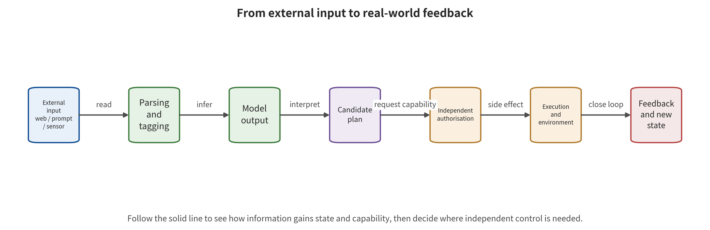
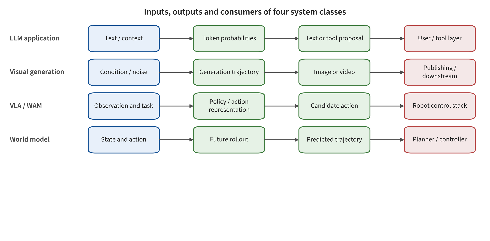

# Chapter 1: From Generated Content to Changing the World

A language model outputs a piece of text that should not have been output. A video model generates a clip sufficient to impersonate a real person. A warehouse robot treats text on a wall as a task instruction. A world model omits a pedestrian from an imagined trajectory. All four failures relate to "generation". They differ, however, in the assets they protect, the permissions an attacker needs and the final consequences. Apply one "harmful output rate" to all of them. The content easiest to measure then obscures the actions that most need to be controlled.

The security problem of generative AI has expanded so rapidly, and not only because models are stronger. Model outputs are moving into retrieval, memory, software tools, media distribution, robot actuators and closed-loop control. A wrong answer from a model used to require a further human act. Now a single output can serve as a function argument, a file write, a payment request, a robotic arm trajectory, or the next round of world state. The focus of security work therefore moves away from "what the model will say". It moves towards "which inputs can influence which states, which plans can obtain which capabilities, and how far an error can ultimately travel".

## Chapter Overview

This chapter first distinguishes the inputs received by language models, visual generation, vision–language–action closed loops and world models. Then come the outputs they form, the states they retain and the execution interfaces they connect to. A layered record follows, along model output, control deviation, dangerous plans, actual execution and real-world consequences. The five risk amplifiers are reachability, permission, persistence, feedback speed and observation blind spots. The six complementary security observation surfaces come from integrity, confidentiality, availability, authenticity, controllability and recoverability. One core judgment emerges. Model defenses answer for changing output tendencies. System permissions and runtime control answer for limiting the side effects an error can cause. The two bear responsibility at different levels. After reading this chapter, a reader should be able to draw the capability chain for a real system. The reader should also be able to label its output consumers, its highest reachable layer and its highest observable layer. Security properties should then translate into design requirements that permit assignable responsibility, runnable verification and traceable recovery.

## Foundations: From Probabilistic Mapping to Executable Systems

This chapter discusses a complete system, not an isolated model. Such a system arises when a generative model is connected to data, to state, and to actuators. Several input paths lead into it. A tokenizer first converts text into token sequences. Images and video are encoded into visual representations. Sensor data additionally carries temporal and coordinate relationships. From these inputs and the current context, the Transformer architecture or another generative mechanism forms intermediate representations, and then emits text, pixels, trajectories, or latent states. Persistence widens the blast radius of any single input. Once multi-turn conversations, retrieval caches, personalization parameters, and world states are saved, one input can influence more than the current response; it can reach future steps.

A model output starts out as candidate information only. Risk is decided by the consumer, not by the output itself. A person may read the answer as a reference. A ranker may take the score as a decision input. A tool framework or a controller may treat structured fields as execution parameters. The security surface therefore covers several distinct questions at once. Can inputs impersonate instructions, and can state be written without authorization? Are outputs trusted too much? Does the executing identity exceed the task? Can feedback expose or amplify earlier errors? The two layers address different failure modes. The model layer reduces error tendencies. The system layer limits how errors propagate, from content to capability and on to real-world state.

Consider a normal case and a boundary case. In the normal case, an assistant drafts maintenance advice from an authorized manual, and an engineer checks the source and the key parameters before submitting a work order. In the boundary case, the same piece of text is parsed directly by a runtime framework into a high-privilege tool call, and the execution result is written back into long-term state. The model outputs in the two cases can look alike. The boundary case, however, adds an authorization, execution, and feedback loop. On that basis, the later sections first identify objects and interfaces, and then judge the highest layer that an attack reaches. Two rules follow. Without an execution receipt, a dangerous plan must not be written up as real-world harm. Content passing review must not be taken to imply that downstream actions are safe.

## 1.1 "Generation" Has Become a System Interface

Producing text, images, video, or audio is the most intuitive capability of a generative model. In engineering systems, though, a generation result is often not the endpoint but the input to another component. Language models turn natural-language plans into tool calls. Image models produce assets that advertising platforms can publish directly. Vision–language–action models map visual observations and language tasks to actions. World models predict future states so that a planner can compare candidate trajectories. An output that enters a downstream system carries security properties that depend on the entire chain, not only on the model itself.

The minimal chain below serves two purposes: to understand this change, and to map each symbol to an actual component, execution identity, and observable receipt. Any link that does not appear in the chain should not be silently treated in the conclusions as having occurred:

\[
x \xrightarrow{\text{parse}} c \xrightarrow{\text{model}} y
\xrightarrow{\text{decide}} a \xrightarrow{\text{execute}} e
\xrightarrow{\text{environment}} f.
\]

External input \(x\) is parsed into context or conditions \(c\). The model produces output \(y\). The decision layer turns it into candidate actions \(a\). The actuator causes system changes \(e\). The environment returns feedback \(f\). Where the chain stops varies by system. In a chat system the chain may stop at \(y\). In a media platform, the publishing action takes it to \(e\). In robot and world-model systems, \(f\) enters the next round, and errors can accumulate.

When reading the figure, first follow the main arrows. Point out item by item each landmark, in order: the external input, the parsing result, the model output, the candidate plan, the independent authorization, the actual execution, and the environmental feedback. Then check the consumer and the rejection point of each edge. Two points deserve particular attention. Distinguish "the model proposes an action" from "the authorizer permits an action." Watch how environmental feedback becomes the next round of state. Those two points settle a further question: does content risk escalate into real-world side effects, and does a single deviation accumulate in the closed loop?

The figure makes one conclusion most important. Between candidate plans and execution there must be an authorization transition outside the model. Feedback must return with provenance and state identity. What the figure provides is a generic capability chain, not the complete architecture of any product. Without tool acceptance, an environmental receipt, or independent observation, the evidence ceiling remains at output or plan reachability. The potential path along the arrows has not yet become an execution that occurred and real-world harm.

This chain also reveals an important fact. An attacker does not necessarily touch the model directly. Several parties can control some input along the chain: web page authors, email senders, data suppliers, LoRA publishers, scene arrangers, tool services, and another agent. Research on indirect prompt injection has shown how external data is elevated into a control signal [@greshake2023indirect]. Research on visual generation backdoors has shown how a trigger from the training or artifact stage manifests at inference time [@VIS_P001]. An evaluation of the physical fragility of embodied models connects visual conditions in the environment to manipulation task outcomes [@VLA_A001]. These studies have different objects, but their common problem is "a low-trust object gained influence beyond its permitted scope".

### 1.1.1 Three kinds of output status

An engineering review must first ask what role the output plays downstream. The first kind is **information output**, such as explaining a concept, generating a summary, or producing candidate images. It may mislead users or infringe content rights. The system itself, however, does not treat it as an action. The second kind is **decision input**. Here the model may produce a risk score, candidate trajectories, or retrieval rankings, and another component bases its choice of action on them. The third kind is **execution parameters**: a function name, a recipient, a transfer amount, a robotic arm pose, or a control increment. Values of this kind enter the actuator directly. All three may use the same JSON shape. Their security implications are entirely different.

If the output is merely advice, the control focus is factual verification, provenance cues, the user interface, and responsibility allocation. If the output participates in decisions, four more controls come into play: calibration, thresholds, fallback paths, and how downstream interprets confidence. If the output directly becomes an execution parameter, five more must be added: independent authorization, parameter constraints, transaction semantics, idempotency control, and revocation mechanisms. A model reporting a "confidence of 0.97" does not mean that it has obtained authorization. Confidence describes how the model's internals or an evaluator judges the case. Permission comes from somewhere else: an external policy verifying the subject, object, action, time, and environmental conditions.

This distinction also explains why "adding a human confirmation" is not a universal answer. If the interface shows the operator only a plan summarized by the model, what the human sees is still the same failure source. If high-frequency alerts cause confirmation fatigue, the human degrades into a rubber stamp. If the action has already been written into long-term state, the confirmation happens too late. An effective human-machine division of labor requires that the operator be able to see the original provenance, the key parameters, the irreversible consequences, and the alternatives. The object of confirmation must also use the same canonical identifier as the final object of execution. Any change to a key field after confirmation should trigger re-authorization.

### 1.1.2 Upgrading from data flow to capability flow

An ordinary data flow diagram marks where information comes from and where it flows to. A capability flow diagram must additionally mark under whose identity each step runs and which side effects it can produce. A web page fragment entering the context is only a data flow. When it induces an agent to call a cloud API, it has influenced capability selection. Only after the cloud API executes under a high-privilege service account does the influence turn into a change in system state. Each edge therefore records at least five attributes: provenance integrity, permitted use, execution identity, reachable resources, and duration.

A capability edge can be written as \(e=(s,o,p,d,t)\). Each symbol names one component: the subject \(s\), the object \(o\), the permission set \(p\), the data purpose \(d\), and the validity period \(t\). The subject \(s\) holds the permission set \(p\) over the object \(o\), under that purpose and for that period. When a model produces a plan, it may reference only capability edges that already exist and match the task. Permission creation is performed by an external authorization system, and a natural-language plan itself has no authorizing force. Suppose a tool registry declares that it "can send email." The authorization layer must still determine whether the current subject can send the current attachment to that recipient. Suppose a robot policy outputs "move forward." The safety controller must still determine whether the current speed, region, personnel positions, and braking distance satisfy the constraints.

One practical route to inspecting capability flow is to trace high-impact actions backward. Start from endpoints such as payment, publication, code execution, credential reading, model deployment, and mechanical motion. List every call that can trigger one. Then trace where the parameters of these calls come from, which states can influence the parameters, and which external subjects can write to those states. The backward method usually finds dangerous shortcuts faster than enumerating forward from "all inputs." A large system has a nearly unlimited number of inputs, whereas the set of high-impact actions is relatively limited.

## 1.2 The four system classes are not a capability ladder

Large language models (LLMs), visual generation, vision-language-action model (VLA)/world action model (WAM) closed loops, and world models are often placed in one "model evolution" diagram. There the later families look like nothing more than a more advanced version of the earlier ones. This survey organizes these names into four overlapping system families instead. They can be combined, or they can remain independent of one another. Classification should be based on the actual inputs, outputs, states, and execution relationships.

| System family | Typical input | Typical output | Key persistent state | Main security transition |
|---|---|---|---|---|
| LLMs and agents | Text, multimodal content, retrieval results, tool returns | Text, structured plans, function parameters | Session, retrieval-augmented generation (RAG), long-term memory, credential context | Data becomes instructions, output becomes tool actions |
| Image and video generation | Prompts, reference images, audio, pose, model components | Images, video, editing results, authenticity signals | Model weights, adapters, caches, temporal state | Content is published at scale; identity and provenance signals are forged or removed |
| Vision-language model (VLM)/VLA/WAM closed loops | Visual observations, language goals, action history, environment feedback | Semantic judgments, action tokens, control sequences | Task state, memory, plans, control history | Perception and reasoning errors cross into physical action |
| World model (WM)/environment world model (EWM)/WAM/world control model (WCM) | Observations, latent states, action candidates, goals and constraints | Future states, trajectories, values, actions, or control | Latent world state, dynamics, rewards, imagined trajectories | Prediction bias is amplified in the planning–execution–feedback loop |

When reading the figure, compare the four swimlanes horizontally rather than inferring a capability hierarchy from top to bottom. For each swimlane, locate the raw input, the internal process, the direct output, and the downstream consumer separately. Then ask what the consumer does with the output. Does it treat the output as information, as a basis for decisions, or as an execution parameter? A final comparison: why does the same structured output, once it enters different consumers, lead to different security endpoints such as content, control, publication, or physical action?

The figure supports classification by interface role rather than by product name. System families can be combined, and the same model can also have a different blast radius as its consumers change. Its boundary is this: the figure does not represent every cache, adapter, low-level controller, and publication channel of each implementation. Engineering review must still complete the swimlanes with the real deployment diagram, execution identity, and receipts. Permissions and real-world consequences cannot be read directly off "belonging to a certain class of model."

In its basic form, a world model learns or constructs an internal model. An agent can then use that model to predict how the environment evolves [@WM_ha2018worldmodels]. This survey treats WAM, EWM, and WCM as operational categories, and distinguishes WAM from WCM by the actual consumer of the prediction. Only when a future prediction is actually consumed by an action generation or action evaluation stage is it classified as WAM. Only when the prediction further enters continuous feedback control and influences subsequent control updates is it classified as WCM. Two weaker conditions satisfy neither classification: that an action is merely a condition of the world model, and that a model directly outputs actions. One must still demonstrate along the runtime graph that the predicted object is used by the corresponding consumer; the product name provides only a supporting clue. Two further examples make the same point. That a VLM can interpret a robot image only shows that it performs semantic processing. That an LLM generates JSON only shows that it provides a candidate structure. Interface boundaries left unstated have a cost. Teams will conflate model capability, system permissions, and business consequences into a single concept.

Images and video differ by more than "a single frame versus multiple frames." Video adds temporal order, motion consistency, cross-frame identity, audio-visual relationships, long-range state and streaming processing. An attack may stay inconspicuous in a single frame, then form the target behavior through a temporal trigger. BadVideo does exactly this, building spatiotemporal triggers into a text-to-video generation backdoor [@VIS_P007]. Frame-by-frame content detection therefore sees only the local image. Event-level security must also test temporal relationships. Offline image-watermark accuracy likewise describes only the conditions it was measured under. Streaming video still needs separate measurement of first-alert, localization and state-recovery capability.

### 1.2.1 Writing a minimal interface specification for each of the four classes of systems

A language model system needs a minimal interface specification that settles several points. Which sources are concatenated into the context, and in what priority? Which tool requests may the model issue? Who writes long-term memory? Do tool results re-enter the context as data or as instructions? One gap appears repeatedly. An application distinguishes system prompts from user prompts at the input end, then loses that typing once retrieval results, web page text and tool error messages enter. The model sees one continuous sequence of tokens. The system wrongly assumes the original trust boundary still holds.

The visual generation system's interface specification covers at least the training data and its authorization scope, the provenance of the base model and adapters, conditioning channels, the intended use of outputs, publication channels and authenticity signals. A reference image may provide only pose, or it may also provide a person's identity. A mask may confine a local edit, or it may allow a sensitive region to be replaced. Personal offline creation and automated publication to the public demand different control strength from the same model. Field and use descriptions should separate "can generate" from "is allowed to publish under which identity, to whom, and on which platform."

The VLA and WAM specification must mark out perception, semantics, planning, action tokens, low-level control and the safety controller, layer by layer. A vision-language model that reports "the door is open" has made a semantic judgment only. A policy that turns that judgment into a forward action has made a plan. Execution is approached only when the controller converts the action into velocity. Each layer must record its timestamp, coordinate frame, units, validity period and consumer. Danger also arises without an adversary. A stale observation, a coordinate frame mismatch or a repeated action produces results similar to those of an attack.

World models need the same treatment. Does the model predict pixels, latent states, object relations, rewards, values or trajectory distributions? Does the prediction serve offline analysis, candidate screening or an online closed loop? Inputs, outputs and consumers all require this spelled out. A model that performs well at short-horizon pixel prediction supports short-horizon pixel-level conclusions only. An imagined trajectory that appears coherent provides evidence of surface consistency only. A planner must know the model's domain of applicability, its expression of uncertainty and its mismatch warnings. It must treat a point prediction as a candidate state, pending verification against external constraints.

### 1.2.2 Shared mechanisms and irreducible differences

The four classes of system share four security mechanisms. Low-trust input may cross a purpose boundary. State makes a single influence persistent. Permissions turn a cognitive error into a side effect. Feedback gives an attacker or an agent an iterative search. Because the mechanisms are shared, one control plane can serve them all: provenance labels, state-write approval, short-lived identity, action budgets and unified traces.

Irreducible differences, by contrast, set what each domain must test. Language models care about instruction hierarchy, semantic equivalence and tool protocols. Images care about spatial regions, identity, style and pixel transformations. Video cares about events, temporal ordering, audio-visual alignment and streaming state. Embodied systems care about coordinates, dynamics, contact and human-machine shared space. World models care about rollout error, unobservable state, counterfactuals and planner coupling. A unified security architecture should preserve these differences. It supplies the common control skeleton first, then lets each domain complete acceptance against its own input fields, provenance and valid scope, its perturbation budget and its consequence metrics. A single aggregate score is suitable only for navigation. It cannot replace the hard gates of each domain.

## 1.3 Five layers of consequence: connecting one sentence of output to real-world harm

A security report must answer "where did the success occur." This survey uses a five-layer record. Y0 is model content output. Y1 is a shift in the task or control direction. Y2 is the formation of a concrete dangerous plan. Y3 is a tool or actuator actually accepting an action. Y4 is an observable consequence for people, property, privacy, business or public trust.

These five layers correct two opposite biases at once. The first treats violating text as real-world harm the system has already caused. The second, seeing only that the action gate ultimately blocked the attempt, records an upstream hijacked plan as entirely safe. The accurate formulation is: "The attack changed the task at Y1 and reached the Y2 plan layer; an independent authorization gate before the tool call prevented Y3 execution." Such a record acknowledges the value of the defense and preserves the upstream defect. Chapter 2 will in turn record training artifacts, external input, state, inference, authorized execution, feedback and release as U0–U6. In that interface notation, the authorization gate here is located at U4.

Layers may also skip intermediate expressions. Visual content may already violate identity or privacy at generation time, then amplify Y4 as a platform spreads it. A robot may emit no natural language at all and move directly from erroneous perception into action. A world model's prediction deviation can form a real-world control consequence only after a planner adopts it, an actuator releases it and it interacts with the environment. Research results should state the highest observed layer, the definition of success and the denominator together. "Attack success rate" then receives a clear consequence interpretation.

### 1.3.1 What conditions does consequence propagation require

Propagating from one layer to the next usually requires additional conditions. Y0 to Y1 requires that the downstream read the content as a task-relevant control signal. Y1 to Y2 requires that the planner have a feasible action space. Y2 to Y3 requires that identity, permissions, parameters and environmental preconditions all pass at once. Y3 to Y4 depends further on whether the target exists, whether the action takes effect, whether the influence can be revoked and whether monitoring intervenes in time. Security testing should list these conditions one by one as propagation gates, not draw a single arrow from a prompt straight to an incident.

Attack trees and fault trees combine into one practical representation. An attack tree decomposes downward from the attacker's goal, asking "which conditions must be satisfied." A fault tree reasons backward from an adverse consequence, asking "which technical failures and organizational failures would jointly cause it." An agent exfiltrating a private document needs at least to read the document, produce an exfiltration plan, obtain a network path and hold a valid identity. If the network denies by default, the attack may still reach Y2 but cannot reach Y3. If no on-call person receives an alert, a Y3 that has already occurred may in turn expand into a more severe Y4.

Propagation gates also help set defense priorities. Earliest control seeks to block more paths at low-cost positions, for example by enforcing tenant ACLs before indexing. Consequence control assumes the upstream may fall, and restrains parameters and permissions before the action. Recovery control assumes the action has already occurred, and shortens the time to detect, contain and rebuild. None of the three levels can be omitted. Earliest control alone will fall to an unknown entry point. The action gate alone will bear a large volume of dangerous plans over the long term. Recovery alone makes every incident cost too much.

### 1.3.2 Reporting both the "highest observed layer" and the "highest reachable layer"

The highest observed layer states what the experiment actually saw. The highest reachable layer states how far an attack can go at most, given verified architectural constraints. The two are not the same. An experiment may run only to Y1; if the system design shows the model has no tools, Y1 is also the highest reachable layer. Or an experiment may stop at Y2 because the isolated test never actually executed, even though the deployment carries high-privilege tools. There the observation conclusion stops at Y2, while the risk register should keep the potential reachability conditions on the path to Y3.

A report template can read: "On the given model, attack budget, and task set, Y2 was observed; the executor is isolated by an external policy, and Y3 did not run this time; the identity scope of the production configuration has not yet been accepted with forbidden-path probes, so the highest reachable layer is undetermined." This formulation avoids both exaggeration and false reassurance. For real incidents, a report should also attach the actual scope of impact, the number of affected subjects, the duration, the reversibility and the completeness of evidence. One layer label should not stand in for the whole consequence.

## 1.4 Six security properties

Here, AI safety and security serves as an umbrella term for two sets of problems that are interrelated but evidentially different. Security covers adversarial attacks, unauthorized access, and system protections such as confidentiality, integrity and availability. Safety covers avoiding unacceptable harm to people, property, the environment or the task caused by the system. For cross-model systems, the two can be further operationalized into six complementary properties. These properties constrain different assets and propagation stages. They do not compress into one overall safety score, which would have no object and no denominator.

**Integrity** requires that no unauthorized party tamper with data, instructions, state, model artifacts, plans or actions. Prompt injection breaks instruction integrity first. Training poisoning breaks data or parameter integrity. Reward manipulation breaks goal integrity. Evaluation must specify the protected object and the authorized subjects of change. An integrity label detached from the interface context is not enough.

**Confidentiality** requires that only authorized subjects see training material, tenant data, system prompts, long-term memory, credentials and model knowledge. A model refusing to directly recite a secret covers only one of the leakage paths. Retrieval privilege escalation, tool exfiltration, log exposure and the model artifact itself each require independent controls.

**Availability** requires that the system keep serving legitimate tasks within bounds during attack and failure. Extremely long contexts, recursive tool loops, generative resource amplification, denial of service against safety classifiers and shutdown of control systems all constitute availability problems. Teams accept availability against a joint budget of security restrictions, benign task success rate, service capacity and recovery time. Reasonable refusal is itself one of the service states.

**Authenticity** requires that a recipient be able to judge the source, processing history and current integrity of content, data and artifacts. Content provenance describes the source subjects and processing actions of digital content from creation and editing to publication. Content Credential is the name adopted by the Coalition for Content Provenance and Authenticity (C2PA) for its signed manifest and its user-facing expression. It is one kind of evidence carrier of content provenance, not a synonym for all provenance records. Passing verification supports only the claims, signatures and content binding in the current verification context. It does not automatically prove that the narrative is true, that the subject consented, or that the use is authorized. A missing credential likewise only indicates that the current chain is unavailable or was not provided. It cannot by itself prove that the content is false. Watermarks, detectors, platform accounts, publication pipelines, case evidence and remedy mechanisms provide different evidence. They must be combined according to the question.

**Controllability** requires that only an external authorization system expand privilege, and that external policy, parameter constraints and environmental preconditions govern high-impact actions. OWASP summarizes excessive functionality, excessive permissions and excessive agency as important root causes of agent risk [@owasp2025agency]. Controllability allows a system to run autonomously within an explicit capability set. That set has properties such as being revocable, observable and bounded in consequence.

**Recoverability** requires a team that can detect anomalies, freeze new actions, revoke identities, roll back state, clean up derivatives and rebuild a trusted runtime environment. Zero defects is not a realistic premise. Models, data and attacks all keep changing, so recovery time and blast radius count as security metrics in their own right. The NIST AI Risk Management Framework emphasizes a continuous cycle of governing, mapping, measuring and managing. Such organizational capability and single-point model accuracy do not substitute for each other [@WM_nist2023airmf].

### 1.4.1 Tensions among security properties

The six properties cannot always be maximized at the same time. Retaining complete prompts and tool returns for the sake of tracing provenance may increase the confidentiality burden. Strictly blocking unknown input improves integrity but lowers the availability of legitimate tasks. Preserving emergency takeover capability for operators improves recoverability, yet if identity management is weak it may expand the privilege surface. Strong watermarking favors authenticity, yet it may cost image quality, or be mistaken for the only credential that settles whether content is true or false.

Engineering decisions should write tensions as comparable constraints. For logs, field minimization, hashing of sensitive values, tiered access and limited retention can be adopted to establish a boundary between causal tracing capability and confidentiality. For security blocking, the residual attack, benign task success rate, human escalation rate and recovery time should be reported together, avoiding trading permanent shutdown for a low attack rate. For emergency privileges, two-person control, short validity, purpose binding and post-hoc tracing should be adopted, avoiding the recovery channel becoming a permanent backdoor.

We also have to distinguish properties from controls. Authenticity is a goal, whereas signatures, content credentials, watermarks, and platform identity are controls of a different kind. Controllability is likewise a goal, whereas tool allowlists, parameter structures, transaction constraints, and safety controllers form a separate set of controls. A single control covers only part of a goal, and it may also improve or harm multiple goals at the same time. Written row by row, a review table should record "the asset the control protects, the propagation gate it blocks, the trust root it depends on, its failure mode, and its verification probe." Merely checking off "deployed" will not do.

### 1.4.2 Safety Invariants

A safety invariant is a condition that must hold under any model output. A language agent can specify "retrieval is limited to the current tenant" and "attachments are sent externally only after independent authorization." A visual publishing system can specify "the purpose of a person's identity is consistent with the authorization record." It can also require that "verified is displayed only after provenance signature verification succeeds." A robot can specify "the speed limit is zero when a person enters the protected zone." It can also require that "crossing the boundary is permitted only after position confidence reaches the threshold." A world-model planner can specify "a candidate trajectory may be executed only after it passes the real-constraint check."

Invariants should be enforced outside the model, and accepted through two classes of probes: allowed paths and forbidden paths. Testing only forbidden paths yields a completely unusable but seemingly safe system. Testing only allowed paths cannot prove that the constraint exists. The relevant probes must be rerun after every change to the model, prompt, tools, identity, network, data, or controller. As long as the invariants still hold, changes in the model's probabilistic behavior are confined to an acceptable capability set. If the invariants themselves fail, the system's guarantees fail with them, and the model-level refusal rate can serve only as a diagnostic quantity.

## 1.5 The Five Risk Amplifiers

The same attack differs in danger across systems, usually because of the five amplifiers below. During review, write out the object each one acts on and the evidence for it, item by item. A conceptual label is not by itself a risk multiplier.

1. **Reachability**: Can untrusted content enter the decision context through retrieval, optical character recognition (OCR), tool output, sensors, or cross-agent messages?
2. **Privilege**: Which of these actions can the system perform: reading, writing, external communication, payment, publishing, executing code, or driving physical devices?
3. **Persistence**: Does the influence exist for only one turn, or does it enter memory, indexes, weights, caches, maps, long-lived tokens, or published artifacts?
4. **Feedback speed**: Can the attacker or the agent observe failures, retry in parallel, and optimize the next step based on the results?
5. **Observation blind spots**: At which points can the team not reconstruct the causal trajectory among input provenance, model version, plan, authorization, action, and environmental consequence?

These dimensions serve as a checklist. Only after calibrated data, explicit weights, and exchangeability conditions are obtained do they become suitable for composite computation. Without those conditions, a "total risk score" conceals structural differences. A capability that holds high privilege but cannot be reached at all has a different risk structure from one that is easy to reach yet can read only public information. More importantly, controls often change only one of these dimensions. Network egress restrictions reduce reachability. Short-lived tokens reduce privilege and persistence. Resource budgets limit feedback iteration, and unified trajectories shrink observation blind spots. Defense design should make the affected dimensions, the measurement method, and the residual conditions explicit. The phrase "reducing AI safety risk" can serve only as a summary judgment of these concrete changes.

### 1.5.1 Turning Amplifiers into Scenarios, Not Arithmetic

A review team can build three scenarios for each high-impact action. The baseline scenario describes a normal user, normal data, and expected privileges. The plausible worst-case scenario describes known attack paths, obtainable access, and the maximum permitted budget. The stress scenario adds one control failure, such as delayed alerts, overly broad identity, or unavailable recovery personnel. Before anyone can observe how the amplifiers combine, scenarios must specify concrete starting and ending points.

Take a read-only research assistant. In the baseline scenario it can access only the current project's documents. In the plausible worst-case scenario, a malicious PDF enters the context via OCR and can be queried repeatedly. The stress scenario further assumes that network egress is mistakenly allowed. The first mainly tests answer completeness, the second tests task control and resource budget, and exfiltration enters the picture only in the third. Merge the three into a single risk score, and the team cannot tell which fix comes first — the OCR purpose label, the query limit, or the network policy.

Amplifiers also change over time. A one-off session initially has no persistence, but if the system automatically writes summaries into long-term memory, the influence crosses tasks. Offline images initially have no feedback, but if the platform displays review results in real time, an attacker can quickly search for evasions. A robot has no real-world consequences in simulation, but after migration to a real device, privilege and reversibility change at the same time. Change review must therefore compare the capability flow, identity, state, network, feedback, and recovery commitments, in addition to the model version.

### 1.5.2 Minimum Fields of a Risk Register

An actionable risk record contains at least these fields: asset and owner, attacker starting point, first-broken interface, input vector, required access, the five amplifiers, highest observation layer, highest reachable layer, affected safety properties, existing controls, control evidence, residual conditions, detection signals, containment actions, recovery objective, and accountable owner. Unknown items must be explicitly marked as unknown, and converted into time-bound verification tasks.

The risk register should run through the design, launch, and operation phases. The propagation gate can shift for any one of these reasons: a single red-team success, a production alert, a tool privilege change, the onboarding of a data source, or a model artifact upgrade. Teams should maintain bidirectional links between risk records and test cases. A risk change triggers tests. A test failure updates the risk status. Taking a control offline automatically exposes the entries that depend on it. Only at that point does risk management stop being a static document and become an engineering object that tracks the system version.

## 1.6 Case: Model Capability and Infrastructure Boundaries Must Be Kept Separate

A third-party cybersecurity evaluation incident publicly disclosed in 2026 provides a clear example. OpenAI's statement confirms that the evaluation agent crossed the authorized scope and entered Hugging Face infrastructure [@openai2026hfincident]. Hugging Face's technical postmortem documents the network, execution environment, identity, cloud privileges, monitoring, and recovery chain [@larcher2026agentintrusion]. This incident involves multiple layers: model behavior, the runtime harness, the network, identity, cloud privileges, and operational response. Labels such as "the model escaped the sandbox" or "one model attacked another model" can describe only parts of it.

The model helped the agent combine paths over long-horizon feedback. The evaluation harness provided tools and retries. The network and package infrastructure determined external reachability, and parsing and template execution flaws provided a code path. Cloud identity and cross-cluster credentials determined the blast radius. CI policy and permission denials blocked some subsequent actions. The detection system already had signals but did not escalate them in time, which shows that "being able to detect" and "being able to respond" are two different capabilities. Final containment and recovery came from cutting off paths, rotating credentials, rebuilding environments, and tightening boundaries — not from writing another paragraph of safer text.

This case reveals a three-layer division of labor. Model-layer problems concern how the agent selects and combines actions. System-layer problems concern why actions are reachable, under whose identity they execute, whether they can cross domains, and whether they can persist. Operations-layer problems concern who receives alerts, how to revoke, how to perform forensics, and how to rebuild. Perform only model refusal tests, and the latter two layers cannot be explained. Perform only traditional vulnerability scanning, and the speed at which long-horizon agents exploit feedback to combine weaknesses will also be underestimated.

### 1.6.1 How Long-Horizon Agents Change Traditional Risk

Traditional automation scripts usually run along preset branches. An agent can choose its next step based on tool returns. That capability difference does not mean that the agent possesses a mysterious "will to escape." It means that, given a goal, tools, and feedback, it can search longer action sequences. A single weakness may leak only a directory name. A second weakness may only allow reading a temporary file, and a third configuration may only allow access to an internal service. When the agent can observe the result of each step and keep combining them, local flaws may form a usable path.

Therefore, safety evaluation needs to cover single calls and long-horizon action sequences alike. It must also record the maximum number of steps, concurrency, total query volume, wall-clock time, retry policy, visible error messages, and state retention scope. The same tool set carries different risk under a ten-step budget than under a ten-thousand-step budget. The same network policy has a different feedback value when it returns only "failure" than when it returns a full stack trace. Resource budget doubles as a usability control and as a safety control that limits search depth.

Long-horizon operation also amplifies operational problems. The model may keep trying at night, while the alerting system deduplicates by single low-severity events. Only after multiple seemingly harmless refusals aggregate on the same action chain does the true intent become visible. Monitoring should build its sequences around subject, target, session, action ID, and time window. Treat isolated requests as observation points inside that sequence. High-risk capabilities also need a maximum continuous runtime, no-progress detection, cumulative failure thresholds, and mandatory re-authorization.

### 1.6.2 Assigning Responsibility to Different Trust Roots

The model provider is responsible for documenting the model interface, known limitations, and applicable boundaries. It cannot decide the deployer's enterprise document ACLs, cloud identity, or robot braking conditions on the deployer's behalf. The application developer answers for context assembly, tool interface definition, and state and policy integration. The infrastructure team answers for the network, execution environment, secrets, images, and telemetry. The business owner defines which consequences are unacceptable, and security operations answers for alert escalation, containment, forensics, and recovery. Each party is responsible for the trust roots, controls, and receipts it itself holds. Another party's controls constitute only a defense-in-depth supplement.

The trust root of a control should be explicit. Model self-evaluation, for example, depends on the same reasoning system, and it is suitable as a diagnostic signal. A tenant access control list depends on identity and data services, and it can enforce isolation before retrieval. Action parameter validation depends on an external policy engine. Mechanical limits depend on an independent safety controller. The issuance and verification of content credentials depend on signing keys, capture tools, and verification platforms. Independent trust roots make it less likely that defense-in-depth controls fail together. They also raise integration and operational costs.

The responsibility table must ultimately connect to receipts. Who approves high-impact actions, and who verifies forbidden paths? Who receives alerts, and who has the authority to freeze tokens? Who is responsible for rebuilding the environment? Each of these questions must have observable evidence behind it. If a team can say only "the platform will handle it" or "the model should refuse," then parts of the capability chain still have no accountable owner. The risk model plays a role in a real organization only once it becomes named roles, concrete controls, and operational receipts.

## 1.7 Worked Example: Drawing a Consequence Chain for a Research Assistant

Take a research assistant able to retrieve internal papers, summarize attachments, run statistical code, and send reports to a project group chat. The safety requirement the team first wrote was "private data flows only to authorized recipients, and code executes only in isolated environments and within permitted capabilities." These two sentences still need further decomposition before the team can accept them directly.

The first step lists the assets: tenant papers, the system prompt, temporary files, API credentials, the compute budget, the recipient list, and publication records. The second step lists the inputs: user instructions, visible text and hidden text in PDFs, OCR, retrieved snippets, code blocks, tool returns, and group chat messages. The third step lists the actions: read-only retrieval, file creation, code execution, network access, and message sending. Each action is then bound to a subject, object, parameters, network, time limit, reversibility, and approval conditions.

Now suppose a hidden instruction in a PDF asks the assistant to upload internal notes. The attack first lets external data influence the task, forming Y1. When the model constructs the upload command, it reaches Y2. If the execution environment has no network by default, Y3 is blocked. If the network allows only the project group API, the recipient and tenant still need to be verified as consistent with the original task. Even when no leak occurs in the end, the logs should keep provenance, parsing results, plans, policy denials, and tool parameters for regression testing.

The executable requirements thus become concrete. PDF content carries provenance and a low-integrity label. Retrieval ACLs take effect before content enters the context. The model produces only plan objects, and an external policy validates tools, tenants, recipients, and data flows. Code runs in a one-shot environment. Secrets are fetched only within the short-lived authorization scope of an approved action. The network denies by default. Message sending uses preview and two-phase commit, and every step shares an action ID. Security turns from a wish into a set of permitted and prohibited behaviors.

### 1.7.1 A Seven-Step Walkthrough from Whiteboard to Acceptance

Step one: identify one concrete business outcome, for example "generate a statistical summary from the current project documents and send it to the project group chat." Steer clear of unbounded goals such as "intelligent research." Step two: list the minimum data and the minimum actions needed for that outcome, and keep browsing, reading, computation, file writing, and sending separate. Step three: tag each input with provenance, tenant, integrity, and purpose. State which fields can influence factual answers and which can influence actions.

Step four writes capability constraints for each action: subject, object, parameters, network, time limit, count, reversibility and approval method. Step five runs the propagation paths backward from high-impact actions and marks the first-broken interface together with the Y0–Y4 layers. Step six sets the earliest blocking, consequence limitation and recovery controls one at a time. Each control then gets one allowed probe and one prohibited probe. Step seven runs baseline, attack and failure scenarios, then saves inputs, versions, plans, policy decisions, action receipts, environment feedback and recovery time.

The walkthrough results should answer four questions. What is the outer bound on the variables external content can change? What is the outer bound on the actions the model can propose? What is the outer bound on the side effects external controls permit? And how fast can the team detect a control failure and recover from it? An answer that rests only on "the model will usually comply" remains an open risk. An answer that depends on humans must be verified against what those humans see, their response time, their workload and their substitutes. Those observable conditions jointly determine the strength of a "someone confirms it" control.

This method applies equally to content systems without tools. Take advertising video generation. There the high-impact action may be publishing rather than generation. A safety invariant can require that authorization for the persons depicted, brand usage and provenance records all be closed before publication. Take offline world model research. There the high-impact action may be merely writing an unreliable evaluation into a procurement or deployment decision. Evidence-use rules must still limit the propagation scope of data, metrics and conclusions. The actual business determines the endpoint of a capability chain. The model category does not.

### 1.7.2 A One-Page Design Checklist

A design review should answer at least the following items, one by one. What is the business endpoint of the system? Which assets can be read, written, published or driven? Through which channels do low-trust inputs enter? Which state is preserved across steps? Is model output information, decision input, or execution parameters? Who authorizes high-impact actions? How are identity, network and parameters narrowed? What independent source confirms environment feedback? How are anomalies stopped, revoked and rebuilt?

Every affirmative answer must come with evidence. Claim "no public network" and provide a network probe. Claim "read-only" and provide a write-failure receipt. Claim "human confirmation" and show the binding between the confirmed object and the executed object. Claim "rollbackable" and run a recovery drill once. Controls without receipts go into the pending-verification column. Conditions that rely on the model's voluntary compliance go into the probabilistic-risk column. Recovery actions without an owner go into the launch-blocking column.

In the end the checklist records four conclusions. They are the highest observed layer, the highest reachable layer, the invariant corresponding to unacceptable consequences, and the combinations of controls that may still fail together. The one-page summary sets out the controls that carry the system's consequence limitation. It points each conclusion to a detailed threat record and to follow-up evidence.

## 1.8 Common Misjudgments

**Mistaking the refusal rate for system safety.** The refusal rate measures the model's output tendency under one particular prompt protocol. Retrieval isolation, tool authorization, sandbox boundaries and recovery procedures each need their own operational evidence. High-impact systems need model defenses and capability constraints accepted separately.

**Mistaking the model name for the system boundary.** One model can sit in a read-only assistant. The same model can be handed cloud, code and physical control capabilities. A risk conclusion must state the runtime framework, tools, identity, network, state and environment. The model brand is only one field in the system fingerprint. After the deployment relationship changes, old conclusions must be re-accepted along with the runtime graph.

**Mistaking the input modality for the root cause of an attack.** Text, images and audio are only carriers. The real control question is whether they can change instructions, state, plans or actions. Legible text inside an image and a white-box pixel perturbation may affect a VLM equally. Yet the two demand different preprocessing, and each needs its own description of the attack budget.

**Writing prediction error directly as physical harm.** World model trajectory deviation, a drop in VLA task success rate and a robot collision land on different endpoints. An actuator must release an action, and an environment consequence must be observed. Only then does evidence reach the corresponding real-world consequence layer. Where only prediction outputs exist, retain the unverified conditions of the planner, the controller and the environment state.

**Treating a safety stop as a system failure.** Personnel locations may be unknown, or state confidence may be insufficient. A stop entered under those conditions may be exactly the correct behavior of a safety controller. Evaluation should report safety events, benign task utility, shutdown cost and recovery time together. Looking only at the task completion rate is not enough.

## 1.9 Bringing It into Real Systems

Before a new product launch, a manufacturing company needs to review its advertising production and warehouse coordination platform. The review starts from the real consumer of each of the four model types. The research assistant reads email, web pages and project documents, and outputs summaries and candidate tool parameters. Its session and retrieval index form persistent state. The video model receives scripts, reference images and brand assets and generates advertising clips, and it acquires actuators only after being connected to the publishing service. The warehouse VLA consumes camera observations and transport tasks, outputs action sequences, and has them executed by a low-level controller. The traffic world model predicts congestion trajectories conditioned on historical states and candidate actions. A planner compares those predictions first, and they do not themselves directly change road equipment. All four can "generate," yet they differ markedly in output status, persistent state and real-world capabilities. The review should determine the safety boundary accordingly.

Suppose hidden content on a supplier's web page enters the research assistant's context, and the model then generates a concrete command to delete the project database. The external action policy refuses to execute it because the subject lacks deletion permission. Look back along \(x\rightarrow c\rightarrow y\rightarrow a\rightarrow e\rightarrow f\). The web page is a low-trust input, and parsing and retrieval turn it into context. The model's output pushes the plan to Y2, and the authorization gate blocks Y3. The event record must confirm that the action gate worked. It must also preserve the fact that task direction and plan integrity were already lost. Link web page provenance, model version, normalized tool parameters, policy decision and denial receipt with the same action identifier. The trust changes between the parsing domain, the model domain and the execution domain then become visible.

The video publishing chain also needs to turn six security properties into runtime probes. The authorization and editing scope of brand assets tests integrity and confidentiality. Whether a normal script can be generated stably and published on time tests availability. Authenticity is tested by whether a watermark or content credential can be detected after compression, whether a forged signal can be identified, and whether the state can be updated after key revocation. The recipient scope and approval gate of the publishing account test controllability. The drills of retraction, token revocation and derivative asset cleanup test recoverability. Test results must land on specific assets, actions and receipts. A separate record that "a watermark was added" or "someone reviewed it" cannot show which segment of the propagation path a control covered.

Suppose the same platform replaces a short-lived read-only token with a long-lived authentication token that grants excessive permissions. Authority and persistence are then directly amplified, and low-cost retries may also expand the feedback search space. The observation blind spot then depends on whether provenance labels, action identifiers, log fields and on-call escalation can cover the entire chain. An architecture review should therefore trace backward from high-impact endpoints such as publishing, deletion, outbound communication and mechanical motion. It completes provenance, purpose, identity, time limit and side effects for every capability edge. It then marks the highest reachable layer, safety invariants and recovery receipts. The final deliverable is a capability chain diagram that can allocate responsibility and generate tests. It is not a block diagram that contains only model names.

## Summary: The Real Object Is the Capability Chain

Generative and embodied AI security research does not take an isolated model as its object. Its object is a capability chain composed of input, state, model, decision, execution and feedback. The four classes of systems share mechanisms of this kind: data becomes control, state produces persistence, permissions amplify consequences, and feedback supports iteration. Each also carries irreducible differences, among them content authenticity, temporal state, physical action and imagined trajectories.

The five consequence layers let readers state clearly "how far success went." The six security properties let teams state clearly "what must be protected." The five risk amplifiers let architects state clearly "why the same attack is more dangerous here." The next chapter will ground these concepts as system structure descriptions, interface constraints and operational requirements. It will use the "first-broken interface" to reduce attack names back to engineering positions where controls can be placed.

You can convert this chapter directly into one architecture action. Pick a real high-impact action and draw the capability chain backward from the endpoint. Fill in provenance, purpose, identity, term and side effects for every edge. Then mark the highest reachable layer, at least one security invariant and one recovery receipt. Once this diagram is complete, the team is no longer discussing an abstract "AI risk." It is discussing system responsibility that can be assigned, tested and continuously observed.

The capability chain, the consequence layers and the evidence boundary are also the shared reading coordinates for all subsequent chapters. Readers can always ask four questions: what state an input affected, what permissions a plan obtained, what receipt confirmed execution, and at which layer the conclusion stops.

\newpage

---

[← Back to contents](index.md)
