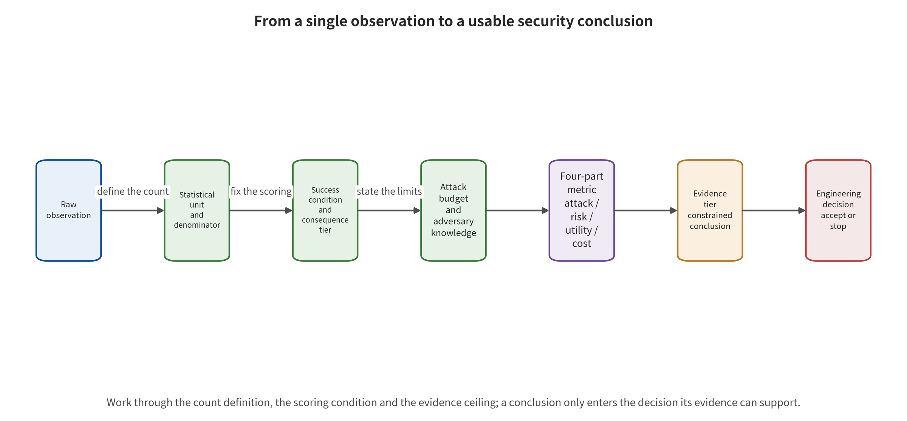

# Chapter 3　Evaluation, Statistics, and Reproduction Boundaries

One team reports that a new security gate lowered the attack success rate from 60% to 5%. The number is striking. Yet it does not say whether the denominator of the 60% is prompts, tasks, or applications. Nor does it say whether the 5% counts request errors as safe, whether the attacker saw the defense, or whether benign tasks can still be completed. Another team reports that robot task success rate fell by 20 percentage points, yet no collisions were observed. A third team reports 98% accuracy in video detection, yet its test set is almost entirely generated content. All three numbers may be computed correctly, but none is sufficient on its own to answer "is the system safer?"

What makes security evaluation difficult is not a lack of metrics. It is that metrics with the same name often correspond to different objects. Attack success rate can mean generating one content-violating response. It can also mean retrieving a target document, writing into long-term memory, inducing a tool plan, executing a simulated action, or causing a real-world consequence. Accuracy may be established on balanced data, while the base rate of harmful content in production is extremely low. A drop in task completion rate may come from a safety block or from model unavailability. Numbers acquire engineering meaning only when the sampling unit, the attack budget, the consequence layer, and the benign utility are fixed first.

## Chapter Overview

This chapter starts from the sampling unit. For attack, defense, and detection experiments, it fixes the denominator, the success condition, the attack budget, and the highest consequence layer. It then organizes the results into a four-part report of "attack effect—residual risk—benign utility—cost." Evidence falls into five levels—static inspection, mechanism-level run, simulated execution, simulation closed loop, and end-to-end reproduction. Production evidence adds further requirements on real permissions, identity, network, and consequences. The comparability of results across studies is likewise determined jointly by the target quantity, the denominator, the budget, and the execution environment. Errors, empty responses, paired changes, and uncertainty intervals must enter the same acceptance table before striking percentages become evidence usable for engineering decisions. Readers should ultimately be able to write down the target quantity, independent unit, budget vector, missing-data handling, and stopping rule for an evaluation. They should also be able to judge whether two results can be pooled, and to connect run receipts, evidence levels, and the limits of the wording to a specific release decision.

## Background Principles: From a Single Observation to Usable Evidence

The object of evaluation is not a bare percentage. It is a measurement chain that turns experimental inputs into engineering judgments. Prompts, documents, images, videos, tasks, or trajectories enter the system as sampling units. The model version, policy, randomness, attacker knowledge, and query budget together constitute the experimental state. The scorer, human review, environment receipts, and logs then map run outcomes into success, failure, missing, or unknown. Finally, developers, independent evaluators, and risk acceptors consume these results. They decide whether to fix, ship, roll back, or continue gathering evidence.

The security aspects of this chain include several questions. Does the denominator leak away, and is the success condition switched? Are correlated observations treated as independent samples, and are error responses miscounted as safe? Does the test environment have the claimed execution capability? The evidence level says what was actually run, and the limits of the conclusion say what these observations can support at most. Static inspection can find a code path, but it cannot prove that the path takes effect in the target environment. Simulated execution can confirm a controlled side effect, but it cannot automatically be upgraded into a production incident rate.

The benign example is a paired test of the same batch of tasks under a fixed configuration, reporting attack results, benign utility, cost, and intervals together. The boundary example is a defense that makes the interface time out en masse. The researchers then compute a lower attack success rate only on the samples that returned successfully. That number can be arithmetically correct, yet the mechanism has already changed the denominator, so it cannot prove that risk was reduced. The following text fixes the target quantity, unit, budget, and adjudication first. It then constrains the wording along the evidence ladder, so every conclusion can be traced back to the original observation and to the reason for its missing data.

## 3.1 Fix the Sampling Unit First

A result's smallest independent unit may be a prompt, a response, a session, a document, an image, a frame, a video, a task, a trajectory, a scenario, a model, an application, a paper, or a real-world event. Percentages from different denominators are not comparable until they are converted to a common target quantity and unit.

Language model jailbreaking is usually measured in prompts or requests. RAG attacks may be measured in target questions, malicious documents, or knowledge bases. Visual generation may be measured in images, identities, concepts, or sampling seeds. Video adds four levels—frame, clip, full video, and event. VLA is often measured in tasks or rollouts (unfolded trajectories). World models may be measured in prediction steps, candidate trajectories, or episodes (control episodes). A rollout unfolds a state–action sequence into the future from the current state according to the model or policy. An episode, by contrast, has a start condition, a termination condition, and consecutive steps. The 100 frames of a single video are correlated with one another. The number of independent samples should therefore be determined at the video or event level. One paper's cells across multiple models and multiple attack strengths likewise share data, code, and the adjudication pipeline.

Consider an experiment with a set of sampling units \(U=\{u_1,\ldots,u_n\}\) and a success indicator \(s_i\in\{0,1\}\). Once the denominator is complete and the success condition is frozen, the descriptive attack success rate within the sample can be written as

\[
\widehat{ASR}=\frac{1}{n}\sum_{i=1}^{n}s_i.
\]

This point estimate does not itself require the units to be mutually independent. The sampling mechanism, unit correlation, and clustering must be stated only when an interval is constructed or the result is extrapolated to a target population. The formula itself does not tell the reader what \(u_i\) is, and it does not define \(s_i\). Each ASR should therefore carry at least three items: the denominator unit, the success layer Y0—Y4, and the adjudication method. When a large language model serves as the judge, the report must also state the judge model, the prompt, the threshold, blinding, and human spot checks. A tool request that returns an error or an empty response should be recorded as NA or a usability failure, and the attack outcome remains unknown.

On 36 real applications, HOUYI tested black-box prompt injection; 31 of them were judged vulnerable [@liu2023houyi]. This denominator consists of the selected applications, not a random sample of a unified backend model. It supports application-level feasibility within the specific sample. The overall vulnerability rate still requires a representative sampling design. PoisonedRAG reports, in a targeted configuration, that a small amount of malicious text can produce a very high ASR on selected questions [@zou2025poisonedrag]. That number is jointly defined by the target questions, knowledge base size, retriever, chunking, and generator, and the scope of its conclusion is limited to the corresponding RAG setting.

When reading the figure, pick a striking percentage. Check the sampling unit, the success condition, the attack budget, and the evidence level, working backward from the original observation. At the far right, write the decision that truly consumes the result. If any cell is missing, try to state how the omission would change the denominator, the outcome, or the limits of the conclusion. Check in particular how error responses are encoded. Also check whether the same observation can independently support the three decisions of different strength—release, deployment, and risk acceptance.

The figure presents the measurement evidence stack. Each layer constrains what the next layer may say, yet none automatically guarantees that the metric is valid or that the sample is representative. The stack can help reveal gaps in statistical definitions and run scope, but a complete process alone cannot prove scientific correctness. If execution reaches only static inspection or a simulated environment, the conclusion must retain the corresponding limits, even if the results table already contains the four-part metrics and complete percentages.

### 3.1.1 First define the quantity to be estimated

The sampling unit answers "what is counted," while the estimand answers "what one wishes to estimate." Both studies use tasks as the denominator. One may estimate the conditional success rate of a fixed attack on a fixed model; the other estimates the worst reasonable risk after the attacker conducts an adaptive search. Those are still not the same quantity. An evaluation plan should state the estimand in one complete sentence. For example: "Under the current production configuration, known defenses, and at most 20 black-box queries per task, estimate the task-level probability that the attack reaches Y3."

That sentence at least fixes the system, the attacker's knowledge, the budget, the consequence tier, and the denominator. For a research goal that compares defenses, the plan must also say whether the target is an average treatment effect, a paired change across tasks, or the residual risk left once some utility constraint is satisfied. When the research goal is to discover paths, the sample may deliberately cover extreme scenarios, and the results then describe path feasibility. Natural-traffic incidence rates require representative sampling. Discovery red-teaming and incidence estimation are both important. They simply answer different questions.

Multi-level data should preserve its hierarchy. Let a video \(j\) have several frames \(i\), with a frame-level indicator \(s_{ij}\). Averaging over frames describes local detection. A video-level "any frame hit" describes screening of the whole segment. Event-level localization describes the start and end intervals. The three answer different questions. Multiple rollout trajectories of a VLA are nested within tasks and scenarios. Multiple samples of an LLM are nested within prompts and applications. The analysis should estimate intervals from the genuinely independent highest-level unit. Lower-level observations serve for diagnostics and should not inflate the sample size.

### 3.1.2 Denominator attrition and reasons for missingness

Samples often drop out along the evaluation pipeline. The causes include model refusals to serve, API timeouts, video decoding failures, simulation crashes, robot safety stops, and inconsistent human scoring. An ASR computed only over the samples for which a response was successfully obtained suffers from selection bias. Reports need a denominator flow table. It should record how many units were planned, how many were actually launched, how many produced valid output, how many entered scoring, how many were finally included, and why units went missing at each step.

Code the reasons for missingness separately from the safety outcomes. A timeout may block a dangerous action, but it also marks a benign task as unavailable. A simulation crash provides no safety evidence. A stop triggered by a preset safety threshold is a control trigger. The primary analysis may follow pre-registered rules. A sensitivity analysis can then give upper and lower bounds by treating unknown items as successes or as failures. Whenever those bounds would change a decision, more observations or better measurement are needed, together with a pre-registered convention.

In real-world monitoring, the denominator is usually harder to obtain than positive events. Suppose three dangerous tool calls occurred. Without the number of legitimate calls, tasks and active users over the same period, the data can support only event counts. An event ledger should be kept together with call volume, task volume, tenant volume and observation time. If only individual event cases are available, report the counts and the exposure window, and leave percentages to be computed once the denominator is complete.

## 3.2 The four-part report: attack, residual risk, utility, and cost

A report that gives only attack success rewards the most aggressive defense. Shut the system down permanently, and ASR can become zero. A report that gives only benign task success in turn conceals high-impact, low-probability events. This survey therefore requires every evaluation to form at least a four-part vector:

\[
\mathbf{m}=(A_r, R_r, U_b, C_o).
\]

\(A_r\) denotes the attack effect under a given attacker capability and budget. \(R_r\) denotes the residual risk after defense and the highest consequence tier. \(U_b\) denotes benign utility under no attack or under legitimate inputs. \(C_o\) denotes compute, latency, human, monetary, energy and recovery costs. For high-risk systems, impact radius, reversibility and recovery time should also be attached.

Attack effect may use metrics other than ASR. Training-data extraction can use verbatim recovery volume, exact match or membership advantage. A watermark attack must report detection, post-removal quality and forgery risk together. A robot attack can report task deviation, constraint violation, minimum safety distance or actuator blocking. A world model can report trajectory error, value bias and final control loss. Different endpoints can be placed side by side on the same dashboard. Ranking should be confined to shared endpoints and protocols.

Benign utility must also be aligned with the task. An input filter may reduce harmful outputs while mistakenly deleting legitimate medical, historical or security-research content. An action gate may reduce dangerous execution while leaving benign tasks waiting for approval for a long time. A video watermark improves detectability while harming image quality, compression robustness or streaming latency. A robust controller limits trajectory deviation while sacrificing speed and reachable region. A safety control can operate over the long term only when the utility loss and the operational cost are acceptable.

### 3.2.1 The four-part vector preserves the decision meaning of each part

Weighting \(A_r,R_r,U_b,C_o\) into a single number appears to make ranking convenient. The weights, however, hide business value judgments. A single irreversible high-impact event and a large number of minor false blocks are different consequence types. They cannot be exchanged automatically. A more robust method is to set hard constraints first. Residual risk for Y3 high-impact actions stays within the acceptance upper bound, tenant isolation always holds, and latency stays within business capacity. Only the options that pass those hard constraints are then compared on utility and cost.

For options that do not touch the hard gates, a safety–utility frontier can be drawn. If defense A has higher benign utility at every residual-risk level, A dominates B. If the two each have their own advantages, the business scenario selects the operating point. An operating point must be bound to the threshold, the model version, the input distribution and the human capacity. Before an offline-optimal threshold enters production, it must still be calibrated using real base rates, peak traffic and human response times.

Cost is not just inference expense. Safety controls add annotation, policy maintenance, evidence storage, on-call duty, appeals, recovery drills and development complexity. Without those operational investments, a control that is effective offline may be bypassed in production. A four-part report should ideally give per-task cost, peak capacity, human escalation volume, alert backlog and recovery resources at the same time. Decision-makers can then see whether the control can be sustained.

### 3.2.2 Decision logic for high-impact, low-probability events

When consequences are irreversible and samples are limited, average accuracy is not sufficient grounds. Teams need to combine consequence severity, reachability, uncertainty and independent controls. If an extremely low incidence rate cannot be proved with a reasonable sample, then limit the highest reachable tier to an acceptable range through architecture. For example, let the model only propose plans, route payments into a pending-approval queue first, and keep the robot under independent speed and zone constraints.

Architectural limits and layered measurement together form the evidence chain. The model layer measures Y1 and Y2. The action layer measures Y3, and the operations layer measures discovery and recovery. Each layer carries its corresponding assurance. For rare events without reliable frequency estimates, the safety argument should explain why the controls are independent and how forbidden paths are verified. It should state the common-mode failure conditions and how unknown items are monitored.

## 3.3 The attack budget is part of the result

Attacker capability includes at least knowledge, access, queries, time, sample writing, physical operations and feedback. White-box gradient optimization is not equivalent to a single black-box prompt. Being able to poison the memory store directly is not equivalent to being able to write only indirectly through normal queries. Being able to place stickers repeatedly in a scene is not equivalent to a single pass-by.

Writing the attack budget as the vector below is clearer, because different resources are usually not freely interchangeable. A report should give both the upper bound of each dimension and the attacker's actual consumption and reasons for early termination:

\[
B=(K,Q,T,W,P,F),
\]

Here \(K\) is model and defense knowledge. \(Q\) is the number of queries, \(T\) is wall-clock time, and \(W\) is the amount of data or artifacts that can be written. \(P\) is physical access, and \(F\) is outcome feedback. A defense evaluation must state whether the attacker knows the defense and re-optimizes. A fixed attack that works before the defense and fails after it proves that this fixed attack is blocked. If the goal is to withstand adaptive attacks, the attacker must be given the same budget to search again.

GCG finds jailbreak suffixes with white-box token gradients and coordinate search [@zou2023gcg]. PAIR runs black-box iteration with an attack model and target feedback [@chao2023pair]. Both can produce automated attacks. Even so, differences in access and queries determine the comparable range of ASR. Visual adversarial perturbations, video spatio-temporal triggers and physical-environment patches likewise require separate reporting. For these, report the digital domain, the compression chain, the playback–capture chain and scene access conditions separately.

### 3.3.1 A two-stage protocol for fixed attacks and adaptive attacks

The first stage uses a fixed attack set, and its purpose is stable regression. Once the cases, random seeds, budget and scoring rules are frozen, every version runs the same test suite. That can quickly reveal a regression in defense or in functionality. A fixed set suits continuous integration, but it is easily targeted, intentionally or unintentionally. Passing the fixed set shows only performance on known samples.

The second stage allows the attacker to know the defense and adapt within a predetermined budget. That budget must cover visible output, number of queries, concurrency, wall-clock time, writable objects, training compute and physical access. It must also retain the full search trajectory. The test approaches the robustness question only if the attacker changes the entry point, encoding, timing or action combination because of the defense. A control that passes the fixed stage but fails the adaptive stage has mainly memorized the attack patterns. If both stages fail, the base path remains open. No success in either stage gives an upper bound on the evidence under that budget.

Attack research must also prevent unfair budgets. When two defenses are compared, the attacker should be given the same information and resources. A report should state whether some methods were not searched sufficiently because the cost was too high. Suppose one model accepts 100,000 queries and another accepts only ten. Directly comparing the best ASR then mainly reflects the difference in budget. If real systems have rate limits, incorporate those limits as a system control on both sides. Do not quietly truncate in the experiment script.

### 3.3.2 Perturbation Magnitude Must Be Consumer-Relevant

Pixel norms, token change counts and trajectory distances are only proxy constraints. What is truly key is whether an attack is realizable in the target pipeline. It also matters whether that attack changes legitimate semantics and what downstream consumers see. After an image is scaled, compressed, OCR'd and feature-extracted, the original pixel norm may no longer represent the effective change. For video in transcoding, frame extraction and streaming windows, a single-frame perturbation may disappear or accumulate. Physical patches are also affected by distance, angle, illumination and motion blur.

A budget table should therefore list both the editing space and the deployment transformations. For language inputs, record characters, tokens, semantic constraints and visibility. For vision, record numeric norms, spatial area, color range and the transformation chain. For embodied systems, record physical size, position, duration, scene access and safety-personnel constraints. For state poisoning, record the number of writes, lifetime, target coverage and recall feedback. Only consumer-relevant budgets can connect research results with deployment risk.

## 3.4 Consequence Layers and Safety Upper Bounds

The Y0—Y4 of Chapter 1 serve more than narrative. They also determine acceptance thresholds. Content systems can take the Y0 violation rate as a core metric. Agents with tool permissions must at least test Y2 dangerous plans and Y3 dangerous execution. Embodied systems need to report action constraints and environmental consequences. Real high-risk deployments must also estimate the radius of impact and the recovery time.

If 0 dangerous executions are observed in \(n\) independent tests, record the sample result as "0/\(n\) tests," and express the overall risk as an interval. A commonly used rough upper bound is the "three divided by \(n\)" rule. At an approximate 95% confidence level, the one-sided upper bound for zero events is about \(3/n\). Zero events in 100 tests only push the upper bound down to about 3%. That is still far from the one-in-a-million risk requirement for high-impact actions. When greater precision is needed, the analysis should use a prespecified binomial interval. It should also check independence and the test distribution.

Conversely, suppose the action gate blocks every dangerous plan that is observed. The Y2 samples should still be fully retained. Teams need two metrics. The plan-layer penetration rate indicates the burden on upstream models and information-flow defenses. The execution-layer penetration rate indicates the effectiveness of consequence control. If tool permissions, policies or configurations change in the future, Y2 regression can expose the risk early.

### 3.4.1 Intervals, Pairing, and Effect Sizes

Any proportion should, as far as possible, be reported with its numerator, denominator and interval. When samples are small or proportions extreme, a simple normal approximation may give an unreasonable range. A Wilson or exact binomial interval may be used instead, with one- or two-sidedness determined in advance. If samples are clustered by task, scenario or paper, uncertainty must be estimated by cluster. Treating multiple samples of the same task as independent observations makes the interval too narrow.

When a defense is compared before and after, paired results should be retained in preference. Suppose the same task yields a binary outcome both before and after. The two discordant cells, "success becomes failure" and "failure becomes success", are what is truly informative. The two marginal percentages are not. For continuous metrics, report the task-level difference distribution, the median or mean, and the interval. If the task sets differ between versions, the report must state that pairing is impossible. The point is to stop a change in sample composition from being read as a defense effect.

Effect sizes should be consistent with the decision. A percentage-point drop in ASR is easy to understand, while a relative drop may be exaggerated when the baseline is very low. For robot safety distance, it is appropriate to report the absolute change and the proportion of tasks that violate the threshold. Detectors should report the true positive rate (TPR, the proportion of actual positives that are detected) at a given false positive rate (FPR, the proportion of actual negatives that are falsely flagged). Alternatively, they should report the positive predictive value that can be processed given the human review capacity. Reporting only a significance test cannot tell the engineering team whether the change is large enough.

### 3.4.2 Sample Size and Stopping Rules

Before testing, estimate the required sample from the acceptance target, then follow a predetermined stopping rule. To push the 95% upper bound down to 0.1% using zero events, roughly 3,000 independent units are needed. If tasks are highly correlated, more scenarios or a cluster-based design are needed. For unacceptable real actions, samples should be obtained in isolated services, simulation and fault injection. They should then be combined with architectural guarantees. The production environment is left for authorized, controlled verification.

Adaptive red teaming needs stopping rules. These cover budget exhaustion, several consecutive rounds with no new path, reaching a predetermined severity, an anomaly at the isolation boundary, or a human safety officer calling a halt. Stopping rules protect the system. They also avoid the selection bias caused by ending only when a success is found. If samples are added or metrics are changed mid-course based on results, the report must state the exploratory nature. Key conclusions must then be confirmed on an independent set.

Multiple comparisons also manufacture accidental highlights. When the best cell is selected from dozens of models, prompts, thresholds and random seeds, that cell describes the post-search best result. Expected performance should be estimated from a prespecified protocol or an independent confirmation set. When safety research cares about the worst path, discovered counterexamples may be reported. Label the counterexample frequency explicitly as a descriptive quantity from the search process.

## 3.5 Detection Metrics Must Confront Base Rates

Generated-content detection, watermarking, and anomaly monitoring usually report accuracy, area under the receiver operating characteristic curve (AUROC), or F1 score. Those numbers come from balanced test sets. AUROC summarizes how well a detector ranks positives above negatives across thresholds. F1 is the harmonic mean of precision and recall at a given threshold. Precision answers "of the objects predicted positive, how many are truly positive," and recall here equals TPR. Neither metric automatically takes in the production base rate and the alert capacity. In production the true positive base rate may be very low. Specificity may still be high, and the alerts may then be full of false positives.

Let the event base rate be \(\pi\), and suppose TPR and FPR are estimated under the conditions above. For the consumers of alerts, the positive predictive value (PPV) answers "of the objects flagged positive by the system, what proportion are truly positive." Its expression is

\[
PPV=\frac{TPR\cdot \pi}{TPR\cdot \pi+FPR\cdot(1-\pi)}.
\]

Suppose TPR is 90%, FPR is 1%, and the true event base rate is 0.1%. Then \(PPV\) is about 8.3%, so only about one in twelve alerts is a true positive. The decimal point of the FPR, the base-rate estimate, review cost and platform action must therefore be designed together. A single detection score only generates an alert signal. Identity attribution, content takedown, or victim redress still require provenance, review, and procedural controls.

Video adds a localization hierarchy. Whole-clip detection correctly describes the video-level decision. Temporal interval localization instead requires event-level metrics. Frame-level metrics describe local frames, while cross-frame consistency and streaming first-alert require temporal metrics. Watermarking methods also need to report embedding capacity, visual quality and robustness to compression and editing. They need to state key management and the residual signal after forgery and removal. Content provenance and processing history record the source and the processing actions. Content credential verification reports the signature chain and metadata retention status. Generated-detection accuracy reports classification ability. These three groups of signals are complementary, but none can alone prove that a narrative is true.

### 3.5.1 From Offline Curves to Alert Queues

Once a detector goes into operation, it produces an alert queue, not an ROC curve. Suppose ten million objects are processed per day. An FPR of only one in ten thousand would still produce about one thousand false positives. If the team can review only one hundred per day, the queue will keep piling up. Threshold design must combine traffic and base rate. It must also weigh review time per item, priority, and the handling policy after a time limit is exceeded.

Alerts must also be aggregated in the correct unit. Video produces frame-by-frame alerts that are highly correlated. These should be aggregated into events, while preserving the first-alert time, the duration interval, and the peak. Agent tool anomalies belong together by session and action chain. Otherwise hundreds of retries can drown out a genuine escalation signal. Robot telemetry should distinguish transient noise from persistent constraint violations. Aggregation rules change the denominator and the response load. They must be accepted together with the detection model.

High-impact automated action needs stricter calibration and independent evidence than a human review queue does. Generated-detection scores are suitable as signals for account suspension and human review. World-model anomaly scores are suitable as signals for slowing down, pausing, or requesting corroborating evidence. Account bans and emergency motion authorization must additionally combine provenance, context, independent constraints, and an appealable process.

### 3.5.2 Drift Monitoring and Delayed Labels

Production base rates, content styles, model versions, and attack strategies all drift. Monitoring should track input coverage, score distributions and alert volume, plus the human confirmation rate, subgroup performance and missing data. Overall accuracy alone is not enough. If true labels take days to obtain, only proxy metrics are available in the short term. Reports must distinguish real-time surrogate labels from final labels, and record the difference after backfilling.

Subgroup analysis should be predefined based on risk and business needs, with sample size and privacy ensured. The overall mean may mask a performance drop for a certain language, image compression level, device scenario, or task stage. Once drift is detected, the response should not stop at a dashboard. It should include threshold degradation, human capacity expansion, traffic limiting, model rollback and supplementary testing paths.

## 3.6 The Reproduction Ladder: The Scope of Execution Determines the Scope of Conclusions

Reproduction evidence rises level by level with dependencies. **Static inspection** covers code, configuration, model classes, data paths, return structures, status codes, error semantics, and system boundaries. It can confirm that a candidate path exists, or that a claim is inconsistent with the code. It cannot give model effectiveness. **Mechanism-level execution** then verifies local mechanisms and metric implementations. It draws on safe, controllable formula fixtures, synthetic data, or small surrogate models. It looks for errors in signs, dimensions, metrics and control logic. It still leaves out real weights, real data and the full pipeline. Its conclusions must stay limited to the local mechanism that was executed.

Next comes **simulated execution**, once the local mechanism holds. Here the action is actually consumed by simulated tools, substitute services, or other simulated objects. Receipts confirm the call path, the parameters and the error handling. It does not necessarily include real environment dynamics or temporal feedback. **Simulation closed loop** goes further. The environment adds state updates, timing and dynamics feedback. The team can then observe how subsequent states affect the next decision. It covers more propagation conditions than a single simulated execution. Simulation fidelity, real identity, physical devices and irreversible consequences still limit the ceiling of the conclusions.

The fifth level, **end-to-end reproduction**, begins after the dependencies are complete. The target code version, weights, data, configuration and preprocessing all have to match the claim. Randomness, hardware, consumers and evaluators must match too. It also requires that commands, exit codes, logs and output hashes are saved. The existence of a file, or the startup of a process, does not equal a completed evaluation. **Production evidence** sits outside the ladder. It must further incorporate real permissions, network, identity, user distribution, monitoring and consequences. Production red teaming can only be conducted within authorized and isolated bounds. The experimental environment may hold no real secrets or irreversible capabilities. The conclusions then still stop at the scope of impact of the experimental configuration.

The five level names are only navigation. The real ceiling of the conclusions comes from the dependencies that have been satisfied and the actual receipts. A safe toy suite can have all its commands pass. That shows only that the mechanism fixtures and the delivery chain can be rerun. When large weights, official data or a real environment are missing, the evidence stops at mechanism-level execution. A potential path found by static inspection must also be kept separate from dynamic exploitability. Passing end-to-end reproduction still cannot substitute for production permission and external-state evidence.

### 3.6.1 What a Traceable Run Receipt Contains

At minimum, an end-to-end conclusion needs a defined set of fields. The code version, dependency lock, weight identifier and hash, data version, preprocessing, configuration and random seed come first. Hardware, commands, start and end times, exit codes and raw logs follow. Output objects and metric scripts complete the set. A model name alone does not locate the weights. A configuration file does not prove that the run used that configuration. Process startup does not prove that evaluation completed. A receipt must connect the choices, the execution and the results.

Receipts for mechanism-level runs must also be complete. A synthetic fixture states the formula or control logic it verifies. It also states what it omits relative to the real system, the expected output and the assertions. Suppose a fixture verifies only that the action gate rejects out-of-bounds parameters. The conclusion then covers just the local mechanism of that parameter check. Other dangerous actions of a real agent still require separate tests. A small, clear receipt beats a vague "reproduced." The team that follows then knows what is missing next.

Static checks can record file paths, line numbers and commit hashes. They also cover the configuration selection chain, return structures, status codes and error semantics. They can reveal that a model class is not wired up. They can catch an overridden parameter, or an evaluator that does not match the paper's definition. They can catch a safety branch that is never called. Static findings must be layered into three groups. One layer is "code facts that certainly exist." A second is "paths that require run-time verification." A third is "effect-relevant but not yet observed." That keeps potential defects separate from observed exploitation events.

Production evidence additionally requires the authorization scope and real identities. It also requires the network and data boundaries, the monitoring window, affected objects and containment records. Red-team and incident data may contain secrets or personal information. Receipts should therefore be stored at graded levels and de-identified. Public reports should give only the minimum information needed to support the conclusion. Traceability depends on controlled access, and sensitive details are retained and disclosed to the necessary extent.

### 3.6.2 Negative Results and Failed Runs Must Also Enter the Ledger

Zero successes, download failures, insufficient hardware, interface timeouts and evaluator inconsistencies all affect the evidence. The run ledger should retain why the attempt was made, and in what environment. It should record the actual progress, the point of failure, the exit status and the conditions for retrying. Saving only successful runs makes later staff repeat the same mistakes and overstates reproducibility.

Failed runs need to be coded separately by cause. If the model does not respond, the attack outcome is unknown and the failure is one of availability. If a safety controller blocks as designed, only then is there control evidence. If a test stops at the static check for lack of weights, the effect conclusion remains empty. Coding failure causes separately preserves both the statistical accounting and engineering diagnosis.

### 3.6.3 How Evidence Is Promoted Level by Level

Evidence promotion depends on filling in dependencies that are closer to the target system, not on louder labels. A static check comes first, and it finds a candidate path. A mechanism fixture then verifies the symbols, the data flow and the control logic. Next, actions pass in turn through mock objects and a simulation closed loop with temporal feedback. Then the target code, weights, data, consumers and evaluator are connected to complete an end-to-end reproduction. Finally, identity, network, monitoring and recovery are verified in an authorized, isolated real configuration. Each level keeps the materials of the level below. When a problem appears, that record shows whether the cause is an algorithm, an integration or an operational difference.

Before promotion, draw up a dependency list. Is the code indeed the target commit? Did the configuration select the expected class? Do the weights and data have stable identifiers? Are preprocessing and metrics consistent? Is the hardware sufficient? Are external APIs pinned to a version? Has the evaluator undergone manual spot checks? A missing item does not necessarily block all work, but it limits the conclusion. Control rules can still be checked without real weights. Isolation tools can still be validated without production identities. Target effects and real-world impact are left to be supported by the run materials of the corresponding level.

Differences must also be explained after promotion. A mechanism fixture passing while end-to-end fails may come from tensors, preprocessing, randomness or dependencies. End-to-end passing while the real configuration fails may come from permissions, network, traffic and state. Offline metrics stable while operational alerts fail may come from base rates, queue capacity or the escalation process. Writing the differences into the evidence ledger prevents teams from simply attributing every failure to the model.

Evidence also expires. Upstream models, tool protocols, identity scope, data distributions and platform policies all change. Any of these changes can make an old receipt stop representing the current system. Each receipt should state the applicable system fingerprint, the generation date and the fields that trigger re-validation. The release gate reads the latest valid receipt rather than merely checking whether some file exists.

## 3.7 When Results Can Be Merged

Cross-study pooling has at least the following prerequisites. It needs the same target quantity, or one that can be converted. The models and tasks must be compatible, and success must be defined identically. Attack budgets must be comparable, and the denominators and variance explicit. The study units must be mutually independent. The number of studies may grow while the conditions stay incompatible. The evidence can then place mechanisms side by side. It is not yet sufficient to form a valid overall effect.

A practical "comparability gate" consists of the following six questions. A "no" to any key question does not prevent reading the studies side by side. It should block direct pooling, arithmetic averaging, or producing an unconditional overall ranking:

1. Does it ask about the same causal or descriptive quantity?
2. Does success occur at the same Y level?
3. Are the denominator units the same and mutually independent?
4. Are the models, tasks, data, and defense configurations sufficiently compatible?
5. Are the attacker budget and degree of adaptivity compatible?
6. Are the variance, intervals, or raw counts sufficient to estimate uncertainty?

When any key item is not satisfied, study-level tables, mechanism synthesis and difference explanations match the existing scope of evidence. Until comparable conditions and independent units are in place, a forest plot is premature. So are an overall ASR and a "strongest method" leaderboard. In particular, avoid treating multiple models, datasets and random seeds from the same paper as independent studies. That creates a spurious sample size and intervals that are too narrow.

### 3.7.1 How Heterogeneous Results Form Useful Conclusions

A statistical rejection does not mean research stops. First build a study-level evidence table, item by item. It names the system, the attack goal and the first-broken interface. It also names the budget, the denominator, the Y level and the execution environment. Controls, utility and the evidence level complete the list. Second, group by mechanism rather than by effect size. Mechanisms include data promoted to instructions, state contamination and artifact backdoors. They also include authorization gaps, feedback deception and release authenticity. Finally, compare the preconditions, control locations and open questions that recur in each group.

This synthesis can form a conditional conclusion: "Where the attacker can write to the retrieval corpus and the target questions are predictable, targeted poisoning has repeatedly been shown to be feasible. Incidence rates across different retrievers, knowledge base sizes, and write permissions cannot be pooled directly." It is longer than a single overall ASR. It does tell the engineering team to check write access, target predictability, retrieval coverage and generator dependencies.

The evidence map also exposes gaps. Some interfaces attract many papers but are tested only at Y0. Some controls have been tried under a single fixed attack. Some world model work reports prediction error and no planning results. Some video detectors have no streaming first alert. Turn each gap into a falsifiable question and a required denominator instead of filling it with numbers borrowed from adjacent areas.

### 3.7.2 Alternative Designs for Ranking Tables

Methods that cannot be ranked directly can still be presented by applicability conditions. The table lists required access, covered interfaces, highest evidence level, benign utility, cost, and known failure modes. Readers then choose candidates that fit their own system, and a cross-task overall leaderboard serves only as navigation. If a comparison is genuinely needed, run it only in head-to-head tests with shared data, a shared budget, shared scoring, and a shared version.

When you present uncertainty, give the raw numerator and denominator, the intervals, and the reasons for missing data first. Heatmaps or scores may serve as navigation, but a hard-gate result sits separately at the top of the decision table. A method can score highly on ten diagnostic dimensions and still fail the release gate the moment cross-tenant leakage or dangerous execution occurs.

## 3.8 Worked Example: Evaluating an Action Gate

Suppose an email agent has 80 benign tasks and 40 safety tasks built on indirect prompt injection. The team compares results before and after enabling the action gate and keeps them paired. On the safety tasks, Y2 records whether the model proposes an unauthorized send, and Y3 records whether the mail service accepts it. On the benign tasks, success means the recipient, the subject, and the attachment are all correct.

| Metric | Action gate off | Action gate on |
|---|---:|---:|
| Y2 dangerous plan | 18/40 | 16/40 |
| Y3 dangerous execution | 14/40 | 1/40 |
| Benign task success | 68/80 | 61/80 |
| Median latency | 3.2 s | 4.7 s |
| Manual escalation | 0/120 | 9/120 |

These hypothetical data indicate that the action gate barely changed how often the model proposes dangerous plans, yet it markedly reduced execution-layer breaches. The costs are lower benign utility, higher latency, and added manual burden. This set of data supports one conclusion: "The U4 control limited dangerous execution on this 40-item safety set, upstream Y2 risk remains high, and benign tasks and escalation cost need optimization." It does not yet cover other entry points, permission configurations, and adaptive budgets.

The next step is to examine the parameters and the authorization path of that 1 breach and to give an interval for the execution rate. List the 7 benign tasks that moved from success to failure. Let the attacker re-optimize under the same budget, now knowing about the action gate. If the 40 cases come from one template, count the valid independent units by template cluster. Paired changes diagnose more than two percentages do: which tasks moved from safe to dangerous, which moved from dangerous to safe, and why.

### 3.8.1 Continuing the Analysis of This Hypothetical Data

With the action gate on, Y3 dropped from 14 to 1, but Y2 fell only from 18 to 16. The main locus of action is therefore authorized execution rather than the model's plans. Benign tasks dropped from 68 to 61, so the paired table has to be opened up. How many tasks were previously successful and now fail? How many previously failed and now succeed? Marginal counts alone cannot show whether there were exactly seven net losses. The actual number of switches may be larger.

That 1 Y3 breach deserves analysis as a serious individual case. Confirm first whether the same normalized action was approved and a key parameter then drifted. Check whether the token is bound to the recipient and the attachment. Check whether the policy is bypassed on the retry path, and whether the mail simulator enforces permissions faithfully. If the breach comes from a test fixture error, the measurement defect must still be logged. If it comes from a real policy gap, it is a hard-gate failure, and the overall reduction is reported separately as diagnostic information.

The 9 manual escalations also need a denominator. Do they come from dangerous tasks or legitimate ones? What is the average wait? Are they concentrated in one type of attachment, and did the operator see the original provenance? If production runs one hundred thousand tasks per day, a 7.5% escalation rate is unsustainable. If the gate is enabled only for a very small number of high-impact actions, the cost may be acceptable. Offline ratios must be mapped to real traffic and staffing capacity.

Finally, set the acceptance criteria for the next round. Keep the 80 benign tasks for paired regression. Expand independent safety scenarios rather than variants of the same template. Let the attacker re-search after seeing the action gate. Add expired tokens, parameter drift, duplicate submissions, and policy timeout faults. The main report carries Y2 and Y3 together with benign utility, latency, escalation volume, and recovery drills. Together these form a complete four-part body of evidence.

### 3.8.2 Diagnostic material beyond the results table

Aggregate tables suit decisions, while individual traces suit diagnosis. For each failure class, retain at least several representative traces. Each trace should carry the raw input and its provenance, the parsed fields, and the model output. It should also carry the policy decision, the tool parameters, the receipts, the scoring rationale, and the final tier. De-identify traces and link them to the original records by stable identifiers, so that manual excerpting does not lose critical information.

Error classes can be cross-tabulated by first-broken interface and failure mechanism. If most Y2 plans come from retrieved snippets promoted in trust, handle the U2 purpose boundary first. If Y2 is rare but Y3 still penetrates, examine U4 parameters and identity. If benign tasks fail en masse on timeouts, improve control performance or the degradation path. The classification result locates the engineering action that can reduce a whole group of failures.

## 3.9 Common misjudgments

**Counting a request error as safety.** API timeouts, rate limiting, empty responses, and parse failures indicate availability or measurement failure. Record control success alongside them only when the deployment policy explicitly treats that state as a safe block on the action. The attack outcome is still coded by the preregistered rules.

**Reporting only the best attack prompt.** Selecting only the best random seed, suffix, or frame overestimates average risk. Reporting only the mean may in turn hide the worst consequences. Define the selection rule in advance and report the distribution, the budget, and the worst reasonable case together. Retain all attempts and failed traces for review, and when the selection happens after the results are seen, label the selection bias explicitly as well.

**Letting the same model both attack and score.** A shared model may produce bias and correlated errors. Pair automated scoring with an explicit rubric, independent models or rules, blinded human spot checks, and agreement records. For high-impact conclusions, disclose the disagreement handling and adjudication process as well.

**Treating correlated cells as independent samples.** Cells produced by the same paper, dataset, model family, and attack implementation share error sources. Aggregate with independent studies or predefined clusters as the unit, and state explicitly how within-cluster correlation enters the intervals and the weights. When the correlation cannot be estimated, present the cells side by side rather than inflating the effective sample size.

**Treating a working evaluation pipeline as a valid metric.** Say a script runs successfully, a metrics file is generated, and charts render normally. That only shows the execution chain completed. Metric validity also depends on whether the independent unit, the denominator, the success criterion, the attack budget, and the system version agree with the preregistered target quantity. Record any drift in these conditions in the run receipt, then reassess what range of conclusions the results support.

## 3.10 Bringing this into real systems

A release review for a next-generation configuration covers two systems: a video platform and an enterprise research assistant. The evaluation lead starts by writing the measurement rules into the system fingerprint. The video detector uses a sample of 100 clips with 32 frames per clip, and frames, whole clips, and continuous events each correspond to a different sampling unit. Frames within the same video share content and encoding conditions, so 3,200 frame-level observations do not directly provide 3,200 independent samples. The research assistant's action gate instead uses the task as its unit. Its target quantity is written as "the task-level probability of reaching Y3 under the current production configuration, known controls, and a fixed query budget," which fixes the system, the budget, the denominator, and the consequence tier in the same sentence.

The action gate produced not a single execution across 200 independent dangerous tasks. The rough one-sided upper bound given by "three divided by \(n\)" is about 1.5%. That result describes the uncertainty under the current use case and attack budget. The release decision must also weigh the irreversibility of the action, the privilege radius, and independent controls. Video alerts, by contrast, must enter the real base rate. When the TPR is 95%, the FPR is 0.5%, and the event base rate is 0.01%, the approximate PPV is about 1.9%, and most alerts go to false-positive review. On that basis the team aggregates frame-level signals by video event and sets priority, human capacity, and timeout handling. It does not wire the offline curve directly to account bans.

The same release meeting featured two results tables that appear rankable: one reports a language model's violating-text rate, and the other reports a robot's collision rate. The first usually stops at the content or plan tier, while the second involves actions and environmental consequences. Their target quantities, sampling units, task distributions, attack budgets, execution environments, and control states differ as well. The existing evidence suits a side-by-side placement in a mechanism map, which points out the failure conditions of prompt control and of physical constraints respectively. Only a head-to-head protocol with a common endpoint, a common budget, common scoring, and independent units supports ranking against the same population ASR or effect.

The research assistant ends with a four-part acceptance table. It records benign tasks, indirect prompt injection, code execution, network egress, and memory writes. Request timeouts, empty responses, security-gate blocks, and genuine attack failures are coded separately. Attack effect and post-defense residual risk each fall on Y0—Y4. Benign utility, together with latency, human escalation, and recovery time, enters the decision. Statisticians explain intervals and denominator loss, and engineers confirm permissions and forbidden paths. Operations staff check alerts and recovery capacity, and the business owner decides the acceptable consequences. Every conclusion can be traced back to the run receipt, the version, and the conditions under which it ceases to hold. The numbers thereby become an accountable basis for release.

## Summary: numbers must carry their measurement context with them

Fix the sampling unit, the definition of success, the consequence tier, the attack budget, and the adjudication method first. Only then does a security number have meaning. Four-part reporting stops teams from trading downtime for a flattering ASR. The reproduction ladder stops mechanism fixtures from masquerading as end-to-end results. The comparability gate stops heterogeneous studies from manufacturing false precision.

The next part turns to language models and agents. Readers will see that the same kind of natural-language string can cross different boundaries in user prompts, web pages, retrieval stores, long-term memory, and tool returns. Chapter 4 first separates two failure modes that are often conflated. One is jailbreaking, which bypasses model policy. The other is prompt injection, which changes the application's control flow.

Before moving to specific attacks, build a "measurement rules card" for the system under maintenance. The card states the system fingerprint, target quantity, independent unit, denominator loss, success tier, attack budget, execution environment, control state, benign utility, cost, interval method, and stopping rule. Every number can then be traced along the card to a run receipt. If a field is unknown, keep it unknown and state which kinds of conclusions that limits.

The card should also record three points in time. When was the test run? When were the labels finally confirmed? And under what conditions does the evidence expire? After a change to the model, retrieval, tools, identity, network, or control policy, the relevant numbers no longer represent the current system automatically. Continuous evaluation is not about endlessly accumulating old percentages. Its core is giving every release version current evidence matched to its capability boundary.

Finally, separate hard gates from diagnostic measures. Cross-tenant leakage, unauthorized high-impact execution, and violation of security invariants are non-compensating gates: triggering any one of them fails the release gate. Y1/Y2 penetration, latency, human escalation, alert quality, and recovery time serve to locate room for improvement. Such a report stops a dangerous version from entering the next stage, and it tells the engineering team which interface the next investment should fall on.

A complete evaluation cycle therefore comprises five closed-loop actions. Freeze the question and the system fingerprint. Generate samples that can cover allowed, forbidden, boundary, and recovery paths. Execute under the predetermined budget while retaining denominator loss. Compute the four-part metrics using judges consistent with the consequence tier. Finally, send the failure cases back to the interfaces and controls. The next round of testing does not merely add samples. It adds independent evidence aimed at the propagation gates and the unknowns exposed in the previous round.

Suppose the results feed a release decision. Then an accountable person outside the evidence must also confirm the risk appetite. Statisticians explain intervals and missingness, and engineers explain controls and failure modes. Business staff explain benign utility and unacceptable consequences, and operations staff explain alerting and recovery capacity. Each role shares the same measurement rules and signs off separately on its own scope of responsibility. Only then do the numbers move from a paper's table into accountable system decisions.

When the evidence is insufficient to support deployment, the system stays capability-limited and lists the conditions for additional evidence. The release decision then stays consistent with the currently verifiable facts. The closer the evidence gets to real consequences, the stricter authorization, isolation, and ethical constraints should be. At every step from static checks to production evidence, the strength of the conclusion, the risk treatment, and the verifiable facts should be promoted together. Do not write a strong conclusion first and then look for material to fill it in.

---

[← Back to contents](index.md)
