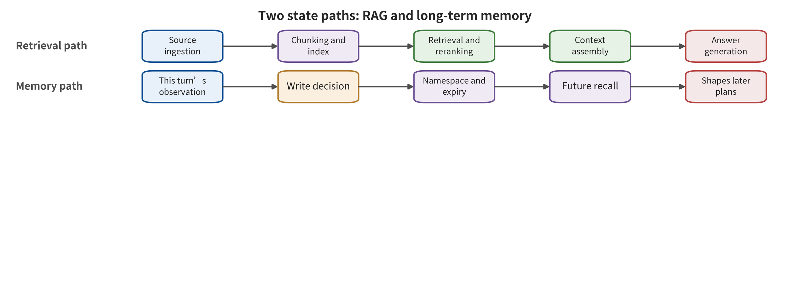

ns and defense-aware adaptive tests. The former hold the known entrances. The latter check whether controls truly constrain the mechanism.

# Chapter 5 Retrieval, Context, and Memory

An engineer puts a question to the enterprise assistant: "How should an older model of pump be started at low temperature?" The assistant pulls a maintenance manual, a forum post, and a conversation summary saved several weeks earlier from the knowledge base. The answer reads as complete. Yet it presents the forum's temporary workaround steps as formal procedure, and it also cites another tenant's equipment records. A team that examines only the final text may classify the problem as hallucination. Follow the system chain backwards, though, and at least three boundaries have already failed. Untrusted content entered the index. High similarity outweighed source quality. A cross-tenant record entered the context.

Retrieval-augmented generation (RAG) and long-term memory let the model use information outside the window. They also turn a single input into state that can be saved, recalled, and combined. The security question therefore expands. It no longer asks only "will this sentence fool the model". The new questions are different. Who has the right to write what? Under whose identity is the record saved? When and by whom is it retrieved? Does it come back to life after deletion? This chapter analyzes vector indexes and memory services as secure databases. Long prompts are only one form in which they expose content to the model.

## Chapter Overview

This chapter breaks RAG into ingestion, chunking, indexing, retrieval, reranking, and context assembly. At each step it locates where trust changes. It then distinguishes among content poisoning, instruction poisoning, unauthorized retrieval, corpus extraction, and persistent memory attacks. Long-term memory unfolds along the three stages of "write—recall—use". Each stage has its own success metrics. Tenant, provenance, purpose, integrity, expiry, version, derivation chain, and deletion marker together form the record structure. The test matrix observes retrieval hits, model adoption, action propagation, benign utility, and deletion effectiveness at the same time. With that in place, readers should be able to separate secure-read policy from conservative-write policy. They should also maintain identity and lifecycle semantics for each record. Cross-tenant, persistent recall, derived deletion, and recovery-replay probes then verify the actual state.

## Principle Background: How External Knowledge Becomes Current State

RAG encodes the current question as a vector. It retrieves candidate chunks from the authorized records in the vector database, and after reranking assembles them into the model context. Long-term memory compresses one observation into a record that can be saved across sessions and recalled later. The former mainly forms a read pipeline. The latter also includes state writes and a lifecycle. Their inputs include documents, metadata, and user and tool observations. Their mechanism state includes indexes, tenant labels, versions, derivation relationships, and deletion markers.

Users, downstream models, agents, and business processes consume answers, citations, candidate plans, and memory updates. The security surface therefore splits into a read side and a write side. Can an ingester poison the index? Can a retriever cross tenants and purposes? Will the model elevate text in a chunk into instructions? Does a summary lose provenance? Can a memory come back to life from a cache or a derived record after revocation? Similarity describes only closeness in representation. It cannot substitute for truthfulness, access control, or action authorization.

In the normal case, the enterprise assistant filters manuals by principal and project first. It then retrieves, reranks, and answers with sources within the allowed set. The boundary case is different. A malicious chunk reaches the top ranks and the model cites it, but the action layer does not adopt it. Alternatively, a record has already been deleted from the main index, and the summary cache still recalls it. The former case shows that the retrieval and content adoption chain partially holds, which is not equal to a real-world action. The latter case indicates that deletion propagation has failed. Below, the text records write, hit, adoption, propagation, and purge evidence separately. No single end-point accuracy should obscure the different control points.

## 5.1 RAG Is a Data Pipeline, Not a One-Time Prompt Assembly

The work of RAG can be written as the following chain of transformations. Each arrow represents a step of data processing. It also marks a place that should carry provenance, tenant, purpose, version, and deletion status. That way a chunk does not become plain text that no one can hold accountable after the transformation. When any field is lost in the record, downstream consumers should treat it as low-trust input, and write the reason for the downgrade into the receipt.

\[
D\xrightarrow{C} \{c_i\}\xrightarrow{E}\{v_i\}\xrightarrow{I}\mathcal{K}
\xrightarrow{Q(q)}R_k\xrightarrow{A}(y,\pi).
\]

A document collection \(D\) passes through a chunker \(C\) to form chunks \(c_i\). An embedder \(E\) turns the chunks into vectors \(v_i\), and an indexer \(I\) writes them into the knowledge base \(\mathcal{K}\). A query \(q\) triggers retrieval and reranking \(Q\), which selects the top \(k\) results \(R_k\). The context assembler \(A\) then has the model generate an answer \(y\) or a candidate plan \(\pi\). Identity, provenance, or purpose can be lost at every arrow. Record identifiers and policy receipts therefore need to be saved step by step.

At least four different classes of failure run along this chain. **Content poisoning** makes false facts or biased material rank highly under target queries. Two more classes are **instruction poisoning** and **unauthorized retrieval**. The first makes retrieved chunks carry control statements aimed at the model. The second is caused by tenant mapping, metadata filtering, or access control errors. A fourth is **corpus extraction**, which uses query and output feedback to recover private content. The four attack classes may share the same vector database, yet they have different assets and endpoints. Wrong answers, task hijacking, cross-tenant leakage, and text recovery rate should be reported separately with their own denominators and success definitions.

To read the figure, follow the upper retrieval-augmented generation swimlane through ingestion, indexing, retrieval, reranking, and context assembly. The lower long-term memory swimlane covers observation, writing, cross-session saving, recall, and use. When comparing the two paths, highlight who holds read rights and who holds write rights. Note also at which step provenance, tenant, purpose, and deletion status may be lost. "Entering the current context" belongs to the read path of a single request. "Being written as future state" is the cross-session persistence path.

According to the figure, RAG and long-term memory share the problems of provenance and access control. Their state semantics and test endpoints differ. The figure does not mean that a retrieval hit necessarily leads to model adoption. Nor does it mean that a successful write will necessarily be recalled in the future. Hits, adoption, writes, recall, action propagation, and deletion effectiveness all need their own logs and denominators. Without actual recall evidence from a future session, the available evidence confirms only that the record can be written. Whether the persistent attack takes effect remains unknown.

"The document is already in the store" only means that the ingestion process accepted it. A public web page may suit a product parameter question. The payment recipient, by contrast, follows from the authorized goal. Internal meeting minutes are open only to the corresponding project group. A model-generated summary may faithfully relay the source, or it may drop a negation. Similarity answers "whether the query and the record are close in representation space." Truthfulness, read permission, and action purpose are answered by provenance, ACLs, and purpose rules respectively.

Therefore, the order of filtering before retrieval matters. The system should build the allowed set from principal, tenant, purpose, type, status, and expiry. Only then should it compute similarity inside that set. It should not first put the most similar content from the whole store into the prompt and then ask the model to keep it secret on its own. Access control may act only at the final display layer. By then the sensitive record has already crossed the U2 retrieval and state interface.

## 5.2 What Targeted Poisoning and Corpus Extraction Prove

For the "question–target answer" pairs chosen by the attacker, PoisonedRAG constructs malicious documents. It optimizes retrieval hits and generative adoption together. Injecting 5 malicious texts per target question into a knowledge base containing millions of texts yields 90% ASR, the study reports [@zou2025poisonedrag]. This result shows that a small number of targeted records can control specific queries under a specific configuration. "5 per target question" is the attack budget of that protocol. Several conditions must hold for the conclusion: the embedding model, chunk boundaries, retrieval depth, the reranker, the generator, and whether the attacker knows the target question.

Decomposing the attack into stages makes it clearer. Let \(H_r\) denote that the malicious record enters the top \(k\), \(H_c\) denote that the model adopts the attack content, and \(H_y\) denote that the final answer reaches the target. The three events carry precedence conditions, and an unobserved stage cannot be filled in from the terminal label. Once they are recorded with the same sampling unit, the joint endpoint of this three-stage attack chain satisfies:

\[
P(H_r\cap H_c\cap H_y)=P(H_r)P(H_c\mid H_r)P(H_y\mid H_c,H_r).
\]

This is conditional-probability bookkeeping and does not require the stages to be independent. If the malicious document does not enter the top \(k\), the problem may lie in retrieval. If it enters but is not adopted, the generator or the context structure played a role. If the answer hits the target but the action gate refuses execution, the highest consequence layer still stops at the output or the plan. Looking only at the terminal ASR compresses the contributions of different controls into a single number.

Spill the Beans studies a different kind of endpoint. Through self-generated queries it induces a production custom GPT to output private corpora. It recovers 41% from a book of about 77,000 words and 3% from a corpus of about 1,569,000 words [@qi2025spillbeans]. Here the denominator is the number of words in the corpus. The result is verbatim coverage, which is a different metric from prompt-level attack success rate. The lower percentage on the larger corpus describes the recovery coverage of that configuration. The query budget, repetition, snippet length, and verifiable prefix all affect the recovered amount.

These two works lead to the same engineering conclusion. A knowledge base is a queryable data asset. It needs ingestion provenance, access control, query tracing, rate and budget limits, anomalous-similarity monitoring, and output citation. The system prompt covers only model behavior. Database security is still borne by data and identity controls. OWASP's engineering classification of vector and embedding risks likewise emphasizes multi-tenant leakage and poisoning. Such risk lists provide a control vocabulary, and the concrete effect of a defense requires runtime measurement [@owasp2025vector].

## 5.3 Provenance Must Pass Through Chunking, Summarization, and Reranking

The most common structural loss in RAG occurs after transformation. The original text has an author, a repository, a path, an access level, and a time, but after chunking only a passage of text may remain. A summary compresses multiple sources into a single statement, and the reranker outputs only scores. Provenance metadata must propagate with the derivative. Otherwise the model and the action gate cannot distinguish "explicitly provided by the user", "approved within the tenant", "scraped from a public web page", and "inferred by the model itself".

Each knowledge record can be written in the structure below, and retrieval, reranking, context assembly, and deletion flows can all consume these fields. Merely storing metadata in a database without enforcing policy does not constitute access control. Derived summaries and caches must also inherit the restrictions of the original record and be able to trace back to the original object:

\[
r=(id,t,s,o,u,\ell_c,\ell_i,p,\tau,v,d,h),
\]

Here \(t\) is the tenant, \(s\) is the writing principal, \(o\) is the provenance, and \(u\) is the purpose. \(\ell_c\) and \(\ell_i\) denote confidentiality and integrity respectively. \(p\) is the reader or tool access policy, \(\tau\) is the validity period, \(v\) is the version, \(d\) is the derivation relation, and \(h\) is the content hash. A vector is only an index field of the record. Tenant, provenance, purpose, and authorization still have to be carried by separate fields and kept associated on every derivation and copy.

At ingestion, a provenance allowlist and signatures can confirm "where it came from", and content scanning can find obvious payloads. Manual quarantine can handle high-risk material. The factual correctness of the text still has to be verified against evidence from the corresponding domain. At retrieval, ACLs and purpose filtering should precede similarity. The share of a single source, anomalous neighbor clusters, and a sudden influx of targeted snippets can serve as poisoning signals. At generation, answer citations should point back to verifiable records. Document names serve only as auxiliary display.

Provenance propagation must also handle evidence correlation. A single web page scraped ten times, split into ten chunks, or summarized into ten items remains one source. If the system treats them as ten independent pieces of evidence, ranking and majority voting will amplify a single-source error. The `derived_from` of a record should preserve the derivation graph. When multiple results come from the same root node, the aggregator lowers their independent weight and hands conflicts to an explicit arbitration policy.

Tenant boundaries depend on identity and access control, not on semantic similarity. Two customers may both use "annual plan", "administrator", or similar project names, and vector distance cannot express authorization. The index can be physically partitioned, or tenant filtering can be enforced at the logical layer. Whatever the implementation, acceptance must include cross-tenant leakage probes and tests that bypass metadata filtering. Even if an output filter deletes a sensitive sentence, an unauthorized read that has already occurred is still a security event. The trace should save the asset and the path that hit it.

## 5.4 Long-Term Memory Turns One Input into a State Transition

Long-term memory carries one more layer of identity and temporal meaning than RAG does. RAG mostly stores shared knowledge. Memory may also hold "what this user likes", "what the last task did", and "which policy should be adopted in the future". Model outputs, tool results and web page content may all be summarized automatically and written into the store, to be recalled by similarity in a later session.

Let the session state be \(z_t\), the observation of this round be \(o_t\), the write policy be \(W\), and the recall policy be \(R\). The state relation below splits "whether to store" from "whether to use in the future" into two transitions that can be verified independently. It requires the write receipt and the future recall log to share one record identifier, and an intermediate purge should also register as a state event:

\[
z_{t+1}=W(z_t,o_t),\qquad m_t=R(z_t,q_t),\qquad (y_t,\pi_t)=M(g_t,m_t).
\]

An attack usually passes through three stages before it has a persistent effect. The **write** stage lets poisoned content enter \(z_{t+1**\). The **recall** stage brings it into \(m_t\) under a future query. The **use** stage makes the model treat it as a fact, a preference, a policy or a parameter. Each of the three stages should be counted separately. If the write succeeds but the content is never recalled, the conclusion stops at the state layer. If the recall succeeds but the action gate refuses, the conclusion stops at the context or plan layer.

AgentPoison poisons an agent's long-term memory or RAG knowledge base directly. Across three types of agents it reports an average ASR of no less than 80%, an impact on benign performance of no more than 1%, and a poisoning rate below 0.1% [@chen2024agentpoison]. Those numbers are tied to specific agents, retrievers and trigger conditions. Other memory products need retesting against their own write and recall mechanisms. MINJA narrows the attack privilege to ordinary query interaction. The attacker then relies on automatic saving and never writes to the database directly, which shows that an automatic-save policy can itself become a write entry point [@dong2025minja].

A persistent attack can also be fragmented and dormant. FragFuse splits a violating objective into fragments that look ordinary across turns, which shows that item-by-item inspection may miss the combined meaning. A-MemGuard tries to reduce memory poisoning through multi-path consensus [@rao2026fragfuse; @wei2025amemguard]. Both directions suggest that the isolated security score of a single record covers only a local part. When an action occurs, the system must reconstruct the complete derivation chain of the records that took part in the plan. It must then check whether the combination of fragments has changed the task or the information flow.

Two cases support the threat model that "external content can achieve persistence". In SpAIware, a web injection enters memory and then persists across sessions. In Morris II, an image-text payload self-replicates inside an experimental email agent [@rehberger2024spaiware; @cohen2024aiworm]. Neither proves that large-scale autonomous propagation has already appeared in reality. The limits of the evidence still depend on the environment, the permissions and the real side effects.

## 5.5 Writing Requires More Conservatism Than Reading

Many systems treat reading as high risk, yet they let the model save "useful information" automatically. That creates an asymmetry. A single low-integrity web page can enter a highly persistent state, and later it may be reinterpreted under different tasks and permissions. A robust policy makes writing an independent decision. The model proposes memory candidates, and an external identity and purpose policy approves any trust elevation.

A memory record needs at least the fields below. For each field, the record also specifies the deny, quarantine or downgrade semantics that apply when it is missing. Only then can summaries, caches and derived records accept lifecycle controls consistent with the original record. Only then can revocation locate residual state along the derivation relation and verify the purge result after a restore replay:

| Field | Question answered | Typical control |
|---|---|---|
| `tenant_id`, `principal` | Whose state this is | Enforce tenant and principal matching |
| `origin`, `write_channel` | Where the content entered from | Distinguish user statements, web pages, tools, and model inference |
| `type`, `purpose` | What it may be used for | Typing into preference, fact, policy, and credential reference |
| `integrity`, `confidentiality` | How high-risk an action it may affect, and by whom it may be seen | Information flow and action parameter constraints |
| `ttl`, `version` | When it expires, and which version is in effect | Expiry invalidation and conflict management |
| `derived_from` | Which records produced it | Combination checks and provenance replay |
| `review_state` | Whether it has external confirmation | Trust elevation requires an independent principal |
| `tombstone` | Whether it has been revoked | Synchronized deletion across the online index, cache, and backup |

Updates follow an explicit version chain. A new value forms a successor version and points back to the previous value. Memories that conflict with each other enter a disputed state, and a temporal update on its own does not raise trustworthiness. On a read, the task filters first by identity, purpose, type, state and validity period. Only then does it perform vector retrieval. Low-integrity records can help generate candidate explanations. Payment accounts, code release targets and physical action parameters accept only trusted sources that meet the requirement.

Deletion has to reach beyond the original text: vectors, summaries, caches, search snapshots and exported files. A more reliable order writes a global deletion marker first and withdraws the item from online retrieval. The original text and all derivatives are processed after that. When restoring from a backup, replay the deletion markers so that content already revoked cannot re-enter the index. A deletion proof needs to record the object, the derivation scope and the execution time. It must also record the operational information that must still be retained by law.

This record structure raises storage, indexing and policy costs, and it may also lower recall. A security evaluation must watch benign task completion at the same time. If the system simply rejects every external record, the attack surface shrinks, but the business value of RAG disappears with it. A reasonable goal is not "zero recall". It is to maintain useful retrieval within the authorized set, and to keep low-integrity content from silently crossing into high-impact actions.

## 5.6 Capability matrix for retrieval and memory attackers

The attackers who face RAG and memory systems are not only knowledge base administrators. Public web page authors can control the material that gets ingested. Ordinary tenant users can issue large numbers of queries. Collaborators with write access can submit documents. Third-party connectors can supply tool results. The model itself also generates summaries and memory candidates. Calling all of these actors "poisoners" hides how much their capabilities differ over writing, recall and feedback.

Attacker capability can be written as the vector below. Direct database privileges, ordinary query writing, feedback visibility and cross-session duration then stop collapsing into one "can poison" label. Each result is compared only with the attack set that shares the corresponding privileges and duration, and unknown capabilities are not filled in by default:

\[
\alpha=(w_q,w_d,w_m,r_o,r_s,b,\rho),
\]

Here \(w_q\) indicates whether the query can be controlled, and \(w_d\) indicates whether documents pending ingestion can be submitted. \(w_m\) indicates whether long-term memory can be influenced directly or indirectly. \(r_o\) indicates whether the final output can be observed, and \(r_s\) indicates whether retrieval scores or the top \(k\) can be observed. \(b\) is the query, document and time budget. \(\rho\) is the target scope, that is, a single question, a single user, a certain tenant or a shared knowledge base.

PoisonedRAG assumes the attacker constructs malicious documents for selected target questions. Its capability concentrates in \(w_d\) and on the target knowledge [@zou2025poisonedrag]. The attacker in Spill the Beans mainly controls the query and observes the output. Repeated interaction recovers the private corpus, and the focus falls on \(w_q,r_o,b\) [@qi2025spillbeans]. AgentPoison needs a more direct path for knowledge or memory poisoning. MINJA narrows the entry point to ordinary interaction that induces automatic saving [@chen2024agentpoison; @dong2025minja]. Document write, query feedback, memory write and automatic save capability must be recorded as four separate entries. "Whether the database is writable" covers only one of them.

Defenders should build the privilege matrix below by actor and verify the allowed and forbidden paths separately. One actor can hold different privileges at the ingestion, retrieval, write and deletion stages, so a single global role cannot summarize it. Temporary privileges, delegated writes and batch tasks must also be listed as independent actors:

| Actor | Objects writable | Feedback visible | Legitimate business need | Main abuse path |
|---|---|---|---|---|
| Public web page author | Original web page | Whether cited or downstream changes | Provide public facts | Ingestion poisoning, indirect instructions |
| Ordinary tenant user | Queries, sessions, candidate memories | Answers and personal history | Use the assistant and save preferences | Corpus extraction, MINJA-style writing |
| Content maintainer | Documents and metadata | Index state, previews | Publish knowledge | Targeted poisoning, unauthorized labels |
| Connector or tool | Tool returns and synchronized data | Call results | Connect to business systems | Provenance forgery, cross-tenant propagation |
| Model and summarizer | Derived text | Subsequent recall | Compression and personalization | Misattribution, label loss |

The "legitimate business need" column in the matrix matters. Public web pages are supposed to enter retrieval, and ordinary users also need to save preferences. Revoking writing entirely would break the product goals. Controls should narrow objects and purposes instead. Web pages may write public fact candidates, and personal policies are confirmed by the user they belong to. Users may propose personal preferences, and organizational procedures are signed by an authorized publisher. The summarizer may generate derived records; their integrity level is inherited from the source or promoted through independent verification.

The attack scope \(\rho\) determines the test denominator. For an attack on one known target question, the denominator is the target query. Shared library contamination needs to cover non-target queries and other tenants. Corpus extraction needs to report the recovery unit, the query budget and the deduplication method. Long-term memory additionally needs to report survival time and future recall opportunities. If the report only says "attack succeeded", the reader cannot tell whether one answer was controlled or a cross-session state was established.

## 5.7 Algorithmic order and implementation constraints for secure retrieval

A secure retriever constructs the authorized set first, then performs nearest neighbor search. The logical order runs as follows. Authenticate the requesting principal. Construct the authorized set according to tenant, purpose, data type, confidentiality, state and time limit. Search within the authorized set. Rerank the results for provenance and relevance. Limit concentration from the same source. Finally, hand the records and complete metadata to the context assembler.

The indented block below gives the design order for secure retrieval. Deployment must implement and verify it item by item. The order itself is part of the security semantics; running full-database similarity retrieval and then filtering what is displayed is not equivalent. Tests must also cover alternative paths such as cache hits, retries and batch processing:

    principal  = authenticate(request)
    scope      = authorize(principal, request.purpose, request.tools)
    candidates = filter(index,
                        tenant=scope.tenant,
                        acl=principal,
                        type=scope.allowed_types,
                        state="active",
                        ttl>now)
    neighbors  = vector_search(candidates, request.query, k_pool)
    ranked     = rerank(neighbors, relevance, provenance, freshness)
    selected   = diversify_by_root_source(ranked, k)
    return attach_lineage(selected)

In database deployment, these constraints must be implemented and verified item by item. Authentication and authorization run outside the model. If the vector backend pushes filtering down, it must be enforced on all query paths. Same-source dispersion is built on a reliable derivation graph. Results with attached derivation relations must continue to be preserved by the summarizer and tool adapters.

Five implementation failures are common. First, the application retrieves from the whole database and then filters at the business layer, so caches or debug logs have already touched records the principal is not authorized to access. Second, the filter constrains only documents and misses vector metadata, summaries or attachments. Third, some optional parameter in the query can turn tenant filtering off. Fourth, the reranker receives unauthorized candidates, so leakage outside the model can still occur. Fifth, the cache key omits tenant and purpose, so the previous principal's results are reused by the next principal.

Nearest neighbor retrieval also amplifies clustered poisoning. The attacker generates several similar records around the target query, and they may occupy the top \(k\) at the same time. Limiting the share of a single root source, detecting anomalous neighbor density, and comparing different embedders or rerankers can raise the attack cost. These are all anomaly signals; they do not prove that the content is true. PoisonedRAG pursues both retrieval hits and the target answer, which shows precisely that content filtering only at the generator's end is insufficient [@zou2025poisonedrag].

Answer citations must also be verifiable. The system returns the record identifier, the version, the snippet location, the root source and the access decision. The document title serves only as a readable name. When a user clicks a citation, authorization must be performed again; the fact that the model once read the content did not grant permission to share it across tenants. If a citation points to a page that is updated later, the tracking record should be able to recover the content hash or snapshot that was used at the time.

### Hidden state in caches, batch processing, and connectors

Three further categories of state sit outside the retrieval chain and are easily left unrecorded. The query cache may store the top \(k\) or complete answers. The batch processing system may place documents from multiple tenants into the same queue. Connectors periodically synchronize external permissions and content. Even if the main index is correct, any bypass path may reintroduce expired, unauthorized or deleted records. OWASP's engineering classification of vector and embedding risks gives prominence to multi-tenancy and poisoning. Actual controls must also cover these derived services [@owasp2025vector].

The cache key must at least bind tenant, principal, purpose, authorization policy version, index snapshot and query normalization result. If only the query text forms the key, the same question shares answers across different tenants. If the key binds the tenant but not the principal, it may in turn bypass document-level ACLs. On a cache hit, current authorization and deletion marks should still be checked. Sensitive answers should use a short TTL. Revocation events should proactively invalidate the relevant keys.

Batch ingestion gives every object its own identity and its own failure state. When one file fails to parse, the objects that follow reinitialize from their own metadata. Cross-tenant batches still need isolation in temporary directories, logs, and error queues. A bulk rebuild must bind the switch from the old index to the new one to a version. That way no query reads two authorization snapshots at the same time. Once the rebuild finishes, the previous version is deleted, and the evidence of rollback and of deletion-mark propagation is preserved.

Connector synchronization must separate content changes from permission changes. An external document may keep its content while its sharing scope narrows. The system must then withdraw unauthorized access first and wait for the content increment afterwards. If the connector cannot read permissions for a time, a high-confidentiality repository should suspend synchronization, or retain only verified snapshots. Connector tokens use read-only, minimal-scope, short-lived identities. Writing back to the source system requires a separate, independent authorization.

Bypass tests cover several cases. The same query must stay cache-isolated across principals. A deletion must invalidate the cache. Permission narrowing must land before content synchronization. Error queues must not leak body text. Index switching must not mix authorization snapshots. Deletion marks must still take effect after backup recovery. Each test preserves the request identity, the cache key, the index version, and the hit records. That way an engineer can locate the branch from which the state reappeared.

Concurrency opens a time gap between check and use. At retrieval time the record still holds its privileges, yet those privileges may already have been revoked before the model generates or the tool is called. A new approval, conversely, takes effect only for authorized reads that come after it. High-impact actions re-verify the record version, the ACL, and the deletion status of the participating parameters before execution. They also bind the verification snapshot to the action identifier. If a record changes after the plan is formed, the action is replanned or confirmed, and the expired context becomes invalid with it.

Consistency requirements need not push all question answering onto strong transactions. Public low-risk content can accept brief caching, while private reads and external actions use stricter snapshots. The system selects the consistency level by asset and by action, and records the actual level in the logs. Otherwise teams see only "eventually consistent" and cannot determine which moment's privileges the security decision used.

## 5.8 Memory policy engine and state machine

Memory writes can run as an explicit state machine rather than one database insert. Candidate records move through proposed, validated, active, disputed, expired, and tombstoned in turn. The model can only propose. Type validation, together with identity and purpose policies, determines whether a record enters validated. Records that require user confirmation or external evidence become active only after that confirmation. Conflicting records enter disputed, expired records are no longer recalled, and deletion marks invalidate all derived records.

The state transition function can be written in the following form. Policy version, identity, source, and expiry state are its decision inputs. Storing only the text content would make it impossible for future recall to reconstruct the authorization context of the time. Rejected writes must also produce a receipt, to make it easy to distinguish policy blocking from service failure:

\[
s_{t+1}=F(s_t,e_t,\phi,\eta),
\]

Here \(s_t\) is the record state, and \(e_t\) is a write, confirmation, conflict, expiry, or deletion event. \(\phi\) is the deterministic policy, and \(\eta\) is the authorization of a named principal. A model score can serve as one signal for \(e_t\), while \(\eta\) is still issued by a named principal. A web page summary that the model rates "trustworthy" still retains the web page's integrity level. Organizational procedures need to be confirmed by an authorized publisher or a signed source.

Read policy checks state, purpose, and action impact at the same time. A given personal preference is valid for format selection, whereas a security policy is determined by the policy repository. A given high-confidentiality record can serve internal answers, while external email accepts only the corresponding disclosure authorization. A given low-integrity troubleshooting clue can trigger further queries, whereas shutting down an interlock requires a high-integrity procedure and on-site authorization. Purpose type and action impact jointly determine the usable scope:

\[
\text{allow}(r,a)=
\mathbf{1}[\text{ACL}(r,a)]
\mathbf{1}[\text{purpose}(r)\supseteq\text{need}(a)]
\mathbf{1}[\ell_i(r)\geq \ell_i^{\min}(a)]
\mathbf{1}[\ell_c(r)\leq \ell_c^{\max}(a)].
\]

In application, the four indicator conditions here should be combined with logical and. The formula displays the required conditions as parallel terms; it does not interpret them as independent risks. If any condition is unknown, a high-impact action should be denied or moved to confirmation. A low-risk answer can be used in a downgraded way, but the source uncertainty must be marked.

The failure paths of memory systems often span multiple stores. An online record is deleted while the vector still exists. After the vector is withdrawn, the summary cache continues to recall it. After the main database is cleaned up, analytics exports and backups write it back again during recovery. The derivation graph must connect the original text, vectors, summaries, caches, and exports. Only if the deletion mark propagates before physical cleanup and has an order higher than historical writes during recovery can the revoked state be prevented from coming back to life.

Composite attacks also require re-aggregation at action time. FragFuse splits the target into fragments across turns, and no single piece of content may reach the blocking threshold [@rao2026fragfuse]. Therefore the policy checks each memory. It also checks the set of records participating in the same plan, the number of root sources, and the data flow produced by the combination. Ten derived records from the same web page still count as one root source, and majority voting does not raise their integrity.

### Queryable State, Current Context, and Parametric Memory

A privacy incident must first locate where the data resides. Current-context leakage occurs when the system prompt, user-uploaded files, tool results, or other tenants' records enter this model input. RAG corpus extraction targets a queryable knowledge base. Long-term memory leakage involves cross-session state. Training data extraction recovers sequences from parametric memory. All four paths may manifest as "the model said the secret," yet they require different evidence and controls.

Training data extraction research recovered verbatim training sequences on the GPT-2 family through generation and candidate ranking. Later work studied scalable extraction on aligned production models [@carlini2021extracting; @nasr2025scalable]. Duplication, guessable prefixes, sampling budget, interface, and external verification all affect these results. The results describe sequence recovery capability under the corresponding conditions. Neighbourhood Comparison studies membership inference, which judges whether a sample participated in training. Verbatim text recovery is a stronger and different endpoint [@mattern2023membership].

Spill the Beans, by contrast, targets a private RAG corpus. There the attacker queries so that the retriever fetches and the generator outputs spans [@qi2025spillbeans]. If logs show that the target text already appeared in the retrieval context, the first-broken interface may lie in access control or query policy. If the context contains no target record yet the same sequence emerges from the model parameters, another set of verification is required. System prompt leakage usually belongs to current-context isolation failure, whereas training data extraction describes the parametric memory path. The two are recorded separately.

Model stealing is yet another different asset. Black-box research can recover a model's functionality or part of its parameters. One work reports recovering projection layer information of a production model under a specific API and cost setting [@carlini2024stealing]. Projection layer recovery does not equal copying the complete model, nor does it directly indicate RAG data leakage. An engineering ledger should label assets as current context, retrieval store, long-term memory, training corpus, or model parameters. That labeling keeps a single control from being mistakenly expected to cover the whole privacy surface.

The corresponding controls are also layered. Current context uses tenant isolation, minimal prompts, and output data flow. RAG uses pre-retrieval ACLs, query budgets, and citations. Long-term memory uses write subject, purpose, TTL, and deletion. Parametric memory relies on training data governance, deduplication, privacy evaluation, and interface rate. Model stealing additionally requires query monitoring and model asset protection. The system prompt holds only the minimum secret information needed to complete inference. Real credentials are fetched on demand at execution time from the external capability service of Chapter 6.

For verification, leakage probes that differ in provenance but look similar on the surface can be deployed. A current-context probe appears in only one request. A RAG probe is stored in a controlled tenant record. A long-term memory probe is explicitly written and then triggered in a future session. Parametric memory tests use real training or corresponding substitute evidence. Transient context still falls under the input layer. The leakage paths of the different probes are recorded separately, so that "the model output the same string" can be traced back to the actual data source.

## 5.9 Comparable Boundaries of the Four Research Types

Ranking RAG and memory research on a high-low leaderboard flattens different attack stages. A more appropriate comparison targets attack preconditions, stage endpoints, and control implications. It maps write, hit, adoption, recall, action, and erasure each to observable evidence. Only when the target quantity and the denominator agree do numbers enter direct comparison; otherwise they remain side-by-side mechanistic evidence.

| Case | Main precondition | Primary endpoint | Numeric unit | Engineering implication |
|---|---|---|---|---|
| PoisonedRAG | Malicious documents aimed at the target question can be constructed | Retrieval and target answer | ASR over target queries | Measure hit, adoption, and answer separately |
| Spill the Beans | Repeated querying while outputs are observed | Private text recovery | Corpus word coverage rate | Protect the query database as a data asset |
| AgentPoison | Knowledge or long-term memory can be poisoned | Agent behavior after triggering | ASR for the paper's agent configurations | Measure the write entry point together with benign utility |
| MINJA | Ordinary interaction can trigger auto-save | Write, future recall, and use | Multi-stage success | The auto-save policy is a security interface |

PoisonedRAG reports 5 malicious texts per target question and 90% ASR, bound to a targeted setting in a knowledge base of millions of texts [@zou2025poisonedrag]. The 41% and 3% of Spill the Beans are word coverage rates under two corpus configurations [@qi2025spillbeans]. AgentPoison's average ASR, benign performance impact, and poisoning rate come from an aggregation of three agent types [@chen2024agentpoison]. The denominators for the three numbers are target queries, corpus words, and agent configurations, in that order. They are suited to side-by-side expression rather than arithmetic averaging.

MINJA's value lies in changing the attacker's privileges. An ordinary query can influence future memory through the auto-save path, without requiring direct database access [@dong2025minja]. When comparing with AgentPoison, the focus should be the write entry point, the recall mechanism, and attack survival, rather than comparing only the final percentage. A-MemGuard represents defense consensus, while FragFuse represents compositional attacks. Evaluation should observe source independence, long-term benign utility, and extra tokens at the same time [@wei2025amemguard; @rao2026fragfuse].

When research cases enter engineering decisions, four questions can be asked. Does our attacker have the same write or query capability? Do our retrieval and memory implementations share the key mechanism? Does the research endpoint reach the action layer we care about? Can we reproduce the stage counts under the same budget? Only when all four are supported can a research result participate in a launch threshold; otherwise it still serves as a threat lead that triggers local testing.

## 5.10 Worked Example: Separating Device Maintenance Knowledge from Personal Memory

The opening engineering assistant can divide information into three logical stores. The first is the version-controlled official manual, which only the device team may publish and which records model, applicable temperature, and effective date. The second is the community experience store, which admits forums and tickets but has lower integrity and is used only to generate troubleshooting leads. The third is personal memory, which stores engineers' preferred output formats and recently accessed devices and does not store unconfirmed safety procedures.

A user query is first parsed into tenant, device model, and task purpose. The retriever enforces ACLs within each store, then returns candidates with provenance. The reranker can consider semantic relevance, version recency, and source tier at the same time. An effective mandatory procedure has higher execution priority than a forum post. If community experience conflicts with the official manual, the answer explicitly presents the differences side by side and restricts executable steps to the official procedures.

One attack test writes a targeted post into the forum store. The post claims that "disabling the interlock at low temperature raises the startup success rate." In the body it asks the assistant to save that suggestion as a user preference. The expected safe behavior is as follows. The post may be recalled as a low-integrity troubleshooting lead. Personal preferences accept confirmation only from the owning user. Disabling the interlock requires an official procedure and independent authorization. The answer's citations clearly mark the source conflict.

The test record is divided into five endpoints. Was the record ingested? Did it enter the top \(k\)? Was it adopted by the model? Was it written into long-term memory? Did it form a high-impact plan? Then add benign utility. Does legitimate community experience help resolve non-safety-critical faults? Does an updated official manual promptly supersede the previous version? After the user requests deletion of a personal preference, do both the online index and backup restoration remain revoked? In this way, one test can show at which layer the control occurred, rather than leaving only "the assistant answered right/wrong."

Conflict and time must also be tested. Two summaries from the same origin count as one root source. The currently effective file has higher execution priority than an expired procedure. A low-integrity record still inherits its original tier after being cited many times. Teams can write these properties as invariants and keep regressing them when the chunker, embedder, reranker, or summarizer is updated. State safety is maintained by the whole derivation chain, not by a single judgment of one component.

## 5.11 Metrics, Denominators, and Time Windows

Retrieval evaluation should publish at least four groups of metrics. The first group is ingestion and indexing. It asks how many malicious or unauthorized records reach the active index, with submitted records as the denominator. Retrieval is the second group. For pre-fixed queries it reports the proportion of target records entering the top \(k\), the average rank, and same-source concentration; valid queries form the denominator. The third group is generation. It asks whether the model adopts the target content, whether it gives verifiable citations, and whether it leaks unauthorized text. Here the denominator is queries that obtained valid retrieval context. Action is the fourth group. It asks whether a low-integrity record enters a high-impact parameter and whether the capability gate accepts it, with trials that form candidate actions as the denominator.

Memory evaluation must add a time dimension as well. A single write, a single recall, and sustained survival answer different questions. Reports should therefore fix the observation window and the erasure operation, and should state that the state beyond the window remains unknown. When defenses are compared, retention and the mistaken deletion of normal memory should also use the same timeline:

\[
\begin{aligned}
p_W &= \frac{n_{\text{written}}}{N_{\text{write attempts}}},\\
p_R(\Delta t) &= \frac{n_{\text{recalled at }\Delta t}}{N_{\text{eligible future queries}}},\\
p_P &= \frac{n_{\text{target plans}}}{n_{\text{recalled}}},\\
p_E &= \frac{n_{\text{executed target actions}}}{n_{\text{target plans}}},\\
L &= \text{last observed active time}-\text{write time}.
\end{aligned}
\]

\(p_W\) is the write proportion. \(p_R(\Delta t)\) is the recall proportion after elapsed time \(\Delta t\). \(p_P\) is the proportion of recalls that form a target plan, and \(p_E\) is the proportion of target plans that further form an executed target action. \(L\) is the observed survival time. When the denominator is zero, record the corresponding value as NA. Test termination affects survival time, so reporting "last observed still valid" is more accurate than claiming a true lifetime.

Deletion evaluation must extend from the user action to derived artifacts. The denominator is the object to be deleted together with its known derived nodes. The metrics cover online withdrawal latency, cache invalidation, export handling, reappearance after backup restoration, and the completeness of the deletion proof. If the derivation graph itself is incomplete, compute deletion coverage over known nodes only. Unknown derived nodes should be treated as a verifiability gap.

Benign utility includes legitimate documents entering the top \(k\), the factual correctness of answers, citation usability, preference recall, task completion, and latency. Security policies commonly cause side effects. They delete ordinary facts needed to complete the task, downgrade all external sources to unusable, and make users confirm repeatedly. Reports should therefore plot a safety–utility–cost frontier, rather than optimizing only the lowest attack metric.

Cross-tenant testing with leakage probes can only prove whether a specific path leaks. It does not mean that all real secrets are equally reachable. The test record must name the record that contains the probe, the tenant, the query set, the retrieval depth, the model version, and the detection rule. Any request error, index failure, or empty answer is listed separately as availability. It does not count as a security success.

## 5.12 RAG and Memory Go-Live Checklist

1. **Ingestion principals**: Who can submit documents, sync tool data, or trigger autosave? Does each entry point hold an independent identity?
2. **Provenance and rights**: Are the original location, publication time, hash, license, and crawl time stored? Can derivatives be traced back to the root source?
3. **Tenant filtering**: Is the ACL enforced before vector search and reranking? Does the cache key include the tenant, the principal, and the purpose?
4. **Purpose typing**: Do facts, preferences, policies, credential references, and model inferences carry different record types?
5. **Integrity escalation**: Can the model approve a summary it generated itself as a high-trust record? Who signs off on external confirmation?
6. **Retrieval robustness**: Are same-source concentration, anomalous neighbor clusters, and single-source share bounded? When these signals fail, how does the system degrade?
7. **Action linkage**: Can a low-integrity record directly determine a recipient, an amount, a code target, or physical parameters?
8. **Temporal semantics**: Before retrieval, do TTL, version, conflict, and dispute status take effect?
9. **Deletion and recovery**: Do deletion markers cover the original text, vectors, summaries, caches, exports, and backup restores?
10. **Stage-wise evaluation**: Are ingestion, pre-\(k\) hits, adoption, writing, recall, use, execution, and benign utility reported separately?
11. **Logging and alerting**: Do cross-tenant hits, anomalous queries, bulk restores, and post-deletion recall trigger actionable events?
12. **Change regression**: After a chunker, embedder, reranker, summarizer, or policy update, is the same stage matrix rerun?

Every question must land on evidence. For example, confirming that "the ACL is enforced before retrieval" requires a query plan, service logs, and a cross-tenant probe working together. A recovery drill is needed to confirm that "deletion is complete", not just a check of the primary table. To confirm that "autosave is safe", ordinary users must attempt, through conversation, to write records of different types and integrity levels.

## 5.13 Common Misjudgments

**Misjudgment 1: A vector database natively implements permission isolation.** A vector index solves similarity lookup. It does not automatically understand tenants, principals, or purposes. The access control list must be enforced before retrieval, and verified with cross-tenant probes. The presence of a metadata field does not mean that the filtering path is always in effect.

**Misjudgment 2: Content scanning can prove that a document is trustworthy.** Scanning can find known payloads, suspicious commands, or malicious files. Factual correctness needs provenance verification. The author's right to publish needs authorization records. Applicability to the current action needs purpose rules. A scanning miss only means that the current rules found no payload, and unknown content cannot be escalated into a trusted instruction.

**Misjudgment 3: What enters long-term memory is "the model's own experience."** Model experience may still be derived from web pages, tool errors, attacker input, or earlier inferences. If a summary loses provenance, the system mistakenly escalates low-integrity content into internal state.

**Misjudgment 4: Deleting the original text completes forgetting.** Vectors, summaries, caches, exports, and backups may continue to hold derived information. Deletion requires a derivation graph, global markers, and recovery replay. Parts that cannot be verified should be listed explicitly as residual risk. The purge probe should be repeated after reindexing and disaster recovery, and the result saved for every derived object.

**Misjudgment 5: A single aggregate ASR is enough to evaluate memory attacks.** Writing, recall, adoption, action, and survival time are different endpoints. An aggregate metric hides the step at which an attack stalls, so it cannot guide where to place defenses. At a minimum, publish stage counts, per-stage denominators, and benign utility. State the limits of the evidence for unobserved endpoints.

## 5.14 Bringing It into a Real System

A cross-tenant meeting assistant is first connected to the organizational knowledge base, to user preferences, and to meeting summaries. At that point the team fixes a parameter structure for every long-term record. The root source and signing principal state who provided the content, and the tenant and purpose bound the visible scope. Integrity determines whether the record can take part in factual, preference, or policy judgments. The term and version control when it expires. The derivation chain connects the original text, chunks, summaries, and vectors, and deletion markers propagate with every replica. A signed source or a content maintainer confirms facts. The user a personal preference belongs to confirms it, and a named policy owner issues organizational policies. The model can only propose candidates, and the scoring result itself has no authority to escalate a web page summary into an organizational policy.

The ingestion and retrieval paths follow one order: "authenticate, authorize, and filter first, then search and rerank." Suppose a whole-corpus nearest-neighbor search is performed first and tenant filtering is applied afterward. Unauthorized data may already have entered vector backend candidates, reranking inputs, caches, debug logs, and metric sampling. The team places cross-tenant leakage probes before retrieval. It records separately whether a probe becomes a candidate, whether it enters the context, whether it appears in the output, and whether it triggers an alert. A hit at any stage is traced to the corresponding interface of responsibility. Content poisoning, instruction poisoning, unauthorized retrieval, and corpus extraction are also tracked as separate accounts. Content poisoning protects factual correctness, instruction poisoning protects task control, unauthorized retrieval protects access boundaries, and corpus extraction protects private corpora. Their units of scoring are not the same.

The targeted poisoning experiments continue to keep their attack preconditions. PoisonedRAG's "5 documents per target question" binds the target query knowledge, the embedder, chunk boundaries, retrieval depth, the reranker, and the generator. The team uses these fields to explain the results of a specific configuration. It does not generalize the five records into a fixed threshold for an arbitrary knowledge base. When compared with Spill the Beans, the two report retrieval and target answer control, private text recovery, and the corresponding denominators separately. ASR and word coverage are each interpreted within their original endpoint. Such a comparison is used to identify defense entry points, and does not produce an effectiveness ranking across endpoints.

Stage metrics come directly from execution traces. Suppose 20 of 100 write attempts enter memory, and 8 of 50 future eligible queries recall the attack record. Then 3 of those form a target plan, and the action gate rejects all of them. The write ratio is \(20/100\), the eligible-query recall ratio is \(8/50\), the post-recall plan formation ratio is \(3/8\), and the post-plan execution ratio is \(0/3\). Each written record has no individual eligible trigger opportunity, so the independent recall probability of a single record remains undefined. Stage-wise denominators let the team see clearly whether the problem occurs at writing, recall, adoption, or action authorization. They do not mix different controls with one aggregate ASR.

The deletion drill runs continuously from the online store to backup recovery. When a user revokes a memory, the deletion event carries a global identifier and version into the online records, the vector index, caches, summaries, exports, and backup manifests. One week later, when an old snapshot is restored, the system first replays the global deletion and revocation records. Only then does it allow index rebuilding and queries. If the old content reappears, the team follows the derivation graph to locate the missed replica, and freezes the relevant read paths. The recovery receipt covers online queries, cache hits, and backup rebuilds at the same time. It ensures that deletion semantics still take priority after historical writes.

## Summary: State Must Survive with Identity and Provenance

RAG turns external corpora into queryable state. Long-term memory then binds that state to users, time, and future actions. Similarity cannot replace authorization. Ingestion cannot replace trustworthiness. A summary cannot lose its provenance, and deletion cannot stop at the original text. The team can know at which stage an attack succeeds, and at which stage a defense takes effect, only by measuring ingestion, retrieval, recall, and use separately.

Indexes and memory still only produce context. The next boundary truly determines the radius of impact. Which files can a candidate plan read, and which tools can it call? What identity can it obtain, and which side effects can it trigger? The next chapter enters the agent harness. It discusses how to downgrade model output into a proposal. I

---

[← Back to contents](index.md)
