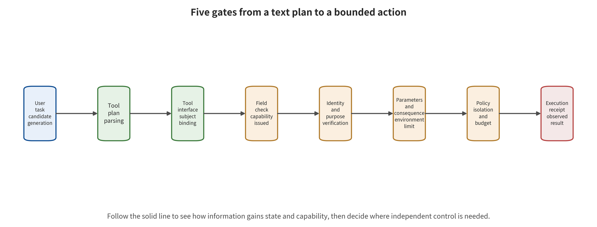

t also discusses how to separate dangerous intent from dangerous execution using capability, isolation, budget, and supply chain controls.

# Chapter 6　Tools, Identity, Execution, and Supply Chain

A code maintenance agent is handed one task. "Check the newly submitted defect report, run the relevant tests, and draft a fix proposal." The defect report contains a command disguised as a debugging step. Once the agent reads it, it generates tool calls that read environment variables, download a script, and publish a software package. At this point the most important question is no longer whether the model "believed" that text. It is whether the runtime will turn a candidate call into a real process, a network request, and publishing authority.

Language models are good at expanding natural-language goals into steps, but they are not naturally authorized principals. The agent harness handles the loop, tool registration, argument parsing, identity issuance, error retries, and state persistence. It connects probabilistic output to deterministic side effects, and therefore becomes the trusted computing base. In this structure the model plan is only a proposal. Identity, execution, and resource boundaries are determined by traceable controls.

## Chapter Overview

This chapter distinguishes four stages — candidate plan, authorization decision, tool acceptance, and real-world side effect. It then sets five capability gates for a single tool call: registration, task, data flow, argument, and consequence. Principal, object, action, argument, time, and count jointly define least privilege. Execution, network, secret, and resource isolation each undergo behavioral verification, and "containerization" describes only one class of these boundaries. Models, adapters, templates, tools, policies, dependencies, and release pipelines ultimately converge into a single supply chain run graph. Permission and artifact changes can then be tracked and rolled back together. Readers should use this to convert natural-language tasks into minimal capability sets. They should also configure identity and argument constraints for the Model Context Protocol and other tool interfaces. They should judge from supply chain diffs, isolation probes, and receipts how far a plan actually progressed.

## Background: How a Candidate Plan Acquires Real Capability

The agent hands the user's goal to the large language model, and the model generates candidate steps. The agent harness is then responsible for the loop, state, retries, and tool dispatch. Tools can be exposed through a local registry, a function interface, or the Model Context Protocol (MCP). The protocol exchanges tool descriptions, resources, and invocation messages. It does not automatically grant business permissions. The principal identity, the normalized parameters, the tool version, and the current task together constitute the authorization state. Any change may require re-determination.

A candidate plan is consumed in turn by the authorizer, the tool service, the operating system, the network, and external business systems. Only an execution receipt can prove that a side effect actually occurred. The security surface includes malicious tool descriptions influencing selection, and low-trust data flowing into high-impact parameters. It also covers shared identity widening permissions, retries amplifying side effects, network redirects bypassing destination restrictions, and dependency or artifact changes invalidating earlier approvals. Least privilege, capability gates, the sandbox, short-lived capability tokens, and replayable logs each constrain a different transition. None of them can be replaced by the model's self-report.

Start with the benign case: a coding assistant reads one specified repository in a temporary workspace and runs approved tests. Committing or publishing still requires external approval bound to the object and the digest. The boundary case is a bug report that induces the model to form an upload command. The network egress then rejects the unknown destination. There the prompt influence and the dangerous plan can be confirmed, yet data exfiltration still has no evidence of execution. The sections that follow check registration, task, data flow, parameters, and consequences gate by gate. They also bring the supply chain version into the same record, so that "correctly formatted," "accepted by the tool," and "reality changed" each have independent evidence.

## 6.1 Model Output Is Only a Candidate Capability Request

A model that produces a correctly formatted tool call has shown only that it has formed a parseable plan. The runtime harness must still answer the following. Is the tool trustworthy? Does the action serve the original task? Where do the parameters come from? Is the caller authorized to act on the target object? Is the side effect reversible? A capability request, bound to the current task and tool version, can be written as the structure below:

\[
c=(s,o,a,p,t,n,v),
\]

Here \(s\) is the invoking principal and \(o\) the target object. \(a\) is the action and \(p\) the normalized parameters. \(t\) is the validity period, \(n\) the allowed number of invocations, and \(v\) the tool and policy version. A traditional "permission to invoke the email tool" constrains only the action name. A complete capability constraint should also restrict who sends, to whom it is sent, which data is attached, and when it is sent. It should further fix how many times it may be sent. The constraint should also state whether an old approval remains valid after the tool version changes.

The model plan \(\pi\) then enters the runtime harness. There the authorization function reads the user goal \(g\), the provenance label \(L\), the current state \(z\), and the policy \(\Phi\). From those it produces the decision below. A system outside the model controls that function. It specifies an observable receipt for each outcome. Unknown or missing fields are handled according to a predefined failure semantics, not left to the model to fill in freely:

\[
\delta=H(\pi,g,L,z,\Phi)\in\{\text{deny},\text{preview-only},\text{confirm},\text{execute}\}.
\]

Here `preview-only` denotes "dry run." The system performs validation and transformation and computes the expected diff and check results. It does not persistently write the intended changes. Nor does it thereby prove that the real commit path will necessarily succeed. The authorization function \(H\) is controlled by a system outside the model. The model can explain why an invocation seems useful. Authorization scope, by contrast, delimits the set of resources and actions that a token or principal is permitted to operate on. Token lifetime, tenant, and logging policy also remain external immutable constraints. Approval of high-impact actions should be bound to the hash value of the normalized parameters, the tool digest, and a short expiration time. A hash value match only supports the integrity judgment that "the current bit string is identical to the approved reference value." It does not by itself prove that the source is trustworthy, that the semantics are correct, or that the action has been authorized. Re-determination is required for any change to the recipient, amount, path, redirect target, or tool version.

AgentDojo places 97 benign tasks and 629 security test cases in the same environment. That combination shows that agent security must test benign task utility and attack objectives alike. A blanket refusal will fail the benign utility gate [@debenedetti2024agentdojo]. It uses simulated tools and user data, so it supports comparison of application-layer behavior. Incident rates for real OAuth, production data, or irreversible transactions, however, require a production denominator. InjecAgent's tool integration cases also push the endpoint forward to the invocation plan. Whether the executor accepts that plan requires tool-state evidence [@zhan2024injecagent].

## 6.2 Five Capability Gates Turn a Plan into a Restricted Action

A traceable runtime harness can set up five gates in sequence. Each gate answers a different question, and passing an earlier gate satisfies only one premise of the judgment that follows. If any gate is missing, or shares the same failure source as the model, it must be marked explicitly in the runtime graph. Handling must then be specified separately for out-of-bounds behavior, timeout, and policy unavailability.

Read the figure starting from the user task and the model's candidate plan. Then check the tool interface, execution identity, parameter policy, isolation, and resource budget in order, and look last for a real execution receipt. At each box, ask once "who consumed the previous step's output, and what new trusted judgment was added." A step still self-approved by the same model on the basis of the same context is a shared failure source, not an independent capability gate.

The figure emphasizes that a candidate plan must pass through several judgments of different kinds. Only an execution receipt can confirm that the action actually occurred. It is not a product checklist that is safe merely by being chained in sequence. Each gate still needs to be bound to a specific object, version, and failure semantics. Isolation must be verified separately for processes, network, secrets, and resources. If the evidence reaches only tool acceptance or simulated execution, the conclusion must stop at the corresponding level. The rightmost receipt box must not be used to infer real-world side effects.

**Registration gate** confirms that a read-only registry holds the tool's publisher, version, interface definition, binary digest, and dependencies. If the tool name stays the same while the implementation or description changes, the old approval is no longer valid. The tool description is itself a supply chain input. A malicious or substituted description can induce the model to choose the wrong tool.

**Task gate** computes the minimal action set for this run from the original user request. A user who asks to "compare quotes" has not authorized sending email. A user who asks to "draft an email" has also not authorized actually sending it. If a subtask introduces deletion, publication, payment, or a new identity, authorization must return to the user goal. The capability set remains unchanged until external confirmation.

**Data flow gate** checks whether parameters come from the user, a trusted database, an untrusted web page, model inference, or low-integrity memory. It also determines whether the recipient is entitled to receive that data. The provenance labels from Chapter 5 pay off here. If only plain text remains after summarization, the runtime harness cannot determine whether an attachment crosses tenants. Nor can it determine whether an attacking document supplied the recipient.

**Parameter gate** checks business semantics beyond JSON Schema. A correct string type does not mean the URL is safe. A valid email address does not mean the recipient is authorized. A file path that passes syntactic validation may still escape the working directory. The parameter gate must normalize paths and domains and re-check redirects hop by hop. It must also constrain the HTTP method, amount, region, rate, idempotency key, and business limits.

**Consequence gate** weighs reversibility and blast radius. It then chooses between read-only preview, dry run, two-phase commit, or human confirmation. Reading public documents uses lightweight approval. Publishing a software package uses high-strength approval. The confirmation interface should display the normalized action object, with the model's explanatory text as auxiliary. The approval is bound to specific parameters. Any change in parameters after confirmation triggers re-authorization.

Task Shield decides before the action whether a candidate invocation serves the original user task [@jia2025taskshield]. It moves the detection point from malicious strings to goal–action consistency. By itself it still cannot handle the case where "the action type is correct but the object or parameters are wrong," so a parameter gate is needed. CaMeL and FIDES move the security boundary from model self-discipline to a traceable interpreter. They combine trusted planning, isolated parsing, capability or information flow policies, and a reference monitor [@debenedetti2025camel; @costa2025fides]. The cost is that labels, policies, the interpreter, and tool adapters all enter the trusted computing base. Entering that base requires code review, differential testing, and fail-closed behavior.

One CaMeL AgentDojo configuration reduced the successful attacks explicitly counted in the paper from 300 of 949 cases to 0. At the same time, the no-attack task completion rate of Gemini-2.5-Pro fell from 73.2% to 41.2%. Median overheads were about 2.73× on input tokens and 2.82× on output tokens [@debenedetti2025camel]. The 300 here is a count, so cross-study comparison requires first converting to a common denominator. This set of results also reminds teams that strong information flow control may significantly affect utility and cost. A deployment gate must therefore constrain all three at once.

## 6.3 Identity Is Not a String of Secrets Handed to the Model for Safekeeping

Tool protocols solve "how to connect." The authorization system solves "who can do what on whose behalf." If the agent inherits the user's long-lived token, the model need only produce a seemingly normal invocation to potentially exercise the full set of permissions. A safer path runs as follows. User identity is first authenticated outside the model. The task gate computes the minimal capability required. After the action passes policy, a secret broker outside the model and the task process issues a token. That token is audience-bound, minimally scoped, short-lived, and issued according to the approved action. That broker manages credential issuance. It is not a network proxy that forwards network traffic. Before tool results are returned to the model, tokens, cookies, and signed URLs are removed.

Model context is handled as reproducible data. Values the model reads may reappear in answers, logs, tool parameters, or error-handling paths. The system prompt therefore retains only the information needed for reasoning. What the model sees is a capability reference that cannot be directly redeemed. One example is "can read the attachments of the current ticket." The actual credential appears only briefly in an authorized tool process.

Protocols such as MCP unify the interaction between models and tools. They also introduce the problems of token audience, per-client consent, session hijacking, and the confused deputy. MCP security practice requires validating the token audience and prohibiting token passthrough. It also requires per-client consent and a minimized authorization scope [@mcp2026security]. These requirements can constrain identity propagation. They will not, however, judge whether a given invocation matches the user's actual intent at that moment. Nor will they identify every malicious tool description. Protocol security and action security must be verified separately.

The object of approval must also cover configuration content. MCPoison showed that consent bound only to a tool name, and not to its configuration, may be bypassed by a later configuration update. GitHub MCP research showed how instructions in a public Issue can form a harmful data flow with private repository read and public PR write capabilities [@charikov2025mcpoison; @milanta2025githubmcp]. These cases support the combined risk of tools, configuration, and authorization. They do not mean that every implementation of the protocol has already been exploited in the real world.

## 6.4 Execution, network, secrets, and resources are four control planes

“Running in a container” describes only one kind of process boundary. Visible files, reachable addresses, execution identity, and resource budget each belong to a different control plane. For untrusted tools or code, at least four allow/deny matrices must be established.

**The execution and file plane** governs system calls, user identity, mounts, devices, process creation, and the working directory. When arbitrary native code is needed, one can start from a micro virtual machine (microVM) that is short-lived per task, or from a hardened virtual machine. For browser or tool tasks that need higher Linux compatibility, isolation such as a user-space kernel can be chosen. Deterministic small plugins are better suited to WebAssembly (WASM, a portable binary instruction format that can execute in a restricted runtime). The same preference holds for the WebAssembly System Interface (WASI, an interface that explicitly exposes file, clock, and other system capabilities to WASM programs). When only parsing is performed, a typed parser without a general-purpose executor should be preferred. A container can also narrow the kernel interface surface through system call filtering (commonly implemented with seccomp on Linux). That does not replace network, mount, and device boundaries. The design of Firecracker demonstrates one engineering tradeoff of micro virtual machines between isolation and startup overhead. Its mechanism and performance evidence answer questions of isolation implementation. LLM injection ASR requires model- and application-layer testing [@agache2020firecracker].

**The network plane** denies outbound traffic by default, then tightens allow rules to protocol, host, port, path, and method. DNS resolution, HTTP redirects, and proxy forwarding must all be re-checked hop by hop. Loopback, private network, link-local, and cloud metadata addresses need to be explicitly blocked. Allowing only a packet proxy does not mean there is no public network path. An intermediary service may still support complex requests, or be exploited.

**The secrets plane** requires that long-lived secrets do not enter prompts, ordinary environment variables, or shared files. After an action is approved, an external credential service issues a short-lived token. That token is bound to the tool audience, subject, object, and action, and becomes invalid when the task ends or the policy is revoked. Logs record capability references and issuance events, not replayable credentials.

**The resource plane** caps wall-clock time, input and output tokens, tool steps, retries, concurrency, CPU, memory, process count, file descriptors, disk, network bytes and total cost. When a budget runs out, the runtime framework terminates the run. Quota changes accept only external policy. Under a specific generic prompt, Safeguard DoS makes Llama Guard 3 block more than 97% of benign requests, and the endpoint is guardrail false refusal. P-DoS uses a single poisoned sample to amplify roughly 0.5K output to a ceiling of roughly 16K, with tokens and cost as the endpoint. AgentDoS found 16 of 20 agent applications to have resource-exhaustion problems, and there the endpoint is application resource management defects [@zhang2024safeguarddos; @gao2024dosp; @luo2026agentdos]. The three dimensions are reported separately, so that each keeps its own denominator and its own consequence.

Isolation acceptance must use behavioral probes, not read configuration names. Tests cover both the allowed paths and the out-of-bounds reads and writes. They also cover process creation, redirects, metadata services, device mounts, resource exhaustion and residue after destruction. An observed denial proves one thing only: this probe is blocked under this version. Untested kernel surfaces, allowed egress, tool logic and zero-days remain residual risk.

## 6.5 The supply chain is a joint runtime graph

A runnable LLM application is more than weights. It also includes adapters, tokenizers, chat templates and preprocessors that uniformly convert text, images or audio into model inputs before the model sees them. Generation configurations, custom code, dependencies, containers, GPU extensions, system policies, tool descriptions, MCP services and the runtime framework all belong to it as well. A change to any single component may alter input parsing, model behavior or available capabilities.

Supply chain admission requirements should pin the repository, commit, publisher, license, signature and digest. They should also retain content provenance and processing history for training, conversion, quantization, evaluation and packaging. Production environments use pinned-digest versions. An untrusted artifact is first loaded into a disposable environment that holds no long-lived secrets, has no external network, reads sources read-only and enforces strict resource limits. Once it passes the static, loading and behavior gates, the entire runtime graph is re-signed and enters the internal read-only registry.

Format safety, provenance integrity and behavioral safety are three different problems. A malicious pickle model can execute code at load time. JFrog once found malicious models on Hugging Face with reverse shell payloads. The public materials, however, contain no verifiable scale of infection [@cohen2024malicioushf]. In 2025, PyTorch's `weights_only=True` still exhibited a vulnerability that could lead to arbitrary code execution. Nominal safety switches therefore also require pinned patched versions, validated in an isolated environment [@github2025pytorch]. safetensors reduces a specific deserialization execution surface, but does not prove that the weights have no backdoor. A signature proves that an artifact has not been replaced; it does not prove that its behavior conforms to policy.

Behavioral risk may also come from training and adaptation. Instruction-tuning poisoning research reports, under its own configuration, that only 5 poisoned samples per task can reduce average performance by 38.8 points. The same configuration still reduces performance by about 25 points on an 11B model. Those values describe task performance changes, a different metric from jailbreaking ASR [@wan2023poisoning]. Sleeper Agents shows that conditionally triggered behavior may persist after supervised fine-tuning, reinforcement learning and adversarial training. It is a controlled backdoor experiment, so the hidden behavior of real models needs separate detection against actual artifacts [@hubinger2024sleeper].

Joint revocation and rollback are equally important. If only model weights are revoked, malicious tool descriptions, overly broad policies or leaked credentials may still take effect. If only the container is updated, old adapters may continue to trigger. The release manifest should bind model, adapter, template, tool, policy, container and identity versions into one rollback-capable unit. Rollback must also replay memory-deletion markers and incident response actions. That replay keeps old state from being reconnected to a successor version.

### Joint bill of materials and gate ordering

A traditional software bill of materials mainly describes packages, versions and vulnerabilities. An agent runtime graph also needs behavior-related fields. These include the model and adapter combination, tokenizer and chat template, tool descriptions and tool definitions, policy version, default identity, network egress, execution image, evaluation fixtures and release approval. Only when these objects are pinned jointly can a team explain “why the same weights produce different risk in two deployments.”

The runtime manifest can be represented as the directed graph below. The graph allows a diff of the versions and dependencies among artifacts, policies, identities, tools and execution environments. After a node changes, a team can enumerate all affected approvals and regression tests. The type of the edge decides whether old capabilities need to be revoked:

\[
\mathcal{B}=(V_B,E_B,h,\sigma),
\]

Here \(V_B\) are artifact and configuration nodes, and \(E_B\) are build, loading and invocation dependencies. The content digest is \(h\), and \(\sigma\) are signatures or attestations from the publisher, builder and approver. An edge in the graph that allows custom loading code to be executed must be labeled an execution edge. One that brings secrets or network capability into the task must be labeled a capability edge. A static manifest that lists only nodes, and not edges, cannot discover how an ordinary model file obtains code execution through a loader.

Gates are executed in order. The first step verifies provenance, license, digest and signature, and answers whether the artifact comes from the expected party and was not replaced in transit. The second step checks format, dependencies, vulnerabilities and executable entry points, and answers which code loading will trigger. The third step loads the artifact in an environment with no secrets, no external network and a strict budget, observing file, process and network behavior. The fourth step runs behavioral evaluation, checking backdoor triggering, security policy and benign utility. The fifth step re-signs the full runtime graph that passed and publishes it to the read-only registry.

The five steps cover provenance, format, loading and behavior, in that order. A correctly signed publisher may still deliver backdoored weights. Non-executable weights may still change behavior. When static scanning finds no payload, loader logic still needs dynamic checking. After a behavior benchmark passes, file parsing is still guaranteed by the format and loading gates. PyTorch's specific security advisory shows that library versions are part of the gate [@github2025pytorch]. Sleeper Agents shows that post-training behavior requires trigger-condition evaluation [@hubinger2024sleeper].

### Supply chain diffing and revocation drills

Every runtime graph update generates a diff. The diff records the nodes added and removed, the digests that changed, the permission or network edges that expanded, and the behavior benchmarks that need to be rerun. A change to one field of a tool description may make the model choose different actions. A tokenizer change may invalidate prompt boundaries. A policy that appears tightened may cease to take effect because an adapter field name changed. Diff review prioritizes capability expansion and trust domain changes, rather than looking only at file counts.

A revocation drill selects a model, adapter, tool or container as the affected node. It then verifies whether the dependency graph can find all deployments, caches and derived versions. It confirms that the registry stops new loads and that running tasks are terminated to the extent that risk permits. Short-lived identities are revoked, and the rolled-back version goes through a minimal regression again. Where a component cannot be revoked independently, the manifest must spell out its coupling to the entire runtime graph, rather than leave a nominal single-component rollback button.

The denominators of supply chain metrics must also be clear. Signature coverage takes the artifacts that should be signed as its denominator. Manifest coverage takes the actual nodes of the runtime graph as its denominator. The vulnerability remediation rate takes applicable and non-exempt issues as its denominator. The behavior gate pass rate retains all pre-agreed tests in the denominator, while the numerator counts only tests completed according to protocol and passed. Timeouts, crashes, unparseable cases and environment failures do not disappear from the denominator. They enter both the completion rate and the categorized failure counts. Only items marked NA in advance according to applicability rules do not enter that gate's denominator. Unknown runtime downloads, dynamic plugins and floating dependencies remain in the denominator as unclosed nodes. They block high-risk releases.

### The Loading Harness for Untrusted Artifacts

The loading harness separates static scanning, runtime behavior and release decisions. Its input is an artifact with a pinned digest and declared dependencies. The environment has no long-lived secrets, no external network by default, read-only sources and an empty scratch disk. The harness records processes, files, network, memory and errors before and after loading. It terminates under strict wall-clock and resource budgets. After testing completes, the environment is destroyed and only a reviewed structured receipt is exported.

The receipt distinguishes at least four outcomes. They are format rejection, rejection by the dependency or vulnerability gate, violation of the capability matrix during loading, and successful loading with a failed behavior gate. Process crashes, timeouts and resource exhaustion are recorded as availability or loading failures. A "security pass" requires that all predefined security probes complete. Malicious pickle cases and specific loading vulnerabilities show that the real code execution surface requires isolated observation [@cohen2024malicioushf; @github2025pytorch]. If the harness has not performed escape testing, its conclusions remain at the level of the loading behavior that was tested.

After loading completes, the behavior gate uses benign inputs, known triggers, irrelevant triggers and boundary samples to check task utility, policy behavior and anomalous outputs. Controlled research such as Sleeper Agents suggests that triggered behavior may be retained through subsequent training [@hubinger2024sleeper]. A local miss, however, means only that nothing was observed for the current trigger set. Unknown triggers remain a residual risk, and release still requires least privilege, monitoring and revocable deployment.

The harness itself also enters the supply chain. Its image, scanner, rules, probes and allow matrix all have versions. If a scanner update changes results, the before-and-after diff should be retained. The identity that executes the harness has read-only access to artifacts and writes to a controlled evidence store. Production release authority is held by a separate gate. The final release is completed based on the receipt and human accountability.

## 6.6 Toolchain Threat Model: Who Can Influence Which Step

Tool security faces at least five classes of principal. The first is the direct user, who can submit tasks and parameters. The second is the indirect content author, who can only write web pages, issues, emails or documents. The third is the tool provider, who can control tool descriptions, tool definitions, return values or service implementations. The fourth is the artifact and dependency publisher, who can influence models, adapters, containers and libraries. The fifth is the compromised external service, which was originally legitimate but returns malicious content or redirects at runtime.

For each class of principal, the set of influences on the plan chain must be recorded, distinguishing direct writes, indirect influence, read feedback and issuance capability. Edges with no evidence in the set remain unknown. They are not assumed to exist because of the principal's name or product role. When a principal's identity changes, historical approvals must also be re-verified:

\[
\beta=(I,P,R,C,E,F),
\]

Here \(I\) indicates whether the input can be influenced, and \(P\) whether the model plan can be influenced. \(R\) indicates whether the registry or tool descriptions can be updated, and \(C\) whether credentials can be obtained. \(E\) indicates whether the execution environment can be reached, and \(F\) whether action feedback can be observed. An indirect content author typically has only \(I\) and limited \(F\). If the runtime framework turns web page text into tool parameters, however, that author can indirectly influence \(P\). A malicious tool provider may directly control \(R\) together with tool returns. A dependency publisher may not participate in the model context, yet it enters through the execution and supply chain boundary.

The attack chain needs to unfold the intermediate steps between "prompt injection" and "tool invocation." The precise chain below separates data entry, model adoption, plan formation, authorization, tool acceptance and side effects, in that order. It makes it easier to assign evidence fields to each step and to pinpoint precisely the earliest control that blocks propagation:

\[
\begin{aligned}
\text{untrusted object}&\rightarrow\text{parse or tool return}\rightarrow
\text{candidate plan}\rightarrow\text{tool parsing}\\
&\rightarrow\text{identity issuance}\rightarrow\text{execution}\rightarrow
\text{external side effect}.
\end{aligned}
\]

Each edge has independent preconditions. A model outputting a dangerous plan does not guarantee that the tool registry contains the corresponding action. The existence of a tool does not guarantee that the principal has permission. Token issuance does not guarantee network reachability. A successful execution return does not necessarily produce a persistent external effect. The evidence report should preserve the last node with an external receipt.

AgentDojo and InjecAgent are valuable because they bring external tool results and agent actions into evaluation [@debenedetti2024agentdojo; @zhan2024injecagent]. Both still rely mainly on simulated or benchmark environments. Real identities, networks, kernels and irreversible transactions require deployment-side verification. Clinejection, by contrast, confirms that untrusted text in a public GitHub issue enters a workflow with shell capability. That text then causes the unauthorized release of cline@2.3.0 through a cache and token chain [@rizwan2026cline]. That case supports one real supply chain consequence path. The permissions and controls of other issue triage agents should be verified according to their respective configurations.

The threat model must also state "abuse within the allowed set." The action gate may correctly reject unregistered tools, yet allow an attacker to use a legitimate email tool to send to the wrong recipient. The network proxy may allow only code hosting domains, yet permit the creation of public content. The sandbox may forbid host files, yet allow expensive computation to run for a long time. Tool names, domains and container boundaries are only coarse-grained capabilities. It is the business objects and parameters that determine the actual consequences.

## 6.7 Computing Minimal Capability from User Goals

Least privilege is computed jointly from the authorization goal and the external policy. The system first authenticates the user or service principal outside the model. Then the user, organizational policy or a named owner confirms task constraints such as tenant, object, action, upper bound and deadline, thereby forming the authorization goal \(g\). The policy then computes the capability set for that goal:

\[
$\mathcal{C}$_g=
\{c\mid \text{serve}(c,g)\land
\text{flow}(c,L)\land
\text{policy}(c,\Phi)\land
\text{budget}(c,B)\}.
\]

The function serve decides whether an action serves the original goal. Flow checks argument provenance and the recipient. Policy checks the principal, the object, the action and the business invariants. Budget checks counts, time and cost. A call \(c'\) that the model proposes can be executed only when \(c'\in$\mathcal{C}$_g\). High-impact actions must also pass a consequence gate. Membership in the set is not final approval.

In an implementation, the authorization goal \(g\) separates confirmed task constraints from the candidate content fields that the model has yet to generate. Task constraints cover the authenticated principal, the tenant, the allowed repositories, the allowed recipients, the maximum amount and the release status. Search terms, summaries and patch content are candidate content fields. Authentication proves only who the requester is. It does not by itself confirm each task constraint, and it gives model candidate content no authorization force. Suppose the model needs to add a repository or a recipient. The runtime framework then generates a permission expansion request, the user or policy owner confirms it, and the original capability set remains unchanged until that confirmation.

Task Shield checks whether a candidate action serves the original task, which makes it a suitable way to implement a semantic gate such as serve [@jia2025taskshield]. CaMeL and FIDES constrain flow and policy further through trusted planning, a restricted interpreter and an information flow policy [@debenedetti2025camel; @costa2025fides]. These mechanisms can fail as well. A goal parsing error may bring a dangerous subgoal into the authorization goal. A lost label prevents flow from determining provenance. Incomplete read/write declarations in a tool adapter break the information flow. Insufficient policy expressiveness may permit an overreach in business semantics.

Argument normalization must occur before approval. A URL must yield its final target after parsing, DNS and redirects. A file path must eliminate symlinks and relative segments. An email address or account must resolve to a stable principal identifier. An amount must fix the currency and the decimal rules. A command must be parsed into an argument array instead of being handed to the shell for concatenation. Human confirmation binds to the hash of the normalized object, not to the model's interpretation. Any change to a field, a tool digest or a policy version invalidates the confirmation.

Two-phase commit separates "prepare" from "commit". The first phase generates a traceable preview, checks permissions and reserves resources together with an idempotency key. The second phase confirms the same object within a short window and commits it. If the external system does not support transactions, the runtime framework can use a deferred queue, a revocable draft or a compensating action to reduce irreversibility. Compensation can reduce only part of the consequences—an email recall may still occur after the recipient has read it—so consequence levels are judged by real-world capability.

## 6.8 Fine-Grained Failure Paths of Isolation Implementations

Execution isolation begins before the process starts. The image or runtime has a pinned digest. A one-shot task creates the working directory. Read-only inputs and writable outputs are mounted separately. The process runs as an unprivileged user, and devices and host sockets are invisible by default. After the task ends, the compute unit is destroyed, and the ephemeral volumes, caches and logs are checked for residual sensitive values. When persistent artifacts are needed, only results that pass type and malicious content checks are copied to external storage.

The file system boundary is often crossed by symlinks, bind mounts, shared caches and tool helper processes. Checking only a string prefix cannot prove that a normalized path is still inside the working directory. An allowed build tool may read the user's home directory or package management credentials. Probes should cover relative paths, symlinks, hard links, special files, host mounts, container sockets and helper daemons.

The network boundary requires control over both name resolution and the actual connection. Attackers can exploit DNS rebinding, cross-origin redirects, IPv6, proxy environment variables, package management mirrors and cloud metadata addresses. The allowlist should bind protocol, host, port, path and method. It should be re-evaluated after every redirect, and the final connection address should go to the log. Blocking a URL only at the application layer does not constitute closed network control while the underlying process can still create sockets.

A common failure at the secret boundary is putting long-lived credentials into environment variables "for convenience in debugging". Child processes, error pages, crash dumps, dependency installation scripts and model-generated diagnostic commands can all read them. An external secret broker service is more reliable. It issues short-lived credentials for approved actions and restricts audience and scope. The Hugging Face Spaces secrets exposure and the Microsoft 38TB SAS configuration incident both involved credentials that were overly broad or leaked. Credentials of that kind expand the read surface and the potential write surface at the same time [@huggingface2024spacesecrets; @bensasson2023microsoft38tb]. The public evidence supports an analysis of reachable scope, and the incident forensics materials bound the actual scope of exploitation.

The resource boundary requires tiered budgets. A single model call has limits, and an entire agent run has limits too. A single tool has a rate limit, and the tenant and the organization carry overall quotas. Budgets cover tokens, steps, retries, concurrency, wall clock, CPU, memory, storage, network bytes and external cost. AgentDoS found resource exhaustion problems in 16 of 20 agent applications tested. That result reflects resource control flaws in specific applications, not a fixed probability for all agents [@luo2026agentdos].

Isolation failures should be injectable. Test for an unavailable network policy service, a secret broker that refuses to issue, disk exhaustion, tool timeouts, stuck processes, log write failures and delayed destruction. High-risk tasks should stop safely when a critical control is unavailable. Low-risk tasks can degrade to tool-free answers. If the runtime framework automatically relaxes permissions to "improve the success rate", failure recovery itself becomes an attack path.

## 6.9 How Research and Incident Cases Are Used Together

Research benchmarks are suited to comparing control behavior. Real incidents are suited to confirming that certain paths can cross over into external consequences. Together the two kinds of evidence form a chain from mechanism to real-world consequence. AgentDojo reports both benign tasks and attack objectives, which makes it suited to evaluating the security–utility tradeoff [@debenedetti2024agentdojo]. CaMeL's information flow and restricted interpreter show that system-level control can block attacks in specific configurations. They also show that benign tasks and token cost may change significantly [@debenedetti2025camel]. Task Shield comes closer to a pre-action semantic check, but it still requires object and parameter policies [@jia2025taskshield].

Clinejection provides closed-loop evidence from public input, shell capability, cache and token through to package publication [@rizwan2026cline]. JFrog's malicious model case demonstrates that pickle artifacts can carry a reverse shell at the loading stage. The PyTorch security advisory demonstrates that a specific weights_only implementation still exhibited a code execution vulnerability [@cohen2024malicioushf; @github2025pytorch]. The first case combines a runtime workflow with publication privileges. The other two are artifact-loading execution surfaces. Together they require isolation and least privilege, yet they do not share the same attack entry point.

Evidence can be selected according to the table below, and the strength of conclusions should be limited according to the actual execution environment. Static materials, simulation tools and production receipts each answer different questions. A completely filled-in table is not grounds for promotion across levels. When the target environment is missing, the conditions for additional evidence should be written explicitly into the conclusion:

| Decision question | Preferred evidence | Still requires local verification |
|---|---|---|
| After injection, will the model generate candidate calls? | Benchmarks such as AgentDojo and InjecAgent | Current model, prompt, tool descriptions, and attack budget |
| Can the information flow policy block a certain class of actions? | CaMeL, FIDES, Task Shield | Local labels, adapters, object and parameter rules |
| Can artifact loading possibly execute code? | Malicious model cases and specific security advisories | Format, library version, loading command, and isolated environment |
| Can the real publication chain be triggered by untrusted input? | Confirmed supply chain incidents | Local CI, cache, token, and publication approval |
| Can the sandbox prevent boundary crossing? | Isolation mechanism documentation and design papers | Real kernel, network, secrets, devices, and escape probes |

The local synthetic fixture sits at the "mechanism verification" level in the table. It can make dangerous intent, policy refusal and simulated execution separately visible, yet it has no real victim system, long-lived credentials or irreversible transactions. Statically reading configuration only confirms that rules exist. Whether the runtime path adopts the rules requires dynamic probes. Only when real weights, target tools, identities, network and predefined metrics all run in full does the evidence cover end-to-end reproduction. The scope of that conclusion is limited to the system version to which the trial rules are bound.

## 6.10 Worked Example: The Minimal Capability Path of a Code-Maintenance Agent

For the code agent from the opening, define the original task. Read a single public defect report and run specified tests in a read-only copy. Generate a patch draft, do not publish, and do not access other repositories in the organization. The task gate computes the capability set accordingly: read the current Issue, read the specified repository snapshot, execute tests in a short-lived environment, write a temporary patch. Network, package publication, secret reading and repository writes are by default not in the set.

The model first outputs a normalized plan: the files to read, the test commands, the expected artifacts and the rationale. The parameter gate parses commands into executable objects and rejects shell concatenation, path traversal and unregistered binaries. Tests run in an environment with no long-lived secrets, a read-only source mount, an empty temporary disk and outbound traffic denied by default. Dependencies come from an internal mirror with pinned digests. Wall clock, processes, disk and output all have caps.

If an injection in the Issue induces the model to read environment variables and publish a package, the system can then observe each link separately. Does the model produce dangerous intent? Does the registration gate recognize the publication tool? Does the task gate reject the new objective? Does the secret broker service decline to issue credentials? Does the network plane block egress? Even if the model tries repeatedly, the resource budget terminates the loop. This test concludes that "the dangerous plan is blocked at the capability gate". Whether the model reliably recognizes the attack requires an independent output-layer test.

An internal synthetic fixture is suited to demonstrating this kind of layered difference. Run the same set of scenarios through each control setting in turn. Those scenarios carry no real side effects. The settings are a bare runtime framework, prompt guardrails, the capability gate and the combined controls. Then observe whether dangerous intent and simulated execution become separated. It verifies local mechanisms only. Production performance must still be measured after real tool protocols, controlled identities, network proxies, fault injection and versioned allow/deny matrices are added.

## 6.11 Metrics for Tool and Execution Evaluation

A tool security report fixes the statistical unit first. The primary metrics below all use the predefined test case as the unit. Let \(N\) be the number of valid cases, and let \(n_P\) be the number of cases that produce a parseable candidate plan. Among those, \(n_{PD}\) counts the cases that contain at least one dangerous action. Of those, \(n_{PDG}\) counts the cases in which the capability gate passed at least one dangerous action. \(n_{PDGE}\) is the number of cases in which the tool further accepted a passed action and produced a controlled side effect. \(n_{PDGEH}\) is the number of cases in which an externally observable consequence further occurred. They satisfy \(n_{PDGEH}\leq n_{PDGE}\leq n_{PDG}\leq n_{PD}\leq n_P\leq N\). The stage metrics are:

\[
\widehat p_D=\frac{n_{PD}}{n_P},\qquad
\widehat p_{G\mid D}=\frac{n_{PDG}}{n_{PD}},\qquad
\widehat p_{E\mid G,D}=\frac{n_{PDGE}}{n_{PDG}},\qquad
\widehat p_{H\mid E,G,D}=\frac{n_{PDGEH}}{n_{PDGE}}.
\]

When the denominator is zero, subsequent conditional proportions are NA. A multi-action plan is counted only once per case in the above primary metrics. Which nested sets it enters depends on the highest stage that the same dangerous action actually reached within that case. The report likewise assigns `action_id` to each normalized action. It separately lists the action-level plan count, pass count, tool acceptance count and consequence count; action-level counts must not be divided against case-level denominators. The model failing to generate a plan, plan parsing failure, policy refusal, tool error and missing external receipt must be recorded separately. A capability gate that drives \(n_{PDG}\) to zero proves only that the current policy blocks dangerous authorization in the current cases. It does not prove that \(n_{PD}\) is zero, and still less does it prove that the policy has not missed other actions.

Benign utility uses a set of legitimate tasks and reports task completion, correct tool selection, correct parameters, the number of human confirmations, latency and cost. Suppose security controls route every tool call into a human queue. Dangerous execution may decline, but the value of automation disappears as well. For high-impact actions, a higher confirmation cost is acceptable. For large-scale read-only tasks, fine-grained capabilities should be used to reduce unnecessary blocking.

Isolation metrics are reported by control plane. The execution plane records out-of-boundary files, processes and system calls. The network plane records allowed connections, denied connections, redirects and bytes. The secret plane records issuance, audience errors, revocation and leakage probes. The resource plane records peaks, budget terminations and residuals. A single aggregate "sandbox pass rate" conceals that some egress was never tested at all.

Supply chain metrics include artifact inventory coverage, the proportion of pinned digests, signature verification, use of non-executable formats, vulnerability status and isolated first load. They also cover behavior gates, revocation drills and recovery time. A format scan miss does not equal passing the behavior gate. A signature pass does not equal a trustworthy publisher. Every result is bound to the tool, library, policy and image versions.

An attack budget needs to record queries, concurrency, tool steps, wall clock and visible feedback simultaneously. A long-horizon agent can switch paths after a failure, and single-turn ASR is insufficient to explain its risk. If an attack does not succeed before the budget terminates, the conclusion is "not observed under this budget", not "the system cannot be compromised".

## 6.12 Checklist for Tools, Identity, and Supply Chain

1. **Action inventory**: Can the system read, write, publish, pay, communicate externally, execute, or assume a new identity?
2. **Target binding**: Does the task bind the user, tenant, repository, recipient, amount, path and time into immutable constraints?
3. **Registration integrity**: Do the tool description, tool definition, implementation and digest carry a joint signature? Does an update invalidate earlier approvals?
4. **Provenance and data flow**: Can each parameter be traced to the user, a trusted directory, an untrusted web page, a tool result, or model inference?
5. **Normalization**: Before approval, are URLs, paths, accounts, amounts and commands converted into stable objects?
6. **Identity issuance**: Are long-lived secrets kept away from the model? Are tokens short-lived, audience-bound, minimally scoped and revocable?
7. **Execution boundary**: Has anyone actually measured non-privileged users, read-only inputs, isolated outputs, and device and host mounts?
8. **Network boundary**: Does verification cover DNS, redirects, network proxies, private networks, link-local addresses and cloud metadata hop by hop?
9. **Resource budget**: Do hard limits and terminators cover individual calls, the entire run, tenants and the organization alike?
10. **Two-phase commit**: Do high-impact actions preview first and confirm afterward, with the approval bound to a parameter hash and to the tool and policy versions?
11. **Supply chain**: Are weights, adapters, templates, tools, containers, dependencies and policies pinned together as a joint run graph?
12. **Revocation and rollback**: Can revocation cover the model, tools, policies, credentials and published artifacts in coordination? After recovery, are the deletions replayed?
13. **Stage evidence**: Do the plan, the authorization, tool acceptance and the real-world consequence each carry their own logs and external anchors?
14. **Failure drills**: With the policy, secret, network and logging services down, does the system degrade or stop according to action risk?

The checklist must pass on behavioral criteria. "No public network by default", for instance, holds only if allowed-connection and denied-connection probes, final address logs and the network proxy configuration demonstrate it together. "Least privilege" requires an attempt to read an adjacent repository or to change the recipient. "Confirmation binds parameters" requires someone to change one key field after confirmation, then observe that the previous approval becomes invalid.

## 6.13 Common Misjudgments

**Misjudgment 1: The model already refuses, so the tool system is secure.** Refusal lowers how often a certain class of dangerous plans appears. A well-formed but unauthorized call still passes through the check of the capability gate. That gate should assume the model will occasionally output an erroneous plan, and it should decide side effects independently.

**Misjudgment 2: Least privilege means installing fewer tools.** Even a single email or repository tool spans different objects, parameters, times and counts internally. Permissions need refinement down to the normalized action; the tool name is only an action-type field. Read and write should be granted separately, and so should draft and publish, each bound to the current task and validity period.

**Misjudgment 3: Protocol compliance equals compliance with user intent.** The token audience and the transport rules can be entirely correct. Yet on the basis of untrusted content, the model may still initiate a legitimate call that does not match the user's objective. Protocol security and task consistency form two separate gates.

**Misjudgment 4: A container solves the network, secret, and resource problems at once.** A container may still have public network access, shared mounts, long-lived tokens and permissive resources. Only by configuring and probing the four control planes separately can one know where the boundary actually lies. Runtime redirects and auxiliary services must enter those probes as well, and the final connection and resource receipts must be retained.

**Misjudgment 5: Identical file hashes prove that model behavior is secure.** A hash proves only that the bits have not changed. Training backdoors, dangerous configurations, and legitimate but overly broad tool capabilities can all live inside a signed artifact. Content provenance and processing history must be verified alongside isolated loading, behavior gates and revocation.

## 6.14 Bringing It into Real Systems

A code-maintenance agent is about to be connected to two designated repositories. The user request is constrained to "read the snapshot and generate a patch draft." The runtime harness first authenticates the user principal, then constructs the named-confirmation task constraints as an authorization target \(g\). The tenant, the two repositories, the read-only snapshots, the short-lived test environment and the internal draft area make up the constraints. Search terms, analysis summaries and patch text are candidate content fields. Policy is computed from this \($\mathcal{C}$_g\). It allows reads of the designated snapshots, tests in the isolated environment and writes to the draft. Repository writes, software releases, arbitrary public network access and long-lived tokens all sit outside the capability set. If the model proposes a new repository or release target, the system creates a permission-extension request. The original capabilities remain unchanged until named confirmation.

Every action is expanded into principal, object, action, parameters, time, count and version. Sending an email likewise requires the recipient, attachments, body provenance, a validity period and an idempotency identifier, whereas the name "email tool" only indicates the action type. Once the MCP client has verified the token audience, the task gate must also confirm whether the recipient serves the authorized target. Web content can supply a candidate body, but it has no capability to change the recipient set. The direct user, the Issue author, the tool provider and the dependency publisher each fill in \(\beta=(I,P,R,C,E,F)\). Both Issue and tool returns can enter the plan from untrusted content. The tool provider can also influence registration information, and the dependency publisher can directly alter execution artifacts while bypassing the natural-language path.

Isolation acceptance covers four areas: execution, network, secrets and resources. Allowed probes read the working copy and start restricted test processes, while out-of-bounds probes attempt to read host paths, spawn child processes and access shared mounts. Network probes cover complex requests through the package proxy, code-hosting writes, cross-origin redirects, DNS rebinding, loopback or private networks, and cloud metadata. Secret probes verify short-lived injection, audience binding and clearing after the task ends. Resource probes limit CPU, memory, disk, process count and wall-clock time. Prohibiting direct public network access is only a starting point. Mediated egress and redirects still require independent receipts.

The supply-chain run graph binds the model, LoRA, tokenizer, container, tool descriptions, tool definitions, policy files and rollback point together. Even when the weight hash stays unchanged, an update to the tool descriptions, the policy or the container changes the run-graph digest. The old approval is invalidated along with it. A new combination must first pass provenance and signature verification, format and dependency checks, secret-free isolated loading, behavior evaluation and minimal regression. The read-only registry then publishes it. What rollback restores is the entire approved combination, not a single weight file. Revocation can thus cover shared attack edges and the version coupling between components.

Evidence layering continues to constrain how metrics are interpreted. Suppose that of 100 valid test cases, 80 form a plan, and 12 of those cases contain at least one dangerous action. The capability gate passes the dangerous actions in 2 cases, and the simulated tool accepts the passed actions in 1 case. The case-level dangerous-plan ratio is then \(12/80\), the pass-through ratio is \(2/12\), and the post-pass simulated-acceptance ratio is \(1/2\). The fixture is not connected to any real external system. Real-world consequences therefore have no valid denominator and are recorded as NA. This set of results verifies only local mechanisms. When a single plan contains multiple actions, action-level statistics use a different table whose unit is `action_id`. Production side effects require real tool protocols, controlled identities, network proxies, external receipts, fault injection and a version-bound allow/deny matrix. Only after the full chain runs through does it constitute end-to-end reproduction evidence.

## Summary: Turn Intelligence into Proposals, Keep Authority in the System

How model plans are connected to real-world capabilities determines agent risk. The five gates of registration, task, data flow, parameters and consequences turn free-text plans into constrained actions. Short-lived audience-bound identities, four classes of isolation control and the joint supply chain further limit how far an action can travel. The model can generate candidate plans and provide explanations. Safety judgment and execution approval are borne by external controls.

The capability gate is responsible for limiting consequences, not for eliminating upstream attacks. The model layer will still be adapted to. Provenance labels will be lost. Policies and adapters may also err, and unknown vulnerabilities will still cross known boundaries. The next chapter assembles these controls into a defense-in-depth system. It brings monitoring, revocation, ro

---

[← Back to contents](index.md)
