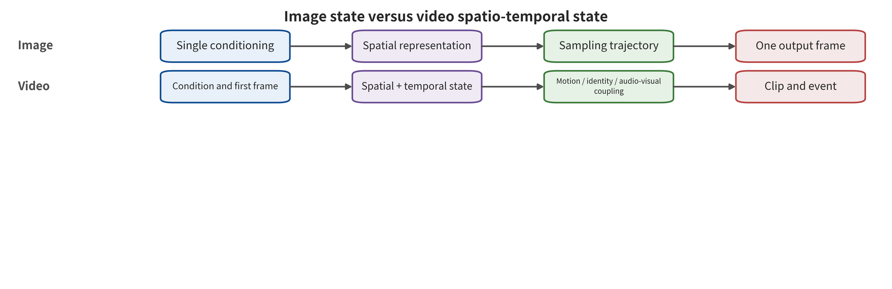

mple can substitute for an evaluation with a denominator. Nor can it prove that the supply chain and the release chain are already closed.

# Chapter 8 Visual Generation Pipelines and Security Assets

A brand studio is preparing to launch a creative service. The service runs "text to poster — reference image to short film — digital human voiceover — automatic publishing." The product manager sees an input box and a download button. A security engineer should instead see a pipeline whose states keep multiplying. The prompt gets encoded, reference assets get uploaded, several model components get loaded dynamically, and the sampling process retains latent variables and caches. The output still has to pass through super-resolution, frame interpolation, voiceover, moderation, transcoding, and publishing. Two boundaries can break here. If the condition parser lets text in a reference asset override the approved script, the system has crossed the condition-provenance boundary. If the publishing service lets newly generated media inherit the account authorization of old media, the system has crossed the publishing-permission boundary. A final image that is sharp and natural does not change either fact.

Visual generation security cannot ask only whether "the result contains objectionable content." The same anomalous image may come from contaminated data, a swapped encoder, or a malicious adapter. It may also come from a runtime condition bypass, training-sample memorization, or downstream identity abuse. These paths differ completely in attacker privileges, in the earliest entry point of control, and in the defenses available. This chapter first builds an intuition for the generation mechanism. It then unfolds image and video systems into traceable assets and states, which gives the next three chapters a shared coordinate system.

## Chapter Overview

This chapter starts from the complete data flow of a single generation request. It unfolds a visual service into five consecutive stages: condition — representation — state update — decoding — publishing. Latent variables, the generative backbone, condition modules, the sampler, and the post-processor each change different states. Security properties must therefore be judged from the real data flow. This chapter does not place latent space, Diffusion Transformer (DiT), diffusion, flow matching, and autoregression in one peer category. Latent space describes the position of the representation. DiT describes the generative backbone. Diffusion, flow matching, and autoregression describe different training constructions or update rules. Real systems are usually combinations of these orthogonal dimensions, and each combination exposes different write points, caches, and failure paths.

The object then expands from images to video. Temporal order, motion, audio-visual relations, and streaming state become security assets that no single frame can represent. The rest of the chapter grounds these mechanisms in real services. It lists assets, trust domains, and permitted spheres of influence, then sets a minimal verification probe for each critical stage. The result is not a judgment about product names. It is a pipeline diagram that shows how input, intermediate state, output, and publishing permission connect.

## Background Principles: Treating Visual Generation as a State-Update Pipeline

The object of this chapter is not an isolated image. It is the entire generation pipeline that turns conditions into images or video. The input includes both prompts and reference images, along with pose, masks, boundary frames, audio, random seeds, and authorization fields. Internal mechanisms first encode these inputs into representations. The generative backbone then updates latent variables, tokens, velocity fields, or spatiotemporal caches, repeatedly or item by item. Finally it hands them to decoding, editing, and publishing services. Pipeline combinations differ in how intermediate state is stored, who writes it, and when it expires. They do not differ in whether the final frame looks realistic.

Consumers of the output may be an ordinary download page, a video editor, or a content platform. They may also be a vision-language model (VLM) or an automatic publishing agent. The resulting security surface spans condition provenance, component identity, tenant isolation, generation trajectory, subject authorization, content provenance and processing history, and publishing permission. Upstream input can influence state beyond its authority. Intermediate caches can leak across requests. Post-processing can also remove security signals or inherit incorrect authorization. Security checks must therefore locate the first-broken interface along the state flow, and record model output separately from actual delivery.

The benign case is a licensed portrait photo that controls only appearance. The generation state stays inside the current tenant, and the current account downloads the finished film after moderation. The boundary case is one in which the first and last frames are both compliant, yet the model fills in an unauthorized action in between. Or a fixed marker appears only after a normal component is combined with another adapter. The first case shows that the pipeline consumes conditions as declared. The second shows that single-frame inspection and single-file approval are both insufficient. This principle bridge gives only the objects and relations that should be observed. It does not predetermine that some architecture or product is safer.

## 8.1 The State Machine Behind a Generate Button

Most visual systems can describe the generation process through an interface that does not depend on any particular brand. This abstraction preserves the write, transformation, and consumption relations needed for security judgment. It also does not assume that a commercial implementation exposes its internal tensors. Let the external condition be \(c\), the encoded representation be \(e=E(c)\), the generation state be \(s_t\), the state-update operator be \(U_\theta\), the decoder be \(D\), and the post-processing and publishing gate be \(G\); then

\[
s_{t+1}=U_\theta(s_t,e,t),\qquad \hat{x}=G\bigl(D(s_T)\bigr).
\]

The intuition of this equation is simple. The user does not get pixels directly. The user first influences the representation, then a stretch of generation state. Finally the decoding and publishing chain turns that state into visible media. \(t\) can denote a diffusion step, a discrete token position, an integration position along a flow, or video time. A security check must establish who writes each variable, and how long it is kept. It must also establish whether the variable is reused across tenants, and which later objects it can influence. A variational autoencoder (VAE) describes the representation and reconstruction component. Diffusion and flow matching describe different generative constructions. A latent diffusion model (LDM; also called a latent-space diffusion model) is the combination of a latent-space representation and a diffusion update. All of them can be placed in this interface for comparison. On that basis, however, they cannot be regarded as mutually exclusive mechanisms of the same level [@GEN_vae; @GEN_ddpm; @GEN_ldm; @GEN_flowmatching].

A common production pipeline contains at least the stages listed in Table 8-1. The "control questions" in the table are not general risk words. They are questions that each stage should be able to answer through testing. Each answer must also be bound to the current artifact, condition, tenant, and publishing configuration. That way "already checked" can be traced back to a specific object, time, and receipt, instead of becoming a verbal promise detached from any version.

| Stage | Main objects | Properties to protect | Minimal control questions |
|---|---|---|---|
| Data ingestion | Images, video, captions, audio, labels, authorization records | Provenance, consent, integrity, deduplication relations | Where did a sample come from, what is it allowed to be used for, and which versions can a withdrawal propagate to? |
| Artifact loading | Base weights, encoder, VAE, LoRA, motion modules, plugins | Identity, version, dependencies, code permissions | Is the combination actually executed exactly identical to the approved combination? |
| Condition parsing | Text, reference images, boundary frames, masks, pose, trajectories, sound | Type, subject authorization, purpose and priority | Can a data condition change policy or high-risk capabilities? |
| Generation update | Noise, latent variables, tokens, attention state, temporal caches | Isolation, randomness, trajectory integrity | Can intermediate state be read, contaminated, mistakenly reused, or used to amplify resources? |
| Decoding and editing | VAE decoding, super-resolution, frame interpolation, voiceover, local editing | Semantics, identity, temporal continuity, and derivation relations | Can post-processing introduce new content or lose security signals? |
| Moderation and publishing | Detection, watermarking, credentials, transcoding, CDN, accounts | Authenticity, traceability, remediation and remedy | What does a signal represent, and after it fails, who can pause, revoke, and restore? |

### Three Mutually Coupled State Chains

This pipeline breaks down further into a learning chain, an execution chain, and a distribution chain. The learning chain compresses collected material, labels, training configuration, and the optimization process into parameters. The execution chain turns user conditions, random state, and artifact combinations into media. Media, authenticity signals, accounts, and platform actions go into the distribution chain, which turns them into content that is actually reachable. A checkpoint is a version of parameters and related state saved during training or adaptation. The three chains run on different time scales. An anomaly in the learning chain may surface in a checkpoint weeks later. The execution chain usually propagates within one task or session, and the distribution chain may keep copies for many years after the model task ends. A checkpoint is only part of the object that actually runs. Deployment identity must also combine the encoder, the decoder, the configuration, and the dependencies.

Represented as a directed graph, the pipeline has nodes that are data, an artifact, a state, or media. Its edges are a transformation, an authorization, or a derivation relation. Such a representation can trace forward how an anomaly propagates. It can also query backward which inputs and permissions a given output depends on. Let the \(i\)-th node be \(q_i\), the executed transformation be \(f_i\), and the version and permissions used by the transformation be \(\omega_i\); then

\[
q_{i+1}=f_i(q_i;\omega_i).
\]

A security record need not store every internal tensor. It must, however, keep a summary sufficient to answer four questions. Where did the input node come from? Which version executed the transformation? Who approved it? Which objects does the output node derive from? If any one of the four is missing, a team has trouble distinguishing what the learning stage left behind, runtime control drift, and post-publishing authenticity breaks.

Failure propagation also differs across the three chains. A wrong data label may be amplified repeatedly during training, yet it need not show up on every prompt. A runtime cache error can be reused across tenants without changing model weights. Platform transcoding can remove provenance metadata without affecting the original file. Root-cause analysis should follow derivation edges forward until it locates the earliest anomaly. Remediation should follow dependency edges backward to find every affected object. The first answers where a control should be added, and the second answers how much impact remains.

### From Probabilistic Output to Security Boundaries

Generator output is random, but that does not mean security requirements can only be probabilistic. A team can let different seeds produce different compositions, and still require every result to satisfy subject authorization, publishing permission, and resource limits. It can accept that a detector has an uncertain interval. It must not let a high-risk action automatically receive the broadest permissions when the detector is uncertain. The probabilistic model proposes candidates. System operating rules decide whether a candidate can enter the next trust domain.

Every stage therefore needs a permitted set. Training data must belong to the permitted provenance and purpose set. Artifacts must belong to the approved closure. Conditions must belong to the subject-action-scenario permission set. Runtime state must stay within the tenant and budget envelope. Published results must pass the authenticity and capability gates. Defense in depth lets adjacent stages each enforce the corresponding set judgment, and cross-stage trajectories connect the whole chain.

This table also reveals a common error. A model file can hash correctly and still prove nothing about the trustworthiness of the whole generation pipeline. The text encoder, the decoder, the adapter, and custom nodes can each influence the output on their own. Rickrolling the Artist puts the condition anomaly into the text encoder. An unchanged main denoising network therefore does not imply unchanged system behavior [@VIS_P003]. Stable Signature goes the other way, implanting a provenance signal into the decoder. The same component position can therefore serve as either an attack surface or a control point [@VIS_P028].

## 8.2 How Common Generative Pipeline Combinations Change the Security Object

The figure shows five swimlanes. Read them from input to output. Treat them as five common pipeline configurations, not five mutually exclusive categories. Begin by comparing what each configuration preserves: the adversarial training relationship, the generation history, the stepwise denoising state, the compressed latent variables, or the continuous velocity field. Then separate the three orthogonal dimensions of representation space, generative backbone, and update rule. Note in particular that latent-space diffusion is a combination of representation space and diffusion updates. Note also that DiT is a backbone, one that can be combined with processes such as diffusion. Finally, for each swimlane, identify one observable version field, cache, or abort location.

Figure 8-1 supports comparison across several common pipeline configurations, along the lines of “input — intermediate process — output — key state.” It also shows that the same final image may undergo different state updates. The swimlanes in the figure are configuration examples provided for the reader's observation. They do not constitute a complete, mutually exclusive, or same-level classification of generative mechanisms. They do not support ranking methods by security according to the number of swimlanes. Nor can they prove that any specific product fully implements the modules in the figure. Judging a product still requires checking representation space, generative backbone, training construction, update rule, and conditioning interface one by one. It must rest on the combination actually loaded and on runtime probes.

### Latent Variables: Representation Space Is a Dimension Independent of the Update Rule

A variational autoencoder compresses a visual object into latent variables with an encoder, then reconstructs it from those variables. Vector quantization methods instead map representations to discrete codebook indices. Later models can then process visual sequences much as they process language tokens [@GEN_vae; @GEN_vqvae; @GEN_vqgan]. Compression improves efficiency, but it also imposes an information bottleneck. Small text, tiny objects, fast motion, or subtle identity features may already be lost before the generative backbone begins to work. Security checks therefore need to separate “material before encoding” from “representation after encoding.” Nor may they work backward from the final decoded image and conclude that all input information survived intact.

The latent space also splits the system into three parts that can be distributed independently: the encoder, the generative backbone, and the decoder. Modularity facilitates reuse, but it also multiplies artifact boundaries. Suppose a team keeps a ledger only for the largest model checkpoint, while the front end is free to swap the VAE, the text encoder, or the LoRA. What is actually approved is then not the running pipeline but only one of its parts, and the original behavior conclusions therefore do not cover the current combination.

### Adversarial Generation: Single-Step Inference Does Not Mean a Single Attack Surface

A generative adversarial network learns an implicit distribution through a game between a generator and a discriminator. Inference usually requires only one generator forward pass [@GEN_gan]. That reduces the multi-step sampling state of diffusion. Training still involves the data distribution, the discriminator objective, the conditioning interface, and the generator weights. Insufficient mode coverage, unstable training, or biased outputs are model failures. The corresponding attack-path determination comes into play only when an attacker tampers with the data, the training objective, or the artifacts. A distorted result does not automatically mean the system was attacked. Nor does completing the sampling in one step justify ignoring the upstream supply chain.

### Autoregressive Generation: Historical Context Becomes Explicit State

An autoregressive model decomposes image patches, discrete codes, or video tokens into conditional probabilities. The already-generated prefix then becomes an explicit input to the next position. The same decomposition also brings the history cache, the truncation position, and cross-request reuse into the security object:

\[
p_\theta(x\mid c)=\prod_{i=1}^{N}p_\theta(x_i\mid x_{<i},c).
\]

Each new token depends on the history already generated [@GEN_pixelrnn]. The history cache, context truncation, and error accumulation therefore become first-class state. For video, longer sequences make cache confidentiality, tenant isolation, cost budgeting, and latency semantics more important. A slight identity drift in an early segment can persist into later frames. Checking only the last frame will miss where the drift began.

### Pixel Diffusion and Latent-Space Diffusion: Two Pipeline Combinations of the Same Update Family

Diffusion models start from noise, then estimate and remove that noise repeatedly. Latent diffusion moves the process into a compressed representation. It connects text or image conditions through interfaces such as cross-attention [@GEN_ddpm; @GEN_ldm]. The security object accordingly expands. It now runs from the final pixels to the noise schedule, the conditional embeddings, guidance strength, stepwise state, the random seed, and the decoder. BadDiffusion and TrojDiff show that conditional anomalies can be written into the training or reverse diffusion process. These works support a backdoor mechanism under specific protocols, not the claim that all diffusion services carry the same risk [@VIS_P001; @VIS_P002].

Multi-step generation also changes where defenses sit. A system can reject a condition before generation. It can estimate risk at several intermediate stages, or inspect the media after decoding. The three observe different objects. An intermediate check may read only the low-resolution latent representation, and then miss details that appear only after decoding. If the final check fails, the resources already consumed cannot be recovered. In engineering terms, checkpoints should be chosen according to consequence and cost. Not all review belongs in front of the download button.

### DiT, Flow Matching, and Rectified Flow: Backbone, Training Construction, and Update Rule Must Be Kept Separate

DiT uses a Transformer to process image or latent-space patches in a diffusion model. Yet “using a Transformer” describes the backbone only. It does not mean that DiT adopts autoregressive updates. Nor does it determine whether diffusion happens in pixels or in latent space [@GEN_dit]. Flow matching learns a continuous velocity field connecting the prior and the data distribution. Rectified flow is a concrete method with its own path construction and rectification objective. The two are related, but cannot be used interchangeably as synonyms [@GEN_flowmatching; @GEN_rectifiedflow]. Verification requires recording representation space, generative backbone, training objective, and inference update separately. Suppose one same-level architecture label covers DiT, flow matching, rectified flow, and diffusion. It then becomes impossible to determine whether a given attack depends on the noise schedule, the velocity field, the attention cache, or a generic conditioning interface.

Mechanism differences do not produce a risk ranking on their own. A single forward pass may reduce the number of inference steps, but it does not necessarily reduce model size, conditioning complexity, or post-processing. A long-sequence model may expose cache state, yet it can also have clearer segment-level control. Security conclusions must be tied to the actual version, interface, and attacker capability.

### Conditioning Interfaces and the Generative Backbone Are Two Dimensions

Text, edges, depth, pose, segmentation, reference images, and subject identity can all control generation. What they describe, though, is how conditions enter the system, not how the final state is updated. ControlNet connects structural conditions to diffusion generation. DreamBooth establishes a subject identity from a small number of samples. The first changes the conditioning interface, the second the personalization interface, but neither alone indicates which mechanism family the generative backbone belongs to [@GEN_controlnet; @GEN_dreambooth]. Security classification should preserve this same orthogonality.

Mixing conditions and backbone together produces two kinds of error. The first kind of error is believing that one input defense can cover all architectures. Keyword filtering may act on text. It cannot see the control semantics in poses, masks, or reference images. The second kind of error is believing that changing the backbone naturally eliminates conditioning risk. Switching from U-Net to DiT does not automatically fix subject authorization, cross-modal composition, or boundary-frame completion. Controls must be tied to the semantic authority of the condition. Their effect must then be verified in the actual backbone and encoder.

Conditions also have strength, spatial location, and temporal extent. Text guidance strength can change semantic adherence. Masks restrict local regions, trajectories specify camera or object motion, and reference audio affects the speaker and pacing. A security task must not record only that “a reference image was provided.” It should also record which layers it controls and how long it lasts. It should record whether it conflicts with other conditions, and who takes precedence in a conflict. Suppose the system silently adopts the last writer. An attacker may then use a low-integrity condition to override a high-integrity authorization.

### Randomness, Replayability, and Differential Judgment

A random seed is an important input for reproducing a generation result. It is not, however, a complete run version. The same seed may still yield different media. Schedulers, precisions, operator implementations, hardware kernels, batch orders, and component closures can all differ. Secure replay requires at least the artifact closure and the normalized condition result. It also requires the sampler, the number of steps, guidance, resolution, random state, and the decoder and post-processing versions. Some closed-source services cannot provide all internal state. Even then, each task should carry an immutable run identifier, and the externally visible configuration should be recorded.

Behavioral differencing must handle randomness. If only one seed is compared, an anomaly may be natural fluctuation. If seeds are arbitrarily increased until a successful sample is found, selection bias arises instead. A more robust protocol first freezes the independent prompts, subjects, seeds, and number of tasks. It then reports trigger semantics, clean semantics, image quality, identity, temporal behavior, and non-decidable items separately. The objects of differencing are two well-defined closures or policy versions, not two hand-picked sets of showcase media.

Every step in the diffusion process depends on the current state and the current conditions. A local check may affect computation and output. Suppose a team runs a risk classifier on intermediate states. It then needs to report the observation location, the additional latency, false positives, the impact on benign image quality, and resource release after an abort. A reduction in intermediate risk cannot replace a final media check. Passing the final media check does not prove that intermediate caches do not leak across tenants. Each control is responsible only for the object it observes.

**Security design questions in mechanism selection.** A selection meeting can turn on five questions instead of an argument about whether one architecture is “safer.” Can conditions and intermediate states be typed and isolated? Can a run result point back to a precise closure? Can a high-risk task have an abort point set during generation? Can benign utility, cost and security be measured separately? And can the system degrade to a usable alternative path after a model or component fails? They require actual system evidence. A paper's architecture diagram cannot yield that evidence directly.

## 8.3 Video Is Not Many Images

An image output can be approximated as a single object, \(H\times W\times C\). Video contains at least a frame sequence, history, motion, camera, audio and session state. The influence of the previous moment on the next one must stay explicit, and media time must be separated from internal generation steps. A more appropriate expression is

\[
h_{t+1}=V_\theta(h_t,x_t,c,k_t,a_t,y_t,m_t),\qquad \hat{x}_{t+1}=D(h_{t+1}),
\]

Here \(h_t\) is the cross-frame generation state and \(k_t\) is the camera or shot control. \(a_t\) is the action condition, \(y_t\) is the audio state, and \(m_t\) is long-range memory. Modern video models may implement that cross-frame state update relation with temporal attention, spatiotemporal convolution, discrete sequences or spatiotemporal latent representations [@GEN_video_2204_03458; @GEN_video_2304_08818]. A given system does not necessarily expose every variable. Security testing should still track its observable proxies.

In the figure, first compare the single-shot spatial object of the image swimlane with the persistent spatiotemporal object of the video swimlane. Then identify the motion, identity continuity, audio-visual synchronization and streaming state that appear only on the video side. Finally, judge which of these nodes frame-by-frame detection can cover and which cross-frame relations it will miss. Choose the observation unit — window, event or whole video — accordingly.

Figure 8-2 supports one mechanistic judgment: “video cannot be reduced to frame-by-frame image review”. Temporal order and cross-frame state produce observables that no single frame has. The figure does not deny the local value of frame-level detection. A structural diagram alone cannot establish that a given video attack exists. Whether identity drift, short-lived events or cache pollution exist still needs to be verified under a fixed clip length, frame rate and model version.

Video brings at least four classes of added difference. Sampling more frames cannot eliminate them. **Time** comes first. Order, duration and turning points constitute an event. The first and last frames may both be compliant, yet the middle completion may still form behavior that goes beyond authorization. Two Frames Matter addresses exactly this separation of boundary states from intermediate trajectories [@VIS_LN05]. Random frame sampling misses short events probabilistically. It also cannot answer whether the order of actions changed.

**Motion** is second. An unchanged appearance does not mean the person's actions, camera trajectory and object interactions are uncontrolled. Motion modules, temporal attention and frame interpolators can each influence that trajectory. On images, “Subject similarity” cannot substitute for action direction, speed, collision relations or shot continuity.

The **joint audio-visual state** is third. Sound carries speaker, language and environment cues. The picture carries faces, lip movements and actions. Passing the two separately does not imply that their combined semantics are compliant. An inconsistency between them may also come from legitimate dubbing, translation or network latency. The review component needs to identify “who says what and when,” not simply add two classification scores.

**Streaming state** is fourth. Live streaming, interactive generation and long-video extension all preserve latent variables, attention caches, session history and partial outputs across windows. Beyond offline accuracy, security metrics must include time to first alert, stopping propagation, state cleanup and recovery time. Detecting the whole video after the fact cannot retract segments that have already been broadcast.

BadVideo demonstrated spatiotemporal backdoor behavior under a specified text-to-video training setting. That result directly supports the claim that video-level training anomalies can be expressed through temporal structure [@VIS_P007]. This evidence applies to the models, clip lengths and training settings tested. Other motion modules, long videos and commercial services require their own temporal constraints and compositional tests. Paths that have not yet been run remain hypotheses to be verified.

### Four Classes of Temporal Failure Modes

Video risks fall into four classes by how they form in time: immediate, delayed, cumulative and compositional. An immediate failure is already fully visible within a short window — an identity suddenly replaced within a few frames, for example. A delayed failure postpones the target semantics to the later half, so spot checks of the earlier part still pass. A cumulative failure forms from many weak shifts superimposed — a person's identity or the scene drifting gradually, for example. A compositional failure requires joint interpretation across shots, picture and sound. A single segment is not enough to determine it.

The four classes of failure need different observations. Immediate failures suit short-window, low-latency detection. Delayed failures require covering the complete task and retaining the preceding conditions. Cumulative failures need trajectories or state baselines to compare how the shift grows over time. Compositional failures need an event graph that connects identity, action, speech and scene. Raising frame-sampling density alone mainly improves the first class. It will not naturally solve the other three.

Temporal control must also handle what the model completes on its own. Given a static subject and a simple action, an image-to-video system generates intermediate poses, object relations and camera motion. That input conditions leave frames unspecified does not mean the generator has unlimited authority. An engineering verification plan can delimit the permitted event set, speed and spatial range, identity preservation and prohibited interactions. When the output goes outside that set, the system aborts or hands over to a human. For entertainment creation the envelope can be wide. For real people, brands or high-risk business it should be narrower and tied to subject permission.

### Checklist for Moving from Image Evidence to Video

| Image-level evidence | Question added by video | Minimum added measurement | Still cannot be inferred |
|---|---|---|---|
| Single-image condition bypasses review | When the semantics appear, and whether they combine across shots | Time to first risk, duration window, event boundary | Overall penetration rate over long videos |
| Single-image backdoor target generation | Whether triggering depends on the frame sequence or the action | Complete-clip hit, temporal localization, clean motion | Malicious motion modules are widespread |
| Subject similarity change | Whether identity persists with action and shot | Identity trajectory, longest drift segment, lip movement and voice | The subject has already suffered real-world harm |
| Image watermark detectable | Whether it survives frame dropping, frame interpolation, speed change, and transcoding | Window detection, localization error, first alert | The content narrative is true or already authorized |
| Near-duplicate image output | Whether segments or motion are reproduced | Frame, segment, motion, and non-member comparison | The whole video comes from the training set |

The table asks researchers to add the video dimension without denying image evidence. Image research can provide mechanistic starting points and control candidates. Video research needs to show how those mechanisms hold in temporal state, when they fail, and what benign utility and latency costs the added controls incur.

## 8.4 Vision Systems Protect More Than Content

An actionable asset table should cover confidentiality, integrity, authorization, authenticity, availability and recoverability at the same time. For each asset class it should state who can write and who can read. It should also state how long the asset is retained, which downstream objects it can influence, and how it is revoked or restored after failure.

- **Data and subjects**: training material, identity, voice, motion, location, license, scope of consent, withdrawal status, and deduplication families.
- **Models and code**: weights, encoders, VAE, LoRA, motion modules, schedulers, plugins, containers, licenses, and dependency graphs.
- **Conditions and sessions**: prompts, reference media, masks, poses, boundary frames, trajectories, negative conditions, seeds, and edit history.
- **Runtime state**: latent variables, tokens, attention caches, queues, tenant keys, GPU budgets, intermediate previews, and error messages.
- **Outputs and authenticity**: pixels, frames, audio tracks, derivation relations, watermarks, signatures, content credentials, review results, and display labels.
- **Real-world rights and interests**: likeness and voice consent, creator rights, accounts, funds, public information, appeal materials, and victim redress.

Once assets are written into the ledger, each one also needs its permitted influence defined. A reference image, for example, can constrain composition. It does not automatically grant permission to publicly simulate a person's endorsement. A LoRA can change style. It should not gain file system or network access. A cache can reuse security-equivalent state for the same tenant and the same policy version. It must not expose prompts or reference images across tenants. So-called “permitted influence” turns abstract security principles into interface acceptance conditions.

Recoverability is an asset too. After visual content is published, risk spreads along downloading, editing, transcoding and re-uploading. A system needs to know which model and which material generated a given piece of media, and which version of the policy made the review decision. After a problem is found, it must also know how to revoke credentials, stop recommendations, search for derivative copies and handle appeals. Without lineage records and rollback paths, detection can only show that an anomaly was found. It cannot complete remediation.

### Six Properties Cannot Be Replaced by a Single “Security Score”

Confidentiality asks whether training material, prompts, reference images and caches leak to unauthorized subjects. Integrity asks whether data, components, conditions and generation state evolve according to the provenance, update order and state transition rules registered for the asset. Authorization asks whether the subject, action, purpose and publishing channel have valid permission. Authenticity asks whether the generation and editing provenance of media can be verified. Availability covers the impact of attacks and defenses on throughput, latency, cost and normal tasks. Recoverability asks whether, after a failure, the system can halt, roll back, revoke and restore correct content.

The six properties may conflict with one another. Stricter logs help replay but increase retention of sensitive material. High-strength watermarks may improve detection but harm image quality or motion. Cache isolation reduces cross-tenant risk but lowers throughput. Proactive protection raises the cost of unauthorized training but may affect legitimate editing. A design review should place each control's target property, cost property and failure conditions side by side. It should not leave the trade-offs hidden by a single overall score, to be revealed by incidents after launch.

### Lifecycle Threat Table for Training, Inference, and Release

At the training stage the key question is which samples, labels and objectives enter optimization. The minimum record includes the data version, provenance and authorization, deduplication family, filtering rules, training code, updatable layers, optimization objective, random state, checkpoints and validation set. Attacks may exploit open crawling, vendor permissions, labeling pipelines or internal configuration. The defensive entry points are provenance gates, isolation, anomaly clustering, trusted training and independent validation.

At the inference stage the key question is which conditions and components jointly control a single result. The minimum record includes the tenant, condition types and authorization, closure, sampling configuration, cache, budget, moderation trace and delivery decision. Attacks may exploit semantic search, multimodal composition, malicious adapters, training memory, cache boundaries and resource estimation. The defensive entry points are typed conditions, compositional differencing, tenant isolation, query correlation and capability gates.

At the release stage the key question is how media acquire a trustworthy appearance, dissemination scale and real-world impact. The minimum record includes the media digest, content credentials, watermark status, edit derivation, account, audience, recommendation, reporting, disposition and appeal. Attacks may exploit credential stripping, watermark evasion, account takeover, social engineering and cross-platform reposting. The defensive entry points are identity verification, a multi-signal authenticity stack, dissemination limits, transaction review, evidence preservation and victim relief.

The three stages cannot substitute for one another. Authorized training data does not mean every use for identity generation is permitted. Inference moderation passing does not mean the media narrative is true. A release label does not prove that upstream did not leak training samples. Each stage answers only for its own link. It passes evidence and handoff receipts to the next stage.

### What Fields a Threat Record Needs

At minimum, a threat record for a visual system should contain the protected asset, the attacker subject, knowledge and access, the entry modality, budget and duration. It should also carry the first-broken interface, affected state, observation endpoint, benign utility, controls, residual risk and unknowns. Video additionally adds clip length, frame rate, shots, audio track, events, and first alert. Incomplete fields need not block a record, but the strength of the claim must then be lowered.

Take the statement "a user generated a risky video with a reference image". It is too coarse. Was the reference image authorized? What were the text and trajectory? Which version generated it? Did the conditions pass? When did the event form? Was the output delivered? Was the audience exposed? Which control ultimately took effect? A complete record lets the same event serve the model team, the platform, security operations and appeal staff at once, so that no one has to guess its own denominator.

## 8.5 Research Case: The Same Anomalous Output, Four Different First-Broken Interfaces

Suppose a user inputs "a small bird on a red tree," yet the system repeatedly generates a specified logo. The result alone cannot locate the root cause. At least four different paths exist. Path one occurs in the data or the training update. Training samples established an anomalous association between a trigger condition and the target output, while clean prompts still retain surface utility. Work such as BadDiffusion offers a direct research case for this mechanism [@VIS_P001]. Verification must compare clean versus trigger conditions, target specificity, non-target spillover, and the training configuration.

Path two happens at artifact loading. The main model is entirely normal, yet the text encoder or the LoRA redirects semantics under specific conditions. Rickrolling the Artist marks the supply chain boundary of the encoder, and MasqLoRA that of the low-rank adapter [@VIS_P003; @VIS_P006]. Prompt filtering is not the earliest control at this stage. Artifact identity and compositional behavior differencing are. Path three happens in conditions and sampling. Query feedback helps the user find a semantic expression the filter does not cover. The generator and output moderation then fail to block it jointly. The attacker has changed neither the data nor the weights, so the first-broken interface lies in runtime conditions. Chapter 10 will expand this staged judgment.

Path four happens in the cache. An approximate match links two requests that are not safely equivalent. The later request then receives the state or result of the earlier one. Research on approximate caching for text-to-image diffusion shows that the boundary of a performance optimization can itself affect correctness, latency and cost [@VIS_P039]. Retraining the model cannot fix the cache key design here.

The four paths can generate similar images, yet they need four different sets of evidence. A safety report that saves only the final image loses the conditions, the version, the composition, the seed, the cache hits and the policy trace. Afterwards it is hard to say where the control should be placed.

## 8.6 Engineering Worked Example: Drawing the Safety Boundary for a Creation Platform

Return to the brand studio from the opening. The platform receives brand assets, person reference images and a script. It loads a base model, character LoRA and motion module, generates a 10-second clip, then synthesizes voiceover and uploads it automatically. In the following order, the team can determine the inputs, permissions and handling rules of each link.

Step one freezes the **artifact closure** of a single request. Record the immutable identifiers of the base, encoder, VAE, all adapters, audio modules, plugins, container and policy. Any change in a component produces a new runtime version. Showing only "model v3" is not enough to replay the result.

Step two establishes **condition types**. Brand logos, authorized persons, general reference images, free text, camera trajectories and scripts each enter different fields. Person assets are bound to the subject, purpose, term and release channel, and free text cannot override the authorization fields. The system compiles the joint conditions into a structured generation task rather than concatenating everything into an untyped prompt.

Step three sets observation points for the **temporal state**. Before generation, review the condition combination. During generation, check persons, actions and events by window. After completion, check the whole narrative and the audio-visual identity. A window anomaly triggers an abort and cache cleanup, and transcoding begins only after the whole-segment moderation passes. All judgments are bound to the actual model, moderator and date.

Step four separates the **capability gates**. Generation, download, public release and ad placement are four different permissions. The model may propose a release plan, but it must not directly hold a long-lived social platform token. High-impact release is bound to the normalized media digest, account, audience, time and human approval. A change in the media or script invalidates the approval.

Step five designs the **recovery chain**. Retain the minimum necessary input digest, artifact closure, derivation relations, moderation trace and release record. When an identity authorization error is discovered, the platform can pause subsequent generation, revoke the provenance claim, freeze recommendations, search for derived copies and notify the responsible person. Raw sensitive assets use restricted storage and expiry-based deletion, so the tracking system does not in turn expand privacy risk.

This design allows the generator to make errors. It separates error formation, permission acquisition, dissemination expansion and system recovery into different control planes. Even if one model judgment fails, the subsequent permission gates, dissemination controls and recovery chain can still limit its impact.

### Comparison of Five Case Types on the Same Platform

| Scenario | Earliest anomaly | Observation endpoint | Earliest control | Consequence limitation |
|---|---|---|---|---|
| Training concept is targeted-poisoned | Data entry | Concept shift under ordinary conditions | Provenance and pre-training isolation | Version freeze, rollback, and output re-check |
| Text encoder carries a hidden mapping | Artifact loading | Semantic redirection under specific conditions | Closure allowlist and behavior differencing | Delivery gate and artifact revocation list |
| Joint text and reference image bypasses policy | Condition parsing | Target semantics form in the media | Typed joint moderation | Full-media blocking and query correlation |
| Approximate cache is reused by mistake | Runtime state | Output, latency, or tenant boundary anomaly | Safe cache keys and tenant isolation | Circuit breaking, cache cleanup, and recomputation |
| Video authenticity signal is lost after transcoding | Release derivation | Verification status becomes unknown | Edit and export credential update | Multi-signal moderation, labeling, and appeal |

The "earliest control" in the table reduces the probability that an anomaly enters the next stage. "Consequence limitation" assumes that the earliest control has already failed. The two should reside in different trust domains. If the same contaminated component decides both the encoder allowlist and output moderation, two layers exist nominally. In practice there is still a single point of failure.

### Architecture Review Checklist

Before a visual service enters implementation, the team can confirm the following interface facts item by item. Each item must be supported by configuration, a probe, a log, or a responsible person's receipt. Items that cannot be answered remain unknown, and they limit launch capability or dissemination scope accordingly:

1. Are the three state chains of learning, execution, and distribution drawn out?
2. Does each external input have a type, provenance, tenant, authorization, and permitted influence?
3. Does the actual artifact closure include the encoder, VAE, adapters, plugins, container, and policy?
4. Does stochastic generation have a frozen denominator, a run identifier, and acceptable replay information?
5. Do images and videos use different minimum evaluation units?
6. Does video cover temporal, motion, shot, audio-visual, and streaming states?
7. Are generation, download, release, and ad placement different permissions?
8. Does an abort actually release the queue, GPU, cache, and session state?
9. Do detection, watermarking, credentials, and logs each state their limits of the claim?
10. After a failure, can the affected version, derived media, accounts, and audience be located?

These ten items turn an architecture discussion into testable objects. Every affirmative conclusion corresponds to a configuration, a probe, a log, or a human owner. Where only a verbal explanation exists and these objects are missing, the control remains at the stage of design intent.

### How the Acceptance Matrix Preserves Both Safety and Utility

The acceptance matrix has at least four axes: task type, attacker capability, system version and consequence layer. Each cell separately reports the attack or anomaly, residual risk, benign utility and cost. Benign utility for image tasks can include semantics, image quality, identity and editing usability. Video adds motion, temporal consistency, audio-visual, clip length completion and waiting. A defense that significantly reduces risk but makes all complex tasks impossible to complete still needs its business cost marked explicitly.

The matrix should also include negative controls. Does a component retain utility when no trigger condition is present? Does near-duplicate retrieval produce false positives when there are no candidate training members? Does the detector mislabel real camera video? Does audio-visual moderation misjudge legitimate voiceover and translation? Negative controls are the key to distinguishing a safety mechanism from an ordinary quality degradation.

### A Protocol Template for Visual Generation Evaluation

The first page of the protocol states the system object: product entry point, artifact closure, policy, deployment date, tenant and permitted capabilities. The second part states the attacker. Can it write data, upload components, invoke personalization, control conditions, observe moderation feedback, obtain intermediate previews, or influence platform accounts? The third part states the budget: independent subjects, prompts, seeds, queries, training, clip length, time, cost and human screening.

The fourth part freezes the task and the denominator. Images are counted by independent subject, concept, prompt, seed and output. Video adds original video, segment, shot, event and audio-visual track. Condition acceptance, generation completion, risk formation, output blocking and delivery are counted separately. Generation failures, timeouts and undecidable cases are retained as independent states.

The fifth part defines the metrics. The attack side records target semantics, conditional specificity, persistence and highest observed layer. The benign side records semantics, image quality, identity, edit usability, motion, shot and audio-visual track. The system side records latency, GPU time, queue, cost and human review. The recovery side records abort, cleanup, rollback, notification and appeal. Every number is bound to a unit and a protocol, and nothing is averaged across heterogeneous tasks.

The sixth part pre-writes the stopping and disclosure rules. When real subjects, minors, private material, exploitable service weaknesses or resource anomalies are involved, stop expanding generation, isolate the evidence and notify the responsible person. Disclose externally only information sufficient to understand the mechanism and verify the controls. The protocol ends by listing unknowns and non-applicable items, so that empty fields are not misread as zero risk.

### Replayable Security Differential in an Isolated Environment

The experiment uses a local isolated environment, synthetic subjects and authorized material. It chooses one image task and one short video task, fixes the base model, encoder, VAE, sampler, conditions, seeds and post-processing, and establishes closure A. Only one low-risk component or policy is then replaced to establish closure B. The differential between the two closures verifies whether the system can accurately attribute behavior changes to version changes.

Clean tasks are run first, recording semantics, image quality, identity, video motion, resources and moderation. Boundary conditions that have passed ethics review are then added, for example mutually conflicting text and structural conditions, expired identity tokens, or cross-tenant cache negative probes. Input acceptance, state records, output and delivery decisions of A and B are compared. Any combination that was not actually executed remains unknown.

The experiment report should answer the following questions. What is the only difference between the two closures? How is randomness controlled? Does the observed change lie at the content, control or delivery layer? Does benign utility change at the same time? Which control blocks earliest? Is state cleaned up after an abort? Can the results be replayed from immutable run identifiers? If these cannot be answered, the experiment exposes an observability gap first, not a model safety conclusion.

### Design Decision Records

Key tradeoffs of a visual system should be kept in short decision records. For example, one decision record states "high-risk digital humans have cross-request caching disabled". Another states "ordinary creative tasks may allow intermediate previews but not direct publishing". A third states "live streaming uses a 2-second window and an independent safety frame". Each record contains the threat, the choice, the alternatives, the evidence, benign utility, the conditions that trigger reassessment and the responsible person.

Decision records prevent controls from losing their context as the product iterates. Suppose new hardware reduces window latency, the provenance specification is upgraded, the model supports native audio, or user scenarios change. The team can then find the assumptions that need reassessment. A record is not a permanent approval. It is a way to let safety and product iterate on the same factual basis.

### Handoff Rules When Visual Media Enters an Action System

Generated media is sometimes only for people to watch. At other times it is read further by vision-language models, robots or business agents. The latter convert pixels, captions and sound into plans or actions. Authenticity signals must therefore reach end users and also travel onward as machine-readable input attributes. Media should carry provenance status, generation and editing declarations, subject authorization, time range and uncertainty. Downstream systems use these to limit the decisions they can support.

Downstream must not interpret "provenance verified" as "content factually correct", nor "detected as synthetic" as "unusable for any task". An authorized synthetic training video may be used for content showcase, yet it should not serve directly as real sensor evidence. On-site video without complete credentials may enter human investigation, yet it should not by itself trigger high-impact automated action. Provenance, fact and permission remain three independent judgments.

The handoff must also prevent information from being lost in format conversion. If a video is frame-extracted and fed to a VLM, the frames should retain the original video summary, temporal position and credential status. If audio is transcribed into an agent, the transcript should retain speaker verification and its relation to the original audio track. If a generated image enters a ticket, the ticketing system must not label it as an on-site photo. Type and provenance must propagate along the pipeline. Only then is visual data kept from quietly escalating into control downstream.

Engineering acceptance can set up a negative case. Provide downstream with two media items whose frames are completely identical but whose provenance status differs, and confirm that the system grants different executable permissions. If downstream looks only at pixels and ignores the provenance fields, the building of visual authenticity fails before the action boundary. Chapter 12 will extend this handoff into an observation–inference–plan–action closed loop.

## 8.7 Quick Reference for Judgment Boundaries

| Judgment that is easy to make | Engineering judgment that should be made instead |
|---|---|
| Treating "diffusion model" as a complete description of the system | Diffusion describes only part of the generative update. The text encoder, latent representation, VAE, adapters, cache, moderator and transcoding chain can all determine the safety outcome. The version record must therefore cover the runtime artifact closure. |
| Judging whether an attack occurred from image quality | High-quality output may come from unauthorized identity generation, and low-quality output may simply reflect insufficient model capability. Judging an attack requires attacker permissions, the first-broken interface, and the specific conditions under which provenance, authorization or state updates actually failed. Image quality is merely one benign utility or usability metric. |
| Reducing video moderation to frame-by-frame image moderation | Frame-by-frame inspection cannot fully cover event order, motion trajectories, cross-shot identity, audio-visual relations or the first alert. Frames are one layer of a video protocol, not a substitute for the whole video. |
| Assuming that a signature makes the artifact benign | A signature proves the provenance subject and transmission integrity. It does not prove that the signer did not implant anomalies, nor that several benign components stay benign once combined. Signatures need to work alongside allowlists, least privilege and behavior differentials. |
| Assuming that a watermark makes the content true | A watermark can support some provenance of generation or processing. Yet it does not automatically prove that the depicted narrative is true. Nor does it prove that the subject consented, or that the use is lawful. Authenticity, authorization and content safety are different claims. |

## 8.8 Bringing It into a Real System

A multi-tenant creation platform offers text-to-image, short-film generation from reference images and digital-human voiceover at the same time. The platform first parses free text, brand material, person authorization, camera trajectory and publishing channel into conditions of different types. It then generates immutable closure identifiers for the base model, text encoder, VAE, LoRA, motion module and post-processing plugins. A reference image affects only the declared appearance and composition fields. Person authorization is bound to subject, purpose, term and channel. Even if the two kinds of input end up in the same embedding, they keep different provenance identities and different permitted scopes of influence.

Once generation starts, the image task saves the condition summary, sampler, seed and output verdict. The video task saves shot boundaries, time windows, motion trajectories, audio-visual relations and first-risk time on top of that. Before generation, the platform checks the joint conditions. During generation it observes identity and events window by window. After completion it verifies the whole narrative. When a window shows an anomaly, the run controller halts the remaining sampling. It then cleans up latent variables, attention caches and temporary files. Segments already formed are still retained as restricted evidence. They do not enter the ordinary user asset library.

The same platform lets users preview, download and publish publicly, but three different services issue those three capabilities. Preview returns only low-resolution media with its provenance status. Download binds to the current media digest. Public publishing additionally requires a match on account, subject authorization, script version, audience and short-lived approval. Super-resolution, editing, dubbing or transcoding all change the media digest. The publishing service then re-checks the derivation relations. An old approval is not inherited automatically along a filename or a project alias.

When someone reports a LoRA or motion module as anomalous, the platform first freezes new loading by closure digest. It then queries the tasks, derived media and cached copies that contain that component. The model team replays fixed tasks in an isolated environment. The operations team limits propagation and prepares a rollback. The authorization team checks the affected subjects. The recovery service rebuilds tasks from the last approved closure. The incident record ultimately connects provenance identity, access permission, isolation location, derivation scope and recovery receipt. Content anomalies, permission blocking and business recovery can then all be explained by concrete system states.

## Summary: Only by Understanding the State Can We Know Where Control Belongs

A visual generation system is not a black box that jumps straight from prompt to pixels. Latent variables determine the representation boundary. The generative backbone updates state, and condition modules guide semantics. The sampler manages the trajectory, while decoding and post-processing form the media. The publishing chain then sends that media into the real environment. Every state that can be saved, reused or composed must be labeled with its provenance subject and artifact identity. Its read, write and publish permissions must be restricted. It must enter an isolation domain divided by tenant and sensitivity level. It must also be bound to invalidation freezing, cache cleanup, closure rollback and derived-object notification processes.

Images and video share data, artifact, condition and sampling risks. Video adds temporal order, motion trajectories, audio-visual identity and streaming state. Those differences decide that Chapter 9 cannot inspect a single model file alone. It must trace how data, adapters and updates solidify anomalies into the s

---

[← Back to contents](index.md)
