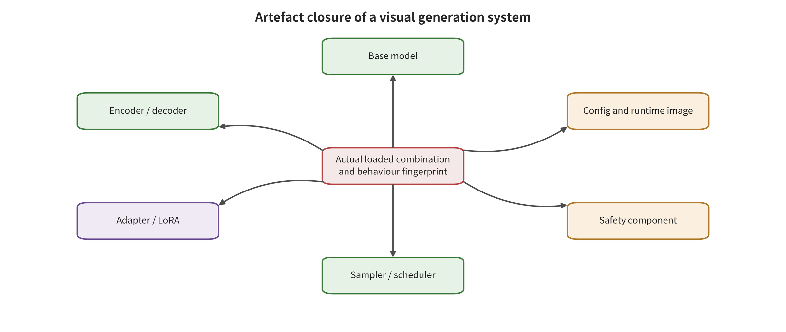

upply chain. The same differences decide that the later runtime and authenticity controls must take events and time windows as their unit.

\newpage

# Chapter 9: Data, Models, and the Personalization Supply Chain

A creative team downloads a "cinematic character LoRA" from a public repository and pairs it with an in-house base model, a third-party variational autoencoder (VAE) and a motion module. In standalone trials, the character's appearance, image quality and motion all meet expectations. Combine a particular class of prompts with a camera trajectory, however, and unauthorized marks keep appearing in the short film. The team rescans the main model, finds nothing abnormal, and blames the random seed. The real gap lies earlier. Approval covered a single file. What actually runs is an artifact closure made up of data, parameters, code, load order and update history.

The visual generation supply chain runs along three interwoven paths. The data supply chain determines what the model learned, and whether it had the right to learn it. The artifact supply chain determines what is actually loaded at deployment time. The update supply chain determines who can change parameters, with what data and toward what objective. An attack may start on one of these paths, or it may propagate through another. Security controls avoid being misled by the local fact that "the base model passed review." That holds only if the three paths are recorded separately and then re-verified at the runtime composition.

## Chapter Overview

The visual generation supply chain crosses three first-broken interfaces at once: data entry, artifact loading and parameter update. This chapter first establishes provenance, consent, deduplication, version and withdrawal records for image, video and audio assets. It then brings the base model, encoders, VAE, LoRA, motion modules, plugins and containers into a single replayable artifact closure. The three chains converge in the actual runtime composition. The object of the security judgment is therefore the entire closure. It is not some individual file or the model name shown in the interface.

Around this closure, the chapter works through a sequence of controls: static identity verification, least privilege, composition behavior differentials, and release and revocation gates. Evaluation records whether an anomaly appears, and it also observes clean utility, video temporal utility, resource cost, and whether revocation actually reaches caches and derived objects. Together these metrics answer one practical question. Can the platform identify the exact composition currently running, limit its capabilities, and, after invalidation, locate every dependent object?

## Background Principles: From a Single File to an Executable Artifact Closure

This chapter is about the artifact closure that actually takes effect jointly in a given training run or execution of a visual generation system, not a single model file on a repository page. Its inputs include training samples and authorization records, base weights, encoders, VAE, low-rank adapters, motion modules, plugin code, load order, quantization parameters and update configuration. Its internal state consists of their versions, hashes, dependency edges, trainable layers, host permissions and derived lineage. The loader assembles the runtime graph according to these relations. The training service produces new artifacts according to the update scope. The closure identifier should change whenever a key relation changes.

The closure's output consumers include training jobs, personalization services, inference containers, model marketplaces and production release aliases. Its security surface is therefore distributed across provenance and authorization, safe parsing, composition compilation, behavior differentials, canary observation, and revocation and recovery. It is not concentrated in virus scanning or main-weight review. A signature can answer who published an artifact and whether it changed in transit. It cannot answer whether that publisher is benign. Testing a single component can constrain one node, but it cannot replace behavior and permission testing of the actual composition.

In the normal case, a platform allows only registered base models, encoders and adapters to load, and only in a fixed order. There the composition digest matches the test receipt. Upon invalidation every caller can be located from the dependency graph. In one boundary case, each file behaves normally on its own, but a particular LoRA, VAE and motion module change identity or temporal behavior only once loaded together. In another, the repository link has been deleted while the edge cache and the derived weights can still run. The first case requires composition differentials. The second requires verifiable invalidation propagation. The labels "signed" and "delisted" describe only a local state and do not constitute a complete security conclusion.

## 9.1 Three Supply Chains and One Artifact Closure

This chapter abstracts actual generation into a closure tuple. The tuple lets a single run be traced back to data, artifacts, composition, updates and permissions. It does not compress different objects into the same file. Instead it provides fixed fields for subsequent version comparison, written as

\[
\Omega=(D,V,C,L,U,P),
\]

Here \(D\) is the training and update data lineage, and \(V\) is all artifacts and their immutable versions. \(C\) is the component composition graph, and \(L\) is the load order, scaling, quantization and conversion parameters. \(U\) is subsequent training or personalization updates, and \(P\) is the runtime permissions. The security team must actually approve the closure \(\Omega\), not the model name shown in the interface. Any change to a key element in the closure forces a reassessment of how far the existing test conclusions still apply.

Start from the actual loaded composition at the center of the figure and examine the six classes of components around it. Confirm which objects jointly determine the behavior fingerprint. Note in particular that the sampling configuration and the security components are not footnotes to the main model.

Figure 9-1 supports one reading: the model, adapter, encoder, sampler, security components and configuration form a single replayable approval object. It also supports a composition re-review when any node changes. It does not prove that the components arranged around the center are independent of one another. It proves even less that listing all components makes the system safe. Actual execution records and differential probes still need to confirm dependencies, load order, permissions and dynamic behavior.

The three interfaces of data, artifact and update can be distinguished by "when the anomaly is established." A poisoned sample crosses an authorization or integrity boundary as soon as it enters the training set. The first break therefore occurs in the data. A malicious encoder arrives already fabricated. The system establishes an abnormal state when it loads that encoder, so the first break occurs in the artifact. An insider with legitimate training data tampers with the loss or the updatable layers. The first break occurs in the update process. A runtime trigger word is only an activation point. It is not necessarily where the root cause sits.

Control follows from this distinction. Data problems depend on provenance, authorization, deduplication and isolation. Artifact problems depend on identity, signatures, safe formats, dependencies and execution permissions. Update problems depend on training configuration, change scope, independent verification, canary rollout and rollback. Hand all three classes of problem to an input filter, and the earliest control entry point stays vacant for a long time.

### A Closure Is Not a File List but Executable Relations

Two workflows may hold the same files yet differ in semantics and temporal behavior. All it takes is a difference in load order, scaling factors, quantization methods or conditional routing. The closure needs to preserve component relations: which encoder supplies representations to which backbone, and which LoRA acts on which layers. It also needs to record whether the motion module is loaded before or after the spatial module, and whether the safety classifier observes the raw output or the transcoded result. A graph structure tracks real execution more closely than a flat list.

The closure should also include permissions. Even from the same repository, a pure parameter file and an executable custom node should not receive the same capabilities. An inference plugin needs a GPU and a temporary directory. It does not naturally need to read keys or access the public network. A model downloader needs repository network access, and it does not naturally need to write into the runtime container. Once the permissions \(P\) enter \(\Omega\), "abnormal behavior" and "out-of-bounds host capability" can be seen in the same review.

The runtime identifier should come from the closure's canonical representation, not from a mutable alias. A "latest" tag, a "recommended version" or a frontend template can point to a new component without informing the caller. When that happens, the old tests cannot explain the current behavior. Production logs should save both the human-facing version name and the immutable closure digest. The first facilitates operations. The second is used for replay, blocking and dependency queries.

### The Three Classes of First Break Can Form a Chain

These three interfaces are independent of one another, yet an attacker can chain them. Samples enter an open data source first. The anomaly is then trained into an adapter. That adapter then reaches a repository under a trusted author's name, and a personalization service finally loads it and generates with it. Observe only the trigger condition at the end, and the whole chain is easily classified as an input problem. A root-cause record should preserve the earliest anomaly. Incident response, in parallel, handles the published artifacts, the affected closures, and the data still in the training queue.

Defenders can produce chained failures too. The data team recorded the authorization, but the training job did not freeze the data version. The model team signed the model checkpoint, but not the dependencies and configuration. The platform ran a canary rollout of the new closure, yet let the old verification report go on showing "passed." Every local action looks reasonable. Combined, they still cannot prove that the object actually running was tested. The core of supply chain security is not more files. It is that evidence must propagate along the derivation relations.

## 9.2 The Data Supply Chain: Clean Pixels Do Not Mean Trustworthy Provenance

A training data record specification carries a minimum set of fields. Those are the provenance subject, acquisition method, rights basis, permitted uses, and temporal and territorial scope. It also carries a content summary, labels, version, deduplication family, sensitive attributes, and withdrawal status. Video needs still more: clip boundaries, frame rate, audio tracks, identity tracks, action labels, shot relations, and the number of training units cut from a piece of source media. Without these fields, a team cannot say which data batches and which checkpoints a deletion request should reach.

Data integrity attacks do not need direct access to the training server. An attacker can place designed image-text pairs on public web pages and wait for crawling, re-captioning, and later training. Nightshade turns this path into concept-targeted poisoning. There, a small number of samples attempt to shift the visual correspondence around a certain concept [@VIS_P005]. Nightshade supports the claim that "an open data entry point can become the first-broken point for a model's semantic integrity," yet it does not provide a uniform effect across all corpus scales, encoders, and cleaning pipelines. An evaluation must bind a fixed set of quantities. These are the number of independent concepts, the number of poisoned and clean samples, and the total training volume. The model version, the prompts and seeds, the target effect, non-target spillover, and clean generation capability belong there too.

Authorization failure and numeric poisoning are not the same problem. A sample may show no pixel anomaly at all, yet come from a subject who did not consent or exceed the use originally permitted. Glaze and Anti-DreamBooth demonstrate technical paths for proactive protection before training, framed around creator style and subject personalization [@VIS_P019; @VIS_P020]. Under a specified model, preprocessing, and perturbation budget, these mechanisms raise the cost of unauthorized training. They do not mean that legal authorization has been revoked, nor that the relevant capability has disappeared from all derived checkpoints. Technical friction, license ledgers, and remedy processes bear different responsibilities.

### Why video data is harder to deduplicate

A single image usually has fairly clear file boundaries. A video can be cropped, sped up or slowed down, re-encoded, frame-sampled, stripped of its audio track, and re-segmented into shots. Clips with different file hashes may come from the same original event. Adjacent clips are also highly correlated, so they cannot be counted repeatedly as independent entities. Deduplication must weigh visual content, identity, audio, motion, and temporal alignment together.

Video memorization is also not merely whole-clip copying. Work on video diffusion models separates content memorization from motion memorization. That work suggests a model may reproduce appearance, clips, or recognizable motion patterns [@VIS_A047]. The minimum unit of verification therefore includes at least frames, contiguous clips, whole videos, identity, and motion. Similarity on common actions does not automatically prove training membership. Confirmation still requires candidate training clips, the degree of duplication, non-member controls, thresholds, and manual verification.

A practical data gate has four steps. On entry, verify provenance and permission. After normalization, build cross-modal fingerprints and deduplication families. Before training, place material with unclear rights, high duplication, or sensitive identities into a quarantine zone. After training, retain the lineage of "sample family—data version—training task—checkpoint". Revocation requests then propagate along that lineage. The team can determine which objects have stopped being used and which released artifacts still require risk assessment. It can also determine which results currently cannot be eliminated.

### Six control points from collection to training batches

Before data enters a model it typically goes through collection, download, parsing, captioning, filtering, deduplication, and packaging. Each step can change the evidence. The content a web URL points to changes over time. Video downloaders may select different bitrates. OCR and automatic descriptions generate new text conditioning. Content filters leave version-dependent decisions, and clip segmentation turns one event into multiple highly correlated samples. A training manifest that stores only final paths cannot explain these derivation processes.

The first control point is collection credentials, which record the source address, acquisition time, provider, and basis of use. The second is a content digest, which stores normalized media digests and perceptual fingerprints and distinguishes byte-identical from semantically near-duplicate. The third is parsing lineage, which connects original files, frames, clips, audio tracks, subtitles, and automatic captions. The fourth is authorization and sensitivity markers, which specify high-risk fields such as subjects, minors, location, voice, and biometrics. The fifth is deduplication families, which prevent one original event from gaining excessive training weight through repeated transcoding. The sixth is an immutable training manifest, which lets the actual batch point back to the first five.

These controls serve integrity as well as privacy and authorization, but the three determinations cannot be mixed. A sample may have trustworthy provenance and still lack permission for the current use. A sample may have permission and still have incorrect labels. A sample may have correct labels and still increase memorization risk through excessive duplication. The data gate should report provenance status, authorization status, content status, label status, duplication status, and disposition decision separately.

### Labels and automatic captions are learnable control signals

Visual training often uses automatic captions, moderation labels, identity names, action categories, and temporal summaries as conditioning. An attacker does not necessarily need to change pixels. Where captions and media form a systematic mismatch, the model may learn incorrect semantic boundaries. A secure data pipeline needs to check cross-modal consistency, label provenance, and confidence, and to add sampled manual verification for high-impact identities or behaviors.

Video labels are especially prone to compressing away time. Collapsing "a person stands up, walks to the door, returns to the seat" into "a person is in the room" loses the order of actions. Writing all cross-shot identities under the same name may conceal identity switches. Labeling only the picture and not the audio track makes the relationship between speakers and the script hard to trace. Temporal descriptions should be bound to clips and events, rather than giving the whole file a single static sentence.

### How data poisoning evaluation avoids showcase bias

Concept poisoning evaluations should freeze their setup in advance. The concept set, target set, poisoning ratio, clean controls, training budget, model version, prompts, seeds, and judge all belong in that frozen plan. For concept-targeted semantic corruption, Nightshade gives a research anchor [@VIS_P005]. Engineering tests still need to observe non-target concepts, cross-lingual behavior, clean image quality, and residues after data cleaning. Picking the most obvious successful images only proves that a path exists. It cannot estimate the risk of a typical request.

Video data experiments must also count by independent original videos and events. Cut a piece of material into 100 adjacent clips and it still counts as one original source in the independent-source denominator. The training poisoning volume, the number of model observations, and the independent units of evaluation are reported separately. Content memorization and motion memorization use different similarities, and their manual verification results are retained separately [@VIS_A047].

### The engineering semantics of consent and revocation

A consent record binds at least the subject, media, purpose, recipient, and scope of training or personalization. It also binds the term, the territory, whether redistribution is permitted, and the revocation entry point. For digital humans, likeness, voice, script, motion, and public release must also be separated. A subject's consent to generate an internal training video does not equal consent for an open model to learn their identity. Nor does it equal consent for any user invocation.

Revocation is a state transition, not a button label. The system must record which objects a revocation affects among new data intake, subsequent training, hosted personalization, released adapters, and existing media. The objects it cannot reach, and the reasons, must likewise be explained to the responsible parties. Proactive protection research can raise the cost of unauthorized training [@VIS_P019; @VIS_P020]. It does not carry this organizational and version-propagation chain.

## 9.3 The artifact supply chain: the security object is a composition graph

Visual generation artifacts span the main model checkpoint, text and vision encoders, VAE, ControlNet, LoRA, motion and camera modules, audio generators, safety classifiers, schedulers, custom nodes, inference plugins, serialized objects, container images, and policy files. For every object, the inventory should record the publisher, source address, and exact version. It should also record the hash, signature, license, and dependencies, together with any executable code, the required permissions, and the verification status.

Backdoor attacks (backdoor attack) in encoders show why verifying only the main weights is insufficient. This class of attack binds an anomalous mapping to a specific trigger condition. It preserves the surface capability on clean inputs as much as possible, which separates it from general image-quality or semantic degradation. Rickrolling the Artist places a hidden semantic mapping in the text encoder. The prompt activates the condition, but the anomaly already exists when the encoder is loaded [@VIS_P003]. A security team that classifies this as "a problem with the prompt" will keep expanding keyword lists without preventing an untrusted encoder from entering the runtime environment.

LoRA compresses parameter updates into small, easily propagated artifacts, and it also brings composition risk into ordinary workflows. MasqLoRA shows that a standalone low-rank adapter can store malicious behavior. It also studies how that adapter behaves when composed with other LoRAs [@VIS_P006]. The base hash remains correct, and the adapter may also preserve the expected style on clean prompts. The anomaly becomes apparent only when the trigger condition or a particular composition occurs. Simple norms, file sizes, and weight histograms therefore cannot replace behavioral testing.

The role of signatures must also be stated accurately. A signature proves that an artifact was published by the subject holding the corresponding key, and that it was not tampered with in transit. It does not prove that the publisher is benign, that the license satisfies the current use, or that the artifact still meets behavioral requirements when composed with other components. A signature is a root of trust for identity and integrity, not a security verdict.

### The dual gate of static identity and dynamic behavior

An executable loading gate contains at least two layers, static identity and dynamic behavior. The static layer first answers whether the object comes from an approved subject, whether it can be parsed safely, and whether its dependencies and permissions are complete. It then performs the following checks. These results only allow the artifact to enter subsequent behavioral testing, and cannot by themselves issue production permission:

1. The provenance is in an allowed repository, the version and hash match exactly, and the signature chain and revocation status are valid.
2. The file uses a restricted, safe serialization format, so untrusted custom code does not acquire host permissions together with the model parameters.
3. The dependency closure, license, base image, and vulnerability status are traceable, and the runtime account has no superfluous file, network, or credential permissions.
4. Load order, scaling, quantization, merge, and conversion parameters go into an immutable configuration.

The dynamic layer performs behavioral differencing over "base—component—workflow—probe—seed". The probes cover both expected functionality and secret trigger sets, cross-lingual conditions, identity, and safety refusals. It compares semantics, image quality, abnormal overflow, and stability before and after loading. BlackMirror inspects generative backdoors from black-box input-output differences, which complements static scanning at the behavioral layer. Its effective scope, however, remains bound to the specific model and probe distribution [@VIS_R-A029].

The composition space can grow rapidly with the number of components, and teams usually cannot enumerate all permutations. The correct response is not to abandon composition testing. Compress the space first with allowlists, least privilege, and a small number of supported templates. Then select high-risk combinations based on component functionality, shared layers of influence, and publisher relationships. Unapproved free-form combinations can be experimented with in an isolated environment, but should not inherit production permissions.

### The non-orthogonality of video components

Video pipelines often load their components at the same time: character LoRA, spatial control, motion modules, camera control, temporal decoding, frame interpolation, audio, and quantization plugins. They differ nominally in responsibility, but in practice may write jointly into attention, latent states, or temporal representations. An anomaly may appear only when the character, motion, and camera components are present simultaneously. It may also disappear or become visible after quantization or conversion.

Direct evidence from image LoRA shows that composed artifacts deserve focused verification. It does not prove that malicious video motion modules already hold generally across different mainstream base models. An engineering verification plan should set this path as a high-priority test hypothesis. Perform temporal behavioral differencing on supported combinations and report action, trajectory, shot, identity, and clean utility. For combinations that have not been run, explicitly keep them unknown.

### Artifact inventories must reach the component level

A software bill of materials answers which code and dependencies are included. A model bill of materials must answer more. It must say which training task the parameters came from, which base models they are compatible with, what format they use, and whether they contain executable objects. It must also record which layers they act on and their declared purpose. A practical entry can include a unique name, publisher, repository and commit, and file digest. It can then add the signature, base model, training data description, license, dependencies, entry function, required permissions, supported precisions, and verified combinations.

For a converted artifact, the original digest no longer applies. Quantization, merging, format conversion and sharding all produce new files. The system should therefore record the parent object, the tool version, the command parameters and the new digest. If an online service performs the conversion, the record must also include the service identity and the returned receipt. Once a defect in a conversion tool is discovered, teams can then query every derived artifact instead of rescanning the entire repository to guess at provenance.

### Safe serialization and execution isolation

A model file may contain nothing but tensors. It may also use general-purpose serialization mechanisms to trigger object construction or code loading. Ingestion policy should prefer restricted tensor formats, which separate parameters from custom code. When code is genuinely required, it enters review and isolation as an independent software artifact. Loaders reject unknown object types, path traversal and implicit network access. Error messages should not leak host directories or credentials.

Isolation requires proof from behavior probes. Allow probes verify the necessary weight reads, GPU computation and temporary files. Deny probes verify that secret directories, host sockets, metadata services, unapproved networks and persistence paths are unreachable. A passing probe describes only the current environment and configuration. It does not prove that model behavior is benign. Output-layer differencing is therefore still required.

### How combination testing controls the explosion

Some combination spaces cannot be enumerated exhaustively. When that happens, one can first stratify by impact surface. Text encoders, conditional LoRAs and prompt templates act jointly on semantics. VAEs, super-resolution and color nodes act on pixels. Character LoRAs, identity encoders and face restoration act jointly on identity. Motion modules, camera control, frame interpolation and temporal decoding act jointly on trajectories. Quantization, caching and parallel plugins act jointly on numerics and resources. Test combinations inside one impact surface first. Only then test the high-consequence paths that cross impact surfaces.

Combination selection should also weigh publisher and dependency correlation. Several modules published by the same author may share training or code failures. Modules from different repositories may also depend on the same underlying library. Treating "different files" as independent sources overestimates the independence of defenses. Closure risk records should retain shared parent objects, shared code and shared signers.

A behavior differential matrix can contain four quadrants: single-component clean, single-component confidentiality probe, combination clean, and combination confidentiality probe. Each quadrant spans several fixed seeds. Within it, semantics, identity, image quality, temporal behavior, resources and refusal are observed separately. MasqLoRA prompt adapter combinations require independent evaluation [@VIS_P006]. BlackMirror shows that black-box differences can supplement static features [@VIS_R-A029]. Neither eliminates the residual risk of insufficient probe coverage.

## 9.4 Updates and personalization: who has the right to change which parameters

Training or personalization services should organize update permissions into a change permission table. Such a table records who submits the data, who owns it, which layers may be updated, and what objective and regularization are used. It also records how many steps of training are run, what artifact is output, who may download or transfer it, when it expires and how to roll back. Upload permission covers only file submission. Use of a depicted person's identity, public dissemination, commercial endorsement and generation in sensitive contexts each require explicit authorization.

Diffusion backdoor research shows that training updates can establish a "specific condition—anomalous output" mapping while surface utility on ordinary inputs is preserved. BadDiffusion, TrojDiff and BadT2I differ in objectives, data, training setups and adjudication methods. They cannot be merged into a single general success rate [@VIS_P001; @VIS_P002; @VIS_R-A003]. A qualified evaluation should report condition hits, target semantics, clean semantics, visual quality, non-target spillover, cross-seed stability and detector error separately.

Concept erasure and relearning also require stricter controls. To claim that an update restored a restricted concept, one should at minimum show that the concept was indeed unreachable on a fixed evaluation set before the update. One should also show that an equal-budget clean update does not reproduce the restoration. One should further show that the observed difference is not judge variance, nor a change in how the condition is expressed. Otherwise one cannot distinguish an incomplete original restriction, capability drift caused by ordinary updates, and targeted restoration.

Personalization is especially prone to conflating normal capabilities with safety properties. DreamBooth-style mechanisms tie a new identifier to a visual identity. They build that association from a small number of subject samples [@GEN_dreambooth]. Safety testing must look beyond subject similarity. It must also observe background leakage, pose and style diversity and near-duplication of training samples. Confusion with other identities, authorization boundaries and residue after withdrawal need testing too. A drop in similarity may indicate that protection is effective. It may instead reflect an overall collapse in generation quality. Benign task utility must be reported at the same time.

### The temporal clean utility of video updates

BadVideo demonstrated spatiotemporal backdoor behavior under a specific text-to-video training setup [@VIS_P007]. Video evaluation must therefore be split at least into spatial clean utility and temporal clean utility. The spatial part checks frame quality, subject appearance and background. The temporal part checks motion direction, event ordering, identity persistence across shots, camera trajectory, flicker, lip sync and audio-visual synchronization. Image quality reported for only a few frames can hide action- or event-level anomalies inside the average.

Video training also involves updatable state such as temporal attention, motion priors, camera control, cross-frame caching, audio branches and long-clip curricula. Each update must be bound to the actual checkpoint and date. Once a model is further fine-tuned, distilled, quantized or merged, a previous "passed" status cannot be inherited permanently. Verification conclusions must propagate along version lineage and be re-executed at key changes.

### The update process needs observable boundaries

A training job should not leave behind only a final model checkpoint. The minimum receipt covers the initial model, the data manifest, updatable layers, frozen layers, loss, regularization, the optimizer, training rounds, random state and the validation set. It also covers anomaly alerts, all model checkpoints produced, and the approver. High-risk personalization must additionally record subject authorization, output download rights and server-side deletion status.

During training one can monitor gradient and activation anomalies, trigger associations, clean replay and safety set performance. None of these signals proves that no backdoor exists. Anomaly detection thresholds may miss low-amplitude, in-distribution behavior. They may also treat long-tail subjects as outliers. Post-training confidentiality probes and runtime capability gates remain necessary.

Update permissions should be limited to the layers and steps the task requires. Character personalization usually does not need to change all safety classifiers and execution plugins. Safety alignment tasks do not automatically gain repository release rights either. Assign training, signing, release and production alias updates to different parties. That way no single internal account can change parameters and then directly overwrite production evidence.

### Backdoors, safety-policy or authorization-boundary drift, and ordinary quality degradation

These three phenomena require different adjudications. A backdoor manifests as a condition-specific anomalous mapping, while surface capability on clean inputs is preserved as much as possible. Safety-policy or authorization-boundary drift means that subjects, purposes or content that should have been refused are allowed through after the update. It also means that normal requests previously permitted are systematically refused. Ordinary quality degradation manifests as a general decline in image quality, semantics or temporal consistency. BadDiffusion, TrojDiff and BadVideo provide research cases for conditional anomalies [@VIS_P001; @VIS_P002; @VIS_P007]. They cannot justify attributing every quality drop to a backdoor.

Diagnosis requires at least trigger and clean conditions, before and after the update, target and non-target semantics, multiple seeds and independent adjudication. If all tasks get worse, training instability or compatibility problems are more likely. If only one judge changes, judge drift needs to be examined. The anomaly comes closer to the condition-specific behavior of a backdoor only when it is stably bound to a condition while clean capability is preserved. When evidence is insufficient, record that "the cause of the anomaly has not yet been localized". Retain multiple candidate attributions.

### Version propagation and blast radius

A checkpoint may be distilled, quantized or merged into a LoRA. It may also be exported to edge devices or used as the initial point for downstream training. The supply chain graph should record these child relationships. After an anomaly is found in a parent version, one must not assume that all child versions are affected. One must not assume that conversion has already removed the anomaly either. Freeze propagation first, then test derived objects according to high consequence and reachability.

The blast radius includes repository downloaders, production aliases, edge caches, user projects, downstream adapters and media that has already been generated. Model withdrawal addresses future loading. Content disposition addresses existing outputs. Subject notification and appeal address real-world rights. A single technical team usually cannot complete all of these actions alone. The runbook must therefore define responsibility boundaries before an incident.

## 9.5 Supply chain gates from ingestion to withdrawal

The six gates are consolidated into three stages by responsibility. That prevents misreading continuous controls as six mutually independent slogans. Each stage must have both entry conditions and an exit receipt that the next stage can verify.

| Stage | Gates included | Entry and handling | Exit receipt and limits of the evidence |
|---|---|---|---|
| Ingestion stage | Gate one, "provenance and authorization"; gate two, "safe parsing" | Before data and artifacts enter the trusted environment, confirm the subject, purpose, license, version, hash and signature. Objects that cannot be confirmed go to quarantine. Parameters use restricted formats. Plugin code is inspected with no secrets, no public network or a controlled network, a restricted filesystem and resource quotas. Execution isolation is verified with allow and deny behavior probes. | The receipt states the object identity, authorization scope, parsing format and host-reachable capabilities. "Downloadable" does not equal approved. A passing scan does not prove that model behavior is benign. |
| Combination verification stage | Gate three, "composition compilation"; gate four, "behavior differential" | The system compiles components, load order, scaling, quantization, dependencies and policy into an immutable closure identifier. It then compares baseline and combination on approved clean tasks and confidentiality safety probes. It observes anomalous targets, normal semantics, image quality, temporal behavior, cost and false positives separately. | The receipt binds each run to the closure and probe version. It does not compress a single detection score into a "safe/unsafe" label. Uncovered combinations remain unverified. |
| Operation and failure stage | Gate five, "canary and observation"; gate six, "withdrawal and recovery" | A new closure enters only a limited set of tenants and a limited capability scope. It monitors condition anomalies, identity errors, temporal drift, resource curves and complaints. After a failure occurs, the list acts simultaneously on artifacts, combinations, data versions and checkpoints. It also tracks caches, edge copies, user downloads and derived adapters. | The receipt separately proves the canary scope, actual load blocking, dependency notification and recovery version. A release alias must not mask the immutable version. Deleting a repository page does not mean that all replicas are invalidated. |

The six gates should not be controlled by the same service account and the same judgment model. Repository identity, execution isolation, behavior review, production authorization and revocation services need different roots of trust. That way a single compromised component cannot both forge evidence and approve itself.

## 9.6 Engineering Worked Example: Launch Decision for a Model Plugin Marketplace

An enterprise allows designers to select bases, character LoRAs, style LoRAs and video motion modules from an internal marketplace. In the past, the platform scanned file by file and then allowed arbitrary combinations. The review process for a new motion module is divided into four stages: object freeze, behavior boundaries, static and dynamic verification, and canary and withdrawal. Each stage produces an explicit receipt that the next stage can consume.

First, the object is fixed: module hash, publisher, training description, license, dependencies and code permissions. 3 supported bases and 2 character LoRAs are listed, along with quantized and non-quantized paths. The object under review is therefore no longer "a motion module" but a finite combination matrix.

Second, expected and prohibited behaviors are defined. Expected behaviors include improving the continuity of specified motions while preserving character identity and script semantics. Prohibited behaviors include producing a fixed anomaly under unauthorized subjects, confidentiality condition sets or specific component combinations. They also include accessing host secrets, or letting resources exceed the task budget. Video utility is evaluated by complete clip, motion and shot. Selected frames serve only for local observation.

Two categories of checks are then performed. Static checks confirm the safe format, dependencies, least privilege and signatures. Dynamic checks compare before and after loading on clean conditions, boundary conditions and confidentiality combination probes. Every result is bound to the base, combination, random seed, clip length, frame rate and moderator version. Bases that have not been run are not written as "compatible and safe". They simply remain unverified.

Finally, release and withdrawal are set up. A new module first enters a canary capability domain that only generates and has no automatic publishing capability. Anomaly alerts can freeze loading without relying on the generative model's self-assessment. If a problem is found, the invalidation list blocks download and execution by hash. The platform searches for closures containing the module, notifies the project owner and retains minimal verification evidence. The business can roll back to an approved closure, and keeps service shutdown in reserve as a handling measure for when other recovery paths fail.

### Launch Checklist

Before a model or component obtains production permission, the reviewer confirms the following object, permission, combination and recovery facts item by item. Every item must be bound to the current closure and verification receipt. An unknown item is not automatically interpreted as a negative result. It is converted into an isolation, canary or capability-reduction condition:

1. Is there an accountable person for data provenance, authorization, deduplication and sensitive subject fields?
2. Can the training job trace back to an immutable data manifest and the initial checkpoint?
3. Are file digests, signatures, licenses and revocation status verified?
4. Are parameters kept separate from code? Are loading permissions tested with allow and deny probes?
5. Do conversion, quantization and merging generate new derived records?
6. Does the closure include all encoders, VAEs, adapters, plugins, containers and policies?
7. Are single-component and combined clean utility both tested with a fixed denominator?
8. Do confidentiality probes cover semantics, identity, cross-language, time and resources?
9. Does the video report motion, shot, identity persistence, audio-visual and complete events?
10. Are the canary scope, alert responsibility, automatic freezing and rollback target explicit?
11. Can the invalidation list block both download and production loading simultaneously?
12. Can all dependency closures, derived artifacts and already generated media be queried?

A single unknown does not have to veto a low-risk experiment on its own. It should still limit capability and propagation scope. High-risk identity work, automatic publishing, or large-scale distribution requires more complete evidence. Risk grading changes the threshold. It does not change whether the unknown item exists.

### Incident Drill: A Module Is Reported to Have a Condition-Specific Anomaly

The drill starts by freezing new loading. It does not delete evidence right away. The repository retains the file digest, the signature, and the release information. The platform queries every closure, production job, and derived artifact that contains that digest. The model team replays the reported phenomenon with frozen probes in an isolated environment. The business team prepares to switch to the last approved closure. Propagation is limited before confirmation. No characterization of the module author is made public.

If the anomaly reproduces, the team determines the highest observed layer. It asks whether only the formation of the target media is affected, or whether that media has already been delivered, published, or used in high-risk business. Handling unfolds by layer. The artifact enters the invalidation list, and the production alias is rolled back. Dependent projects are notified, and the relevant media enter authenticity and platform review. Affected subjects receive a communication channel. If the anomaly cannot be reproduced, the reported conditions, version differences, and unknown causes are still retained. The team then decides whether to continue isolation.

The drill's acceptance metrics include discovery-to-freeze time and closure query coverage. They also include rollback time, dependency notification, false freezing, evidence completeness, and restoration of normal tasks. A report that says only that "the module has been deleted" cannot show whether caches, user downloads, and derived weights can still run.

### A Comparison Framework for Five Research Cases

| Case | Required permission | First-broken location | Main observation | Scope of evidence support |
|---|---|---|---|---|
| Nightshade | Can influence the corpus that is scraped later | Data | Conceptual semantic shift and clean utility | The evidence supports concept-targeted shift in the specified data, model, and protocol. Other cleaning pipelines require independent testing |
| Rickrolling the Artist | Can make the system load an encoder | Artifact | Condition-specific semantic redirection | The evidence supports the condition-specific redirection the encoder carries. Whether the main denoising network changes must be verified separately |
| MasqLoRA | Can publish or load an adapter | Artifact | LoRA condition-specific anomalies and compositional behavior | The evidence supports the specific LoRA and its compositional behavior. Video motion modules require a separate experiment |
| BadDiffusion/TrojDiff | Can control training or the checkpoint | Update | Condition-specific backdoors and clean performance | The evidence separately supports the condition-specific backdoor in each training protocol. Cross-protocol aggregation requires a common unit and denominator |
| BadVideo | Can control video model training settings | Update | Spatiotemporal targets and normal video quality | The evidence supports the spatiotemporal backdoor in the specified video training settings. Commercial long-video services require on-site protocol verification |

The comparison covers the attack entry point, required permission, propagation location, and deployable controls. The research cases differ in model, data, attack budget, independent unit, and observation endpoint. Those differences are the reason effect sizes cannot be directly ranked or aggregated. An engineering team can follow the common fields to find control locations. It then re-establishes its own results with the current closure, data, normal tasks, and denominator.

### Supply Chain Responsibility Matrix

| Party | Evidence that must be provided | Permission it should not hold alone | Action after a failure |
|---|---|---|---|
| Data provider | Provenance, authorization, version, labels, and a withdrawal entry point | Directly updating production checkpoints | Correct, stop supply, notify affected data versions |
| Training team | Data manifest, configuration, initial model, checkpoints, and validation | Self-signing and directly overwriting the production alias | Freeze training, locate the batch, provide rollback objects |
| Component author | Code and parameter digests, dependencies, compatibility, license, and purpose | Obtaining host secrets or arbitrary public network capability | Publish invalidation information, cooperate with replay and remediation |
| Repository operations | Identity, signature, scanning, download, and revocation records | Judging all behavior and lawful use | Block distribution, notify downloaders, preserve receipts |
| Platform review | Closure, behavior diff, benign utility, and canary results | Continuing to use old evidence after changing the original artifact | Freeze the closure, roll back, initiate dependency queries |
| Business owner | Scenario, subject authorization, consequences, and release scope | Bypassing artifact and capability gates | Limit the business, notify subjects, restore the safe process |

The responsibility matrix separates "who signs" from "who judges." A data provider cannot prove that the training implementation is faithful. A repository cannot prove that an arbitrary combination is benign. A model team cannot grant identity use on behalf of the business owner. Evidence is passed between roles. Approval is made by the party responsible for the corresponding consequences.

### Supply Chain Metrics Are More Than Vulnerability Counts

The data side can report the proportion of traceable provenance and the proportion of unknown authorization. It can also report deduplication family concentration, withdrawal propagation time, and the replay rate of training batches. The artifact side reports immutable version coverage, signature and revocation verification, safe format coverage, closure completeness rate, and behavior diff coverage. The update side reports configuration receipts, confidentiality probes, canary scope, rollback success, and derived object query coverage.

Operational metrics also cover anomaly discovery to freezing and freezing to rollback. They add dependency notification, false freezing, restoration of normal tasks, and objects that could not be located. Vulnerability counts are affected by scanning scope and reporting culture. They cannot alone represent security maturity. Traceability, blockability, and recoverability come closer to the capability actually available when the supply chain fails.

### Component Closure and Derivation Graph Drill

A synthetic workflow is set up in a local isolated environment. It uses a base, a text encoder, a VAE, two ordinary LoRAs, a motion module, and a custom post-processing node. For each object, the team records the digest, provenance, dependencies, format, permissions, and compatibility. It then generates a closure identifier. A controlled quantization or format conversion then creates a new artifact with a parent relation. The experiment does not train a real attack and does not connect to production accounts.

The first stage verifies the static gate. Unknown digests, expired signatures, undeclared code, unauthorized network, and the wrong base should be rejected. The second stage runs a behavior diff on fixed clean prompts, subjects, seeds, and video tasks. The third stage simulates a component failure. It adds the component to the invalidation list. Then it queries the closures, the converted child objects, and the projects containing it. Finally it rolls back to the approved version.

Four statements are recorded separately in the experiment report: "the file was discovered," "execution was blocked," "the dependency was located," and "the business was restored". When the invalidation list blocks only new downloads while local caches can still load, distribution control is the current level of completion. When the derivation graph lacks a conversion relation, the scope of handling is limited to the child objects that were located. Every observation is bound to an actual execution receipt.

### The Investigation Process for Compositional Identity Drift

A video team combined a character LoRA with a motion module and found that identity drifted in the third shot. Single-component tests all remained normal. The team first froze the base, the two components, the load order, scaling, quantization, seed, clip length, and moderator version. It set the independent video, not the shot or frame, as the primary denominator. Then it changed only one factor at a time for paired runs. It swapped the load order first, then compared scaling and quantization, and finally checked across fixed seeds whether the drift was stable. Each run simultaneously saved spatial identity, temporal persistence, motion quality, and resource cost. Ordinary quality degradation, compatibility conflict, and condition-specific anomalies thus had distinct observation patterns.

The investigation then returned to training and conversion lineage. The character LoRA, motion module, and quantized artifact were each linked to a training data version, an initial checkpoint, a conversion tool, and a parent object. When the compositional anomaly appeared only in a quantized child object, the scope of handling was first limited to that derived branch. If the same condition-specific anomaly appeared across multiple parent versions, it was then expanded to upstream components. The canary system paused new closures containing suspect objects and kept approved closures rollback-capable. It determined the notification scope from actual dependency query results. This process connected each observation to its corresponding object. It avoided attributing an entire model family from a single shot.

The same team then handled subject consent withdrawal. The propagation graph connected raw material to clips, descriptions, data versions, training jobs, checkpoints, LoRAs, production closures, caches, and already generated media. Every edge had a responsible party, an executable withdrawal action, an irreversible state, and a verification probe. Data not yet trained stopped entering batches. Hosted personalized artifacts were invalidated, and production closures stopped loading. Caches were confirmed cleaned via negative probes on subject and version. Media already delivered entered use restriction, notification, and remedy processes. Withdrawal thus became a state transition across objects, not a single button on a repository page.

### Procurement and External Model Integration Requirements

An enterprise may procure a closed-source model or a hosted generation service. Even if it cannot obtain complete weights and training data, it can still require four categories of verifiable evidence. Version commitments state how the model, moderator, policy, and high-impact dependencies are identified, and which changes trigger re-acceptance. Data-use statements describe prompts, reference media, generated results, human viewing, training use, caches, and the retention state after deletion. Run receipts cover tenant isolation, personalized artifact holders, output provenance signals, error paths, and withdrawal results. Notification time limits specify the maximum time from discovery to customer awareness for major version changes, data-use changes, and security incidents.

Vendor self-reports can support the existence of their claims. Customer-side probes verify runtime behavior. Customers use authorized material to test tenant isolation, withdrawal, version changes, output delivery, caches, and error paths. Procurement terms should specify notification time limits for major model, moderator, and data-use changes. When internal details cannot be provided, external behavior, service receipts, and liability time limits matter more.

By contrast, open-source or open-weight integration offers more static inspection capability. It lacks a central operator able to enforce withdrawal. Enterprises need self-managed repository mirrors, digest allowlists, dependencies, licenses, behavior diffs, and invalidation information subscriptions. Readable weights do not automatically equal provable training provenance. Being able to run locally does not automatically equal obtaining arbitrary commercial or identity uses.

Procurement decisions should ultimately be bound to the scenario. A read-only creative sandbox can tolerate more unknowns, but it must not hold production accounts. Automated brand publishing, digital humans of real people, and high-risk business require stronger versioning, authorization, notification, and rollback. The way to handle unknowns is to limit capability and propagation. It is not to fill unknowns in as "pass" in a table.

## 9.7 Quick Reference for Judgment Boundaries

| Judgment Easily Made | Engineering Judgment It Should Become |
|---|---|
| Public data is data that can be trained on arbitrarily | Accessibility, license, subject consent, and permitted use are different fields. A portrait or voice that appears publicly does not naturally grant permission for personalization, sensitive-context generation, or public endorsement. |
| The main model passes the check, and plugins only affect style | Encoders, LoRAs, VAEs, motion modules, and custom nodes can all influence semantics or execution paths. A component name is a claim, not a capability boundary. Runtime combinations require independent verification. |
| Signatures and malicious artifacts are mutually exclusive | Malicious publishers can sign just as well. Signatures address provenance and transmission integrity. Behavior diffs and least privilege address another part of the risk. |
| Clean image quality being preserved means clean utility is preserved | Semantic adherence, identity, cross-language, motion, shot, audio-visual sync, and safety refusal can all drift. Image quality is only part of benign utility. |
| A withdrawal link equals withdrawal capability | Caches, already downloaded copies, derived weights, deployment aliases, and downstream combinations may still retain anomalies. Withdrawal requires version lineage, invalidation lists, dependency notifications, and load probes. |

## 9.8 Bringing This into Real Systems

An enterprise model marketplace accepts bases, encoders, VAEs, LoRAs, motion modules, and custom nodes. At ingestion, the repository saves publisher identity, provenance address, license, file digest, signature, dependencies, code permissions, and withdrawal status. Training artifacts are additionally connected to immutable data manifests, initial checkpoints, trainable layers, and configuration receipts. Video material containing people and voices establishes deduplication families by original event. Cropped clips, transcoded files, subtitles, and automatic descriptions all preserve parent relations. Subject authorization separately constrains training, personalization, public dissemination, and commercial use.

A candidate component first obtains test eligibility. The platform then uses supported bases and component templates to generate a limited closure matrix. Static checks handle format, dependencies, and host permissions. Dynamic diffs handle clean semantics, identity, motion, shot, audio-visual, resource, and confidentiality conditions. Single-component and combination results are saved separately. Run identifiers include load order, scaling, quantization, seed, clip length, frame rate, and policy version. The identity drift in the third shot can thus be traced back to a specific closure, rather than being obscured by a continuously changing "latest" alias.

Closures that pass verification first enter a canary domain. That domain only generates. It has no automatic publishing capability. The repository identity service, the isolated execution environment, behavior review, production authorization, and the withdrawal service use separate accounts and trust roots. Business owners approve only closures that conform to subject authorization and scenario use. The platform separates generation, download, and publishing into different capabilities. Benign utility, false refusals, resources, complaints, and condition-specific anomalies are continuously recorded by actual run version. Major version or data-use changes trigger re-evaluation.

When a component fails, the invalidation list applies simultaneously to new downloads and production loading. The dependency graph queries all closures, quantized or merged child objects, project caches, and already generated media. The business rolls back to the last approved closure, and the repository notifies downloaders. The subject authorization team handles derived media. Operators use negative load probes to confirm that the old object can no longer run. The final receipt separately states that the file was identified, execution was blocked, dependencies were located, notifications were sent, and the business was restored. Supply chain response thus becomes a set of observable states.

## Summary: Approve a Closure, Not Trust a Name

The data supply chain determines learning objects and authorization. The artifact supply chain determines deployment objects and execution permissions. The update supply chain determines how parameters continuously change. The three paths converge at runtime into a replayable artifact closure. Provenance, signatures, and static scanning establish the identity foundation. Secure parsing limits execution capability, and compositional behavior diffs observe condition-specific anomalies. Canary and withdrawal control the scope of propagation. No single layer can complete all the tasks alone.

Supply chain controls lower the risk baked into a model or component. They cannot stop a legitimate model from accepting malicious conditions at runtime, leaking training memorization, or being abused through resource and caching mechanisms. Chapter 10 moves the observation point inside a single request. It traces co

---

[← Back to contents](index.md)
