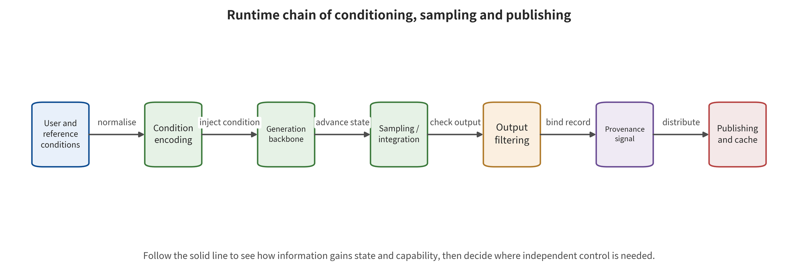

nditions through encoding and moderation, follows the state sampling preserves, and shows how black-box feedback becomes an attack budget.

\newpage

# Chapter 10　Conditions, Sampling, Privacy, and Generation Services

An image-to-video service received three inputs. One was an ordinary portrait photo, another a motion description with no obvious risk, and the third a camera trajectory. Each passed moderation on its own. Yet the generator completed an unauthorized event during the middle few seconds. Suppose the platform records only "the text passed" and "the first frame is compliant." It will blame the semantics of the joint conditions on coincidence. If it records only the final refusal, it hides that the generator had already formed the target event. It also loses exactly which layer made moderation take effect.

Runtime safety is hard precisely because of this stage difference. A condition is not a string. It is a control surface built from text, images, video, audio, masks, depth, pose, boundary frames, trajectories, history and random state. Sampling adds query feedback, training memorization, caches, queues and compute budgets. Judging whether an attack succeeded therefore means observing condition entry, generation completion, risk formation, output blocking and actual delivery separately. A single attack success rate must not cover the whole chain.

## Chapter Overview

One visual generation request carries text, images, video, audio, masks, pose, trajectories, history and random state at once. This chapter gathers those conditions into structured objects, each with a type, provenance, authorization and permitted scope of influence. It then traces how they change the generation trajectory through black-box semantic search, multimodal composition and video temporal completion. Condition passing, target formation, output review and content delivery sit on four separate denominators. A result from any stage must keep its own evidence position.

Sampling also exposes training data memorization, membership inference, approximate cache boundaries and resource occupation. Those four problem classes differ in denominator, attack budget and result object, so the evaluation definitions appear separately below. The final layered control separates input acceptance, in-generation checks, output handling and actual delivery. It also records benign utility, latency, cost and recovery capability, so the runtime gate still carries an observable business cost when it blocks risk.

## Mechanistic groundwork: how one request becomes a stateful generation session

This chapter follows one stateful generation session, from conditional submission to content delivery. The input is not only a prompt. It also includes reference media, masks, pose, trajectory, history, random seeds, tenant identity, authorization fields and resource budget. Internally, the mechanism normalizes and encodes each condition first. The sampler then updates the generation state along discrete steps or a continuous path, while it maintains the query ledger, queue, cache keys, risk decisions and cancellation state. After generation ends, the decoder, the filters and the publishing service keep changing the visible media and its reachable scope.

Output consumers fall into preview interfaces, download services, editing tasks, public publishing accounts and downstream automated systems. They do not require the same permissions. The security surface therefore includes low-integrity conditions that override authorization, multimodal combinations that form new semantics, and black-box feedback that supports adaptive search. It also includes near-duplicate outputs that leak training information, caches that cross tenant or policy boundaries, and high-cost tasks that crowd the queue. Input acceptance, risky content formation, output blocking and actual media delivery each need their own denominator. They cannot be compressed into a single success rate.

In the benign case, a person reference image affects only the approved appearance fields. The cache key binds tenant, policy and subject authorization together, and a passing preview still requires independent publishing approval. One boundary case reverses this: text, image and camera trajectory are each compliant in isolation, yet their combination fills an unauthorized event into the video. In another, review has already rejected the final download, but an intermediate preview had earlier returned the clip to the user. The first case requires combinatorial semantics and in-generation observation. The second requires staged delivery evidence. A final rejection cannot be read backward to mean the entire run chain never formed risk.

## 10.1 Conditions are a control plane, not just a prompt

Every modality has its own provenance, authorization, validity period and permitted scope of influence. To keep them apart, this chapter expands one generation request into a typed condition vector rather than compressing it into a single prompt string. Missing fields stay unknown, and the model itself does not fill them in as permissions:

\[
c=(c_{txt},c_{img},c_{vid},c_{aud},c_{mask},c_{pose},c_{traj},c_{hist},c_{seed}).
\]

The components denote text, reference image, reference video, audio, mask, pose, trajectory, history state and random seed. Interfaces of the ControlNet kind show that depth, edges or pose can enter the generation process as independent structural conditions [@GEN_controlnet]. In production systems, conditions should also carry metadata: source subject, tenant, integrity, authorized use, validity period and influencable variables. The same pixels carry different permissions when they come from the user, a public web page or an enterprise asset library.

Condition typing exists mainly to stop data from escalating into policy on its own. A reference image can supply subject appearance, but it cannot change the platform's identity authorization rules. Boundary frames can constrain the start and end points, but they cannot prove that the intermediate actions were approved. History edits can help maintain coherence, but they should not carry the sensitive permissions of an old session into a new task. Suppose the system concatenates all inputs into one unified embedding and preserves neither provenance nor use. Downstream reviewers can then no longer tell who a given semantic came from, or whether it has the right to influence the output.

One request maps to different objects and denominators as it enters the queue, as media is formed, as it goes through output disposition and as it is actually delivered. The runtime chain is therefore split into four observation gates. Each gate keeps its own entry counts, exit states, undecidable items and responsible controls:

1. **C0 condition acceptance**: whether pre-review allows the request into the generation queue.
2. **C1 generation formation**: whether the model finishes generation and forms the target semantics or event inside the media.
3. **C2 output disposition**: whether post-review identifies the output and blocks, degrades, or escalates to human review.
4. **C3 actual delivery**: whether the user, the platform, or an external system really obtains the content.

The four gates may use different denominators. Take 100 inputs: 80 enter the queue, 70 complete generation, 5 form the target risk, 4 are blocked and 1 is delivered. Reporting must preserve the counts and undecidable items at each level. "1/100" denotes the final delivery proportion, and "5/70" denotes the proportion of risk formation among requests that completed generation. The four valid blocks are recorded separately. A number carries engineering meaning only when bound to an object and a level.

Follow the figure from user and reference conditions through to the publishing cache. Mark out where condition encoding, generation state, sampling, filtering, content provenance and processing history, and permission checks each produce or consume state.

Figure 10-1 supports bringing random seeds, sampling state, filters, content provenance and processing history, cache keys and publishing permissions beyond prompt review into the run record of the same request. It also supports setting an independent denominator for each stage. It does not prove that the filtering or provenance signals in the figure suffice to block risk, and structural connectivity does not equal effective control. Each gate still needs verification with allow, deny, expiry, cross-tenant and recovery probes.

### Condition compiler: preserving semantic provenance before the model

Before conditions enter the model, a production system can place a layer of condition compiler. That layer does not judge all media risk. Its job is to convert raw input into typed task objects. For example, a person reference image produces a "subject appearance" field, the authorization service produces an "allowed use" field, text parsing produces an "action and scene" field, and a camera trajectory produces a "shot control" field. The model receives the compiled allowed fields, and free text cannot override the authorization state.

The output of condition compilation can be written as a triple \(\kappa=(v,p,o)\). Here \(v\) is the normalized value, \(p\) is the provenance and integrity label, and \(o\) is the set of variables permitted to be influenced. Take the same "someone's name" arriving from a verified identity token and from web page OCR. There \(v\) may match, while \(p\) and \(o\) should differ. The model can use web content to answer information, but it cannot use that content to authorize a person's endorsement or public publishing.

The compiler must also handle conflicts explicitly. Suppose the user's text requires one action, the reference video implies the opposite action, and the brand policy forbids that scene. The system still cannot let the last concatenation order determine priority. High-integrity policy and subject authorization take precedence over ordinary content. Conflicts that cannot be parsed enter a degraded or human path. Conflict-handling rules belong to external policy, and they should not be hidden inside the generation model's natural-language judgment.

### Writing, reading, and invalidation of condition state

A condition may exist only within one request. It may also be written into templates, project history, personalization profiles or caches. Every write point requires a purpose and a term. An authorized person reference image should not automatically enter a team's public asset library. One project's negative prompt should not be reused across tenants. After identity authorization is withdrawn, condition tokens still held by an old session should become invalid.

Read policy likewise requires minimization. The generator reads only the fields needed to complete the task, the output reviewer reads the media and necessary context, and the publishing service reads the approval summary and account. No component has to see the raw sensitive material. Reducing the readable surface lowers leakage and makes logging and responsibility clearer. Condition invalidation must also be verified with probes. The system can construct expired tokens, a wrong tenant, a withdrawn subject, a changed policy version and a changed media digest. It can then confirm that the cache, generation and publishing each deny. An interface that shows "authorization withdrawn" is no proof that every derived piece of state in the backend has already become unusable.

### Attack budget should become a session ledger

The capability of black-box condition attacks comes from queries, feedback and time. The session ledger records at least independent conditions, normalized similarity families, generation counts, failed requests, review feedback, account linkage, waiting time, cost and intermediate previews. If rate limiting is applied only to exactly identical strings, an attacker can circumvent it with synonymous expressions or cross-modal variants. Rate-limiting rules must also combine account linkage, similarity families and anomalous feedback, while preserving a reasonable budget for benign creative iteration.

A more appropriate control modulates feedback by risk relevance. Low-risk tasks can return detailed creative suggestions. Requests that repeatedly approach high-risk subject–action combinations receive reduced intermediate information, increased waiting, or escalation to human review. The restriction aims to raise the cost of adaptive search and protect the service, not to punish ways of expressing things. Effectiveness reporting gives attack query changes, benign iteration completion rates, latency and appeals together.

### Complete recording of stage denominators

Beyond C0–C3, generation failures, timeouts, undecidable items and human escalations should also be recorded. Generation failures cannot silently disappear from the denominator, because certain conditions may systematically trigger failure and thereby create a usability problem. Undecidable items cannot be counted as safe success or attack failure. Human escalations must record the final decision and the wait. A level's denominator can be traced back to the level before it, but the two need not be equal.

Stage records can also identify where a defense is located. If a large number of risky conditions are blocked at C0, input control is effective, but benign content over-refusal must be observed. If risky media is formed at C1 and blocked at C2, the consequence gate is effective while the upstream still needs improvement. If C2 has already alerted and C3 still delivers, the problem lies in authorization or enforcement, not in the review model itself.

## 10.2 How semantic search bypasses literal rules

Input filtering often assumes that dangerous intent will appear in a fixed vocabulary. What the generation model actually consumes is an encoded semantic representation. Literal similarity therefore does not necessarily mean embedding similarity, and literal harmlessness may also preserve the target semantics after combination. A black-box attacker does not need to read gradients. As long as they can repeatedly submit conditions and observe acceptance, rejection, or output, they may turn system feedback into a search signal.

SneakyPrompt investigated how black-box query feedback can find alternative expressions [@VIS_P008]. This evidence supports "the accept/reject interface leaks a signal usable for adaptation," but the effect is bound to the target model, filter, query budget and decision rules. A single accidental pass proves that a path exists and does not give an overall vulnerability rate. Zero passes only indicate that no success was observed under the current budget and sample.

Defense cannot stop at expanding the banned-word list. A more robust approach controls semantics, budget and capability at the same time. The input layer normalizes encoding and identifies synonymous and cross-language intent. The session layer links variant queries and limits low-cost iteration. The generation layer degrades or segment-checks high-risk capabilities. The output layer independently observes the generated media. The delivery layer makes the final decision based on subject authorization and use. Layers should rely on different roots of trust wherever possible. Otherwise an attacker need only adapt to a single decision boundary.

### Multimodal composition is not the sum of risk scores

Each condition can pass on its own. That does not entail that the joint embedding is compliant. MMA-Diffusion manipulates text and image conditions together, which shows that the multimodal attack surface expands with compositional semantics [@VIS_P009]. An attacker may place the subject in the reference image, the action in the text, and the scene or timing cues in masks and trajectories. No single modality, viewed alone, holds the complete intent. Yet the generator will synthesize them into one event.

Joint moderation likewise cannot just take the maximum or the average of two classifier scores. The composition question must be framed first. Which condition supplies "who"? Which condition supplies "what to do"? Who controls "in what scene and at what time", and has the subject authorized that use? In engineering terms, the conditions can be parsed into a structured intent graph. An external policy then judges the permitted subject–action–scene combinations. If the parse is uncertain, high-impact tasks enter human review or a lower-capability mode. The generator is not left to interpret and approve on its own.

JailbreakDiffBench separates prompt moderation from image moderation so the two can be compared, which supports staged evaluation [@VIS_R-A030]. The findings remain bounded by the model and moderator versions, and they cannot be used to declare one filtering approach stronger across all services. The engineering value lies in one reminder. The same request at input and at output is two different objects. False positives, false negatives, and benign utility should be recorded separately.

### Four classes of condition-control evasion

Runtime evasion can be divided by the gap it exploits. The four gaps are the literal–semantic gap, the modality–composition gap, the condition–output gap, and the single-turn–session gap. The literal–semantic gap exploits inconsistency between string rules and encoded semantics. The modality–composition gap disperses subject, action, and scene across text, images, or audio. The condition–output gap makes the input appear compliant while relying on the generator to complete the target event. The single-turn–session gap combines multiple requests, edits, and extensions into the final media.

The four classes of evasion may coexist. An attacker first uses semantic variants to get the text into the queue. A reference image then fills in the identity. Further rounds of editing extend an event. If the platform gives only a binary label per turn, the last turn looks like an ordinary local edit. Trace records need to preserve derivation relations and the complete timeline. They must also re-evaluate the composed result before key deliveries.

### Adaptive attacks and static test sets

A static test set measures how the system performs on known inputs. An adaptive attack instead observes the defense's results and selects the next condition. SneakyPrompt shows that black-box feedback can support the search for alternative expressions [@VIS_P008]. A deployment evaluation sets at least two stages. The first compares versions on a frozen set. The second lets the red team adapt to feedback within a fixed total budget. The two results cannot be merged, because the attack capabilities differ.

Adaptive testing needs stopping rules. Stop once thresholds for queries, cost, time, or high-risk output are reached. When something is observed that may involve a real subject, a minor, or a reusable service weakness, isolate the evidence and notify the responsible person. Reports retain the attack strategy category and the budget. They do not disclose high-risk payloads that can be directly reused. This verifies adaptivity without turning the research process into an abuse guide.

### A responsibility matrix for multimodal conditions

| Condition | Primary provider | Permissible influence | Must not be acquired automatically | Minimum verification |
|---|---|---|---|---|
| Free text | User or upstream agent | Topic, description, general action | Identity authorization, platform policy, payment or publishing rights | Semantics and cross-language, provenance labels |
| Reference image | User, asset library | Composition, subject appearance, style reference | Sensitive context, public endorsement, cross-project retention | Subject consent, near-duplication and use |
| Mask/depth/pose | Editor or vision tool | Spatial region, structure, pose | Semantic authority beyond the editing scope | Type, scope and boundary conditions |
| Boundary frames/reference video | User or preceding task | Start and end states, motion reference | Approval of the entire intermediate trajectory | Event-level completion check |
| Audio/script | Subject, editor | Rhythm, speaker, content | Likeness rights, public channels, transaction instructions | Speaker, script, audio-visual and channel |
| History and templates | Project system | Coherence and reuse configuration | Cross-tenant data, expired authorizations | Write gate, expiry, tenant and revocation |

The matrix is valuable because it breaks "multimodal moderation" into questions of responsibility. A model can help identify the content of conditions. It cannot create missing authorization through its own output. Any high-impact permitted scope should come from a verifiable subject and an external policy.

### A worked example of condition conflict

A brand project uses an authorized product image and person image. The text asks for "the person displays the product". The history template, however, contains another brand's camera and a spoken script. The condition compiler finds the brand, the script, and the subject authorization inconsistent. It downgrades the history template to a non-executable suggestion. The generator may still use general shot language, but it cannot read the old project's brand or account fields. If the user confirms a new script, the system generates a new approved object. It does not directly update the old template.

This worked example shows the boundary between state contamination and ordinary creative reuse. The defense is not to prohibit all templates. It is to retain provenance, project, and influenceable fields. Benign users can still reuse shot structure. Sensitive identity and publishing information do not drift along with the template.

## 10.3 Video conditions control the trajectory

Image conditions mainly constrain a single spatial object. Video conditions also constrain how state changes over time. Boundary frames, reference video, action templates, camera paths, and audio scripts jointly determine the intermediate trajectory. If the system moderates only the boundaries visible at input time, it hands the most important event generation to the model. It keeps no independent control.

Two Frames Matter shows that the start and end states can pass individually while the intermediate completed trajectory still forms the target event [@VIS_LN05]. The first-broken point here is not any single frame. It is the system's mistaking "boundary compliance" for "path compliance". Executable controls include the following. Review boundary conditions jointly. Observe action and identity by window during generation. Check the whole segment along event boundaries after completion. Require the subject or responsible person to confirm high-risk trajectories before delivery.

Text-to-video red teaming must treat time as a dimension of judgment as well. T2VSafetyBench requires evaluation of the video actually generated, not of the original prompt. The benchmark also distinguishes automatic from human judgment [@VIS_P034]. Work on optimization-based video jailbreaking and time-aware red teaming goes further. It shows that prompt search, temporal semantics, and video output are distinct stages [@VIS_R-A023; @VIS_LN04]. These works use different models, durations, moderators, and budgets. Their proportions cannot be merged directly.

A minimum video condition record specification records at least these items: model and policy version, duration, frame rate, resolution, shot count, condition modality, subject authorization, query budget, generation completion status, time when risk first appears, duration, output disposition, and final delivery. Evaluation units include frames, continuous windows, shots, whole videos, and events. Adjacent frames are highly correlated. They cannot be repeated as independent samples to increase statistical confidence.

### Proactive protection from image conditions to video

A reference image may belong to a creator, a product, or a real person. PhotoGuard, I2VGuard, Anti-I2V, and VPA-Guard raise the cost of unauthorized use. They work from directions such as image editing, image-to-video, and visual prompt protection [@VIS_P018; @VIS_R-A025; @VIS_R-A026; @VIS_R-A027]. The effectiveness of these methods depends on the base model, preprocessing, perturbation budget, and benign animation needs.

Proactive protection cannot replace the authorization gate. If a defensive perturbation makes even legitimate editing entirely unusable, the system merely trades destroyed benign utility for local blocking. If the platform does not verify subject permissions at upload time at all, there is no follow-up control once the technical protection fails. A qualified evaluation should report perceptual quality before and after protection. The same report should cover legitimate generation utility, subject or style similarity, motion quality, cross-model and cross-preprocessing performance, and defender cost.

### Trajectory safety needs state constraints

A video generator selects the appearance of each frame. It also implicitly selects state transitions. For high-risk tasks, an allowed state set \(\mathcal{E}\) and an allowed transition set \(\mathcal{M}\) can be defined. Identity, position, action, shot, and audio-visual relations fall in \(\mathcal{E}\). Speed, direction, event ordering, and subject continuity between adjacent windows fall in \(\mathcal{M}\). A generated result enters delivery review only if it satisfies both the state and the transition constraints.

The allowed set is graded by scenario consequence. Open creation retains a wider narrative space while enforcing subject authorization and content policy. Product advertising adds brand, script, and claim constraints. Industrial simulation adds physical boundaries and object relations. Real-person digital humans add identity, audio-visual, and publishing channel constraints. The higher the risk, the more specific the allowed set.

Trajectory detection also has failure conditions. Visual tracking may lose identity under occlusion and shot changes. Action recognition may be affected by frame rate and cultural context. Audio-visual synchronization may misjudge legitimate dubbing. The system should allow "uncertain". The consequence gate then decides degradation, regeneration, or human review. It must not map uncertainty to pass by default.

### Video condition evaluation matrix

A complete matrix crosses at least six axes. These are text directness, reference media type, boundary-frame relation, duration and shots, subject authorization, and model and policy version. Each cell fixes the prompt, subject, seed, and number of generations. It records condition acceptance, generation completion, event formation, first risk, duration, output blocking, and delivery. The clean set includes complex actions, cross-language content, legitimate dubbing, and creative editing. A moderator therefore cannot obtain high surface safety by rejecting all complex videos.

Metrics should not be only the average of window scores. Event recall answers whether a risk event is found. Localization intersection-over-union and temporal error answer location. First alert answers real-time performance. The longest undetected risk segment answers sustained exposure. Identity trajectory errors answer cross-shot consistency. Benign rejections and waiting answer cost. Different metrics serve different decisions. They cannot first be weighted into a total score that has no interpretation.

### Division of labor between in-generation control and final review

In-generation control is suited to halting obviously out-of-bounds generation early, limiting resources, and reducing the full formation of high-risk media. Final review is suited to observing the complete event, narrative, and audio-visual content. If intermediate control produces a false positive, it wastes part of the computation and harms benign tasks. If a problem is discovered only at final review, the computation has already been consumed and intermediate previews may have leaked. Products need to specify whether intermediate previews are delivered, how long they are retained, and whether they enter the cache.

In segmented video, each clip can pass on its own. That does not entail that the stitched narrative passes. The export gate should re-evaluate the complete timeline and check clip order, dubbing, and provenance derivation. A streaming system that cannot wait for the end uses a sliding window and an event state machine. When uncertain, it switches to a safe frame or reduces propagation. It does not continue to accumulate risk.

## 10.4 What sampled outputs may leak

Generative models may retain certain features of training data in their parameters. Training data extraction probes the model with a set of conditions or queries. Its aim is to find outputs that approximately and identifiably correspond to training instances. Research on image diffusion models has demonstrated a path to extracting training samples under an explicit threat model and query budget. It also discusses duplicate data and deduplication [@VIS_P024]. This does not mean that any similar image proves training membership.

Confirmation requires at least five pieces of evidence. The candidate training instance can be located. The output reaches a predefined near-duplicate relationship with the candidate. Member and non-member comparisons use the same protocol. Manual verification does not only select successful demonstrations. The number of queries, seeds, and screening costs are fully counted in the budget. If the provenance of the training set is unknown, one can only say that the output is similar to an external candidate. One cannot automatically say that it was memorized by the model.

Training data extraction, membership inference, and model extraction also cannot share a single "privacy success rate." The first is counted by independent training instances and queries. Membership inference is counted by member/non-member samples. Model extraction is counted by query budget and surrogate task fidelity. Their consequences also differ. Obtaining one near-duplicate piece of media, inferring that someone may be in the training set, and building a behaviorally similar surrogate model require different controls and notifications.

Video adds content memory and motion memory. A model may not copy a complete file, yet reproduce identity and background across several frames. It may also reproduce a distinctive action pattern. The relevant research explicitly distinguishes these two types of memory [@VIS_A047]. Averaging distance over the whole segment dilutes short leaks. Single-frame similarity may misjudge common scenes as memory. Frame, segment, motion, audio, and identity evidence should therefore be combined. Training-segment duplication, authorization, and non-member baselines should be reported.

Privacy defenses unfold along the lifecycle. Cross-modal deduplication and sensitive-identity governance come before training. Monitoring of memory and near-copies applies during training. At the output end, near-duplicate retrieval covers high-risk identities, frames, segments, and motion. At the service end, query correlation, rate limiting, and candidate feedback apply. At the incident end, data subjects get entry points for checking, notification, and deletion. The stricter the thresholds, the more likely legitimate common compositions and actions are to be incorrectly blocked. Benign utility and manual review costs must be measured at the same time.

### The ladder from "looks similar" to "evidence supports memory"

Privacy claims can be divided into four classes of evidence. Similarity observation evidence records only the similarity relationship between the output and public media. Candidate near-duplicate evidence finds near-duplicates in a candidate training set and confirms them with frozen thresholds and manual verification. Membership difference evidence adds member and non-member comparisons, showing that the candidate has an anomalous association. Lineage attribution evidence connects training members and model outputs on the basis of explicit data lineage and query budget. Each class of evidence has its own object and denominator. The scope of the conclusion increases step by step with the type of evidence.

Research on image training data extraction offers a protocol example for higher-level evidence [@VIS_P024]. Production services, however, often keep their training manifests undisclosed, so a real investigation may stall at a lower level. A platform can still take precautionary measures: limit distribution, contact rights holders, preserve evidence. It cannot treat a training attribution that is not yet established as established fact.

The video ladder adds temporal correspondence. A candidate may be similar only in contiguous segments, or only in motion. Handling must cover cropping, speed changes, mirroring, transcoding and audio-track removal. Frame-level matching, segment-level matching, motion-level matching and identity-level matching each return their own results. Attribution grows stronger only when the evidence points jointly at the same candidate. Strict thresholds still require reporting false positives on real videos.

### Query privacy and returned information

A generative service may leak more than its training data. Other users' prompts, reference images or cache hits can escape as well. Error messages, latency differences, intermediate previews and controllable seeds each add an observable signal. Secure design should minimize cross-tenant state, unify the error differences that serve no purpose, and release debug information only to authorized operations personnel.

Limiting returned information also shapes the creative experience. Teams should measure how many turns a benign user needs to complete a task, how long failure diagnosis takes, and how many support tickets arrive. They should not hide all feedback. Tiered feedback is one compromise. Ordinary errors get safe, actionable categories. Internal logs retain the detailed reasons. High-risk repeated queries receive less of the information that could be turned toward boundary probing.

## 10.5 Cache, randomness, and resources are security state

Diffusion and video generation are costly, so services often reuse conditional embeddings, intermediate latents, attention results or final media. Approximate caching judges by similarity whether requests are close enough. A cache key may omit the tenant, the policy version, principal authorization, component closure or another security-critical condition. Two requests with similar content but different permissions may then share state incorrectly.

Research on approximate caching for text-to-image diffusion shows that cache match boundaries can be exploited [@VIS_P039]. A request that should not hit may reuse a result incorrectly, or a request that should hit may miss, and output correctness, latency and cost all shift as a result. That evidence covers only the cache design and threat model used in the study. It cannot be extended into a claim that all commercial generative services carry the same vulnerability.

A secure cache key must not contain only a text or pixel digest. It must also distinguish tenant, artifact closure, policy, authorization, and the category of randomness permitted for reuse. So that these security-relevant equivalence conditions can be explicitly checked, it can be written as

\[
K=H(tenant,\Omega,policy,auth,c_{norm},seed\_class),
\]

where \(tenant\) is the tenant, \(\Omega\) is the artifact closure of Chapter 9, \(policy\) is the policy version, \(auth\) is the authorization state, \(c_{norm}\) is the normalized condition, and \(seed\_class\) denotes the category of randomness permitted for reuse. The cache key can store field digests or irreversible encodings. Any state that changes security semantics must participate in the equivalence judgment. The cached data itself also requires encryption, retention limits, access control, hit logs, and cross-tenant negative probes.

Resource security is also an operational requirement. Resolution, frame count, duration, sampling steps, control branches, number of candidates, audio, frame interpolation, retries and concurrency all affect GPU time, VRAM, queues and billing. Public evidence is not yet sufficient, however, to give a general attack effect for compute amplification specific to image or video generation. In engineering terms, it should be set as a proposition to be verified, not settled by borrowing numbers from other domains.

A qualified isolation test records a fixed set of quantities per request and per tenant. They are GPU time, peak VRAM, queueing and tail latency, release after cancellation, cache hits, failed retries, cost, and the benign request completion rate. The test varies the scale of benign tasks step by step and compares against equal-budget benign load. It sets hard quotas, preemptible queues, timeouts, cancellation reclamation and retry caps. The report also retains benign video quality and long-task completion rates. It does not manufacture surface-level safety by banning high-cost tasks outright.

Video streams turn resource problems into long-lived state. Before a single request ends, the system may continuously retain latents, cross-frame attention, audio caches and partial outputs. Interactive generation also persists across turns. Quotas should cover single tasks, sessions, tenants and organizations at the same time. Cancellation must be verified to actually release GPU and cache. Merely stopping the front end from displaying progress is not enough.

### Cache equivalence relations must be consistent with policy

Two requests being "computationally similar" does not equal being "security-equivalent." The same prompt under different tenants, principal authorizations, policy versions or artifact closures cannot share results that would leak or bypass review. Within the same tenant, a low-resolution preview that has already passed cannot automatically substitute for final high-resolution review. The cache layer must understand which fields change security semantics. Otherwise it should simply disable cross-request reuse for high-risk tasks.

Cache testing covers at least correct hits, correct misses, incorrect hits and incorrect misses. Correct hits test savings and result equivalence. Correct misses test isolation. Incorrect hits test semantic, privacy and authorization consequences. Incorrect misses test cost and queue impact. Research has already shown that approximate cache boundaries can become an attack surface [@VIS_P039]. Production acceptance still needs to use the current cache keys, thresholds and tenant model.

Policy updates make old caches stale. If review rules, identity permissions or artifact closures change, the cache version must change or be invalidated accordingly. Cache purging must verify distributed nodes and edge replicas, not only clear the primary database. Hit logs store request digests and the basis for the decision. They do not retain raw sensitive conditions indefinitely.

### The four levels of resource budgets

Request-level budgets limit resolution, frame count, steps and single-run GPU time. Session-level budgets limit multi-turn generation, extension and retries. Tenant-level budgets ensure that one customer does not crowd out other customers. Platform-level budgets reserve capacity for failures, bursts and security review. When one of the four levels is missing, an attacker or a runaway agent may combine small requests into a large impact.

Admission estimation is only a prediction, and actual operation still requires feedback control. The system monitors VRAM, GPU time, queues, tail latency and cancellation state, and it degrades, preempts or aborts when measurements deviate from the estimate. The abort path must release VRAM, temporary files, cache placeholders and session tokens. It must give benign users resumable results rather than leaving unlimited retries.

The benign control arms of an availability test include short images, long image edits, short videos, long videos, joint audio-visual, and concurrent projects. Completion rate, quality, waiting, cost and resource fairness are reported separately before and after the defense. When no public first-hand effect size exists, a team may report its own controlled test. It cannot describe that test as the attack incidence rate of the entire industry.

### Three Classes of Consequences of Service Anomalies

Resource and cache anomalies may produce three classes of consequences: integrity, confidentiality, and availability. Incorrect reuse that makes media semantics deviate from the request belongs to integrity. Cross-tenant exposure of prompts or reference assets belongs to confidentiality. A mismatch or occupancy that delays benign tasks belongs to availability. A single anomaly can touch multiple classes at once. The metrics must still be kept separate.

Integrity is counted by request semantics and erroneous hits. Confidentiality is counted by distinct tenants, assets and confirmed exposures. Availability is counted by benign request completion, tail latency, resources and cost. Merging the three into a single cache attack success rate would leave incident response unable to tell what to do. It could not decide whether to clear the cache, notify users, or scale up and rate-limit.

## 10.6 Layered Runtime Controls

Runtime defenses divide into five layers by information flow and capability. Each layer is responsible only for its own observation objects and its own authorized actions. The "evidence boundary" column in the table prevents a local pass at the layer above from being interpreted as compliance of the entire chain. It also indicates what kind of independent receipt or disposition record the next layer still requires.

| Layer | Main objects and controls | Evidence boundary |
|---|---|---|
| Condition layer | Preserves modality type, provenance and authorization. Performs normalization, joint intent analysis, and subject–action–scene validation. Unknown or conflicting conditions must not silently obtain the broadest permission. | A condition passing means only that the request may enter the queue. It does not prove that the media or event is ultimately compliant. |
| Session layer | Correlates multi-turn variants, query budgets, and cache and history writes. Limits low-cost adaptive search through rate, cost, waiting and feedback granularity. At the same time it observes whether benign iteration is unacceptably obstructed. | Session limits raise the cost of search. They do not prove that an attack path does not exist, and they cannot replace output judgment. |
| Generation layer | Chooses among segmented checks, specification downgrade, abort points and independent trajectory evaluation according to risk. | Intermediate judgments are risk signals. They cannot issue public-release or identity-use permissions. |
| Output layer | Checks complete media, events, identity, audio-visual and training near-duplicates, and makes undecidable items explicit. For video, the complete event is the unit of review, and random frame-sampling averages serve only as a supplement. | Output blocking does not mean the risk never formed. Nor does it mean that intermediate previews were never delivered. |
| Delivery layer | Splits generation, download, public release, automated placement and high-risk business use into distinct capabilities. Permissions bind to the normalized media digest, subject, account, purpose and time. A content change invalidates the approval. | Logs connect C0—C3 to show upstream fragility and consequence limits at the same time. Actual delivery is still determined by the capability service receipt. |

T2VShield's layered framework and audio-visual consistency evaluation can serve as a research case for video defense [@VIS_R-A024]. The available evidence covers the paper's experimental setup, public implementation and test conditions. Production platforms still need to validate field effectiveness with their own models, workloads, user languages, legitimate uses and appeal capabilities.

### Independence Checks for Layered Defense

Control layers form defense in depth only when their failure causes are not entirely the same. Suppose input moderation, in-generation checks and output moderation all call the same model. Suppose they also share one prompt template and one context. An attack may then transfer across all of them simultaneously. Teams should record each layer's root of trust, observation objects, update cadence and permissions. At a minimum, high-impact capability gates should use external policy, structured parameters and independent identity.

The condition layer may draw on a semantic model, but its authorization fields come from the identity service. The generation layer may produce risk scores, but aborts are executed by the runtime controller. The output layer may fuse detectors, but release tokens are issued by the capability service. Incident response may use automated matching, but the responsible team handles final notification and appeals. Models provide information. They do not self-issue all permissions.

Independence also includes data. Suppose all detectors are built from the same training source. Domain shift on unknown generators or specific populations may then affect them jointly. Multiple signals are not simply a matter of more models. They mean introducing different evidence such as content credentials, service logs, human context and business-transaction controls.

### Re-testing After Defense Adaptation

Testing known variants before launch only establishes a baseline. Once a defense is published, or becomes observable through feedback, attackers adapt to it. They probe its wordlists, judges, windows, query limits and cache thresholds. Re-testing should vary language, modality combination, temporal position, post-processing and query order while holding the total budget constant. Then teams can see whether the controls have merely memorized fixed samples.

Re-testing should also watch for defense drift. Models, moderators, policies and platform transcoding all get updated, and old thresholds may stop working. The clean-content distribution changes with region, holiday and product, so false positives change as well. Runtime monitoring is stratified by version and population. Major drift triggers freezing, replay and threshold review. It does not automatically expand the strictest rules.

### An Actionable Runtime Checklist

1. Does every condition have a type, provenance, authorization, validity period and permitted effect?
2. Are condition conflicts handled by external priority rules?
3. Do history, template and cache writes have tenant and revocation gates?
4. Do C0—C3 record denominators, failures and undecidable cases separately?
5. Does the query ledger link semantically near variants and multi-account risk?
6. Do adaptive tests have budget, stopping and disclosure rules?
7. Does video reporting cover events, trajectories, identity, audio-visual and first risk?
8. Do privacy claims have training candidates, controls and human verification?
9. Does the cache key include all security-critical equivalence fields?
10. Do cancellation, timeout and circuit breaking release all runtime state?
11. Does the defense report benign utility, latency, cost and appeals at the same time?
12. Are generation, download, release and external business use authorized separately?

Every item in the checklist should correspond to observable evidence, such as configuration, probes, logs, test sets or human processes. An "enabled" status that cannot be replayed is not sufficient for launch acceptance.

## 10.7 Engineering Worked Example: Four-Gate Acceptance for a Hosted Video Service

An enterprise offers a "product image + script generates an advertising short" service. Customers can generate repeatedly, extend clips and publish directly to brand accounts, so the team organizes a red-team task as four gates of acceptance. The first gate records conditions. Product-image authorization, script, camera path, target duration, language, people and historical clips each enter typed fields. Attack testing uses authorized synthetic subjects. It does not create sensitive content aimed at real, unrelated individuals.

The second gate records generation. Each request binds an artifact closure, policy, seed, budget and cache state. The system observes actions and identity by window. An abort must verify that the queue, GPU and cache are all released. Generation failures, timeouts and undecidable cases do not disappear from the denominator. The third gate records output. Moderation is reported by frame, window, shot, full segment and audio-visual event. The training near-duplicate check retains candidates, thresholds and non-member controls, and identity judgments are kept separate from content-policy judgments. Automated models only propose candidates. High-consequence decisions are reviewed by trained personnel with the minimum necessary information.

The fourth gate records delivery. Download and automated publishing carry different permissions. A public release requires the brand account, media digest, script, subject authorization and short-lived approval to match at the same moment. The final report lists the C0—C3 denominators, benign-task rejections, generation latency, human burden, and the control that blocked each case. It also keeps the high-risk outputs that did form, even if the final release was blocked.

### Case Comparison: Different Runtime Root Causes Behind Similar Outputs

| Case | Attacker capability | Key feedback | Highest observed layer | Engineering control |
|---|---|---|---|---|
| SneakyPrompt | Black-box repeated queries | Acceptance, rejection, or generated result | Alternative-expression search and condition passing | Semantic moderation, query correlation, feedback stratification |
| MMA-Diffusion | Joint text and image manipulation | Gradients and outputs of the target or surrogate model | Joint conditions crossing the single-modality boundary | Typed conditions, compositional authorization, output gate |
| Two Frames Matter | Supplies boundary visual conditions | Intermediate completion results | Boundary compliance while the trajectory forms risk | Path constraints, window and event moderation |
| Training data extraction | Queries the generator under a budget | Output-to-candidate similarity | Specific-instance near-duplication and membership evidence | Deduplication, output retrieval, rate and subject notification |
| Approximate cache attack | Can construct similar requests and observe results or latency | Cache hits, media, or cost | Cache equivalence boundary failure | Security keys, tenant isolation, hit verification and circuit breaking |

These cases share the same ranking conditions: the same system version, task set, attack budget, independent unit, endpoint definition and benign utility baseline. Today, condition passing, event formation, training-instance confirmation and cache anomalies each use different endpoints and denominators. This table therefore compares attack surfaces, consumers and control locations. Effect-size ranking has a well-defined estimation target only after those conditions are unified.

### Tabletop Exercise Before Service Launch

The team selects one authorized synthetic-subject task. It then simulates, in order, a condition conflict, a session variant, boundary-frame completion, an output near-duplicate alert, a cache policy change and an expired release token. No step needs a real attack payload. The exercise only checks whether state enters the logs correctly, whether controls can block, whether humans can explain, and whether users can return to benign tasks.

In the exercise, one upstream control is deliberately broken. For example, the team lets the condition compiler pass a low-integrity field into generation, while the output and release gates keep working. The report should record the upstream failure and the downstream block at the same time. The release gate is then made to reject an expired authorization. That confirms generated content does not automatically acquire external account permissions. Finally, the team performs cache and session cleanup to verify that old state can no longer be used.

Exercise metrics include the time from alert to responsible owner, blocking location, benign user recovery, state cleanup, false-positive appeals and evidence minimization. This set of metrics specifically verifies whether the organizational response chain can operate. Unknown-attack testing follows a separate protocol. Freeze the total query budget and the system version. Vary language, modality, temporal position and post-processing. Record C0—C3, benign utility and stopping conditions. The two sets of results are reported separately. The former indicates response capability. The latter indicates the residual risk observed within a given attack space.

## 10.8 Quick Reference for Judgment Boundaries

| Easy judgment | Engineering judgment to use instead |
|---|---|
| Each condition is compliant on its own, so the combination is compliant | The generator reconstructs cross-modal intent in a joint representation. Moderation must judge the combined authorization of subject, action, scene, and time, not merely compare individual scores. |
| The prompt was accepted, so the attack succeeded | Acceptance reaches only C0. Whether the objective forms, whether the output is blocked and whether the content is delivered are three subsequent endpoints that must be reported separately. |
| The outputs are similar, so training data leakage is proven | Similarity may come from shared subject matter, model generalization or selection bias. Training candidates, query budget, member and non-member controls and human verification together constitute the evidence chain. |
| Caching affects only performance | Cache equivalence relations can cross tenant, policy and authorization boundaries, and they also affect output integrity and availability. Security-critical state must enter the key or the isolation domain. |
| Rejecting long videos solves the resource risk | This harms benign utility without verifying queue fairness, release on cancellation, cache isolation and adaptive budgeting. The security goal is to limit asymmetric occupancy, not to cancel all high-cost tasks. |

## 10.9 Bringing It into Real Systems

A hosted video service receives product images, character references, scripts, boundary frames, camera trajectories and historical clips. A condition compiler attaches provenance, subject authorization, validity period and permitted effects to each field. An already verified character token can constrain identity, yet it cannot grant an ordinary web image the same permissions. The compiled task enters a session ledger. That ledger links multi-turn variants by semantic similarity family, and it stores the artifact closure, policy, seed, budget, cache state, request failures and human screening cost.

The generation service records condition acceptance, target event formation, output blocking and actual delivery in separate layers. During generation it checks identity, action and events window by window. After completion it checks shots, the narrative of the whole segment and audio-visual relations. Generation failures, timeouts and undecidable cases each retain their own state. Near-duplicate training alerts store, in order, public similarity observations, candidate near-duplicates, member controls and data lineage evidence. Depending on the current evidence type, the platform restricts dissemination or contacts the rights holder. It does not complete training attribution directly from a single similarity score.

The multi-tenant cache key includes tenant, artifact closure, policy, authorization, normalized conditions and the class of reusable randomness. The same character and script enter different isolation domains when the authorization period, policy version or publishing subject differs. A policy change invalidates the old cache. The runtime controller monitors GPU time, GPU memory, queues, tail latency and release on cancellation at the request, session, tenant and platform levels at once. It performs degradation, preemption or abort on any deviation from the budget, and it pairs benign task completion rate, wait time and cost with risk metrics.

The delivery service sets preview, download, public release and placement through brand accounts as different capabilities. After a tenant withdraws authorization for a character, the authorization service invalidates old template tokens. The cache service clears state by subject and version. The publishing service revokes approvals that have not yet been used, and derivative media enter notification and use-case re-review. The recovery receipt links the layers together. It carries field states at the condition layer, writes and queries at the session layer, and windows and resources at the generation layer. It also carries event and privacy judgments at the output layer, and accounts and media digests at the delivery layer. On-call staff can then determine which layer has recovered and which layer still requires handling.

## Summary: Treating a Single Request as a Stateful Control Chain

Runtime conditions jointly control generation across multiple modalities. The sampling process preserves random state and caches. Black-box feedback supports adaptive search, and outputs may still leak training memorization. The condition layer records type, provenance, authorization and conflict decisions. The session layer records similarity families, queries, historical writes and caches. The generation layer records closures, seeds, windows, resources and aborts. The output layer records complete events, identity, audio-visual relations and near-duplicate evidence. The delivery layer records media digests, accounts, use cases, approvals, blocks and recovery. These five layers of records connect condition acceptance, objective formation, output handling and actual delivery. They preserve both upstream failures and downstream limits.

Video further extends conditions into trajectories and resources into long-lived state. The next chapter moves from inside the generation service to the media lifecycle. Content passes through watermarking, signing, editing, transcoding, dissemination and re-uploading. The chapter asks how the system pr

---

[← Back to contents](index.md)
