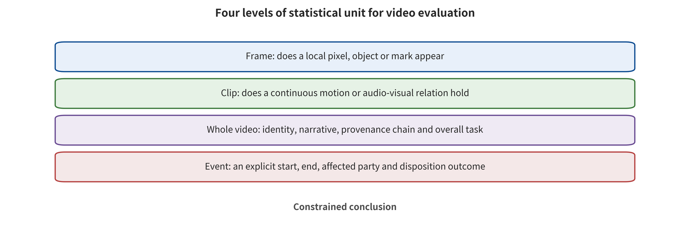

ovides authenticity signals that are verifiable but do not overpromise, and how it turns detection results into timely, appealable action.

\newpage

# Chapter 11　Video Spatiotemporal Safety and the Authenticity Chain

An online product launch uses a real-time digital human to stand in for a speaker who cannot attend. The picture is natural frame by frame. The voice and lip movements are broadly in sync, and the platform detector raises no alert either. Three minutes into the livestream, the digital human delivers an unapproved investment instruction. The clip is then edited, speed-changed, stripped of metadata and forwarded across platforms. After the fact, the detector can find anomalies in the complete file, yet it cannot answer three more important questions: when the risk first formed, when the livestream could have been stopped, and who handles the circulating copies.

This is precisely the security problem that video poses irreducibly relative to images. A single spatial object dominates an image. The meaning of video is constituted jointly by temporal order, persistent identity, motion, shots, audio-visual relations and playback state. Authenticity signals must likewise pass through frame-rate changes, transcoding, editing, re-filming and platform display. One offline accuracy figure cannot carry detection, provenance, authorization, attribution and response at the same time. This chapter therefore organizes "identifying media" and "limiting consequences" into one complete lifecycle.

## Chapter Overview

The smallest unit of video risk changes with the question. A local defect can appear on a frame. Actions and triggers require a continuous window. Identity and shots span multiple frames. A complete event depends on order and duration. This chapter therefore establishes six levels of units—frame, window, shot, whole segment, identity and event—and uses them to distinguish four classes of risk: spatiotemporal triggering, trajectory anomalies, audio-visual identity and streaming state. The same frame-level score yields different interpretations at these units.

Chapter 1 already distinguished content provenance and processing history from content credentials. The former is a broader record of the provenance subject and processing actions. The latter refers specifically to the C2PA signed manifest and its user-facing expression. Detectors, watermarks, content credentials, service logs and platform labels therefore provide different kinds of evidence. Some support model attribution, some record the signing subject and processing history, and some express only platform action. Later sections compare these systems by true base rate, false positives, localization error and first alert. They then connect the evidence into a complete lifecycle from generation, editing and publishing to containment, appeal, recovery and evidence deletion.

## Background: From Frame Signals to Events and Handling States

The object of this chapter is video events with temporal structure, not many mutually independent images. Inputs include continuous frames, audio tracks, timestamps, shot boundaries, identity claims, editing derivatives and playback state. The internal mechanism aggregates adjacent frames into windows and segments, and it maintains cross-shot identity, action order, audio-visual relations and event start–end state. Detectors, watermarks, content credentials, service logs and platform labels each produce evidence. Frames, segments, whole videos and events are different statistical units. They cannot substitute for one another merely because there are many of them.

These outputs are consumed by offline moderators, livestream controllers, publishing platforms, investigators and appeal processes. At one end of the security surface are temporal attacks. A short event may fall in the gap between sampled frames, risk may appear with delay, and editing also changes the narrative. At the other end is signal misreading. Detection scores, watermark hits, cryptographic verification and platform labels each answer only a limited question. A genuine control chain must also record first risk, first alert, stopping of dissemination, exposure before action, derivative copies, recovery and evidence deletion.

A benign example is legitimate cross-lingual dubbing that triggers an audio-visual mismatch alert. The platform routes that case to human review, using the original recording, the license and processing records, rather than directly judging it a forgery. A boundary example is content that has valid content credentials, yet a subject with signing privileges generated an out-of-scope script, or the credentials were lost during ordinary transcoding. The former shows that anomalous signals need context. The latter shows that "the credential is valid" and "the narrative is true and the use is approved" are not the same claim. On this basis, this chapter separates identification evidence from proportional action.

## 11.1 The Smallest Unit of Video Safety Is the Event

A video can be written as a timestamped multimodal sequence. Such a representation preserves picture, sound, shot state and cross-frame memory at the same time, and it lets event boundaries map back to real time. It abstracts only the state needed for safety analysis and does not assume a specific encoding format:

\[
v=\{(x_t,y_t,k_t,m_t)\}_{t=1}^{T},
\]

Here \(x_t\) is the picture, \(y_t\) is the audio, \(k_t\) is the shot or camera state, and \(m_t\) is cross-frame memory. A risk function must not compute only independent frame scores. It should aggregate over continuous windows and events. The aggregation must also preserve event start, end, uncertainty interval, audio-visual correspondence and handling level. It must avoid a single whole-clip average that erases short-lived risk:

\[
r_{[a,b]}=R(x_{a:b},y_{a:b},k_{a:b},m_{a:b}).
\]

The intuition behind \(R\) is a judgment of "who did what, in what capacity" over a period of time. It is not a judgment of whether each frame contains a certain class of pixels. Event boundaries, aggregation rules and undecidable conditions must be defined in advance. Otherwise a team can obtain different conclusions by changing the frame sampling rate or the window length.

Video safety requires at least six levels of units. Each level in the table answers a different question. An algorithm may internally use finer-grained frames or windows, but the overall denominator and the conclusions about consequences must rest on pre-declared independent units. The amount of evidence must not be expanded merely because there are more slices:

| Unit | Question answered | What it cannot replace |
|---|---|---|
| Frame | What appeared at a certain moment | Action order, persistent identity |
| Continuous window | Whether local actions and audio-visual relations hold | Cross-shot narrative |
| Shot | Whether identity, scene, and motion are continuous within an edit | Whole-segment causality |
| Whole video | What the complete narrative and the policy outcome are | Cross-file dissemination |
| Identity | How the same subject appears across shots, voice, and files | Consequences of a specific event |
| Event | Who did what when, and when risk first formed | Process handling and victim status |

Adjacent frames are highly correlated. A 10-second clip at 30 fps does not naturally provide 300 independent safety samples. Counting every frame in the denominator produces a spurious sample size. Conversely, taking only a few evenly spaced frames may miss a lip-sync replacement or action turn that lasts 200 ms. Reports should give the numbers of independent prompts, seeds, videos, identities and events separately, and preserve the within-video correlation structure.

Read the figure from the top downward, level by level: frames, then segments, then whole videos, then events. Compare the temporal and causal context that each level adds. Judge which level the study denominator should rest on. Now suppose the same video is cut into ten segments. Which counts can increase, and which independent units remain only one? Answering that keeps correlated observations from passing as new samples.

Figure 11-1 supports one separation: frame-level algorithmic observations on one side, segment-, video-, and event-level conclusions on the other. It also shows directly that frames within the same video should not be treated as independent population samples. This is the minimal four-level figure for reading the statistical units. It does not negate the diagnostic units used in the main text, such as windows, shots, and identity. Nor may the hierarchy be read as proof that a given detector already covers all event types. The same applies to livestream latency.

T2VSafetyBench requires evaluation against the video that was actually generated, not against the prompt alone [@VIS_P034]. It also keeps automatic judgment separate from human judgment. The generated video is therefore an independent object of evaluation. That does not mean a single benchmark already covers all lengths, languages, livestream, and identity scenarios. What the protocol applies to is still determined by model version, clip length, frame rate, risk category, moderator, and manual rules.

### Event annotation must preserve start, end, and uncertainty intervals

A video label may say only that "the whole segment is risky." Such a label cannot support evaluation of first alerting and localization. An event record should carry at least the subject and the action or semantics. It should also record the start time, the end time, the shot, and the audio track. The evidence source and the annotator's confidence belong there as well. When the boundary is unclear, an interval may be given instead of forcing the annotator to choose an exact frame. The system then evaluates detection, first-detection deviation, and degree of coverage as separate questions.

Events may also be nested. A single long shot contains an identity replacement, and inside it an unauthorized piece of speech appears. An entire fraud scenario may hold across multiple shots. The annotation structure should allow parent events and child events, so that risks are not flattened into one flat category. Response can escalate based on the parent event's consequences. Technical diagnosis returns to the child events to localize the signal.

Human annotation requires context, but the more context there is, the greater the sensitive exposure. The review interface first shows the necessary window and the provenance status. It expands only when a judgment is impossible. High-risk raw media uses access control, verification, and scheduled deletion. Disagreements among reviewers should be preserved and handled with review rules. Majority opinion is recorded as a consensus label. Disputed items are preserved together with the basis for review.

### Four levels of video metrics

The first level is detection. It covers event recall, false positives on genuine videos, undecidable cases, and cross-domain performance. The second level is localization. It covers start and end error, temporal intersection-over-union, spatial position, and the shortest detectable duration. The third level is operation. It covers first alert, processing throughput, window latency, resources, and abort. The fourth level is response. It covers stopping propagation, exposure already incurred, derived copies, appeals, and recovery.

The four levels cannot substitute for one another. An offline model with very accurate localization may alert too late. A system that alerts quickly may generate many false positives on legitimate live streams. Fast propagation stopping does not mean that downloaded copies have disappeared. Product review first clarifies which consequence is to be improved, then selects metrics. A single offline benchmark score should not stand in for the entire chain.

### Denominators and correlation structure

A report should show independent subjects, raw videos, and prompts alongside seeds, shots, events, windows, and frames, all at the same time. Frames and windows serve algorithmic computation, and they do not serve as independent population units. Subjects and events serve consequence and fairness analysis. Raw videos are used to prevent duplicate counting of slices. One subject may contribute a large number of clips. In that case the statistics should cluster further by subject, or at least disclose the concentration.

Missing data also enters the denominator. Absence of an audio track is coded separately. So are corrupted files, generation failures, review timeouts, and cases a human cannot judge. None of them can simply be deleted. Deleting difficult samples overestimates effectiveness. Counting them all as attack success or defense failure confuses usability with security. Transparent multi-state records suit engineering decisions better than forcing a binary label.

### A numerical example of first alerting

Suppose 40 independent live sessions contain 12 authorized, constructed risk events. The detector finds 10 of them, for an event recall of \(10/12\). Across 28 risk-free sessions it produces 2 alerts, for a genuine-session false-positive rate of \(2/28\). Among the 10 detected events, the median detection delay is 1.2 s. The maximum is 7.8 s. In 1 of them the critical utterance was already completed before the platform stopped it. This set of numbers cannot be compressed into "accuracy." Event recall answers coverage. Genuine-session false positives answer operational burden. The delay distribution answers real-time behavior. Completion of the critical utterance answers consequence. Suppose the risk events are all very long. A relatively high recall may then mask failures on short events. Results should therefore be stratified further by duration and event type.

## 11.2 How time and motion carry attacks

A spatiotemporal attack can distribute a condition or an anomaly across multiple frames. No single static cross-section then contains the complete semantics. BadVideo demonstrated spatiotemporal backdoor behavior under a specified text-to-video training setting [@VIS_P007]. That supports "training updates can establish video-level conditional anomalies." It does not prove that every video architecture, commercial service, or standalone motion module is equally vulnerable.

A video-backdoor evaluation should at least test whether the trigger appears. It should also test whether the target event forms. The remaining targets are the time of first appearance, the duration, and the spatial position. They also cover the clean-video semantics, frame quality, motion quality, and non-target spillover. Showing only one successful video is subject to seed and selection bias. Measuring only average frame quality may let an anomalous action hide entirely behind a clean appearance.

A boundary-frame attack exploits not a single-frame classification error but an unconstrained path. Two Frames Matter showed that the start and end conditions can each be acceptable. The intermediate completion can still form a risky trajectory [@VIS_LN05]. Defenses should check the input boundary, the generation window, and the complete event separately. Compliance of the start point and the end point can only be part of a path constraint. It cannot issue a safety proof for the entire intermediate process.

Motion also propagates across components. A character LoRA determines appearance, and a motion module determines action. Camera control changes the viewing angle. An interpolator reconstructs intermediate states. Tests of individual components may all pass, yet uncovered trajectories may still appear after composition. Existing direct evidence covers the compositional risk of image adapters. Malicious video motion modules still lack consistent verification across architectures, long clips, and production services. An engineering composition test therefore draws its evidence scope from the current base model, the component versions, the loading order, the clip length, and the task. Judgments at the component-category level require more independent closures and shared protocols.

### Temporal position is itself an outcome

For offline files, the system can check the entire segment after generation is complete. For live and interactive generation, consequence depends on when risk forms and how fast the response comes. Where correct final identification comes after the content has aired, it can support forensics, not timely containment. Let \(t_r\) be the time at which the event first reaches the response threshold. Let \(t_d\) be the detector's alert and \(t_s\) the platform's stop of propagation. Then report at least

\[
\Delta_d=t_d-t_r,\qquad \Delta_s=t_s-t_r.
\]

\(\Delta_d\) is the detection delay and \(\Delta_s\) is the containment delay. Even when the offline final judgment is correct, there may still be a very large \(\Delta_s\). The platform should also record pre-response exposure, downloaded copies, and caches. Impacts that occurred before deletion then remain in the event record.

Streaming inspection often uses a sliding window. A window that is too short cannot see the complete event. One that is too long increases alert latency. A stride that is too large may skip over short events. One that is too small repeatedly computes highly correlated content. Security teams need a window chosen jointly from the actual consequence, the hardware, and normal live-streaming latency. They also need to specify the shortest detectable duration.

### Four verification requirements for spatiotemporal backdoors

Backdoor research should at minimum verify four things together: the trigger, the target, specificity, and clean utility. The trigger condition states where the condition lies. It may sit in the text, the frame sequence, the temporal position, the motion, or the audiovisual combination. The target outcome records what the anomaly is — a static object, an action, a shot, an identity, or a complete event. The specificity test observes whether non-triggered and adjacent conditions are anomalous. Clean utility requires observing whether semantics, image quality, motion, and safety refusal are preserved. BadVideo's research value lies in pushing these questions into a text-to-video training setting [@VIS_P007]. Its conclusions still need to be bound to its protocol.

A temporal trigger also needs a visibility field. Must the attacker display a certain sequence in the input, or is the trigger hidden in parameters or components? How many frames does the trigger last, and does it cross shots? Does it persist after model upgrades, frame-rate changes, transcoding, and changes to the conditional encoder? Testing only at a fixed frame rate and on short clips leaves the trigger's behavior at other time scales unaccounted for.

### Distinguishing trajectory attacks from quality failures

Unnatural motion in a generated video may be an ordinary model quality problem, or it may be targeted trajectory control. Distinguishing the two requires attacker privileges, condition specificity, target direction, repeatability, and a clean control. A single random seed producing collision-like imagery can only prove output failure. It cannot directly prove that someone attacked. A condition provides stronger evidence of targeting only when it stably induces a specific event. That stability has to hold across multiple frozen seeds and versions.

Trajectory evaluation can track subject position, pose, velocity, and camera-object relationships. Proxy metrics, however, do not equal semantic consequences. A small skeleton distance does not guarantee that the action intent is correct. Smooth visual flow does not guarantee that the identity has not been replaced. Apparent physical plausibility does not guarantee that the subject has been authorized. Automated trajectory metrics need to be interpreted together with event judgment and human context.

### Cross-shot and long-context

A short-clip protocol may not see cross-shot composition. The first shot establishes an identity. The second supplies a sensitive object. Only the third completes the behavior. Reviewing each segment independently lacks the complete semantics. Editing and extension systems also compress earlier media into a historical state. Risk then surfaces after multiple rounds. The final export gate must replay the complete timeline and the key derivation relationships.

Long context brings concept drift and identity drift. Review can keep a compact state of protected subjects and allowed events. It need not retain every raw frame without bound. Each new window updates the state and checks for drift. The state summary is itself a security asset. It requires versioning, tenant isolation, expiration cleanup, and recovery conditions.

### Misuse of spatiotemporal defenses

Random frame sampling easily misses delayed or short events. An independent per-frame threshold easily double-counts background artifacts. Whole-video averaging easily dilutes localized risk. Taking only the maximum may be dominated by a single-frame false positive. A more robust strategy combines window events, shot aggregation, temporal localization, and human review. It also selects thresholds according to the consequence.

Aborting during generation may leave half a segment of media. The system must decide whether the half segment is visible to users and whether it enters the cache. It must also decide how content credentials are labeled and how long until the half segment is deleted. The frontend may keep returning intermediate previews. A final review block cannot then stand for the claim that the user never saw the risk. The C0—C3 stage denominators still apply in video streaming.

## 11.3 Audio-Visual Joint Identity

Voice carries speaker, language, emotion, and environmental cues. The image carries faces, lip movements, actions, and scenes. Authenticity judgment simultaneously binds subject, time, utterance, and scene authorization. Audio and image labels each provide local signals. Temporal alignment relations then connect them.

AVFF fuses audio and visual features for video deepfake detection and gives cross-dataset results [@VIS_LN02]. It provides support that audio-visual joint modeling has detection value, and it also exposes domain-transfer boundaries. New speakers, languages, compression, noise, dubbing methods, and generators can all shift the distribution. Results on one dataset cannot be directly turned into open-platform performance.

Audio-visual inconsistency is not a sufficient condition for malice. Legitimate dubbing can cause lip-sync or timing offsets. So can cross-language translation, accessibility audio tracks, network jitter, editing, and device latency. Audio-visual consistency does not prove authenticity either, since synchronized generation can change voice and image at the same time. Joint auditing requires at least a set of clean and risk controls. These include authentic original recordings, legitimate dubbing, compression, noise, cross-language, and synchronized synthesis. It must report by independent identity, speaker, language, event, and video.

Identity authorization should also be divided into three rights. These are the right to upload material, the right to generate some expression, and the right to disseminate to a specific audience. A public figure's photo does not automatically grant permission for voice synthesis, investment instructions, or political endorsement. Internal training authorization also does not automatically cover public advertising. The generation side should bind identity tokens to subject, purpose, term, media type, and channel. The publishing side should verify again, rather than treating "upload succeeded" as authorization for the whole chain.

Digital human systems likewise need protection for their benign utility. A strict threshold may wrongly block users who have accents, who dub, who translate or who have speech impairments. Reporting needs to cover identity confirmation, script semantics, lip sync, motion, image quality, latency, human review and appeal recovery at the same time. It must not trade legitimate expression for single-item recall.

### Five Questions for Audio-Visual Identity Verification

The first question is who the subject in the image is. The second is who the voice subject is. The third is who approved the script. The fourth is when the image and the voice correspond. The fifth is whether the current channel permits this combination. If any one of the five is unknown, "lip sync looks good" should not be allowed to fill it in. Sync is a technical signal. Identity and authorization come from external evidence.

Digital human platforms can issue short-term identity tokens. Such a token binds a portrait digest, a voice digest, a script version, allowed scenarios, a channel and a term. A generation task can only reference the token. It cannot create subject permission from free text. Re-approval is required when the script, the audio or the media digest changes. Once a token is revoked, caches and historical tasks are invalidated in sync.

### Comparison of Audio-Visual Attacks and Legitimate Production

The evaluation set includes at least authentic original recordings, professional studio dubbing, cross-language translation, accessibility audio tracks and network latency. It also includes ordinary editing, voice cloning, face swapping, synchronized generation and audio track replacement. The first five categories help measure false positives. The last five cover different risk mechanisms. Each category is sampled by independent subject, speaker, language and event. The population structure of some common dataset must not be allowed to represent all users.

Audits of these models need to report how visual-only, audio-only, simple fusion and temporal joint compare. Better fusion performance does not mean that audio-visual consistency makes every sample correct. Cross-dataset degradation must enter the deployment boundary. AVFF provides a research anchor for audio-visual fusion [@VIS_LN02]. Products still need to be validated with the current languages, devices, compression and legitimate production processes.

### How Audio-Visual Alerts Translate into Action

An "inconsistent" alert can trigger re-synchronization, require content credentials, escalate to a human or restrict distribution, depending on the scenario. In an entertainment edit it can prompt the creator to check. In a corporate executive video meeting it can require an independent callback and a pause in transactions. The detector is not responsible for judging whether a fund instruction is legitimate. Business controls do not depend on ordinary users recognizing deepfakes.

Conversely, audio-visual consistency cannot lower authentication for high-risk transactions. Even when the media provenance is valid and the voice matches the lip movements, the account may be taken over and the script may exceed its authority. Identity verification, two-person approval, limits and delay remain consequence-limiting controls. The media authenticity stack and the business authorization stack need to run in parallel.

## 11.4 Video Memory, Long-Horizon State, and Usability

Training video can leak static content. It can also leak motion. Research on video diffusion model memory distinguishes content memory from motion memory [@VIS_A047]. A model may reproduce identity and background in only a few frames. It may also retain identifiable motion after appearance changes. Whole-segment file hashing cannot fully surface this type of risk, and neither can whole-segment average similarity.

Confirming video memory requires candidate training clips, slice and transcoding relations, cross-modal fingerprints and repetition counts. It also requires authorization status, query and seed budgets, non-member baselines and human verification. Similarity in common gait, shot or motion does not automatically prove membership. Identity similarity may also come from general personalization capability. The evidence chain can only support what is actually observed at the frame, clip, motion or identity level.

Long-horizon generation also retains attention, latent variables, motion state, audio caches and session history. Risk may accumulate across windows. Early identity drift is reinforced by later frames. The conditioning contamination of old clips enters extension tasks. After cancellation, caches still occupy resources, or another request reuses them. Runtime control needs to set budgets separately for task, session, tenant and organization. It also needs to verify that cancellation truly releases GPU and state, and to set write gates and validity periods for cross-turn history.

Existing approximate-cache research provides mechanistic evidence for image diffusion serving [@VIS_P039]. It is insufficient to prove that the same attacks already hold in long video, joint audio-visual or commercial streaming architectures. Long-video resource attacks also lack a unified first-hand effect size. Teams should measure, in an isolated environment, the impact of duration, frame rate, window, audio, frame interpolation and retries on resource curves. They should preserve the completion rate of normal long tasks while they do so.

### Four Write Points for Long-Horizon State

Video services often store state in project history, generation sessions, model-internal caches and publishing workspaces. Project history is used for cross-task coherence. Generation sessions serve the current window. Internal caches serve efficiency. Publishing workspaces serve editing and provenance derivation. The four differ in term, permissions and cleanup conditions. A single "delete session" button cannot sum them up.

Every write point must record subject and purpose. Identity vectors can be reused within the currently authorized task, and they do not naturally enter the organization's public templates. Motion caches can serve the same closure. They should not be interpreted as safety-equivalent across model versions. Publishing workspaces can store derivation relations, but they should not retain undelivered sensitive previews for long. Revocation propagates from the authorization service to all four places. Negative probes confirm that it cannot be read.

### Streaming State Recovery

After a streaming system is aborted, a recovery point needs to be defined. A safe abort can switch to pre-recorded footage, freeze the generation state, revoke publishing tokens and clear unreviewed buffers. On recovery it must not directly resume use of hidden state that may be contaminated. The system reinitializes from the last checkpoint confirmed safe. It then re-verifies identity, script and policy version.

Recovery metrics include abort-to-safe-frame time, state cleanup, reinitialization, normal business recovery and lost content. If recovery can only shut down the entire livestream, safety may be effective but the usability cost is high. To reduce the impact, designs can use an independent backup stream and a minimal-function mode.

### Resource Boundaries for Video Services

Video resources accumulate by frame count, resolution, window, motion branches, audio, decoding, frame interpolation and transcoding. Services should estimate before admission. They should measure actual consumption during runtime and set hard caps for cancellation and anomalies. Resource ledgers aggregate by task, session, tenant and organization. That aggregation prevents multiple legitimate small requests from combining into queue starvation. When public evidence is insufficient, the scope of conclusions stays within the tested closure. Teams can still incrementally increase legitimate clip length and modalities. They can measure GPU time, VRAM, tail latency, cancellation release and normal request completion. Then they can enable budgets, preemption and circuit breaking, and compare safety against benign utility. The results obtained apply only to the tested closure and load.

## 11.5 Five Categories of Authenticity Signals, Each Answering a Different Question

Authenticity systems often lump detection, watermarking, signing, logging and labeling together as "AI recognition." A more accurate approach is to define the claim for each category of signal. It should then state the observation target, the algorithm or protocol version, the threshold and key conditions, the common failure modes and the actions the signal can trigger. A component name only says where a signal comes from. It cannot replace provenance attribution, narrative truth, subject authorization or platform disposition judgment.

### Content Detectors: Does It Look Like a Known Distribution

Detectors output a classification or score based on media features. DIRE and GenImage provide representative research on image generation detection and cross-generator evaluation [@VIS_R-A016; @VIS_R-A017]. Their results are bound to the training/test split, generators and post-processing. They cannot be directly extrapolated to new video models, screen recordings or platform transcoding. Deployment must also consider the base rate. Let the proportion of truly synthetic content be \(\pi\), the sensitivity be \(Se\) and the specificity be \(Sp\). The positive predictive value is

\[
PPV=\frac{Se\pi}{Se\pi+(1-Sp)(1-\pi)}.
\]

False positives may account for most alerts when the base rate of synthetic risk in real traffic is very low. That holds even when specificity appears very high. Platforms should therefore report threshold, base rate, sensitivity, specificity, PPV, cross-domain and human review rather than only accuracy. The threshold must also be bound to the current traffic slice and available review capacity. It must be recalibrated after generators, transcoding or user distribution change.

### Watermarking: Can Preset Signals Be Detected in Content

Watermarking embeds a signal into the generation process, the initial state, the decoder or the media. Stable Signature and Tree-Ring demonstrate different rooting locations. WAVES organizes common testing of multiple watermarks and transformations. Research on generative removal supplies a general boundary showing that watermarks can be weakened [@VIS_P028; @VIS_P029; @VIS_P030; @VIS_P031]. Together these pieces of evidence indicate that robustness to several kinds of compression and cropping is not equivalent to being irremovable, unforgeable or uniquely attributable.

Video watermarking has to handle per-frame signals, cross-frame propagation, shot changes and local cropping. It also has to handle frame dropping and insertion, speed changes, transcoding and spatiotemporal localization. VideoShield studies spatial and temporal localization of diffusion video watermarks. VideoSeal studies open video watermarking and temporal propagation [@VIS_R-A020; @VIS_P033]. The conclusions remain bound to specific models, video lengths and transformation sets. Evaluation should report the shortest detectable window, localization error, impact on image quality and motion, false detection, payload, latency and survival after platform processing.

### Content Credentials: Who Declared What, and Whether Content Is Bound to the Declaration

C2PA provides a technical specification for expressing content provenance and processing history. The corresponding declarations must actually exist. Applicable verification of manifest parsing, signatures, content binding, certificates, time and revocation must also pass. When both hold, C2PA can help answer which signing entity declared which actions, when, and using which tools [@VIS_O001]. Passing verification only shows that the verified declarations, signatures and bindings satisfy the corresponding requirements in the current verification context. It does not automatically prove that the depicted narrative is true, that the subject consented or that the use is lawful. The absence of content credentials likewise only indicates that the current chain is unavailable, removed or not provided. It cannot automatically prove the content is false.

Content credentials as discussed in this chapter refer specifically to the non-technical name and user interface representation of C2PA manifests. Other provenance records still belong to the broader category of content provenance and processing history. They do not thereby become content credentials. The lifecycle of content credentials includes issuance, editorial derivation, verification, trust lists, revocation, display and appeal. After cropping and transcoding, hard binding may fail and soft binding may become ambiguous. Key leakage and erroneous issuance also require revocation. Verifiers and user interfaces must distinguish "verified provenance," "detected as synthetic," "unable to verify," "invalid credential" and "content violation." They must not compress them into a single red label.

**Service logs: what this system actually did.** Service logs can record input digests, subject authorization, artifact closure, seeds, generation times, editing actions, review decisions and delivery channels. They can support process replay within a given hosted system. They cannot cover offline tools or media outside the logs. The logs themselves require tamper resistance, access control, minimal retention and expiration-based deletion. Retaining material depicting people, and high-risk outputs, indefinitely creates new privacy assets.

### Platform Labels: What Action the System Is Prepared to Take

Labels are user-facing explanations and disposition signals. They may be based on credentials, detection, watermarks, user disclosure, human review or multi-signal fusion. The evidential strength of a label comes from these traceable grounds. Its value also depends on whether users understand it, whether false positives can be appealed, and how the platform restricts recommendation or transactions. NIST's analysis of synthetic content transparency likewise treats detection, watermarking, provenance and organizational process as complementary tools [@VIS_O005].

The five types of signals form an evidence stack, not a ballot box. The system should preserve the provenance and failure conditions of each signal. It should then decide on action according to scenario consequences. A high-risk financial instruction can be blocked by independent callback and dual approval even if its detection score is not high. A news video with missing credentials should likewise not be judged forged on the strength of the missing status alone.

### Detectors Need Calibration, Not Just Classification

When platforms use detection scores, they need to select thresholds on current traffic and calibrate continuously. The "real/synthetic" ratio in a training set usually differs from the production base rate. Generators, cameras, regions, compression and user populations also drift. Threshold reports are bound to a date, model, traffic slice and human review capacity. High-risk events can reduce automatic amplification, while low-risk content allows for more appeal and context.

The PPV formula discussed above can provide concrete intuition. Suppose the base rate is \(\pi=1\%\), the sensitivity is \(Se=90\%\) and the specificity is \(Sp=99\%\). Out of every 10,000 pieces of content roughly 100 are then at risk and about 90 are detected. Among the remaining 9,900 pieces there are still about 99 false positives. So fewer than half of the positive alerts represent genuine risk. Raising specificity and adding provenance and human review often improves disposition quality more than pursuing higher sensitivity alone. Calibration must also be checked by group and content type. Low light, compression, animation, particular skin tones, language or assistive technology may shift the error distribution. Fair evaluation should identify high-error groups, provide grounds for thresholds, enable human processes to correct them, and preserve appeal channels for affected users.

### Watermark Threat Models Must State Keys and Attacker Knowledge

Watermarking evaluation should at least distinguish several positions of attacker knowledge. The attacker may know nothing about the algorithm. They may know the algorithm but hold no key. They may be able to query the detector. They may hold the generation model. They may hold the embedding key. They may control the platform verifier. Compression, cropping and transcoding may also be normal processing, and malice should not be inferred merely from the loss of a watermark. For an attack to succeed, the signal must fail. The media must also still retain the utility the attacker needs. Stable Signature, Tree-Ring and WAVES demonstrate different embedding locations and common transformation testing. Research on generative removal provides an important counterexample [@VIS_P028; @VIS_P029; @VIS_P030; @VIS_P031]. Engineering choices should compare capacity, visible quality, false detection, robustness, forgery, keys, localization, latency and supported models, rather than treating a single "robustness rate" as a complete conclusion.

Video watermarking needs one further decision: is the signal independent per frame, propagated across frames, or encoded by window? Per-frame signals may flicker or accumulate artifacts. Cross-frame signals may fall out of alignment after editing or a speed change. Window signals affect the first alert. VideoShield supplies a research case for spatiotemporal localization, and VideoSeal for temporal propagation [@VIS_R-A020; @VIS_P033]. Production testing must still cover the platform's own transcoding and its live stream slicing.

### Hard Binding, Soft Binding, and Derivation in Content Credentials

Hard binding usually rests on an exact digest, either of the content the manifest covers or of the declaration-associated data. Within the hard-bound scope, a byte change usually invalidates the corresponding binding. That binding cannot judge changes to objects the manifest does not cover, and the effect also depends on the assertions and the binding scope. Soft binding draws on perceptual features to cope with legitimate transcoding and cropping, yet it may yield collisions or incorrect correspondences. An editor can create a new derivation declaration that takes the original media as an ingredient and records the actions taken. A verifier should show which part is valid and which part is missing, rather than reporting only "credential present/absent."

The C2PA specification supplies a machine-readable framework for declarations, signatures, content binding and the verification process [@VIS_O001]. A verifier can use it to interpret the signing entity, the certificates, the binding scope and the declared content only if the corresponding declaration exists and applicable verification passes. A valid signature can accurately declare "created by a generative tool". That signature may also come from a compromised or erroneously issued key. Revocation, trust lists and timestamp status are therefore part of the verification result.

Derivation chains break easily across platforms. An editor may not support credentials. Platform transcoding may strip them. A user screenshot or a rephotograph loses the original binding. When the system encounters a broken chain, it should display "provenance unknown or incomplete" and combine watermarks, detection, service logs and uploader statements. It should not automatically turn the unknown into a conclusion of forgery.

### Impact Matrix of Post-Processing on Signals

| Processing | Detector | Watermark | Content credentials | Additional judgment needed |
|---|---|---|---|---|
| Compression/transcoding | Distribution may drift | Signal may weaken | Hard binding may fail | Whether it is normal platform processing |
| Cropping/scaling | Local features change | Payload and localization affected | Derivation or soft binding can be established | Whether the cropped region contains the key event |
| Frame dropping/insertion | Temporal distribution changes | Cross-frame signal falls out of alignment | Derivation relationship needs to be recorded | Event order and first alert |
| Speed change/reversal | Motion and audio-visual synchronization change | Temporal encoding affected | Original declaration may not describe the new narrative | Whether the new use and semantics are authorized |
| Dubbing/track replacement | Purely visual detection may be unchanged | Audio watermark may be lost | New ingredients need to be recorded | Speaker, script, and identity |
| Screenshot/rephotography | Capture domain changes | Metadata and part of the signal are lost | Original credential usually cannot be carried over directly | Similarity binding and human context |

The matrix helps a team choose test transformations, but it cannot predetermine malice. In real workflows, normal processing and evasion may use the same operators. Attribution therefore requires evidence about accounts, timing, intent and propagation.

### Multi-Signal Decisions Are Not Majority Voting

Take a case where the credential is valid, the detector scores high and no watermark is detected. Those three signals are not a two-to-one vote. The credential speaks to signature and binding. The detector indicates that the features resemble a known synthetic distribution. A missing watermark indicates only that there was no hit under the current algorithm and transformations. The system should display and explain the conflict, examine the signer, media derivation, algorithm support and platform processing, then act according to the consequences.

A high-risk scenario can adopt "restrict amplification + human review + external business verification". A low-risk scenario can display provenance status and offer appeal. Authenticity signals supply evidence for decisions, and they do not directly grant transactions, identity or real-world actions. NIST's framework places multiple technologies alongside organizational process, and it supports this complementary understanding [@VIS_O005].

## 11.6 The Authenticity Lifecycle from Generation to Redress

The authenticity chain starts at the generation end. At that end the model or service issues provenance information, embeds watermarks, and records artifact closure and subject authorization. High-risk identity generation requires dedicated permissions. Watermark and credential failures should be logged, yet a missing signal must not automatically expand content permissions. The second stage sits at the editing end. Cropping, dubbing, color grading, frame insertion and transcoding are all part of legitimate creation. Editors should record derivation relationships and permitted actions, and before export they should either update credentials or clearly state the break points in the chain. A security system that punishes all normal editing will push users to work around it, and provenance coverage will decline instead.

The third stage covers upload and propagation. Platforms verify credentials, check watermarks and content, validate identity context, and separate uncertainty from recommendation scale. For content with high propagation, high identity risk or an accompanying payment, restricting amplification first and then making a human judgment is more reliable than asking ordinary users to identify it with their own eyes. Incident response is the fourth stage. The system tiers cases by content type, identifiability of identity, consent, minors, propagation speed, payment and public affairs. Automated models provide candidate temporal locations, and trained staff review under minimal necessary information. Disposition distinguishes emergency freezing from final determination, so that temporary risk control is not presented as a permanent factual ruling.

Evidence preservation and redress form the fifth stage. Record immutable digests, provenance status, model and policy versions, incident timelines, disposition actions and access logs. Original sensitive media is encrypted and isolated, with a deletion deadline. An impersonated person or a rights holder gains entry points for notification, supplementary evidence and locating derivative copies. An ordinary uploader can also learn the reason for a restriction and appeal. Restoring authentic content and correcting erroneous labels are security objectives too.

Retrospective review is the sixth stage. Teams map the first-broken interface, first alert, propagation scope, missed signals, false positives, appeals and recovery back to data, artifacts, conditions, generation, authenticity and platform controls. If the root cause is unauthorized training, stronger detection cannot substitute for data governance. If the root cause is account takeover, retraining the generator will not restore the identity process.

### The handling ladder should match evidence strength and consequences

Platform actions can escalate step by step. The ladder runs from flagging the provenance status and limiting recommendations, through prohibiting monetization, requiring supplemental identity information, human review, temporary freezing and stopping the livestream, to removal and account enforcement. A single high score from a detector is usually not enough to establish malice directly. In a high-spread incident, however, it can support temporary restrictions. A valid credential also does not prevent a platform from acting on the basis of content or authorization.

Every action records its basis, the responsible person, the duration, the review and the conditions for lifting. Emergency freezing prevents the impact from spreading, while a final determination requires more evidence. If the result later proves to be a false positive, the system restores the content, corrects the label and the recommendation status, and notifies the affected uploader. Restoring correct content matters just as much as blocking risk.

### Victim-centered response metrics

The number of takedowns is not the only endpoint. More useful metrics include the time to first contact with the victim, identity verification time, time to first propagation restriction, coverage of similar-copy searches, cross-platform notifications, appeal handling, restoration of correct content, evidence access and deletion at expiry. Each item uses independent incidents, victims, copies or appeals as its denominator.

A system should not require a victim to upload sensitive original material again and again. A verified subject can submit controlled evidence once. The platform then generates a restricted matching template and records its scope of use. Access and sharing alike require authorization records and post hoc review. Automated matching serves only candidate discovery. High-consequence handling still requires contextual review, so that similar but lawful media is not handled along with it.

### Cross-platform and private-domain boundaries

A public platform can restrict recommendation and search derivation. Private-domain communications and offline copies are harder to recall. A response statement should accurately distinguish handled URLs, similar copies within the platform, notifications to partner platforms and external copies beyond its control. Content credentials and watermarks aid identification, yet they cannot guarantee that every recipient carries out the same action. Cross-platform sharing also carries privacy and collateral-harm risks. What is shared should be the necessary summaries, revocation information or high-confidence incident identifiers, not unlimited propagation of the original sensitive media. Recipients retain their own review and appeals, and any automated linkage requires versioning, expiry and error-correction channels.

### Evidence preservation in parallel with minimization

An investigation needs the media, the provenance status, model and policy versions, accounts, the timeline and action logs. Privacy principles in turn require that only necessary content be retained. Storage can be tiered. Keep irreversible digests and handling records for the long term. Keep encrypted original media for a limited period. Expose a minimal view by role, and set explicit preservation exceptions for legal or appeal needs. When the period expires, verify the deletion rather than merely updating a database flag.

Preserved material can become a target of attack as well. Access-log review, two-person export, key rotation and anomalous-download alerts are security constraints on the response system itself. If incident evidence leaks, the platform inflicts secondary harm on victims.

## 11.7 Engineering worked example: live digital human launch event

To design controls for the digital human system described at the outset, start by fixing three groups of rules: identity authorization, media processing and action approval. The identity authorization rules specify who may use the presenter's face and voice, the script scope, the livestream time and the platform. The media processing rules specify the artifact closure, the video window, audio-visual generation and provenance signals. The action interface specification states who approves publishing, editing, pausing and public statements.

Before the livestream, the team uses authorized material to test normal scripts, cross-language, pauses, network jitter and lawful dubbing. It also tests identity mismatch, script out-of-bounds and boundary windows. Results are counted by identity, incident and complete session, so frames are not treated as independent samples. Model, watermark, verifier, policy and platform versions are frozen together.

During the livestream, the text script goes through structured approval, and the generator consumes only currently approved segments. A sliding window checks identity, script semantics, lip sync and scene. An external policy compares the actual output with the approved object. When a high-risk deviation is detected, an independent controller switches to pre-recorded safe footage and revokes the generation session token. The digital human model does not hold this capability.

Content credentials and watermarks are updated on every independently distributable segment. The platform retains the first alert, the propagation stop and the pre-handling exposure. After the livestream ends, the team checks signal survival across transcoded, edited and downloaded versions. When a violating segment is found, the platform first freezes recommendations and references from official accounts. It then searches for derivative copies, notifies the presenter and the review owner, and retains the appeal and evidence-expiry deletion path.

The acceptance report includes at least normal livestream latency, lawful script passage, identity and audio-visual false positives, first risk formation, alert latency, stop latency, recovery time, credential retention, watermark localization, human burden and derivative-copy coverage. Correct final offline identification is only one of these items, not the entire record of the closed loop.

### Authenticity system launch checklist

1. Are all six levels of unit — frame, window, shot, full segment, identity and incident — defined?
2. Does an incident have a start, an end, an uncertainty interval and human rules?
3. Does the report distinguish incident recall, false positives on real video, localization and first alert?
4. Does the livestream record risk formation, alert, stop and pre-handling exposure?
5. Does audio-visual review include lawful dubbing, translation and network-latency controls?
6. Is the identity token bound to script, scene, channel, expiry and media digest?
7. Does a mid-stream abort switch to safe output and clear hidden state?
8. Are detection thresholds calibrated to the current base rate and traffic slices?
9. Does watermark testing state the algorithm knowledge, keys, transformations and media utility?
10. Does credential verification distinguish valid, invalid, unknown, revoked and partially derived?
11. Can the platform label explain its basis and support appeals and restoration?
12. Do victim notification, copy search and evidence deletion have an owner and a time limit?

Every check should leave a replayable record. That a standard exists, a watermark switch is on or a detector is deployed shows only that a component exists. Field effectiveness requires testing against the current version, traffic, transcoding, personnel and response chain.

### Control differences across four deployment scenarios

Text-to-video services focus on semantic variants, complete incidents and output delivery. Image-to-video services add subject authorization, boundary frames and motion completion. Digital humans add likeness, voice, script, audio-visual and channel. Livestream and interactive systems further add first alert, safe switching, state recovery and pre-handling exposure. No single unified detector can cover all the input, timing, authorization and handling requirements of the four service types.

The four scenarios can share content credentials, identity services, incident review and a response platform. They must still use different thresholds and benign controls. Lawful film creation, educational animation, enterprise training and real-time visualization carry different false-positive costs. Finance, minors and public affairs carry higher consequences. Deployment policy is tiered by scenario consequence, rather than handled uniformly under the single label of "video model."

### Case comparison: backdoors, detection, watermarks, and provenance

| Research object | Question answered | Unit of observation | Limits of the evidence |
|---|---|---|---|
| BadVideo | Whether training updates can produce spatiotemporal conditional anomalies | Trigger conditions, videos and clean tasks | Backdoor behavior inside the model and training protocol specified |
| T2VSafetyBench | How video risk is judged from actual outputs | Prompts, generated videos, automated and human judgment | Which categories the benchmark covers, and performance within a version |
| AVFF | Whether audio-visual feature fusion can aid deepfake detection | Videos, datasets and cross-domain tests | Detection results for the tested data distributions |
| VideoShield | Whether video watermarking can carry out spatiotemporal localization | Videos, transformations and localization regions | The diffusion videos and transformation set that the paper specifies |
| VideoSeal | How watermarks propagate over time and support video processing | Frames, windows, videos and processing | Performance inside the paper's experimental setup, its public implementation and its test conditions |
| C2PA | How signed claims and content derivation are represented | Claims, bindings, certificates and verification status | Who claimed what, and whether the binding is valid |

Each of the six object types keeps its own target and denominator. BadVideo observes training backdoors by trigger condition, generated video and clean task. T2VSafetyBench evaluates content risk by prompt, generated video and automated or human judgment. AVFF evaluates audio-visual detection by video sample, dataset and cross-domain split. VideoShield evaluates spatiotemporal watermarking by video, transformation and localization region. VideoSeal evaluates temporal propagation by frame, window, video and processing chain. C2PA evaluates provenance expression by claim, binding, certificate and verification status. Once assembled, the system keeps these outputs, failure conditions and applicable versions apart. Scenario-specific handling rules then fuse them.

### Conflicting signals after cross-platform editing

A digital human training video has verified provenance, and cutting it into a 30-second summary is authorized. The editor swaps the background music and speeds the clip up. After platform transcoding, the hard binding fails. The video watermark still returns local hits, and the detector reports a relatively high synthesis probability. The system does not put the three signals to a vote and declare the video "forged." Instead it queries the original credential and the editing license. That confirms the derivation chain breaks at an editor that does not support credentials.

The platform first shows the status "incomplete provenance chain, synthetic signal detected," then stops the clip from being served automatically as an unverified official statement. The uploader then submits the original credential and the editing authorization. The platform writes a new derivation record, and the training use is restored. Even when the provenance relationship is confirmed, content whose editing script exceeds the original authorization still enters authorization review. The example shows that provenance, synthesis detection and use are three separate judgments.

## 11.8 Signal Interpretation Boundaries

| Misread signal or action | Common overreaching inference | What the signal actually supports, and the next step |
|---|---|---|
| More frames were extracted | The video evidence must be stronger | Adjacent frames are not independent samples. Extracting more frames also misses event order and audio–video relationships. Evidence strength depends on choosing the correct sampling unit, denominator and protocol. When necessary, escalate to clips, videos or events. |
| Audio and video are consistent | The media must be authentic | Synchronized generation can change both modalities at once. Legitimate dubbing can produce inconsistency too. Identity, authorization, content provenance, processing history and context all need evidence of their own. |
| Watermark hit | Provenance attribution is complete | Under the current algorithm, key and transformation conditions, a hit supports nothing beyond the detection of a pre-embedded signal. It does not automatically prove the issuing entity, the content narrative, lawful training or authorized use. Content credentials, keys and organizational evidence remain necessary. |
| Content credentials are missing | The content must be forged | Credentials may never have been issued at all. They may also be lost during editing or platform processing. What absence establishes is this: the provenance-and-processing-history chain for the current content is unavailable or incomplete. Show the content as unknown, combine it with other evidence, and do not judge it false outright. |
| The original link has been deleted | The response is complete | Propagation may continue through clips, dubbing, mirror uploads, search indexes and recommendation caches. A closed loop also takes in derivative copies, notification of affected parties, appeals, restoration of correct content and deletion of evidence on expiry. |

## 11.9 Bringing It into a Real System

An enterprise puts a real-time digital human on stage to host a public launch event. The system receives several inputs at once: authorized facial and voice material, an approved script, live Q&A and the brand's publishing account. The identity service binds the likeness, voice, script scope, live-stream window and channel to the current session. The media service records the artifact closure, the audio–video generation method, the window length and provenance signals. Only short-lived approvals that match the current media digest and account get through the publishing service. Live Q&A gets a separate low-privilege channel of its own. It cannot override the pre-approved boundaries for investment, trading and personal statements.

Once the stream is live, the platform handles it in real time through four kinds of state: window, shot, identity and event. Detectors observe content and audio–video anomalies. Watermarks and content credentials indicate the generation and processing relationships. Service logs record the actual model and script, and platform labels express the current verification and restriction status. The first formation of a risk event leaves a timestamp, and so do the alert, the switch to a safe frame and the stop of propagation. Exposure before handling, downloaded copies and recommendation caches also enter the event record. An offline final judgment therefore does not overwrite propagation that has already occurred.

A legitimate cross-language dub can cause lip-sync deviation. Here the platform keeps the original recording, the dubbing license, the language, the compression and the network latency as a benign control. A high detector score triggers only a provenance query and manual review. A lapsed credential moves the status to an incomplete provenance chain. If the script exceeds its authorization, publishing permission is suspended separately. Different evidence settles identity, synthesis detection, provenance binding and content purpose. A single signal therefore triggers only the actions its evidence scope can justify.

After the event ends, the response system searches the platform for derivative clips, edited versions and caches. It notifies the account owner and affected parties, and it preserves the minimum necessary evidence. Uploaders can submit original credentials and editing licenses to complete an appeal. Once the derivative relationship and purpose are confirmed, the platform restores the corresponding propagation scope. High-precision media and identity features that need to be deleted are purged on schedule. Material retained in accordance with the law enters a restricted preservation domain. One operable lifecycle now covers generation, alerting, switching, stopping, notification, appeal, restoration and evidence deletion.

## Summary: Authenticity Is an Evidence Chain and an Action Chain

Video security must treat time and events as its basic objects. Spatiotemporal backdoors, boundary-frame completion, motion modules, audio–video identity and streaming state all point to one conclusion: frame-by-frame image judgment covers only a local part. Evaluation must record how a risk first forms, where it localizes, and when it is alerted, stopped and recovered. It must also retain the correct denominator for highly correlated frames.

Detectors, watermarks, content credentials, service logs and platform labels answer different questions. Combining these signals can improve traceability. None of them alone can prove that a narrative is true, that a subject consented, or that a use is lawful. What an effective system produces from multi-signal evidence is proportionate propagation restrictions, manual review, victim relief and appealable restoration. Visual media now forms a closed loop that runs from the generation mechanism and the supply chain, through operating conditions, to the authenticity lifecycle. Ch

---

[← Back to contents](index.md)
