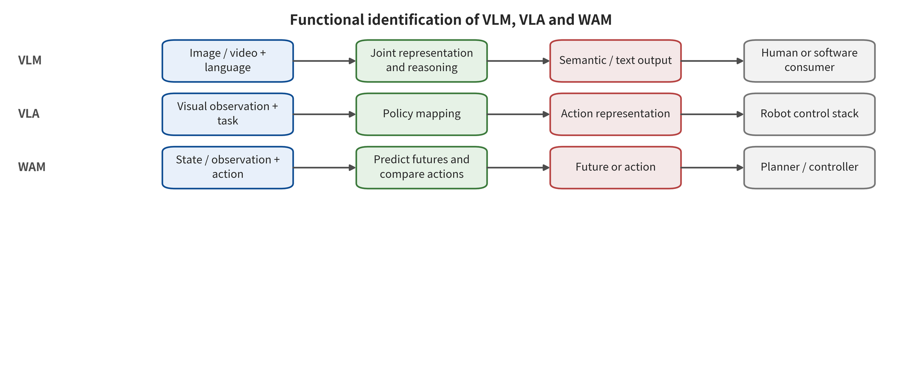
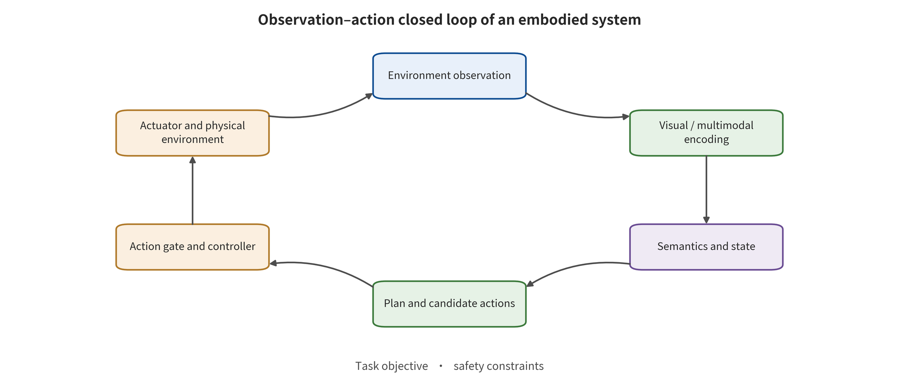

ation acknowledgments. Separating these layers is what stops a single proxy metric from being used to draw conclusions about robot safety.

# Chapter 12　From Seeing to Acting: Closed-Loop Interfaces of Three Model Types

A mobile manipulator receives the task "deliver the blue medicine box to workbench No. 3." Both the blue medicine box and a red warning sign reading "No. 3" sit in the camera view. The system can name both objects correctly and still treat the warning sign as the target location. Its semantic judgment can be correct while it decodes "5 cm to the left" as rightward motion. It can even generate a future video that looks safe while a different action branch drives the manipulator through a no-entry zone. Vision is involved in all three failures, yet each one occurs at a different coupling point: semantic, action, and imagination–action. Calling the system only an "embodied model" makes it hard to place safety control at the correct interface.

Distinguishing vision–language models, vision–language–action models and world action models requires executable interface definitions. The classification rests on what a component receives, what it stores and what it outputs. It also rests on which consumer reads that output, and at which independent interface the output obtains authority. Once this data flow is unfolded, the next chapter can locate which element an attack changes first: the observation source, the semantic binding, the future prediction or the action path.

## Chapter Overview

This chapter brings the vision–language model (VLM), the vision–language–action model (VLA) and the world action model (WAM) discussed earlier back to the interfaces where they actually run. It distinguishes them by actual inputs, internal states, outputs and consumers. The closed loop has six layers: observation, semantics, policy, action, execution and feedback. Each layer carries its own safety invariants. The classification reads data flow and call relationships. Product names and promotional material are only clues to be verified.

The chapter then maps action tokens, continuous control values, action chunks and future trajectories back to concrete coordinates, physical units and time constraints. At that point, layer by layer, it can separate model-generated content, plans, acceptance by simulation tools, simulated execution and real-world environment events. It closes by consolidating this method around one embodied task. Input fields and provenance, output types, dimensions, units, consumers, permission gates, failure handling and evidence layers all go into a single testable closed-loop diagram.

## Conceptual groundwork: identifying closed-loop roles by input, state, output, and consumer

This chapter concerns closed-loop components. Their job is to turn environment observations into semantics, future predictions or action proposals. Images, depth, speech, task text, proprioceptive state, history and candidate actions all serve as inputs. Inside such a component, cross-modal representations, belief states, future trajectories, values or action chunks may take shape. A VLM mainly produces semantic content that an answerer or a planner consumes. A VLA produces actions that a controller can interpret. For a WAM, a verifiable future must actually be consumed by action generation, candidate ranking, policy learning or a checker. Names do not determine roles. The invocation path does.

How much capability an output can attain depends on its consumer. An answerer changes only content. A planner changes candidates. A proposal touches reality only through the action gate and the actuators. The safety surface spans observation provenance, semantic type and state persistence. It also spans imagination–action consistency, action units, authorization and feedback. Where an error stops changes its evidence level. One that halts at the answer layer differs from one that runs through coordinate transforms, capability tokens and the controller into the execution layer. Internal state and a checker may share an encoder. Both may then drift at once, and together they cannot automatically constitute an independent defense line.

Take a benign example. A camera recognizes a medicine box. A VLM outputs entity relations with provenance. A VLA proposes a metric action chunk. A WAM predicts candidate futures. An independent action gate approves only a safe prefix, then continues approval as new observations arrive. A boundary case arises when a future video looks correct while the action head selects the wrong coordinate. Another arises when text on an environmental sign is treated as an authorized task. The first requires verifying imagination and action separately. The second requires environmental data and commands to stay type-separated. This chapter judges components only by their actual consumers. It does not extrapolate physical safety from marketing names or image quality.

## 12.1 Names cannot replace interface definitions

For a VLM, the minimal input–output definition maps visual observations and language context to semantic representations, labels, answers or other content. This definition first confines the output to the content or representation layer. The consumer then decides whether it enters a plan. Take the observation at time $t$ to be $o_t$, the language goal to be $l$ and the history context to be $h_t$. We can then write

\[
z_t=f_{\mathrm{VLM}}(o_t,l,h_t),\qquad y_t\sim p_\theta(y\mid z_t).
\]

Here $z_t$ denotes a cross-modal representation, while $y_t$ denotes a content output. A VLM can recognize scenes, answer questions or form plan text. Low-level actions lie outside its native output range, however. Visual adversarial examples, indirect instructions in images and cross-modal jailbreaking can control $z_t$ or $y_t$. The evidence such attacks supply reaches the representation or content layer at most. Without a separate execution chain, none of them can directly prove that a robot has moved [@VLA_B003; @VLA_B004].

For a VLA, the minimal input–output definition maps observations, language goals and robot proprioceptive state to actions that a controller can consume. "Consumable" here only indicates that the action already has interface meaning. It does not indicate that the authorization gate has already let it through. Write proprioceptive information such as joint positions, velocities and gripper state as $q_t$. An action chunk of length $K$ can then be written as

\[
a_{t:t+K-1}=\pi_\theta(o_t,l,q_t,h_t).
\]

$a$ can be a discrete action token. It can also be an end-effector pose increment, joint control values, a waypoint, a velocity or an entire trajectory. The key change in a VLA is not an extra output head. What changes is the possibility that the model output enters the U4 authorization and execution interface. An action proposal from a model is still not an executed action. Whether the proposal attains real-world capability rests jointly with the message queue, the coordinate transforms, the collision checks, the controller and the actuators [@VLA_A001; @VLA_A003; @VLA_A006].

The minimal input–output definition of a WAM adds a further requirement. A verifiable future prediction must participate in action generation, candidate evaluation, policy improvement or planning ranking. Merely generating a future video for humans to watch is not sufficient for that operational definition. For a candidate action $a^{(j)}$, let the model generate a future state or observation

\[
\hat z^{(j)}_{t+1:t+H}=W_\phi(o_t,q_t,a^{(j)},h_t),
\]

where $H$ is the length of the prediction horizon unfolded into the future. It must bind the model time step and real-world time units together. Otherwise "predicting $H$ steps" cannot be converted into a control deadline. The planner then chooses a candidate, guided by the goal $g$ and by the reward or cost $R$. With that choice, the future prediction becomes the actual basis of the action path. It therefore requires recording the candidate set, the scoring version and the safe branches that were not selected:

\[
j^*=\arg\max_j R\!\left(\hat z^{(j)}_{t+1:t+H},a^{(j)},g\right).
\]

The consumer determines whether a future output constitutes a WAM. Video packaging does not decide it. If humans alone watch the future and decide the actions themselves, the output counts as an environment video prediction. The operational definition of a WAM applies only once an action head, inverse dynamics, candidate ranking, policy learning or a safety checker reads the future [@VLA_A026; @VLA_A029; @VLA_A033; @VLA_A036]. Two systems can classify the same pixel sequence differently. Their consumption paths differ, and so does the authority attained.

VLM, VLA and WAM do not form a simple capability hierarchy. One system may interpret the scene with a VLM, output actions from an independent policy and preview execution with a world model. At the system level it holds all three kinds of components. Each individual model is still classified by its own actual inputs and outputs. The reverse case also holds. A joint network may emit future frames and actions at once. It counts as a WAM only if tensors, APIs or control messages confirm that the action path indeed consumes the future.

Work through the three kinds of components row by row, comparing inputs, internal mechanisms, outputs and consumers. Check in particular whether the "future frames" really enter action generation or candidate ranking, rather than being only for humans to watch. For each row, then indicate whether the output stops at content, at an action proposal or at a planning basis. Name the next interface that grants it higher authority.

Figure 12-1 backs a distinction among the three kinds of roles that rests on executable interfaces. The same visual input ends at different safety endpoints, because its outputs and consumers differ. The figure does not imply that the three kinds of components must be deployed as three separate models. Category names alone support no inference about capability strength or real-world consequences. For a joint network, every consumption path still has to be confirmed through actual tensors, APIs, control messages and permission gates.

## 12.2 The six-layer closed loop and its invariants

Six layers can carry embodied safety. Every layer holds one permitted information flow plus one invariant that must not be crossed. The table adds typical failure signals, which help an engineering team locate the first deviation. Seeing a signal is not automatic proof that later layers have already been breached:

| Layer | Primary objects | Safety invariant | Typical failure signal |
|---|---|---|---|
| L0 Observation | Images, depth, speech, state, environmental text | Provenance, time, integrity, and task purpose are traceable | Frame replay, physical patch, sensor saturation, text attaining command authority |
| L1 Semantics | Entities, relations, goals, intermediate reasoning states | Authorized instructions and environmental content remain type-separated | Goal binding error, spatial relation substitution, reasoning changed in a targeted way |
| L2 State and imagination | History, latent state, future trajectories, values | State can be checked against external evidence, and the future is conditionally consistent with actions | Shared drift, candidate ranking flip, decoupling of future and action |
| L3 Policy and action | Action tokens, action chunks, trajectories, control primitives | Physical units, coordinates, and time are consistent with task intent | Direction reversal, freezing, open-loop accumulation, target trajectory deviation |
| L4 Authorization and execution | Capability tokens, controller, actuators | Only actions that satisfy permission and safety constraints can be executed | Unapproved action dispatched, parameters out of bounds, execution continuing after a check times out |
| L5 Feedback and recovery | New observations, proprioceptive state, event logs, takeover | Feedback is fresh and independent, and anomalies can enter a safe state before the harm window | Replay, delay, feedback forgery, failure to suppress actions after detection |

Nothing in these six layers conflicts with the U0–U6 interfaces of Chapter 2. The U0 supply chain can reach the L0 sensors, the L1 encoder and the L3 action head at the same time. L4 maps mainly onto U4 authorization and execution, and L5 maps mainly onto U5 feedback. One question belongs to the six-layer view: how an embodied closed loop consumes an error step by step. A different question belongs to the seven-interface view: where trust first changes. Each view can check the other.

A closed loop draws its risk from continuous consumption. A visual patch first changes the L0 observation. The vision encoder then forms an erroneous entity binding at L1. The action policy outputs a deviation at L3. The controller executes at L4. Fresh observations then feed the deviated state into the next round. If every round re-reads the same patch, the attack's effect persists. An action chunk that runs open-loop within $K$ steps will even keep the system moving before it sees the error amplifying.

Future prediction opens one more bypass. At L2 a WAM may generate multiple candidate futures. The planner selects actions on that basis. An attack can make the future itself wrong. It can also keep the future seemingly plausible while making the action branch deviate. Each round of model predictive control (MPC) predicts a finite horizon from the model and replans in a rolling manner. Trusted Imagination shows that sensitivity to the same imagination attack can differ markedly across controllers. An MPC controller consumes the future. A reactive policy does not. BadWAM demonstrates that boundary directly: "plausible-looking imagination with deviating action output" [@VLA_A033; @VLA_A036]. Image quality, state integrity and action consistency therefore each require a separate test.

Follow the circular arrows from the environment observation to the actuators, then bring the execution result back to the environment. At each node, ask who writes the state. When does an action attain authority? Does the next round use fresh feedback? Now suppose the action gate rejects the current proposal. Three records can then hold at the same time: upstream deviation, gating outcome and an unchanged environment.

Figure 12-2 supports reading encoding, state, plan, the action gate, the actuators and environmental feedback as one continuous consumption chain. It also shows what decides whether an error persists. The factors are state retention, action admission and external feedback. The figure does not prove that every system has the independent action gate it shows. Still less does it prove that a closed loop necessarily amplifies errors. Specific propagation still requires a comparison of clean and perturbed states, gating receipts and independent new observations.

## 12.3 An action is not a unitless vector

Offline model evaluation often reports the distance between two action vectors as a single number. An execution system, by contrast, needs to know what each dimension represents. End-effector control may interpret the first three dimensions as metric translation. The next three may be Euler angles or a rotation vector. The last dimension may be gripper opening and closing. A navigation system's action may be velocity and angular velocity. Another model quantizes the continuous action dimensions at boundaries into 256 discrete intervals (bins). It then outputs or selects the action token that represents one interval. Without detokenization to physical values, a one-bin difference between action tokens says nothing about whether the robotic arm actually shifted by 1 mm or crossed a safety zone.

A complete action interface specification contains at least the following fields. Together these fields restore the numerical values of model space to objects, units and temporal semantics in control space. They also let the action gate perform boundary checks without relying on natural-language interpretation:

- Coordinate frame: world, robot base, camera, end effector, or local object coordinates;
- Units and signs: meters, radians, newtons, seconds, and positive directions;
- Frequency and holding mode: decisions per second, and how the action is interpolated or held before the next decision;
- Chunk length: how many steps one inference outputs, and when early interruption is allowed;
- Normalization: how training values map back to physical ranges, and how out-of-range values are handled;
- Execution semantics: position, velocity, torque, or target trajectory, and who is responsible for low-level stabilization;
- Safety constraints: velocity, acceleration, contact force, workspace, obstacle distance, and authorized objects.

Action chunks turn time into an independent safety variable. Let the single-step error be $e_i$. The terminal offset does not follow simply from the maximum single-step error. Control integration, coordinate rotation and closed-loop re-perception all bear on it jointly. An error of the same magnitude in the opposite direction may produce a completely different change in safety margin. In a simplified translational model,

\[
\Delta x_K\approx \sum_{i=0}^{K-1} e_i\Delta t.
\]

This formula offers mechanistic intuition only. Over a long action chunk, many smooth small deviations can accumulate. The displacement in the formula stands for a mechanistic trend. The real robot's dynamics, contact and controller corrections must still enter any measured collision distance. SilentDrift builds long-horizon drift precisely from the smooth offsets inside one action chunk. DRIFT instead attacks the early velocity field of a flow-matching VLA. The deviation generated in the first step then propagates through later integration [@VLA_A021; @VLA_A056].

## 12.4 “Seeing right,” “thinking right,” and “acting right” are three separate questions

WAM verification can be reduced to three binary judgments. One asks whether the observation semantics are correct. Another asks whether the future is consistent with the true dynamics and the action conditions. The third asks whether the action satisfies the objective and the constraints. These yield eight combinations in total, and none of them can substitute for another. The “correct” in the table means only that the corresponding observed quantity satisfies a predefined protocol. Even if all three items are correct, execution authorization and environmental feedback verification are still required. That combination is not sufficient to prove that the whole system is already safe.

| Observation semantics | Future consistency | Action compliance | Visible phenomenon and safety judgment |
|---|---|---|---|
| Correct | Correct | Correct | All three tested objects pass the current protocol, and execution authorization plus feedback verification are still required |
| Correct | Correct | Incorrect | The future looks plausible, but the action head or the decoding chain deviates; check the action independently |
| Correct | Incorrect | Correct | The future branch is distorted, but another path corrects the action or the action does not consume that future; keep checking the consumer |
| Correct | Incorrect | Incorrect | The observation entry is normal, yet the future and the action branch fail together; check the imagination–action coupling and the action gate |
| Incorrect | Correct | Correct | The observation semantic judgment fails, but independent state or control constraints limit propagation; retain the record of the upstream failure |
| Incorrect | Correct | Incorrect | The observation and action branches fail; a normal future metric alone cannot clear the action |
| Incorrect | Incorrect | Correct | The erroneous observation enters the future and independent control corrects the action; a limited consequence does not equal upstream safety |
| Incorrect | Incorrect | Incorrect | All three objects fail; it is still necessary to confirm whether the action is authorized and whether the environment actually changed |

The second combination, “observation correct, future correct, action incorrect,” is the most easily overlooked. A safety team that accepts WAM on future video similarity, PSNR, FVD or human perception alone can answer only whether the generated result is similar under some metric. It cannot answer whether the selected action can really reach that future, nor whether the action crosses constraints. BadWAM suppresses imagination drift while it explicitly optimizes action deviation under a query-based attack. That result shows the action head must be treated as an independent asset [@VLA_A036].

Conversely, an action that is temporarily correct covers only the current control cycle. A contaminated latent state may still output acceptable actions, yet change the candidate ranking several steps later. Verification must therefore compare internal predictions with independent external anchors at the same time. Such anchors include a geometric map, a rule engine, another sensor suite, or the real next observation. An anchor that shares an encoder and training data with the model under test may drift along with it, so it counts as correlated evidence. Independence requires support from different roots of trust.

### 12.4.1 How research evidence maps onto closed-loop levels

Closed-loop research must specify at least four objects. These are the variables the attacker optimizes, the variables held frozen, the observation endpoint, and the execution environment. Consider an input patch attack. Model weights can be held frozen while the attacker optimizes only patch pixels. When gradients are taken with respect to action outputs, the conclusion reads "given white-box gradients and a pixel budget, there exists an input that shifts the action." That is not a training backdoor, nor can it be extrapolated to a remote black-box attack. If the attacker changes the training data, the loss, or the trainable modules, then the first-broken interface lies in the supply chain. That holds even if a visual trigger still activates it at deployment time.

Task failure in simulation usually supports conclusions at the closed-loop task level. It does not automatically support real physical consequences. Check whether the simulator includes control frequency, contact, sensing latency, collision, permissions, and fault handling. Real-robot experiments must also distinguish "the action has been executed by the robot" from "personnel, property, or business impact has occurred." Safety testing should design reversible endpoints in isolated environments. Real people and assets are always protected, and evidence escalation uses isolated and reversible endpoints.

Direct VLA/WAM evidence and upstream VLM evidence also cannot be mixed. Image jailbreak research proves that visual payloads can cross language safety boundaries, and it is suitable for explaining the entry mechanism from L0 to L1. Only when connected to an action consumer and observed through actions or closed-loop results does it support conclusions at L3 and beyond. Research on embodied agents or traditional control can supplement permissions, feedback and execution mechanisms. Even so, it must mark which VLA/WAM architecture it does not cover.

## 12.5 Understanding the closed-loop interface from partial observability

Robots rarely obtain the complete environmental state directly. A camera cannot see an obstacle behind an occlusion. A force sensor produces information only after contact. A language task may also omit objects, order, and stop conditions. The partially observable decision process comes closer to reality. There the true state \(x_t\) produces \(o_t\) through an observation model. The system forms a belief state \(b_t\) based on history, and the policy then outputs an action.

\[
o_t\sim O(o\mid x_t),\qquad
b_t=\mathcal U(b_{t-1},o_t,a_{t-1}),\qquad
a_t\sim\pi(a\mid b_t,l).
\]

Here, $\mathcal{U}$ is the state update and $l$ is the authorized task. This representation reveals three safety facts. First, a correct observation does not amount to a complete state, because any variable the sensor does not see stays unknown. Second, a single erroneous observation can gain persistence through the state update. Third, an action changes what will be visible next time. An observation affected by one's own action belongs to closed-loop feedback, and it needs an external source to form independent verification.

State representation rules must therefore allow “not knowing.” Whenever the position of personnel, the obstacle depth or the object identity is not visible, the model should output unknown or an interval. The controller then reduces speed, requests a new viewpoint, or stops accordingly. When the model is forced to give a single definite value at every moment, perceptual blanks turn into seemingly precise plans. A world model can complete an occluded state. That completion is prediction, not observation, so it must carry uncertainty and a provenance label.

Partial observability also changes attack testing. Occluding a sensor is one attack; writing a targeted signal into that sensor is another. The first reduces information. The second adds erroneous evidence with a target. Several inputs must be recorded separately. These are the remaining sensors, the state prior, the history length, and whether the system actively acquires new observations. A static single-viewpoint failure does not necessarily become a closed-loop failure when the robot can move around to the side and re-observe. The same entry point becomes more dangerous when the action chunk prevents timely re-observation.

A traceable belief state marks at least the following. It records which fields come from the current sensor, which from history, which are predicted by the model, and which are derived by rules. It records the timestamp, validity period, coordinate frame, and confidence range of each field. It records who arbitrates when fields conflict, and which actions are allowed when a key field is unknown. The safety gate then checks a set of states with evidence identity rather than a provenance-free vector.

## 12.6 How VLA architecture differences change the interface

“VLA outputs actions” is still too coarse. Different architectures couple language, vision, and action at different points, which shifts attack reachability and verification entry points. A discrete action token architecture turns actions into a quantized vocabulary, and language and action decoding may share one autoregressive context. A continuous regression architecture outputs physical quantities or normalized controls directly. An action chunking Transformer produces multiple steps at once. A diffusion or flow-matching policy obtains an action trajectory through a generative process. A hierarchical system first produces a task plan, which a skill library or a low-level policy then executes.

The vocabulary version, the detokenization table and the stop token all need protection in a discrete action token architecture. A token rare on the language side may map to an extreme value in control space. Semantic filtering cannot see that physical meaning. Acceptance should trace detokenized outputs back from action token probabilities to meters, radians, gripper state, and execution duration [@VLA_A003; @VLA_A006].

A continuous regression architecture has no discrete vocabulary, yet normalization, coordinates, and saturation can still affect it. How outputs outside the training range are clipped matters. It also matters how the rotation representation is handled at singularities, and whether the gripper threshold has hysteresis. Each of these changes the consequence of the same numerical deviation. Safety checks belong in physical unit space, not on a normalized tensor alone.

An action chunking architecture needs to record intra-chunk order and cross-chunk overlap. The admission process begins by restoring the whole chunk of actions against the current decoding table. It then checks the coordinate version, kinematic reachability, cumulative displacement, velocity, acceleration, contact, and authorized regions. After the chunk passes, execution capability is issued only for a short prefix. Once the prefix has been executed, the system reads a newly timestamped observation plus proprioceptive state. It checks the state version, then rolls over to continue the batch for the remaining actions. A failed check triggers one of whole-chunk rejection, constrained projection, prefix shortening or replanning. The actual choice is recorded. SilentDrift demonstrates how smooth deviations accumulate within a long chunk [@VLA_A021].

For diffusion and flow-matching policies, the record must cover the sampling seed, the number of generation steps, the condition cache, and key time steps. An attack may concentrate in the early stage of generation. The final trajectory anomaly then appears only after multi-step integration [@VLA_A027; @VLA_A056]. Safety testing must observe the final action and also retain the key velocity field or denoising state. Internal signals are kept for diagnosis, and authorization rests on physical constraints.

A hierarchical architecture spreads risk across the planner, skill selection, parameter binding and low-level control. Correct high-level plan text does not mean the skill ID and object parameters are correct. Nor can a stable low-level skill correct a wrongly selected object. Every level must output structured objects and versions, so that approval cannot carry over to parameters regenerated later.

### 12.6.1 Four Types of WAM Consumers

Future predictions change safety constraints only when they are consumed. Four categories cover the common consumers: candidate rankers, inverse dynamics or action decoders, policy learners, and runtime checkers. They use the future in different ways, and their attack endpoints also differ.

A candidate ranker generates multiple actions or plans first, then scores them against future returns, risks or constraints. The security assets are candidate coverage, scoring integrity, and ranking stability. If safe candidates are never generated at all, the scorer cannot remedy this. When high-value tail candidates are deliberately suppressed, the average prediction error may remain nearly unchanged while the final selection still flips [@VLA_A029].

An inverse dynamics or action decoder infers actions backward from a target future. The future image may be correct. All the same, the decoded action fails coordinate, reachability or safety constraints. BadWAM shows that plausible imagined appearance cannot cover the action branch [@VLA_A036]. Verification should cross-check both directions — "generating a future from an action" and "decoding an action from a future." It should ask whether executing the action can produce the claimed future. It should also ask whether the claimed future can only be reached by permitted actions.

A policy learner produces training experience in imagination. A world model failure does not show up immediately in deployment calls. It becomes fixed in the policy parameters. At this point a lineage must link the world model version, the imagination data batch and the policy checkpoint. Testing the deployment-time input alone cannot reveal training-chain contamination.

A runtime checker uses a future preview to judge another policy's action. It appears to be a line of defense. Yet it may miss the same attack at the same time if it shares an encoder, data, or state with the working policy. Rejection, shortening, replanning or safety hold must also follow from the checker's output. Otherwise it is merely an explanatory picture. A model's own future alone cannot justify final authority over its own high-risk actions.

The four types of consumers can coexist. Take one system. A world model generates candidates, a value head ranks them, and the same model then previews the execution result. During review, the data flow should be drawn item by item. Mark the location where the future is read, the reading component, the access permission, and the update boundary each time. This keeps the three calls from merging into a single "WAM module."

## 12.7 Causal Chains and Counterfactual Checks

Attack evaluations often see an input change and a task failure appear together. The intermediate mechanism stays unproven. A stronger closed-loop explanation requires a minimal causal chain. The attack variable changes the observation or artifact. The intermediate state or reasoning changes in the predetermined direction. The action proposal changes. The execution gate releases, or it does not. The environment endpoint changes. Every arrow requires an observable quantity or an interventional control.

The key variables can be written as a simplified structure. Attack \(A\) affects observation \(O\), observation affects state \(S\), state affects action \(U\), and action affects the outcome through the gate \(G\) \(Y\). This structure is not the causal conclusion itself. It is a set of candidate arrows awaiting validation by paired interventions and stratified logs. If any one of them is not observed, the claim stops at the previous endpoint.

\[
A\rightarrow O\rightarrow S\rightarrow U\rightarrow G\rightarrow Y.
\]

When only \(A\) and \(Y\) are compared, confounding may come from the task's own randomness, the initial state, or the controller. Mechanism verification adds at least three kinds of controls. The input control holds the task and initial state fixed and swaps out only the attack payload. The consumer control holds the perturbed future fixed and toggles whether the policy consumes the world model. The gating control holds the action proposal fixed and compares the safety gate turned on versus off. Trusted Imagination contrasts a reactive consumer with an MPC consumer. That contrast supplies the mechanism control of "whether the future is consumed" [@VLA_A033].

A counterfactual check does not ask the same model to explain in words "what would have happened without the attack." It needs cached clean runs, an independent simulation, or state that can be reset. At time step \(t\), run the clean input and the perturbed input separately from the same trusted snapshot. Compare state, candidate ranking, action, and consequences. If the environment cannot be reset exactly, fall back on paired random seeds, initial-state stratification, and enough repetitions. That guards against attributing initial-state differences to the attack.

Frozen variables must appear in the causal explanation. When the weights are frozen, the observed differences support an input or state path. When training samples and weights both change, the result cannot be attributed to purely runtime input. Safety gate parameters must be frozen too. Otherwise attack conditions and defense conditions shift together, and attribution breaks. In a black-box system the internal state cannot be observed. There, actions, latency, replanning, and independent environment anchors can be used to form a falsifiable proxy. The write-up should still state that the intermediate mechanism is an inference.

### 12.7.1 Verification Fixtures: From Tensors to Safe Execution

Runnable fixtures can verify these interface definitions. A low-risk fixture does not connect to a real robot. It only replays recordings or constructs tensors. Layer by layer, it checks whether the observation provenance rules, task field permissions, state freshness, future consumers, action decoding, and execution admission run as configured. Fixture inputs include provenance-labeled observations, the task object, state timestamps, candidate futures, the action decoding table, and safety constraints. Outputs include the admission decision at each layer and its rationale.

The first group of tests verifies types. Put the same string into an authorized task field, an environment OCR field, and a tool-return field, one after another. Then confirm that only the authorized field can change the task object. The second group verifies time. Replay stale proprioceptive state and out-of-order frames. Confirm that the system rejects long action chunks. The third group verifies actions. Detokenize boundary action tokens, normalized extremes, and coordinate version conflicts. Confirm that anomalies are rejected before they enter the controller.

The fourth group verifies WAM consumers. Fix the observation semantics and the initial state, then construct four future–action combinations. In the first, both the future and the action are correct. In the second, the future is wrong but the action is correct. In the third, the future is correct but the action is wrong. In the fourth, both are wrong. The checker must identify future completeness and action consistency separately. It cannot pass on video similarity alone. The fifth group verifies the consequence layer. Use a sandbox executor to return "proposal generated," "message accepted," "execution succeeded," and "transaction rolled back," one per case. Then confirm that the log does not compress the four states into a single success boolean.

The fixture's denominator is the interface test items executed or the samples constructed, not robot tasks or real-world events. Suppose 30 field type, dimension, unit, consumer, and failure-handling probes all pass. The conclusion then covers only these 30 interface behaviors, which meet expectations. The attack protection rate still requires independent attack tasks and a corresponding denominator. The fixture version, inputs, expected outputs, actual outputs, and hashes should be saved with the model release.

Upgrading from fixtures to simulation adds dynamics, contact, latency, and closed-loop replanning. Upgrading to an isolated real robot adds sensors, calibration, and actuator differences as well. Each upgrade redefines the denominator. The pass rate of tensor probes cannot be carried over as a physical safety metric.

### 12.7.2 Design Review Checklist

Before a VLM/VLA/WAM system enters review, it should be able to answer the following interface questions. The questions are not meant to attach a single overall label to the product. They give inputs, state, outputs, consumers, permissions, and failure actions a verifiable owner. Unknown items should correspond to a capability that is disabled or narrowed:

- Who consumes the VLM's semantic output, and can it turn into an instruction or a permission?
- Does the VLA output action tokens, continuous values, action chunks, or generated trajectories? Where are the detokenization table and the coordinate version?
- Which future quantities does the WAM predict? Along which call path do they reach action generation, ranking, learning, or checking?
- Which fields in the current state come from observation, history, prediction, and rules? How is unknown represented?
- How do the action chunk length and the re-perception frequency change with risk?
- At which independent interface does the model proposal obtain execution authority? What is the state after admission failure?
- Do prediction, risk judgment, and action verification share an encoder, data, state, or context?
- For simulation, emulated execution, isolated real robots, and real-world events, what endpoints and denominators does each use?
- Can the logs connect task, state, future, action, authorization, execution, and recovery versions?
- If any key interface is unknown, will the system narrow its capability, request clarification, or continue guessing?

The review record fixes three groups of executable fields. The action definition states the output form, dimensions, coordinates, units, normalization, frequency, chunk length, and early-interruption conditions. The consumer path states which controller, tool, or planner reads the output. It also states which decoding and coordinate transformations occur in between, and what authority is ultimately obtained. The admission result states the trigger conditions for release, rejection, projection, short prefix, replanning, and safety hold. When a field is unknown, the deviation metric, the model classification, and the consequence judgment are each marked as undetermined. The corresponding tests and permission narrowing then handle them.

## 12.8 Metrics and Denominators: The Same "Success" May Span Four Objects

Evaluations of VLM, VLA, and WAM often use accuracy, attack success rate, task success rate, return, or trajectory distance. The same metric name does not mean the same estimand. An interpretable number must be tied to a sampling unit, a success condition, an observation layer, an attack budget, and a repetition structure.

At the VLM content layer, prompts, image–question pairs, model responses, or responses that a grader successfully parsed can all serve as the denominator. Suppose 20 of 100 requests fail at the API and the harmful output rate is computed only over the 80 parseable responses. Then request-level availability must be reported at the same time. Treating the 20 failures as safe refusals will overestimate the defense.

At the VLA action layer, the denominator may be time steps, action dimensions, action chunks, complete task episodes, or tasks. A per-time-step hit rate on target action tokens cannot substitute for task-episode failure, because the controller may correct on the next step. Nor can a single terminal failure be used to infer that every step was attacked. Action deviation must state whether it is computed in normalized space or physical space. It must also report translation, rotation, gripper, and cumulative trajectory separately.

The WAM denominator may also be future frames, latent states, candidate trajectories, replanning cycles, or closed-loop tasks. The success of a candidate ranking attack can be defined in two ways: the clean optimal candidate no longer ranks first, or the selected trajectory's return falls below a threshold. The two are not equivalent. Imagination drift is measured by latent cosine distance, and it has no common unit with the action task success rate [@VLA_A029; @VLA_A033].

The attack success rate carries at least one structured note. That note specifies the preregistered endpoint required by the numerator, the denominator inclusion conditions, and the independent unit actually evaluated. Parse failures, timeouts, execution gate rejections, and task failures each retain their state. No favorable convention is chosen after the fact:

\[
\mathrm{ASR}=\frac{\#\{\text{independent units meeting the preregistered attack endpoint}\}}
{\#\{\text{independent units meeting the inclusion criteria and actually evaluated}\}}.
\]

"Independent units" must be determined according to the protocol. Adjacent frames, multiple windows of the same trajectory, and multiple tasks that share a checkpoint are usually correlated. They cannot be treated as fully independent studies. If scoring is done only on tasks that the normal model can complete and whose attack targets are also reachable, the denominator is conditioned. That design can isolate attack capability, but the number cannot represent all tasks.

Every safety number should also be paired with benign utility. Normal task success, benign instruction acceptance, average path length, execution time, and resource cost together reveal whether the defense achieves surface safety by rejecting everything. Pair attack effect with benign utility under the same model, the same task, and the same control deadline. A defense may restore success on the attack task. If it pushes the P99 latency beyond the control period, it still cannot enter real-time deployment.

Seven columns are recommended for the report: object and version; independent unit and denominator; attacker permissions and budget; first-broken interface; highest observation layer; benign utility; uncertainty and failure records. When a number cannot fill all seven columns, narrow the conclusion. That is more credible than filling the gap with a striking percentage.

### 12.8.1 Comparability and Incomparability of the Three Case Types

Three cases show how consumers and execution admission constrain conclusions. The first type is the VLM upstream visual payload. Visual adversarial examples or indirect instructions in an image cause the model to generate controlled content. The model weights stay frozen, and the attack variable is the image or audio. The observation endpoint is usually a representation, an answer, or instruction following [@VLA_B003; @VLA_B004]. This proves a cross-modal entry exists, but it has no action consumer.

The second type is direct VLA action attacks. These studies feed perturbed images into action models. They optimize physical action deviation or target action tokens directly, and observe task changes in controlled environments [@VLA_A003; @VLA_A006]. This evidence goes beyond the content layer and supports action proposals or closed-loop tasks. Coordinates, chunk length, simulator, and execution gate still need to be checked. Until they are, one cannot judge whether simulated execution or an isolated real robot is reached.

The third type is WAM imagination-chain attacks. Trusted Imagination changes future latent variables, and consumer differences determine task consequences. BadWAM takes the opposite route: it keeps the future appearance similar while changing actions in a targeted way [@VLA_A033; @VLA_A036]. The new objects here are the future, candidates, and the imagination–action coupling. An ordinary VLM harmful output rate cannot cover them.

| Case family | Direct variable | Main consumer | Minimum observable endpoint | Key unknown |
|---|---|---|---|---|
| VLM visual payload | Image, audio, or cross-modal context | Semantic decoder | Representation or content | Whether action and permissions are connected |
| VLA action attack | Input, prompt, or action target | Action head and controller | Action proposal or task | Physical units, execution conditions, reality level |
| WAM imagination attack | Observation, future, ranking, or action branch | Planner, decoder, checker | Imagination, ranking, action, or closed-loop task | Who consumes the future, whether there is an independent anchor |

The three types of research can jointly support a mechanistic synthesis that "errors escalate along consumers," but their ASR cannot be merged. They differ in denominator, permissions, model, task, and endpoint. More reasonable comparison questions are: in the same system, which consumer does the upstream payload reach? Does each interface have independent control? What is the highest observation layer? How much benign utility and latency cost is involved?

The case comparison also helps locate evidence gaps. VLM input attacks and VLA action vulnerabilities may already exist. If the same attack has not been threaded through the target system, the existing results form only two pieces of bridge evidence. The complete chain has not yet been verified. A simulated closed loop may exist with no real actuator, permissions, and external anchor. The real-world consequence then remains a hypothesis to be verified.

## 12.9 From Interface Inventory to Model Determination

A system may lack a clear architecture description. Even so, a conservative determination can be completed in six steps. The first step lists all external inputs. It records user instructions as well as images, depth, speech, proprioceptive state, history, retrieved content, maps, and tool returns. The second step lists all cross-invocation state. It confirms who can write to it, when it expires, and how it is reset. The third step lists the fields, types, dimensions, units, versions, and parse-failure actions of native outputs. It does not guess internal capabilities from demonstration footage.

The fourth step traces outputs along consumers. A component satisfies VLM if a semantic representation only enters an answerer. A component satisfies VLA if a controller consumes an action tensor. A component satisfies WAM if a future state enters action generation, scoring, policy learning, or checking. The fifth step traces permissions. Which component can turn a proposal into a tool or physical action, and which component can refuse? The sixth step uses runtime probes to verify documented conclusions. For example, do actions change after the future branch is disabled? Does the future change after the action condition is replaced? Does a bypass still exist when the execution gate refuses?

Three minimal probes can identify common mislabeling. Probe one keeps the image and task unchanged and replaces only the future tensor. If the action does not change at all, the future may be for display only, and WAM cannot yet be confirmed. Probe two keeps the future and task unchanged and replaces only the action condition. If the generated future does not respond to the action, the so-called "action condition" may not have entered the dynamics. Probe three makes the execution gate return a refusal. It then observes whether the system continues executing through another tool, a cached action, or a low-level channel. If a bypass exists, there is uncontrolled capability outside the coverage of execution admission.

Probe results still require interpretation. An unchanged action may mean the future branch carries very little weight in the current task, not that it is structurally absent. This needs to be repeated across multiple tasks, states, and extreme conditions. When a closed API prevents access to intermediate tensors, ablation configurations, latency, logs, or vendor-provided verifiable interfaces can be compared. Even so, the classification should be marked as a conditional judgment.

Five columns are recommended for a determination record: component version; observed inputs and outputs; consumers and permissions; supporting evidence; unknowns and counterexamples. The same product may later be upgraded from an offline demonstration to automatic control. The record then shows which consumer and permission were added. That way the team does not carry over the old threat model merely because the name has not changed. The review date can also be recorded.

A model determination should also face a reverse check. Suppose the component is not a WAM: can every action path still be explained? Suppose it is only a VLM: is any low-level control output that cannot be explained? Suppose the actuator never consumed model actions: does that fit the logs? A classification that counterexamples can overturn is more robust than one that ticks items off against a definition.

A review should end with an interface card, not a one-sentence category conclusion. The interface card records the provenance and purpose of each input, the retention period of each state, and the unit of each output. It also records the permission of each consumer, the failure action of each safety gate, and the date of the classification evidence. Where a component is closed, mark unverifiable internal relationships as unknown. Then place stricter restrictions on the external execution layer.

The interface card should also carry a "minimum harmable path". That path starts at the attacker's weakest controllable entry and passes through the fewest consumers to reach the highest-privilege action. Against it the team arranges the earliest blocking and the final consequence limitation, then checks whether the two share a cause of failure. If the earliest blocking relies on VLM self-checking, while the final limitation relies on the same VLM to identify risk objects, the two are not independent.

Finally, perform negative acceptance. Feed in environmental text that clearly has no authority to change the task, and confirm that the goal does not change. Provide expired state, and confirm that the action chunk is not released. Construct a combination with a correct future but an out-of-bounds action, and confirm that the action gate refuses. Let the checker time out, and confirm that the system enters a safe state. These four negative tests verify interface boundaries more directly than "a normal task can run through."

The interface card needs to ship to the verification environment with the configuration. A change to the action decoding table, the coordinate extrinsics, the control frequency, the world model horizon, or a capability token should re-run the relevant probes. Suppose the team can confirm only that the model file has not changed. Suppose it cannot confirm that consumers and permissions have not changed. Then existing results cannot be inherited directly. Security constraints protect the entire executable data flow, not an isolated weight file.

A qualified interface card must also serve on-call personnel. When an alert occurs, the card lets them locate the affected state. They can determine which capability to freeze, and decide from which trusted checkpoint to recover. They can also confirm which kind of log can prove that an action has not crossed the execution boundary. The card also lists specific failure actions. Reject the action when validation of the action field, type, dimension, or unit fails, and when decoding fails. Shorten the action chunk and request a new observation when state is expired. Disable automatic planning when the future consumer is unknown. Enter a safe hold or replanning permitted by the dynamics when the action gate times out. Latch a stop and hand over to human takeover when feedback versions conflict. If these fields and failure actions cannot be confirmed, the system is still at the functional demonstration stage, and automatic execution capability should remain off. This judgment limits the current automation permission. It does not deny the component's functional value in an isolated demonstration.

### 12.9.1 Worked Example: Dual-Model Checking on an Assembly Line

Consider an assembly system that tightens bolts. The VLA receives a wrist camera, task text, and joint states, and outputs a 16-step end-effector action chunk. The WAM generates visual states for the next 2 s, based on the current image and candidate actions. The planner then selects the candidate expected to complete the tightening without touching the fixture. The action gate carries its own depth camera, joint limits, and a contact force threshold.

Interface design starts from objects. The wrist camera is an L0 observation. Labels in the environment can only indicate part identity, and cannot become task instructions. Joint states must carry timestamps, and become invalid after more than two control cycles. The WAM future belongs to L2 evidence, and can only provide suggestions for candidate ranking. At L3 the VLA action chunk is denormalized into meters and radians, in the base coordinate frame. The L4 action gate projects the 16-step trajectory into workspace and contact force constraints. High-risk contact permits execution of only the first 4 steps, followed by a forced new observation. L5 compares independent depth, joint encoders, and contact feedback. When the three disagree, it latches a stop.

Suppose a patch on the wrist camera shifts the bolt position that the VLA recognizes to the right. Suppose the action gate then rejects the latter 12 steps based on an independent depth projection. The report records both "erroneous action proposal" and "safety gate intervention". No real-world collision occurred, L0 or L1 was already lost, and L4 successfully limited the consequence. Suppose the WAM uses the same wrist encoder at the same time. Then the future image may also interpret the shift as reasonable. This is exactly common-cause failure. Only independent depth and hard constraints provide a different root of trust.

The acceptance matrix should cover normal tasks and natural perturbations, plus malicious patches, time delays, state replay, and combinations near constraint boundaries. For each condition, record separately: normal success rate, dangerous action proposal rate, action gate rejection rate, false rejection rate, control P95/P99 latency, number of replannings, recovery state. Only in this way will the system avoid trading a "stop everything" behavior for surface safety. It will also avoid using average task success to mask a small number of high-consequence penetrations.

## 12.10 Quick Reference for Judgment Boundaries

| Category of misjudgment | Common statement | Interface judgment it should be replaced with |
|---|---|---|
| Upgrading names and metrics | A name that contains "world" or "action" necessarily means a closed loop. A VLM harmful response rate can be converted into a robot failure rate. | A name may describe a vision, some data, or a product positioning. The judgment must follow the actual tensors and call paths, to confirm whether the future is consumed by an action path and whether the output enters feedback control. VLM tasks and robot tasks differ in outputs, denominators, budgets, and consumers. An upstream result only shows that an entry point may exist. |
| Conflating proposal, imagination, and execution | A model's action output counts as real-world execution, and high-quality future video means the WAM is safe | Model output is at L3, and acceptance by the actuator is at L4, while real-world impact still requires an environmental event. Authorization gates, controllers, and rollback can change the conclusion. Visual quality also does not cover candidate ranking, reachability, the action head, or constraints. Imagining correctly while acting incorrectly is a separate class of failure. |
| Module count substituting for independence | Two checkers that share the same encoder already constitute defense in depth | Shared data, representations, and context create common-cause failures. Independence requires different trust roots: independent sensing, rules, a capability gate, or a low-level execution boundary. Merely adding model heads is not enough. |
| Ignoring the temporal semantics of action chunks | The per-step error is small, so the whole action chunk is safe | A small per-step error does not mean the terminal state deviates only a little. Evaluation must state the chunk length and the re-perception frequency, along with the interpolation or hold mode, the cumulative constraints, and the early-termination conditions. |

## 12.11 Bringing It into Real Systems

A hospital uses a mobile manipulator arm to deliver color-coded medicine boxes to designated workstations. The front-end VLM reads the camera, the task text, and environment labels, and outputs entities, relations, and scene text. That content enters the typed state. Environment labels can only indicate the observed object, while the authorized goal still comes from the medication order. The VLA also reads joint states and outputs an eight-step end-effector action chunk in the base coordinate frame. The action definition fixes the translation metric unit, the rotation representation, the gripper state, the control frequency, the normalization range, and the early-termination conditions.

The world model in the system generates visual states for the next two seconds, for three candidate actions. The automatic planner reads the futures and ranks them by task completion, no-entry zones, and contact margin, so this branch constitutes a WAM. Suppose the same future is only displayed for a nurse's reference, and the nurse still chooses the route independently. Then it belongs only to environment video prediction. For the two configurations, the interface card records the consumer, privileges, and admission separately. That avoids a classification inherited from the appearance of the image or the product name.

The action gate first denormalizes the entire trajectory chunk. It checks the coordinate version, the medicine box object, the workstation number, joint limits, cumulative displacement, and obstacle distance. Then it issues only a two-step short prefix. It continues the batch only after the execution receipt and a new camera frame arrive, and the state versions match. When environmental text changes the goal binding, the semantic layer records the shift. When the future ranking changes, the state and imagination layer records the candidate flip. When an action is out of bounds but is rejected by the gate, the highest observed layer stops at the dangerous action proposal. The receipt of the gating restriction is still retained.

On-call personnel use the same interface card to handle failures. When the action decoding table does not match, the system rejects and locks the version. When joint states are expired, the robot decelerates to a waiting area and requests re-perception. When the world model consumer is unavailable, it switches to an approved reactive policy. When the action gate times out, it enters a low-energy hold. When feedback sequence numbers conflict, it latches a stop and notifies a human. The logs connect observation provenance, the state version, the future, the action unit, the capability token, the execution receipt, and the recovery checkpoint. That way the component classification, the failure location, and the recovery action are all explained by the actual consumer.

## Summary: First Confirm Who Consumes the Model Output

The VLM handles visual and language semantics. The VLA produces actions that a controller can consume. The WAM lets future prediction participate in action generation or selection. The three can be combined, and can also overlap. Yet the basis for judgment is always the input, the state, the output, and the consumer. The six-layer closed loop further separates observation, semantics, state and imagination, action, execution, and feedback. As a result, "seeing", "imagining", "proposing an action", "acquiring execution authority", and "producing consequences" are no longer conflated into one success rate.

Once the interface definition, the consumer paths, and the admission actions are clear, the security question shifts away from "will the model see it wrong". It becomes a more precise question. Which layer's invariant does the attacker-controlled variable break first, and how does the error propagate along consumers?

---

[← Back to contents](index.md)
