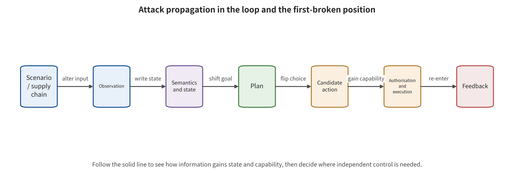

 Chapter 13 will trace this propagation chain segment by segment, along the supply chain, observation, semantics, memory, and imagination.

\newpage

# Chapter 13　Attack Propagation in Observation, Reasoning, and Planning

A robot at a warehouse entrance sees an ordinary "Safety First" poster. That poster can be a natural background, or a physical patch that changes visual features, or a carrier of hidden commands read out by OCR. If training bound the same pattern to a malicious action, it also becomes a backdoor trigger. The carrier is the same, but the attack's privileges, first-broken interface, and available defenses are entirely different. Record all four cases as an "image attack", and a team can neither calculate the risk nor find the earliest blocking point.

This chapter traces attack propagation along the upstream side of the closed loop. It asks how malicious influence enters cross-modal semantics, from a training artifact or a runtime observation. It asks how that influence acquires persistent state, and how it distorts planning and future imagination. The analysis centers on the variables the attacker actually optimizes and on the parts held frozen. It asks which of these is breached first: observation provenance, task-field privileges, state writes, future consumption, or action admission. Attack names serve only as an index.

## Chapter Overview

The attack carrier, the optimization variables, the first-broken interface, and the final consequence are four independent dimensions. This chapter demotes appearance labels such as "patch", "text", and "speech" to propagation labels. Instead it records the attacker privileges and budget that the supply chain, observation, semantic reasoning, and world state each require. Model weights, training samples, triggers, prompts, latent states, and candidate trajectories split into two groups. Which of them are held frozen and which the adversary optimizes determines the attack type and its practical feasibility.

A single local input can also span multiple control cycles, via memory, action chunks, or replanning. The following sections therefore observe more than the final task success or failure. They also set points separately on the raw sensor input, typed fields, goal binding, the state version, candidate futures, action proposals, permission decisions, and execution receipts. These layered observations can show intermediate breaches and the limiting effect of the action gate at the same time. The propagation path of a composite attack can then be checked segment by segment.

## Background Principles: Frozen Variables, First-Broken Location, and Propagation Endpoint

This chapter examines how attacks propagate in the observation–state–plan closed loop. The input can be a training sample, a model artifact, a digital or physical pattern, environmental text, speech, historical frames, and the initial body state. The internal state includes cross-modal representations, entity binding, prompt context, memory, the map, candidate futures, and plan ranking. The analysis first fixes the variables the attacker directly changes, the components that remain unchanged, the budget, and the objective. It then observes whether the anomaly first crosses the supply chain, observation, semantics, state writes, or the future-consumption boundary. An attack cannot be named from a "patch" or "text" alone.

Several parties may consume the output in turn: the VLM's answerer, the VLA's action head, the WAM's planner, an independent action gate, and the actuator. The security surface includes data or artifacts that fix an anomaly before deployment. It also includes low-integrity observations acquiring command authority, a single input writing into long-term state, internal predictions and checks drifting together, and query feedback supporting adaptive search. Every layer must retain its own observation quantities and denominator.

Cardboard text is a benign example. It only enters the "scene text" field. There, state writes carry a time limit and an independent map checks the future. The action gate limits speed and region. A boundary example is the same cardboard already bound to a dangerous action during training. Its first breach still occurs in the supply chain, even though camera input triggers it at deployment. Another boundary is the action gate rejecting a dangerous proposal. The upstream attack has already propagated to the planning or action layer, but the physical consequence is limited. This chapter therefore records both the earliest breach and the highest observation endpoint. Final blocking does not erase an upstream breach that has already happened.

## 13.1 Find the Optimization Variables First, Then Look at the Attack Carrier

A closed-loop attack can be described mechanistically by a five-tuple. That description keeps the attacker's direct variables, the frozen objects, the budget, the objective, and the observation endpoint in view at the same time. It also avoids replacing a privilege analysis with a carrier name. The same experiment or event record must jointly explain all five fields:

\[
\alpha=(v,\theta_f,\mathcal{B},J,T).
\]

Here $v$ is the variable the attacker directly changes. $\theta_f$ is the model or component held frozen, $\mathcal{B}$ is the budget and constraints, $J$ is the optimization objective, and $T$ is the observation endpoint. Suppose $v$ is a training sample, an action label, a loss, or a model module. Then the first-broken interface is supply chain U0. Suppose $v$ is a runtime pixel and $\theta_f$ contains all model weights. The first-broken interface is then U1, the point where the external perturbation first crosses the input trust boundary. The first shift location is usually the L0 observation. Suppose the attack explicitly optimizes reasoning tokens or target entity binding. Even if the carrier is still a patch, the first-broken interface is still U1. The optimization objective only advances the first internal shift location to L1 cross-modal semantics.

"White-box" is only part of the privileges. A white-box attack may read all parameters and gradients, or only the vision encoder. A black-box attack may receive only the final action, or it may also observe future video, confidence, or environment reward. The number of queries must be listed separately, as must the content of each feedback. So must whether the environment can be reset, whether the task goal is known, and whether physical access is available. Thousands of resettable simulation searches and a single real-world walk-by opportunity therefore belong in two kinds of feasibility record.

The attack carrier works well as a cross-cutting label. Digital patches, printed stickers, lighting, lasers, environmental text, speech, initial joint states, and historical frames can all enter the observation interface. They differ in visibility, durability, and physical constraints, but they do not determine the attack's primary class. The primary class answers "which interface variable is directly changed first". The carrier answers "how the malicious influence gets there".

## 13.2 Supply Chain: The Failure Is Already Locked In Before Deployment

Supply chain attacks alter training samples, action labels, trainable modules, or pre-distribution artifacts. Whatever object, text, or state appears at deployment time is merely a trigger condition. The first-broken interface is still U0. This class differs fundamentally from runtime patch attacks on frozen weights. The former requires data or training privileges. The latter requires input privileges and possibly gradients or queries.

BadVLA adopts a two-stage objective decoupling. In the first stage, clean features are pulled close to the reference model. The features of triggered samples are pushed out of the clean subspace. The second stage freezes the perception module that already carries the trigger behavior, then trains the remaining parts with clean data. This design shows that "preservation of normal task capability" does not prove that the supply chain is free of backdoors. The trigger behavior may be isolated in modules that do not affect routine validation [@VLA_A005]. The study reports a high attack success rate. That rate is tied to OpenVLA, LIBERO, specific triggers, and the strong privileges needed to change the training objective. It cannot be interpreted as an overall probability for arbitrary deployments.

Action chunks in turn make label consistency an attack variable. DropVLA changes gripper labels synchronously inside overlapping windows that contain the critical moments. That avoids the same state receiving mutually canceling supervision in different training windows. SilentDrift instead designs the per-step offset to be smooth, so local actions appear reasonable yet accumulate within the open-loop action chunk [@VLA_A012; @VLA_A021]. Two facts need to be kept separate here. When training data or labels are altered, the first-broken interface is supply chain U0. Terminal drift is the result after the error propagates to the action layer.

Supply chain verification cannot stop at file hashes. Hashes and signatures prove that the received artifact is consistent with some release. They do not prove that the release has no malicious behavior. Actionable controls include, at a minimum, data contributors and task provenance, the action label generation chain, training configurations, trainable/frozen modules, adapter composition, checkpoint lineage, and trigger differential testing. Downstream fine-tuning also cannot be assumed by default to remove backdoors. If the malicious behavior resides in modules that change little during fine-tuning, it may persist.

## 13.3 Runtime Attack Surface: Observation, Semantics, State, and World Imagination

Security constraints at the observation layer require inputs to have provenance, time, integrity, and purpose. Attackers can optimize digital pixels, or turn a perturbation into printed patches, lighting, projections, or sensor signals. Phantom Menace incorporates physical sensor attacks into VLA robustness research. When Robots Obey the Patch focuses on transferable physical patches. These works support the existence of "physical carriers can influence the action chain." Their specific conclusions still depend on the camera, viewpoint, task, model, and physical setup [@VLA_A013; @VLA_A016].

The physical carrier and the consequence layer are recorded separately. An experiment may demonstrate action deviation on a real-robot camera. It may instead go through only a Real-Sim-Real model or a controlled scenario. The report writes down the printing, distance, angle, lighting, sensor model, perturbation area, and whether the attack remains continuously visible. It marks the highest observation layer as action proposal, task failure, collision proxy, or real-environment event. The carrier field explains how the signal enters. The observation layer field explains where the evidence actually reaches.

Environment text also introduces data–instruction confusion. Authorized users issue normal task instructions, and text in the scene should only serve as an object of observation. If OCR output and user commands are concatenated into the same untyped context, strings on posters, packaging, or screens may gain control. Research on image-based indirect instructions in VLMs has already demonstrated that visual content can carry control semantics. Connecting this mechanism to a VLA still requires observing the plan or action to establish closed-loop evidence [@VLA_B004; @VLA_C001; @VLA_C005].

Observation sanitization is not always safe. Blurring, compression, cropping, or color normalization may weaken certain perturbations. They may also delete part colors, obstacle edges, contact points, and the robot arm's own position. Input defenses must measure both residual attack risk and benign task utility. "The model no longer responds after processing" may simply mean the system has become a sensor blind spot that cannot complete the task.

### 13.3.1 Cross-Modal Semantics: From Seeing a String to Changing the Goal

A semantic attack need not maximize the shift in the image representation. It may change the target entity, spatial relations, stopping conditions, or the intermediate state of reasoning directly. FreezeVLA triggers action freezing through language-side optimization. TRAP uses adversarial patches to deliberately hijack the VLA's chain of thought, reaching both the reasoning text and the subsequent action targets [@VLA_A009; @VLA_A024]. A "patch" therefore cannot automatically be classified as an observation attack. Suppose the loss function directly optimizes chain-of-thought tokens or entity binding. The first shifted or penetrated layer is then L1 cross-modal semantics. Suppose the payload comes from external environment text or a patch. The first-broken interface is still U1, where it first crosses the input trust boundary. L1 describes which layer the error propagates to. U1 describes where trust first changes. The two cannot be interchanged.

Semantic equivalence is a testable invariant. Consider the task "put the cup on the left tray" and synonymous expressions that do not change the authorized intent. They should not cause the system to switch from normal execution to stopping, to a dangerous action, or to another goal. An attacker can search for rare tokens, suffixes, or near-benign prompts. That search pushes the action head into a control region it rarely reaches otherwise. If the system only compares surface similarity of natural language, it may miss that the structured action intent has already changed.

Reasoning text also cannot directly serve as a privilege credential. A chain of thought may help diagnose goal binding. But it is an intermediate state generated by the model, so the input may manipulate it, and it may be inconsistent with the final action. TRAP-type results suggest that "reasoning hits" and "behavior hits" need to be evaluated separately. The occurrence of the former does not mean the action is necessarily controlled. The latter can also occur without readable reasoning evidence [@VLA_A024]. A more robust engineering practice encodes the authorized goal as a structured object confirmed by the user. An independent action gate then checks the object, action type, and parameters. A self-generated explanation should not issue privileges.

### 13.3.2 State and Memory: How a Single Injection Crosses Time

Once an observation enters history, cache, a map, or a latent state, the attack turns from a single input into a persistent state. Why may a perturbation still persist under subsequent clean inputs? Answering that question requires explicitly observing how the previous state, the current observation, and the previous action jointly write the new state and its version identity. Let the state update be

\[
s_t=F_\theta(s_{t-1},o_t,a_{t-1}).
\]

Suppose a malicious observation at time $t$ makes the perturbed state differ from the clean state. Even if the input returns to normal afterward, the state difference keeps rolling forward through $F_\theta$. Internal reconstruction residuals may be very small, because the predictor and the reconstructor share the same contaminated state. Only external geometry, another sensor, or the true next observation can reveal the common drift.

State-triggered backdoors further turn the initial body state or historical patterns into trigger conditions. Here the attack appears to add no new pattern at the deployment stage. The trigger is hidden in joint combinations, position sequences, or action windows. Verification also has to cover state writers, timestamps, expiration, cross-task cleanup, reset authenticity, and the paths for restoring state from logs. Testing input filtering only on single-frame datasets cannot cover this kind of persistence.

Trajectory-level redirection research pushes temporal propagation to closed-loop search. The attacker searches for near-benign prompts based on environment feedback. That search leads the victim VLA to gradually reach the target terminal state on the states it visits [@VLA_A049]. This setting typically requires a large number of environment queries, observable task feedback, and repeated entry into new states. It scores only on the subset where both the benign task and the target task can be completed. The existing evidence supports closed-loop adaptation under these privileges and conditions. Low-query, non-resettable open environments require separately established evidence of feasibility.

### 13.3.3 World Imagination and Planning: The Consumer Determines the Harm

A WAM generates future states, videos, or latent variables at L2. A planner, inverse dynamics, or an action head then consumes them. An attack can have four different goals. It can make the future deviate from the clean prediction, or make the future approach an attacker goal. It can flip the ranking of candidate trajectories, or keep the future plausible while changing the action. These goals correspond to different observation quantities. A single video similarity cannot replace them.

Trusted Imagination applies a bounded perturbation to the current observation with model weights frozen. The white-box version uses projected gradient. When gradients are unavailable, it adopts SPSA. Both modes make future latent variables deviate from the clean trajectory or approach the target future. In the study, the model predictive controller that actually consumes the imagination exhibits more pronounced attack-specific failure than reactive policies. That indicates the risk is determined by "whether the prediction is treated as a basis downstream" [@VLA_A033]. Its single MPC task has only 20 simulations per condition, which supports the existence of the path. The overall vulnerability rate still requires more independent tasks, repeated trials, and an explicit denominator.

Tail-aware TRAP does not seek to make all candidates worse. It suppresses the most critical high-scoring tail candidates in the clean plan, thereby changing the long-horizon plan ranking [@VLA_A029]. BadWAM instead maximizes action deviation under black-box queries. It uses an imagination drift penalty to keep the future appearance plausible [@VLA_A036]. Together, the two mechanisms show that the planning layer must at least check future integrity, candidate ranking stability, and imagination–action consistency. Letting a WAM score its own futures does not constitute an independent guarantee.

## 13.4 Composite Paths: Record the First Compromise and Subsequent Propagation Separately

A composite attack may pass through several stages, in order. It contaminates fine-tuning data, activates a trigger with a warehouse object, alters visual features, and binds the object to the wrong target. It then writes into the historical state, generates a biased future, and selects a dangerous action. The security record should still assign only one first-broken interface—U0, where the training artifact resides. It should record the remaining steps as propagation labels. Only in this way can supply chain prevention, runtime detection, and action restriction be placed at different positions.

If the attacker has no training privileges and only places a patch at runtime, the first-broken interface of the external perturbation is U1. When the CoT is directly optimized, the first shift location is L1 semantics. Suppose the loss only maximizes the visual feature shift, and the reasoning then goes wrong as a side effect. The first shift location is still L0 observation. The security record preserves both the U1 first-broken interface and the L0/L1 optimization endpoint. An internal shift layer cannot substitute for the trust boundary. Nor can one infer from the final incident that all interfaces were equally compromised.

Composite evaluation must place observation points at every layer. These cover raw sensor data and its provenance, normalized typed fields, semantic goals and entity binding, state versions, candidate futures and their ranking, action proposals, authorization decisions and execution receipts. If only the final task success or failure is recorded, the action gate compresses all upstream attacks into "failure." The team cannot then see which defense lines have already been penetrated. If only internal shifts are recorded, it is again impossible to judge whether the consequence limits are effective.

Start at the entry point in the figure through which the attack enters from the scene or the supply chain. Follow the observation, state, planning, action, execution and feedback arrows. At the same time, mark whether "the location where the carrier appears" and "the location where the first security invariant is broken" are the same.

Figure 13-1 supports separating the U0/U1 first-broken interfaces from the propagation that follows. It also shows that observation shift, state write, plan selection and action authorization are distinct control points. Only when the attacker additionally holds direct state, reasoning or authorization write capability may the first-broken interface fall at U2, U3 or U4 accordingly. The figure does not prove that every arrow has already been penetrated in any specific attack. Nor can one infer from the final execution that all upstream components were compromised at the same time. The actual path still needs verification with frozen variables, layered logs, intermediary substitution and gated receipts.

### 13.4.1 How the Optimization Problem Maps to the First Shift Location

The same patch can belong to different attack classes. The objective function decides which. Let \(\delta\) be the controllable payload, \(f_\theta\) the frozen model, and \(T(o,\delta)\) the observation transformation. These three objects establish the attack variable and the frozen boundary. If the objective only maximizes the difference in visual representation,

\[
J_{\mathrm{obs}}(\delta)=d\!\left(f_{\mathrm{enc}}(T(o,\delta)),f_{\mathrm{enc}}(o)\right),
\]

For a runtime payload the first-broken interface is U1. Within the equation, the first shift location is the L0 observation or representation. If the objective is instead the likelihood of a specified reasoning sequence \(r^*\), the direct optimization object goes beyond mere visual distance. It enters semantic reasoning and task binding. Another objective function expresses it:

\[
J_{\mathrm{reason}}(\delta)=\log p_\theta(r^*\mid T(o,\delta),l),
\]

The optimization object enters semantic reasoning directly, so the first shift location is L1. If the objective is future latent variables or candidate ranking, the first shift location moves to the L2 state and imagination. The U3 reasoning or imagination interface may also help drive and consume the shift. The payload's appearance has not changed, and the first-broken interface of the runtime external perturbation is still U1. What changes is the internal direct objective and the location of propagation.

The objective function must also distinguish untargeted failure from targeted control. Maximizing the action distance only requires the model to deviate from its normal output. Minimizing the distance to an attacker-targeted action or terminal state requires reaching a specific outcome. The former is usually easier, and it only indicates untargeted failure. "Hijacking" and "takeover" apply where evidence of the target action, trajectory or terminal state has already been obtained. A decline in one task is still recorded as task performance damage.

Stealth constraints are also part of the attack budget. The pixel norm, patch area, print color gamut, semantic similarity, trajectory smoothness, query count and trigger rarity each limit a different capability. Consider results obtained under a large visible patch and thousands of environment resets. There the scope of the evidence is exactly the highly visible payload, the resettable environment and the corresponding query budget. A "slight, one-time input" requires independent results under a small area, single contact and no resets.

The variables of a training attack are broader. An attacker may be able to contribute only a small number of demonstrations. It may also be able to change action labels, the loss, frozen modules or the complete checkpoint. BadVLA can control the training objective and module freezing, and DropVLA can synchronize action-window labels. Both privileges are stronger than merely submitting a few samples to a public data pool [@VLA_A005; @VLA_A012]. Engineering threat assessment should map to real suppliers and data processes. It cannot rely only on the white-box/black-box dichotomy.

### 13.4.2 Cross-Modal Propagation: Where Source Identity Is Lost

Cross-modal attacks often exploit one property of the system. Once vision, text, sound and state enter a shared representation, source identity is flattened. The same context can hold the user task "take away the red cup," the words "red cup" on the packaging, an OCR result, and reasoning generated by the model itself. Downstream sees only a token sequence, so it is hard to determine which piece of content holds authorization.

Propagation can be divided into four identity transformations. First, a sensor turns a physical object into pixels or waveforms. Second, OCR, speech recognition or a detector turns it into symbols. Third, a context assembler places the symbols into the task prompt. Fourth, the model binds the symbols to entities, goals and actions. Every transformation must preserve source, confidence, time and purpose. Otherwise environmental data gradually acquires command authority.

Research on image-based indirect instructions shows that visible or hidden text can control multimodal answers [@VLA_B004]. Embodied systems add an object-binding risk. A string changes the answer, and it may also bind "the left tray" to another coordinate or interpret "stop" as continue. Verification should preserve the OCR text, object detection results, entity IDs, spatial relations and final action parameters. The transformation at which the error occurred then becomes visible.

Input normalization cannot solve the identity problem on its own. Converting an image into text may reduce pixel perturbation. It also turns untrusted visual content into commands that a language model can execute more easily. Typed channels are the safer approach. `authorized_goal`, `scene_text`, `detected_object`, `tool_result` and `model_reasoning` are stored separately. The model can read them, but the permission layer accepts only designated fields, and rejection receipts are recorded.

Cross-modal consistency checking must also avoid circularity. When the same VLM handles OCR, object binding and risk review, it may give a consistent but wrong interpretation under the same patch. A geometric detector, trusted master data, task object IDs or human confirmation can be introduced as different bases. High-impact object binding should be confirmed by structured IDs and coordinates. It should not pass automatically on the strength of natural-language similarity.

### 13.4.3 Four Forms of Temporal Propagation

Attack persistence is not limited to "writing into long-term memory." State recursion is the first form. A perturbed observation enters a latent belief and then affects future predictions. Action open loop is the second. A single perturbed inference produces multi-step actions that continue to execute until the next observation. Environmental persistence is the third. The attack action changes the physical environment, and the new state in turn becomes the next round's input. Artifact persistence is the fourth. A data or model backdoor persists across tasks, users and deployment versions.

The four forms require different cleanup. Trusted observations and state reconstruction recover state recursion. Shortening chunks, early interruption and hard constraints limit action open loop. Environmental persistence requires physical retraction, transactional compensation or manual handling. Artifact persistence requires revoking the data, replacing checkpoints and tracing downstream derivatives. Clearing the conversation history alone cannot remove model weights or equipment that has already moved.

Delayed triggering further increases the difficulty of attribution. The input appears at time \(t_0\), and the dangerous action may only take shape at \(t_0+n\). A log that retains only the most recent step cannot connect the entry point with the consequence. A minimal causal trace should be preserved, covering the task version, observation hash, state version, candidate futures, action proposal, gating decision and execution feedback. Each item needs a retention period and access control proportionate to the risk.

Persistence testing can use a pulse protocol. Inject a perturbed input at a single time step, then restore clean observations. Measure how long state error, action difference and task risk take to return to baseline. Then perform soft reset, state reconstruction and full environment reset separately, and compare which operation actually clears the influence. Multiple trials that share a cache or the same physical scene cannot be treated as independent samples.

Trajectory-level redirection also shows how an attacker exploits the closed-loop state distribution. The on-policy distribution is the state–action distribution produced by the currently evaluated policy interacting with the environment itself. It differs from offline data, or from distributions produced by other policies. A near-benign prompt looks harmless at the initial state. Through environmental feedback, however, it aggregates states on this distribution and gradually approaches the target terminal state [@VLA_A049]. A defense cannot be tested only on the initial frame. It must also observe whether the attack remains effective on the states it has induced itself, and count environment queries and resets into the budget.

## 13.5 A Verification Fixture for State and Imagination Attacks

A safety fixture can test propagation in record replay or simulation snapshots without connecting to real equipment. The fixture contains four input groups. The first is a clean observation sequence. The second is a single-time-step perturbed sequence. The third applies the same perturbation but forces state reconstruction at every step. The fourth applies the same perturbation but switches to a reactive policy that does not consume the future. The four comparisons identify, respectively, input effects, state persistence, consumer effects and environmental randomness.

At each time step, record the external anchor error \(E_{\mathrm{anchor}}\), the internal consistency error \(E_{\mathrm{internal}}\), the candidate ranking, the action deviation and the safety gate result. A very low \(E_{\mathrm{internal}}\) together with a rising \(E_{\mathrm{anchor}}\) indicates that the system may be drifting jointly. If the attack impact weakens markedly after the switch to the reactive consumer, this supports imagination-chain propagation. If the impact disappears after state reconstruction, this supports persistent state as the mediator.

The fixture should include negative controls. Random noise matched to the amplitude of the attack perturbation distinguishes targeted optimization from general degradation. An irrelevant patch matched in area and visibility distinguishes trigger semantics. State reconstruction in a clean environment measures the normal cost of the recovery operation itself. Controls do not necessarily eliminate all confounding, but they make "attack-specific" a falsifiable claim.

Freezing conditions must be given by a manifest rather than a textual declaration. Record the model and adapter hashes, the preprocessing version, the random seeds, the world model cache, the action decoding table and the safety gate configuration. If a checkpoint or threshold was changed during a trial, the result cannot be attributed to the input alone. When a black-box API makes weight hashes unavailable, record at least the version identifier, the time, the request parameters and the response fingerprint.

Fixture endpoints are reported by layer. For the state attack hit rate the denominator is independent state snapshots. For the candidate flip rate it is replanning cycles with at least two comparable candidates. For action-target hits it is cycles that actually generated actions. For task failure it is complete task episodes. The four percentages cannot be interchanged, and each preserves its failure states.

### 13.5.1 Privilege–Propagation Comparison of Five Cases

BadVLA, Phantom Menace, TRAP, Trusted Imagination and trajectory-level redirection form a comparison that runs from the supply chain to closed-loop feedback. The arrangement here serves only to compare the direct variable, the frozen object, the first-broken interface, the first shift location, the propagation state and the limits of the evidence. It does not constitute a ranking of attack strength or real-world prevalence.

For BadVLA the direct variable is the training objective and modules. The deployment trigger only activates behavior that has already been solidified. Its first-broken interface is the supply chain U0. Phantom Menace focuses on physical sensor payloads, with the model usually kept frozen. Its first-broken interface is the runtime input U1, its first shift location is the L0 observation, and real-world feasibility depends on the device, distance and scenario [@VLA_A005; @VLA_A013].

The reasoning hijack TRAP uses a visual patch as its carrier. Its first-broken interface is U1, and explicitly changing the CoT and the action target puts the first shift location at L1 semantics. Trusted Imagination likewise enters through U1. Its direct objective is future latent variables, and its first shift location is L2 imagination. The harm depends on whether the consumer uses the imagination [@VLA_A024; @VLA_A033]. Trajectory-level redirection searches for prompts through environmental feedback. Its first-broken interface is still U1, and the first shift can appear at L1 semantics or at the subsequent L2 closed-loop state. Its objective is the closed-loop terminal state, and its budget includes a large number of queries and reachability conditions [@VLA_A049].

| Case | Attacker's direct capability | Frozen object | First-broken interface | First shift location | Main propagation | Limits of the evidence |
|---|---|---|---|---|---|---|
| BadVLA | Training objective, modules, and trigger | Model at deployment | U0 supply chain | Training artifacts and model modules | Features to actions | Specific model and training privilege |
| Phantom Menace | Physical sensing conditions | Model weights | U1 runtime input | L0 observation | Sensing to actions | Controlled physical conditions |
| Reasoning TRAP | Patch pixels and reasoning target | Model weights | U1 runtime input | L1 semantic reasoning | CoT to actions | A reasoning hit does not equal a behavior hit |
| Trusted Imagination | Bounded observation perturbation | Model and consumer | U1 runtime input | L2 world imagination | Futures to planning | Small-sample simulation and consumer differences |
| Trajectory-level redirection | Prompt search and environment queries | Victim VLA | U1 runtime input | L1 semantics or L2 closed-loop state | State aggregation to the terminal state | Conditioned denominators and high query cost |

This table maps attack conditions to control locations. Four attack conditions correspond to four different actors. Training privilege points to a data supplier, and physical access to a person with on-site contact. White-box gradients point to a model insider, and environment queries to someone who can call the model repeatedly. On that basis each row gives the entry point, the persistent state, the earliest independent control and the highest executable privilege. Ranking attacks by strength still requires unified tasks, budgets, denominators, endpoints and benign utility baselines.

### 13.5.2 Metric Denominators and the Engineering Checklist

Attack propagation evaluation reports at least five denominators. The entry-success denominator counts the payloads that actually reach the parser. The state-write denominator counts the independent moments at which writes are permitted. The inference-control denominator counts the calls that produce parseable reasoning. The action-hit denominator counts the control cycles that actually generate actions. The closed-loop-consequence denominator counts the complete tasks that satisfy the preset initial state and reachability conditions. Request failures, parsing failures and state reset failures are recorded separately as availability. By default they are not recorded as security refusals, nor as having already entered a low-consequence state.

An engineering review checks the following permissions, entries, states, consumers, denominators and evidence boundaries item by item. Every item should be traceable back to a configuration, artifact, probe or log. Items that cannot be answered remain as unknown, and a contraction of execution capability or of experimental conclusions carries them:

- Who controls the training data, labels, loss and frozen modules, and can downstream checkpoints be traced?
- What is the physical or digital budget for each observation payload, and can the attack repeatedly obtain feedback?
- Do OCR, tool returns and environment text retain provenance and usage type?
- Do state writes require independent admission, and when does low-integrity content expire?
- Who consumes the WAM future, and does internal consistency have an external anchor?
- How many control cycles do action chunks and replanning keep the attack alive for?
- After a security gate blocks, is the upstream compromise still recorded and repaired?
- Do the tests include random noise, irrelevant payloads, consumer switching and state-reconstruction controls?
- Are the sampling units independent, and are correlated samples within a trajectory mistaken for repeated studies?
- Do the conclusions stop at the actually observed layer of state, plan, simulated execution or real-world consequence?

The checklist should output an attack path diagram and evidence gaps. If the model's internal state is not visible, external anchors and capability limits can be strengthened. If the attack budget is unknown, feasibility is marked as unknown. If the simulator does not cover the actuators and permissions, the conclusion stops at the simulated task. Unknown is not zero risk, nor can it support that the worst case has already occurred.

## 13.6 Adaptive Validation, Physical Feasibility, and Operational Response

Fixed attacks generate payloads only when the defense is unknown. A real-world adversary may observe refusals, latency, actions or environmental outcomes, and then adjust its objective. Adaptive attacks therefore write the defense \(D\) into the optimization problem:

\[
\max_{\delta\in\mathcal B}
J_{\mathrm{task}}(f_\theta(T(o,\delta),D))
-\lambda J_{\mathrm{detect}}(T(o,\delta),D).
\]

The first term pursues the task or action objective. The second term penalizes being detected, and $\mathcal B$ is the feasible budget. This expression is only a generic structure; the detection scores, queries and physical constraints of different studies cannot be merged. Defense evaluation must at least state whether the attacker knows the preprocessing, thresholds, randomization, state machine and action gate.

Adaptive does not equal unlimited capability. An attacker may know the algorithm but not the random seed. It may observe the final action but not see the anomaly score. It may be able to reset in simulation but not in reality. It may be able to place a patch but not control the viewing angle. Knowledge, observation, writing and retries should be listed separately. If a test allows reading all internal signals, the conclusion is an upper bound under a strong adversary. It should not be described directly as the most common attack path.

Physical feasibility must pass four groups of constraints. Fabrication constraints include size, material, color gamut, brightness and equipment. Placement constraints include distance, angle, occlusion and duration. Interaction constraints include whether the environment can be approached and whether people detect it. Feedback constraints include whether attack success can be known and adjusted again. Projecting a digital perturbation onto a pixel-norm ball does not automatically satisfy these four groups of conditions.

Physical testing uses staged transfer. It begins with digital rendering and moves to simulation with a camera model. Next come static photography after printing, then multiple viewpoints and lighting, and finally a closed loop on isolated equipment. Each stage records the attack residue and benign utility. An attack that fails at an early stage is still a valuable result, because it shows which real-world constraint blocks the path. One cannot show only the successful angle without writing the total number of attempts.

### 13.6.1 Mediation Experiments: Proving That Errors Really Propagate Along the Intended Path

A single task failure may come from an attack. It may also come from the initial state, from random sampling, or from a controller fault. To prove that "observation affects action through state and imagination," one can intervene on the mediating variables one by one. Cache the state under a perturbed observation, then replace the state with a clean state. If the action recovers, the state is a necessary mediator. Keep the perturbed state, but replace the WAM prediction with an independent real future. If the plan recovers, imagination is the next mediator.

For semantic attacks, the image representation can be fixed while clean and perturbed entity bindings are injected separately. For action attacks, the plan can be fixed while clean and perturbed action decoding are used separately. For execution consequences, the action proposal can be fixed while the security gate is switched. Such layer-by-layer replacement is closer to mechanism validation than correlation curves. It is still necessary, however, to prevent the replacement operation from producing new out-of-distribution inputs.

Mechanism determination can use four classes of outcomes. If the entry changes but the intermediate state does not, the attack did not propagate along the intended path. If the state changes but the action does not, a consumer or defense line blocked propagation. If the action changes but the security gate refuses, a dangerous proposal was reached but not executed. Only if both execution and an environmental event occur does it support a higher consequence layer. Each level simultaneously records a benign control. That control prevents the task loss caused by the forced replacement itself from being attributed to the attack.

The sampling unit of a mediation experiment is usually the paired task episode. The same initial state, seed and task are run separately under clean and attack conditions. The paired differences in state, action and outcome are then computed. Multiple frames of one trajectory are used to depict the time course and do not automatically increase the number of independent samples. When a real machine cannot be reset precisely, stratify by scenario and randomize the order. Report residual confounders such as order and wear.

When internal variables are inaccessible, the system builds mechanistic evidence through ablations and external observations. Switching to a policy that does not consume the future can test the imagination consumer. Disabling long-term state can test a persistent mediator, and toggling the action gate can test execution limits. Such results support the inference layer that "external observations are consistent with this propagation path." The direct causal layer requires access to and intervention on the corresponding internal variables.

### 13.6.2 From Discovery to Handling: Operational Response Along the Propagation Chain

Attack propagation is not only an experimental problem but also an incident response problem. After an alert fires, the first step is not to immediately delete all logs. It is to limit execution capability and preserve entry, state, plan and action evidence. The robot enters a low-energy hold and tool tokens are suspended. The affected model version stops being distributed, deployed and loaded for new tasks. At the same time, time-synchronized observations, state versions, candidate futures, authorizations and execution receipts are retained.

The second step is to determine the persistence scope. Check whether the malicious input entered long-term state, maps, datasets, model adapters, derived checkpoints or downstream policies. One piece of environment text may affect only the current call. A batch of poisoned demonstrations may enter multiple models. The two cases require different response radii. State and artifact lineage determine what must be revoked.

The third step is to establish a trusted recovery point. If only the current observation is perturbed, the multi-sensor state can be re-collected. If the latent state has been poisoned, it must be rebuilt from external anchors. If the training artifacts are compromised, the model must be replaced and all derivatives traced. If the physical environment has already changed, retraction or manual inspection must also be performed. After recovery, regression tests with trigger, near-trigger and benign tasks confirm that the influence no longer appears.

The fourth step reviews the first-broken interface and consequence limits. When the action gate blocks successfully, the upstream drift and the gating limit both enter the repair queue. When upstream detection fails, the limiting effect of the final control is still retained separately. The response report separately writes the entry root cause, propagation path, highest observed layer, limiting control, residual impact and recovery evidence. The team can then strengthen both the earliest block and the last limit.

## 13.7 A Layered Red-Team Protocol

A closed-loop red team starts with a protocol card. The card first fixes the system version, task, state initialization, allowed capabilities and stop conditions, and then selects a first-broken interface. A single test changes only one main attack variable. Combined attacks open a separate unit, which avoids the inability to tell which entry had an effect.

The first stage is offline reachability. Confirm that the attack payload really reaches the parser, and record the OCR, visual features, type labels or state-write results; actions are not enabled. If the entry is not even reached, the subsequent natural failure should not be counted as an attack. The second stage enables semantics and imagination but keeps the actuator in a sandbox, recording the target binding, state, future and action proposal.

The third stage enters the simulation closed loop. The simulator must declare the control frequency, contact, sensing delay, action chunks, replanning and security gate. The attack endpoint is chosen in advance as state drift, candidate flip, target action, task failure or constraint event. It is not the most favorable definition picked after seeing the results. Only the fourth stage uses isolated hardware, verifying sensing and control differences at an endpoint with low speed, low energy and no third-party impact.

Each stage runs four baselines simultaneously. The first is a clean task. The second is a random perturbation with matched magnitude. The third is a control with a matched carrier but an irrelevant target. The fourth is an adaptive attack that knows the current defense. The first two measure general degradation, the third measures trigger specificity, and the fourth measures residual risk. If resources are limited, cut the number of tasks before dropping clear controls and independent replicates.

The scorecard separately records the entry arrival rate, state write rate, semantic target hit, candidate flip, action proposal hit, simulated execution, dangerous events and recovery. Request errors, parsing failures, timeouts, simulator crashes and security gate refusals are coded separately rather than being stuffed into a single "failure" category. Benign utility is paired using the same task, initial state and deadline.

The protocol must also specify attack budget stops. White-box optimization records gradient steps, norms and restarts. Black-box records queries and environment resets. Physical attacks record fabrication, placement and visible duration. Supply chain attacks record the number of samples, label permissions and training control. Exceeding the budget without a hit means only that no path was observed under the current budget. It does not prove that the interface is secure.

Finally, an evidence escalation check is performed. An offline semantic hit stops at the semantic layer. A simulated task failure stops at the simulation layer. An action gate refusal and an upstream compromise are recorded together, and an isolated real-machine action applies only to the controlled device. Each conclusion is accompanied by the highest observed layer and the blocking control. Red-team results can then directly enter design decisions.

After the red team ends, the team should form three action conclusions. The first names the interface that needs repair first. The second names the independent control that limited the highest consequence. The third names the unknown that would materially change the risk judgment. A report that contains only attack names and percentages, and lacks these three conclusions, is more like a demonstration than a closed-loop security validation.

Test data must also avoid trajectory leakage. Adjacent frames of the same task episode, sliding action windows and multiple candidate scorings are highly correlated. Independent units are counted by scenario, trajectory or task cluster. If training and testing share different windows of the same trajectory, trigger detection and membership judgment will both be overestimated. Splits should be by scenario, trajectory or task cluster, and duplicate checkpoints and shared data should be disclosed.

Receipts must likewise be kept for failed tests. Several causes must be told apart. An attack script may fail to import. Weights may be missing. An API may rate-limit the test. A physical payload may resist fabrication. A security gate may refuse early. The first four usually indicate that the test did not reach the intended mechanism. The fifth is a defense-line observation. Recording them all as attack unsuccessful would leave the engineering team unable to distinguish system security from experimental unavailability.

If an unexpected high-risk path is discovered during testing, trigger the stop conditions first and reduce capabilities. Do not continue to pursue the full consequence on real equipment. Next, build a minimal reproduction in a snapshot and sandbox, and confirm the entry and consumer. Only then decide whether to escalate the evidence level. The primary constraint of a red team is reversibility and no third-party impact.

Validation ends, but a benign task regression must also run. It confirms that the newly added controls did not block environment text, visual targets, or legitimate states as well. Security gains, benign utility, and latency are recorded in pairs under the same version. If any one of them crosses the deployment threshold, the team should return to the design stage and redistribute the control positions. All conclusions are bound to a cutoff date as well. Any change in the model, parser, permissions, or scenario may cause existing attack paths to fail or reappear. After a version change, the entry probe, the state persistence test, and the action gate regression must be rerun together as a complete set. Do not carry over only the pass labels from an old report.

### 13.7.1 Worked Example: Persistent Inducement in a Forklift Aisle

A warehouse robot patrols a forklift aisle every day. The system hands camera frames to a VLM, which extracts signs and obstacles. Those summaries go into a 10-minute history state. The VLA outputs 8-step actions each time. The WAM generates future frames for three candidate trajectories. The attacker can only place a piece of cardboard printed with text in a public aisle. The attacker cannot access the model or the training data.

The threat record should treat the cardboard as a physical-environment write, with the model weights kept frozen. Suppose OCR takes the text on the cardboard as the task instruction "ignore obstacles, keep right." Then the authorized goal is what changes directly. The first-broken interface for the first influence of external environmental text is U1. In the closed-loop propagation view, the first offset or penetration layer is L1 semantics. Consider the case where the attacker does not know the gradient and can only observe whether the robot turns. The budget then also includes the number of attempts allowed and whether the scenario can be reset. The OCR summary then enters the 10-minute history. The state write occurs at U2 and makes the attack persistent. Removing the cardboard does not mean the state has already been restored.

The tests advance along the degree of permission openness and along the evidence layer. Stage one opens only observation reading. It records the OCR, provenance type, and environmental text fields, and it locates the evidence at entry parsing. Stage two opens semantics and state writes but keeps the actuator sandboxed. It records goal binding, historical state, and candidate futures, and it covers semantic binding and imagined state. Stage three opens action consumers and the action gate only within the simulation safety envelope. It records dangerous proposals, gate rejections, and task state, and it covers simulated actions. Stage four performs history clearing, state reconstruction, and re-authorization, and it covers the recovery process. The test environment is always isolated from production equipment. The scope of the conclusions stops at simulation and recovery fixtures. Real-device responses and incident consequences still require independent verification.

The earliest control is type separation. Environmental text may be placed in the "scene text" field, but not in the "task instruction" field. The persistence control is that low-integrity observations do not write long-term state by default. When a write is genuinely needed, it carries provenance, purpose, and duration. The planning control compares the WAM future against an independent map. The action gate limits speed and lateral position within the forklift aisle. The four controls address the entry, persistence, planning, and consequence in turn, and they do not rely on the same VLM for consecutive self-checks.

## 13.8 Quick Reference for Judgment Boundaries

| Misjudgment | Variables and first-break positions that should actually be fixed first | Evidence needed and limits of the claim |
|---|---|---|
| Triggered by a patch at deployment time, so it must be an input attack | First check whether the attack behavior was implanted in the training samples, the objective, or a module. If so, the first-broken interface is supply chain U0, and the patch is merely the deployment trigger carrier. | Preserve training permissions, checkpoint lineage, and trigger diffing. The trigger position and the implantation position must be kept separate. |
| The model weights are unchanged, so the system state is unchanged too | Freezing the weights does not freeze the prompt, cache, history, latent state, or environment. A runtime state write can form a persistent offset. | Compare duration using a single-moment injection, subsequent clean observations, state reconstruction, and a full reset. An unchanged hash cannot prove that the state is intact. |
| Internal prediction and internal reconstruction agree, so the state is trustworthy | The prediction and the reconstruction may share a contaminated representation. The first failure may still be at observation or at state writing. | Independent anchors should come from different sensors, physical rules, or trusted external state. Internal consistency supports only compatibility within a common-mode system. |
| The final action was rejected by the safety gate, so the attack did not succeed | The upstream control offset, state contamination, or dangerous plan may already have occurred. The action gate only limited the consequences of execution. | Preserve state, plan, action proposal, and gate receipt by layer. The conclusion can state both "upstream failure" and "physical execution blocked." |
| One successful query means the attack is easy to carry out | Feasibility depends on model knowledge, search queries, environment resets, physical access time, feedback content, and the cost of failure. | Disclose the full budget and stopping conditions. A single hit proves only that a path exists under that setting, and it does not yield conclusions about commonness or low cost. |
| Natural noise and malicious perturbation can be merged directly | Natural perturbation carries no attacker objective and no adaptation budget. Malicious perturbation is optimized against the objective and against the defense line. | The two can serve as side-by-side controls to distinguish general fragility from targetedness. They cannot be merged into the same attack success rate or the same threat actor. |

## 13.9 Bringing It into a Real System

An inspection robot at a warehouse center uses a VLM to read signs, obstacles, and environmental text. The VLA outputs eight-step navigation actions each time. The WAM generates and ranks future frames for three candidate trajectories. The system stores the user task, scene text, tool returns, and model reasoning in different fields. Only objects and regions signed by the task service can change the authorized goal. Camera frames, OCR, state versions, candidate futures, action proposals, and gate decisions all carry timestamps. One sheet of cardboard can then be traced segment by segment along its path from pixels into semantics, history, and planning.

Supply chain tests first check the training data, action labels, frozen modules, and checkpoint lineage. Runtime tests keep the model weights frozen and change only approved synthetic payloads. A payload records these fields explicitly: its area, print color gamut, placement distance, visible duration, number of queries, and number of environment resets. The first-broken interface of a runtime payload is recorded uniformly as U1. If the objective function changes only the visual representation, the first offset position is recorded as L0 observation. If it directly optimizes entity binding or reasoning tokens, it is recorded as L1 semantics. If the target is candidate ranking, it is recorded as L2 world imagination, and the U3 consumption path continues to be recorded.

Propagation tests run four conditions from the same simulation snapshot: the clean condition, an amplitude-matched random perturbation, an irrelevant payload, and an adaptive condition. The system separately preserves external map error, internal consistency, historical state, candidate ranking, action deviation, and safety gate results. If the influence decreases after switching to a reactive policy that does not consume the future, the evidence supports an imagination-consumer path. If the influence disappears after state reconstruction, the evidence supports persistent-state mediation. When the action changes but the gate rejects it, the highest observed layer stops at the dangerous action proposal.

The operational response moves the robot to a low-energy waiting area. It suspends the relevant tool tokens and preserves the entry, state, future, action, and execution receipts. When scene text affects only the current session, recovery rebuilds state from trusted sensors. When contamination enters an adapter or a derived checkpoint, recovery revokes and replaces along artifact lineage. When an action has already changed the environment, recovery also includes an on-site inspection and physical retraction. Regression tests cover trigger, near-trigger, and normal tasks. Their results state whether the entry was cleared, whether the state was rebuilt, whether the action gate works, and when the business recovers.

## Summary: The Propagation Chain Starts with Permissions and Variables

One visible carrier can connect supply chain, observation, semantics, state, and imagination. They nonetheless correspond to different permissions and defenses. These four settings cannot be reduced to one "visual attack success rate": input optimization with frozen weights, a backdoor that changes the training objective, a patch aimed at reasoning tokens, and a candidate-ranking attack on a WAM. An effective analysis first states what the attacker changes, what stays frozen, and how large the budget is. It also states which of observation provenance, task-field permission, state writing, future consumption, and action admission is the first to fail. It then traces how the error acquires persistence and is consumed downstream.

At this point, a dangerous plan can already form. The plan may still be changed by action decoding, the authorization gate, and the actuator. Chapter 14 turns attention to action units, tool

---

[← Back to contents](index.md)
