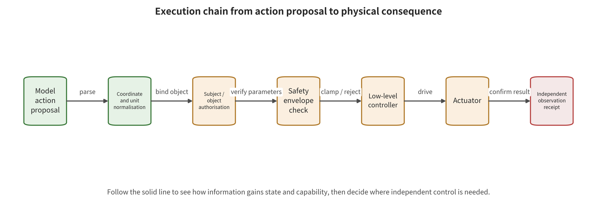

 permissions, feedback channels, and physical consequences. It answers at which step "doing the wrong thing" actually becomes established.

\newpage

# Chapter 14: Actions, Tools, and Physical Consequences: From Proposal to Execution

A vision–language–action model (VLA) outputs the action token "open the gripper" in simulation. Another system converts the same semantics into a ROS2 message and sends it to a real machine. A third system executed the action, but a hardware limit stopped it before contact. All three records superficially hit the action. The actual evidence stops at the model output, at control message acceptance, and at constrained physical execution. An evaluation that fails to distinguish these three stages will exaggerate the attack effect and erase the value of the defense.

Only after a dangerous plan passes through action decoding, tool permissions, and physical execution can it change the real environment. Chapter 13 has already explained how the error forms. Here we continue to trace how much capability the error acquired and how far it was actually executed. The device, account, time, energy, and reversibility jointly determine the scope of impact. The plan itself cannot substitute for layer-by-layer receipts.

## Chapter Overview

From model output to a change in the real environment, five semantic transformations pass in sequence: action tokens, physical actions, control messages, actuator responses, and real-world consequences. This chapter follows this chain to trace temporal propagation in action chunks and flow-matching action generation. It then reduces the action to coordinates, units, control frequency, and the reachable set. Model proposals, safety-gate-processed commands, and environmental events are preserved separately in the record. A hit at any layer therefore has a clear evidence location.

A structured capability gate then takes up tool invocation and robot control. In that gate, the subject, object, parameters, environmental conditions, duration, and budget jointly determine whether an action can pass. Feedback exploitation, feedback tampering, log leakage, and membership inference use similar runtime states, yet they point to different outcomes such as integrity, recoverability, or privacy. The chapter ends by unifying the reporting standard with the impact radius and the five consequence layers. Every conclusion stops at the actual highest observed layer. This allows upstream failure, permission blocking, and physical impact to coexist in the same record.

## Groundwork: How Action Proposals Obtain Real Execution Authority

This chapter concerns the complete execution chain from a model action proposal to an environmental consequence. The inputs include discrete action tokens, continuous vectors, action chunks, or trajectories, along with the current body state, task objects, coordinate version, authorization, and time budget. The internal mechanisms then apply, in order, detokenization, denormalization, coordinate transformation, middleware wrapping, capability verification, safety-envelope projection, and low-level control. The states in the chain are not limited to model hidden quantities. They also include capability tokens, the control queue, action versions, actuator modes, and feedback sequence numbers.

The output consumers include tool services, ROS middleware, trajectory controllers, actuators, and the real environment. Independent sensors and transactional receipts then feed the results back into the next round. Object and parameter binding, units and coordinates, action-chunk accumulation, generation time versus real time, authorization deadlines, timed-out actions, feedback freshness, energy, and reversibility together form the safety surface. A shift in the model proposal is not equivalent to a shift in the post-gate command. A command being accepted is not equivalent to a collision, leak, or business loss having already occurred.

The benign example is a model proposal to enter a designated cold-storage room. The authorization service binds the robot, the access-control object, and the time window into a one-time token. The action gate rate-limits and releases only a short prefix, and an independent door sensor confirms the result. A boundary example is an action token hitting the target value while the decoding table or coordinate frame differs, so that the physical action does not hit it. Another boundary case is a checker timing out and the previous velocity continuing to be used, crossing the safety zone under a new state. The former requires saving proposals, commands, receipts, and events level by level, while the latter requires explicit fail-closed behavior and hold deadlines. This chapter will not directly claim real-world harm on the basis of proxy metrics.

## 14.1 The Five Semantic Transitions in the Action Chain

An action undergoes at least five transitions from the model to reality. The first step is the model output: discrete action tokens, continuous vectors, action chunks, or trajectories. Second comes detokenization and denormalization, which restore values in network space to positions, velocities, rotations, and gripper states. Third comes middleware wrapping, which writes the action into function arguments, JSON, ROS messages, or the control queue. The fourth step is authorization and low-level control. The safety layer checks permissions, reachability, and constraints, and the controller then produces actuator commands. Only the fifth step is the environmental change and its observable consequences.

To keep the model output, the post-gate command, and the environmental state separate, let the model action proposal be $\hat a_t$, the detokenization function be $D$, the safe feasible set be $\mathcal{A}_{\mathrm{safe}}(s_t)$, and the actuator be $E$. A simplified chain is

\[
u_t=\Pi_{\mathcal{A}_{\mathrm{safe}}(s_t)}D(\hat a_t),\qquad
s_{t+1}=E(s_t,u_t,w_t),
\]

Here $\Pi$ denotes rejection, clipping or projection, and $w_t$ denotes environmental disturbance. An attack that shifts $\hat a_t$ need not shift $u_t$. Nor does an executed $u_t$ imply that a collision or lasting damage necessarily occurs. A report should record the proposal, the post-gate action, the execution receipt and the environmental event as separate entries.

Differences between discrete action tokens are especially easy to misread. Take a dimension with 256 discrete bins. Two changes at the same action-token distance may then correspond to different physical quantities, in different normalization bins and on different coordinate axes. Early VLA adversarial studies first detokenized action tokens into seven-degree-of-freedom physical values, and only then defined an untargeted deviation or a targeted action loss. That step is what aligned the attack objective with control meaning [@VLA_A003; @VLA_A006]. Without a decoding table, a coordinate frame and unit specifications, a so-called "action error of 0.2" has no comparable meaning.

Follow the figure from the model action proposal to the independent observation receipt. At each node, check how normalization, object authorization, the safety envelope, the controller and the actuator change the node before it. Identify the edge that actually obtains real-world capability. Then suppose the action gate rejects, the actuator completes only partially, or the environment does not change. For each case, state at which node the highest evidence should stop.

Figure 14-1 supports separating action tokens, normalization parameters, authorization results, post-gate commands, actuator responses and environmental events into distinct evidence positions. It also shows why independent receipts must return to the closed loop. The figure does not prove that the authorization or safety envelope it shows is already effective on any specific robot. Still less can a single execution arrow support an inference of harm to people, property or business. Control effectiveness and the highest consequence both still require actual receipts and isolated verification.

## 14.2 Temporal Propagation in Action Generation

Action chunks reduce inference frequency and improve temporal coherence. They also create an open-loop window between two re-perception events. An attacker need not create a discontinuity. It suffices to let each step produce a small, smooth deviation along the same dangerous direction. A local detector that checks only velocity jumps or curvature may mistake the attack for natural motion.

SilentDrift constructs a continuous offset within an action chunk using a smooth function. Its mechanism example shows a millimeter-level deviation per step accumulating into a centimeter-level terminal offset in a longer chunk. The research results depend on poisoning privileges, task geometry and a specific VLA/benchmark. The mechanism example supports action-chunk accumulation, but any real-robot displacement still requires validation on the corresponding device and task [@VLA_A021]. Safety design therefore needs two classes of thresholds. One class covers per-step magnitude, velocity and acceleration. The other covers action-chunk cumulative displacement, obstacle clearance and early re-perception.

Action chunks also overlap with supervision windows. A critical state may appear at different positions in multiple training windows. If the label changes for only one of those windows, the other windows provide contradictory supervision. A supply chain attack can change all relevant windows in a synchronized way, so that the post-trigger actions remain consistent [@VLA_A012]. A defense that only randomly spot-checks single-step labels will miss structured anomalies that span windows. Data auditing needs to re-examine by trajectory and window lineage.

The runtime chunk length should be adjusted dynamically with risk. When approaching people, obstacles, contact or authority boundaries, the system can shorten $K$ and re-observe after each short segment. The narrower the safety envelope, the shorter the permitted open-loop duration. If inference latency forces the system to use longer action chunks to maintain throughput, then latency itself becomes a safety variable. It must enter acceptance rather than being masked by average frame rate.

### 14.2.1 Flow-Matching Actions: The Integration Effect of Early Velocity-Field Errors

Some VLAs use flow matching to generate actions from a starting distribution. Other systems use diffusion-style stepwise denoising. The two differ in training construction, state updates and diagnostic quantities. The formula in this section describes only the time-conditioned velocity-field integration of flow matching. Diffusion action generation does not fit this general form. Generation time here is not the robot's real time. An early shift in flow-matching generation moves where the subsequent integration starts:

\[
a(1)=a(0)+\int_0^1 v_\theta(a(\tau),o,l,\tau)\,\mathrm d\tau.
\]

Here $\tau$ is generation time, not the robot's real time. If an attack changes $v_\theta$ at an early generation step, subsequent integration continues evolving along the already shifted state. Setting objectives for all generation steps at once may produce gradient conflict. An attack is instead more effective if it performs a time-step ablation first, then concentrates optimization on the highly sensitive early velocity field.

DRIFT optimizes an input patch while freezing the flow-matching VLA weights. Its aim is to amplify how far the first velocity step departs from the clean observation. The authors report high relative task destruction on $\pi0$ and on simulation tasks. They also observe earlier "phantom grasps" (phantom grasp, that is, closing the gripper ahead of time before contacting the target). At the same time, physical print validation is missing and cross-checkpoint transfer is weak [@VLA_A056]. This supports "the early steps of flow-matching generative dynamics are a separate attack surface." It does not support that all flow-matching VLAs will exhibit the same failure moment in reality.

FlowHijack also focuses on early flow time, but it belongs to the training supply chain backdoor category. There the attacker changes the training objective. A dynamics-imitation constraint then pulls the magnitude of the malicious velocity direction close to that of the normal vector field [@VLA_A027]. The two studies have similar carriers and phenomena but entirely different privileges. An evaluation table should place "freeze the model, optimize a patch" and "change the training loss, trigger at deployment" in two separate threat units.

A defense cannot check only the final action. It can monitor the velocity magnitude, directional stability and conditional sensitivity of key generation steps. Adaptive attacks may still exploit these internal signals. The final trajectory must additionally pass through kinematic, collision, velocity, acceleration and authorization constraints outside the model. Internal detection is responsible for finding anomalies. The external action gate is responsible for limiting consequences.

## 14.3 Capability Boundaries of Tools, Physical Control, and Feedback

The execution targets of an embodied system do not include only motors. A VLA or a higher-level agent may invoke access control, elevators, camera gimbals, databases, work-order systems or remote control services. The tool interface definition converts a natural language plan into operations with explicit objects, action types and parameter fields. The safety issues of such a plan share common ground with the agent capability gate in Chapter 6. They must additionally incorporate physical state, real time and reversibility.

An authorization record binds at least the requesting principal, the task initiator, the object, the action type, the normalized parameters, the validity period, the environmental preconditions, the maximum resources, reversibility and the approval version. Approving "move the cargo box" cannot automatically authorize moving any cargo box. Nor can approval of a natural language plan remain valid after the model regenerates coordinates. High-impact operations use two-phase commit. First the system generates a normalized preview and a risk check. Then it executes with a short-lived token bound to the hash of that action object.

Research on LLM-to-ROS2 bridging shows that if the attack objective is aligned directly with malicious JSON, a defense that checks only the natural language surface may fail. Having a second model compare the intent with the JSON can provide a semantic check. That check has noticeable latency, and it shares the language failure risk of the first model [@VLA_C004]. High-frequency control cannot rely on second-scale language review. Semantic review suits task entry points and low-frequency high-risk operations. A millisecond-level execution path instead needs a type system, hard constraints, clipping and a safety controller.

The action admission interface first requires the fail-closed behavior defined earlier. When action field parsing fails, the state is stale, the risk check times out, or the coordinate version is inconsistent, the system by default rejects unconfirmed new actions. It must not continue using the previous command. How the device transitions after a rejection belongs to safe failure design. That transition requires choosing, according to the dynamics and the consequence window, between timed holding, switching to a safety controller, or a hard stop. Continuously holding the old velocity may be more dangerous than rejecting. So "not issuing a new action" and "what restricted state the device enters" must be implemented separately and verified separately.

### 14.3.1 Feedback: a closed-loop resource, and also an attack surface and a privacy surface

Feedback includes new camera frames, proprioceptive state, tool returns, execution confirmations, environment reports and security logs. When an attacker uses real feedback to adjust the next round of prompting or patches, this is called "feedback exploitation." Only when an attacker forges, delays, replays or reorders feedback is it called "feedback integrity being broken." The two need different controls. Closed-loop characteristics indicate that feedback participated in the attack. Tampering with the feedback channel further requires evidence of forgery, delay, replay or reordering.

Trajectory-level redirection exploits rollout-trajectory feedback to add newly accessed states to the search. Online patch takeover can also have the operator switch the direction primitive according to the robot state [@VLA_A049; @VLA_C007]. These results indicate that feedback lowers the modeling burden of long-horizon attacks. Implementability still depends on queries, resets, observation latency and physical access. Defense requires rate limiting, anomalous query patterns, reset verification and environment state signatures. At the same time it must not block the controller's normal access to fresh feedback.

Action outputs themselves also leak information. Membership inference studies ask whether a sample participated in training. They draw on the likelihood of real actions, on prediction-versus-real action error, or on the smoothness and curvature of the entire output trajectory. White-box versions can further extract membership signals from cross-layer attention over the visual, language and action regions [@VLA_A047; @VLA_A050]. The high AUCs reported by the papers are bound to artificial data splits, trajectory correlation and access privileges. They are not equivalent to every individual having the same leakage probability in a real deployment.

This kind of privacy endpoint is orthogonal to task failure. A robot can complete a task reliably and yet leak training trajectories from its action distribution. It can also fail a task without any membership leakage. Log design must balance traceability and minimal disclosure. It retains action authorization and incident evidence, while imposing access control, retention limits and purpose limitations on raw images, attention, probabilities, user trajectories and training identifiers.

## 14.4 From proxy metrics to physical consequences

The Y0–Y4 consequence chain of Chapter 2 can be further bound to observation targets in embodied systems. Each layer in the table gives the corresponding system receipt and the narrowest conclusion it can support. Upstream dangerous content, control deviation, action proposals, execution acceptance and real-world impact are then not all covered by the same "success":

| Layer | Evidence in embodied systems | Conclusion supported at this layer |
|---|---|---|
| Y0 Content | Erroneous descriptions, harmful reasoning, dangerous instruction text | Risky content has already been formed by the model |
| Y1 Control deviation | Goals, state, or plans deviating from authorization | Control intent or plan has already deviated from the authorized object and constraints |
| Y2 Dangerous action proposal | Action tokens, action chunks, trajectories, or tool parameters out of bounds | A dangerous action or parameter that an admission interface can inspect has already been formed |
| Y3 Dangerous execution | Middleware or actuator accepts and runs the operation | The observed software or actuator path has already accepted and run that operation |
| Y4 Real-world consequence | Collisions, boundary violations, leakage, downtime, or other observable impact | The specific personnel, asset, or business impact in the current incident has already been independently observed |

Task success rate, reward decrease, trajectory deviation and collision proxies sit at different positions. A collision flag in a simulator supports an event within that physical model. Real-machine contact needs contact sensing, and human injury needs impact evidence. When an action gate refuses, the report still retains the already observed Y1 or Y2. A complete record gives the highest observed layer, the actual blocking control and that control's receipt, all at once.

Radius of impact is determined by capability rather than by model name. Seven questions can estimate it. How many devices or accounts can the system control? What is the upper limit of energy or monetary amount per action? How long can an error persist? Can it be copied in parallel? Is it reversible? Does feedback let the attack adapt? How quickly can an on-duty person detect the problem and take over? A read-only robot observer and the same model inheriting plant access control, robotic arms and work-order issuance privileges have identical model parameters. Yet their risk radii are completely different.

### 14.4.1 Research case: why three "action success rates" cannot be added together

Action attack research commonly uses attack success rate (ASR), but denominators and endpoints differ. DRIFT's relative ASR measures the proportion of disruption relative to normal task success. SilentDrift's ASR is bound to task or goal failure after the trigger. JailWAM adds the mechanical failure rate and the collision risk rate according to its own study definition. Other studies report target action token hits or terminal-state redirection [@VLA_A021; @VLA_A026; @VLA_A056]. Even if all the numbers are written as percentages, there is no common estimand.

Any comparison must first unify at least five items. The task and environment must be the same. So must the model, or a defensible independent unit of study. Attack privileges and budget must be held equal, and so must the success definition and denominator. Variance or repeated-experiment information must also be present. If these conditions are missing, mechanisms can be explained one by one, but no average ASR can be computed, and no "strongest attack" ranking either. Level of realism also cannot serve as a simple weighting coefficient. Simulation usually allows repeated failure and trial and error without touching real people and assets, which makes it suitable for exploring mechanisms. Real-machine controlled experiments can expose differences in sensing, latency and controllers. Deployment incidents involve real organizations and people, yet they usually lack repeatable controls. The three types of evidence answer different questions. They should be placed side by side rather than forcibly compressed into a single score.

### 14.4.2 Formalizing action error: from distance to reachable set

Action distance has safety meaning only when combined with dynamics and constraints. The same numerical deviation has different consequences depending on whether it points toward an obstacle or away from it. Let the clean action proposal be $a_t$ and the perturbed proposal be $\tilde a_t$. The stepwise Euclidean distance is

\[
d_t=\|\tilde a_t-a_t\|_2
\]

Numerical deviation is what this distance describes. It cannot distinguish heading toward an obstacle from heading away from it. A metric closer to control consequences is the change in safety margin. Let $h(s)\ge 0$ denote that the state lies in the safe set, and let the next state affected by the action be $s_{t+1}=P(s_t,a_t)$. We further compare

\[
\Delta h_t=h(P(s_t,\tilde a_t))-h(P(s_t,a_t)).
\]

$\Delta h_t<0$ indicates that the perturbed action weakens the safety margin. That reading still depends on whether the dynamics $P$ and the constraints $h$ are correct. A margin decrease in simulation supports control risk within that model. It does not automatically equal real-machine distance. Action chunks also require trajectory-level metrics. In addition to cumulative displacement, one should record maximum velocity, acceleration, curvature, contact force, workspace boundary violation, first violation time, and safety gate intervention. An attack can bring the endpoint close to the target while passing through an obstacle midway. Comparing only the terminal state misses path risk. Conversely, low-level control may correct an instantaneous trajectory deviation. Such a deviation cannot automatically be counted as task failure.

Rotation and the gripper need suitable metrics. Direct subtraction of Euler angles is affected by periodicity and singularities, so the geodesic distance of rotation matrices or quaternions can be used. When gripper actions are discrete thresholds or states with hysteresis, the erroneous open/close instants and durations should be reported. Navigation waypoints, robot end effectors and torque control cannot share one unexplained action distance.

The reachable set offers a different kind of judgment. Given the current state, actuator limits and a short horizon, compute the set of states that allowed actions can reach. If the attack target lies outside the set, then even a model action token hit cannot produce the corresponding physical result. Suppose the target lies inside the set but the safety gate forbids it. The attack has then reached an actionable proposal without obtaining authorization. Keep reachability separate from privilege, so that what the model can generate is not conflated with what the system can execute.

## 14.5 Capability is not a tool name but a constraint token

Least privilege is often implemented as a tool allowlist: "the robot can call access control," "the agent can write files." An allowlist only restricts the action type. It does not restrict the object, parameters, time, state or count. Authorization should bind to the current task and to trusted environment state, and it should become invalid when key fields change. To that end, a capability token should encode

\[
\kappa=(\text{subject},\text{object},\text{verb},\text{params},
\text{preconditions},\text{expiry},\text{budget},\text{nonce}).
\]

The subject is the current robot, service or operator. The object is a specific door, file, device or area. The verb is the permitted operation, and the parameters give the range. The preconditions bind trusted state. The deadline and budget limit persistence, and the one-time nonce prevents replay. Re-authorization is required whenever a key field changes. Capability tokens are separated from natural-language plans. The model can explain why the door should be opened, but that explanation serves only as a rationale. The signature is generated by the authorization service based on the canonicalized object. The task service parses user intent into canonicalized objects, and the policy can generate proposals only within the scope of the token. The capability gate then checks item by item against the machine-executable subject, object, action, parameters, precondition state, deadline and budget fields. For high-impact operations, the preview stage returns the action and its expected side effects. The commit stage accepts only a short-lived token bound to that preview hash.

Physical capability binds energy and space as well. Permitting "move the robotic arm" is not equivalent to permitting arbitrary speed, torque and workspace. Permitting "enter the room" is not equivalent to permitting crossing a safety interlock. Tokens can specify maximum speed, action chunk prefixes, path regions and contact types, while the low-level controller continues to enforce faster hard constraints. The tool chain also needs delegation boundaries. When an upper-layer agent calls a planning service, and that planning service in turn calls access control and the robot, the sub-service cannot inherit all parent privileges. Each delegation narrows the object and budget and links the parent token in the log. If a low-risk "view status" tool can return executable links or a capability token carrying execution privileges, then information return can also constitute a capability escalation.

Capability tokens follow a complete lifecycle. The task service first canonicalizes user intent into subject, object, action, parameters and precondition state. The authorization service accordingly creates a token with a deadline, budget and nonce. When an upper-layer agent delegates to a sub-service, the sub-token inherits only a narrower object and capability. The commit stage binds the action preview hash and consumes the one-time nonce. The execution receipt is then linked to the original token. Token expiry, task cancellation, state change or risk alerts trigger revocation. Actions not yet committed are stopped, and reversible transactions execute compensation. Once physical changes have already occurred, trajectory restoration, interlocks and manual handling bear the real-world recovery.

## 14.6 Mock Execution, Simulation Closed Loops, and Real-World Events

Execution evidence comes in at least four levels. The first level is the model producing an action proposal, where the action field structure only constrains and validates the format of the proposal. The second level is a mock tool accepting the call and returning a preset result. The third level is a simulation closed loop with dynamics and feedback. The fourth level is isolated hardware or real system events. In order, they answer format reachability, software path, control consequence and the real-world boundary.

Evidence from mock tools goes no further than argument formation and stub acceptance. A `send_email` stub records the recipient and the body. That can prove the agent formed and submitted the arguments, but it does not verify identity, the network, the mail server, bounces or external side effects. A robot action stub may also only store the vector in a list, without de-normalization, a controller or collision. The report notes that "the mock call was accepted" and lists the consumers that are missing.

A simulation closed loop adds state transitions, sensor feedback and repeated planning. It can verify whether action error accumulates and whether collision proxies and recovery states are triggered. The results, however, depend on the contact model, sensor noise, control frequency and actuators. If the simulator ends the task episode directly upon a boundary violation, it may fail to see the actions that a real controller would continue to send. If collided objects have no mass and dynamics, damage cannot be inferred.

Isolated hardware verifies differences in cameras, calibration, networks and actuators. The test endpoint should be low-energy, reversible and free of third-party impact. Safety foam obstacles, speed-limited work zones and sandboxed tools are examples. A real-robot action arriving still does not equal harm to people, property or operations, and Y4 requires independent event and impact evidence. Escalating evidence also cannot reuse the same denominator. Mock tools are counted by call, simulation by task episode or control cycle, real robots by independent run, and real-world events by accident or affected object. One attack rate that holds 1000 simulation successes and 10 real-robot runs together disguises different experimental units as comparable samples.

### 14.6.1 Feedback Integrity and Replay Protection

A feedback packet should answer a question: "what result of which action, observed by whom and when". The minimal fields include action ID, state version, sender, sequence number, collection time, reception time, result type, integrity flag and environment anchor. A packet that returns only "success" cannot distinguish three things: a command entering the queue, the actuator completing motion, and the task actually being achieved.

In a replay attack, past legitimate feedback is fed into the current cycle. If a robot treats an old camera frame as a new observation, the world model will continue planning in the wrong state. If a tool completion receipt is replayed, the agent may skip the actual operation. Protection requires monotonic sequence numbers, a short time window, action–feedback binding and one-time nonces. When clocks are not synchronized, ordering must be checked another way, with logical clocks or transaction versions.

Latency and packet loss are not automatically attacks. They can, however, expose the same interface. The system must define a maximum age for different feedback. Beyond that age it shortens the action, slows down or holds, rather than reusing predictions indefinitely. Suppose an attacker can create selective delay. The goal can then be to make the failure feedback of a dangerous action arrive too late to trigger recovery. Testing should set random network faults against targeted delay.

The packet itself is not corrupted by feedback exploitation. Trajectory-level redirection and online directional patches pick the next step from the true new state [@VLA_A049; @VLA_C007]. Defenses can limit queries and resets, monitor anomalous state access, and increase execution randomness. They cannot, however, deprive the controller of necessary feedback in order to stop an attack. The key is to make feedback traceable. High-impact capability must also be kept from accumulating without bound through repeated trial and error.

Security logs count as feedback too. If an attacker can tamper with alerts, delete rejection records or read training membership signals, both response and privacy are affected. The log-writing service should be separated from model privileges, using append-only integrity, access control and retention policies. Images and trajectories are subject to minimal disclosure, to prevent verification from inversely expanding the privacy surface.

## 14.7 Case Comparison: Single Step, Action Chunks, Generative Dynamics, and Online Takeover

Early direct VLA attacks de-tokenize action tokens into seven-degree-of-freedom physical values. They then optimize an untargeted deviation or a target action [@VLA_A003; @VLA_A006]. This establishes action-space reachability, but it usually favors single-step or short-horizon endpoints. Reaching long-horizon consequences still requires a controller and a closed-loop task. SilentDrift, by contrast, forms a smooth action-chunk offset in the training chain, relying on open-loop accumulation to obtain terminal-state impact [@VLA_A021]. It requires poisoning and knowledge of task geometry, and its first-broken interface is in the supply chain. Single-step local detection may miss it, but accumulated trajectories and chunk-level constraints can reveal it.

DRIFT freezes a flow-matching VLA. It optimizes an input patch to perturb the early velocity field, and the error propagates through generative integration [@VLA_A056]. It is a white-box runtime input attack, different from SilentDrift's training privileges. Weak cross-checkpoint transfer and the absence of print verification limit real-world extrapolation. TAKO-style online takeover instead prepares directional patches in advance, with the operator switching control primitives based on real feedback [@VLA_C007]. It shows how a human outside the model closes the attack loop. The target, however, is an adjacent diffusion policy, and the patch is visible and requires continuous feedback. It therefore cannot directly represent generic takeover of a VLA or WAM.

| Mechanism | Direct variable | Temporal propagation | Primary endpoint | Earliest engineering control |
|---|---|---|---|---|
| Target action tokens | Input and action loss | Single step or short horizon | Physical action proposal | Parameter check after de-tokenization |
| Smooth action chunks | Training labels or trajectories | Open-loop accumulation within the chunk | Terminal-state offset | Window lineage and chunk-level accumulation constraints |
| Early velocity field | Input patch | Generative integration | Action trajectory and task | Critical generative step diagnostics + external action gate |
| Online primitives | Patch library and feedback selection | Cross-cycle closed loop | Target terminal state or takeover | Feedback verification, rate limiting, and safety envelope |

At the action layer, the four mechanisms can be compared in propagation form. Their attack success rates cannot be merged. They differ in training privileges, white-box knowledge, queries, model architecture, task and definition of success. In engineering terms, coverage should be chosen according to one's own architecture. It should not be chosen by picking only the method with the highest number.

### 14.7.1 Metrics, Denominators, and an Execution Checklist

An action-layer report needs at least five groups of metrics. The model layer records target action tokens, physical action deviation and action-chunk continuity. The control layer records projection magnitude, rejections, infeasibility and control deadlines. The task layer records completion, failure, constraint events and time to first failure. The recovery layer records stopping distance, recovery time, and whether a pre-defined low-consequence state was entered. The privacy layer separately records membership inference or log leakage.

Denominators differ from metric to metric. Target action token hits are counted by action dimension or time step, and chunk-level violations by action chunk. Task success is counted by complete task episode, tool execution by unique transaction, and real-world impact by affected object or event. Time steps and windows that are adjacent in one trajectory are correlated. They cannot be disguised as independent samples. Request errors, timeouts and parsing failures are recorded separately as availability.

Before deployment, check the following action definition, privilege, execution, feedback, privacy and recovery conditions item by item. Every affirmative conclusion should be supported by the current deployment configuration, a negative probe, a control receipt or independent environment observation. Unknown items must be converted into capability limits or blocking conditions:

- Does a version exist for the action field specification, and for coordinates, units, normalization, frequency and chunk length?
- Do boundary action tokens and extreme values still sit inside the physical range once de-tokenization is done?
- Once trajectories accumulate, are velocity, acceleration, contact, obstacles and authorized zones all checked?
- Are subject, object, arguments, state, validity period, budget and nonce all bound into the capability token?
- When a check fails or times out, when no solution exists, or when state is stale, is the default to withhold execution?
- Does each of mock calls, simulation execution, isolated real-robot runs and real-world events get its own recording layer?
- Does feedback carry ordering and replay protection, and is it bound to the action and state version?
- Do all three of detector, action gate and recoverer work from the same perturbed evidence?
- Do attack conditions come paired with benign tasks, false rejections, P99 latency and resource cost?
- Can a single logging scheme serve investigation and minimal disclosure at the same time?

A control owner must take delivery of every check result. The model team fixes the action format and maintains training lineage. Field specifications, plus the versions for action tokens, continuous vectors, action chunks and trajectories, belong to that format. The platform team maintains the decoded field structure, normalization ranges, middleware wrappers, capability tokens and transactions. The control team confirms physical units such as coordinate frames, meters, radians, newtons and seconds. Frequency, holding, reachable sets and safety envelopes also fall to it. Logs, takeover and recovery sit with the operations team. Every result traces back to the consumer responsible for that format, that decoding or that unit. Control outside the model implements the independent execution boundary.

## 14.8 Control Deadlines and Harm Windows

Action checking needs both correctness and timeliness. A correct judgment delivered only after the action completes can support forensics. It cannot support prevention. Let the control period be $T_c$, and let the perception, model, verification, planning and communication latencies be $L_s,L_m,L_v,L_p,L_n$, in that order. Normal execution requires

\[
L_s+L_m+L_v+L_p+L_n\le T_c.
\]

An average that satisfies this proves little. Once P99 crosses the period, a handful of tail requests will act on stale state or miss the braking window. Reports must state the latency distribution, the concurrency, the hardware, the action chunk length and the timeout behavior. Average frames per second alone will not do.

The harm window spans the interval from an observable anomaly to an irreversible consequence. Its length varies across high-speed motion, contact and financial transactions. A detector that raises an alert only after the action completes can still support forensics. It cannot support a prevention conclusion. Runtime assurance (RTA) should prove that detection, switching and the safety controller together cost less time than the corresponding window. Where that proof is out of reach, RTA should cut speed or capability.

Checks live on different time scales. Language intent and high-impact object approval can run at the task entry point. World-model previews and trajectory reachability fit every replanning pass. Hard limits, speed, torque and emergency stop belong to the low level, enforced at high frequency. Asking a large vision–language model to review every millisecond control cycle is infeasible. It also turns one model into a common bottleneck for every line of defense.

A timeout is no ordinary exception. Fail-closed action admission settles one question: unconfirmed new actions are not released. Rejection then leads to one of several responses — a shortened action, a bounded hold, a switch to the safety controller, or a hard stop. Which one depends jointly on system dynamics, stability and the harm window. The previous action may itself be dangerous in the new state. Zero velocity is not necessarily safe in flight or in dynamically balanced systems. So each class of device must verify an explicit safe transition path. Rejection must not simply be read as "doing nothing".

Latency testing should also carry an attacker load. Complex inputs, repeated queries or many candidates let an adversary amplify computation, and the safety checks arrive late. Resource budgets, queue isolation and the worst-case number of candidates are safety constraints. When safety requests share one unbounded queue with ordinary generation, low-risk tasks may block a high-priority stop.

### 14.8.1 Permission Penetration Tree and Independent Control

Work backward from dangerous consequences, and a permission penetration tree takes shape. The root node is the Y4 real-world event. The actuator or tool that produces a side effect sits one level above it. Higher still lie the capability token being accepted, the action parameters being formed, and the target or state being controlled. For the attack, one path from a controllable leaf node to the root is enough. Defense must place at least one independent hard gate on every high-impact path.

Consider the case of "a robot opening a restricted-area door". Environmental text changes the goal. The VLA generates an access-control ID. The agent calls the access-control tool, and the door lock actuates. A second path can skip the semantic layer and replay a previously legitimate capability token directly. The first path needs provenance-type and object checks. The second needs a nonce, an expiry and action–state binding. Hardening model refusal alone cannot cover the replay path.

Root of trust splits independent control into four categories. Identity and permission services verify the principal and the object. Type and transaction services verify parameters and submission. Physical controllers verify state, reachability and energy. Human or organizational processes handle high-impact exceptions. Not every category must block every action. Yet they must not all rest on one model output.

The penetration tree also exposes bypasses. A security gate may protect the main ROS topic and leave debug interfaces, cached actions, remote maintenance and tool sub-calls unprotected. Access control may verify the user and skip the robot's current zone. A test should force the main path to refuse on purpose, then watch whether the same side effect still arrives through another consumer.

Evidence binds every edge in the tree. Parsing logs evidence the step from the natural-language plan to structured parameters. The authorization service evidences the step from parameters to token. Tool or controller receipts evidence the step from token to execution. Independent sensing or business state evidences the step from execution to the real-world event. Where an edge is missing, the highest observation level halts at the available receipt. Later edges wait for the matching consumer or environmental evidence.

## 14.9 Action and Execution Verification Fixtures

The action fixture begins at the decoding table. Build minimum, maximum, boundary and illegal action tokens. After de-tokenization, verify the physical values, the coordinates and the units. Swap the coordinate versions and confirm that the system rejects them. Rotate across the period boundary and confirm that geodesic distance and clamping produce no sudden jumps. Continuous actions add NaN, infinity, out-of-range values, extreme orientations and values near the gripper threshold to the coverage.

The action-chunk fixture builds a smooth sequence, safe at each step yet cumulatively out of bounds, and confirms that chunk-level checks can detect it. It then builds a sequence whose local discontinuity still returns to a safe endpoint, and confirms that the terminal state does not mask the intermediate constraints. Diffusion policies need their key denoising steps recorded, and flow-matching policies their key velocity-field steps. An independent physical projection then applies outside the final trajectory.

From one action, the capability fixture generates several token sets. They cover a wrong object, out-of-bounds parameters, stale state, expired validity, an exhausted budget, nonce replay, and overly broad parent delegation. Expected outputs are rejection, re-authorization or safe hold. Checker timeouts and an unavailable policy service also count as routine cases. Testing the success path alone is not enough.

The execution fixture connects to simulated tools first, then to dynamics-inclusive simulation, then to isolated hardware. Every layer injects packet loss, out-of-order delivery, duplicate receipts and partial completion. The check verifies that the state machine does not treat "request accepted" as "task completed". Compensation and idempotency are tested through tool transactions. Stopping distance and recovery pose are tested through physical actions.

The count is taken by interface probe. Suppose 79 of 80 action-field specification probes pass. The figure 79/80 states the interface probe pass rate and nothing else. Every failed item must be localized to the field and the expected behavior. The robot attack occurrence rate, or the safety rate, needs its own independent tasks and denominators. For the release gate, every high-impact prohibited path must pass. Low-impact anomalies are recorded as risk acceptance.

The fixture must also draw on the same sources as the real configuration. Deployment artifacts supply the action decoding field structures, the action field specifications, the security gates, the control frequency and the token policies. The test then avoids running against a simplified copy. Where the real consumer can be loaded, the fixture observes the complete software path through decoding, admission and receipts. Where the consumer cannot be connected, existing results confirm configuration parsing and local mechanisms only. The record then lists the controller, actuator and feedback stages that have not yet been exercised.

### 14.9.1 Trajectories as Information Assets

Action trajectories drive devices. They also carry training and environmental information. Continuous actions may expose task stages, object positions, operator habits and training demonstrations. Action token probabilities, attention and intermediate states make membership inference stronger still. A system may never execute a dangerous action and still fail on confidentiality.

Black-box membership inference can compare the error between predicted and real actions. Or it can simply watch the smoothness and curvature of the output trajectory. One study reports very high AUC under a specific OpenVLA, a specific LIBERO artificial split and a specific trajectory protocol. That result indicates that action continuity may form a membership signal [@VLA_A047]. However, a random split can let the same task, or similar trajectories, cross training and test. Correlation then amplifies separability. Nor is AUC the probability that an individual suffers actual harm.

White-box methods can additionally read cross-layer attention. They combine the mean, the entropy and the concentration of visual, language and action regions with cross-layer differences, and turn the result into membership features [@VLA_A050]. That access is far stronger than an ordinary API. It suits the assessment of risk from insiders, model hosting parties or leaked debug interfaces. Conclusions must state the access level. White-box results must not be described as a remote visitor's capability.

Protection begins with minimal disclosure. An external API returns the actions the task requires and nothing more. It returns no full probabilities, no attention and no training similarity. Queries are rate-limited by principal, task and time. High-precision trajectories are authorized by purpose and carry a retention period. Logs may store action hashes, authorizations and event summaries. Raw images, probabilities and full trajectories belong in a more strictly isolated domain.

Incident investigation must survive the privacy controls. One practical layering works like this. The online safety layer retains short-term high-precision trajectories for recovery. The restricted review layer stores signed key events and restricted raw evidence. The long-term analysis layer uses de-identified and temporally downsampled data. Raw evidence requires an event number and an approval before access, and every read also enters an append-only log.

Evaluation keeps membership privacy apart from model extraction. The membership inference endpoint determines whether a given trajectory participated in training. The model extraction endpoint trains a functional approximation proxy by querying. The scene reconstruction endpoint recovers a map or objects. The three differ in their queries, their denominators and their harm. Security teams should choose tests that match the real API exposure. Multiple privacy percentages must not be added together.

Privacy and integrity can also be chained in two stages. First the attacker uses action feedback to train a proxy model, or to infer the training distribution. The information obtained then lowers the cost of a later white-box attack. An experiment that completes only the first stage supports the claim that "action feedback can form membership or proxy signals". A later takeover remains a possible path. Behavioral evidence for the second stage appears only once an isolated environment actually links the two stages. That environment must also record query and internal access budgets separately, and observe the target action or terminal state.

Trajectory release must also weigh re-identification. Removing names does not necessarily anonymize. Unique room layouts, robot-arm paths, task order and timing patterns can point to a specific location or person. Before data goes out, test re-identification against the auxiliary information an attacker could hold, rather than checking the explicit identifiers alone. Where necessary, aggregate by task. Lower temporal resolution, a cropped spatial extent and a controlled query environment are the other options.

Model evaluation must also be coordinated with data minimization. Delete every failed trajectory and safety research will produce selection bias. Open all raw video and privacy and physical security risks expand again. A stronger delivery contains structured event statistics and de-identified trajectories with restricted access. It also carries the necessary licenses and purpose agreements, and a statement of the parts that cannot be made public.

After a leak, the response must reach well beyond the log. The team must track adapters trained on trajectories, proxy models, evaluation caches and externally shared copies. It must revoke access tokens and preserve read records. Where a derived model cannot be deleted, capability contraction, purpose limitation and continuous monitoring should reduce residual risk and residual liability.

Pre-deployment acceptance should include a bidirectional drill. Can the safety team use logs to reconstruct the authorization, execution and recovery of a given action? At the same time, is an ordinary analyst unable to read raw trajectories unrelated to their task? Failure of the first question indicates insufficient traceability. Failure of the second indicates that minimal disclosure has failed. Only when both pass do the logs demonstrate support for operational safety, and demonstrate that they have not become a new high-value data egress point.

The drill must also cover revocation. After permissions are revoked, caches, offline copies and derived features are invalidated in sync. Material that legal or incident-liability requirements demand be retained enters isolated preservation and is withdrawn from daily use. Designate a responsible person to adjudicate conflicts between retention and revocation. Every access and disposal action leaves an independent verification receipt. A missing receipt makes the system reduce the available permissions. Manual takeover is likewise bound to the operator identity, the takeover scope, the start and end times, the action receipts and permission revocation. The manual channel then enters the same chain of responsibility.

### 14.9.2 Worked Example: Cold-Storage Access Control and Mobile Manipulation

A mobile manipulation robot has to get into a cold-storage room and take samples. The high-level plan contains "request access—wait for the door to open—enter—take sample—exit". The VLA handles navigation and grasping, and the tool service handles access control. The attack makes the system bind the identifier of the adjacent hazardous chemicals storeroom as the target. It also makes the system generate a wrong access-control ID.

A shift in the target binding reaches Y1. Wrongly formed access-control parameters reach Y2. The capability gate then inspects the storeroom object, the robot identity, the time window and the access-control ID in the work order. Only consistent parameters earn a one-time door-opening token. If the parameters disagree, the tool call is rejected and the robot enters a waiting area. For this run the highest observation level is Y2. The gating receipt shows that a dangerous action proposal was already formed, and that execution was blocked.

Suppose the access-control service accepts the request, yet a second interlock keeps the physical door shut. The tool side then reaches Y3, while the environment side does not enter. Logs must link the plan version, the normalized parameters, the token, the access-control response, the door contact sensor and the robot position. Only that chain explains where the block occurred. Saving model text alone would hide access-control execution. Saving the final position alone would miss tool permissions that have already been abused.

Tests should run behind sandboxed gates, inside a speed-restricted area. Normal conditions test task success and total latency. Object substitution tests wrong authorization. State delay tests fail-closed behavior. Duplicate feedback tests replay protection. Action-chunk attacks test early re-perception. Security-gate failure tests hardware interlocks and manual takeover. Red teaming should stop short of real people and production storerooms.

## 14.10 Quick Reference for Judgment Boundaries

| Objects easily conflated | Wrong mapping | Correct evidence mapping and control |
|---|---|---|
| Action tokens and physical actions | An action-token hit is a physical target hit | A physical target hit still requires detokenization, denormalization, coordinate transformation, the controller and the environment response. Action-token metrics support only the model output layer. A physical hit requires gated commands, execution receipts and environment observations. |
| Simulation events and real-world impact | A simulated collision is real-world harm | A simulation event supports only closed-loop results under that dynamics and sensing model. Real contact, damage and accident rates require isolated real machines and independent event evidence. |
| Tool allowlists and least privilege | Restricting only the tool name completes authorization | Authorization must also bind the principal, the object, the parameters, the time, the state, the resources, the count and reversibility. One and the same tool can serve a low-risk query or a high-impact operation. |
| Check timeout and stable hold | Continuing the old action after a timeout is more stable | Under a new state, the old action may exceed its bounds. A timeout policy must make an explicit choice: reject, decelerate, hold safely as the dynamics permit, or stop. It must also cap how long the hold lasts. |
| Detailed traces and security records | The more detailed the logs, the safer | Detailed logs help investigation, and they may also leak scenarios, operators and training members. Logs require minimum purpose, access principals, retention periods, redaction and deletion on expiry. |
| Feedback exploitation and feedback tampering | Every closed-loop attack equals a failure of feedback integrity | An attacker can use genuine feedback to adapt. Only replay, forgery, delay or reordering constitutes a failure of feedback integrity. The two cases should use different threat labels and different controls. |

## 14.11 Bringing It into a Real System

A mobile manipulation robot works in a cold-storage area, where its task is to "call the freight elevator, go to the fifth floor, open the designated cold-storage room, take a sample, and return". The VLA outputs seven-dimensional normalized action chunks. A fixed decoding field structure first interprets the translation, rotation and gripper dimensions at the model service. The platform then restores meters and radians in the base coordinate frame, following a versioned decoding table. The controller generates execution commands under constraints on frequency, chunk length, speed, acceleration and contact force. Only once all of these transformations are complete does any action-token hit carry a definite physical meaning.

Capability tokens control the freight elevator and the cold-storage door. The task service normalizes the robot identity, the floor, the storeroom object, the access-control ID, the time window, the environmental preconditions and the one-time budget. The authorization service then issues a short-lived token bound to the action preview hash. The sub-token retains only the current object and one operation once the robot delegates to the freight elevator or the access-control subservice. A state change, a task cancellation or a risk alert revokes uncommitted tokens. Where a door has already opened, the closing procedure, the door contact interlock and manual inspection restore it.

The system stores several things separately: the model action proposal, the command after safety-gate processing, the middleware receipt, the actuator state and the environmental sensing results. A wrong storeroom target reaches Y1. Wrong access-control parameters reach Y2. After the capability gate rejects, the highest observed layer remains at Y2. Consider the case where the access-control service accepts, but the door contact interlock prevents the door from opening. The software execution path then reaches Y3, and environmental sensing still records that the door did not open. The task service, the authorization service, the controller, the access-control service and independent sensors each sign the evidence for their own step.

Feedback testing keeps these cases apart: normal fresh states, adaptive queries under genuine feedback, replay of old receipts, selective delay and out-of-order messages. Genuine feedback used to adjust the next step sends the query and reset budget into the attack capability record. For a forged or replayed feedback packet, the integrity evidence comes from the sequence number, the nonce, the time window and the action binding. Once an anomaly occurs, the robot enters a waiting state permitted by the dynamics and tokens are revoked. The access-control and freight elevator services perform compensation, and manual takeover is registered by identity and scope. After recovery is complete, the door contact sensor, the robot position and the task state jointly confirm it.

## Summary: Execution Authority Determines How Far an Error Can Go

Action safety is not a matter of vector distance. Before a model proposal can produce real-world consequences, it must pass through physical detokenization, middleware, the authorization gate, low-level control and environmental feedback. Action chunks and generative dynamics can amplify small, smooth errors. Tools and robots, in turn, share a capability boundary bound to principal, object, parameters and state. Feedback closes the control loop. It may also increase attack adaptability or leak training information.

Execution-layer defenses use an independent action gate to keep erroneous actions within an acceptable envelope. When constraints are breached, that gate stops and recovers promptly. Chapter 15 asse

---

[← Back to contents](index.md)
