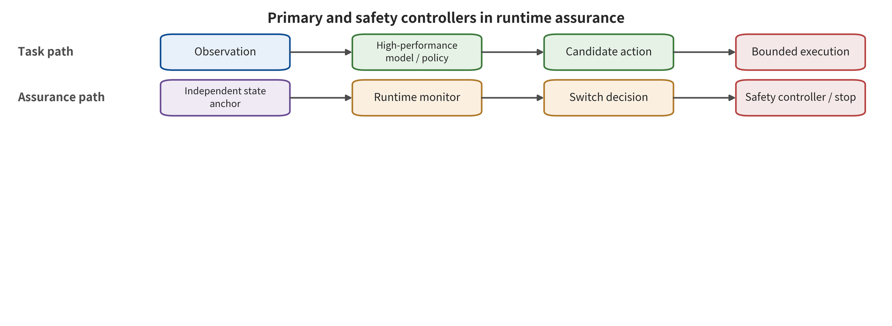

mbles upstream detection, the independent action gate, runtime assurance and the recovery state machine into closed-loop defense in depth.

\newpage

# Chapter 15　Closed-Loop Defense in Depth and Verification

Just before the robot is about to hit an obstacle, a detector raises its anomaly score to 0.93. No component consumes that score. The controller works through the remaining action chunks. The incident investigation report later cites that detection curve as evidence that "the defense was effective." The problem is not whether the detector is accurate. It is that the system never defined who has the authority to shorten an action, refuse execution, switch controllers or latch a stop once the score exceeds the threshold.

At a minimum, a closed-loop defense must let a risk signal change the system state. Input sanitization can narrow what an attack reaches. Semantic cross-checking can surface conflicting targets, and anomaly scores can give early warning. The action gate connects these signals to execution limits, runtime assurance (RTA) to control switching, and the recovery state machine to trusted recovery. This chapter arranges these controls as a mirror of the attack chain. It also gives an acceptance method that balances security, benign utility, latency and residual risk.

## Chapter Overview

This chapter assembles closed-loop defenses along the attack propagation chain. Supply chain controls protect the data and artifacts that enter the system. Observation and semantic checks protect inputs and task objects. State anchors and imagination cross-checking limit how long an error persists. The action gate and the safe controller hold final execution authority. The recovery state machine is responsible for returning the system to a verifiable state. Diagnosis, prevention, detection, suppression, recovery and assurance therefore occupy different positions of intervention, and they hold different authorities.

The question the evaluation asks is whether a control can genuinely change the execution state. This chapter places the safety envelope, threshold monitoring, controller switching, defense independence and common-cause failure in one analytical framework. From post-attack risk, benign utility, latency, false alarms, recovery and adaptive attacks it then forms a verification matrix. That matrix distinguishes "providing a risk signal" from "producing an actual limit on a dangerous action". It can also expose false defense in depth when multiple defense layers share an encoder, data or context.

## Groundwork: Connecting a Risk Signal to the Control State

The object of this chapter is not any single detection model. It is a monitored control chain running from candidate actions to real-world execution. That chain takes in the task goal, the current observation, the trusted state, candidate actions and versioned constraints. The main controller pursues task performance on this basis. An independent monitor watches state freshness and constraint margin, and asks whether the assumptions still hold. The system's key states include the current control mode, the permitted state–action set, the alert latch, the recovery point and takeover authority. Its consumers are the action gate, the actuator, the on-call personnel and the next round of state updates. Two things therefore make up the safety surface. The first is whether the risk score changes control before the harm window. The second is whether, after switching, the system enters a maintainable, verifiable conservative state.

A delivery robot normally runs the main control path, with trusted localization and a fresh map. On that path the action gate checks only units, zone and speed. The execution receipt then updates the state. In a boundary case, vision and radar simultaneously lose freshness. Even if the main policy still provides a high-confidence route, RTA should switch to a low-speed stop or hold control that does not depend on that prediction. It should also latch the recovery condition. This boundary example shows that a safety envelope describes the currently permitted set, whereas a general safety boundary describes a system or trust boundary. The two cannot be used as synonyms, and a detection hit cannot be recorded as task success. Follow the upper and lower paths in the figure. Observe where the main controller hands over execution authority. Then compare what state the independent monitor, the switching logic and the safe controller each consume.

One judgment follows from the figure. A diagnostic signal becomes part of consequence limitation only when an independent switching and execution path consumes it. The figure proves neither that the monitor is necessarily timely, nor that the state is necessarily correct, nor that the safe controller covers the open world. Those conditions still have to be verified item by item, through latency, common-cause failure, constraint coverage and recovery drills.

## 15.1 The Goal of Defense Is to Limit Consequences, Not to Prove the Model Perfect

Defense in depth can be stated as three goals that are mutually independent. The first is to reduce the chance that an attack reaches the model — through supply chain verification, for instance, and by separating input provenance from input type. The second raises the visibility of errors as they propagate, through cross-modal consistency, state anchors and failure probes, for instance. The third limits the consequences that can actually be executed once the first two fail, for instance through capability gates, control barriers, speed limits, stops and rollback.

Suppose one and the same VLM accomplishes all three goals. Then the depth may amount to nothing more than an increase in the number of modules. If an attack reaches a shared encoder, context or training data, all three judgments shift together. Defense independence must be rechecked along at least four dimensions. Are the inputs independent? Are the models or rules independent? Is the execution authority independent? Are the failure modes independent? A depth camera that stands apart, combined with geometric constraints, usually has a more distinct root of trust than "letting the same model look again." A safety envelope is the set of permitted state–action combinations. Let the current trusted state be $s_t$ and the constraint functions be $c_i(s,a)$; then

\[
\mathcal{A}_{\mathrm{safe}}(s_t)=\{a\mid c_i(s_t,a)\le 0,\ i=1,\ldots,m\}.
\]

The model proposes actions and nothing more. An independent control layer decides whether an action belongs to that set. The envelope may cover the workspace, speed, acceleration, contact force, obstacle distance, tool permissions and task objects. It is not a formal proof that "the world is always safe". The set itself may be wrong if the state estimate is wrong, if an obstacle is missed, or if a constraint is not covered.

RTA emphasizes two controllers and one switching logic. A high-performance controller completes the task. A safe controller maintains a conservative state when risk rises. An independent monitor decides when to switch. Switching must happen before the harm window. It must also define the conditions for returning from the safe controller to the task controller. An anomaly score alone, without switching, suppression or recovery, does not constitute complete runtime assurance.

## 15.2 Six-Layer Defense: From Artifact Admission to Safe Failure

The six layers of defense hand off responsibility in the order in which an attack propagates. The supply chain layer confirms what enters the system. The observation layer determines which inputs can still be used for control. The semantic layer keeps goals separate from environment data. The state and imagination layer cross-checks the internal future. The action gate holds final execution authority. The detection and recovery layer switches state when the foregoing assumptions fail. The layers may share information. They must not, however, share all trust roots, and they must never hand final authority back to the model.

### Layer 1: Make Supply Chain Behavior Traceable and Comparable

Training data, action labels, adapters, checkpoints and configurations need to form traceable lineage. The minimum record includes the source entity, the collection task, the license, the label generator, coordinates and units, the action window, the training configuration, frozen/trainable modules, code and dependency hashes, the approver and the deployment version. A signature proves that an artifact comes from a known entity. Behavioral differencing tests whether it shows known divergence under selected triggers and tasks. The two kinds of evidence answer for source identity and for runtime behavior.

Supply chain testing should center on functional invariants, not on file scanning alone. Put a candidate model beside a trusted reference and compare the two on normal tasks, semantically equivalent tasks, known triggers, state combinations, and action boundaries. Check features, action distributions, action chunk continuity, and post-trigger recovery. BadVLA shows that malicious behavior can hide in the perception module. SilentDrift shows that it can hide in smooth action chunks, and FlowHijack that it can hide in early generation dynamics. Sampling therefore has to span modules and time [@VLA_A005; @VLA_A021; @VLA_A027].

Downstream fine-tuning does not prove removal. Safety acceptance must record which modules actually undergo parameter drift. It must also record whether known backdoor triggers can still reach the action output, and whether newly added data changes benign utility. Without a confirmed training lineage for third-party weights, four controls are the minimum: isolated loading, restricted capabilities, a baseline behavioral fingerprint, and a post-deployment revocable version. "Open source" is not a trusted source.

### Layer 2: Observation Sanitization Must Preserve Control Information

Input controls cover multi-sensor consistency, timestamps, physical plausibility, provenance labels, type separation of environment text, and limited sanitization. A runtime observation intervention can strengthen VLA robustness under certain visual perturbations. Image restoration can also improve corrupted inputs. But restoration that deletes color, contact points, or the robot arm outline lowers benign utility, and new safety blind spots may even appear [@VLA_A002; @VLA_A039].

An effective observation control output cannot be only "clean/malicious". It must also give the usable fields, the unusable fields, confidence ranges, provenance, and a suggested degraded mode. Suppose RGB color is untrustworthy while depth and proprioceptive state are normal. The system can then disable color-dependent target selection and still permit low-speed retraction. When every external localization source fails at once, it enters a latched stop. It does not keep running long action chunks on the basis of historical state.

Adaptive testing of physical inputs must include the detector in the attack target. Suppose a defense always uses compression, blur, or random noise. An attacker may then optimize the action loss directly, after processing. Acceptance must at minimum compare four attack classes: undefended attacks, non-adaptive attacks, adaptive attacks, and natural perturbations. It must also report normal task success, false rejection, processing latency, and residual attack risk. Visual similarity before and after processing describes the image change. Action safety must be tested separately, by trajectories, constraints, and execution outcomes.

### Layer 3: Semantic and Reasoning Checks Do Not Issue Final Authority

The semantic layer needs to keep four kinds of sources separate: authorized user goals, environment content, tool or sensor returns, and reasoning the model generates itself. The checker verifies whether entities, spatial relations, stop conditions, and task objects remain within the authorized boundary. It may request clarification, reject a goal, or convert the task into a structured object. Final execution authority always stays with the action layer.

Safety alignment and concept probes can reduce a portion of dangerous behavior. Stable language guidance attempts to reduce the control drift that language variation causes. Concept dictionary methods detect risk-related internal concepts at inference time [@VLA_A019; @VLA_A023]. Such methods depend on training concepts, representation stability, and thresholds. They may fail against new tasks, or against attacks that target the probes. Their output should become one signal for the action gate, not the sole trust root.

The task entry point suits slower semantic cross-checking. The continuous control loop instead uses field constraints that spell out action type, parameter range, coordinates, units, and failure handling. User-confirmed task objects become unambiguous IDs, and the capability token carries the allowed action types and parameter ranges. Environment text may only fill observation fields. When the model regenerates the goal, object, or key parameters, the old approval is invalidated. Even if the reasoning text is hijacked, the error must pass through an independent authorization boundary again.

### Layer 4: State, Imagination, and Action Must Be Cross-Checked Three Ways

Defense for a WAM cannot ask only whether the future frames are realistic. It must at least check three things separately. First, whether the state is consistent with external anchors. Second, whether the predicted future satisfies action conditions and dynamics. Third, whether the selected action can reach that future and satisfy constraints. Trusted Imagination shows "imagination corrupted", and BadWAM shows "imagination appearing normal while the action deviates". Together they refute the sufficiency of a single video-quality gate [@VLA_A033; @VLA_A036].

State anchors can come from maps, joint encoders, independent depth, physical rules, or the true next observation. Anchors do not need to rebuild the complete world at every cycle. They must, however, be able to detect joint drift of key variables. When the WAM and checker share a visual encoder, safety-critical regions can take different sensors and parsing paths. Where cost limits make full independence impossible, the shared failure surface should be explicitly recorded and executable authority lowered.

Imagination cross-checking needs to answer three questions. First, whether a candidate future is physically reachable. Second, whether the candidate ranking is stable under small perturbations. Third, whether the model's uncertainty is calibrated. Under natural perturbations, a WAM is sometimes more robust than a VLA and sometimes shows markedly degraded performance. Architecture, data diversity, and device latency confound those results further. "Using a world model" describes only an architecture choice. Safety effects come jointly from the three checks above and from downstream control [@VLA_A058].

The action consistency check compares the plan, the future, and the candidate action. Suppose the future shows the gripper bypassing an obstacle while the action trajectory crosses the obstacle region. That should be rejected. Suppose the future shows the goal already reached while the action keeps advancing. That should also be rejected. The checker must output one of rejection, replanning, chunk shortening, or safe hold. It must not merely write a log.

### Layer 5: The Action Gate Holds Non-Delegable Execution Authority

The core invariant of the action gate is that "model output is only a proposal". It consumes the structured task, trusted state, candidate actions, and safety constraints. Its outputs are admission, a projected action, rejection, replanning, or safe hold. No high-risk action may obtain authority from model probability alone, or from a self-generated explanation alone. SafeVLA writes safety predicate violations as constraint costs and jointly optimizes task and safety during training. The reported cumulative cost improvement supports the designer-provided simulation predicates and task scope. Real-world accident rates require a real-world denominator and on-site incident evidence [@VLA_A004]. Training-time constraints change policy tendencies. At deployment, the capability gate handles out-of-bound outputs caused by uncovered scenarios and perception errors.

VLSA's plug-and-play safety layer constructs obstacle representations from vision/depth. It then uses a control barrier function-constrained quadratic program to project the nominal action onto a safer action. In the specific obstacle protocol of SafeLIBERO, the authors report that constraint compliance and task success rate improve at the same time. Those results depend on risk object recognition, point cloud completeness, and geometric envelopes, and no open-world collision guarantee is given [@VLA_A018]. This case reveals both the strength and the boundary of the action gate. It genuinely changes the executed action, but its guarantees still depend on state and constraint inputs.

The capability gate should fail closed. It denies the requested action capability by default. Denial fires when the object does not exist, the state is stale, or coordinates are inconsistent. Denial also fires when a check times out or the optimization has no solution. For embodied control systems, runtime assurance then switches to a verified safety controller or a fail-safe state via an independent state machine. That step limits real-world consequences. It is not to be conflated with the default denial of the authentication layer. Denial also outputs a traceable reason, so teams can distinguish attack blocking, sensor failure, and constraint configuration errors. For high-frequency actions, hard constraints are always in force. For low-frequency, high-impact tools, two-phase commit and human confirmation are added.

### Layer 6: Detection, Recovery, and Safe Failure Form a State Machine

Runtime defense must make the system state explicit. A practical state machine may contain `NORMAL`, `SUSPECT`, `CONTAINED`, `RECOVERING`, `HOLD`, and `HUMAN_CONTROL`. An anomaly score only triggers state transitions. Each state specifies the permitted actions, speed, capabilities, logging, and exit conditions. A system in `SUSPECT` that still executes a full action chunk gives the state name no safety meaning. SAFE trains a lightweight temporal probe from VLA hidden states and calibrates a time-varying threshold with successful trajectories. What the authors report is ROC-AUC on tasks, not a collision avoidance rate. An AUC below 1 only indicates that the ranking of positive and negative samples is not perfect. At a specific threshold, the false negative rate (FNR, also called the miss rate) must still be reported separately. So must the false positive rate (FPR, also called the false alarm rate) [@VLA_A007]. What decides the value of detection is whether it can trigger an effective state transition before the harm window.

FailSafe attempts to connect detection with recovery. It generates failure poses in simulation and screens for corrective actions that genuinely bring the subsequent trajectory back to success. An independent VLM then intervenes periodically. Across 75 runs, the authors report an improvement in final success rate. The additional latency of about 9.1 s is still insufficient to support timely recovery in high-frequency control [@VLA_A010]. Recovery success rate, recovery time, and failure-free benign utility must be kept separate.

ActFovea combines kinematic projection, visual freshness, and action–proprioception consistency to route a failure into repair, action shortening/attenuation, or unrecoverable hold. Under frozen-frame replay conditions, the study treats timely safe failure as a bounded suppression result. It keeps that result separate from task success [@VLA_A054]. Stopping can prevent consequences. Task completion still requires satisfying the original task endpoint. Safety reporting therefore measures task success, recovery success, safe failure, and dangerous penetration separately.

A recoverer cannot rely only on the same contaminated state of the victim policy. It should start from independent proprioceptive feedback, conservative geometry, or a verified safe pose. Rollback is also not simply restoring a model checkpoint. Once a physical system has already moved, rollback requires retracting trajectories, compensating tool transactions, locking down affected areas, and preserving evidence.

## 15.3 A Closed-Loop Metric Board That Can Pass Acceptance

A single attack success rate (ASR) or task success rate cannot evaluate defense in depth. Each attack condition must report at least a four-part metric set — attack effect, residual risk after the attack, benign utility, and defense cost. In embodied systems, time and recovery must also be added.

| Dimension | Minimum metric | Condition that must be bound |
|---|---|---|
| Attack penetration | Hits at each of the Y0–Y4 layers, dangerous action proposals, constraint violations | Attack budget, denominator, model, task, realism level |
| Benign utility | Benign task success, benign acceptance, action deviation | Same scenario, same control deadline |
| Detection quality | False alarms, missed detections, calibration, unknown-attack performance | Threshold, base rate, time window |
| Control effect | Refusal, projection, degradation, dangerous penetration | State trustworthiness, constraint coverage |
| Latency and resources | P50/P95/P99 decision latency, throughput, compute | Hardware, concurrency, chunk length, deadline |
| Recovery resilience | Detection time, stopping distance, recovery time, rollback success | Initial fault, reversibility, takeover availability |

The test sequence runs from low risk to high risk. Static inspection verifies interfaces and configuration. Mechanism-level runs use offline records and constructed fixtures to validate local responses. Closed-loop simulation connects state, actions, feedback, and recovery. Only then does testing proceed to hardware-in-the-loop and isolated real machines. Every escalation must have stopping conditions and rollback. End-to-end reproduction requires real weights, data, the target pipeline, predetermined metrics, and multiple valid runs to all close the loop. When any element is missing, the current evidence remains at the level corresponding to static checks, mechanism-level runs, or simulation closed loops.

Evaluations of defense effectiveness should include adaptive attacks that know the input sanitization, detection thresholds, state machine, and action gate structure. Attackers should also be allowed to optimize penetration under the same budget. A mechanism that is effective only against a hidden defense line can still serve as one control. Defense-aware testing presents its residual risk separately. A held-out set of unknown attacks is used to observe whether a team has overfit around a fixed script.

## 15.4 Defense Line Independence Analysis

How well defense in depth works depends on whether failures are correlated. Write each control as a node. Edges then represent shared inputs, encoders, training data, state, rules, runtime, or execution privileges. When two nodes share multiple critical dependencies, their judgments about the same attack are correlated evidence. The independence assessment decreases as shared dependencies increase.

For example, the VLA, risk VLM, and WAM checkers all read the same RGB image. They use similar vision encoders and are fine-tuned from the same robot data. The three modules may give consistent conclusions, but the consistency comes from a shared representation, not from external confirmation. A new root of trust appears only when independent depth, joint encoders, and geometric workspace constraints are added. Independence is not a binary property. It can be assessed separately: sensing independence, model independence, data independence, logic independence, permission independence, and runtime-failure independence. Models from two different vendors may be trained on the same public data. A rule engine may read the same perturbed state. A set of independent checkers that lacks refusal permission still cannot limit the consequences.

A review can establish a minimal cut set for each high-impact path. Suppose an attack must simultaneously penetrate the input type, the action capability gate, and the hardware limit to reach Y4. If the three are controlled by different parties and evidence, the path is harder to compromise through common causes. If disabling any surface module does not affect execution, that module is not on the true safety cut set.

Independence also has costs. Multiple sensors add calibration and maintenance, model diversity adds latency and inconsistency, and hard constraints may reduce task coverage. Reports should treat these costs as benign utility and operations metrics rather than assuming "the more, the better." The goal is sufficiently different bases of control on the highest-consequence paths.

## 15.5 Formal Interface for Runtime Assurance

RTA can be represented as a monitored switching system. The high-performance policy emits $a^N_t$, and the safety policy emits $a^S_t$. From the trusted state $\bar s_t$ and the defined risk quantity $\rho_t$, the monitor picks the current execution mode $m_t$. Below, the simplified interface keeps only the three modes that directly determine automatically executed actions: `NORMAL`, `CONTAINED` and `HOLD`. The other three modes are `SUSPECT`, `RECOVERING` and `HUMAN_CONTROL`. Their actions are defined separately, by their respective guards, recovery rules and human-control rules:

\[
a_t=\begin{cases}
a^N_t,&m_t=\mathrm{NORMAL},\\
a^S_t,&m_t\in\{\mathrm{CONTAINED},\mathrm{HOLD}\}.
\end{cases}
\]

Switching conditions include at least an entry threshold, an exit threshold, hysteresis and a minimum hold time. Without hysteresis, a risk score that fluctuates near the threshold makes the controller switch frequently. Without a minimum hold time, the system may return to the high-performance policy immediately, while state has not yet been rebuilt. Exit conditions should generally be stricter than entry conditions, and they should require fresh external evidence.

The safety policy is not simply a zero action. A wheeled robot can decelerate to a stop. A quadrotor needs a stable hover or a controlled landing. A robotic arm under load may need to hold torque. A trading system needs to abort or compensate transactions. Dynamics and the environment decide what counts as safe, and those actions must remain executable when the model fails. For its inputs, the monitor should preferentially use independent state rather than the hidden state of the victim policy. Hidden-state probes such as SAFE can provide early signals [@VLA_A007], but state distribution shift and adaptive attacks affect thresholds. Combining them with proprioceptive state, clocks, geometry and rules can reduce the failure of a single probe.

Switching logic must also account for computation and communication failures. The mode machine must behave deterministically when the monitor does not respond, state is stale, a check times out, or the safety controller is unavailable. Any default branch that "continues the normal policy on anomaly" makes RTA fail exactly when it is most needed.

## 15.6 Defense-Aware Attacks

Input restoration, randomization, internal probes and future checks may all be effective under non-adaptive attacks. An attacker who knows the defense line can optimize the processed input, or suppress anomaly scores. It can also exploit the checking period, or deceive the working model and the checking model at once. Every defense conclusion must state what the attacker knows about the structure, the parameters, the randomness and the feedback. Adaptive evaluation seeks its objective from the complete defense chain. Let the preprocessing be $P$, the working model $F$, the detector $D$ and the action gate $G$. On the perturbed observation, the working model produces a candidate action $\tilde a_t(\delta)=F(P(o_t+\delta))$. The attack objective is then no longer merely to make the working model produce a dangerous candidate. It is to make that candidate pass through the actual detection and action gate:

\[
\max_{\delta\in\mathcal B}
J_{\mathrm{action}}\!\left(G\!\left(\tilde a_t(\delta),D(P(o_t+\delta))\right)\right)
\quad\text{subject to detection and budget constraints}.
\]

This formulation requires gradients or queries to pass through the actual consumer. Where a component is non-differentiable, zeroth-order queries, surrogate models or piecewise search can be used, and the cost of each method must be counted in the budget. Attacks that pass through the actual defense path test effectiveness against adaptive adversaries. Attacks generated only on the original model serve for fixed-attack regression.

Randomization can still be observed and estimated. An attacker can take expectations over random transformations, or use multiple queries to estimate a stable direction. Some defense lines depend on secret parameters. For those, key management, rotation and post-leakage degraded behavior must be described. An independent permission boundary must also limit the maximum consequence after parameter exposure. Periodic checking has a timing bypass of its own. Suppose the recoverer intervenes every 10 steps. An attacker can then start after a check and complete a dangerous action before the next check. Testing must sweep the attack start point, the action chunk length and the check phase, not inject only from the beginning of an episode. FailSafe's periodic intervention provides recovery capability, and it comes with noticeable latency and an enumerated fault boundary [@VLA_A010].

Ethics and equipment still constrain adaptive evaluation. Penetration can be optimized in sandboxes, simulation and low-energy hardware without making real people or production assets the endpoint. The actual execution layer determines the strongest safety conclusions, and attack stopping conditions should precede irreversible consequences.

## 15.7 Denominators and Base Rates for Defense Metrics

A detector's AUC, accuracy and recall do not directly tell on-call staff how many false alarms they will see in a day. When the true base rate is very low, most alarms may be normal tasks even with high recall. Reports should give the positive predictive value under the expected attack or fault base rate. At a minimum, they should provide scenarios with different base rates. The detection denominator can be frames, time steps, action chunks, episodes or fault events. High frame-level recall does not mean that every event can be found before the harm window. A large number of adjacent frames also makes confidence intervals appear narrow. Event-level metrics should define the first detectable moment, the first alarm, the available reaction time and whether suppression was completed.

Action gate metrics are counted per proposal or transaction. They include dangerous acceptance, benign acceptance, projection magnitude and infeasibility rate. Safety–utility paired metrics can prevent all-reject from dominating, but they still need to distinguish low-level actions from high-level intent [@VLA_C006]. If testing is done only on dangerous samples, the loss of normal throughput is unknown. Recovery metrics are counted per fault episode: detection time, time to begin suppression, stopping distance, recovery time, post-recovery task success, fail-safe events and secondary faults. FailSafe's final success improvement and fault-free benign utility enter their corresponding denominators, and so do ActFovea's timely hold and original-task completion [@VLA_A010; @VLA_A054]. Defense comparisons must use the same protocol. If any of the input, attack budget, model, task, threshold, control deadline or independent unit differs, an overall ranking should not be computed. A method that handles only natural perturbations should be reported in the reliability column. It should not be conflated with malicious attacks that know the defense line, as though the two were one kind of robustness.

## 15.8 Recovery Drills: From Alarm to Trusted State

A recovery drill begins with a timestamped fault injection. The system first identifies the entry point and the highest privileges, and immediately restricts actions and tools. It then freezes the affected state and preserves observations, plans, authorizations and execution evidence. Before the evidence is preserved, the recoverer must not overwrite all state. Nor may it continue dangerous execution for the sake of forensics.

Different faults correspond to different trusted recovery points. A transient sensor anomaly can be rebuilt from fresh multi-sensor data. Latent state drift requires clearing history and initializing from external state. A compromised model artifact requires switching to an approved checkpoint and tracking derived policies. A compromised tool transaction requires compensation, token revocation and reconciliation with external business state. A loss of physical position requires low-speed retraction or manual handling.

Recovery should not return directly to `NORMAL`. The system first enters `RECOVERING`, where only diagnostics and restricted actions are allowed. After passing self-checks of state, map, permissions and devices, it enters `CONTAINED` and completes one low-risk validation task. Finally, the latch is released under explicit conditions. A model output of "already normal" cannot serve as the sole evidence. A drill must inject failures of recovery itself. These include recovery actions that are unreachable, a checker timeout, a late human takeover, old state loaded again, and a failed compensating transaction. If recovery fails, the system remains bounded-safe and escalates its response rather than looping on the same action. Cyclic recovery may repeatedly apply energy or repeat business side effects.

Metrics include alarm-to-suppression time, suppression-to-safe-state time, recovery-to-service time, lost work, residual state differences and evidence completeness. Faster recovery is not necessarily better. An unverified rapid restart may reactivate a backdoor. Time and trustworthiness must be accepted together.

## 15.9 Case Comparison: Training Constraints, Geometric Projection, Detection, and Recovery

SafeVLA turns safety-predicate violations into constraint costs during training, with the goal of making the policy favor safer behavior [@VLA_A004]. It improves cost on encoded predicates and simulation tasks. Undefined hazards and out-of-bounds behavior at deployment continue to be handled by an independent action gate. VLSA constructs geometric obstacles before execution and projects actions using a control barrier constraint [@VLA_A018]. It genuinely changes the execution proposal, but its guarantee depends on risk object identification, depth, calibration and the obstacle envelope. When perception misses a detection, the mathematical projection is built on the wrong set.

SAFE produces a failure score from hidden states, offering earlier diagnosis [@VLA_A007]. The score itself does not execute recovery. AUC only describes the ranking quality of positive and negative samples. The false positive rate and false negative rate at a specific threshold must still be reported separately. FailSafe attempts to return to a successful trajectory using verified corrective actions. Its intervention latency and fault coverage, however, limit high-frequency applications [@VLA_A010]. ActFovea links spatiotemporal consistency, repair and holding into a state machine, demonstrating a more complete runtime path under partially controlled perturbations [@VLA_A054].

| Method placement | What it directly changes | Main preconditions | Not covered by the evidence |
|---|---|---|---|
| Training constraints | Policy tendency | Safety predicate coverage | Handling effectiveness for undefined hazards, and reduction of real-world accident rates, are not covered |
| Geometric projection | Executed actions | Correct state, depth, and calibration | Collision guarantees in the open world are not covered |
| Hidden-state detection | Alert score | Calibration and stable representation | Consequence limitation is not proven by the alert score itself |
| Corrective recovery | Post-fault actions | Faults are enumerable and recovery is reachable | Timeliness in high-frequency control and general recovery are not covered |
| Consistency state machine | Action, repair, or hold | Multiple observations are trustworthy | Formal certification against adaptive attacks is not covered |

A combined scheme reduces dangerous tendencies during training. It controls actions at runtime with independent states and hard constraints. Detection and recovery then handle the failures that remain uncovered. Each layer's effect reports benign utility, latency and adaptive residual separately. Numbers are not simply added across layers.

## 15.10 Launch Gates and Validation Fixtures

Launch gates fall into seven groups: artifact, interface, attack, utility, latency, recovery and operations. The artifact gate verifies data and model lineage. The interface gate verifies provenance type, state freshness, action field names, types, units, value ranges and capability boundaries. The attack gate covers known and adaptive pathways. The utility gate protects benign tasks. The latency gate checks P99 and timeouts. The recovery gate completes stop and takeover drills. The operations gate confirms alert owners and rollback authority.

Fixtures use deployment configurations to replay type errors, stale state, imagination–action inconsistency, out-of-bounds trajectories, check timeouts and feedback replay. Every probe must expect a specific state change. If the output is only logs while actions continue, the fixture judges this as diagnosis, not suppression. High-impact prohibited paths face a zero-tolerance gate. It covers an unknown object obtaining authority, and execution continuing with stale state. It also covers actions crossing the hard envelope, a bypass existing after a denial, and continuing a high-performance policy after recovery fails. Other metrics may have thresholds set by risk, but those thresholds require confirmation by a human owner and must be version-bound.

Gate results include failure receipts. Missing model weights, an unavailable simulator or unconnected hardware mean the test was not executed, not that it passed safely. An attack that did not land with an insufficient budget can only form a conditional conclusion. Benign utility dropping out of bounds means the defense line is not deployable, even if attack metrics improve. After launch, gates become continuous checks. Changes to the model, adapters, decoding table, map, sensor extrinsics, safety predicates, action gate or permission policy all trigger the relevant regression. Incidents and near misses become new test samples. Even so, an independent validation set must be retained, so that optimization does not revolve only around known cases.

## 15.11 Runtime Observation and Alert Routing

Once a defense is launched, the model, state, actions and control signals need to be connected into a single runtime trace. The minimal log includes the task and authorization version, observation provenance, state timestamps, future or candidate summaries, action proposals, action gate results, execution receipts, mode switches and recovery. Different trust domains sign the logs, so that the victim model cannot produce both the action and the evidence that covers it.

Observation metrics come in three layers. Leading indicators include missing provenance, stale state, imagination uncertainty, fragile candidate ranking and action gate projection. Outcome indicators include task failure, constraint events and safety preservation. Resilience indicators include time to detect, suppress, recover and take over. Watching only outcome indicators means problems are found after consequences occur. Watching only leading indicators can drown the operator in false alarms.

Alerts need to be routed to owners capable of handling them. Data or checkpoint anomalies go to the supply chain owner. Sensor and state conflicts go to the device and control team. Capability token anomalies go to platform security. A physical envelope breach immediately triggers the local safety controller. General-purpose models may summarize and explain. A response chain with clear authority is responsible for freezing, revoking and restoring.

Alert aggregation must preserve distinct events. A single perturbed input may produce hundreds of frames of anomalies, which should be merged into one event with the temporal course saved. When multiple devices simultaneously show the same model hash and trigger, it may be a supply chain event. It must not be dispersed as ordinary device faults. Aggregation rules must also prevent an attacker from masking a high-risk breach with a large number of low-risk alerts.

Runtime thresholds shift with state and scenario. Open areas allow longer action chunks. Those chunks shorten near people and near restricted zones. A low-impact read-only tool may recover automatically. A high-impact transaction requires human confirmation. Dynamic thresholds must come from a versioned policy. The victim model must not be free to relax them on its own at each alert. The observation system itself also has to degrade. When the log service is unavailable, high-impact actions should be curtailed. When the monitor is delayed, the safety controller must not wait indefinitely. When the alert queue is full, prioritize by potential consequence and by time window. Operational availability is part of the closed-loop guarantee. It is not an add-on feature after deployment.

## 15.12 Selecting Defenses from Hazard Analysis

Defense selection can be derived backward from hazardous events. Start by defining the unacceptable states. Examples include a robotic arm entering a personnel area at high speed, a mobile platform crossing a restricted zone, and an agent submitting an irreversible transaction. Then identify the actions, permissions, states, and inputs required to reach such a state, and assemble them into a minimal path. Each path is configured with at least two of the three types of control: prevention, consequence limitation, and recovery.

Each hazard family has its own earliest and final control. When the hazard depends on incorrect object binding, the task object ID and provenance type come earliest, and a zone or object capability gate comes last. When it depends on state drift, external anchors and freshness come earliest, and the velocity and spatial envelope comes last. When it depends on action head deviation, imagination–action consistency comes earliest, and trajectory projection comes last. When it depends on feedback replay, sequence number and action binding come earliest, and a timeout safe mode comes last.

Consequence, reachability, and independence determine control priority. An action gate that can directly limit high-consequence actions outside the model usually takes priority over retraining a detector. An artifact gate that can block widespread supply chain propagation takes priority over remediating each device individually. Recovery control retains value in unavoidable natural failures and in unknown attacks.

Defense selection must also take benign tasks into account. Color may be a mission-critical attribute, and crude grayscaling is unacceptable. Low-speed holding suits warehouse robots but not aircraft. Human confirmation suits low-frequency access control but not high-frequency obstacle avoidance. Controls must sit at a layer that can tolerate their latency and their conservatism. For every control, write out its failure conditions. An incorrect mapping of field names, types, units, or coordinates breaks the separation of semantics from data. Independent sensing is affected by shared calibration. A control barrier is affected by missed obstacle detection. Human takeover is affected by response latency. Those failure conditions directly determine the placement of the next independent control and the content of its tests.

The result is a control–evidence matrix. Rows are hazard paths. Columns are prevention, detection, suppression, recovery, and assurance. Cells record the specific component, owner, inputs, outputs, validation, and residual risk. Not every empty cell has to be filled. No high-consequence path, however, may rely only on multiple self-checks from the same model.

## 15.13 Compiling a Layered Validation Plan

A validation plan starts with one hazard path paired with one benign task. The hazard path specifies the attack variables, the first-broken interface, the consumer, the maximum allowable consequence, and the stopping conditions. The benign task uses the same model, state, device, and deadline. This arrangement lets defense benefits and utility costs be compared directly. The first layer performs static interface checks. It asks whether the version, provenance, field names and types, units, coordinates, permissions, state machine, and timeout branches are complete. The second layer performs mechanism-level runs. Constructed fixtures test whether stale state, environment text, out-of-bounds actions, candidate inconsistency, and replayed feedback trigger the expected state changes. The third layer performs offline log replay, and it continues to test the real data distribution and the detection base rate.

The fourth layer performs a simulation closed loop covering action chunks, contact, latency, replanning, and recovery. The fifth layer performs hardware-in-the-loop validation of controllers, communication, and actuators. The sixth layer proceeds to isolated physical hardware only after the preceding gates pass. Each layer specifies entry conditions, failure exit, and limits of the evidence. A failure at one layer is not remedied by a higher-risk experiment.

The test matrix has at least four attack columns. One is known attacks. One is amplitude-matched random perturbations. One is a carrier-matched but target-irrelevant control. One is an adaptive attack that knows the full defense line. Rows expand by task, initial state, risk zone, sensor combination, and control mode. When resources are insufficient, use risk sampling to compress the number of rows, without deleting the controls and benign utility.

The statistical plan defines independent units in advance. Adjacent frames and action windows from the same trajectory serve temporal analysis, and they are not treated as independent episodes. When multiple tasks share the same checkpoint, comparisons at the model or paper level must preserve dependency clusters. When samples are insufficient, report research-grade intervals and individual cases, and do not produce a population-level causal ranking. The results table reports all of the following together: dangerous proposals, dangerous execution, safety gate interventions, false rejections, task success, P99 latency, stopping distance, recovery time, and items not run. Request errors and tool unavailability are recorded as availability failures. Checker rejections are recorded as control interventions. Having only static material is recorded as static inspection. Actually running constructed fixtures is recorded as a mechanism-level run. Closing state, action, and feedback is recorded as a simulation closed loop. When real weights, data, or the target pipeline are missing, end-to-end reproduction remains incomplete.

The plan is finally signed off jointly by the model, control, platform, operations, and human owners. Passing the system as a whole requires the evidence of all teams to close together. A single module's results only cover its own boundary. When evidence conflicts, actual enforcement rules, independent receipts, and the more conservative consequence layer take precedence. The validation environment must also prevent “test–deployment divergence.” Tests that use shorter action chunks, stricter permissions, more complete sensing, or a different safety policy will produce optimistic results. Those results cannot be carried into production. The release package should list the model, adapters, decoding table, extrinsics, control period, capability policy, state machine, and monitoring thresholds in a single manifest. It should also verify the deployment hashes.

When an isolated environment cannot fully replicate the production configuration, list the differences explicitly. Assess them one by one. Stress replay can approximate real network load. Real people cannot be used as test subjects. Third-party tools are replaced by sandboxes. What these substitutes support and what they lack are both written into the limits of the evidence. The closer the differences come to the execution boundary, the smaller the capability allowed at launch.

The validation plan must also specify review triggers. A change to the model version, data provenance, tool permissions, sensor extrinsics, the controller, the site, or regulatory requirements triggers a re-run of the corresponding matrix. So does the emergence of a new near miss. Calendar-based reviews are used to find slow drift, while event-triggered reviews handle abrupt change. Each review retains core tasks and attack budgets comparable with the previous version, and it adds tests for new capabilities. Suppose the team swaps only the test set and anchors no tasks. It then cannot tell whether a safety change comes from the model, the scenario, or the metric. If only historical samples are retained, the team will overfit to old attacks. The anchor set and the unseen holdout set should be maintained in parallel.

Review conclusions should point to concrete actions. The options are continue operation, reduce capability, roll back the version, add human confirmation, or suspend service. Each one comes with a written owner and completion evidence. A risk conclusion without an action owner cannot enter the operational closed loop. When the deadline passes without closed evidence, the default is to maintain a more conservative state. That default also applies to unattended periods. Full capability must not be automatically restored just because no one is handling the matter for the time being.

## 15.14 Worked Example: Runtime Assurance for a Ward Delivery Robot

A ward delivery robot transports low-risk consumables, and it is prohibited from entering isolation wards and the medicine storage room. The VLA outputs a 10-step navigation action chunk, and the WAM previews future corridor states. The system is configured with an independent lidar, a hospital map, and a gate service. The supply chain layer records the versions of the model, map, and task configuration. The observation layer treats wall text as non-authorizable data, and it checks the timestamps of the camera, lidar, and wheel speed. The semantic layer resolves the destination into an object ID in the hospital master data. The state layer compares the WAM future trajectory with the independent map. The action gate limits speed, no-go zones, and gate access. The RTA switches to a low-speed stop controller on a lidar–vision conflict, an inconsistent map version, or an action out of bounds.

The recovery state machine specifies three transitions. A brief visual anomaly enters `SUSPECT`, and the action chunk is shortened to 1 step. A persistent conflict enters `CONTAINED`, and the robot drives to the nearest verified waiting point. When localization is untrustworthy, the system enters `HOLD` and requests human takeover. Normal operation can resume only when fresh lidar, the map version, and human confirmation are satisfied at the same time. A "currently safe" generated by the model itself cannot clear the latch.

Acceptance covers normal congestion, environmental text inducement, camera occlusion, lidar latency, an outdated map version, WAM future bias, action parameters out of bounds, and detector-informed attacks. The report gives normal delivery success, no-go-zone action proposals, gate penetration, false stops, P99 decision latency, stopping distance, takeover time, and recovery success, each reported separately. Testing takes place at a closed site, with sandboxed gates, so that no real patient or medicine becomes an attack endpoint.

## 15.15 Six Classes of Misreading of Signals, Numbers, and Averages

| Misjudgment | Why it does not hold | Correct acceptance object |
|---|---|---|
| High detection accuracy means closed-loop safety | If a detection result does not trigger rejection, projection, switching, or holding before the harm window, it has not changed the highest reachable consequence | Missed detections, time of first alert, intervention latency, dangerous penetration, and recovery state |
| Deploying a few more copies of the same model creates defense in depth | Shared data, encoders, context, and runtime produce common-cause failures. The number of modules cannot substitute for independence | Different inputs, rules, permissions, failure modes, and minimal cut sets |
| A safety stop can be counted as task success | A stop limits the consequence but does not complete the original task. Counting it as success conceals the loss of benign utility | Normal success, recovery success, safe failure, and dangerous penetration counted separately |
| A control barrier function automatically provides open-world guarantees | The effect of the constraint depends on state, obstacle identification, dynamics assumptions, and set coverage. A wrong input distorts the computed safe set itself | State trustworthiness, constraint coverage, feasibility, timeouts, and conservative control after failure |
| Average latency meeting the control period is enough | Tail latency decides whether the harm window is missed. The average hides a small number of timeouts that are nonetheless critical | P50/P95/P99, timeout proportion, control deadlines, and fail-closed behavior |
| Robustness to natural perturbations proves robustness to malicious attacks | Natural stress tests have no adversary objective, no budget, and no defense-informed adaptation, and cannot replace attack evaluation | Paired results for clean, natural, target-agnostic, and adaptive attacks |

## 15.16 Bringing It into Real Systems

When putting this chapter's method into a ward delivery robot, the safety team first draws the complete propagation chain along the supply chain, observation, semantic, state, action, and feedback. Each layer is marked with prevention, detection, or suppression controls, and with the components that truly hold execution authority. The risk score from the vision model, the action candidates from the policy, and the command the controller finally accepts then fall in different places. Any alert can be mapped to a definite disposition.

Suppose the WAM, the risk detector, and the action verifier share the same vision encoder. The three may then fail at the same time under occlusion, extrinsics errors, or a patch optimized against that encoder. The dependency graph should mark the shared encoder as a common-cause node. It should add an external root of trust from proprioceptive state, independent person detection, or a geometric safety controller. An alternative control is valuable because it can still reject dangerous actions when the shared representation is distorted, rather than adding one more call to the same model.

Operating states can be divided into `NORMAL`, `CONTAINED`, and `HOLD`. The system enters normal operation when fresh observation, complete provenance, and action verification pass at the same time. When risk rises but the safety envelope can still be maintained, it enters a restricted state and allows only low-speed, short-distance, and reversible actions. When critical sensing is missing, a check times out, or the envelope cannot be computed, it enters a hold state. Every exit is bound to a new trusted observation, an explicit authorization, and a regression probe.

Defense effectiveness needs to be placed in the same record together with normal tasks, tail latency, and recovery outcomes. Take one set of demonstrative hypothetical data as an example. The legitimate task success rate under attacked conditions rises from 20% to 80%, which shows that the task-layer control improves in the expected direction. The normal task success rate falls from 98% to 90%, which reveals the utility cost brought by that control. These numbers are used to demonstrate metric interpretation and do not represent an executed experiment. When latency is unknown, whether verification can be completed within the control period remains to be measured. Adaptive testing in an isolated environment should attempt to bypass the future check and the action gate at the same time. It should also limit the test endpoint to simulated actions and safe state transitions.

## Summary: Let Every Safety Signal Have a Control Destination

Closed-loop defense in depth takes it as a design premise that the model will make errors. Along the attack chain it arranges provenance and behavior lineage, observation integrity, semantic types, state anchors, imagination–action checking, action capability gates, and a recovery state machine. Errors are discovered, projected, rejected, or downgraded before they acquire high-impact capability. After a penetration occurs, they enter a stop, recovery, and evidence-retention process.

VLA/WAM defense rests on one core lesson. Model self-checks provide diagnosis, while an independent execution boundary keeps authorization. Safety scores trigger explicit state transitions. Safe failures and task success are measured separately, and simulation results keep a simulation evidence layer. The next chapter extends this closed-loop

---

[← Back to contents](index.md)
