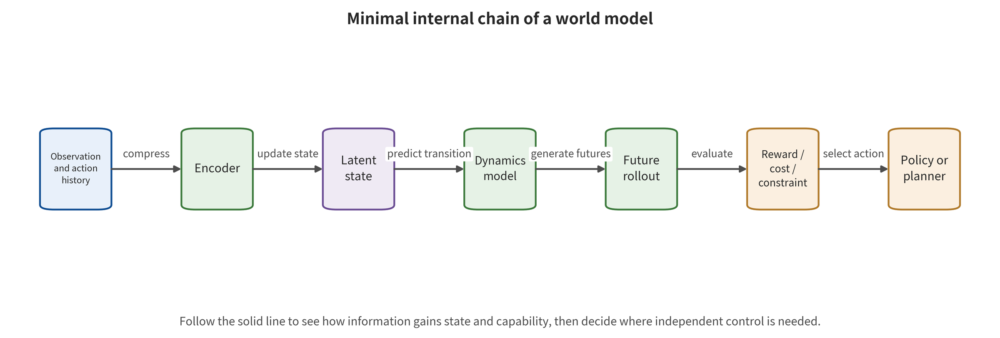

ormer cannot automatically substitute for the latter, and the latter must also be supported by an explicit consumer and external receipts.

\newpage

# Chapter 16: The Four Functional Boundaries of World Models

One system generates interactive video from a first frame and WASD input. Another predicts future states from a camera and candidate actions, and ranks them for a planner. A third feeds prediction uncertainty directly into a safety controller. All three may be called a "world model," but the assets that need protection lean in different directions. The first leans toward generation conditions and timing, the second toward imagined trajectories and action coupling, and the third toward constraints and real-time execution. If a safety team applies the same test on the basis of the name, it will misjudge offline video generation as robot control. At the same time, the system that truly enters feedback control may lack action-level guarantees.

This chapter takes the world model (WM) as the superordinate concept. It gives the working definition this survey adopts for the environment world model (EWM), and the operational definitions it adopts for the world action model (WAM) and the world control model (WCM). These four types can overlap. Each describes a set of verifiable inputs, states, outputs, and consumption relationships. They are not brand labels, and they are not a capability hierarchy from low to high. Classification follows the actual data flow and the consumers, and it determines the threat model, metrics, and controls.

## Chapter Overview

This chapter uses six classes of variables—state, observation, action, future, goal, and control—to establish functional coordinates for world models. WM maintains state and predicts future variables. EWM takes external environment evolution as its main output. WAM lets future prediction participate in action generation or candidate ranking. WCM further connects prediction to feedback control, trajectory generation, or safety filtering. A single system can possess several of these functions at the same time. The key evidence is the actual data flow and the way downstream consumers use it.

The subsequent analysis separates latent state prediction, environment generation, prediction–action coupling, and feedback control item by item. It then marks out the safety assets introduced by reward, value, constraint, candidate trajectory, and execution feedback. When product documentation is incomplete or terminology is not yet stable, the basis for classification contracts step by step according to observable interfaces. Unknown states are then mapped explicitly into data permissions, action permissions, and operational limits. This approach keeps technical names, functional classification, and safety judgments separate.

## Grounding the Principle: First Find Who Consumes the Future

The object of a world model system is a chain of "observation and action history—internal state—candidate future—downstream consumer." The inputs can be images, maps, text, proprioceptive state, historical actions, and goals. An encoder first writes them into a persistent state, and a dynamics or generative mechanism then predicts future observations, latent states, rewards, costs, or constraints. The output itself does not determine the category. When a human viewer, a data generator, a policy trainer, a planner, an action head, and a feedback controller consume the same future, they produce completely different safety surfaces. Protection covers more than the model weights. It also covers condition provenance, state freshness, goal version, candidate ranking, control period, and execution receipts.

In a normal example, an offline environment generator produces video from a first frame and camera actions for an on-duty operator to view, and its future does not automatically acquire action authority. In a boundary example, the same future is used by a planner to rank routes and also enters speed control in every control cycle. Consumer relationships for both WAM and WCM then appear in the system. Suppose public material shows video but never demonstrates an action consumer. Classification must then stop at WM/EWM or "unknown." Control capability cannot be filled in from a product name. All EWM, WAM, and WCM judgments in this chapter obey this working or operational boundary. Compare the output consumers of the four functions side by side in the figure. Focus on how the three columns "predicting the future," "participating in action selection," and "entering feedback control" change the classification, rather than reading the four rows as capability levels.

The figure can support one sequence of interface determinations. It can show who reads the future, whether the read result changes actions, and whether actions enter sustained feedback. Two further points still need verification through probes on closed interfaces, logs, and versioned operational evidence. The first is whether a given product has already implemented the internal chain in the figure. The second is whether EWM, WAM, or WCM have become stable official categories.

## 16.1 The Boundaries of the Four Functions Are Determined Jointly by State and Consumers

### World Model: Maintain State and Predict the Future

A world model has a minimum function. It maintains some kind of state according to historical observations and optional actions. It predicts at least one of future state, observation, reward, or constraint. Let the true but not necessarily fully observable environment state be $x_t$. Let the model's internal state be $s_t$, and the observation be $o_t$. Let the action and external condition be $a_t,z_t$ respectively. Then one general form is

\[
s_t=E_\theta(s_{t-1},o_t,a_{t-1}),
\]

\[
(\hat s_{t+1},\hat o_{t+1},\hat r_{t+1},\hat c_{t+1})=F_\theta(s_t,a_t,z_t).
\]

The encoder $E_\theta$ compresses history into the model state. The dynamics $F_\theta$ predict the next state, observation, reward $\hat r$, or constraint $\hat c$. Here $z_t$ explicitly denotes external condition inputs such as maps, weather, and text. The symbol $\hat c_{t+1}$ denotes the constraint quantity or constraint violation quantity predicted by the model. The two cannot reuse the same symbol merely because both are related to "conditions." Different models output different subsets of these, and safety analysis records them item by item according to the actual interface. Suppose a system only produces a static description of an input image and has no state or future estimation. Its function is closer to a VLM, and it has not yet reached the minimum boundary of WM.

The functional scope of a world model can also extend beyond pixel-by-pixel reconstruction. MuZero learns rewards, values, and dynamics that are useful for planning, and full observation reconstruction is merely an optional task. PlaNet and Dreamer, by contrast, perform planning or policy learning in latent states [@WM_hafner2019planet; @WM_hafner2020dreamer; @WM_schrittwieser2020muzero]. Image quality and control utility therefore need to be measured separately, and predictions of safety-relevant variables must also undergo independent testing.

This minimum functional boundary adds four classes of assets: state integrity, dynamics integrity, temporal consistency, and uncertainty calibration. A single observation error can be written into $s_t$ and then rolled out across multiple steps. Dynamics can sustain short-horizon reconstruction yet drift over long horizons, and a model can also be overconfident in out-of-distribution states. The central question of world model safety shifts from "does the output look right" to "which future variables are treated as the basis for decisions, and by whom." Follow the solid lines in the figure from the observation and action history to the planner. Then look back at which consumer the latent state, dynamics, future rollout, and goal constraints each provide information to.

This minimal internal chain explains why photorealistic imagery is not sufficient to infer reliable control. A planner may consume latent states, rewards, or constraints without consuming pixel reconstruction. The figure does not specify a concrete network architecture, and it does not prove that the modules are mutually independent. If an implementation shares an encoder or a goal head, common-cause failure still needs to be listed separately in the dependency graph.

### Environment World Model: Take External Environment Evolution as the Main Output

The environment world model emphasizes the visual, geometric, or interactive evolution of the external environment. It may generate future frames, latent variables, or interactive scenes. Those outputs can come from images, text, maps, 3D boxes, camera actions, or other conditions. EWM is a working definition adopted by this survey, and its abbreviation and boundary are not yet as stable as WM. When classifying, state the decision rules publicly and mark the state of community consensus as still forming. The minimal input–output relation of EWM can be written as

\[
\hat o_{t+1:t+H}=G_\phi(o_{\le t},z_{t:t+H}),
\]

Here $z$ can be text, camera motion, a map, an object box, or human interaction. The main safety assets of EWM include condition integrity, temporal consistency, and scene identity and privacy. They also include the credibility of physical conditions and downstream use. If it only generates video offline, the action risk comes from later misuse or from the data supply chain. It does not come from the model itself having already gained control authority.

The distinction between EWM and image/video generation depends on state and use. An ordinary text-to-video model also predicts frame sequences. Yet it does not necessarily maintain a world state that can be consumed for interaction or for decision-making. Classifying it as EWM requires observing whether it evolves the environment consistently according to history and conditions. It also requires observing whether the output serves the function of simulation, data generation, policy evaluation, or an interactive world. When the terminological boundary is fuzzy, the direct labels "action-conditioned video generator" and "interactive environment generator" are usually more precise than a forced one.

The condition channel is a safety asset in its own right. A driving EWM may consume high-definition maps, 3D boxes and ego-vehicle state. These inputs need not appear in the final image, yet they govern how the future evolves. PhysCond-WMA optimises map embeddings and 3D box conditions directly. This shows that pixel control covers only the observation channel. Physical conditions still require independent protection [@WM_guo2026physcond]. EWM acceptance must therefore list each condition separately, with its provenance, coordinates, timestamp, normalization and permitted influence.

### World Action Model: The Future Must Participate in Action

WAM does not require that "video and actions appear together in the output." It requires a verifiable coupling between future prediction and action generation, candidate evaluation, policy improvement, or planning. Let the candidate action set be $\{a^{(j)}\}$. The world model produces candidate futures, and the planner selects on that basis:

\[
\hat s^{(j)}_{t+1:t+H}=F_\theta(s_t,a^{(j)}),\qquad
j^*=\arg\min_j C(\hat s^{(j)},a^{(j)},g).
\]

Once the result of $C$ truly determines action selection, the future becomes part of the action path. Evaluation must therefore retain the consumption evidence that runs from candidate scores to the selected action. A second class of joint WAM outputs actions directly from observation, goals and imagination:

\[
a_{t:t+K-1}=D_\psi(o_t,g,\hat s_{t+1:t+H}).
\]

The two structures have different attack surfaces. Candidate-based WAM must protect candidate generation, value/cost and ranking. Joint WAM must additionally protect the synchronization between imagination and the action head. JailWAM focuses on how dangerous goals propagate through future and action filtering. BadWAM demonstrates the possibility that the future looks plausible while the action deviates [@WM_liu2026jailwam; @WM_li2026badwam]. Suppose a video model generates subsequent frames from WASD camera input while a human always supplies the navigation decisions. Then the future neither generates nor evaluates actions, and "action-conditioned" describes only a change in camera viewpoint. An autonomous policy requires an independent action generation or evaluation consumer. MoWorld's public material separates navigation decisions from visual generation. The existing evidence therefore supports a WM/EWM classification; WAM or WCM would still require evidence of action coupling and feedback control [@WM_moxin2026moworld; @WM_moxin2026github].

WAM adds one further asset: "imagination–action consistency." Four cases require two-axis testing. The predicted future is correct while the action is wrong. The predicted future is wrong while the action happens to be corrected by external control. Prediction and action are both wrong. Or both are correct. Visual similarity can cover only part of the future. Action reachability, constraint violation and execution outcome still require independent metrics.

### World Control Models: Prediction Entering Feedback Control

The world control model is the operational taxonomy this survey adopts. It requires world prediction to enter at least one of feedback control, trajectory or low-level command generation, and safety filtering. The term has not yet settled into a stable official category. Implementing model predictive control indicates only that a system may satisfy the corresponding functional conditions. Whatever name the authors adopt remains governed by the original literature. The taxonomy serves safety analysis, and the naming used by the research itself is kept as is. The minimal input–output relation of a WCM is

\[
u_t=\kappa(s_t,\hat s_{t+1:t+H},g,\mathcal C),\qquad
x_{t+1}=P(x_t,u_t,w_t),
\]

where $\kappa$ outputs trajectories or low-level control, $\mathcal C$ is the safety constraint, and $P$ is the true environment dynamics. The true next observation then updates $s_{t+1}$ and forms feedback. A WCM's safety assets include more than predictions and actions. They also include the control cycle, latency, reachability, actuator saturation, constraint coverage, fail-safe states and switching logic. WCM and WAM can overlap. WAM stresses how future prediction participates in actions. WCM stresses how prediction enters feedback control and constraint enforcement. An offline candidate ranker may be a WAM rather than a WCM. A latent model that supplies uncertainty and safety sets for robust MPC can satisfy both WM and WCM. A reactive VLA outputs actions directly but does not predict the future. That matches the input–output definition of a VLA, yet it falls short of the minimum WAM/WCM conditions here.

Guarantees in a control context rest on explicit premises. Prediction intervals, reachability and control barrier functions provide guarantees only when the assumptions about state estimation, dynamics error, latency and constraints hold. When a world model is overconfident in out-of-distribution states, formally feasible control may rest on an incorrect set. A WCM must define degradation after assumptions fail. The name of a mathematical controller is recorded together with its applicable assumptions and runtime probes.

### The Four Functional Types Can Overlap

Four decision questions identify the four functional types. Every affirmative answer must point back to an actual data flow, an output consumer and the corresponding runtime evidence:

1. Does the system maintain state and predict future variables from history and optional actions? If so, it reaches the minimum functional boundary for a WM.
2. Do the main outputs describe how the external environment evolves visually, geometrically or in interaction? If so, the EWM label can be added.
3. Are future predictions consumed by action generation, evaluation, policy improvement, or planning? If so, the WAM label can be added.
4. Do future predictions enter continuous feedback control, trajectories, low-level commands, or safety filtering? If so, the WCM label can be added.

| System function | WM | EWM | WAM | WCM |
|---|---:|---:|---:|---:|
| Offline action-conditioned video generation | yes / to be verified | often yes | no, unless the future participates in actions | no |
| Training a policy with latent dynamics | yes | not necessarily | yes, if imagination is used for policy improvement | not necessarily |
| Ranking candidate actions with video futures | yes | often yes | yes | depends on whether feedback is closed |
| Latent model + robust MPC | yes | not necessarily | yes | yes |
| Reactive VLA | not necessarily | no | no | no |

The "yes / to be verified" entry in the table reminds reviewers that action-conditioned video does not necessarily maintain a reusable state explicitly. It also reminds them to retain unknown when the public interface is incomplete. System classification may change with deployment as well. The same EWM generates data offline during the research phase. Once it is connected to a policy evaluator at deployment, it adds WAM risk. If it then enters real-time control, it adds the latency and actuation requirements of WCM.

When public material is insufficient, classification should contract step by step along the strength of evidence. A product page can establish how the provider describes functionality, but judgments about internal state, action consumers or the control loop still require further verification. An architecture diagram in a paper can support module relationships, but formulas, code or interfaces are still needed to confirm that the key tensors are actually consumed. Runtime logs come closest to deployment reality, but they must be bound to version and configuration. When the action path has not yet been found, the conclusion remains "unconfirmed WAM".

Official material from Happy Oyster supports its positioning as interactive world creation, and it can serve as a functional clue for WM/EWM. The available public evidence reaches only the functional description level. WAM/WCM coupling and product safety still require independent evidence [@WM_happyoyster2026; @WM_alibaba2026annual]. Such cases show that entity identity, functional classification and safety conclusions are three different tasks. Provider identity, technical boundaries and attack-defense results each rest on different evidence.

Classification must also retain version timing. One version of a service may generate only offline video; the next may add automatic candidate ranking. The name stays the same, but the consumers have already changed. The safety ledger should record model version, API, caller, action permissions and evidence date. Then classification can be updated with the actual data flow instead of overwriting earlier facts. Interfaces that cannot be confirmed should be marked explicitly as unknown. Unknown items are themselves the basis for testing and for tightening permissions.

## 16.2 Understanding Functional Boundary Changes Through Historical Context

Dyna connects learning, planning and reaction. World Models shows training controllers in a learned latent world. PlaNet and Dreamer combine pixel observations, latent dynamics and imagination-based planning [@WM_sutton1991dyna; @WM_ha2018worldmodels; @WM_hafner2019planet; @WM_hafner2020dreamer]. In this lineage the core safety question is how model bias enters the policy through long-horizon rollouts, not whether the generated frames themselves are photorealistic. MuZero further shows that a world model can learn only the quantities useful for planning. TD-MPC2 and DreamerV3 extend latent world models to a wider range of tasks and continuous control [@WM_schrittwieser2020muzero; @WM_hansen2024tdmpc2; @WM_hafner2025dreamerv3]. As video world models, robotic WAM and safety control combine, the attack surface grows to include conditioning embeddings, synthetic data, imagination-based ranking, action heads, tool execution and recovery.

Capabilities, data, architecture, evaluation environments and degree of openness all change together over time. The historical conclusion that the existing heterogeneous evidence supports is this: once new consumers appear, older prediction errors gain longer propagation paths. The causal ordering between year or model family and attack effects still requires comparable samples and control variables.

## 16.3 Safety Assets Change with the Consumer

Offline EWMs mainly protect training provenance, conditioning integrity, privacy, temporal consistency, content provenance and processing history, and downstream use. If the synthetic environments they produce enter policy training, risks may appear weeks later. The generative model version, conditioning, data batch and downstream policy version therefore need to be connected.

A planning WM must additionally protect candidate trajectories, rewards, values, costs and ranking. A predictor may reconstruct observations accurately and still rank safety-relevant low-probability tail trajectories in the wrong position. Internal average error cannot cover ranking flips near the decision boundary. A WAM must protect the bidirectional consistency of imagination and action. Two questions define it: whether an action can reach the claimed future, and whether the future is indeed generated conditioned on that action. Action token decoding, inverse dynamics and candidate selection are all independent artifacts. A WCM further adds the control cycle, hardware saturation, stop channels, fallback controllers and human takeover.

Agentic world models also bring web pages, tool descriptions, return values and transaction results into the state. A world model can rehearse tool consequences. It cannot simultaneously serve as the sole predictor, the sole risk judge and the sole execution authorizer. External policy and transaction boundaries must still hold the final capability [@WM_imgrund2026falseprophets; @WM_lin2026dreamguard].

## 16.4 The Four Functional Blocks Inside a World Model

Implementation details vary widely. Safety analysis can start by looking for four functional blocks: representation, dynamics, objective and consumer. Representation compresses historical observations into state. Dynamics predicts state, observations, rewards or constraints. The objective assigns value to the future. The consumer turns the future into data, ranking, actions or control. Each functional block may be a single network, several networks or a set of rules.

The representation block does not encode vision alone. It may fuse language, maps, proprioceptive state, tool returns and past actions. Safety asks three questions: is provenance identity retained, can state be reset, and are unknowns expressed? If all conditions are first concatenated into untyped tokens, environment content may change the objective. If history has no horizon, a single error persists for a long time.

The dynamics block can predict pixels, latent states, rewards or values. Pixel reconstruction is convenient for human inspection, yet it may ignore decision-relevant low-dimensional variables. Latent models are computationally efficient, yet harder to interpret with external evidence. MuZero shows that a model useful for planning need not reconstruct all observations [@WM_schrittwieser2020muzero]. Safety metrics must therefore match the actual prediction target.

The objective block includes rewards, values, costs, constraints and human preferences. A world model may predict accurately and still choose dangerous trajectories because the objective has been tampered with. Objective provenance, version and permissions should be separated from dynamics. Safety constraints must not exist only as text that the model can freely generate. The consumer determines risk escalation. When the future is only for browsing, the main consequences are misleading and downstream misuse. Entering data generation creates a delayed supply chain. Entering candidate ranking changes plans. Entering feedback control is subject to real-time and physical constraints. Safety testing should reason backward from the consumer's maximum permissions rather than guess forward from generation quality.

The four blocks may also share parameters. Sharing improves efficiency but creates common-cause failures. If representation, dynamics, value and action head all depend on the same encoder, a single conditioning perturbation may change state, future and judgment at the same time. Independent external anchors and the action gate should sit outside the shared boundary.

## 16.5 Identifiability of States, Observations, Rewards, and Constraints

A world model learns internal state from limited observations, and that internal representation is usually not unique. Two latent states can generate the same short-term frames yet produce different predictions for long-horizon actions and risk. A given latent dimension can be assigned specific semantics such as "distance" or "danger" only once interventions or external labels support it. The identifiability problem affects internal detection. A large latent cosine distance before and after an attack may only be a change of representational coordinates. A small distance may also flip candidates near the decision boundary. A more reliable approach connects latent changes to observable consequences: external geometric error, reward ranking, constraint violations, action differences and the true next observation.

Rewards and constraints may also be impossible to infer uniquely from behavior. The same action can arise from different objective trade-offs. A single safe behavior supports that single outcome. Internal safety constraints, by contrast, must be tested through objective conflicts and boundary states. Testing observes what the system chooses when efficiency and safety are in tension, and compares that choice with ordinary task performance.

Counterfactual actions help test dynamics. Hold the trusted state fixed, feed in several candidate actions, and check whether the predicted future moves in a sensible direction and magnitude. Then run a small number of actions in the real world, or in a highly trusted simulation, and check the predicted ranking. When the future hardly responds to actions, the model is closer to a video generator that correlates only weakly with the conditioning. In that case the existing evidence does not yet reach the WAM functional boundary. Uncertainty is a prediction target likewise. A low variance given by a model is an internal signal. True error still needs to be calibrated across tasks, states, and time horizons. Calibration may fail out of distribution or under attack. Unknown states should therefore trigger a contraction of capabilities, and external facts should be confirmed by independent anchors.

## 16.6 Functional Matrix of Six Common Architectures

An architecture name can provide only a retrieval entry point. The functional determination must still land on the actual future consumer. The table below places six common structures into the same set of columns. It retains representative citations while separating "conditions satisfied" from "still to be verified".

| Architecture | Who consumes the future | Functional determination in this survey | Newly added safety assets and evidence boundary |
|---|---|---|---|
| Latent dynamics plus policy | Training-time policy learner | Satisfies WM. Satisfies WAM when imagination is used for policy improvement. A deployment-time reactive policy does not necessarily satisfy WCM | Protect the latent state, the imagination data, and the policy derivation chain. World Models, PlaNet, and Dreamer belong to this lineage [@WM_ha2018worldmodels; @WM_hafner2019planet; @WM_hafner2020dreamer] |
| Planning-type value model | Searcher or planner | Satisfies WM/WAM. Satisfies WCM once rolling search closes the loop with real feedback and directly controls | The focus is value, dynamics, candidate coverage, and ranking. Visual imagery output is not required |
| Driving or scene video EWM | Simulator, data generator, or a policy consumer to be verified | Usually satisfies WM/EWM. Whether it satisfies WAM depends on whether the downstream policy consumes the future | UniSim and GAIA-1 support conditioned video and scene generation relations. Action coupling cannot be supplied from the paper title alone [@WM_yang2023unisim; @WM_hu2023gaia1] |
| Interactive environment generator | Human operator, or an automatic consumer to be verified | WM/EWM is usually determined first. WAM is added only when an automatic action consumer exists | Genie-type work embodies interactive generation. Human keypresses are a condition, not the same as the system autonomously choosing actions [@WM_bruce2024genie] |
| Joint future–action model | Action head or shared-representation consumer | WAM is determined only when ablation, interfaces, or code prove that the future enters the action head | Side-by-side output does not equal coupling. BadWAM shows the boundary at which the future is plausible while the action branch deviates [@WM_li2026badwam] |
| World-model safety controller | MPC, safety filter, or execution checker | Usually satisfies WM/WAM/WCM | Requires calibration, real-time, reachability, constraint, and safety-mode evidence. Existing conclusions remain bound to specific protocols [@WM_nath2026sls2; @WM_liu2026checkvla] |

The matrix outputs "which functional conditions are satisfied, what the evidence is, and what remains unknown". It does not output a single exclusive overall label. One system can satisfy WAM during the training stage while running only an already-trained reactive policy during the deployment stage. Different stages must be encoded separately. The training-time consumer cannot automatically be written into the run graph.

## 16.7 Verification Fixtures for Family Determination

Determination fixtures use interface interventions to verify documentation. For WM, hold the history fixed while changing the current action, and observe whether the future responds. Then clear the history and observe whether the prediction depends only on the current frame. If there is no state or future dependence, the minimum functional boundary needs to contract. For EWM, change the map, the camera, the object boxes, or the text conditions. Then observe whether the external environment evolution changes with the input conditions. Then test condition conflicts and temporal disorder. If the output changes only in single-frame appearance, environment dynamics are not necessarily formed.

For WAM, first replace the future representation and observe whether action generation, scoring, or policy updates change. Then hold the future fixed while swapping candidate actions, and check the action conditioning of the prediction. A performance change after disabling the future consumer can provide a structural clue. No change on a single task, however, does not prove that coupling is absent. For WCM, provide the model with stale state, infeasible trajectories, and delayed predictions, and confirm that the controller rejects or degrades them. Then let the safety check time out and observe whether it switches to a safety policy. Only when the prediction actually changes the trajectory, the command, or the safety mode does it support a control-function determination.

The fixtures must also test bypasses. After the main planner rejects, does the system execute along a cached trajectory, a backup tool, or a low-level debugging interface? When the world model is unavailable, does the high-performance policy reuse the old state indefinitely? A bypass may leave the safety boundary still failing under a correct classification. The test denominator is interface probes and configurations, not real-world tasks. One interface probe passing shows that the expected data flow exists under the corresponding version and inputs. When a closed API cannot access intermediate state, retain the conditional classification. Apply a conservative capability gate at the execution layer.

## 16.8 Metrics Vary with Family and Consumer

The basic metrics for WM include state prediction error, reward/value error, calibration, and long-horizon rollout deviation. An EWM with visual outputs adds video quality, temporal consistency, and condition adherence. An EWM with latent or geometric outputs instead adds state, trajectory, occupancy, or geometric error. It also adds the deviation of these quantities relative to external anchors. Visual quality is not a required metric for it. WAM adds candidate ranking, imagination–action consistency, task success, and action risk. WCM further adds constraint satisfaction, control latency, stopping distance, recovery, and takeover. FID, FVD, PSNR, SSIM, or human perception answer the generation distribution and appearance. Candidate ranking, action reachability, and control safety are each measured by consumer-relevant tasks and external anchors. A latent distance must also record at the same time the representation used and the calibration method.

Metric denominators are distinguished by object. They may be future frames, video clips, state transitions, candidate trajectories, replanning cycles, action chunks, complete tasks, control events, and real-world impacts. One task producing a large number of frames does not equal a large number of independent tasks. Long-horizon models need to preserve the dependency structure by trajectory or scene. Returns with the same name may also differ. Game scores, robot task rewards, safety costs, and driving planning costs are not the same estimation object. An attack success rate can stand in for the target future, a ranking flip, a dangerous action, task failure, or a constraint event. A report should write the complete definition next to the number, rather than using only an abbreviation.

System metrics also include latency, computation, energy consumption, false alarms, missed detections, and tracking integrity. A generative WAM may be much slower than a reactive VLA. Comparisons must be made on the same hardware and at the same control frequency. Millisecond numbers from different device sources are suitable for side-by-side presentation. Strict ranking requires unified devices and protocols [@WM_zhang2026wamrobustness].

## 16.9 How Product and Project Evidence Supports Functional Classification

Official pages support product identity, provider, and publicly disclosed functions. Papers support method structure and protocols. Code and model cards support executable interfaces. Run receipts support the behavior of a specific version. The four kinds of evidence cover different questions. A company's use of "interactive world model" indicates its product positioning. Internal action coupling and safety continue to be determined by interface and runtime evidence.

Happy Oyster's official functional statements support interactive world creation and WM/EWM clues. There is not enough public material, however, to confirm WAM/WCM or specific attack-defense conclusions [@WM_happyoyster2026; @WM_alibaba2026annual]. Where the public interface has not yet been verified, the WAM/WCM status is recorded as unknown. The test scope is then set according to the confirmed WM/EWM capabilities. MoWorld's public material is conditioned on an initial frame, text, and WASD camera operations. It separates navigation decisions from visual generation, so it can be discussed as WM/EWM. Its code, weights, and license have not yet closed. The current evidence status is therefore a public repository and interface clues. A complete run still awaits the closure of dependencies and licenses [@WM_moxin2026moworld; @WM_moxin2026github].

Product versions change functional boundaries. An offline EWM becomes a WAM consumer once automatic policy evaluation is added, and adding real-time control then adds WCM. The ledger should record version, interface, consumer, permissions, and evidence date. Every capability and conclusion is then bound to the corresponding version. Independent evaluations and incident evidence still need to be listed separately. Official performance numbers support official protocols, while third-party results are provided by independent tests. Security research proves that a path exists under specific settings. Whether a product is affected is confirmed by version and runtime evidence. Real-world incidents require evidence of object, time, consequence, and attribution. Functional classification describes only the data flow, and security certification still needs to separately complete control and risk validation.

## 16.10 Family Selection and Engineering Controls

An offline EWM prioritizes control of data provenance, conditions, privacy, timing, and downstream use. If generated data enters policy training, add data lineage, filtering, and revocation. A simulation-type EWM additionally adds real-data anchors, simulation bias, and policy gating. A planning-type WM prioritizes control of state, dynamics, reward, candidate coverage, ranking stability, and uncertainty. The world model cannot become the sole evaluator. High-impact candidates require external rules and worst-case checks.

WAM must verify future integrity and action consistency on two axes, and protect action tokens, inverse dynamics, and decoder artifacts. A correct future does not equal a correct action. An action that is temporarily correct does not prove that the state is trustworthy either. WCM requires a hard real-time budget, robust control, actuator limits, a safety controller, failure modes, and physical stopping. The assumptions behind a prediction interval or a formal tool can fail. When they do, the system should shrink its capability rather than continue to use the nominal future. The engineering checklist answers a fixed set of questions. What is predicted, and who consumes it? What are the maximum privileges? Where do state provenance and goal provenance come from? What is the unit of action, and at what control frequency does it run? What is the independent anchor? What is the failure mode, and what is the recovery path? As long as any one of these is unknown, map the unknown to a test or a permission restriction. The closer a category is to execution, the lower the tolerance for uncertain items.

## 16.11 Sources of Error: Observation Noise, Model Bias, and Objective Bias

World-model error comes from at least three places. Observation noise makes the model start from incomplete or wrong inputs. Model bias makes the learned dynamics differ from the real environment. Objective bias makes the system choose the wrong future even when it predicts correctly. The three may produce the same task failure, yet they require different controls. Observation noise can be reduced by better sensing, redundancy, time synchronization, and state estimation. Model bias requires real-data anchors, model ensembles, conservative intervals, and short-horizon replanning. Objective bias requires external constraints, versioned rewards, and human authorization. Handing all failures to input sanitization would miss the latter two.

Uncertainty can be roughly divided into environmental randomness and lack of knowledge. Environmental randomness comes from unpredictable events and will not completely disappear even with more data. Lack of knowledge comes from states the model has not seen, or from structural error. It can be reduced by new data and model improvements. A single variance given by an actual model often mixes the two. Safety control should focus on total risk and assumptions rather than forcibly decomposing them precisely from a single output.

Long-horizon rollouts make errors correlated. A stepwise independent Gaussian assumption may underestimate persistent bias. Under the same map error, the model drifts in the same direction across multiple time steps. Verification should measure single-step mean squared error, but also systematic bias, the worst trajectory, candidate ranking, and constraint boundaries. Objective bias is especially easy to mask with generation quality. The future video can be realistic, and the physical trajectory can be reachable. Yet if the reward places efficiency above safety, the planner will still choose a dangerous plan. Therefore the generation acceptance of WM/EWM and the objective acceptance of WAM/WCM must be kept separate.

## 16.12 Item-by-Item Determination of Boundary Cases

A digital twin does not automatically equal a world model. A system that is merely a manually maintained deterministic simulation can also predict the future. Yet it does not necessarily count as a learned WM. Security controls still apply the language of state, dynamics, and consumers, but the model attack surface differs from that of a neural network. Recording "learning components" and "rule components" is more useful than arguing over names.

A trajectory predictor may predict the trajectories of other vehicles or pedestrians for human analysis. Only after the prediction enters the ego vehicle's action generation or ranking does the system have a WAM consumer. If it enters real-time control, then consider a WCM. Between prediction error and ego-vehicle control failure there is still a propagation chain of planning, authorization, and execution. A video generator with action conditioning also does not automatically equal an EWM/WAM. The action may only control the camera or the style, and the future has no stable state. One needs to test conditional response, temporal consistency, and consumers. Conversely, latent dynamics that do not output video can satisfy WM/WAM/WCM. The condition is that the prediction be verifiable for planning and control.

Future prediction draws the boundary between VLA and WAM. A VLA can output actions directly from historical observations without explicitly producing a verifiable future. A WAM must have a future that participates in the action. Internally, a VLA may form an implicit representation. Classifying a system as WAM, though, requires interface, training-objective or intervention evidence that an action consumer really uses the future. Using a world model inside a security checker does not make the policy under inspection a WAM itself. The system level contains WAM-style consumers. Component classification remains a separate question. An attack can target the policy, the checking world model, or state that the two share. Logs must be able to locate which one failed. Large-scale "world foundation models" are a capability or training positioning. The four categories of function in this chapter still need to be determined on the basis of interfaces. Parameter scale, pretraining data and multi-task capability change the attack surface. Whether the output enters action or control is determined by the consumer path. Classification looks at the interface first, and discusses scale afterwards.

## 16.13 A Complete Recording Template for Family Classification

Part one of the classification record is the system boundary. That covers version, operating stage, deployment purpose, external services and maximum privileges. Part two is the variable table: observations, historical state, action conditions, goals, rewards, constraints, future outputs and real feedback. For each variable, record its source, unit, time and writable subjects. Part three is the consumer graph. Who reads the future? A human, a data generator, a value head, a planner, an action head, a checker or a controller. Can that consumer execute? Does a bypass exist? Part four is the evidence table. It lists the documents, formulas, code, interface probes and run receipts that support each relation.

Part five is the family determination. For WM, EWM, WAM and WCM respectively, write "satisfied", "not satisfied" or "unknown", and give one falsifiable reason. "Unknown" means the current evidence has not yet confirmed whether an action head, a planner or a controller consumes the future. When an unknown relation lies on the dependency path of a high-impact action, shut down only the high-impact automatic execution that depends on it. Restrict the related outputs to read-only recommendations or an offline sandbox. Verified read-only, diagnostic or conservative controls that do not depend on that relation may continue. Run supplementary tests on candidate future replacement, action sensitivity and consumer logs.

Part six is the threat mapping. For each writable variable it gives the attacker, the budget and the first-broken interface, and states whether an error can persist. It also names the highest consumer and the consequence, along with the earliest control and the final limitation. Part seven is validation: normal tasks, boundary conditions, adversarial conditions, latency, recovery and version triggers. The template also requires a counterexample. If the system is judged to be a WAM, state what kind of probe would overturn "the future participates in the action". If it is judged to be a WCM, state what kind of logs would show that the prediction is merely a bypass display. Counterexamples let the classification update with the evidence instead of becoming an unchallengeable label.

A team can use two independent reviewers to code separately on the basis of interface evidence. They then deliberate on disagreements item by item. Those disagreements usually expose document ambiguity, stage confusion or invisible consumers. They are more valuable than a simple majority vote. The final determination is bound to the evidence date and version. The output of the complete record should give the security, control and product teams the same data-flow diagram. The product may continue to use its market name, while security testing still runs along the functional boundary. Terminology differences will not block control, as long as consumers and privileges are accurately recorded.

## 16.14 Four Minimal Determination Experiments

Experiment 1 tests offline video generation. The system receives a first frame, text and camera keystrokes, and outputs an 8 s video. Hold the first frame and the text fixed, then change only the keystrokes. If the viewpoint or the environment evolution responds stably, this can support an action-conditioned EWM. Then check whether an automatic action generation or scoring consumer exists. If there is none, judge it to be WM/EWM, not WAM/WCM. MoWorld-type public interfaces can be understood with this line of thinking [@WM_moxin2026moworld].

Experiment 2 tests imagination training. A latent model generates future states from history. The policy uses imagination data only during training, and at deployment it outputs actions directly from observations. The training system satisfies WM/WAM, because the future participates in policy improvement. The deployment run graph may contain only a reactive policy. The threat record must cover the supply chain from imagination data to the policy checkpoint. One should not look in deployment logs for future calls that do not exist.

Experiment 3 tests candidate planning. Given the same state, the planner generates ten action sequences, and the world model predicts returns and selects the highest one. After the candidate future or the scores are replaced, the choice changes accordingly, which supports a WAM. If this process is repeated at every control cycle with new observations and short actions are issued directly, it also supports a WCM. If the result serves only as a human recommendation, it stops at planning support.

Experiment 4 tests runtime checking. A reactive VLA produces actions. An independent action-conditioned world model previews the future, and the checker can reject or shorten the action. The VLA component itself is not necessarily a WAM. The checking subsystem satisfies WM/WAM, and the whole execution system has a WCM-style runtime assurance architecture. Testing must attack the VLA, the checking model and the shared state separately. It must not assign the system label to every component.

All four experiments must run negative controls. Zero out the future tensor. If the action does not change, that may mean the future is not consumed. It may also mean that the current task is insensitive to the future. Repeat this across states and boundary tasks. If the checker logs a risk but the action does not change, this shows that it is an observer rather than a control consumer. If the future changes the action but there is no execution privilege, then WAM is satisfied. Real-world control is not automatically satisfied.

Each experiment outputs an evidence level. Documentation claims are structural clues. Formulas and code paths support design relations. Interface interventions support causal relations. Deployment receipts support the behavior of a specific version. Where a closed system can reach only a lower level, annotate the classification with "judged by public interfaces". Map internal unknowns to external limits. The determination must also record benign utility. A task drop after the future is disabled shows that the consumer is useful. Attack and fault tests then evaluate future security. A task slowdown after the checker is added shows that control intervention has a cost. Family classification answers how the system works. Security evaluation answers how it fails under attack and fault. The two are reported separately.

The experimental results can form a stage matrix. Its columns are training, offline evaluation, task planning, runtime checking and low-level control. Its rows are state, future, action, constraints and feedback. Each cell records the actual component, the inputs and outputs, and the privileges. The matrix can reveal that the same "model" takes on different roles at different stages. It can also reveal that a certain stage has no independent control at all.

The stage matrix also helps identify delayed supply chains. An EWM generates data during the training stage, and weeks later the policy produces actions during the operating stage. The source model is already offline, yet the risk still persists through the policy. Logs need to link data batches, policy versions and deployment events. They must not save only the current world model calls. For multi-agent systems, one must also record whether the future is consumed by other agents. One agent generates a scenario, another agent plans with it as fact, and a third agent authorizes tools. A single component may have no action output, yet the system-level path still satisfies WAM-style coupling. Message provenance, principals and capability delegation thereby become part of the system boundary.

Finally, check recoverability. If the world model fails, can the system switch to real observations, conservative rules, or control that does not depend on that model? If it cannot, the classification record should mark the world model as a single-point critical consumer. It should then require stricter release, monitoring and rollback gates. After classification is complete, the control team should also review the action path. The data team should review the state and training lineage. The operations team should review versions and rollback. When the three parties read the same interface differently, resolve the disagreement with probes and logs first. Then decide the permitted privileges. Terminology consensus handles naming. Data-flow evidence supports the determination. Operational responsibility implements the specific controls.

If a supplier can provide only a functional description and no interface evidence, the procurement terms should require version notification, failure boundaries, trace fields and security fallback. When the information is still incomplete, the system places the component in a low-privilege, replaceable position. Local controls then limit the maximum consequence. The less visible the dependency, the more conservative external authorization should be. This principle runs through all four categories of function: WM, EWM, WAM and WCM. Runtime probes continuously verify the actual consumers, execution privileges, latency and post-failure actions.

## 16.15 Worked Example: Classifying a Port Digital Twin

The port system has three modules. Module A generates future 30 min scenarios from historical camera feeds, weather and vessel positions, for the duty officer to browse. Module B predicts berth congestion and equipment status for each scheduling plan. It then automatically selects the plan with the lowest predicted cost. Module C reads actual equipment feedback every second. It uses a prediction model and security constraints to control the speed of unmanned transport vehicles.

Module A satisfies the functional conditions for WM and EWM. If the output is only for human reference, it does not have WAM/WCM coupling. The main tests are condition integrity, temporal consistency, privacy, and how erroneous information affects human decisions. Module B's future directly participates in plan ranking, satisfying WM/WAM. One needs to test candidate coverage, ranking stability, target cost and imagination-plan consistency. Module C's prediction enters feedback control, satisfying WM/WAM/WCM. One must also verify latency, actuator limits, the emergency controller and the real-feedback anchor.

If the three modules share the same map encoder, map poisoning may create a cross-module common-cause failure. Module A's future imagery, Module B's congestion ranking and Module C's control state may simultaneously and self-consistently deviate from reality. Controls should establish signatures and versions at the map artifact layer. They should anchor with independent positioning and measured traffic at the state layer. At Module C's execution layer, they should configure speed and zone hard constraints that do not depend on the same encoder. The report records by the highest observed layer. An erroneous future in Module A is a prediction failure. A security controller in Module C blocking an action is a consequence limitation. Upstream state failures in A/B are still listed separately. Classification provides propagation coordinates. The level of risk is evaluated separately by consequence, privilege and reachability.

## 16.16 Six classes of classification misreading caused by names, conditions, and imagery

| Misjudgment | Missing decisive evidence | Normative conclusion |
|---|---|---|
| Every video generator is a world model | Whether it maintains state, predicts the future from history and conditions, and which system function its output serves | Name an ordinary video generator by its actual interface first. Judge it WM only after it meets the minimum state and future conditions |
| Action-conditioned generation automatically equals WAM | Whether the future is actually consumed by action generation, evaluation, policy improvement or planning | When the condition controls only the camera or the imagery, it is not judged WAM |
| A VLA necessarily contains a world model | Whether a verifiable future prediction exists, and who consumes it | A reactive VLA can output actions directly from observations and does not automatically satisfy WM/WAM |
| WCM is a stable official model category | A unified official or community definition does not exist within this survey's current evidence scope | Always label WCM as this survey's operational classification. Retain the original names used in the literature and products |
| The more realistic the future imagery, the safer the control | Whether the reward, ranking, action head, constraints and execution feedback are correct | Image quality covers only the generation dimension. Consumer metrics measure control safety separately |
| The four functional classes form a high-low hierarchy | Whether the four classes can overlap and whether they serve different consumers | They are an overlapping set of functions, not a capability ladder from low to high |

## 16.17 Bringing it into a real system

A port scheduling system can place the four functional classes into a single data flow diagram. The offline module generates future video from the initial frame, text and camera key presses. A human still makes the navigation decision. It satisfies the environment-prediction features of WM/EWM. The candidate ranking module uses the predicted future for plan comparison, and enters the scope of WAM. The real-time control module then feeds the predictions and constraints into feedback control, forming a WCM. Every classification records the input, internal state, output, consumer and execution frequency.

The consumer is what separates reactive VLAs, candidate-style WAMs and robust-MPC-style WCMs. A reactive VLA produces an action representation directly from the current observation. A candidate-style WAM generates or evaluates multiple futures and influences action selection. A robust-MPC-style WCM computes the control input within a receding horizon, using dynamics, uncertainty and constraints. The safety assets newly added thereby include, in order, the observation-to-action mapping, future candidates and ranking, and real-time state estimation and constraint feasibility.

A world model may also predict only reward and value without reconstructing pixels. It maintains state useful for planning and predicts future variables that affect decisions. On those conditions it still meets the minimum functional definition of a WM. In that case, visual quality metrics cannot reflect reward error, candidate flipping or constraint mismatch. Testing should turn to value calibration, ranking margin and real execution feedback.

If the three modules share a map encoder, a poisoned map, a coordinate mismatch or an out-of-distribution scene becomes a common-cause risk. Independent localization sources, actuator state readback and geometric safety controllers can supply separate roots of trust. Deployment records should separate the controls that only check offline generation from those that can block consequences before candidate ranking or real-time execution.

## Summary: the model category is decided by the consumer

WM maintains state and predicts future variables. EWM emphasizes how the external environment evolves. WAM brings the future into action generation or selection, and WCM brings predictions into feedback control and safety constraints. Those four functional classes can overlap. What settles the judgment is a verifiable data flow, not a name. Once the classification changes, the safety assets extend with the consumer. That reach grows from conditions and timing to candidate ranking, action consistency, real-time constraints and recovery. If the available material cannot prove that actions consume the future, keep "unclassified" or "insufficient evidence". Do not let product names fill in functional evidence. The functional boundary settles the question of "what the system actually is". Where the malicious change sits in the imagination chain still needs further tracking. Chapter 17 will trace that accumulation layer

---

[← Back to contents](index.md)
