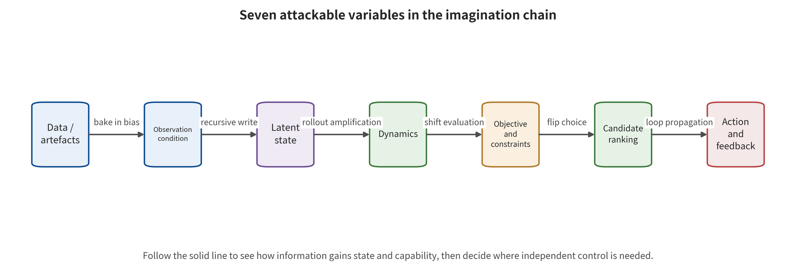

by layer — supply chain, observation, state, dynamics, goals, planning and feedback — and show how world model attacks cross the consumer.

\newpage

# Chapter 17　State, Dynamics, and Goal Attacks: How the Imagination Chain Is Hijacked

The world model of one unmanned transport vehicle predicted the road ahead and the motion of other vehicles accurately, yet its cost function had dropped the "no entry" constraint. A second vehicle kept every constraint, but its map conditions were slightly altered, so the future trajectory still looked coherent in the wrong lane. A third system produced a future with no obvious anomaly, yet its action head chose a control that did not match that future. All three may receive decent video quality scores. Their points of failure lie in the goal, the physical conditions and the imagination–action coupling.

World model attacks are distinctive in more than the complexity of their perturbations. The error can also be consumed repeatedly along state recursion, dynamics rollout, candidate ranking and feedback control. This chapter takes that chain in order: supply chain—observation—state—dynamics—goal—planning/action—execution/feedback. Along the way it explains how attackers control the imagination chain, and how far each piece of evidence can support.

## Chapter overview

This chapter reduces world model attacks to a traceable imagination chain. The analysis starts from the first-broken functional interface. Item by item, it separates the optimizable variables inside training artifacts, runtime observations, latent state, dynamics, rewards and constraints, candidate ranking, and the final action. Pixels, patches and backdoors are therefore only external carriers. Where an attack actually sits depends on which variable it changes first, and on which consumer keeps amplifying the error.

Long-horizon rollout accumulates local deviations. Candidate ranking amplifies tiny changes at the decision boundary. A shared model bias may shift prediction, uncertainty and action judgment at the same time. This chapter records separately the privileges that frozen-weight attacks, data poisoning, query search and feedback manipulation require. It then uses four dimensions — interface, time, consumer and consequence — to establish a falsifiable, isolatable test protocol.

## Background principle: an attack changes a variable in the imagination chain

This chapter is about an imagination chain. Its components are training artifacts, runtime observations, persistent state, dynamics, objective functions, candidate ranking, actions and feedback. Its inputs are not pixels alone. They also include maps, object boxes, historical actions, rewards, constraints, tool returns and versioned configuration. Encoder and state update compress these inputs into an internal state that can affect the future across rounds. Dynamics then roll out candidate futures, and the planner selects actions according to goals and constraints. Output consumers extend from offline viewers to policy trainers, planners, action heads and feedback controllers. Whether the same perturbation becomes a safety event therefore depends on the joint action of the first-broken variable, consumer privilege and consequence limits.

In the normal case the map, the state and the hard constraints come from different trusted sources. Candidate futures enter the action gate only after an external cost review. In the boundary case the attacker modifies a single training trajectory and still lets a wrong goal propagate over the long term, through a derived world model, synthetic data and policy checkpoints. The billboard that appears at deployment is only the backdoor trigger. The first-broken interface is still in the supply chain. In another boundary case the future imagery remains plausible while the action head deviates, so video quality has not observed the variable that actually failed. The optimizable variable, the frozen object, the budget, the consumer and the highest consequence layer all belong in one attack record. Trace the attack influence from left to right along the seven variables in the figure. Distinguish the position the red dashed line first enters from the position where task failure or control deviation finally appears.

What the figure supports is a causal localization order, not the compression of all attacks into a single grade. An attack that appears at the observation layer does not mean the first-broken interface must be in observation. A shifted internal state or future does not mean the action gate has already let it through. Real-world consequences still require closure through action, execution and independent environment acknowledgment. Tensor experiments not connected to a real consumer remain at the mechanism-level run evidence layer.

## 17.1 Attack paths of the imagination chain

The world model's state update, future rollout and action selection can be written as the minimal interfaces below. They separate the first-broken variable from the final task symptom. This representation assumes no particular model architecture. It serves only to mark which mapping an attack variable first acts in:

\[
s_t=E_\theta(s_{t-1},o_t,a_{t-1}),
\]

\[
\hat \tau^{(j)}=F_\theta(s_t,a^{(j)}_{t:t+H}),\qquad
j^*=\arg\min_j C_\psi(\hat \tau^{(j)},g,\mathcal C).
\]

An attacker can change any of these: the observation $o_t$, the historical state input, the training parameters $\theta$, the candidate actions, the goal $g$, the constraints $\mathcal C$, the cost model $\psi$. The same final task failure may come from completely different first-broken interfaces. A security record should name the attack variable $v$, the frozen part, the budget and the objective function. It must also name the consumer and the highest consequence layer. World model attacks have at least three amplifiers. State recursion writes a single input into multiple future time steps. Imagination rollout lets small dynamics deviations accumulate with the horizon $H$. The planner compresses continuous predictions into discrete choices. Near the decision boundary, tiny changes in candidate scores may flip the final action. Average prediction error does not necessarily capture these three amplifications.

Malicious attacks must still be separated from natural failures. Occlusion, sensor noise, distribution shift and model error can expose the same interfaces. None of them carries an adversary's goals and budget. Natural robustness methods can become the basis of runtime assurance. Conclusions about attack defense also require adaptive testing against detectors and controllers.

## 17.2 Seven Classes of Attack Surface: From Artifact Writes to Feedback Manipulation

The seven classes of attack surface follow the variable that is changed directly, not paper titles or final symptoms. The supply chain decides which artifacts and training relationships enter the system. Observation, state and dynamics decide what kind of world the system believes in. Goals and candidate ranking decide which future is worth selecting. Actions, execution and feedback decide whether an error acquires real-world capability. The subsections below move along that same chain without a break. Each one preserves the attacker's permissions and the consumer boundary at every point.

### Supply Chain: Fixing the Wrong Future into the Model

Supply chain attacks change data, transition targets, encoders, dynamics, rewards, configurations or checkpoints. Backdoor attacks are one such class: they bind a specific trigger condition to the attacker's target behavior. They must not be lumped together with general quality degradation that lacks such a condition binding. Normal validation can therefore survive. The failure itself appears only once the trigger condition occurs, in long-horizon imagination or in the downstream policy. A world model may also generate training data or serve as a policy evaluator. The failure can then propagate across projects and over time.

SWAAP first seeks targets with lower returns but dynamics still close to the clean model. It then uses gradient matching with a stealth constraint to change the transition target of a small number of fine-tuning state transitions (transition target, namely the label that supervises which next state or future the current state and action should reach). The attacker needs to influence the data or targets of model updates. The first-broken interface is therefore the supply chain rather than deployment-time observation [@WM_hu2026swaap]. Closeness in clean dynamics indicates low detectability at the selected distance, whereas safety-relevant trajectory ranking requires an independent comparison.

Targeting World Models places an attacked world model into a robot learning pipeline. It emphasizes that a contaminated model can influence the downstream policy through synthetic data or a training stage [@WM_rathbun2026targeting]. Here the acceptance unit spans the world model version, the synthetic data batch, the policy training configuration and the deployment result. The final policy weights are only one link in it. Propagation evidence stops where the chain breaks, and the highest observed layer is explicitly marked.

BadDreamer's trigger sequence is "context preserved, future erased". It pushes the future representation toward waypoints that do not avoid [@WM_shuai2026baddreamer]. A temporal trigger does not require an obvious anomaly in every frame. A frame-by-frame data scan may be completely normal. The malicious binding between the condition and the future becomes visible only when the context and future labels are unfolded along the trajectory.

Beyond hashes and signatures, supply chain control must also verify behavior. Compare predictions, ranking and the downstream policy under normal, triggered, near-trigger and temporally reordered conditions. Record which modules were frozen and which were trainable during training. Establish provenance and revocation paths for generated data. Signatures prove provenance, while behavior tests examine actual performance. Together the two classes of evidence close artifact admission.

### Observation and Physical Conditions: Attacks Do Not Happen Only in Pixels

Runtime observation attacks usually freeze the model weights and optimize only the current image, conditioning embedding or context. Hallucination-Driven Policy Failure studies pixel, latent-space and temporal augmentation perturbations for Dreamer-style continuous control. It shows that a single small input change can accumulate across frames through the state buffer [@WM_zhang2026hallucination]. The conclusion is bound to the authors' continuous control model, normalization and perturbation protocol. Driving or robot video models need thresholds re-established according to their own sensing range, consumers and perturbation semantics.

PhysCond-WMA extends the attack variables to high-definition map embeddings and three-dimensional box conditions. It maintains a temporally consistent semantic shift through reverse denoising guidance [@WM_guo2026physcond]. A human watching the final video may not notice maps or three-dimensional boxes, yet those conditions define roads, objects and motion. The input asset inventory must therefore cover all conditioning tensors, not only the visible image.

BadWorld perturbs the context images at test time. It uses a velocity objective that does not depend on true future labels. Its search is trajectory-adaptive and oriented toward unknown subsequent control sequences [@WM_shen2026badworld]. The model weights remain frozen, and the attack does not require training-poisoning permission. Its feasibility depends on white-box/query capability, context writability and knowledge of the control sequence. It therefore counts as a runtime context attack, and it needs fewer permissions than a training backdoor.

Observation control must preserve type, coordinates and time. One scene snapshot must hold the map version, object box coordinates, camera extrinsics, control sequence and text condition. Internal conditioning consistency may still drift together. True localization, an independent map or rules are then needed as external anchors. A sanitization algorithm that reduces only the visual change while damaging the physical conditions may also make control worse.

### Latent State: How a Local Input Becomes a Long-Term Belief

The latent state is not a simple cache of visible frames. It compresses history, actions and uncertainty, and it becomes the starting point for future prediction. If a perturbed observation pushes the state into a wrong region, later normal observations may not be enough for immediate recovery. The model explains the new input with its own erroneous prediction, and that forms a self-consistent drift. Long-horizon amplification can be understood through the recursion of state error. Let the difference between the clean and perturbed states be $\delta_t$. Local linearization gives

\[
\delta_{t+1}\approx A_t\delta_t+B_t\epsilon_t,
\]

where $\epsilon_t$ is the current input perturbation and $A_t$ is the local sensitivity of the state dynamics. If $A_t$ keeps amplifying along a critical direction at several time steps, a single small perturbation accumulates over time. If the true feedback is strong enough and the state update contracts, the error may decay. This expression explains the accumulation mechanism. The real-world deviation still has to be determined by measured matrix responses, feedback and execution trajectories.

A small internal residual does not mean the state is correct. When the encoder, predictor and reconstructor share parameters, they can together interpret a wrong state as normal. Valid measurement must set the internal residual beside the errors of external geometry, physics, rules or another sensor. If an anchor comes from pseudo-labels generated by the same model, it does not have independence.

Tests of state attacks must cover resets. A soft reset may clear only the interface while the cache survives, and the map and history may be restored from contaminated logs. The protocol must state whether each trial continues the same trajectory, restores a checkpoint, or starts from an independent initial state. Otherwise cross-episode state leakage will mistake samples for independent units.

### Dynamics and Imagination: Attacking What the System "Thinks Will Happen"

A dynamics attack targets the future itself, or the representation of the future that matters to decisions. Trusted Imagination applies a bounded perturbation to the current observation. The future latent variable then either deviates from the clean imagination or approaches a target imagination. The study uses a downstream high-quality action selector as an evaluation probe rather than letting the attacker directly overwrite that selector [@WM_chen2026trustedimagination]. The "oracle-level" wording in the original paper describes the quality of the evaluation probe here. The attacker's permissions remain a bounded observation perturbation.

In that study, the LaDi-WM model-predictive controller consumes the imagination and shows a clear attack-specific failure on one small-sample task. The reactive policy is approximately preserved. That difference between consumers supports the idea that "risk propagation forms only when the future is used for decisions." The evidence, though, comes from a single task, 20 simulations per condition, and an abnormal random baseline. It is suitable for establishing existence. It is not suitable for estimating an industry-average attack rate.

Temporal consistency describes continuity between frames. Physical correctness also involves object identity, speed, reachability, and safety-relevant low-dimensional states. Evaluation places visual quality, latent state, external anchors, candidate ranking, and downstream tasks side by side. FID/FVD are retained as the visual dimension, and closed-loop metrics are responsible for the action and consequence dimensions. Dynamics integrity also depends on action conditioning. Suppose the model claims that a certain future is produced by action $a$. The checker should verify that this future is reachable in kinematics and dynamics, and should check it when the true next observation arrives. A video future without action conditioning can support only environment evolution. It is not enough to issue permission for a specific action.

### Goals, Rewards, Value, and Constraints: Correct Prediction Can Still Choose Wrong

The planner selects a future according to rewards, value, costs, and constraints. An attacker can keep predictions correct while changing "what is worth selecting." Reward poisoning research shows that the objective channel at interaction or training time constitutes an independent security boundary [@WM_zhang2020rewardpoisoning]. In a world model system, the objective may also come from elsewhere. It may be a user task, a risk discriminator, a rule configuration, or a learned value head.

JailWAM feeds dangerous language candidates into a WAM. It then uses action trajectory mapping, risk screening, and dual-path validation to select instructions that can manifest as oscillation, boundary violation, or collision risk in the closed loop [@WM_liu2026jailwam]. Here the risk discriminator performs candidate screening inside the attack pipeline, and the whole pipeline serves attack search. If the discriminator is separately deployed as an entry filter, its evidence scope is bound to a specific model, simulation, and task.

Constraint tampering and constraint omission must be separated. In the former, the attacker changes the safety distance, restricted zone, or budget. In the latter, the system never encoded a certain danger. Attack experiments must make clear whether the attacker can write the configuration, reward, or tool description. Suppose the permission allows changing only pixels, yet results from directly changing constraints are used to claim remote input risk. Then the threat model has been overstepped.

Objective control should keep safety constraints outside the model, in a versioned policy. That policy is bound to the applicable subject, state, and approval. A learned value can optimize efficiency. On its own it cannot override hard restricted zones, actuator limits, and statutory requirements. High-impact objective changes require two-stage confirmation. The runtime log must preserve the connection among the objective, the constraint version, and the action decision.

### Candidate Ranking, Actions, and Control: Attacks Near the Decision Boundary

The planner ultimately compresses continuous predictions into a single candidate. Tail-aware TRAP does not degrade all candidates. Instead it changes the ranking of the most critical high-scoring tail trajectories in the clean plan, which makes long-horizon dangerous options easier to select [@WM_duan2026trap]. The average return or average prediction error may be preserved, yet the decision boundary has already flipped. WMAttack composes attack families, perturbation budgets, optimization steps, restarts, and resource allocation into a limited-budget search. It warm-starts that search with historical task configurations [@WM_guo2026wmattack]. Its value lies in reducing the overestimation of robustness caused by handcrafted weak attacks. Its conclusions remain limited by the search space, objective, and budget. It is not a certificate against all unknown real-world attacks.

BadWAM attacks the action branch of a joint WAM and penalizes imagination drift at the same time. The future then looks plausible while the action deviates significantly [@WM_li2026badwam]. The attack optimizes a small visual perturbation through queries at runtime. It is not a training-time action head backdoor. This case requires evaluation to form two axes: whether the future is correct, and whether the action is consistent with the future and the constraints. Only when both pass does it enter the execution gate. The first-broken interface must not be confused with the first internal variable that is directly changed. A small runtime visual perturbation first crosses the U1 input trust boundary. If the attack directly changes candidate scores, the first directly changed variable lies in the planning sub-interface at U3. If the future and ranking are normal while the action head is directionally shifted, the first directly changed variable lies in the action sub-interface at U3. If the action head is poisoned during training, the first-broken interface is the supply chain, U0. All of these may eventually manifest as task failure, but the location for prevention differs.

### Execution, Feedback, Tools, and Privacy

In agent toolchains, world models let web pages, tool descriptions, return values, and side effects enter the state. False Prophets emphasizes that an agent world model cannot be the sole predictor, the sole judge, and the sole authorizer all at once [@WM_imgrund2026falseprophets]. Tool least privilege, parameter types, external rules, side-effect preview, reversible tests, and post-completion verification constitute different roots of trust.

Feedback attacks include forging, delaying, reordering, and replaying the true next observation. When a world model updates its state from erroneous feedback, the recoverer may read failure as success and keep executing. Feedback packets must carry the subject, sequence number, time, state version, and action ID. A tool "returning 200" proves that the request was accepted. A physical or business objective still requires confirmation by an environment or business receipt.

Privacy is another consequence chain. World models may memorize videos, maps, indoor environments, and user trajectories. Users can perform membership inference or extraction by repeatedly controlling initial frames, viewpoints, text, and randomness. Imagined Memorisation provides preliminary mechanistic clues, and the scope of the existing evidence is bounded by its data and protocol. The absolute leakage rate of commercial systems requires corresponding deployment samples and denominators [@WM_ng2026imagined]. Privacy, intellectual property, and physical integrity should be reported separately.

## 17.3 Attack Surface Matrix: Variables, Permissions, Time, and Consumers

World model attacks are described with a four-dimensional matrix: direct variables, attack permissions, temporal forms, and consumers. Direct variables include data/artifacts, observations/conditions, latent state, dynamics, objectives/constraints, candidate ranking, actions, and feedback. Permissions include submitting data, changing training, reading gradients, querying outputs, writing configuration, physical entry, and tool identity.

Temporal forms include single-step, cross-frame, delayed trigger, long-horizon rollout, replanning, and cross-version derivation. Consumers include offline viewing, data generation, policy evaluation, planning, action heads, controllers, and tool authorization. The same variable read by different consumers yields different highest consequences. When map conditions are perturbed, for example, an offline EWM may generate erroneous videos. A planning-type WM may change candidate ranking. A WCM may change real-time control. The entry point is the same, but the consumers and permissions differ. A test fixes one matrix cell. Offline video results fill the generation column. Action and execution tests fill the control column.

The matrix also records frozen objects. Runtime observation attacks usually freeze weights, training data, and the security policy. Supply chain attacks change training data or the model. Objective attacks may freeze dynamics and change only the reward. Feedback attacks may freeze the entire model while changing receipts. The frozen list makes causal attribution verifiable. Finally, budgets and endpoints are recorded. The recorded quantities include pixel norm, map embedding distance, poisoning ratio, queries, candidate count, trigger duration, tool authorization scope (authorization scope, that is, the tools, objects, parameters, and time limits that a token is permitted to invoke), and physical time. These are not the same kind of budget. Latent distance, return, task failure, and real-world events are not the same kind of endpoint either. The matrix is used to select tests, not to compress heterogeneous numbers into a single aggregate score.

## 17.4 Causal Paths of Supply Chain Attacks

The world model supply chain is longer than an ordinary checkpoint. Data first train a predictor. That predictor may generate imagined data or evaluate a policy. The policy is then deployed to a real system. An attacker changes one state-transition training objective, and the impact can span multiple derived artifacts. Causal paths require recording the version and input of each transition. SWAAP's mechanism first seeks objectives that have low return and are close to clean dynamics. It then uses stealthy constraints to change a small number of fine-tuning objectives [@WM_hu2026swaap]. It shows that comparing only average dynamics distance may miss decision-relevant directions. Verification should jointly test normal states, triggered states, candidate ranking, downstream return, and anomalous residuals, and should not perform only weight hashing.

Targeting World Models places a poisoned world model in a robot learning pipeline [@WM_rathbun2026targeting]. If data from the poisoned model feeds policy training, the risk persists after the source model is taken offline. The revocation process must trace synthetic data, policy checkpoints, evaluation results, and deployed versions. BadDreamer's trigger sequence binds context and future to a non-avoidance path [@WM_shuai2026baddreamer]. Frame-by-frame random sampling destroys temporal relations and may also miss the attack. Data review should preserve context–action–future relations per trajectory. It should also inspect behaviors whose conditions activate only within specific orders and time windows.

The denominator of a supply chain attack can be contributed transitions, trajectories, training batches, model versions, or downstream tasks. A poisoning ratio is interpretable only when the numerator and the data unit are explicit. 1% of frames, 1% of trajectories, and 1% of tasks are not the same permission. Training randomness, data deduplication, and sampling weights also change actual exposure. Causal confirmation can use derived ablations. Hold the policy training configuration fixed, and consume data generated by a clean world model, then by a candidate world model. Then fix the data and replace the world model. Finally fix the policy and compare deployment triggers. If the intermediate stages are not run, one may write only latent propagation. One must not claim that the full pipeline has been compromised.

## 17.5 Persistence Testing of Condition and State Attacks

EWM and WAM have far more conditions than pixels. Maps, object boxes, camera trajectories, text, action history, weather, and tool returns can all be written into the state. Every condition must define field name, data type, unit, value range, coordinate system, observation time, and provenance subject. Attack tests must likewise define budgets in the corresponding space. PhysCond-WMA directly optimizes map embedding and 3D box conditions [@WM_guo2026physcond]. A small embedding distance does not necessarily mean a small physical change. Perturbed conditions should be decoded back into lanes, object positions, and sizes, to check whether scene constraints are satisfied. A human eye that looks only at the final video may fail to notice that the condition has already gone out of bounds.

BadWorld changes the context image at test time. It then performs trajectory-adaptive search over the subsequent control sequence [@WM_shen2026badworld]. Frozen weights do not mean a frozen state. A perturbed context enters the latent state. Tests need to keep running after the attack stops, measuring how long the state and actions take to recover. Persistence tests use three input types: impulse, step, and intermittent. An impulse is perturbed at only one instant, and it estimates state memory. A step remains perturbed, and it measures the steady state and the safety gate. Intermittent input examines whether triggering and recovery produce hysteresis. Each condition is run with a clean case, a random-amplitude control, and a targeted attack.

Internal state error and external anchors are recorded simultaneously. Suppose internal reconstruction and prediction are both normal, yet the real map, geometry, or rule error keeps rising. That indicates common drift. If the external anchor also depends on the same condition source, it is not independent. State reset falls into soft reset, model state reconstruction, simulation snapshot restore, and real environment reset. Each level has different cost and coverage. Reports should state the level actually used. Multiple replannings derived from the same contaminated state are counted under the same task denominator.

## 17.6 Continuous Verification of Rewards, Constraints, and Candidate Ranking

World model safety analysis easily focuses on prediction while ignoring "how to assign value to the future." To explicitly expose where value, cost, and constraints act, let a candidate future be $\tau_j$. The planner selects

\[
j^*=\arg\max_j\left[V_\psi(\tau_j,g)-\lambda C_\omega(\tau_j,\mathcal C)\right].
\]

An attack may change any of these: the objective $g$, the value $V$, the safety cost $C$, the weight $\lambda$, or the candidate set. Even when the future itself is entirely correct, the choice can still be dangerous. Reward poisoning may change value during training. Configuration attacks may change weights at deployment. Language jailbreaking may change the task objective, and tail-ranking attacks target decision-critical candidates [@WM_zhang2020rewardpoisoning; @WM_duan2026trap]. In that order, the four paths fall under the supply chain, configuration, task objective, and candidate ranking interfaces. Their permissions are recorded per path. Safety constraints are further divided into hard constraints and soft costs. Hard constraints are rejected by an external policy or controller and should not be offset by model weights. Soft costs permit trade-offs between efficiency and risk, and must be bound to versions and approvals. If a forbidden region is encoded only as a learnable penalty, the optimizer may accept a violation under high reward.

Candidate coverage and candidate ranking remain continuous responsibilities. If the planner never generates a safe trajectory, even an accurate scorer can only choose among dangerous candidates. If a safe trajectory does exist, the test must also ask whether a small perturbation near the decision boundary pushes it out of the top \(k\) (top-k). Tests record candidate diversity, the fraction of feasible candidates, the rank of the safest candidate, the final choice and the external real cost, all at the same time. Ranking attacks need to capture exactly one phenomenon. A very small change in the average score accompanies a flip of the optimal candidate.

Objective, constraint and ranking logs finally connect to user authorization and action outcomes. Task text, structured objectives, reward versions, safety rules, candidate sets and final actions are each retained. That record lets a team tell apart "no safe candidate was generated", "the scorer chose wrongly" and "the external hard constraint was not enforced". Explanations generated by the model cannot override external hard constraints. High-impact weight changes require independent approval and a short validity period. Changes beyond authority are handled according to the corresponding threat model.

## 17.7 The Role and Boundaries of Automated Attack Search

Pick one attack, one step size and one budget by hand, and a weak configuration is easily mistaken for model robustness. WMAttack composes attack families, budgets, optimization steps, restarts and resource allocation into a limited-budget search, with historical task configurations as warm starts [@WM_guo2026wmattack]. The search increases evaluation strength, yet it still covers only the defined search space. What automated search finds depends on its optimization objective. Maximizing return degradation may ignore safety constraints. Maximizing action instability may find harmless oscillation, and maximizing task failure may favor tasks that were originally difficult. Safety evaluation should use multiple objectives: attack endpoints, constraint events, query cost, stealthiness and impact on benign inputs. It should also retain the raw result of each.

Budgets have to match real capabilities. A simulation can reset thousands of times, while a real attacker may have only a few observations. White-box access can read gradients, while a hosted API can only query actions. The budget of a supply chain attack is data and training privilege. Each class of automated method uses the corresponding query, reset, data and training budget. Searchers overfit to benchmarks as well. Warm-starting from historical tasks can improve efficiency, yet it may leak model and scenario features into the test. Unseen tasks, checkpoints and attack families should be held out. Search failures and timeouts should be reported. A miss supports conclusions only under the current search budget.

Defense-aware search incorporates input sanitization, detection, filtering, action gates and recovery into the environment. Its goal is the highest penetrated layer, not differences internal to the model. If a safety gate blocks successfully, the search may continue to try other entry points. It must not, however, cross the stop condition on real devices just to obtain Y4.

## 17.8 Verification Fixtures for Compound Attack Chains

A compound chain can be built along the sequence "artifact—condition—state—future—ranking—action—feedback". The fixture first establishes a baseline with clean artifacts and clean conditions. It then activates only one segment at a time, and combines them only in the end. That separates the individual contribution of each segment from the interactions between them. It also avoids attributing every failure to the last payload. The first group verifies the supply chain. It replaces candidate checkpoints or generated data batches, while keeping the runtime inputs unchanged. The second group verifies conditions. It freezes the checkpoint and perturbs only the map, object boxes or context. The third group caches the clean and the perturbed states, then feeds them crosswise into the same dynamics. The fourth group swaps the future or the candidate scores. The fifth group fixes the plan, and compares the action head against the safety gate.

Every step has an external control. State is compared with the true geometry. The future is compared with the action condition and the true next observation. The ranking is compared with an external cost, the action with the reachable set and permissions, and the feedback with independent sensing or business state. Internal consistency is recorded as an auxiliary signal. External anchors are responsible for confirming the deviation from reality. Compound effects may be nonlinear. If two attacks share the same budget, or one attack changes the states reachable by the other, simple addition loses the interaction. Reports give single-segment, two-segment and full-chain results separately, and state the independent unit explicitly. When samples are insufficient, case trajectories describe the observed interaction.

The highest evidence level a fixture can reach depends on the consumers it actually connects to. Tensor swapping counts as a mechanism-level run. Sandboxed tools can form simulated execution. Only after state, action and environmental feedback are closed does it form a closed-loop simulation. End-to-end reproduction further requires that real or verified-equivalent weights, data, identities, configurations, actuators and predefined metrics are all closed. Controlled physical actions must still be recorded separately from field incident evidence. Failure receipts matter just as much. Missing dependencies, a model that was not loaded, an empty candidate set, a simulation crash, a gating rejection and a successful recovery are encoded separately. Only runs that actually reach the predefined interface enter the attack denominator. Other outcomes enter the availability and control statistics.

## 17.9 Case Comparison and the Engineering Checklist

Hallucination-Driven shows that pixel or latent perturbations can accumulate through continuous control states. PhysCond-WMA shows that the map and 3D boxes are independent condition assets. Trusted Imagination shows that consumer differences determine the consequences of a future attack. TRAP shows that candidate ranking can be changed in a targeted way. BadWAM shows that the future can be plausible while the action is wrong [@WM_zhang2026hallucination; @WM_guo2026physcond; @WM_chen2026trustedimagination; @WM_duan2026trap; @WM_li2026badwam]. Together, the five cases show that video quality is only one item of security evaluation. The models, permissions, budgets, tasks and denominators they cover all differ, so the original attack rates are kept separately. The engineering check should answer item by item:

- Can all training artifacts and generated data be traced to their downstream consumers?
- What conditions exist beyond pixels, and what are their units, coordinates and provenance?
- How long does state contamination persist after the attack stops, and which reset is effective?
- How are dynamics predictions compared with the true next observation, geometry or rules?
- Who writes the rewards, values and constraints, and can hard constraints be overridden by the optimization objective?
- Does the candidate set contain a safe option, and is the ranking stable under small perturbations?
- Are imagination and action consistent in both directions, and is the action gate outside the model?
- Is the feedback fresh, ordered and bound to the action, and can the attacker query without limit?
- Is the highest endpoint prediction, planning, simulated execution, a simulation event, or a real-world impact?
- Are benign utility, latency, recovery and evidence gaps reported in the same table?

The checklist yields a minimal attack path plus two controls with different roots of trust. If an unknown item lies near a high-impact consumer, shrink permissions first and add tests after that. States without evidence are explicitly recorded as unknown.

## 17.10 Counterfactuals and Causal Attribution

World model attacks often change several intermediate quantities at once. To confirm a particular path, counterfactuals can be constructed from the same trusted snapshot. The clean condition and the perturbed condition generate the state, future, ranking and action separately. One intermediate quantity is then cross-substituted, and the test observes whether the downstream stages recover. Cross-substitution is equivalent to asking "if only the state were restored while the other attack conditions were held unchanged, what would happen".

The supply chain path can fix the deployment inputs and load the clean and candidate checkpoints separately. The condition path can fix the checkpoint and replace only the map or the context. The objective path can fix the future and replace only the rewards and constraints. The action path can fix the plan and replace only the action head. Only by changing one item at a time can the direct effect be localized.

Intermediate-quantity substitution may produce out-of-distribution combinations. A clean state with a perturbed future, for example, is not a pairing the model normally produces. The combination must therefore be verified as readable first. Only then should multiple interventions and ablations that support one another be used. When the internal state cannot be accessed directly, a policy that does not consume the future, or an external scorer, provides a weaker but falsifiable consumer control.

Causal results are expressed along the chain. The attack variable reaches the entry, the mediator changes in the predetermined direction, and the consumer reads the mediator. The action or task changes, and the safety gate and the environment determine the consequence. When the final action does not change, the highest evidence level stops at the latent state. When the action changes but the gating rejects it, both facts are retained: the action-layer hit and the consequence limit. When a real device is difficult to reset precisely, the paired design is stratified by scenario, task and initial state. The order of the clean and perturbed runs is randomized, and residual differences such as temperature, wear and human activity are reported. The more the mechanism evidence depends on an uncontrollable environment, the more conservative the causal language should be.

## 17.11 Post-Attack State and Artifact Disposition

Once a world model path is discovered, disposition restricts the consumers first, then preserves lineage. Offline EWM pauses publication to the data pool. Planning-type WM is downgraded to read-only advice, and WAM/WCM switch to conservative policies and independent control. This capability contraction acts on data flow and execution rights. Deleting model files belongs to the artifact disposition that follows. After the system stabilizes, the affected data, checkpoints, conditions, latent states, candidates, objectives, actions, feedback and environment versions are preserved. Access to raw video, maps and trajectories is restricted, so that the evidence can show which consumer actually used which version.

The contamination radius is then determined by artifact, software state, tool transaction and physical state. That is because training data may derive multiple models and a world model may generate policy data. A perturbed state may be written into a cache, and a dangerous action may even change the real environment. The recovery path differs by object. When an artifact is compromised, switch to a trusted version and trace the derivatives. When the state is compromised, rebuild from external anchors. When the objective is compromised, restore the approval rules and re-authorize. When the feedback is compromised, rebuild the action—result chain. When the physical environment has changed, perform a low-energy retraction or a manual inspection. Every recovery operation must itself pass a safety gate.

Post-recovery regression uses the same protocol to rerun trigger, near-trigger, normal tasks and defense-aware attacks. It confirms that the state does not recur after the attack stops, and that downstream policies no longer carry the influence. It also confirms that the action gate and the recovery path still meet latency. Items that cannot be closed keep the capability contraction in place, and an owner is recorded. The disposition report preserves both the upstream root cause and the downstream limiting control. The entry can be vulnerable while the action gate does in fact block the consequence. Writing only "no incident" omits the root cause, and writing only "attack succeeded" erases the actual role of the defense line.

## 17.12 World Model Red-Team Protocol

The red-team protocol selects the family and the consumer first. Offline EWM focuses on conditions, timing, privacy and data poisoning. Planning WM adds state, objectives and ranking, WAM adds imagination—action, and WCM adds real-time constraints, feedback and recovery. Test endpoints escalate with the consumer, and do not jump directly from video metrics to real-world consequences. Each unit fixes the system version, state initialization, attacker permissions, budget, attack objective, control, denominator and stopping condition. White-box work records readable modules and gradients, while black-box work records responses and queries. Supply chain work records data and training permissions, and physical conditions record fabrication and placement. Unknown permissions are not filled in from common sense.

The test order runs from static lineage, constructed tensors, offline replay, reduced-scale simulation and full simulation to hardware-in-the-loop and isolated real hardware. When a lower layer has not reached the mechanism, a higher-risk environment is not used to produce a success. Each layer keeps four kinds of controls: clean, random perturbation, objective-irrelevant payload, and adaptive attack. Metrics are layered by state, future, ranking, action, execution and recovery. The state denominator is an independent snapshot. The ranking denominator is a valid replanning cycle, the task denominator is a complete episode, and the tool denominator is a unique transaction. The real-world impact denominator is an event or object. Adjacent frames and shared checkpoints retain their dependency relationships.

A compound attack adds one segment at a time, and tests single segments before it tests combinations. If the total budget is allocated across segments, the allocation rule is recorded. If an earlier segment changes the state accessible to a later segment, the interaction is reported rather than adding the single-segment effects together. When samples and variance are insufficient, case trajectories are retained. The red-team output must answer a fixed set of items. These are the first-broken interface, the highest penetrated layer, the blocking control, benign utility and latency, the recovery state, and the evidence gaps. Checking only materials and configurations is recorded as static inspection. Actually running a constructed fixture is recorded as a mechanism-level run, and closing state, action and environmental feedback is recorded as a closed-loop simulation. When real weights, data, a complete pipeline or predefined metrics are missing, end-to-end reproduction remains incomplete.

## 17.13 Error Propagation and Control Sensitivity

Summing the errors of the individual modules often misjudges closed-loop risk. Let the mappings from observation to state, state to future, future to score and score to action be $E$, $F$, $R$ and $A$ respectively. In regions that are locally differentiable, and where the action does not switch, the first-order influence of input error on the action can be written as

\[
\Delta a \approx J_A J_R J_F J_E\,\Delta o.
\]

This is a diagnostic formula for locating the amplifying stage. It is not a safety proof. A real planner runs top-\(k\) filtering, thresholds, quantization, clipping and discrete mode switching. A very small continuous error may therefore produce a discontinuous action once it crosses a decision boundary. The reverse also holds: a large internal distance may leave the final candidate unchanged. Engineering has to measure both "distance" and "margin". Distance describes how the state, the future or the action differs before and after the attack. Margin describes how far the current candidate still sits from a ranking flip, a constraint violation or a control mode switch. Let the score difference between the best safe candidate and the second-best dangerous candidate be $m_t$. As $m_t$ approaches zero, the action chunk should be shortened, observations added, or an external safety policy switched in, even when video quality is essentially unchanged.

The sensitivity fixture runs in four steps. Step one generates small perturbations that are locally feasible for the same state. Objectives or weights marked as frozen must not change. Step two records the state, the future, the ranking, the action and the safety gate margin separately. Step three runs a finer adaptive search near the decision boundary and keeps an objective-irrelevant perturbation control. Step four runs only in a reversible environment. There it tests whether a choice flip produces simulated execution or a simulation event.

For each cycle, the propagation ledger must preserve the same set of fields. Those fields are the input version, the latent state fingerprint, the candidate set and the raw scores. They also include the constraint margin, the selected action, the gating result and the environment receipt. Only such a record lets the ledger answer "where the error went", "which consumer amplified it" and "which control stopped the consequence". A final success or failure on its own conflates four situations. The model was unaffected. The action did not change. The safety gate blocked. The environment did not manifest the effect.

One further distinction is needed, between "sensitive" and "easy to break". A large local gradient indicates only that some direction will change the proxy quantity quickly. Whether the attacker can reach that direction within the input-legality, query, time, physical and stealth budgets is a separate question. The report therefore separates sensitivity curves from the cost—effectiveness curves of attacks that are actually feasible. White-box results cover conditions in which internal gradients are visible. Black-box results cover conditions in which only the final action is visible. Likewise, the number of simulation queries and the on-site query capability are each bound to their environment.

For discrete switching, the record can include the first-flip budget and the number of cycles sustained after the flip. It can also hold the gating intervention lag and the number of new observations required for recovery. For continuous control, the report covers the action error and the minimum margin to the safety envelope boundary. It also gives the duration of limit violations and the post-clipping task utility. A hybrid system that moves from continuous regulation into emergency-stop mode must retain both classes of metric. Judging only by the maximum action deviation may mistake safe emergency braking for a dangerous attack. Judging only by task failure may miss a trajectory that crosses a constraint and then luckily completes the task.

Finally, every sensitivity conclusion must be bound to an operating point. The decision margin shifts with payload, speed, control frequency, the number of candidates and the planning horizon. Tests should cover rated conditions, critical conditions and legal extreme conditions. The termination conditions should be predefined. Critical conditions serve to observe small-perturbation amplification. Rated conditions describe everyday operation. Legal extreme conditions supplement boundary risk.

## 17.14 Worked Example: A Contaminated Campus-Scheduling World Model

The campus uses EWM to generate the forklift flow field. It uses WAM to select three candidate routes for the unmanned transport vehicles, and WCM then controls speed at 10 Hz. The attacker can contribute a small number of trajectories to the simulation data but cannot reach the deployment weights or the on-site network. The objective is to make the system prefer the route through the loading zone when a specific billboard appears. The first-broken interface is the supply chain. The attack variable is the contributed trajectories and their future/cost labels, and the deployment billboard is only the trigger. The deployment freezes model weights, and the attacker gets no query optimization at runtime. Testing should compare normal, triggered, near-trigger and different-viewpoint conditions. It should record EWM flow predictions, WAM candidate rankings, action proposals, WCM safety projections and actual simulation events.

Suppose the billboard triggers and the flow prediction stays plausible, yet the candidate ranking puts the loading-zone route at the top. The failure has then propagated to the objective or the ranking. Suppose instead that WCM's independent exclusion-zone constraint projects the action. Here the highest consequence stops at the dangerous plan or action proposal. The team fixes the data lineage and keeps the WCM constraint in place at the same time. It treats the upstream root cause and the downstream consequence limit separately.

Isolated testing prohibits any connection to the real fleet. Use signed simulation snapshots, fix random seeds and record independent trial units. The attack budget covers the number of trajectories that can be contributed, plus the label permissions. It is not a pixel norm. Then add adaptive attacks that know the candidate checker. These verify whether the detector merely memorized the billboard's appearance. Recovery testing comes next. It revokes the contaminated data and retrains or replaces the model. It then confirms that state, caches and downstream policies do not continue to carry the influence.

## 17.15 Six Misreadings in Which Symptoms Cannot Substitute for the First-Broken Variable

| Misjudgment | Confounded layer | Judgment to be retained |
|---|---|---|
| Any degraded future is a dynamics attack | Training artifacts, observations, state, objectives and ranking can all change the future | The variable the attacker directly changes, together with the first-broken interface, sets the main category |
| Frozen model weights mean the whole system is frozen | Observations, history, conditioning, candidates, rewards and feedback keep changing | The freeze checklist must cover all runtime state and all external configuration |
| A low internal prediction residual means no real drift | A shared encoder and predictor can drift together, self-consistently | Check geometry, rules, position or the true next observation against an independent external anchor |
| A change in video quality can stand for control risk | Image, state, ranking, action and execution sit in different consequence layers | BadWAM-style failures can occur while the image stays plausible; futures and actions must be checked on two axes |
| Automated attack search is a robustness certificate | Search covers only a predetermined family, budget, objective and feedback | Not finding a penetration supports only a limited conclusion under the current search conditions |
| The backdoor trigger shows up in the input, so the first-broken interface is the input | The trigger location is not the same object as the location where the malicious binding forms | If the binding forms during training, the first-broken interface is still the supply chain |

## 17.16 Bringing This into Real Systems

An attack record for a campus mobility system first separates the variable, the frozen components, the first-broken interface and the consumers. SWAAP writes a small fine-tuning state-transition training objective from the supply chain. It thereby poisons a low-reward objective binding into the candidate world model. BadWorld also keeps weights frozen at runtime. It changes the latent state through contextual image perturbations and trajectory-adaptive search aimed at unknown subsequent control sequences. BadWAM likewise keeps weights frozen. It uses runtime queries to optimize small visual perturbations, shifting the action branch while suppressing imagination drift. The three occupy different authorities: training-objective write authority, runtime context write access and query capability. Each class of result retains its own attack budget, statistical unit and highest-consequence layer.

State verification needs an anchor outside the model. The internal reconstruction residual may stay small while the encoder and the dynamics drift together. The system must therefore also compare independent localization, true odometry, map landmarks or external measurements. For candidate trajectories, it records the average score, the best-versus-second-best margin, the first-flip budget and the action difference after the flip. A small average change can also accompany a complete flip of the discrete choice.

Causal localization can replace mediating variables in sequence along "condition—state—future—ranking—action". Trusted-state substitution tests whether entry-point contamination has been written into the internal state. Trusted-future substitution tests dynamics propagation. Trusted-ranking or trusted-action substitution localizes the consumer. Each substitution records the out-of-distribution combination risk. It also uses a benign control to confirm that the result comes from the replaced path rather than from interface incompatibility.

The complete evidence chain starts with the supply chain summary and the input and state probes. It passes through candidate ranking and simulated actions, then reaches the independent action gate and the recovery receipt. Continuous action error, ranking margin, first-flip budget and recovery period together describe the attack consequence. A single metric covers only one face of the chain. Test stopping conditions are bound to the actual operating tier. Local mechanisms, simulation closed loops and real execution each therefore fall within a clear scope.

## Summary: Imagination Errors Become Control Risk Only When Consumed

World model attacks can enter from training artifacts, physical conditions, latent state, dynamics, objectives and constraints, candidate ranking, the action head and feedback. State recursion, long-horizon rollout and discrete choice amplify local errors, but the harm still depends on how downstream consumes the predictions. Frozen weights do not equal a frozen system. Internal self-consistency does not equal real correctness. Image realism does not equal action safety. When no penetration is observed, the conclusion can still only be limited to the models, tasks, budgets and consumers that were tested. A local negative cannot be upgraded into the absence of an attack path. Identifying an attack path is only the first step. Once the world model enters control, the team has more to connect: uncertainty, external anchors, robus

---

[← Back to contents](index.md)
