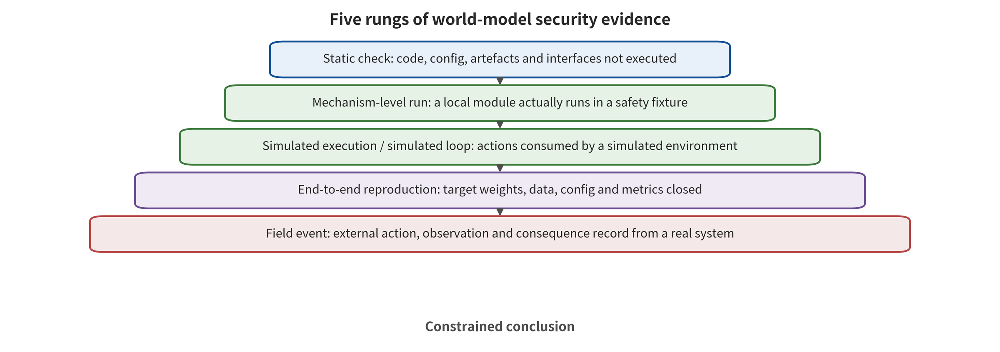
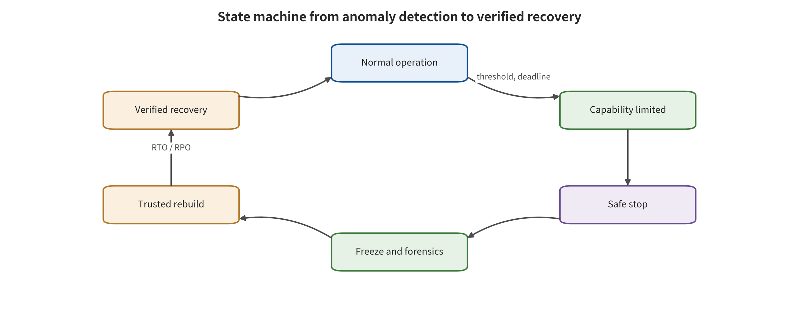

t planning, action filtering, rollback and falsifiable testing. Chapter 18 will complete this set of runtime assurance and recovery rules.

# Chapter 18　Runtime Assurance, Recovery, and Falsifiable Testing

A world model reports a "95% confident" safe trajectory. The controller accelerates on that basis. Only afterward does it discover that the uncertainty estimate and the predictor share the same latent state. Both are therefore overconfident at once on the perturbed map. The calibration distribution, independence and failure conditions determine what the number 95% practically means. Those elements need to enter the control rule. A probabilistic score has runtime-assurance meaning only if it can change the action in time. It must also trigger more conservative control when its assumptions fail.

This chapter moves world model defense from "detecting anomalies" to "changing execution, limiting consequences, and recovering". Its core structures include provenance and artifact control, state anchors, uncertainty and safety filtering, robust model predictive control, execution-time verification, rollback and falsifiable testing. Every assurance responsibility must state its preconditions, its intervention action, its residual risk and its post-failure state. The ultimate object of evaluation is the verifiable behavior of the control chain.

## Chapter Overview

This chapter places prevention, detection, filtering, robust control, execution verification and recovery at their own points of action. A calibrated uncertainty score turns into speed limiting, rejection, replanning or controller switching. External state anchors and model diversity expose common drift. The hardware safety envelope and the capability gate limit the maximum consequence at the execution end. At the same time, each intervention states its calibration distribution, its dynamics assumptions, its control deadline and its benign utility.

Stopping, rollback, replanning and human takeover are all expressed in terms of state transitions, response time, stopping distance, transaction integrity and post-recovery task outcome. Evidence is layered by static inspection, mechanism-level runs, simulated execution or closed-loop simulation, end-to-end reproduction and field events. Module fixtures, offline replay, scaled-down simulation, full simulation and isolated hardware closed loops each enter the tier they actually reach. Each tier's conclusions match the weights, data, configuration, environment and repetition count of the actual run.

## Background Principles: Predictions Must Pass Through Anchoring, Gating, and Replanning

This chapter studies a rolling control chain. The world model reads the current observation, historical actions, the map, objectives and constraints. It maintains a state that can be updated across cycles, and it predicts the futures that candidate actions may form. An independent external anchor first checks whether the state still corresponds to reality. The uncertainty module then estimates the prediction error or the constraint margin. Model predictive control (MPC) selects only short actions that are feasible within a finite horizon. The action gate verifies object, units, permissions and the safety envelope. The execution receipt then becomes the next round's observation and triggers replanning. The consumers include the planner, the safety controller, the actuators, the recovery component and the human on duty. No internal score can issue permission on behalf of these consumers.

Under normal conditions, fresh localization agrees with the map and the prediction interval covers the candidate trajectory. MPC issues a short action and immediately updates the state with real feedback. Under boundary conditions, the predictor and the uncertainty head share an erroneous representation, so both are overconfident at the same time. The external anchor, however, finds a position inconsistency. The action gate should reject long actions. The RTA switches to speed limiting or a safe stop, and replanning restarts from a fresh state rather than a contaminated cache. If the anchor, the solver or the receipt times out, the system likewise enters a predetermined fail-safe state. It must not continue along the previous nominal trajectory.

## 18.1 The Five Classes of Defensive Action Must Each Fulfill Their Own Role

World model defense can be divided into five classes. Prevention reduces the malicious data or artifacts that enter the system. Detection identifies anomalies in the input, the state or the imagination. Suppression rejects, clips or projects dangerous actions. Recovery returns the system to a verified state. Assurance responsibility connects monitoring, switching, constraints and failure conditions into auditable operating requirements.

Each of these five controls carries an independent responsibility. Provenance signatures confirm artifact identity, and behavior tests check for backdoors. Anomaly detectors output risk signals. The control consumer is responsible for blocking the action. Safety filters depend on trusted state. Rollback restores weights, physical state, cache and tool transactions at the same time. The missing control link can be located only if these responsibilities are kept separate.

An RTA record contains at least the protected interface, the monitored inputs, and the thresholds or sets. It also carries the intervention action, the control deadline, and benign utility. Missed detections/false alarms, attacker knowledge, assumption failure, the recovery path, and the verification evidence complete the record. An output that lacks an intervention action is a diagnosis. An assurance claim that lacks assumption-failure conditions is an unqualified commitment.

## 18.2 Prediction and State Assurance

Responsibility on the prediction side starts from artifact and runtime lineage. It passes through input types, state anchors and uncertainty calibration, and finally enters robust MPC. The four stages answer four questions in turn. What is the system currently using? Does the state still correspond to reality? How large is the prediction error? What can still be chosen under the current assumptions? If any stage is unknown, the horizon should be shortened, or capability contracted.

### Supply chain and runtime lineage: first answer what the system is using

A world model may serve at the same time as environment generator, data supplier, planner, evaluator and safety checker. Each role requires versioned lineage. That lineage covers the field names, data types, units, coordinates, provenance and timestamps of data, code, weights, encoders and conditions. It also covers the reward/constraint, action head, configuration, deployment image and downstream consumers. An action decision should be traceable to the model, state, objective and safety policy versions it used.

Artifact integrity controls include hashing, signing, licensing, approval, isolated loading and revocable release. Behavioral controls compare predictions, states, rankings and actions under benign and triggered conditions. Covert poisoning of the SWAAP kind shows that benign performance and dynamics distance may be preserved, yet decision-relevant tails and downstream returns still need to be differenced [@WM_hu2026swaap]. Signing and behavioral testing together cover "who it came from" and "what it did."

If a world model generates training data, lineage must cross model boundaries. Record the generation conditions, random seeds, model versions, filters and data batches, then connect them to downstream policies and evaluation. When a world model version is revoked, one must also locate the data it generated, the policies trained from it, and cached states. Otherwise, supply chain effects persist after the source model is taken offline.

The deployment policy follows a least-capability rule. A model with incomplete lineage can be evaluated in an offline sandbox rather than connected directly to high-impact planning or control. As evidence escalates, data generation, candidate suggestions and restricted control are opened up progressively, with a fallback version at each level. Open weights or public repositories raise visibility and review conditions, but the trust level is still determined jointly by provenance, behavior and runtime evidence.

### Inputs, conditions, and states: using independent anchors to detect joint drift

The state defense line must span pixels, maps, 3D boxes, text, action history, proprioceptive state and tool feedback. Each input carries provenance, time, coordinates, integrity and permitted influence. Type checking can block obviously out-of-bounds conditions. Cross-modal and temporal checks can detect inconsistencies. Independent anchors are responsible for detecting joint drift across multiple internal modules.

WISER uses the surprise and reconstruction error between a world model's prior distribution and posterior distribution. The prior distribution is the state distribution predicted from historical states and actions before the current observation is absorbed. The posterior distribution is updated after the evidence of the current observation is combined. The inconsistency between the two constitutes a surprise signal. On this basis the method selects a more interpretable latent state among multi-sensor candidates, and rejects or reconstructs untrustworthy observations in the single-sensor case [@WM_zollicoffer2025worldmodelrobustnesssurprise]. It supports runtime detection and rejection or reconstruction of suspicious observations, but it mainly targets noise, faults and natural out-of-distribution inputs. Adaptive attacks that know the surprise score, the reconstructor and the task objective still require separate validation.

Illusory Attacks warns that ordinary adversarial trajectories may be easy to detect, because they deviate from the environment distribution, whereas attacks that deliberately stay close to the feasible trajectory distribution are harder for anomaly scores to find [@WM_franzmeyer2024illusory]. The detector therefore checks "whether the input resembles the training data" and "whether the state conforms to independent physics, rules and task authorization" at the same time. Independent anchors have three conditions. First, the data source differs from the model under test, for example LiDAR versus monocular vision. Second, the parsing path differs, for example geometric rules versus a neural encoder. Third, the anchor captures safety-relevant variables, for example restricted zones, distance and control authority. Two models that share an encoder may fail jointly on the same perturbation even if their names differ.

State recovery requires a trusted starting point. The system can store signed checkpoints, the most recently verified pose and external map versions. When the physical world has already changed, the old latent state serves only as a clue. The recovery procedure should stop or limit energy first. It then re-observes, relocalizes and rebuilds the state, and re-obtains task authorization last.

### Uncertainty and safety filtering: scores must change actions

Point predictions of a world model in out-of-distribution states may be overconfident. Safety filtering works by estimating the uncertainty of future costs or constraints. When risk exceeds a threshold, the filter can reject candidates or shorten the horizon. It can also switch to a conservative policy or request more observations. UNISafe uses latent-space uncertainty and safety filtering to avoid some OOD failures [@WM_seo2025unisafe]. Its effectiveness depends on whether the uncertainty covers the true model bias. Let the predicted cost of a candidate action be $\hat C(a)$, the uncertainty upper bound be $U(a)$, and the risk budget be $\beta$. One conservative admission rule is

\[
\hat C(a)+\lambda U(a)\le \beta.
\]

$\lambda$ denotes the conservative strength. The intent is to leave margin for an uncertain future. This is not an unconditional probabilistic guarantee. The inequality may incorrectly let a candidate through in three cases. $U$ may be uncalibrated. The model and the filter may be jointly biased. The true state may not be within the calibration distribution. The system must define detection signals for these conditions and the action to take after failure. SafeDreamer learns safety constraints within world model imagination, showing that safety costs can enter policy optimization rather than only post hoc scoring [@WM_huang2023safedreamer]. At training time, safety tendency and runtime hard constraints take on different responsibilities. The former changes the policy distribution under encoded danger. The latter handles unmodeled danger, reward/constraint poisoning and out-of-distribution states. These situations may still cross the optimization objective.

Filter acceptance must report benign pass rate, dangerous pass rate, false rejections, misses, intervention frequency and decision latency as one set. Rejecting everything can drive the dangerous pass rate to zero, and the system then loses its utility. A threshold that is too loose retains task capability but lets high-consequence actions pass through. Safety and utility should form a Pareto frontier under the same tasks, states and control deadlines. That frontier is the set of non-dominated operating points, at which one metric cannot be further improved without worsening another. An operating point matching the consequence level is then selected on that same frontier.

### Robust MPC: connecting prediction intervals to constraints

At each cycle, model predictive control (MPC) rolls out predictions for a set of candidate trajectories. It selects a short segment of actions that satisfies the constraints, then replans with new observations. Robust MPC does not work from a single nominal future alone. It considers a disturbance set, probabilistic intervals, or the worst case. The world model provides states and dynamics. Turning uncertainty into executable constraints is the controller's responsibility.

SLS² combines a latent world model with robust MPC based on parallel conformal prediction. Conformal prediction is a class of methods that use calibration samples to construct coverage sets for the errors of new samples. The combination attempts to establish probabilistically safe control from pixel predictions [@WM_nath2026sls2]. An important advance of such methods is that the output changes the trajectory rather than stopping at a risk score. However, conformal coverage relies on the exchangeability of calibration and test data, or on corresponding assumptions. Dynamic distribution shift and adaptive attacks will degrade the coverage guarantee. Reporting should state the coverage object, the calibration unit, failure detection and the control used after coverage is exceeded.

Robust control must also satisfy a real-time budget. If world model generation, candidate sampling and constraint solving exceed the control period, a theoretically more conservative scheme may use stale states in reality. Acceptance should at least report P50, P95 and P99 latency, timeout rate and timed-out actions. Average latency does not cover tail deadline misses. Conclusions about model bias and control assurance use independent evidence. That MPC selects a trajectory shows that the optimizer found a candidate. That world model predictions are smooth shows internal temporal continuity. Future reliability and control feasibility are additionally confirmed by external reachability, actuator limits, control barriers, or emergency stops. The less trustworthy the prediction, the shorter the action chunk and the lower the speed. When necessary, the system switches to a safety controller that does not depend on the world model.

## 18.3 Execution and Recovery Assurance

A prediction that passes the preceding checks is still only execution evidence. The execution side must align plans, previews and actual actions. An out-of-model capability gate decides release, projection, rejection or replanning. After an action occurs, independent feedback confirms whether the environment or the transaction actually changed. When a deviation is detected, the recovery state machine restricts authority according to the consequence first. It then selects a trusted recovery point and verifies the conditions for reopening.

### Runtime verification: a preview is not authorization

Runtime verification predicts the consequences of an action before it is issued or during execution, and checks them against rules, states and feedback. CheckVLA uses an action-conditioned world model to preview long-horizon mobile manipulation and check candidate executions. DreamGuard uses a risk-aware world model to block high-risk paths before agent tool calls [@WM_liu2026checkvla; @WM_lin2026dreamguard]. Both turn predictions into interventions, yet they still require an external capability gate.

When the checking model and the working model share data, an encoder, or a training objective, the result is "the same kind of imagination validating the same kind of imagination." A more robust design gives the verifier different sensors, physical approximations, rules and failure modes. When full independence cannot be achieved, the sharing relationship can be written into the threat model, and the maximum action the verifier is able to approve can be lowered.

Execution verification uses three-way consistency. The three terms are the objective required by the plan, the future previewed by the world model, and the action the controller is actually about to execute. Any inconsistency among the three must not be automatically corrected to the version the model most prefers. It should instead be rejected, re-observed, or referred for authorization. After execution, real feedback is used to check the predicted against the actual, and the deviation is written into the next cycle's risk budget.

Tool calls require transactional control. Before the call, preview side effects and verify parameters and permissions. During execution, use least-privilege scopes and short-lived tokens. After the call, verify the result against external facts. A world model can predict "what happens if a file is deleted," but it cannot approve the deletion on its own. A completion return also cannot replace independent state confirmation from the storage system.

### Stopping, Rollback, and Takeover Are Measurable States

The goal of recovery is not to bring an anomaly score down. It is to return the system to a verifiable low-risk state. Recovery states can include shortening actions, decelerating, shutting down, or retreating to the most recent safe pose. They can also include switching to an emergency policy, rolling back tool transactions, rebuilding world state, revoking a model version, and handing over to a human. Every kind of recovery must define success. Stop success can be measured by stopping distance, maximum residual energy and latching persistence. Rollback success must verify that the physical position or business transaction has been restored. Replanning success must confirm that the new trajectory no longer consumes contaminated state. Human takeover must record the request, the response, the transfer of control and the timeout policy. A task that is not completed but stops safely should be recorded as a safe failure, not as a normal success.

Recovery latency must be smaller than the harm window. Slow language or video checkers can serve low-frequency task entry points, but they are not suitable for millisecond-scale braking. Hard limiting, emergency controllers and physical stops carry the high-frequency path. Higher-level models are responsible for interpretation, replanning and after-the-fact evidence. A combination of controls at different time scales is more verifiable than having a single large model handle all safety decisions.

Rollback also requires state lineage. Revoking weights while continuing to use the caches, maps or policies they generated is not a complete rollback. Restoring an old latent state while ignoring that the real device has already moved is likewise not a complete recovery. Runbooks should list the rollback action for each of model state, software state, tool transactions and physical state. They should also list isolation and relief measures for when rollback is irreversible.

## 18.4 A Falsifiable Test Matrix

A falsifiable claim must expand "the system can detect anomalies" into concrete conditions. Under a specified model, task, attack privilege and budget, the monitor fires before the P99 decision deadline. The safety controller restricts actions to a given set. At the same time, benign task success, false refusals and resource cost meet thresholds. If any one of these fails, the assurance claim is falsified or downgraded. World model tests cover at least six axes:

1. **Interface**: supply chain, observation, state, dynamics, goals/constraints, planning/action, feedback.
2. **Privilege**: data writes, white-box gradients, black-box queries, physical conditions, configuration writes, tool permissions.
3. **Time**: single frame, cross-frame, delayed triggering, long rollouts, replanning, recurrence after recovery.
4. **Consumer**: offline generation, data generation, policy evaluation, candidate ranking, action head, feedback control.
5. **Consequence**: prediction, ranking, action proposal, simulated execution, isolated real machines, and real-world events.
6. **Defense awareness**: unaware of the defense, knowing the structure, knowing the thresholds, jointly optimizing multiple layers of control.

Every test unit reports its attack budget, denominator, benign utility, residual risk, P95/P99 latency, random seeds, independent units and stopping conditions. Numbers are never pooled into an aggregate across different models, tasks, budgets, ASR definitions or variances. Video quality, latent distance, return, task success, collision and recovery time stand as separate endpoints. Test units must retain both natural stress and malicious attacks. Natural noise, occlusion and OOD probe system reliability. Adaptive adversaries probe whether detectors and controllers stay effective under malicious optimization. The two are not merged into a single average score, yet they may share state, action and recovery metrics.

## 18.5 The Evidence Ladder: You Only Prove What You Ran

Work up from the bottom of the ladder and compare what each level actually connects. Look especially at the consumers and receipts still missing across three statements. Those statements are "a module output changes," "a simulation environment consumes an action," and "the target system closes the loop end to end."

The ladder supports management of the limits of conclusions. It is not a single ranking in which "higher is better." Static inspection and mechanism-level runs locate interface and formula problems quickly. A simulation closed loop observes state–action feedback. None of them substitutes for missing real weights, data, identity, actuators or field causal evidence. Failures and items that were never run must likewise be retained at their corresponding level of the ladder.

World model safety evidence uses one uniform ladder: static inspection, mechanism-level runs, simulated execution or simulation closed loops, end-to-end reproduction, and field events. Read-only verification of documents, formulas and code paths counts as static inspection. A mechanism-level run is formed once formula proxies, module fixtures or offline replays actually run on controlled inputs and retain verifiable receipts. A simulation closed loop is formed once state, actions and environment feedback are connected. End-to-end reproduction requires that real or verified-equivalent weights, data, identity, configuration, the target pipeline, predetermined metrics and multiple valid runs all be closed. Field events separately record a specific time, object and consequence.

The accompanying execution receipt records 6 mechanism-level runs, 3 static checks and 0 end-to-end reproductions. All 9 low-risk commands in the safety suite exited successfully. That evidence covers the runtime behavior of the corresponding submodules or formula proxies on constructed inputs. The paper's numbers, official large weights, the full data pipeline, the robot closed loop and real-world safety all remain in an unreproduced state. Readers can trace this set of states back from [EW-S028](../03_source_ledger.csv) in the source ledger. That visible pointer leads to [the final verification receipt](../../wmse/validation/final_validation.json) and [the evidence ledger](../../wmse/evidence/evidence_ledger.json).

This boundary applies to any engineering team as well. A repository that exists does not mean the code runs. Installing dependencies does not mean the model is correct. A changing module output does not mean an attack hits the task. Simulation success does not mean real-machine safety. Every escalation should retain the command, version, inputs, outputs, exit code, environment, hashes and failure records. High-risk real-device testing escalates in steps. First verify stopping, limiting and rollback in reversible simulation and hardware-in-the-loop. Only then use low-energy endpoints with no third-party impact on isolated devices. A safe stopping condition is a prerequisite gate for entering the next evidence level.

## 18.6 From Claim to Evidence: Writing a Reviewable Assurance Argument

Runtime assurance is not a single conclusion that "safety testing has been passed." It is a structure composed of claims, reasons, evidence and counter-evidence conditions. A claim must be bound to the system version, operating domain, task, threat privilege, outcome object and time window. "A safety filter can reduce risk" is not verifiable. Only a claim such as "within a specified speed and payload, the safety gate rejects candidate actions that cross an external keep-out zone before the control deadline" can be overturned by a test.

An assurance argument has at least four layers. The top layer names the environmental or business event that is not desired to occur. The second layer holds the action, privilege and energy boundaries that can directly constrain that event. The third layer holds intermediate evidence such as state, future, uncertainty and execution feedback. The fourth layer holds dependencies such as versions, configuration, sensors, clocks and compute. Intermediate scores and the control connections that actually change actions or privileges support high-level claims jointly.

The detector's input fields include observation ID, latent state version, provenance principal, observation time, coordinate frame and integrity flag. Its output fields include risk score, reason code, applicable object, validity period and calibration version. The safety filter reads the candidate action ID, state version, constraint set, risk quantity and control deadline. It outputs an allow, project, replace or reject decision, along with a reason code and action parameters. The recoverer reads the fault code, current mode, most recent trusted anchor, unfinished transactions and physical position. It outputs the degraded mode, completed compensation, outstanding items and trace records. A score on a dashboard is only a diagnostic signal. Changing actions still requires an explicit control consumer.

Every claim must also have a counter-evidence path, and each condition must be connected item by item to a disposition. When latency exceeds the deadline, discard the expired result and switch to rate limiting or to a safety controller that does not depend on that result. When the calibration distribution fails, widen the safety margin, shorten the horizon and maintain restricted operation until recalibration. When an external anchor is unavailable, re-observe. If it is still unavailable, stop execution that depends on that anchor. When the candidate set contains no safe action, do not continue to select the best among dangerous candidates. Switch instead to a verified safe hold or safe shutdown. When the safe set is unreachable, execute a verified minimum-consequence emergency action and request human takeover. When rollback is incomplete, continue isolating the relevant artifacts, state and capabilities, and prohibit unlocking. All six paths are maintained until new evidence satisfies their respective unlocking conditions.

## 18.7 Calibration Requirements: Coverage Has a Denominator and Failure Conditions

For the coverage of an uncertainty or conformal interval, one must first answer "coverage of what." A world model's calibration unit can be a single frame, a time window, a candidate trajectory, a complete task or the maximum constraint error. Coverage of 95% per frame does not mean a long task has a 95% probability of staying within bounds throughout. Correlation between adjacent frames, multiple replannings and candidate selection all change the overall event.

Calibration data must be explicitly related to deployment conditions. The error distribution can shift when any one of these changes: scenario, speed, payload, sensors, action chunks, horizon, number of candidates, or control frequency. Exchangeability or stability assumptions in dynamic environments are continuously tested over time windows. SLS² connects conformal error bounds to robust MPC, so that prediction intervals actually affect the trajectory. The scope of the probabilistic language is limited by the calibration assumptions and the latent constraint mapping [@WM_nath2026sls2].

At runtime, the system monitors both the final score and calibration applicability. Available input range, representation distance, error sequences, coverage violations and external state discrepancies serve as failure signals. When any one of these signals exceeds a predetermined boundary, the original coverage guarantee no longer applies to the current operating conditions. The system then widens the safety margin, shortens the trajectory, actively acquires new observations or enters the safe set. It maintains conservative control until recalibration or new evidence is obtained.

Shared bias is a key counterexample for calibration. The predictor, uncertainty head and constraint checker may share an encoder and data. Then they may be simultaneously overconfident on the same out-of-distribution state. UNISafe ties latent dynamics disagreement to safety filtering, and it constitutes runtime control that can change actions. Undetected shared model bias nevertheless remains a residual risk [@WM_seo2025unisafe]. A calibration report should at least list the number of independent units in the calibration set and the test set, nominal coverage, empirical coverage, confidence intervals, the longest task, distribution strata and uncovered events. A report of only "95%" that gives no denominator, no time unit and no disposition for violations is not sufficient to grant action authority.

## 18.8 The Assumption Ledger for Robust Control

Robust MPC, reachability analysis and control barrier functions all require an assumption ledger. The ledger records more than formulas. It records whether the state can be observed, whether the error lies within the disturbance set, and whether the actuators respond as commanded. It also records whether the constraints are complete, whether the optimizer obtains a feasible solution before the deadline, and whether the terminal set can really be occupied safely.

Feasibility is not recursive feasibility. A trajectory may satisfy the constraints in the current cycle. That does not guarantee a safe candidate still exists in the next cycle, after the first segment is executed. The controller must reserve margin for braking, steering, compute timeout and observation failure. As far as possible, it should contract the trajectory into a verified safe terminal set. Suppose the terminal state is merely an "apparently stationary" state imagined by the world model, with no kinematic and braking-distance evidence. Then it is not a safe set.

Optimization failure is itself an output that must be designed for. The system enters a predefined restricted action set on any of several conditions: an empty candidate set, conflicting constraints, a solver timeout, numerical anomalies, or a stale state. That set includes hold, decelerate, retreat along a verified path and stop. Its reachability and latency need to be verified separately. The variables of the world model and of the controller must also be separated. When evaluating a fixed controller, freeze the model weights, constraints, safety policy and solver configuration, and change only the observation or the admissible operating conditions. When evaluating defense-informed attacks, the optimization variables may be the input, the conditions or the query policy. They must not secretly gain the ability to change hard constraints. When evaluating training-based safety methods, trainable value, cost or dynamics parameters are listed separately. They are not mixed into the same column as the runtime attack variables.

Safety cost brought into imagination-based training lets the policy account for constraints during optimization. SafeDreamer provides one such path [@WM_huang2023safedreamer]. That route is complementary to runtime hard constraints. The safety cost may fail to cover a certain danger, or the cost head and the world model may be jointly biased. In that case a low predicted cost at training time describes only the model's internal objective. External constraints and operational outcomes measure real-environment risk.

## 18.9 Independent Verification and Common-Cause Failure

The value of multiple layers of defense depends on whether their failures are correlated. Three models may share the same training set, the same encoder and the same map source. Different names alone do not automatically make them three roots of trust. Independence should be recorded item by item along data, representation, algorithm, rules, hardware, clock, organizational approval and deployment channel. A "defense dependency graph" can be established. The nodes are the predictor, the uncertainty head, the risk discriminator, the rule engine, the action gate, the actuator, the external anchor and the recoverer. The edges represent shared training data, encoder, configuration, clock, power, network or permissions. Attacks and fault drills are injected along these shared edges to verify whether the so-called backups fail together.

The output of a verifier does not directly become unlimited authority. The authorization service issues short-lived, narrowly scoped capability tokens. Such a token binds the action type, object, quantity, space, time, state version and revocation conditions. The world model can provide future evidence for a candidate. The rule engine and the independent state source determine the token ceiling. The actuator accepts only signed and unexpired tokens.

CheckVLA uses an action-conditioned world model to preview long-horizon mobile manipulation and to check execution deviation. DreamGuard predicts risk before an agent's tool call and intervenes [@WM_liu2026checkvla; @WM_lin2026dreamguard]. These two paths show that a world model can become a pre-execution and in-execution checker. They do not automatically resolve shared weaknesses. The sharing relationship between the checking model and the working model must enter the dependency graph. High-impact actions remain under the control of an external capability gate.

Independence is not a binary property. A set of geometric rules can be algorithmically independent of a vision model yet still share the same erroneous extrinsic calibration. A hardware emergency stop can be independent of model computation yet still share a power supply with the main controller. Review should state the common causes that are covered and the common causes that are not, together with their impact on the maximum consequence. It should not substitute the phrase "double insurance".

## 18.10 Verification Fixtures: From Array Branches to Controlled Physical Actions

The first-level fixture is a pure function or array. On constructed inputs, it tests whether these branches take effect: surprise magnitude, cost filtering, uncertainty gating, candidate projection and policy switching. The denominator of such fixtures is valid constructed samples or function calls, not environment tasks. It is suited to finding sign, threshold, tensor-shape and faulty-fallback problems. It does not support task safety rates.

The second level is offline replay. Here the model, controller and logs are fixed. The defenses' decisions are compared across normal, naturally anomalous, targeted-perturbation and defense-informed perturbation cases. It can evaluate scores, candidate selection and recorded actions. It cannot observe the effect of replaced actions on the subsequent environment. Therefore, the "execution" at this level is at most a simulated execution of recorded commands, not a dynamics closed loop.

The third level is resettable simulation. Here the defenses' decisions genuinely change the simulation state. Closed-loop tasks, constraint events, state recovery and adaptive adversaries can therefore be measured. Simulation results apply only to its sensing, dynamics, contact, tool and human behavior models. A simulated collision is a simulation event, not real property damage. A simulation without a collision is not proof of real-world safety either.

The fourth level is hardware-in-the-loop and isolated low-energy devices. Such a setup can test real clocks, networks, drivers, sensors and stopping distances. Physical isolation, energy limits, bypass emergency stops, on-site observation and the authority to abort must all be established in advance. Without them, do not use real devices to make up for simulation uncertainty. Physical runs also support only controlled operating conditions and measured endpoints. They do not extend automatically to unsupervised deployment.

Every level must freeze the system under test. The optimization variables and the attack budget are listed, and clean controls, target-irrelevant controls and defense-informed controls are all retained. Engineering denominators are counted by independent trajectory, complete task, unique tool transaction or physical object. Adjacent frames that share an initial state and cache are grouped into the same independent unit. Pass criteria cover benign utility, dangerous penetration, false rejection, latency, resources, recovery and evidence completeness at the same time.

## 18.11 The Recovery State Machine and Fault Drills

The figure shows one loop. Follow it to see why capability is restricted first once an anomaly is detected, and why evidence is then preserved before a recovery point is chosen. Follow it also to check which independent verification conditions are required before each return to normal operation.

The figure separates "restarting the service" from "trusted recovery". Process availability, model loading and the disappearance of an alert are each insufficient to unlock high-impact capabilities. It also does not presuppose that any fault is reversible. Suppose the transaction cannot be compensated, the physical environment has already changed, or no trusted recovery point exists. The system must then maintain isolation, manual control or a longer-term safe stop.

Recovery is not a "retry" button. It is a state machine with guard conditions. A basic state set may include normal, observing, restricted, safe stop, rebuild state, pending authorization and manual control. A return from restricted to normal requires a fresh independent state and trusted model and policy versions. Unfinished transactions must have been handled, the physical area must be available, and a new authorization must hold. "The alert disappeared" is not sufficient to unlock.

Every transition has a time limit and a failure exit. A checker timeout puts the system into restricted. When state rebuilding does not reach anchor consistency within the specified time, the system enters safe stop. When a manual takeover request times out, a predefined policy keeps energy low. No transition may default to restoring high authority because no one responded. Fault drills cover four classes of state: model, software, tool and physical. Model drills replace erroneous weights, calibration tables or map versions. Software drills inject timeouts, out-of-order logs, cache poisoning and network partitions. Tool drills simulate a request that has been received but whose side effect is incomplete. Physical drills inject localization loss, braking deviation or emergency-stop channel failure under controlled conditions.

Recovery metrics include the time to notice capability restriction, stopping distance, maximum residual energy and the time to enter a trusted state. They also include human response, successful transaction compensation, completion of the checks before re-authorization and recurrence after recovery. The denominator is the independent drills that actually entered the corresponding fault state. Startup failures that never reached the injection point enter the availability denominator.

The drills themselves have explicit safety constraints and stopping scope. State transitions are first verified with injection code and virtual actuators, then moved to resettable simulation and hardware-in-the-loop. Controlled device drills are performed only when a low-risk endpoint, physical isolation, bypass stopping and an on-site responsible person are all available at the same time. Integrity is verified jointly through lossless triggering, controlled stopping, state rollback and recovery receipt.

## 18.12 Case Comparison: One Defense Does Not Cover All First-Broken Interfaces

WISER starts from prior/posterior distribution surprise and reconstruction error. It selects among multi-sensor representations, and in the single-sensor case it rejects or reconstructs untrustworthy observations [@WM_zollicoffer2025worldmodelrobustnesssurprise]. Its intervention sits mainly on the path from input to latent state, and its actual outputs are representation selection, rejection or sanitization. Poisoned weights, malicious rewards and bypassed tool permissions lie at other interfaces. An adversary that jointly optimizes surprise, reconstruction and the task objective requires new adaptive testing.

UNISafe takes the path "dynamics divergence or a known danger signal → action replacement", so it contains both detection and suppression. SafeDreamer incorporates safety cost into imagination-based policy optimization. SLS² brings calibration error bounds into robust MPC [@WM_seo2025unisafe; @WM_huang2023safedreamer; @WM_nath2026sls2]. All three come closer to runtime assurance than methods that only produce a risk score do. Their protection assumptions differ, though: whether divergence can reveal unknown errors, whether the safety cost is complete, and whether the calibration and the latent constraint mapping continue to hold.

CheckVLA and DreamGuard push the intervention point to execution time. The former reads action chunks, world model previews and real feedback, while the latter reads the agent trajectory prefix, candidate tool actions and predicted risk [@WM_liu2026checkvla; @WM_lin2026dreamguard]. One serves physical action verification, the other pre-tool-call intervention, and each is evaluated on its corresponding task, latency and consequence object. The gap common to all six classes of methods is independent recovery metrics and defense-informed adversaries. A method that is effective under natural OOD, model mismatch or safety constraints does not automatically become a defense against malicious optimization. A comparison table should separately list the first-broken interface, detection signal, intervention action, protection assumption, benign utility, adaptive evaluation, recovery and evidence layer. It should not hand out a single cross-endpoint "best" label.

## 18.13 Release Gate: From Control Rules to Runbook

Before a world model enters a high-impact consumer, the release gate checks at least the following items. When any high-impact item cannot be determined, the system remains in capability contraction or a stopped state, and does not interpret missing evidence as a default pass:

1. The actual inputs and outputs determine the family and the consumer, and project names are retained only as product identifiers.
2. Lineage closure for the names, types, units, coordinates and provenance of data, weights and conditioning fields, as well as rewards, constraints, controllers and deployment images.
3. Frozen weights, runtime state, optimizable variables, attacker permissions and budgets are listed separately.
4. Inputs and conditioning carry type, unit, coordinate, time, provenance and integrity constraints.
5. State, future, ranking and action are each compared against an independent anchor or a hard rule.
6. The calibration unit, denominator, applicability domain and failure action for uncertainty and coverage are stated.
7. Every risk output has an intervening consumer, and that intervention takes effect before the P99 deadline.
8. Infeasible planning, check timeout, anchor failure and out-of-order feedback all lead to a safe fallback rather than a high-privilege default path.
9. Shared dependencies among the model, safety checker, rule engine, actuator and emergency stop are diagrammed and exercised.
10. Model state, software state, tool transactions and physical state each have recovery success conditions.
11. Benign utility, false refusal, false negative, penetration, latency, resource, stop and recovery metrics use appropriately independent units.
12. Static checks, mechanism-level runs, simulated execution or simulation closed loops, end-to-end reproduction and field incidents are recorded in layers. No conclusion exceeds the evidence layer it actually reaches.

Release is a continuous state. After a substantive change to the model, map, sensors, task, tool permissions, calibration set, control period or safety rules, the related claims return to a to-be-verified state. Small-scope canary release collects evidence only on low-risk, protected objects. The runbook must turn the above items into executable decisions. Every alert has a subject, severity, action, time limit, escalation target and unlock evidence. Every capability contraction has its business impact and maximum duration. Every recovery has either two-person verification or automated independent verification conditions. Without an owner and a deadline, a checklist does not automatically become a line of defense in an incident.

## 18.14 Residual Risk, Utility, and the Assurance Budget

No line of defense can reduce world-model risk to zero. Engineering decisions must allocate residual risk across five accounts: entry, detection, intervention, recovery and evidence. The entry account records supply chains, conditioning and feedback that are not yet covered. The detection account records adversaries that adapt to low surprise or low uncertainty. The intervention account records the absence of safe candidates, timeouts and actuator deviation. The recovery account records irreversible events. The evidence account records the levels that have not yet been run.

The assurance budget connects these gaps to maximum capability. When independent localization is unavailable, reduce speed, action chunks and spatial extent. When calibration applicability fails, widen the margin and prohibit long-horizon autonomous execution. When tool receipts cannot be verified, prohibit chained side effects. When recovery drills are not closed, do not open up irreversible actions. When evidence decreases, capability contracts accordingly rather than staying unchanged.

Utility is not the opposite of safety. It is a boundary that must be reported in the same table. Stopping everything can reduce some physical risk, yet it may create new dangers in medical, transportation or energy tasks. Therefore refusal rate, task completion, throughput, energy consumption, human burden and downtime are reported together with penetration, constraint events and recovery. A report that measures utility only on benign tasks and safety only on dangerous tasks hides what gating costs on a real task mix.

A residual risk record includes the risk owner, affected objects, existing controls, highest evidence layer, unverified assumptions, temporary capability ceiling, remediation date and release conditions. For high-impact items, "accepting the risk" must specify who has the authority to accept it and on what basis. It must also state how long the acceptance is valid and when it expires automatically. Closing a risk requires verified controls, a valid monitoring window and a named signature.

Three counterfactual questions can converge an advanced design review. First, suppose the predictor and the uncertainty head fail at the same time. Which external control can still limit the maximum consequence? Second, suppose all computed metrics are normal while physical feedback disagrees. Which side will the system trust? Third, suppose a judgment cannot be completed within the harm window. What safe action does not depend on that judgment? If any question lacks an executable answer, the release gate stays closed. The system then moves into capability contraction.

Assurance gaps must also be versioned like software defects. Each entry records the claim it belongs to, the version in which it was first found, affected consumers and triggerable operating conditions. It also records the current capability ceiling, compensating controls, the responsible person, the expiry date and the closure evidence. The same gap may require only restricting data release on an offline generator, yet may require immediately limiting speed or stopping on a WCM. Priority is determined by the harm window and maximum permissions, not by model parameter count.

Gaps fall into at least three kinds. An evidence gap means the mechanism may hold but has not yet reached the target operating layer. A coverage gap means the tested scenarios did not include a certain class of conditions, permissions or adaptive adversary. An independence gap means multiple lines of defense still share a dependency that can be broken simultaneously. The first closes by escalating the controlled evidence layer, the second by extending layered testing, the third by adding different trust roots. Random samples only add observations within the existing distribution.

Closing an assurance gap means linking the new evidence back to the original claim. The maximum allowed capability must then be recalculated. New evidence that covers only daytime low-speed operation will not automatically close a nighttime high-speed entry. A single passing simulation regression will not close an evidence gap about the hardware clock and braking window. Only when the applicability scope, denominator, deadline and failure records are all closed can the corresponding capability contraction be lifted.

## 18.15 Worked Example: Runtime Assurance for an Automated Yard

The yard uses EWM to predict traffic evolution 20 s ahead, WAM to select candidate routes and WCM to update speed every 100 ms. The high-performance controller pursues throughput, while the safety controller is responsible only for decelerating, stopping and returning to the waiting area. Independent localization, zone rules and the hardware emergency stop do not depend on the primary world model. Monitors check the map version, localization–vision consistency, future reachability, candidate ranking stability and action–future consistency. When risk rises, the system first shortens the planning horizon and action chunks. Above a second threshold it switches to the safety controller. On localization distortion or check timeout it latches a stop. Recovery requires relocalization and loading an approved map. State is rebuilt, and the duty operator must confirm that the zone is clear.

Testing starts from offline logs, then adds map-condition shift, single-frame perturbation, delayed feedback, candidate-ranking attacks and adaptive search against the thresholds. Once simulation passes, testing moves to hardware-in-the-loop, and finally to a closed low-speed site. Each stage records normal throughput, dangerous route proposals, gate penetration, false stops, P99 latency, stopping distance, recovery time and takeover success.

If the primary model and the uncertainty filter are jointly overconfident, external zone rules should still prevent entry into restricted zones. If the rules are misconfigured, hardware speed limiting and a manual emergency stop limit the maximum consequence. The three controls do not make the system absolutely safe, but they turn a single model error into an observable, limitable and recoverable event.

## 18.16 Six Misreadings About Scores, Algorithm Names, and Local Runs

| Misreading | Implied false premise | Correction rule available |
|---|---|---|
| High confidence or low uncertainty means safety | It treats an internal score as an independent fact, and ignores the calibration distribution and the shared bias | Take the score together with external state anchors, calibration error, and assumption-failure conditions |
| Using MPC automatically provides a safety guarantee | It treats the algorithm name as an unconditional certificate | The guarantee is tied to state, model error, constraints, real-time behavior, and solution feasibility. If any assumption fails, enter degraded control |
| A pre-execution preview can replace the capability gate | It mistakes the evidence object for the authorization object | The preview provides evidence only. Final execution authority still rests with independent permissions and safety constraints |
| Reloading the model after a stop is recovery | It restores only the weights, and ignores derived state and real devices | Caches, maps, tool transactions, and physical state are recovered and verified separately |
| A fixed attack not penetrating proves the system is robust | It extrapolates zero hits under one attack family and budget into a global conclusion | The conclusion covers only the frozen protocol. Adaptive attacks that know the defense are added, along with a held-out set of unknown attacks |
| A successful mechanism-fixture run equals end-to-end reproduction | It mistakes a runnable local mechanism for a reproduction of the complete system | End-to-end reproduction has not yet been completed. It can be considered complete only after real weights, data, identities, complete closed-loop tasks, predetermined metrics, and multiple valid runs are all closed |

## 18.17 Bringing This into Real Systems

The yard system can place WISER, UNISafe, SafeDreamer, SLS², CheckVLA, and DreamGuard onto the chain of detection, filtering, control, and execution verification. Each mechanism may span two positions on that chain. Every mechanism must still ultimately state its input signals, its intervening actions, and its consumers. Take an action condition such as $\hat C(a)+\lambda U(a)\le\beta$. Its premises are state estimation, cost prediction, uncertainty calibration, and deadlines. Should any premise fail, the response should be rejection, projection, low-speed hold, or safe stop.

Real-time checks read tail latency to decide whether the control period can be entered. Suppose the mean is 60 ms, P99 is 180 ms, and the period is 100 ms. The system must then define an observable action for a timeout, and count the timeout proportion into benign utility and residual risk. Recovery objects must also be separated. Weights return to a signed version. Latent state is rebuilt from a trusted anchor, and downstream policies are rebound to the version. Tool transactions are rolled back or compensated, and physical devices enter a confirmable safe state.

The test matrix covers the supply chain, state, ranking, and defense-aware attacks at the same time. The claim that “the system stays outside dynamic exclusion zones” rests jointly on external state anchors, action limits, real-time assumptions, and counterexamples that can downgrade the claim. Per-frame coverage and maximum-error coverage for a complete task use different calibration units and denominators. Under distribution shift, the system chooses restricted operation or stopping based on task-level evidence.

The predictor, uncertainty head, rule engine, safety controller, actuator, and emergency stop enter the same dependency graph. A shared clock, incorrect extrinsics, and a power failure can reveal common-mode failures beneath apparent redundancy. Operating state advances along “observing—restricted—safe stop—rebuilding state—awaiting authorization.” Every transition has a guard, a timeout path, and success criteria. When no one responds, high privileges remain closed.

Low-risk validation connects the “detection—limitation—recovery” chain step by step, starting from array fixtures, offline replay, and resettable simulation. Records include the system version, interface definitions, attacker permissions, optimization variables, denominators, stopping conditions, command receipts, raw metrics, and failure samples. From the receipts alone, an independent reviewer should be able to reconstruct the denominator. That reviewer should also be able to tell apart the model not being loaded, the attack not arriving, the detector triggering, the action gate blocking, and the environment not presenting. The final deliverable is a set of falsifiable claims, a dependency graph, a degraded state machine, and a list of unclosed risks. When a new model or new permission is added, verification is redone from the affected nodes.

## Summary: Assurance Claims Must Be Able to Fail, Intervene, and Recover

Runtime assurance for world models is jointly constituted by versioned lineage, independent state anchors, uncertainty filtering, robust MPC, execution-time verification, capability gates, and a recovery state machine. Any probability score, future preview, or mathematical controller can provide evidence only within explicit assumptions. Each must change actions in time, and switch to more conservative control when those assumptions fail.

Falsifiable tests fix the interface, permissions, time, consumers, consequence, and defense awareness, and they report benign utility, residual risk, latency, and recovery. Static inspection, mechanism fixtures, simulation, and real robots each support different conclusions. At this point, closed-loop safety for VLM/VLA/WAM and WM/EWM/WAM/WCM already has a unified interface langua

---

[← Back to contents](index.md)
