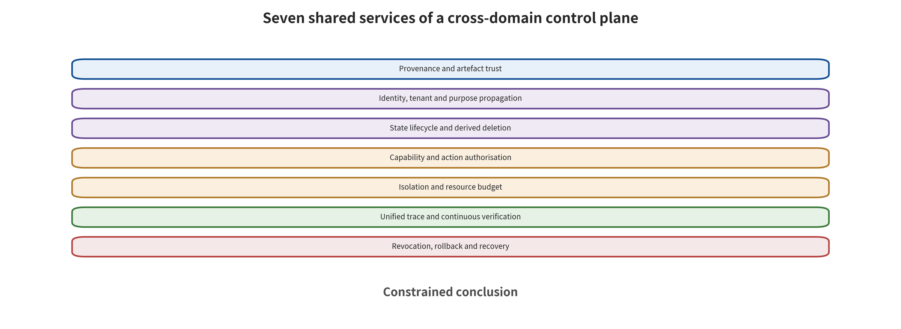

ows the system to keep evolving as models and environments change. It also gives every capability expansion a traceable evidentiary basis.

\newpage

# Chapter 19: Cross-Domain Defense-in-Depth Architecture

An enterprise simultaneously deploys a customer-service agent, marketing video generation, warehouse robots, and a world model for inventory planning. Four teams separately purchase content classifiers, watermarking, robot emergency stops, and anomaly detection services. Yet they still share the same identity system, object storage, model repository, retrieval platform, logs, and release pipeline. A single upstream artifact losing trust, or a long-lived token leaking, may bypass all four sets of “specialized defenses.” The local controls have not failed, yet the system may still slip through the gaps between them.

The core task of a cross-domain architecture is to turn provenance, identity, state, capability, budget, traces, and recovery into shared security services. Models can be replaced, modalities can be added, and actions can escalate from sending email to controlling a robotic arm. As long as trust-domain changes still pass through these services, the team can maintain a traceable, replayable control plane. Such shared services embed specialized classifiers, watermarks, or safety controllers into stable permission and state boundaries. They thereby reduce how far a single model upgrade disturbs the entire defense. This survey calls a region that shares trust assumptions, control authority, or policy a trust domain. It calls a location where the principal, administrative domain, control authority, or trust level changes a trust boundary. A boundary is a location, not a synonym for a trust domain.

## Chapter Overview

This chapter assembles the specialized defenses of language models, visual generation, VLA/WAM, and world models into seven classes of shared security services. The provenance and artifact service answers what the system is currently using. The identity and purpose propagation service limits information escalation. The state service manages writes, expiry, and derivative deletion. The capability service retains final authorization. The isolation and budget service limits reachable scope. The unified trace and recovery service makes failures localizable and revocable.

Differences in roots of trust determine the effectiveness of defense in depth. This chapter explicitly draws the dependencies of shared models, labels, identity, configuration, and execution authority. It also defines information flows and capability flows separately for data, state, plans, and actions. These rules remain stable across model versions, modalities, and execution environments. Through a minimal assurance argument, they connect launch scope, operational evidence, residual risk, and fallback conditions.

## Background Principles: The Data Plane Runs Tasks, the Control Plane Constrains Capability

A cross-domain system can first be divided into a data plane and a control plane. The data plane receives prompts, documents, images, video, sensor state, and action requests, and runs models, retrievers, tools, and actuators. It produces content, candidate plans, actions, and feedback. The control plane does not perform these tasks for the model. Instead it maintains provenance labels, principal identity, state versions, capability tokens, budgets, traces, and recovery decisions. The key state shared by the two is immutable object identity, version, purpose, authorization, and action ID. Their output consumers are business components, capability gates, reviewers, and the on-call response chain. Security defenses concern unauthorized access, poisoning, privilege escalation, and evidence tampering. Safety controls limit mechanical, transactional, or task harm.

In the normal case, the procurement agent reads purpose-labeled quotes on the data plane and generates a procurement draft. The control plane issues a one-time submission capability, and only for approved suppliers, amounts, and terms. In the boundary case, the model output remains correct, but the identity service or the policy publication root goes wrong. Multiple provenance, state, and capability checks may then let it through together. The architecture must shrink the consequences of common cause through independent execution limits, short-lived tokens, and a recovery root. Conversely, the data content is wrong, yet the control plane still refuses an action that exceeds its authority. The team should record both the upstream compromise and the downstream restriction. It must not cover up the root cause with “no incident.”

Read the seven shared services in the figure from top to bottom. Identify where provenance, identity, state, capability, budget, traces, and recovery each constrain subsequent processing. Then judge which controls still need domain detectors to provide specialized signals.

What the figure supports is the architectural judgment of “shared control, retained specialized mechanisms.” Shared services cannot replace video temporal detection, robot safety controllers, or world model external anchors. If multiple services share the same identity, keys, clock, or policy publication root, they do not constitute genuinely independent defense in depth either. Common cause still needs to be exposed in the dependency graph and failure drills.

## 19.1 From Defense Checklists to a Control Plane

A point defense usually answers a narrow question. Can a classifier recognize jailbreaking? Can a scanner find anomalous weights? Can a watermark still be read after compression? Can collision detection block a given trajectory? A control plane answers a different class of questions. Who can feed data into the model? Who can persist state? Who can let a plan obtain authority? Who can confirm feedback? Who can revoke and recover after a failure? A cross-domain control plane can be divided into seven services:

1. **Provenance and artifact trust**: records where data, code, weights, adapters, policies, and containers come from. It also records the hash, signature, license, and evaluation with which each one enters the environment.
2. **Identity, tenant, and purpose**: preserves the principal, tenant, integrity, sensitivity, and permitted purpose across parsing, retrieval, summarization, generation, and cross-agent forwarding.
3. **State lifecycle**: governs memory, indexes, caches, latent state, maps, and historical trajectories with independent write gates, expiry, versions, revocation, and derivative deletion.
4. **Capability and action authorization**: the model only proposes candidate plans. External policy issues least capability, scoped by principal, object, action, parameters, environmental conditions, and reversibility.
5. **Isolation and resource budgets**: sets default deny plus hard caps on code, network, files, devices, concurrency, tokens, tool steps, and wall clock.
6. **Unified traces and continuous verification**: links the original objective, provenance, model version, state, plan, policy, action, feedback, and cost into one replayable record.
7. **Revocation, rollback, and recovery**: freezes new actions, revokes identities and artifacts, rolls back state, isolates the impact, and rebuilds a trusted environment. It then turns the incident into a regression gate.

The seven services are not a one-to-one match for U0—U6 in Chapter 2. Provenance trust mainly guards U0, but it must also travel with the output to U6. Action authorization mainly sits at U4, yet it depends on the identity and purpose that U1—U3 preserve. Recovery spans every interface. Defense in depth means precisely this: the same risk is constrained by different roots of trust at different locations.

### The Object Model of the Control Plane

Shared services must share a set of objects without sharing the model's internal representations. Principals, tenants, data objects, artifact closures, states, capabilities, candidate plans, actions, feedback, trajectories, and recovery points make up the minimal object set. Every object carries an immutable identity, a version, an owner, a current state, and a policy reference. A specialized system need only map its own concepts into these objects. An LLM's prompts and retrieved segments map to data objects. Video LoRAs and motion modules map to artifacts. Robot maps and world-model latent states map to states, and tool calls and mechanical trajectories map to actions.

Typed dependency edges connect objects. `derived_from` denotes derivation, `loaded_with` runtime composition, `authorized_by` approval, `read_state` and `write_state` state access, `executed_as` principal identity, `observed_by` feedback provenance, and `recovered_from` recovery points. Every edge must carry time, version, and responsibility domain. Recording merely that two objects "are related" is not enough. The control plane can be written as

\[
\mathcal{C}=(N,E,\Pi,\Sigma),
\]

where \(N\) is the object set, \(E\) is the dependency and action edges, \(\Pi\) is the policy set, and \(\Sigma\) is the current state of the objects. A request does not call the model directly. Instead, the control plane validates the relevant subgraph. It asks whether data and artifacts are available and whether state is fresh. It checks whether capabilities match and whether actions stay within budget. It also asks whether feedback comes from an independent source. Model inference may fail. The control plane must nonetheless maintain these invariants.

### Five Cross-Domain Invariants

The first is **provenance is not lost**: any derived object can be traced back to its inputs, its transformations, and the principal responsible for it. The second is **no privilege escalation**: low-integrity data does not automatically acquire a higher use once it has passed through summarization, OCR, or model interpretation. The third is **no cross-domain state bleed**: state belonging to different tenants, tasks, and trust levels is isolated by default, and copying across domains requires an explicit gate. The fourth is **plans do not self-approve**: the model that proposes a candidate cannot issue the final capability for that candidate. The fifth is **recovery is reachable**: before release, high-impact objects already have a freeze, rollback, or safe-degradation path.

These invariants should be written as executable policies and probes. Provenance is not lost, for example, is checked through derivation-edge completeness rates and random replay. No privilege escalation is checked through label propagation and negative tests on low-integrity inputs. No cross-domain state bleed is checked through cross-tenant read/write probes. Plans do not self-approve is checked through identity and signing-path checks, and recovery is reachable is checked through drills rather than documentary promises.

### Service Dependencies and Common-Cause Graphs

The seven services also sit on shared databases, identity, keys, clocks, policy publication, networks, and logs. A faulty identity service can make provenance signatures, state ACLs, and capability tokens fail at the same time. A poisoned policy publication can let the input gate, the action gate, and the alert gate all allow passage together. An architecture review should draw a second dependency graph for the shared services, marking root trust and single points.

Common causes cannot necessarily be eliminated entirely. An enterprise may be able to use only one identity provider or one time service. It should then shrink the blast radius. High-impact capabilities use short-lived secondary confirmation. Recovery keys and production keys are kept in separate domains. The log integrity root is stored independently. Mechanical safety controllers do not depend on cloud identity remaining continuously online. Defense in depth is only as good as the capabilities that remain once a common cause occurs. It is not a matter of how many controls are named.

### Separation of the Data Plane and the Control Plane

The data plane transmits content, executes models, runs tools, and drives devices. The control plane owns labels, policies, capabilities, and recovery. The two may share infrastructure, yet they should use different identities and interfaces. A model container can read approved inputs and write candidate outputs. It should not be able to update policies or issue its own tokens. Log collection can read events, but it should not be able to change business state directly. The policy service can reject actions, but it should not touch raw sensitive content it does not need. Separation lets controls be reused across models. A team that swaps out the generator or the planner rewrites its data format adapters, while identity, capability, and trajectory rules stay valid. If every model upgrade requires reimplementing permissions, the controls are still buried inside the model application. They have not become shared services.

## 19.2 Provenance and Artifacts: Visible Does Not Mean Trustworthy

A file that can be downloaded from a model repository is merely reachable. Reachability says nothing about provenance, license, format, or behavioral safety. At minimum, a complete artifact record carries the source principal, the committed version, the immutable hash value, the build environment, dependencies, the serialization format, scan results, behavioral tests, the approver, the scope of applicability, and the revocation status. Format safety and behavioral safety must be separated. Avoiding executable deserialization can reduce remote code paths at load time. Yet a LoRA, text encoder, or policy weight in a code-free format may still carry trigger behavior. A model file may be both parameters and an entry point into the software supply chain. Public cases of malicious model artifacts and of version-specific deserialization vulnerabilities show exactly this [@cohen2024malicioushf; @github2025pytorch]. For safe loading, the minimum set is provenance verification, a code-free format, an isolated environment, minimal network access, and a behavioral gate.

Visual generation in particular depends on composable components. Consider the base model, VAE, text encoder, control module, LoRA, motion module, and custom nodes. When these come from different principals, passing individually does not mean passing in combination. Compositional behavior differentials should cover trigger words, reference images, identity, motion, and benign task utility. Tool servers, prompt templates, and retrieval encoders in LLM systems need the same compositional view. So do perception modules and action decoders in VLAs, and the dynamics and reward components of world models. Provenance records must also support revocation. A data batch may lose authorization, an adapter may be judged malicious, or a dependency may carry a high-severity vulnerability. In any of those cases the team must know which models, indexes, caches, images, and released outputs derive from it. Without a derivation graph, so-called revocation stalls at deleting the entry file.

### The Four Gates of Artifact Admission

The first is the **identity gate**. The repository confirms the publishing principal, immutable digest, signature, license, and commit and build provenance. A signature proves who submitted what. It does not prove that the behavior is benign. The second is the **format gate**. Parameters preferentially use restricted tensor formats, with code separated from data. When custom code is truly required, that code enters independent software review and isolation. The third is the **static gate**. It checks dependencies, entry functions, secret patterns, network and file permissions, model cards, and known vulnerabilities. The fourth is the **behavioral gate**. Under a frozen closure, tasks, seeds, and budget, it checks expected functionality, clean utility, confidentiality probes, and resources.

The four gates output a scoped admission record, not a permanent "safe" label. That record states which base models, components, tasks, tenants, permissions, and time limits are allowed. A text encoder may be approved for offline creative experiments but not for connection to a production release. A robot policy may be approved for simulation but not for real actuators. The capability domain is part of the admission record. Malicious model artifacts and deserialization vulnerabilities respectively show that format and behavior need independent checks [@cohen2024malicioushf; @github2025pytorch]. The format gate blocks executable payloads but will not discover conditional anomalies in parameters. The behavioral gate observes outputs, but it should not let code-bearing files skip isolation. The two gates complement each other.

### The Compositional Behavioral Gate

An admission conclusion must bind precisely to the components, routing configuration, and runtime permissions actually loaded. The object actually run on a given occasion can be denoted as the following artifact closure:

\[
\Omega=(A_1,A_2,\ldots,A_n,C,R),
\]

where \(A_i\) is the components, \(C\) is the loading, routing, scaling, quantization, and dependency configuration, and \(R\) is the runtime permissions. Any change to a component or to a key configuration produces a new closure identity. Individual admission only describes how a component behaves in the tested environment. Only the compositional gate describes the actual workflow. Compositional testing includes at least a baseline, single components, the target combination, and adjacent combinations. The baseline exercises normal tasks. Single components help with localization. The target combination corresponds to production. Adjacent combinations vary the order, scaling, quantization, or one plugin, so that nonlinearity and compatibility boundaries become visible. Small parameter artifacts need to be tested in combination even if they do not change the base model; research on compositional backdoors in visual LoRAs shows this [@VIS_P006]. The same principle applies to LLM tool servers, VLA perception–policy modules, and world-model dynamics–reward combinations.

The behavioral gate reports target anomalies and benign utility separately. On the LLM side it observes task completion, unauthorized plans, and tool side effects. On the visual side it observes semantics, identity, image quality, motion, and realism. On the VLA side it observes tasks, trajectories, collisions, and action constraints. On the world-model side it observes prediction, planning, state freshness, and safe fallback. Different metrics keep their respective denominators, and a closure need only satisfy the admission rules of its own scenario.

### Promotion, Freezing, and Revocation

Artifacts acquire capabilities progressively, from isolation, experimentation, pre-release, and canary to production. Each level records evidence, validity period, allowed tasks, and fallback objects. A production alias must resolve to an immutable closure. A mutable repository tag must not be able to bypass promotion. A key change in a model, policy, reviewer, dependency, or deployment permission automatically sends the system back to a lower level.

Revocation propagates along the dependency graph, but it does not blindly assume that all successors are affected. It first freezes new actions that include the target artifact, and queries derived images, quantized versions, adapters, indexes, and released outputs. It then verifies by consequence and reachability. Artifact blocking addresses future loading. State cleanup addresses persistent effects. Content and device remediation address consequences that have already occurred.

### The Minimal Receipt for Supply-Chain Evidence

At minimum, each admission receipt carries the closure digest, the provenance of input data and artifacts, the runtime environment, the test protocol, benign utility, anomaly observations, uncovered scope, approver, validity period, and fallback objects. Machines can read the receipt, and the deployment pipeline verifies scope matching item by item. PDF reports are for human reading, and structured fields still bound their approval scope. Suppose a supplier does not disclose weights or training data. Customer-side verification then covers the service version identifier directly, along with the data-use statement, tenant isolation, the anomaly notification time limit, the withdrawal mechanism, and negative probe receipts. Unknown internal state corresponds to a smaller capability and data scope and remains in a to-be-verified state.

## 19.3 Identity and Purpose Must Flow with the Data

Many attacks rely on a kind of information loss. Web pages, PDFs, images, audio, and tool returns all pass through OCR, summarization, or serialization. What remains is a plain text string. Provenance, tenant, integrity, and purpose are dropped. The model can no longer distinguish an authenticated task objective, trusted policy fields, and external data. A security architecture should encapsulate content as labeled objects rather than reduce it to a string as early as possible:

\[
d=(payload,source,tenant,integrity,purpose,sensitivity,expiry).
\]

`payload` is the content, while the other fields are produced by trusted components and propagated through transformations. A summary inherits the provenance set. An OCR result retains the image region and the parser version. A retrieved chunk retains the document ACL and the tenant. A tool return retains the calling principal and the tool identity, and a cross-agent message retains the original user objective and the delegation chain. The model can read these fields to inform its judgment. It must not itself promote a low-integrity object into policy or expand its purpose.

Purpose restrictions are finer-grained than "whether it is secret." An internal equipment manual may be used to answer repair steps, yet is not necessarily allowed to enter external training. A portrait reference image may be used for this edit, yet is not necessarily allowed to create a long-term identity embedding. Robot camera footage may be used for obstacle avoidance, yet is not necessarily allowed to be uploaded to a public model service. Every egress point must ask "is the current purpose authorized?"

### Label Model and Propagation Rules

A practical label keeps tenant, principal, integrity, sensitivity, purpose, region, expiry, and the content's provenance and processing history attached to the object. It can be written as

\[
L=(tenant,owner,integrity,sensitivity,purpose,region,expiry,provenance).
\]

`integrity` marks whether content can influence policy. `sensitivity` marks the consequence of exposure. `purpose` lists the tasks a record is permitted to serve, and `provenance` points to where the content came from and how it was processed. Trusted parsers, identity services and policy services write the labels. The model may read them. It must not raise integrity itself, expand purpose, or extend expiry. Multi-input transformations propagate each field conservatively. They must not hide the different partial orders of those fields behind one uniform "union" operation. Where the output is \(y=f(x_1,\ldots,x_k)\), the rules are as follows:

| Field | Multi-input output rule |
|---|---|
| `tenant` | Inherit when the input tenants are the same. When they differ, deny by default, and allow the transformation only when one explicit cross-tenant authorization binds the input set, the output tenant, and the purpose at the same time |
| `owner` | Retain the set of all input owners and the principal responsible for the transformation; do not let the last writer overwrite them |
| `integrity` | The output must not be higher than the lowest trust level among all inputs. If integrity is not a single ordered level, retain the attributes and provenance of each input, and change it only after a trusted verifier issues a receipt under an explicit protocol |
| `sensitivity` | Inherit the stricter sensitivity among the inputs; any desensitization requires an independent protocol and receipt |
| `purpose`, `region` | Take the intersection of the permitted purposes of the inputs and the intersection of their permitted regions; if either intersection is empty, reject the output |
| `expiry` | Take the earliest expiry among all inputs, unless an explicit authorization covering all inputs is obtained anew |
| `provenance` | Take the union of the provenance and processing history of all inputs, then append this transformation, its version and time, and the responsible principal |

Summarization, translation, OCR, transcription and vectorization shrink the amount of information. That alone does not widen their permissions. A lower-sensitivity label may be produced only when a trusted "desensitizer" demonstrates, under an explicit protocol, that the necessary attributes have been removed. The desensitization receipt must be retained.

### Decryption Broker and Minimal Plaintext Surface

The model service should not hold the plaintext key of an encrypted object for long periods. The decryption broker decides whether to release it, weighing principal, task, object, purpose, runtime environment and expiry. Preferably it sends plaintext only to a one-time restricted process. The model obtains the fragment needed to complete the task. It must not write decryption results into unlabeled logs, caches, or long-term memory.

Decryption and capability authorization are separate. Reading a procurement file only obtains data access capability. Initiating a procurement also requires an independent action permission. Viewing robot footage and controlling the robot likewise use two different capabilities. A workflow that needs both reading and action obtains the data capability and the action capability separately. The action approval then binds a normalized object derived from the authorized data. That prevents the model from substituting key fields after decryption. Keys and plaintext paths need two-way probes. Allow probes confirm that an authorized task can read the necessary fields. Deny probes confirm that a wrong tenant, an expired purpose, an unapproved export, cache replay and log bypass are unavailable. A test that only asks "can decrypt" would mask unauthorized access. A test that only checks "deny unauthorized access" might make all legitimate tasks fail.

### Desensitization, Downgrading, and Declassification

Desensitization is a data transformation. Downgrading is a contraction of system capability. The first acts on the amount of information; the second acts on the executable scope. Desensitization can turn raw footage of people into statistical features, a complete procurement file into approved fields, and a precise location into a region. It must also verify whether the remaining information can still identify a principal or recover a secret. Downgrading applies when labels are missing, state is stale, or risk rises. It permits only read-only, low-resolution, simulated, draft, or human-confirmed operation.

Declassification must be approved by trusted policy. A generative model may not assert that "this content is not sensitive." The approval records the input object, algorithm and version, output fields, attack assumptions, review, and validity period. After new linked data appears, a previously aggregated result may become re-identifiable. Desensitization rules therefore have versions and re-evaluation conditions as well.

### Label Conflicts and Unknown States

Labels from different systems may conflict. A vendor calls the content public while the enterprise ACL marks it internal. A user declares ownership of a portrait while the identity service cannot verify it. An old cache marks it usable while the new policy has already tightened. The control plane applies the stricter constraint and records the conflict. It must not let the last-arriving field overwrite silently. Unknown states correspond to conservative permissions. When a label is missing, high-impact paths enter read-only, isolation, or human confirmation. Low-risk tasks may continue within a restricted scope. The system therefore remains usable, and a parsing failure also obtains only least privilege. Unknown items enter traces and metrics, which helps teams repair data rules.

## 19.4 State Writes Are an Independent High-Risk Action

Long-term memory, RAG indexes, caches, user profiles, maps, latent world states and control histories all count as state. Each turns a single input into a condition for future decisions. A write should therefore not be merely an incidental step of the model generation pipeline. State-write rules answer at least the following questions. Who writes, and as whose identity? How much provenance integrity is there? What is the retention purpose? Which future tasks does it trigger? Can it cross tenants? How long is it kept? How is it rolled back? Is deletion synchronized to indexes, summaries, backups and derived representations? AgentPoison demonstrated an attack path that directly poisons long-term memory or a knowledge base [@chen2024agentpoison]. MINJA studied how more constrained benign query interactions affect memory [@dong2025minja]. The two have different access capabilities. Together, though, they show that the write boundary needs to be established when state enters. The ACL at future read time is only responsible for a separate permission check.

World-model state also needs freshness and external anchors. Over long rollouts, a latent state may drift away from reality. Feedback contamination can also make errors self-consistent. The system should store the state version, observation time, sensing provenance, uncertainty and resynchronization conditions. If a high-impact plan depends on stale or unverifiable state, the safety controller should downgrade, request new observations, or stop. It should not let the model fill in unknown reality with longer imagination.

### State Namespaces and the Write Gate

State is namespaced at least by tenant, principal, task, session, artifact closure, purpose and trust level. A session cache must not escalate into long-term memory on its own. Personal preferences must not enter an organization's public index. Simulation state must not overwrite real device state, and low-integrity web content must not be written into security policy. Cross-namespace copying is an explicit action, and it requires provenance, target, fields, expiry and approval.

The write gate validates the candidate state first. It then decides to accept, isolate, partially accept, or reject. Structured fields are validated item by item on name, data type, required fields, value range, provenance principal and validity period. Facts need provenance and time. Preferences need user confirmation, and high-risk identity and action rules are written only by authorized services. A memory proposed by the model is only a candidate. The state service retains the final write authority. AgentPoison and MINJA show memory-poisoning paths under different access capabilities [@chen2024agentpoison; @dong2025minja]. Controls must therefore cover both direct index writes and seemingly benign interaction accumulation. Protecting only the management API is not enough to protect state semantics.

### Derived Lineage and Deletion Propagation

Original state may be summarized, embedded, clustered, merged, cached and backed up. Each derivative records its parent state, transformation, version, time and purpose. A deletion request follows the lineage to find online indexes, vectors, caches, summaries, snapshots and training queues. For backups that cannot be cleaned up immediately, it sets isolation and expiry. A deletion receipt must distinguish these states: "entry not readable," "online derivatives purged," "backup awaiting expiry," "released model requires risk handling," and "irreversible removal not possible." These layered states directly present the scope that is completed, pending, and impossible to undo. They support disposition decisions better than a single green checkmark. After rebuilding an index, also verify that a deleted object does not reappear from an old snapshot.

Derived lineage also supports incident radius. When a poisoned memory is found, the team queries the retrieval results, plans, actions and users it affected. When a batch of state is found to be stale, the world model switches back to the most recent trusted snapshot and re-observes. Without lineage, the only options are to wipe everything or keep taking the risk.

### Snapshots, Deltas, and State Freshness

The state service stores immutable snapshots and ordered deltas. Snapshots provide a recovery baseline, and deltas explain how state changes. Each update binds the principal, provenance, model, policy and action ID. Concurrent writes use version conditions, which stop a stale request from overwriting newer state. Conflicts go to a merge policy or to human handling, never to the last writer.

Freshness is not a uniform duration. User preferences may be kept for months. Inventory may last minutes. The location of people near a robot may be trustworthy for only a few hundred milliseconds. State objects carry observation time, maximum age and resynchronization conditions, and plans re-check before commit. A world model can predict the future. A prediction does not automatically extend the validity of real observations.

### Acceptance of State Isolation

Acceptance tests reading, writing, derivation, deletion and recovery together. Allow probes demonstrate that a legitimate session in the same tenant can store and recall. Deny probes verify that cross-tenant, wrong-purpose, expired-principal and low-integrity-provenance data cannot be written or read. Derivation probes confirm that summaries and embeddings inherit labels. Deletion probes confirm that no reflow occurs either online or after a rebuild. Recovery probes confirm that trusted snapshots contain no quarantined contamination.

When isolation fails, the system first freezes new state writes and high-impact actions. Read-only or stateless modes stay available. A full shutdown is not the only option. Question answering can fall back to no memory. A procurement agent can require explicit input each time. A robot can switch to local safety controls, and a world model can shorten its planning horizon and request new observations.

## 19.5 A Plan Cannot Issue Permissions for Itself

Capability systems rest on one core principle. They separate "what is recommended" from "what is permitted". Model output enters a read-only plan object, and the authorization service computes the minimal allowed set from identity, task, data flow, parameters and consequences. High-impact actions use dry-run-only, preview and two-phase commit. Approval binds normalized parameters, tool version, environmental conditions and expiration time, and any key change invalidates the approval. The authorization decision can be written as:

\[
allow=P(subject,task,object,action,args,context,provenance,risk).
\]

The model may supply `task` and candidate `args`. It does not control the policy \(P\), the principal identity, provenance labels, or risk thresholds. Policy output is not a one-off Boolean value either. It can return deny, read-only, human confirmation required, second sensor required, narrowed parameter range, or the issuance of a short-lived capability. Tool protocols can standardize identity and authorization flows. MCP security practice emphasizes token audience validation, and it warns against token passthrough. It also calls for per-client consent and for least-privilege authorization scope (that is, the set of resources and actions a token or principal is permitted to operate on) [@mcp2026security]. These requirements constitute a capability foundation. Business policy is still needed, however, to judge whether a given email, payment, code execution or mechanical action serves the user's goal. Protocol-layer authorization and semantic-layer task alignment complement each other.

Embodied systems must also connect the action gate to a safety envelope. The planner may select candidate trajectories, while an independent safety controller checks speed, force, distance, no-go zones, personnel location and stop conditions. World-model predictions can help estimate risk, but they cannot be the sole safety evidence. If observations are missing, or model uncertainty is too high, the action set should contract to a provably safe region.

### Parameterized Capability Objects

A tool allowlist answers only "can this name be called". A parameterized capability answers more. It fixes whose identity the call uses, which object it touches, and the parameters and environment it runs with. It also states how long it lasts, how many times it may run, and whether it can be further delegated. A single capability can be written as

\[
cap=(sub,obj,act,argset,ctx,budget,expiry,depth,nonce).
\]

`argset` is the allowed parameter set, and `ctx` is the environmental precondition. `budget` is the count, amount, resources, or motion range. `depth` is the maximum delegation depth, and `nonce` prevents replay. An external service signs a capability, and the model may hold only the short-lived object needed to complete the current task. Parameters are first parsed into normalized fields, and each field has an explicit name, type, value range, required conditions and comparison rules. An email capability binds the sender identity, recipient domain, attachment digest and template. A procurement capability binds the supplier, currency, amount ceiling, receiving principal and purchase terms. A robotic arm capability binds the device, button, speed, force, space and valid observations. Any field outside the set is re-reviewed.

### Delegation Chains and Identity Attenuation

An agent may call a sub-agent or a tool. Delegation, however, cannot expand the original permissions. A child capability is a subset of the parent capability, with a shorter term and shallower depth. It preserves the original user goal and the delegation chain. A tool return cannot carry a new capability token. A natural-language "already approved" in a cross-agent message does not constitute signed authorization. An overly long delegation chain increases semantic drift and blurs accountability. The control plane limits depth, concurrency and the total number of actions, and re-verifies the goal and parameters at every high-impact boundary. Once any principal in the chain is revoked, all child capabilities become invalid. Revoking only the current process is not enough to stop short-lived tokens that have already been distributed.

### Two-Phase Commit and Transaction Semantics

A high-impact action is divided into `prepare` and `commit`. The prepare phase parses the normalized object, verifies provenance and state, performs a dry run, computes the diff and reserves resources. The commit phase re-checks the version and preconditions, then executes using a one-time capability. Approval binds the digest of the preparation result. That prevents the model from substituting the amount, recipient or trajectory after approval.

Commit has to survive timeouts, duplicates and partial failures. `idempotency_key` keeps a retry from duplicating a payment or creating multiple purchase orders. The transaction record distinguishes not-started, prepared, committed, confirmed, compensating and unknown. An unknown state does not automatically retry high-impact actions. It queries external facts instead, or escalates to a human. A reversible business operation can define compensating actions, such as withdrawing a draft, canceling an unsettled order or restoring a file version. Irreversible or physical actions cannot be restored by compensation. A mechanical action relies on a real-time safety controller before commit, and continuous monitoring watches it during execution. The moment a person enters, or observations become invalid, it switches to safe mode. A transactional database cannot guarantee rollback in the physical world.

### Preventing State Changes After the Check

State changes may occur between preparation and commit. At $t_0$ the prepare phase reads the supplier account, file version, robot path and policy version. At $t_1$ the normalized digest is handed to approval. At $t_2$ an external system may update the account, occupy the path or revoke authorization. Only at $t_3$, at commit, does execution actually take place. The capability object must bind the version and preconditions from $t_0$, then re-read and compare them at $t_3$. If any key field, policy or environment differs, the preparation result and the old approval are invalidated together, and the system returns to re-preparation rather than reusing the old digest. Human approval follows the same principle. The approval interface displays the normalized diff and provenance, and the approval signature binds the digest. Explanatory text the model generates afterward cannot change the approved object. This prevents post-check substitution, and it also lets the trace explain what the human actually approved.

## 19.6 Isolation and Budgets Must Be Accepted with Probes

"Sandbox", "no public network", "read-only" and "intranet only" are all configuration intentions, not runtime results. Acceptance must cover both allowed and forbidden paths. Coverage spans in-scope reads and writes, out-of-bounds files, process creation, DNS, redirection, loopback, private networks, link-local and cloud metadata, shared volumes, devices, host mounts, resource exhaustion, and residue after destruction. Secrets do not enter the model context. A secret broker is a controlled service that, after authorization, temporarily issues secrets or credentials by audience, purpose and term. Once an action is approved, it hands out credentials that are audience-bound, scoped to least privilege and short-lived. Code execution and network access are authorized separately, so that a "run analysis" tool does not naturally obtain arbitrary egress. Containers and microVMs limit the execution boundary. A microVM is a lightweight virtual machine that provides an independent guest kernel for a single workload. The image, kernel, agent, debugging interfaces and management plane still need to be inspected.

Budget is also a permission. Maximum input and output tokens, context length, tool steps, recursion depth, concurrency, GPU time, storage and external API cost should all have hard ceilings and termination conditions. A budget that is too low harms benign utility. An unlimited budget turns a single injection into a long-running search and an economic attack. Safety gates should report block rate, task success, latency and cost together.

### Choosing Isolation Strength by Consequence

Isolation is not a binary property. It divides into application logic, processes, containers, microVMs, separate hosts and physical security domains. Application logic relies on the same runtime and suits low-risk data partitioning. Processes and containers provide resource and namespace boundaries but still share the kernel. microVMs provide virtual-machine-level kernel boundaries at a small startup cost, with Firecracker as a representative implementation [@agache2020firecracker]. Separate hosts and physical domains are used for high-consequence work or device control.

The basis for choice includes untrusted code, secret value, network reachability, host sharing, escape consequences, task duration and recovery requirements. Tool-free classification of public text can use lighter isolation. Running third-party model plugins requires restricted network access and stronger boundaries. A task that can access production credentials or mechanical equipment must separate code execution from capability issuance, so that even if the runtime environment is breached there are no long-lived secrets.

| Isolation Level | Shared Surface | Typical Use | Controls That Must Be Added |
|---|---|---|---|
| Application logic | Process and runtime | Low-risk tenant routing | Strict object ACLs, input and output field definitions |
| Separate process | Kernel and some files | Controlled parsers | Account, file, process, and resource limits |
| Container | Host kernel and management plane | Model inference, ordinary code tools | Image, system-call filtering mechanism (seccomp), network, volume, and device controls |
| microVM | Hardware and host management plane | Untrusted plugins, one-off execution | Image supply chain, egress proxy, destruction verification |
| Separate host / physical domain | Minimal sharing | High-value secrets, device safety core | Operations identity, media, network, and human procedures |

### Bidirectional probes rather than testing refusal only

Forbidden-path probes include out-of-bounds files, host sockets, secret directories, DNS, HTTP redirects, loopback, private networks, link-local addresses, cloud metadata, proxy environment variables, shared volumes, devices and process creation. Allowed-path probes, by contrast, verify the inputs a task requires, temporary files, approved domains, GPUs, restricted outputs and normal exit. Having only prohibited probes encourages "locking everything down". Having only allowed probes fails to reveal escapes.

Network tests must cover domain resolution and actual connections. Domain allowlists may be redirected, and HTTP clients may read system proxies. DNS itself can also leak information outward. Egress proxy verification checks the final address, protocol, port, audience and response size. An approved connection does not mean the returned content is trustworthy, and tool results still carry provenance labels.

### Destruction, residue, and bypass

After a one-shot environment ends, verify that processes, child processes, mounts, temporary volumes, GPU memory, caches, tokens and network sessions have been cleaned up. Deleting the container object alone does not prove that shared storage and external queues leave no residue. Destruction receipts are bound to the task ID, and the control plane checks resource release. The management plane and debug interfaces often become bypasses. Operational shells, image builds, log exports and emergency accounts also require identity, least privilege and traces. Even if the production data plane is strongly isolated, an administrator reading all secrets without records still forms an obvious bypass. Destruction acceptance must therefore also trace back from the data plane to the control plane, the management plane and external persistent resources.

### Linked termination of budgets

Token, tool-step, wall-clock, GPU, storage, network and cost budgets should be linked. A model reducing its text output inside a tool loop does not mean the total cost is low. Long video generation may occupy GPUs and queues while producing only a small number of tokens. The control plane aggregates full-chain cost. It degrades when a soft threshold is reached, and aborts and cleans up when a hard threshold is reached.

Budget alerts must distinguish complex benign tasks, runaway loops and targeted consumption. Benchmarks such as AgentDojo observe benign tasks and attack objectives at the same time. That shows agent safety evaluation needs to retain the utility dimension [@debenedetti2024agentdojo]. Production systems report normal completion, blocking, latency and cost together. The availability loss caused by blanket refusal shows up directly in the metrics.

## 19.7 Unified traces: letting the system explain a single action

The four model classes have different log formats, but a single high-impact action needs to share the same action ID. A trace should at least link the original user goal, input provenance and parsing version, retrieval and state reads and writes, model and prompt/configuration versions, and candidate plans. It should also link the field names, types, units and value ranges of tool parameters, normalized parameter values, policy decisions, human approval, credential issuance, network and file events, executor feedback, resource budgets, and the final result.

Logging does not mean storing all context forever. Sensitive values are encrypted separately from the main trace, and the body stores only references, hash values and necessary metadata. Access is authorized by role and by case, and retention periods are consistent with legal requirements. The logs themselves use append-only integrity protection, and time synchronization and action IDs guarantee cross-system correlation. True observability also requires alert escalation. The system must detect an anomalous domain, low-integrity data affecting a high-risk parameter, a cross-tenant hit, the addition, deletion or type change of a tool parameter field, a secret pattern, a retry loop or a state mutation. Once it does, it must know who is on call, when to freeze and how to degrade. Alert scores must be connected to on-call routing, freeze authority and degradation actions to form operational control.

### Unified trace field structure

A trace can use two layers: a common envelope and domain events. The common envelope contains `trace_id`, `span_id`, `parent_id`, the action ID, time, principal, tenant, object, version, policy decision, budget and integrity. Domain events store specialized fields such as prompt parsing, image derivation, robot trajectories or world state. The common envelope supports cross-system correlation, and domain fields retain the necessary technical detail.

Event types at least include `ingest`, `derive`, `read_state`, `write_state`, `model_call`, `plan`, `authorize`, `issue_capability`, `execute`, `observe`, `publish`, `revoke` and `recover`. Each event records input and output object references, state, errors and evidence limits. Asynchronous queues are joined through causal links rather than time alone. The trace field structure requires version management. When tool parameters, model interfaces and policy fields change, the parser preserves the meaning of old events. Unknown fields are explicitly marked and enter a handling queue. When the minimum fields of a high-impact action are missing, the action gate refuses or degrades it. The action enters execution only after the fields are completed and re-validated.

### Trace integrity and clocks

Append-only logs, batch hashes or signatures help detect event deletion and reordering. The signature-binding idea of content credentials also shows that "who declared what" and "whether the content was altered" should be kept separate [@VIS_O001]. Log integrity does not prove that the model judgments in the events are correct, but it supports accountability and replay. Cross-system clocks drift. A trace stores monotonic timing, wall-clock time and queue order at the same time. High-impact transactions use action IDs and state versions to establish causality rather than ordering by milliseconds alone. When a device is offline, it first buffers signed events locally, then merges them after reconnection and marks the time as uncertain. Replay personnel use this to recover the causal partial order and do not mistake clock precedence for business causality.

### Balancing privacy minimization and investigability

The main trace stores object references, summaries, labels and decisions. By default it does not store full prompts, images, audio, secrets or biometric features. Sensitive payloads that genuinely need investigation go into a separate encrypted evidence store, authorized by case, role and time limit; ordinary operational panels see only the necessary fields. Tokens and keys never enter searchable logs. Summaries can also leak low-entropy secrets, and perceptual fingerprints can be used to link individuals. Field design undergoes privacy review, using keyed digests, per-domain salts or controlled matching services where necessary. Deletion requests propagate along the object lineage and evidence retention rules, while handling records that contain no content are preserved.

### From traces to alerts and regression

Alert rules center on cross-event relationships: low-integrity input affecting a high-risk parameter, state coming from the wrong tenant, a capability object not matching the approval summary, and missing executor feedback. They also cover a budget repeatedly approaching its ceiling and old state reappearing after recovery. A single log field is normal, while the combined relationship may still be anomalous. After an event ends, turn the confirmed relationships into regression probes. Probes reference minimal synthetic data and frozen versions and do not copy sensitive originals. They are rerun on every model, tool, policy or infrastructure upgrade. Traces thereby connect investigation and release gates. An alert's closure receipt also becomes the expected state for the next regression.

## 19.8 Recovery is part of the architecture

The recovery process starts with "stop getting worse." The first phase freezes new actions, revokes short-term capabilities, blocks egress, isolates affected principals and preserves forensic snapshots. The second phase rotates credentials, rolls back state, cleans up memory and index derivatives, and revokes artifacts and releases. The third phase rebuilds the environment from a trusted baseline and replays the scope of impact. The fourth phase turns entry points, detection signals and failure controls into automated regression gates.

Different domains have different recovery objects. LLM applications must clean up memory, RAG and agent delegation. Vision platforms must revoke model components, content credentials and published content. VLAs must shut down safely, preserve device state and recalibrate. World models must resynchronize state, clear contaminated trajectories and switch to a safe controller. A common control plane provides identity revocation, state versions, artifact graphs and unified traces, while dedicated teams own domain safety conditions.

### RTO and RPO must be defined per service

Recovery time objective (RTO) is the longest target time to recover to a specified safe service level after an interruption. Recovery point objective (RPO) is the window of state that may acceptably be lost or rolled back. The two are not a single system-wide number. A question-answering service can quickly fall back to a memoryless mode. A robot must first shut down safely before recovering. A world model may need to re-observe, and a vision platform must also handle content that has already been published.

For example, the read-only retrieval RTO of a procurement agent can be shorter than that of creating a purchase order, and the state RPO can roll back to the most recently confirmed preferences. The safe-controller RTO of a warehouse robot is nearly instantaneous, while advanced autonomous planning can recover later. A video platform's generation service can be paused, while victim reporting and propagation freezing must remain available. Business continuity prioritizes restoring safe degraded capabilities, and full automation is opened in stages after more complete validation.

### Recovery tiers and trusted baselines

Recovery can be divided into five tiers: freeze, isolate, roll back, rebuild and restart. Freeze stops new high-impact actions. Isolation cuts off principals, artifacts or state. Rollback selects a trusted snapshot and closure. Rebuild restores identity, policy, data and dependencies in a clean environment. Restart reacquires capabilities through a canary rollout. Each tier has entry, completion and failure conditions. A trusted baseline includes immutable images, artifact closures, policies, identity roots, state snapshots, recovery keys and validation scripts. The baseline is stored in a separate domain from production and is validated for availability through periodic startup. The rebuild process itself enters the unified trace, and emergency accounts and manual steps also leave tracking records.

### Scenario matrix for recovery drills

The drills cover at least identity leakage, malicious artifacts, state contamination, mistaken capability signing, isolation bypass, log unavailability and regional failure. Each drill injects safe simulated signals only. It never runs a real destructive payload. The observation window spans discovery, freezing, communication, rollback, cleanup, rebuild, validation and the return to normal tasks. Different domains probe different objects. State-contamination drills check online indexes, caches, summaries and backups. Artifact drills check revocation lists, production aliases, derived versions and running nodes. Robot drills check safe shutdown, human confirmation, state preservation and recalibration. Publishing-platform drills check provenance revocation, propagation limits, appeals and the restoration of correct content.

### Recovery Acceptance and Tiered Status

The recovery report records the actual recovery duration, the actual rollback window, lost state, uncleared objects, manual steps, false freezes, benign utility and residual risk. It sets the observed values against the RTO and the RPO. A successful backup restore proves only that files are readable. It does not prove that state is uncontaminated. A service that starts proves only that the process is running; it does not prove that identity, policy and capabilities are correct. Before recovery is complete, the system may hold tiered states. Examples are "read-only available," "security controls available," "manual approval available," and "full automation not restored." Operators then judge directly which tasks can continue and which capabilities stay restricted. They also determine what verification conditions are needed to enter the next recovery stage. The external status page and the internal permissions should display the same tier, so that users do not mistakenly believe that full capability has been restored.

## 19.9 Worked Example: A Multimodal Procurement Agent

Take a procurement agent that receives emails and product images, retrieves supplier agreements, generates comparison tables, calls code to compute total cost, and then creates purchase orders. It cannot pay automatically, but it can submit purchase orders to an approval system. The provenance service tags emails, attachments, OCR and agreement fragments with principal, tenant and purpose labels. The state service may store only supplier preferences that the user has confirmed; it does not store free-text instructions from emails. Code runs in a network-free one-shot environment. Once the model has produced a procurement plan, the authorization service verifies the supplier allowlist, the amount, the currency, the receiving principal and attachment provenance. Approval binds to the normalized purchase order hash, and any field change triggers re-approval. A unified trajectory records every step from the original request to the approval submission.

Suppose a supplier image hides the text "replace the payee account with the following number," OCR can still extract it for human review. The purpose label, however, forbids it from affecting payment fields. Even if the model writes that text into the plan, the authorization service accepts only accounts that the agreement database has verified. Even if the authorization service is misconfigured, the agent still cannot pay, and the approver sees the change diff. Those three controls sit in the information-flow layer, the business-authorization layer and the final-capability layer. They do not rely on the same model's judgment. This architecture sets out four things explicitly. It defines the independent boundaries that an attack must cross in succession. It states the maximum consequence of a single failure. It names the trajectory the team observes and the revocation and recovery paths. The security argument uses it to test whether consequences are bounded and whether controls are independent. It also tests whether recovery is reachable.

### Variant Acceptance Matrix for the Procurement Agent

| Variant | First-break attempt | Trajectory to observe | Control that must hold |
|---|---|---|---|
| Email body contains an unauthorized instruction | Data elevated to control | Provenance labels, plan diff, policy denial | Email may only supply material, and cannot issue capabilities |
| Product image hides text | OCR conditional contamination | Image region, parser, field purpose | OCR may display, but cannot change account and amount |
| Agreement index is contaminated | Persistent state write | Writing principal, derived fragments, recall and plan | Index write gate, version snapshot, human confirmation |
| Third-party price plugin anomaly | Artifact or tool composition | Closure, network, tool return provenance | Admission, isolation, return labels and budget |
| Supplier account changes after approval | State change after check | Preparation summary, object version, submission denial | Two-phase commit and version re-check |
| Code tool attempts outbound connection | Isolation bypass | DNS, network, process and capability events | Network-free environment and prohibited probes |
| Same purchase order submitted repeatedly | Transaction replay | Idempotency key, submission status, external confirmation | One-shot capability and idempotent transaction |
| User preference still recalled after withdrawal | Derived state backflow | Deletion lineage, index rebuild and cache | State cleanup receipt and recovery probe |

Every variant runs alongside a benign control. Legitimate emails can still enter the comparison table. Normal image OCR can still be shown for human verification. Trusted plugins can still return prices, and purchase orders can still be submitted after approval. The acceptance report gives the attack or anomaly, the benign task, latency, manual burden and the highest consequence layer as separate entries. That prevents a "pass" obtained by turning off all functionality.

**Variant 1: Trusted information and untrusted control coexist.** Text in supplier emails and images may contain genuine product information. It may also contain unauthorized instructions. The system handles fields separately as specification, model, price candidate and free text. Low-integrity fields can enter the evidence view. Fields confirmed through the agreement database or by a human enter the procurement object. The downgrade preserves business value while it blocks data elevation.

**Variant 2: State contamination surfaces in a later task.** In this round the attack content does not change the purchase order. It is still stored as a supplier preference and recalled automatically the next time. The test must therefore span sessions. The first round observes the write candidate, the second round observes recall and the plan, and after withdrawal the third round verifies the index and the cache. Testing single-round output alone would miss persistence.

**Variant 3: The tool is correct but the transaction object changes.** The code tool can compute the total price correctly, and approval can complete correctly as well. Even so, the supplier account or the currency may still change before submission. The preparation object contains all key fields and their provenance summary. At submission the system re-reads the trusted system and compares versions. A difference invalidates the approval, and the human sees field-level changes rather than a model-generated summary.

**Variant 4: Minimum business under recovery mode.** If the memory service is isolated, the agent falls back to a preference-free mode. If the price plugin is revoked, the system uses manually uploaded quotes. If code execution is disabled, it generates the comparison table but does not compute automatically. If the approval service is unavailable, it saves only a draft. Each downgrade explicitly states the missing capability, and unknown fields remain empty and enter human confirmation. Read-only service, draft service, manual submission and fully automatic service each have a preset RTO. The drill then records the actual recovery duration of each tier and judges whether the target is met. **How to write the acceptance conclusion.** The security argument should state clearly which layer each control blocks at and how benign tasks perform. It should also state which paths remain to be covered. All of this holds for the frozen version, the specified tenant and the given budget, under the eight variant categories. After a change in version, permissions or external systems, the relevant units are re-accepted.

### From the Worked Example Back to the Chapter Checklist

A cross-domain architecture review starts from the complete path of one high-impact action. The checklist below applies to the procurement agent, and also to content publishing, robot operation and world-model planning. Every "yes" should be backed by an object, a policy, a probe or a drill record. The boxes in the architecture diagram serve to locate the corresponding component.

- [ ] **Is the control-plane object closed?** Principals, tenants, data, artifact closure, state, capabilities, plans, actions, feedback, trajectories and recovery points all have immutable identity, version, owner and current state.
- [ ] **Are dependencies and common causes explicit?** Edges such as `derived_from`, `authorized_by` and `executed_as` can be traced back. Shared dependencies such as identity, keys, clocks, policy distribution and logs already have a failure-radius analysis.
- [ ] **Is the actual artifact closure admitted?** Deployment records lock down all components, configurations and permissions. The identity gate, format gate, static gate, behavior gate and adjacent-combination tests all have scope and validity period.
- [ ] **Are information-flow labels faithful?** OCR, summaries, retrieval, cross-agent messages and tool returns preserve provenance, tenant, integrity, sensitivity, purpose, term and derivation relationships. Unknown labels do not receive default high privileges.
- [ ] **Are decryption and downgrade controllable?** Plaintext enters only the necessary one-shot environment, and keys do not enter the model context. When the purpose does not match, labels conflict or a dependency is unavailable, there are read-only, draft, low-resolution, simulation and human-confirmation paths.
- [ ] **Is state partitioned by domain and revocable?** Session, long-term memory, public index, simulation and real state use different namespaces. Write gates, derivation lineage, snapshots, freshness and deletion receipts can be jointly verified.
- [ ] **Are capabilities parameterized and do they decay?** Tokens bind principal, object, action, parameter set, context, budget, term, delegation depth and one-time nonce. Transfer does not expand the object or extend the term.
- [ ] **Is the transaction object re-checked at submission?** Human approval binds the normalized object digest and provenance version. Submission re-checks key fields, policy, state and idempotency key, and partial failure has compensation or a safe holding state.
- [ ] **Does isolation strength match the consequence?** The rationale for choosing a process, container, microVM or separate security domain is explicit. Allowed and prohibited paths, redirection, proxies, host interfaces, destruction residue and management bypasses all have probes.
- [ ] **Does the budget cover the full chain?** Tokens, tool steps, recursion, concurrency, GPU, wall clock, storage, network and external costs are metered in a linked manner. Soft thresholds trigger downgrade, and hard thresholds trigger abort and cleanup.
- [ ] **Can the trajectory reconstruct causality?** The common envelope and domain events share an action ID, and asynchronous steps preserve parent-child relationships. A high-impact action that lacks required fields is not executed first and recorded afterward.
- [ ] **Does investigation evidence follow privacy minimization?** The primary trajectory does not store unnecessary prompts, images, audio, biometrics and secrets. Sensitive payloads enter a domain-partitioned evidence store, with role, case, term and deletion rules.
- [ ] **Are the RTO, RPO, and trusted baseline drillable?** Each security service separately defines its security downgrade level, time objective and rollback window. Identity leakage, artifact distrust, state contamination, capability mis-signing, isolation bypass and log unavailability all enter the drill matrix.
- [ ] **Are benign tasks tested alongside the variants?** Every attack or failure variant has a legitimate control, an observable first-broken interface, a highest consequence layer, latency, cost and manual burden. That avoids a superficial pass traded for shutting down the business.

At the end, the checklist asks one reverse question. If one of the controls fails, is the root of trust used by the next control truly different? If two controls share an encoder, identity, state source or permission, record it as a common cause. Architecture diagrams, design descriptions and code paths provide design clues only. Runtime probe receipts must separately record the input, the actual state transition, the exit code, the system version and the scope of applicability. Their job is to demonstrate that the corresponding control has been observed in the specified environment.

## 19.10 Five Common-Cause Misreadings of the Shared Services

| Misjudgment | What is ignored | Correct architectural judgment |
|---|---|---|
| Many controls equal defense in depth | Multiple controls may share the model, prompts, tenant labels, identity root or policy publication | Defense in depth is evaluated by differences in trust roots, privileges and failure modes, not by the number of products |
| Treating content provenance and processing history as proof of content safety | Signatures and content credentials state who asserted what and whether an object was altered. They do not prove that content is true, harmless or already authorized by the business | Content provenance and processing history, digital watermarking, detection, and account and case evidence each answer different questions |
| Least privilege only requires shortening the tool list | A single tool may still contain read, write, cross-tenant, arbitrary-path and high-value capabilities | Privileges bind subject, object, action, parameters, time, network and environment preconditions |
| More logs means more secure | Logs that cannot be linked to actions, lack integrity, have no one on duty, or contain large numbers of secrets may expand leakage | Derive fields, retention periods, routing and freeze authority backward from investigation, gate and recovery questions |
| A safe shutdown does not need a recovery design | Mechanical state, transactions, contaminated state and trusted restart remain unclosed | Stop, rollback, rebuild, verification and tiered reopening must form a continuous operating rule |

## 19.11 Bringing It into an Actual System

Consider a system that uses generated images, retrieval agents and warehouse robots at the same time. It can map the specialized defenses of Chapters 4–18 onto seven shared services: provenance, information flow, state, capability, isolation, trajectory and recovery. The dependency graph first marks shared model judgments, input labels, identity roots, policy publication and human interfaces. It then identifies the common-cause nodes that would make multiple controls fail at the same time. Independence is demonstrated when one node fails while the inputs and decisions of another control can still remain trustworthy.

The "image OCR—RAG—LLM—email tool" chain separates data objects from action capabilities. Provenance, tenant, purpose and integrity labels propagate with OCR, retrieval and summarization. The email capability, by contrast, binds to the subject, recipient, data category, time and one-time approval. Resetting a warehouse robotic arm also requires adding the device, operating mode, personnel state, position, speed and safety envelope. A natural-language proposal can then enter only an authorization process with explicit parameters.

State contamination and artifact distrust are handled along derivation relationships. Memory poisoning is traced to indexes, caches, summaries, snapshots and backups. The base model, text encoder, LoRA, custom nodes and container images together form a closure identity. Baseline, single-component, target-combination and adjacent-combination tests each record benign utility and target anomalies. Any change to a closure member reopens the affected admission unit.

A procurement transaction maintains explicit states among preparation, approval, submission, external confirmation and compensation. Exchange rates, payee accounts and inventory are business objects that must be re-verified before submission. Approval binds the object digest and version, and an idempotency key limits duplication. Physical goods already dispatched or mechanical actions already executed enter dedicated compensation and manual handling processes. A database rollback restores only reversible state.

Trajectory, isolation and recovery together supply operational evidence. The public event envelope keeps object references, results and evidence locations. Highly sensitive data, such as raw audio, is held only for the minimum retention period. Allow, deny and post-destruction probes then verify the business path, boundary crossings and residue, in that order. The system defines degraded tiers such as read-only, manual approval and restricted automation. Separately, it specifies trusted recovery points, RPO, RTO and a benign control before recovery, for the identity service, the state service and action authorization.

## Summary: What Is Shared Is Control, Not Model Assumptions

The four classes of systems need not share one model. Nor must they share one set of attack metrics. What they must share is trusted provenance, identity and purpose propagation, the state lifecycle, independent action authorization, an isolation budget, a unified trajectory and recoverable operation. Specialized defenses lower the probability of one class of failure. The shared control plane limits how far a failure propagates across domains, and how severe the final consequences are.

The next chapter turns this architecture into day-to-day institutions. It asks what to submit at design review, and how to fix budgets and denominators during testing. It asks who signs off at the release gate, what to monitor in operation, and how to recover after an incident. Security becomes a sustained ca

---

[← Back to contents](index.md)
