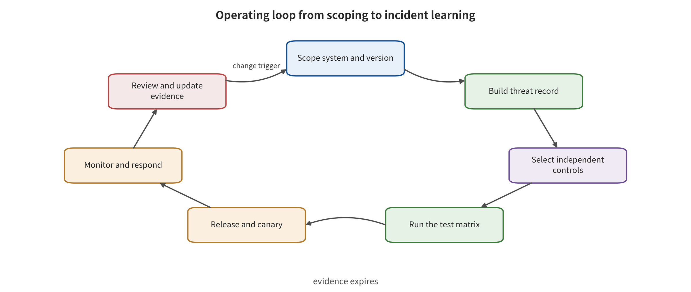

pability, rather than an architecture diagram, only once it enters versions, pipelines, on-call duty and the division of responsibilities.

\newpage

# Chapter 20 From Threat Model to Operating Institutions

A security architecture stalls most easily at the review meeting. The diagram has trust boundaries and the document has a high-risk list. Yet no executable gate stands before release, and in operation no one is responsible for alerts, revocation and recovery. Models, data, tools and scenarios keep changing, so every critical change must re-run the matching controls and the matching evidence chain. That continuous evidence chain is the security artifact a team can hand over and keep on watch. This chapter condenses the preceding nineteen chapters into six execution phases. Sections 20.2–20.7 of the main text map onto the first through the sixth step in order. The first step freezes the scope and the change unit, and the second generates a test matrix from the threat record. The third uses hard gates and diagnostic scores to make the release decision, while the fourth continuously monitors the real control objectives. The fifth responds to incidents and verifies recovery, and the sixth turns review gaps into a falsifiable plan. Section 20.1 outlines the minimal security argument that runs through all six steps, and it does not count as a seventh step.

The figure in this chapter expands these six phases into seven links by evidence object. It does not start a separate process. System definition corresponds to the first step. Threat, control and test are three adjacent links that jointly expand the second step, where controls come from the minimal security argument and are tested in the matrix. Release corresponds to the third step. Monitoring corresponds to the fourth. The incident handling process, which moves from monitoring into review, corresponds to the fifth step. Review, together with the new verification obligations it generates, corresponds to the sixth. The seven links describe the evidence lifecycle; the six steps describe the handover of responsibility. The two have different granularity, but the mapping between them is unique.

## Chapter Overview

This chapter turns the security architecture into organizational institutions for continuous operation. The minimal security argument links system scope, protected properties, claims, counter-evidence and recovery paths into an argument tree. The threat record then generates a test matrix that contains allowed paths and prohibited paths. The release gate puts security, benign utility, cost, rights, revocability and recovery on one decision surface. On that surface, non-compensable hard gates and the diagnostic metrics used for improvement each play their own role.

Operating institutions revolve around version diffing, continuous regression, cohort-based canary rollout, alert routing, emergency freeze, identity revocation and verifiable rebuild. When the model, the data, the tools, the policy or the environment changes, the affected evidence expires with it, and the matching tests and release decisions re-run automatically. Incident drills then close the loop from freeze through revocation and forensics to rebuild and review. Each of those stages gains an executable attribution: responsible parties, time objectives, evidence preservation and recovery sign-off.

## Background Principles: Evidence Expires as Dependencies Change

This chapter is not about a static compliance report. Its object is an operational argument graph that is updated continuously. The inputs are the system snapshot, the threat model, the control configuration, test receipts, operational events and change diffs. The internal state is the model, data, tool fields, identity, policy, log format, executor and environment version that each claim depends on. Change impact analysis computes along dependency edges which evidence has expired. The test matrix fills in missing observations. The release gate then hands the valid evidence to approvers, to operations and to the on-call response chain for consumption. This survey calls the process of identifying assets, attacker capabilities, paths, boundaries and impacts threat modeling. It calls the product of that process at a specified system version the threat model. The two are not interchangeable. The security surface covers overreach, poisoning and evidence destruction on the security side, and physical or business harm on the safety side. It also covers whether the system promptly contracts its capability once evidence expires.

In the normal case only display copy changes, and that copy enters no input, control or scoring. The dependency graph then confirms that the core evidence remains valid, and only the corresponding checklist verification is needed. The boundary case is different. A tool field appears to have had only its name changed. The new name nevertheless invalidates parameter validation, the human approval digest, the authorization policy and the event parser all at once. Old receipts must then expire on their own. The related capabilities stay closed until the local regression and the end-to-end path close again. An unchanged model version cannot rescue this evidence either. Evidence binds to the complete operational graph, not to a product name. Follow the seven links in the figure. They show how a single change moves from system definition into threat, control, test, release and monitoring. They also show how that change triggers the next round after the incident review. At the same time, use the mapping from the previous paragraph to map the seven evidence nodes back to the six execution phases of the main text. Focus on which nodes cause old evidence to expire.

The figure supports evidence lifecycle management. It does not support a claim that one completed round of testing permits permanent release. Nor can it determine automatically whether the change impact graph is complete. When dependencies are unknown, receipts are missing, or common causes have not yet been modeled, the conservative action is to widen the retest scope and narrow the released capability. Record the unclosed items. Do not carry a historical "pass" forward.

## 20.1 The Minimal Security Argument

A security argument organizes claims and evidence within a given scope, users, environment and time. It establishes that the main risks have been identified, that key controls have independent evidence, and that residual risks, failure conditions and recovery paths are visible to decision-makers. It is not a certificate that remains permanently valid across versions. When the scope, the capability or the dependencies change, the relevant claims and evidence re-enter review. The minimal security argument contains ten items:

1. The purpose, users, environment and explicit boundaries of the system.
2. An inventory of models, data, state, tools, identity, network and executors.
3. Protected assets and six security properties: integrity, confidentiality, availability, authenticity, controllability, and recoverability.
4. The U0—U6 trust interface diagram.
5. The key threat record \(\tau\), including attacker capabilities and budget.
6. The earliest blocking control and the consequence-limiting control for each threat.
7. The four-part metrics, test denominators and uncertainty, together with the evidence layer that static inspection, mechanism-level run, simulated execution or closed-loop simulation, end-to-end reproduction, and field incidents occupy.
8. Benign utility, operating cost, downtime and manual burden.
9. Monitoring, revocation, rollback, recovery and incident owners.
10. Open risks, their acceptors, their expiry times and their re-review triggers.

Each of the ten items covers a different responsibility. Provider evaluations support model-layer evidence. The deployer answers for retrieval, state, tools, identity, network, executors and business consequences. Traditional penetration testing covers conventional system interfaces. The plans a model forms under new inputs and long-horizon feedback must also be evaluated, by model tests and by closed-loop tests.

### 20.1.1 Taking Apart "Why It Can Run" with an Argument Tree

The top-level claim of a safety argument must bound the object, the scope, the environment, the time and the consequence. Consider an example: "In the low-speed sorting area of warehouse A, when version fingerprint \(v\) executes only whitelisted pick tasks, a single untrusted work order cannot bypass personnel detection and the action gate to trigger motion in a restricted zone." That sentence bounds the location, the operational graph, the task, the attack entry point and the protected property at once. It can therefore be falsified. The top-level claim decomposes downward into four kinds of subclaims:

1. **Inputs and state are controlled**: low-integrity content is not silently promoted to policy, and every state write carries a principal, a purpose, a term and revocation.
2. **Planning and capability are separated**: model output is only a candidate plan, and independent controls determine high-impact parameters and identity.
3. **Execution and feedback are constrained**: actions stay within the safety envelope, and external sensing and actuation receipts can verify outcomes.
4. **Failures are discoverable and recoverable**: critical traces are complete, control failures degrade or stop, and the team can revoke, rebuild and verify recovery.

Each subclaim decomposes further into observable invariants. Take "separation of planning and capability". At a minimum it must be proved that the model process has no authority to issue tokens. The authorization service accepts only canonicalized action objects. An approval binds the object hash, the policy version and the time limit. The original approval is invalidated after the recipient, the path, the amount or the speed changes. Architecture names locate components. Runtime probes and logs confirm whether these behaviors hold. The leaf nodes of the argument tree connect to evidence objects:

\[
e=(claim,artifact,method,snapshot,scope,result,limit,owner,time).
\]

Here "claim" is the narrow claim being supported. "artifact" is configuration, logs, data, code, an external receipt or an incident record. "method" is recorded according to the actual execution tier, as static inspection, mechanism-level run, simulated execution or closed-loop simulation, end-to-end reproduction, or field incident. "snapshot" is the system fingerprint, and "scope" is the sample, budget and environment. "result" is the observation, and "limit" is the limits of the evidence. "owner" and "time" denote the responsible party and the validity time. Evidence that is not bound to a snapshot and a scope cannot be judged to still apply after the system changes.

### 20.1.2 Evidence Mapping and Counter-Evidence

The argument tree stores supporting material, counter-evidence, unknowns and common causes side by side. It lets reviewers see which claim a piece of evidence actually supports, and what counterexample would overturn that claim. Every row of the table keeps the applicable snapshot, the evidence tier, uncovered conditions and invalidation triggers. That prevents one piece of material from being cited repeatedly for several incompatible claims. A practical evidence mapping table is as follows:

| Claim | Direct evidence | Counter-evidence test | Common cause and unknowns | Invalidation handling |
|---|---|---|---|---|
| Cross-tenant data unreachable | ACL logs taken before retrieval, plus leakage probes | Switch tenant and cache key, then replay | A cache or connector bypass | Freeze private retrieval |
| Model cannot self-authorize | Identity policy, issuance logs, privilege-escalation probes | Have the model request an expanded permission scope | Policy and tools share an overly broad identity | Revoke the tokens and degrade to read-only |
| Robot does not leave the envelope | Safety controller traces, actuator receipts | Sensor loss and boundary trajectory injection | Planner and monitor share state | Safe stop and recalibrate |
| Incidents can be recovered | Rollback, rebuild and regression receipts | Interrupt logs, revocation or a backup restore | Backups and production share a contamination source | Isolate backups and rebuild from a trusted manifest |

Counter-evidence tests actively seek situations that could overturn a claim. If the counter-evidence succeeds, the team strengthens its controls, narrows the top-level claim, or stops the corresponding capability. One known penetration path directly triggers the corresponding hard gate. Evidence strength is separated by observation tier. Static inspection proves that configuration, code or a manifest exists. A mechanism-level run proves that a safety fixture responds as expected under limited conditions. Simulated execution or a simulation closed loop proves an action path in a controlled tool or in simulation dynamics. End-to-end reproduction requires a real or verified-equivalent operational graph, data, identity, actuators, predetermined metrics, and closure across multiple valid runs. A field incident proves a specific historical path and consequence. Tier and coverage are recorded separately. A single field incident supports a specific historical path, whereas an overall probability requires comparable incident samples.

Safety arguments must also identify circular reasoning. Suppose the model generates actions, judges whether those actions are safe, interprets logs and scores itself. The four conclusions then share one failure source. Leaf nodes should come as far as possible from different roots of trust: external policy, actuator state, independent sensing, immutable logs, human verification or third-party receipts. Where independence cannot be achieved, the shortfall is recorded as a common cause. Repeated invocations count as the same evidence source.

## 20.2 Step One: Freeze the Scope and the Change Units

Before testing begins, freeze a reproducible system snapshot. Record the model and API versions, system prompts, parsers, retrievers, embedding models and index snapshots. Record the names, types, required fields and retention periods of memory fields. Include tool registries, policies, containers, dependencies, identity authorization scopes, network rules, hardware or robot firmware, datasets and graders. For closed-source services, save at a minimum the invocation date, the public version, the region, the parameters and the response fingerprint.

Change units determine when to rerun. By default, the changes listed below trigger a safety regression. They are the model or dialogue template, vision preprocessing, retrieval chunking and reranking, addition or removal of tool parameter fields, and changes to types or value ranges. Further triggers are memory write policy, adapters and weights, the action decoder, world model state or reward, identity permission scope, network, containers, controllers, sensors, and alerting policy. Comparing model versions alone misattributes system drift to the model. Each release generates an immutable manifest that records file hashes, build provenance, test receipts, and approvals. Artifact signing supports verifying "which version was deployed", but it does not prove that the version's behavior is safe. A behavior gate and a provenance gate must both exist.

### 20.2.1 A System Snapshot Is More Than a Model Version

A snapshot can distinguish the "approved system" from the system actually running in production. One form it can take is a runtime graph fingerprint. That fingerprint is recomputable, comparable, and bound to evidence. A runtime fingerprint mismatch only proves that the deployed object has changed. It does not automatically prove that the change is malicious, or that the behavior is dangerous. The direct response is to suspend continued use of the old evidence and to trigger a differential review. The fingerprint can be formalized as:

\[
v=H(M,P,D,R,Z,T,\Phi,I,N,E,O),
\]

Here \(M\) is the model and adapters. \(P\) is prompting, parsing, and preprocessing. \(D\) is data and index snapshots. \(R\) is retrieval and reranking. \(Z\) is the names, types, purposes, provenance, and validity periods of memory and state fields. \(T\) is tools and action decoding. \(\Phi\) is policy, \(I\) is identity, and \(N\) is network. \(E\) is the execution environment, and \(O\) is observation, logging, and alerting. The hash \(H\) serves to identify the combination. It does not indicate that the combination is safe.

Every node in the manifest records its provenance, an immutable digest, build or acquisition time, dependencies, license, owner, and revocation status. Dynamic services must also store a configuration snapshot and an observable fingerprint. When a closed-source API's weights cannot be frozen, the date, region, public model name, request parameters, response headers, fixed probe results, and service status can all be stored. These fields establish a re-identifiable approximation. The internal version remains marked as invisible to the provider.

Snapshot storage is separated from production write permissions. The release pipeline can submit candidate manifests, but it cannot overwrite approved records. The runtime environment can only read the approved version. Forensic storage uses append-only integrity protection. The version fingerprint represents the actual runtime state only while production jobs cannot change policies, tool descriptions, or logs on their own.

### 20.2.2 Change Impact Analysis

A system change first generates a diff \(\Delta v\). Impact then propagates along the dependency graph. A change to a single vision scaling parameter may affect OCR, model inputs, attack payloads, and benign recognition. A change to the field names, data types, required fields, or value ranges of tool parameters may affect model selection, parameter canonicalization, human confirmation, and log parsing. An expansion of identity permission scope may let a dangerous plan that previously reached only Y2 reach Y3. Impact analysis must proceed along "who consumes this object, which claim it affects, and which tests depend on it." This survey grades changes as CHG0—CHG3 by potential impact. That grading is the operational governance work grading used by this survey, not an external standard:

| This survey's change level | Example | Minimum action |
|---|---|---|
| CHG0 surface change | Display copy that does not affect inputs, control, or grading | Manifest check and sampled smoke tests |
| CHG1 local behavior change | Prompt templates, chunking, thresholds, low-risk tool parameters | Regression of affected invariants and benign utility |
| CHG2 capability or boundary change | New tools, identity permission scope, network, memory writes, action decoding | Full threat matrix, fault injection, and canary rollout |
| CHG3 high-consequence or common-cause change | Safety controllers, payments, releases, mechanical envelopes, logging, and revocation roots | Independent review, exercises, rollback verification, and re-acceptance of residual risk |

The worst reachable consequence determines the level, not the number of lines of code. A one-character network allow rule may be CHG2. Thousands of lines of documentation generation with no execution path may be CHG0. Automatic classification can produce a candidate level. The accountable owner, who understands the assets and the consequences, ultimately confirms it.

### 20.2.3 Checking Evidence Validity Back from the Diff

Each piece of evidence records the set of nodes it depends on, \(dep(e)\). When the change set is \(\Delta\), old evidence does not remain valid merely because the file still exists. The expression below first identifies all evidence that requires revalidation. This operation only identifies the set whose dependencies may be affected. It does not prejudge that the post-change version must fail. Until revalidation is complete, the corresponding claim remains in a pending-validation or restricted state. The set requiring revalidation is:

\[
E_{\text{retest}}=\{e\mid dep(e)\cap closure(\Delta)\neq\varnothing\}.
\]

"closure" denotes the downstream nodes that a change can affect along the dependency graph. This rule avoids mechanically running the full suite every time. It also avoids continuing to use inapplicable historical receipts after a critical boundary change. If the dependency graph is incomplete, the conservative approach is to widen the revalidation scope rather than assume no impact. Impact analysis answers at least the following questions. Does the attacker gain a new write entry point, feedback, or budget? Can low-integrity data influence new variables? Does the plan gain higher capability? Can logs still be correlated with new actions? Does rollback cover successor components? Do rights and retention periods change? If any answer is unknown, the high-impact release enters a stop or restricted canary. The unknowns remain explicit, and subsequent evidence closes them.

## 20.3 Step Two: Generating a Test Matrix from the Threat Record

Every threat \(\tau\) derives at least four categories of test. The four categories are not different samples of one success rate. They separately verify operational availability, prohibited consequences, error handling, and trustworthy recovery. Each therefore occupies one row type in the matrix and keeps its own denominator. A pass in one of the four rows cannot offset a failure in another row. A run that does not reach the intended interface enters availability statistics rather than the attack denominator.

| Test type | Core question | Typical input or scenario | Results and boundaries that must be observed |
|---|---|---|---|
| Benign allowed path | Does control preserve legitimate tasks | RAG retrieval in this tenant, normal video generation, in-envelope grasping, a world model issuing short actions within the safe envelope | Task completion, benign utility, latency, and cost; "safety" cannot be obtained by rejecting everything, and a degraded stop does not count as a benign success |
| Malicious prohibited path | Under the intended attack budget, does the first-broken interface continue to reach high-consequence layers | Direct and indirect prompt injection, multimodal and cross-turn state, malicious artifacts, unauthorized objects, and irreversible actions | Model outputs, dangerous plans, authorization, execution, and real-world consequences are stratified; when later layers are not reached, the denominator is recorded as NA |
| Boundary and error paths | On parsing, state, or infrastructure failure, does the system enter the intended safe state | Empty responses, timeouts, stale state, missing sensing, degraded stop when the world model is uncertain, scoring conflicts, redirection, resource exhaustion, and human refusal | Failure receipts, capability contraction, safe failure, and availability; a request error must not be recorded as an attack miss, and a degraded stop is counted as a safe failure rather than a benign success |
| Recovery path | After blocking, can the system return to a verifiable trusted state | Freezing, revocation, rollback, state reconstruction, transaction compensation, and re-authorization | Recovery point, RPO/RTO, uncleared objects, benign task regression, and layered reopening; a restart is not a recovery |

Each matrix row records the sampling unit and the sample source. It also records the model/system snapshot, the attack budget, and the highest Y layer. Expected action, benign utility, and log location complete the row. Test results can then return directly to the safety argument and tie to the corresponding claim, version, and consequence layer. When the row's original input, control decision, or result denominator cannot be reconstructed, that piece of evidence remains undecidable. A summary score must not be used in its place.

### 20.3.1 Generating the Matrix from Threat Factors

Test design lists factors first rather than collecting attack examples first. General factors are the first-broken interface, entry modality, attacker knowledge, write capability, feedback, budget, state duration, target action, consequence layer, control configuration, and failure state. Domain factors are then layered on. Visual generation adds spatiotemporal and provenance signals. VLA adds environment and actuators. World models add state, rollout length, and controller. Combining all factors in a Cartesian product would quickly run out of control. The coverage strategy has three tiers:

1. Every single-factor level appears at least once, which confirms that the basic interfaces have no gaps.
2. For medium- and low-risk factors, pairwise or three-way combinations uncover common interactions.
3. For high-risk attack chains, use the complete directed sequence rather than let combinatorial sampling omit necessary preconditions.

Consider low-integrity web pages, long-term memory, and outbound tools. Each of the three may pass testing separately. Even so, the complete sequence must still be run: "a web page first writes memory, a future session recalls it, and an outbound transfer then forms". Combinatorial coverage can reduce the sample size for ordinary configurations. The critical paths already identified in the safety argument remain complete. A weighted coverage rate can be defined:

\[
Coverage=
\frac{\sum_i w_i\mathbf{1}[t_i\ \text{executed and valid}]}
{\sum_i w_i},
\]

Here \(t_i\) is the pre-registered test obligation. Assets, reachable consequences, and control uncertainty determine \(w_i\). Request errors, empty responses, grader failures, or fixtures that never started do not count as "valid". They enter availability and test-infrastructure gaps. Coverage is only a diagnostic value. Any high-weight hard-gate failure still stops release.

### 20.3.2 Evidence Requirements for Each Test Row

A complete row record contains at least the following fields. They let results point back to the threat record, the frozen snapshot, the control configuration, the execution environment, and benign utility. These fields are the minimum contract needed for replay and denominator reconstruction. They do not replace domain-specific receipts for sensing, content, rights, or business. When a field is missing, the original failure state is retained. The gap is not inferred and filled in to complete the record:

\[
t=(id,\tau,v,x,B,C,E,Y,J,U,K,L).
\]

Here \(\tau\) is the threat record. \(v\) is the snapshot. \(x\) is the input and state. \(B\) is the attack budget. \(C\) is the control configuration. \(E\) is the execution environment. \(Y\) is the highest consequence layer. \(J\) is the grader. \(U\) is benign utility. \(K\) is cost. \(L\) is the log location. Paired comparisons and failure reproduction are possible only when inputs, random seeds, scenarios, and tool receipts have stable identifiers. Each row also states the expected allowed behavior and the expected prohibited behavior. The legitimate path of an email agent may read emails specified by the user and create a draft. Its prohibited path must not add unapproved recipients. A warehouse robot is allowed to grasp within the envelope. Its prohibited path must not keep moving when person detection is unknown. Expected outcomes further distinguish model refusal, capability-gate blocking, safety stop, and test timeout. They must not be merged under a single "attack failure" label.

### 20.3.3 Denominators, Pairing, and Coverage Gaps

Safety results are reported by stage. Input arrival, control deviation, dangerous plan, authorization acceptance, execution, and real-world consequences each have their own denominator. When a later stage's denominator is zero, it is recorded as NA. Benign utility uses the legitimate-task denominator. Cost uses the denominator of actually valid runs or actions. Cross-paper numbers serve as external references. The deployment task, attack budget, and consumer still determine local measurement rules. Multiple models or random seeds for the same case are correlated observations.

Version comparison prioritizes pairing. The same task, input, scenario, budget, and grader are run separately for A and B. This records the transitions from success to failure, from failure to success, and with no change. A paired design can hold scenario difficulty constant within the case. When one version has a request error, that pair enters availability analysis and keeps its original denominator. Coverage gaps enter release materials together with failures. Several conditions limit the highest evidence layer. They are an unknown true model version, no physical environment, missing authorized test accounts, an inability to simulate irreversible transactions, no independent sensing, and no recovery snapshot. The team narrows capability and release scope. "Follow-up testing" remains an open item with an owner and a deadline.

### 20.3.4 Test Data and Rights

Attack tests may contain malicious code, real people, private documents, or dangerous actions. Datasets should carry labels for provenance, license, sensitivity level, holder, retention period, and permitted environment. In leak probes, real secrets are replaced by synthetic marked objects. Embodied trials are first conducted in isolated simulation and at a safe site. External network targets must have explicit authorization. Fixture outputs may also contain leaked content. Raw responses, screenshots, videos, network packets, and sensor trajectories enter a controlled evidence repository. Reports expose only the necessary summaries and hashes. When deletion requests conflict with event-retention obligations, legal and safety owners decide the minimum retention scope. The model must not decide on its own.

## 20.4 Step Three: Dividing Work Between Hard Gates and Diagnostic Scores

Release decisions require two classes of mechanism. Hard gates handle non-compensable conditions. Examples are unauthorized data, unverified high-impact permissions, dangerous execution above the threshold, missing critical logs, an inability to revoke, and unclear citations or rights. Any hard-gate failure stops release. Other high scores cannot offset it. Diagnostic scores are used to prioritize improvements. Examples include benign task success, latency, human escalation, detection coverage, test diversity, documentation completeness, and recovery time. Scores show trends. Each class of risk and the hard gates are still presented separately in their original units. A general release gate can be written as:

\[
\begin{aligned}
\mathrm{Release}={}&H_{rights}\land H_{identity}\land H_{execution}\\
&\land H_{domain\text{-}safety}\land H_{recovery}\land H_{evidence}\\
&\land D_{acceptable}.
\end{aligned}
\]

The six \(H\) stand for the hard gates on rights, identity, execution, domain safety, recovery and evidence. \(D_{acceptable}\) marks the interval of utility and cost that the decision-maker accepts. Thresholds must follow consequences. A read-only internal summary and an automated payment cannot share the same upper bound on dangerous execution. The same holds for a published marketing video and a high-speed machine control. The release gate must also name its signing roles. The model owner confirms the model and data snapshots. The application owner confirms tools and tasks. The safety owner confirms threats and controls. The business or safety responsible person accepts the residual risk. The legal/rights owner confirms data and content use. The operations owner confirms monitoring and recovery. One person may hold several roles, but responsibility must not disappear into "the team knows".

### 20.4.1 Three Kinds of Gates Carry Three Kinds of Responsibility

**Hard gates** judge whether an unacceptable gap exists. Their triggers include cross-tenant reads, unauthorized high-impact execution, an inability to stop safely, a broken chain in critical trajectories, an identity that cannot be revoked, unknown artifact provenance and unclear rights. A hard gate returns only pass, failure or undecidable, the last when the evidence is insufficient. Failure and undecidable both bar a full release.

**Diagnostic gates** observe trends and trade-offs: task success, false refusals, latency, token usage, energy consumption, the human queue, coverage and recovery time. A diagnostic item may carry a target interval, a warning line and a deadline. Teams use these items to decide the gray-release proportion, capability limits and follow-up work. Only a hard gate settles a non-compensable condition. A diagnostic gate exposes trade-offs such as "safe but unusable."

**Exception gates** handle cases the business genuinely needs, whose risk can be bounded and which cannot be closed immediately. An exception does not turn a failure into a pass. It forms a restricted authorization object:

\[
\epsilon=(risk,scope,reason,compensation,owner,expiry,signal,revoke).
\]

That object records the risk, the scope of application, the business justification, the compensating controls, the acceptor, the expiry time, the monitoring signals and the automatic revocation conditions. An exception that lacks a named owner, an explicit scope or an expiry time is invalid.

### 20.4.2 The Boundary of Exception Governance

Certain items must not be released by exception. Data or content used without rights stays blocked. External targets beyond the testing authorization stay blocked. So do high-consequence actions that cannot be safely stopped and critical identities that cannot be revoked. An evidence chain too thin to establish what the system has deployed also blocks release. An organization may narrow functionality or delay release. It may not let an internal sign-off replace the rights of others or the real-world safety conditions.

Governable exceptions usually fall into diagnostic degradation or a limited control gap. A low-risk read-only task may run above its latency target; the gray release can then stay within a smaller tenant scope. A non-critical alert may grow noisy; actions can then be restricted and human review increased. A recovery time may miss its target; the team can then keep the previous version for a fast rollback at lower concurrency. Compensating controls must act at a different location from the gap.

When an exception expires, it returns automatically to a failed state. Renewal means re-verifying the risk, the incidents, the compensating controls and the business necessity. Changing only the date is not enough. Monitoring may report a predefined revocation signal (for example, a rise in dangerous plans, an overflow of the human queue, missing traces or a failed recovery drill). The system then degrades or freezes automatically, without waiting for the next meeting.

### 20.4.3 Release Decision Table

| Gate | Outcome | Permitted action | Interpretation not allowed |
|---|---|---|---|
| Hard gate passes | Valid evidence and no known penetration | Proceed to diagnostic and gray-release judgment | Equals absolute security |
| Hard gate fails | An unacceptable path has been observed | Stop the corresponding capability and remediate | Offset by high utility |
| Hard gate undecidable | Invalid request, missing environment, or insufficient evidence | Additional testing or narrower scope | Recorded as zero attacks |
| Diagnostic warning | Metrics degrade but do not cross a hard boundary | Limit the gray release, set a deadline and monitoring | Silently ignored |
| Restricted exception | Risk can be bounded and compensation is effective | Run within scope and time limit | Permanent exemption |

The signing order must avoid conflicts of interest. The implementer submits the evidence. An independent reviewer verifies the gate. The business owner accepts the explicitly stated residual risk. Operations confirms the response capability. For high-consequence systems, the delivery lead and an independent security approver sign under separated authority.

## 20.5 Step Four: Continuously Monitor the Real Control Objectives

After launch, the most valuable signals are not that the model "looks abnormal". They are that low-integrity data approaches high-impact actions, and that permissions and state change abnormally. Cross-domain generic signals include:

- content of external origin influencing tool names, recipients, paths, amounts, action speed or security constraints;
- cross-tenant retrieval, memory recall or state merging;
- drift after approval in tool registrations, in the names, types or value ranges of parameter fields, in model components or in policies;
- new domains, redirects, private-network or metadata access;
- secret patterns, anomalous reads and writes, irreversible operations and privilege escalation;
- agent loops, output bloat and anomalies in GPU/tool/cost budgets;
- visual authenticity signals conflicting with accounts, signatures or content history;
- persistent divergence among the predictions of a robot or world model, external sensors and the safety controller;
- log interruptions, broken action ID chains, clock anomalies and alerts that are not escalated.

Every monitoring threshold needs a normal baseline and event base rates. Where the base rate is low, detection recall cannot be the only goal. The FPR, the review queue and the action cost must also be controlled. A high-impact action can tolerate a higher false-positive rate. Safe degradation and service recovery must still be designed for it, so that the classifier cannot be exploited to mount a large-scale denial of service. Version monitoring matters just as much. Closed-source APIs, open weights, adapters, data and attacks all drift in behavior. Fixed regression sets detect known entry points. Rolling red teaming explores new combinations. Production incidents feed back into the use cases. A fixed set should not expose all its details publicly over the long term. Within the authorized scope, adaptive attacks should receive a feedback budget consistent with the threat model.

### 20.5.1 The Capability Ladder of Gray Release

A canary release first sends a candidate version to a small portion of traffic or instances. Inside a predefined observation window it watches hard stop events, trend warnings and rollback capability. It then decides whether to expand the exposure surface. This release concept is not the leakage probe used to detect secrets or cross-tenant exposure. Gray release is not merely moving traffic from 1% to 100%. Capabilities must also be opened level by level. A traffic proportion describes only the exposure surface. Retrieval, state writes, outbound sending, payment and physical execution carry different maximum consequences. Each level must therefore bind the available capability, the applicable subjects, the observation window, the stop signals and the rollback target. A generic ladder includes:

1. **Offline replay**: the candidate version reads fixed traces and does not touch live users or external tools.
2. **Shadow run**: it receives live inputs and generates plans, but holds no state-write or execution authority.
3. **Small-scope read-only gray release**: retrieval or observation is opened to a small number of controlled subjects, and outbound sending and irreversible actions are not allowed.
4. **Restricted execution**: only low-impact, rollback-capable actions are opened, under tighter budgets and human confirmation.
5. **Cohort gray release**: expand by tenant, scenario, region, device or action family, without automatically opening high-risk capabilities along with the traffic.
6. **Stable operation**: once the predefined window is reached, the system enters normal operation and retains rollback, continuous regression and sampled review.

Each level has entry conditions, a minimum observation window, stop signals and a rollback target. A dangerous plan found in a shadow run is retained as a leading signal for the capability-layer gate, and it enters the metrics even without real execution. During restricted execution, a failed hard gate on traces, identity or recovery returns the system to read-only or offline immediately. Wherever possible, the candidate version and the baseline should receive the same requests and state snapshots, so that plans, policy decisions, latency and benign utility can be compared. Privacy or non-repeatable physical scenarios rule out unconditional copying of requests. Teams then use authorized replay, simulation or paired scenarios, and they mark the items that cannot be paired.

### 20.5.2 Leading Signals, Outcome Signals, and Control Health

Monitoring has three layers. **Leading signals** appear before real-world consequences: missing provenance, cross-tenant near hits, dangerous plans, anomalous tool selection, state divergence and budgets approaching their limits. **Outcome signals** include tool acceptance, publication, payment, content propagation, robot safety stops and user appeals. **Control health** includes policy latency, token issuance failures, network proxy bypass, broken log chains, time drift, rollback availability and human queue length. An individual metric records the object, the denominator, the window and the version:

\[
m=(name,numerator,denominator,window,segment,v,threshold,action).
\]

Take the "dangerous plan rate": its denominator is the tasks that obtained a valid plan, not all HTTP requests. The "cross-tenant leakage rate" requires valid private retrieval trials. The "safety stop rate" reports both the trigger reason and the benign task loss. A sudden drop in the denominator may be a service error rather than a security improvement. Gray-release stop rules prioritize hard events and persistent trends. A single unauthorized real execution is enough to trigger a freeze. When dangerous plans, false refusals, latency or control errors cross the warning line across consecutive windows, expansion is paused. Observation windows cover weekdays, nights, peaks, different tenants and physical environments. A stable conclusion is bound to the complete window.

### 20.5.3 Drift and Data Feedback

Sources of drift include the input population, language, modality, retrieval corpus, tools, environment, model service and attack adaptation. Teams keep stratified baselines. They do not let an overall mean mask degradation in a small group. A new language or device that lacks a sufficient denominator keeps its capabilities restricted. That restriction holds until evidence from legitimate tasks and security tests has been collected. Production incidents can become test leads, but they cannot be fed back directly without processing. Remove real secrets and victim identities first. Confirm rights and purpose, reconstruct the minimal trigger conditions, and then add them to controlled regression. Attacker inputs published as-is to a shared test library may leak defense details or trigger tools again. Safety samples require access control and execution isolation.

Controls themselves also drift. On-call staff may approve alerts out of habit. Exceptions may be renewed repeatedly. Network allowlists may expand, and log sampling may decrease because of cost. A monthly control review examines these institutional changes. It treats "who is still using exceptions, which capabilities have never been rolled back, and which alerts have not been handled" as first-class metrics.

## 20.6 Step Five: Incident Response Proceeds in Three Phases

After an incident occurs, the response order should revolve around the capability chain, not an argument over whether the model was "really attacked". The three phases hand off in sequence. A phase does not enter full capability recovery until the preceding phase has formed a verifiable state. Verifiable control states determine the phase boundaries, not meeting times. Each handoff carries confirmed facts, current permissions, evidence locations and outstanding risks.

**Phase one: containment and evidence preservation.** Correlate the user objective, provenance, state, plan, authorization and action. Freeze new high-impact operations. Physical systems enter the predefined safe state. In parallel, the platform revokes short-lived tokens and suspicious artifacts, blocks network and release, and isolates the affected tenants, agents or devices. Save immutable snapshots and volatile state before cleanup, so that "stopping further spread" and "preserving the causal chain" happen together. Dangerous capabilities must not remain open for the sake of forensics.

**Phase two: localization, cleanup, and trusted rebuild.** The team determines the highest Y layer, the first-broken interface, the affected assets, the time window and the derivatives. It distinguishes model output, plans, execution and real-world consequences, and it separates confirmed facts from inferences. It then rotates credentials and rolls back memory, indexes, models and policies. It cleans caches and backup derivatives, rebuilds the environment from a trusted manifest, and resynchronizes world state, sensors and external transactions. When no trusted recovery point exists, the system remains isolated rather than being forcibly restarted.

**Phase three: verify recovery, learn, and disclose.** Re-run the tests on the original entry point, adjacent interfaces, benign tasks and recovery paths. Once the same failure condition is confirmed closed, open capabilities progressively in the order read-only, restricted and full. Observe continuously whether the failure recurs. The postmortem converts root causes and failed controls into automated gates, and it records why blocking or escalation did not occur. Disclosure follows legal obligations, contractual terms and the needs of affected parties. Incident counts and the sampling frame are kept separately. A single incident is not expanded into an overall frequency.

A mature postmortem answers at least these questions. Which low-trust object obtained what influence? Why did the upstream control fail? Which consequence control succeeded or failed? When did the logs see it? Who should be notified? Which credentials, states and derivatives need to be revoked? Which trusted version should be restored? How can the same common cause be prevented from penetrating again?

### 20.6.1 Grading Is Based on Confirmed Consequences and Still-Reachable Capability

Incident severity integrates the highest privilege reached, actual execution, real-world consequences, reversibility and evidence completeness. The initial grading must be able to trigger on-call, freeze, revocation and notification actions directly. A four-level system that can be escalated or de-escalated as new evidence arrives is as follows:

| Level | Typical conditions | Initial action |
|---|---|---|
| S0 Critical incident | Confirmed danger to persons, major irreversible execution, widespread compromise of data or the control plane | Immediate safe stop, highest-level on-call and management escalation |
| S1 High incident | Unauthorized execution, sensitive cross-tenant access, penetration of publishing or identity chains, with impact still possibly expanding | Minute-level freeze, revocation, isolation, and forensics |
| S2 Medium incident | Control deviation or a dangerous plan blocked by a consequence gate, or localized control failure | Stop the relevant capability, limit the scope, and expedite remediation |
| S3 Observation incident | Anomalous input, probes, or near-miss signals with no confirmed control deviation | Preserve evidence, monitor trends, and handle as scheduled |

A level may be escalated or de-escalated, but the basis for each change is recorded. An unknown scope of impact does not justify a lower level. When the reachable scope of identity, logs or network is unknown, treat the case conservatively, guided by the possible consequences. False refusals or safe stops that occur at scale may also become S1- or S0-level availability incidents, especially in healthcare, industry and public services.

### 20.6.2 On-Call Roles and Decision Authority

The on-call system has at least six role types: incident command, technical response, forensic records, business continuity, legal and notification, and domain safety. Incident command owns the facts, the timeline and the decisions, but does not personally execute every command. Technical response owns the freeze and revocation paths. Forensic staff protect evidence. The business owner decides how to degrade service safely. The legal and privacy lead judges notification obligations. The robotics, visual content or world model lead supplies domain consequence judgments.

Every role has a primary and a backup. Contact details and permissions are verified periodically. An emergency stop of high-impact actions should not depend on everyone being present. Restoring full capability requires two-person or split approval. Escalation paths for vendors and cloud services are established before an incident. The team must not go hunting for an account manager on the fly.

Handover runs from a one-page status board: confirmed facts, items that remain inferred, the highest Y layer, the first-broken interface, affected subjects and assets, current freezes, revoked identities, evidence locations, the next decision, and the owner. Verbal information does not replace timestamped records.

### 20.6.3 RTO and RPO Must Be Bound to the Security State

The recovery time objective (RTO) is the maximum time allowed between a service falling below a predefined secure service state and that service state being restored. The recovery point objective (RPO) is the acceptable window of state or data rollback. Both are target ceilings set before an incident, not the actual observed values of a particular recovery. The RTO clock starts when the service is interrupted or drops below the target state, not when the team detects an incident or formally declares one. Detection time and declaration time are recorded separately, so that detection latency and declaration latency can be computed. A later declaration moment must not be used to shorten the RTO.

\[
\begin{aligned}
T_{\text{recovery,actual}} &= t_{\text{validated service}}-t_{\text{service interruption}} \le RTO_{\text{target}},\\
\Delta t_{\text{rollback,actual}} &= t_{\text{service interruption}}-t_{\text{trusted restore point}} \le RPO_{\text{target}}.
\end{aligned}
\]

Record both $t_{\text{detected}}$ and $t_{\text{declared incident}}$. Report the interval from service interruption to detection and the interval from detection to formal declaration separately. These two operational metrics help diagnose the response chain, but they do not change the starting point of the actual recovery duration. If the actual recovery duration or the actual rollback window exceeds the target, the recovery exercise is judged as not meeting the standard, even if it ultimately started the service. If the target has not yet been approved, only the observed values may be reported, and they must not be retroactively named RTO or RPO.

"validated service" must state the capability explicitly. A read-only query may be restored within 30 minutes. A tool-bearing agent may be restored after 4 hours. Automated publishing or full-speed mechanical control may require longer validation. A running service process means the service is connectable. Completing recovery also requires confirming that memory, identity, state and high-impact capability have all reached the corresponding thresholds. Different states need different targets:

| Object | RPO focus | RTO verification conditions |
|---|---|---|
| RAG and long-term memory | Most recent trusted index, deletion markers, and tenant ACLs | Private retrieval leakage probes, deletion replay, and normal tasks pass |
| Visual publishing | Trusted model components, content credentials, and the pending-publish queue | Digital watermarking, content provenance and processing history, and review and revocation paths are effective |
| VLA/robotics | Safe shutdown state, calibration, and task queue | Sensing, envelope, emergency stop, and low-speed trial runs pass |
| World model | Trusted observations, latent state, and controller snapshot | Resynchronization, external anchors, and safe control switching pass |
| Identity and tools | Last trusted policy, tokens, and registry | Revocation takes effect, and audience verification and privilege-escalation probes pass |

The smaller the RPO, the higher the cost of logs, snapshots and replication usually is. Replication also propagates contamination. Critical state needs versions, derivation relationships and isolated backups. "real-time synchronization" is responsible for freshness, while trusted recovery points are separately confirmed by integrity and isolation verification.

### 20.6.4 Forensics and Evidence Preservation

The forensic order prioritizes volatile information: running identities, processes, network connections, memory and queues. Next come model inputs and outputs, state reads and writes, policy decisions, tool receipts, files, images and control-plane logs. Physical systems additionally require raw sensor data, controller traces, clocks and on-site state. Visual incidents retain content credentials, encoding chains and platform receipts.

Every piece of evidence records its collector, time, source, method, digest, access and copies. Analytical copies are separated from the original evidence, and any transformation preserves derivation relationships. When clocks disagree, use common action IDs, network handshakes and external receipts to establish partial-order constraints and mark uncertainty intervals. Privacy and forensics must be satisfied at the same time. Collect only the scope needed to answer the incident question. Keep sensitive content encrypted and separated, authorize access on a per-case basis, and dispose of data when the retention period expires, in accordance with legal obligations and contractual terms. Retaining user context indefinitely because it "might be useful later" turns the response system into a new high-value data plane.

Forensic findings are layered as confirmed, strong inference, weak clue and unknown. Model self-reports provide behavioral clues. Internal causes require intervention or mechanism evidence. Tool receipts confirm execution. Asset inventories prove that an asset exists, and read logs prove actual access. Write permissions and write events are recorded separately. Such an evidence mapping keeps the scope of impact accurate.

## 20.7 Step Six: Turning Open Questions into Falsifiable Plans

A research agenda advances safety capability only when it writes down hypotheses, protocols, endpoints and stopping rules at the same time. High-value questions in the four domains can be posed in a common format. Language agents need to test three questions. Can structured instruction/data separation preserve task utility under adaptive attacks? Can memory write policies prevent dormant and compositional triggers? How does tool and network capability affect the upper bound of dangerous execution?

Visual generation needs to test when image defenses fail under spatiotemporal, audio-visual and streaming conditions. Can the behavior of compositional adapters be discovered before release? How do digital watermarking, content provenance and processing history, content credentials, detection and platform action form a usable evidence chain at low base rates? VLA/WAM need to test how perception and language attacks pass through the action decoder. Can independent anchors and action gates limit physical consequences without significantly harming the task? Under which environment changes do simulator results still extrapolate?

World models need to test how state, dynamics, reward and planning attacks accumulate over long rollouts. When can uncertainty reliably trigger safety controls? How do robust MPC, runtime assurance and rollback compare under a unified protocol? Any plan should distinguish frozen weights from optimized variables, record the attack budget, and separate proxy metrics from real consequences.

### 20.7.1 The Minimal Structure of a Falsifiable Protocol

An open question can be written as the nine-item protocol below. It turns an abstract topic into an execution contract that counterexamples can overturn. It also prevents researchers from changing endpoints or shrinking the failure denominator after seeing results:

1. **Claim and counter-claim**: state clearly what observation would support and what observation would overturn.
2. **System boundary**: inputs, state, outputs, actions, feedback, frozen weights, and optimizable variables.
3. **Attacker capability**: knowledge, write access, queries, time, physical contact, and the feedback budget.
4. **Comparison groups**: baselines, candidate controls, ablations, and failure conditions.
5. **Preregistered endpoints**: first-broken interface, highest Y layer, benign utility, cost, and recovery.
6. **Statistical unit**: task, prompt, trajectory, video, device, scenario, organization, or event.
7. **Evidence layer**: static checks, mechanism-level runs, simulated execution or simulation closed loop, end-to-end reproduction or field incident.
8. **Stopping and safety rules**: when to stop due to risk, cost, ineffective response, or evidence saturation.
9. **Extrapolation boundary**: which models, versions, environments, languages, and consequences are outside the conclusion.

A hypothesis must include an observable direction. "structured context is safer", for example, is not falsifiable. This version is executable: "under the same model, tasks, and query budget, structured provenance labels reduce the proportion of low-integrity web pages that enter high-impact tool parameters, while the legitimate task completion rate does not fall beyond a preset tolerance range". Where query errors mean that there is no valid answer, the outcome is an availability gap, not an attack proportion of zero.

### 20.7.2 Separate Causal Questions from Descriptive Questions

When the goal is to determine whether a control caused a change, prefer pairing, randomization or controlled ablation. Run the same task with and without the control, and save the paired transitions. Randomize or balance the execution order to reduce service drift. Hold snapshots fixed as much as possible, except for the target component. Field data that cannot be randomized support association and mechanism clues. Causal attribution separately requires comparable controls and confounder analysis.

Descriptive questions also have value. Take counting. Which sources most often enter dangerous plans in production? Which stale states most often trigger safe stops? Such counts can guide test priorities. A report of that kind must make clear that it answers coverage and distribution, not the causal effect of a control. Heterogeneous endpoints are not forcibly pooled. Content violation rate, word recovery rate, dangerous plans, tool execution, collisions, prediction error and real incidents belong to different layers. Only when the statistical unit, attack budget, scorer and consequence layer are compatible, and independent repetitions exist, should pooled estimation be considered. Otherwise keep stratified tables and intervals.

### 20.7.3 Four-Domain Protocol Example

| Domain | Falsifiable hypothesis | Core comparison | Key endpoints | Main extrapolation boundary |
|---|---|---|---|---|
| LLM agent | The capability gate limits dangerous execution under adaptive injection while preserving minimum benign utility | No gate, task gate, parameter gate, and combined control on the same task | Dangerous plan, authorization, simulated/real execution, task completion | Tools, identity, model, and budget |
| Image/video generation | Spatiotemporal provenance signals remain detectable after predetermined transformations without significantly degrading usable image quality | No signal, single-frame signal, spatiotemporal signal | Detection, false positives, image quality, platform handling | Encoder, transformation, base rate, and platform |
| VLA/WAM | An independent action gate limits out-of-bounds behavior under observation attacks while preserving routine tasks | Planner alone, model self-review, independent safety controller | Plan, execution, task completion, shutdown, and recovery | Robot, speed, scenario, and sensing |
| World model | External anchors and runtime assurance limit control deviation under rollout-state attacks | No anchor, internal consistency, external anchor plus safety control | State error, trajectory, action, rollback | Dynamics, rollout length, and real environment |

The endpoints in the table still require denominators written per concrete system. VLA uses an independent trajectory or task as the unit, and video uses an independent video as the unit. For world models, multiple rollouts that share an initial state are grouped into the same correlated group. Action frames and video frames remain as within-group observations.

### 20.7.4 Stopping Rules and Research Safety

Stopping rules are fixed before the run. The run stops when the query, cost, wall-clock or physical-count limit is reached. When consecutive request errors reach a threshold, the run pauses and the infrastructure is diagnosed. When a real secret, an unauthorized target or a safety-envelope breach is found, the run terminates immediately and enters the incident process. Interim observations, if they are used only for safety, are not used to select the best result.

Real networks, accounts, people, devices and scenarios require authorization. Attack fixtures use leakage probes, isolation tooling and disposable environments. Dangerous actions are preferentially dry-run only (a dry run performs validation and transformation but does not persistently write the intended change) or safely simulated. Physical tests set emergency stops, observers, exclusion zones and maximum energy. Open materials remove directly reusable secrets and victim identities while retaining parameters, hashes and state descriptions sufficient to verify the method.

Negative results must also be published with their boundaries. The phrase “not observed under this model, sample, budget, and grader” does not mean that the attack does not exist. A positive result indicates that at least one path exists. It does not give an industry-wide frequency. A falsifiable protocol is valuable because it tells the next team which conditions to change to test when the conclusion stops holding.

## 20.8 Worked Example: How a Version Change Passes the Gate

This section is an institutional-design worked example. All systems, scenarios and numbers are hypothetical data, used only to demonstrate the gate and paired analysis, and are not an executed experiment or production performance. Suppose a warehouse agent switches its VLA model from version A to version B while also updating the visual preprocessing. The change first generates a new artifact manifest, confirming weights, code, sensor calibration and the action decoder. The threat matrix selects eight scenario classes: normal grasping, low light, occlusion, text patch, instruction conflict, stale state, network disconnection, and human entry. Each class fixes the number of tasks, the attack budget and the maximum Y layer.

The hypothetical results are as follows. Normal grasping rises from 91% to 94%, and dangerous plans under text patches fall from 12/100 to 7/100. The safety controller still blocks all out-of-bounds actions in all 100 trials. The human-entry scenario has 3 sensor timeouts, and the system stops safely in all of them, with the median recovery time rising from 18 seconds to 31 seconds. Timeouts enter the availability and uncertain-consequence items, and safe stops enter the consequence-limitation item. The decision on version B considers these independent dimensions at the same time.

The release meeting checks the hard gates: no dangerous execution; entry into a safe state when human detection is missing; complete action trajectories; a rehearsed rollback to A; clear artifact and data rights. Diagnostic items show degradation in recovery time, which requires an improvement deadline and operational alerts. The embodied-safety owner accepts the residual risk. Operations confirms the on-call process. Version B is released in a limited gray rollout with a narrowed speed envelope. The safety argument records why release is possible, which capabilities are restricted and when to re-evaluate.

### 20.8.1 Paired Analysis Looks at Transitions First

If the 100 text-patch scenarios are strictly paired across A and B, then each scenario provides plan results for both versions at the same time. To demonstrate how net improvement and regression are separated, assume here that the transition table is:

| Whether A produces a dangerous plan | B produces | B does not produce | Total |
|---|---:|---:|---:|
| A produces | 5 | 7 | 12 |
| A does not produce | 2 | 86 | 88 |
| Total | 7 | 93 | 100 |

The marginals match A's 12/100 and B's 7/100. The paired table says more. 7 scenarios produce only under A, 2 produce only under B, and 5 produce under both versions. B's improvement therefore rests on a net reduction of 5 scenarios. 2 regressions and 5 shared failures remain, and each one calls for case-by-case inspection of the preprocessing, model, and grading traces. This worked example provides descriptive counts. Neither the sampling nor the sample size for a significance test has been set. A real analysis may apply a preregistered paired binomial or McNemar method to the discordant pairs and report intervals. Sample size should be fixed before testing, from the minimum meaningful difference and the high-consequence requirement. Even if the difference in dangerous plans stays uncertain, there is still another layer of evidence. An independent safety controller blocks all out-of-bounds actions in both versions. Yet it supports only this matrix and the simulated/controlled-execution layer.

The 91% and 94% for normal grasping also need a transition table. Assume 89 tasks succeed under both versions, 2 succeed only under A, 5 succeed only under B, and 4 fail under both versions. Then B has a net increase of 3 successes, while 2 regressions exist. The reported average change comes with the objects, lighting, or grasp poses where the regressions cluster. The 3 sensor timeouts in the human-entry scenario do not give A's paired status. Current evidence therefore confirms only that B stopped safely in all 3 of them, and the cause of the timeouts remains unknown. The median recovery times of 18 seconds and 31 seconds likewise lack a paired difference. A real analysis would also preserve the recovery difference for the same scenario, the distribution tails, and the timeout ceiling. The gate therefore treats recovery degradation as a diagnostic warning. Causal conclusions await paired data.

### 20.8.2 From Analysis to Limited Gray Rollout

The hard gates for version B require all of the following. The safety controller must block all of the valid dangerous plans. Unknown sensing must enter a safe state. Action IDs, state, policy, and execution receipts must be complete. Rollback to version A must be available. Diagnostic gates cover normal tasks, dangerous plans, stop frequency, recovery time, human intervention, and energy consumption. The limited gray rollout opens only the low-speed envelope, fixed areas, and trained crews.

Stop signals are predefined. One is a single unauthorized out-of-bounds execution. Consecutive trajectory chain breaks count too, as does human sensing that is unknown yet produces no stop. Failure of the rollback rehearsal counts as well, and so does recovery time beyond the business-tolerable ceiling. Dangerous plans or human takeovers that persistently cross the warning level within a rolling window also count. Any such signal freezes B and returns it to trusted A or a safe shutdown. The response does not wait for the gray-rollout samples to fill up.

### 20.8.3 60-Minute Tabletop Exercise

The exercise scenario runs as follows. During the version B gray rollout, monitoring finds human detection briefly unknown. The model still generates candidate trajectories that cross the exclusion zone. The safety controller rejects the action, but a segment of the sensing log for the same action ID is missing. Participating roles include incident command, robot safety, model/application, platform identity and network, forensic recording, warehouse operations, and on-call communication.

| Time | Scenario injection and task | Decision or evidence that must be produced |
|---|---|---|
| 0—5 minutes | The alert arrives. Confirm the action ID, zone, device, and current motion. | Initial S2 classification. Safe stop of the device. Facts and inferences in separate columns. |
| 5—10 minutes | Other B devices appear in the same zone. | Freeze new tasks for B. Confirm the scope of impact. Preserve the operating conditions of A devices. |
| 10—20 minutes | The token is still valid. A chain break appears in the logs. | Revoke B's task capability. Isolate the device. Preserve volatile state and clocks. |
| 20—30 minutes | Forensics show the candidate trajectory came from a low-integrity text patch. | Confirm the first-broken interface and the highest Y2. Verify the safety controller's rejection receipt. |
| 30—40 minutes | A state snapshot of B exists in the backups, with unknown trustworthiness. | Select a trusted recovery point. Compute the actual rollback window and compare it with the RPO. Prohibit direct recovery from contaminated state. |
| 40—50 minutes | Recalibration is required after rollback to A. | Complete checklist verification, sensor calibration, envelope and emergency-stop probes. |
| 50—55 minutes | Normal grasping passes, and outside personnel are still present. | Decide among read-only/low-speed/shutdown service states. Compute the actual recovery duration and compare it with the RTO for that tier. |
| 55—60 minutes | The business demands immediate restoration of full speed. | Incident command refuses based on the hard gates. Assign owners for follow-up root cause, notification, and re-evaluation. |

Success in this exercise means freezing correctly, preserving evidence, choosing a trusted recovery point, and obeying the hard gates. It does not mean restoring all capabilities within 60 minutes. Observers record what each role received and when it decided. They also record what evidence it used, whether it had the authority to execute, and which contact methods, commands, or checklists failed. Gaps after the exercise enter the safety argument and the next regression.

## 20.9 Release Checklist

The release owner collects evidence before the meeting. The meeting handles only differences, failures, and residual risk. The items below use four statuses: “pass, fail, undecidable, not applicable”. “undecidable” remains blocking, and it lists the conditions for supplementary evidence.

### System and Scope

- [ ] The runtime graph fingerprint covers model, data, retrieval, state, tools, policy, identity, network, execution, logs, and hardware.
- [ ] The change diff has propagated along the dependency graph. The responsible owner confirms the CHG0—CHG3 levels and the re-verification scope.
- [ ] The top-level safety claim bounds location, users, actions, version, time, and the maximum acceptable consequence.
- [ ] The manifest lists all high-impact actions, external egress points, state writes, and irreversible side effects.

### Threats, Evidence, and Testing

- [ ] The key threat record covers attacker knowledge, write entry points, feedback, budget, persistence, and the first-broken interface.
- [ ] Every key leaf node of the argument tree carries snapshot-bound evidence, limits, counterevidence, and a common-cause description.
- [ ] The test matrix covers benign, malicious, error, recovery, and known high-risk full sequences.
- [ ] Reports separate valid denominators, request errors, NA, scoring conflicts, and paired transitions.
- [ ] Recording is tiered, and no tier substitutes for another. The tiers are static inspection, mechanism-level runs, simulated execution or closed-loop simulation, end-to-end reproduction, and field incidents.
- [ ] Test data, real people, external targets, malicious code, and physical scenarios all have clear rights and authorization.

### Gates and Exceptions

- [ ] All hard gates pass for rights, identity, execution, recovery, evidence, and domain safety.
- [ ] Benign utility, false refusals, latency, cost, human review queues, and recovery time fall within the acceptance range, or they carry explicit warnings.
- [ ] Every restricted exception carries scope, compensating controls, a named acceptor, expiry, monitoring, and automatic revocation conditions.
- [ ] Exceptions do not release situations such as data or content that may not be used, high-consequence actions that cannot be stopped safely, critical identities that cannot be revoked, and unknown deployment artifacts.
- [ ] Implementers, independent reviewers, business owners, and operations responders complete the corresponding sign-offs.

### Gray Release and Monitoring

- [ ] Entry conditions and order are determined for offline, shadow, read-only, restricted execution, and cohort gray release.
- [ ] Each level has a minimum observation window, hard stop events, trend warnings, and rollback targets.
- [ ] Leading signals, outcome signals, and control health metrics all have an object, a denominator, a window, a version, and a disposition.
- [ ] Low-frequency high-impact actions are tiered separately and are not diluted by high-volume low-risk traffic.
- [ ] Fault injection results exist for log chain breaks, policy timeouts, identity errors, network bypasses, and human review queue overflow.

### Response and Recovery

- [ ] S0—S3 classification, incident command, primary and backup on-call, vendor escalation, and notification paths are reachable and authorized.
- [ ] Freeze, revocation, network blocking, evidence preservation, trusted recovery point selection, and rollback commands are rehearsed.
- [ ] Each class of state has explicit RTO, RPO, and capability definitions for "verified recovery".
- [ ] Backup recovery replays deletions, revocations, and permission state. It does not treat live replication directly as a trusted recovery point.
- [ ] Failed items from the most recent tabletop or technical exercise have an owner, a deadline, and a retest status.

### Final Decision Record

The release record states clearly the candidate snapshot, permitted capabilities, prohibited capabilities, gray release scope, hard gate results, and diagnostic warnings. It also states the exceptions, residual risk, stop signals, rollback version, RTO/RPO, approver, and re-review triggers. A decision has only three kinds: "release, restricted release, stop". "Ship first and observe later" is not a fourth state. After the meeting ends, the checklist and receipts enter the immutable record. At production startup, the runtime graph fingerprint is verified again. If the deployed object does not match the approved object, high-impact capabilities stop automatically. After release is complete, the safety argument continues to receive gray-release and operational evidence and updates the same argument tree.

## 20.10 Five Misreadings of a Single Pass, Zero Incidents, and an Overall Score

| Misjudgment | Why it misleads decisions | Institutionalized handling |
|---|---|---|
| Tested before release, so continuous regression is unnecessary | Models, data, tools, identities, environments, and attacks all change. Old evidence may already be expired. | Tests bind to runtime graph versions, dependencies, and triggers. After a change, they are re-verified along the impact closure. |
| No real-world incident means the gates are effective | Low exposure, low base rates, lucky blocking, or missing logs can all produce zero incidents. | Combine proactive testing, near-miss events, coverage gaps, probability upper bounds, and Y4 incident evidence. |
| Route all high-risk actions to humans | Humans are affected by summary bias, alert fatigue, time pressure, and automation bias. | The approval interface shows provenance, differences, and consequences. It binds the decision to specific parameters, versions, and deadlines. |
| Report to management with a single overall score | An overall score averages away non-compensable defects in rights, identity, execution, recovery, or evidence. | Report hard gates first, then diagnostics, trends, residual risk, and named acceptance by domain. |
| Incident postmortems look for a single root cause | Real chains usually form jointly from model choices, software defects, permissions, network, monitoring, and response. | Record the first-broken interface, amplifiers, successful consequence limitations, and failed defense-in-depth controls at the same time. |

## 20.11 Bringing It into a Real System

Once this chapter's institutional rules go into an enterprise email agent, the safety argument first scopes the tenant, recipient range, data categories, tool versions, and permitted consequences. Subclaims form around paired domains: input and state, plan and capability, execution and feedback, monitoring and recovery. Leaf nodes come from external policy, identity services, email receipts, immutable records, revocation tests, and user confirmation. Model refusal is only one item of evidence among them. Shared models or overly broad identities are explicitly marked as common causes.

The test matrix covers benign, malicious, error, and recovery paths. It strings direct input, indirect input, long-term state, tool capabilities, network, and external receipts into sequences. Each row records the valid denominator, request error handling, and the highest Y layer. Hard gates cover rights, cross-tenant access, unauthorized execution, inability to stop safely, and inability to revoke. Diagnostic metrics for continuous improvement are task completion, false refusals, latency, cost, coverage, and recovery.

The tabletop exercise starts from an anomaly alert. It then triggers decisions in order: classification, freeze, revocation, evidence preservation, trusted recovery point selection, and verification. The 60-minute timeline serves to observe role inputs, authorization, and communication chains. It does not force recovery of all capabilities. Long-term memory can first restore a read-only service without personalization. The software pipeline can first restore builds. The warehouse robot can first restore safe shutdown and low-speed manual mode. Each tier separately defines RPO, restricted-service RTO, and full-service RTO.

The research plan writes open questions as falsifiable hypotheses. It fixes the attack budget, comparison groups, endpoints, benign utility, statistical units, and stopping rules. Change analysis propagates impact along retrieval chunks, tool interface definitions, and identity permission scopes. Changes in identity or tool capabilities usually enter CHG2 and above. Evidence with no dependency on these nodes continues to be used once the dependency graph confirms it. Exception objects cover only low-risk scope, and they carry a named acceptor, short expiry, compensating controls, automatic revocation, and recovery-time monitoring. Exceptions must not bypass hard gates. When a hard gate has not passed, the related capabilities remain off.

Version comparison uses paired transitions, not marginal proportions alone. In the hypothesis table, 12/100 and 7/100 describe the marginals. The 7 versus 2 split shows the direction of paired discordance. 5 shared dangerous plans reveal a gap shared by both versions, and 2 scenarios unique to the candidate version enter regression. Full blocking by the safety controller supports the consequence-limitation conclusion. Model-layer changes are evaluated separately, through dangerous plans and paired transitions. Operational evidence is continuously written back into the safety argument, so release decisions, exceptions, incidents, and recovery share one and the same traceable chain.

## Conclusion: Keeping Errors Within What the System Can Bear

Generative and embodied intelligence will keep changing with models, data, tools, and environments. A reliable system does all of the following. It makes it hard for low-trust input to gain control. It makes erroneous states hard to persist. It keeps dangerous plans from self-authorizing. It subjects execution to independent constraints and makes feedback verifiable. It lets teams still revoke, recover, and learn after an unknown failure.

This approach begins with a simple question: what can the system really change? Teams walk the chain of data, state, model, plan, action, and feedback. They locate the interface that fails first. They distinguish outputs from consequences, and they fix denominators and budgets. They configure controls for the attack chain that do not share common causes. Then they write those controls into versioning, testing, release, monitoring, and on-call rules.

Model families will keep multiplying, and terminology will keep changing. Security work can still answer the five questions of assets, trust, capability, evidence, and recovery. As long as it can, new systems can reuse the analytical skeleton already established.

---

[← Back to contents](index.md)
