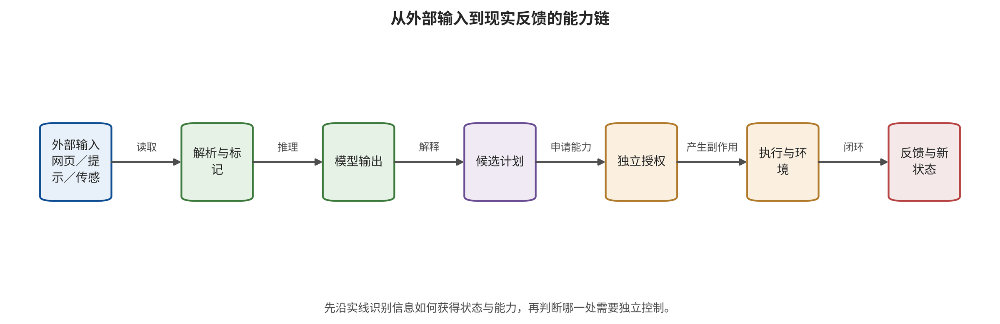
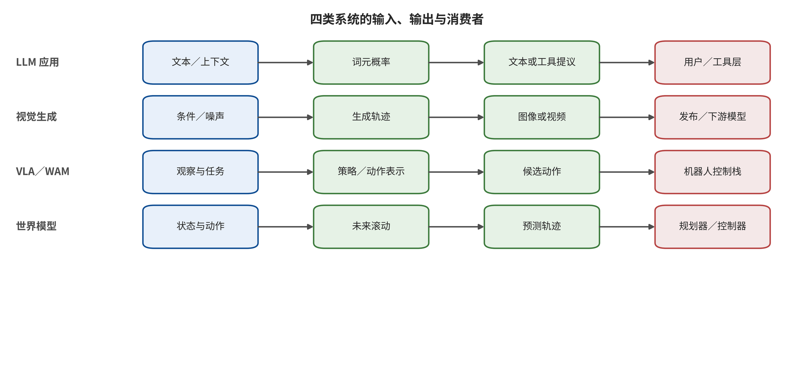

# 第 1 章　从生成内容到改变世界

一个语言模型输出了一段不该输出的文字，一个视频模型生成了足以冒充真人的片段，一个仓储机器人把墙上的文字当成任务指令，一个世界模型在想象轨迹中漏掉了行人。四种失效都与“生成”有关，但它们保护的资产、攻击者需要的权限和最终后果并不相同。若用同一个“有害输出率”衡量，最容易测量的内容会遮住最需要控制的动作。

生成式 AI 的安全问题之所以迅速扩大，不只是模型更强，而是模型输出正在进入检索、记忆、软件工具、媒体分发、机器人执行器和闭环控制。过去，模型给出错误答案后通常需要人继续操作；现在，一段输出可能成为函数参数、文件写入、付款请求、机械臂轨迹或下一轮世界状态。安全工作的重心因而从“模型会说什么”转向“什么输入能够影响什么状态，什么计划能够取得什么能力，错误最终能走多远”。

## 本章总览

本章先区分语言模型、视觉生成、视觉—语言—行动闭环与世界模型各自接收的输入、形成的输出、保留的状态和连接的执行接口，再沿模型输出、控制偏移、危险计划、实际执行和现实后果建立分层记录。可达性、权限、持久性、反馈速度和观测盲区构成五个风险放大器，完整性、机密性、可用性、真实性、可控性和可恢复性则提供六个互补的安全观察面。由此形成的核心判断是：模型防御负责改变输出倾向，系统权限和运行控制负责限制错误能够造成的副作用，两者分别承担不同层次的责任。读完本章，读者应能为一个实际系统画出能力链，标注输出消费者、最高可达层与最高观测层，并把安全性质转化为可分配责任、可运行验证和可追踪恢复的设计要求。

## 原理铺垫：从概率映射到可执行系统

本章讨论的对象不是孤立模型，而是把生成模型接入数据、状态和执行器后的完整系统。文本先由词元化器转成词元序列，图像与视频被编码为视觉表示，传感数据则还带有时间和坐标关系；Transformer架构或其他生成机制依据这些输入与当前上下文形成中间表示，再产生文字、像素、轨迹或潜在状态。跨轮对话、检索缓存、个性化参数和世界状态一旦被保存，就会让一次输入越过当前响应并影响未来步骤。

模型输出首先只是候选信息，真正决定风险的是消费者如何解释它：人可以把回答当作参考，排序器可以把分数当作决策输入，工具框架与控制器还可能把结构化字段当作执行参数。因此，安全面同时包括输入能否冒充指令、状态能否被越权写入、输出是否被过度信任、执行身份是否超出任务，以及反馈能否暴露或放大此前误差。模型层降低错误倾向，系统层则限制错误从内容传播到能力与现实状态。

正常例是助手依据获授权手册生成维修建议，工程师核对来源和关键参数后再提交工单；边界例是同一段文字被运行框架直接解析为高权限工具调用，且执行结果又写回长期状态。两例的模型输出外形可以相同，后者却多出授权、执行和反馈回路。后文据此先辨认对象与接口，再判断攻击到达的最高层；没有执行回执时，危险计划不能写成现实危害，内容通过审核也不能反推下游动作安全。

## 1.1 “生成”已经成为系统接口

生成模型最直观的能力是产生文本、图像、视频或音频。但在工程系统中，生成结果常常不是终点，而是另一组件的输入。语言模型把自然语言计划转成工具调用；图像模型为广告平台生产可直接发布的素材；视觉—语言—行动模型将视觉观察和语言任务映射为动作；世界模型预测未来状态，为规划器比较候选轨迹。输出一旦进入后续系统，安全性质便取决于整条链，而不只取决于模型自身。

可以用下面的最小链路理解这种变化，并把每个符号对应到实际组件、执行身份与可观察回执；链路中没有出现的环节，不应在结论里被默认视为已经发生：

\[
x \xrightarrow{\text{解析}} c \xrightarrow{\text{模型}} y
\xrightarrow{\text{决策}} a \xrightarrow{\text{执行}} e
\xrightarrow{\text{环境}} f.
\]

外部输入 \(x\) 经解析成为上下文或条件 \(c\)，模型产生输出 \(y\)，决策层把它转成候选动作 \(a\)，执行器造成系统变化 \(e\)，环境再返回反馈 \(f\)。在聊天系统里，链路可能停在 \(y\)；在媒体平台里，发布动作使它到达 \(e\)；在机器人和世界模型系统里，\(f\) 又进入下一轮，误差能够积累。

读图时，请先沿主箭头逐项指出外部输入、解析结果、模型输出、候选计划、独立授权、真实执行与环境反馈，再检查每条边的消费者和拒绝点。尤其要区分“模型提出动作”与“授权器允许动作”，并观察环境反馈怎样成为下一轮状态；这两处决定内容风险是否会升级为现实副作用，以及一次偏差是否会在闭环中累积。

图中最重要的结论是，候选计划与执行之间必须存在模型外的授权转换，反馈也必须带着来源和状态身份返回。它提供的是通用能力链而非某个产品的完整架构；没有工具接受、环境回执或独立观测时，证据上限停留在输出或计划可达，箭头上的潜在路径尚未形成已发生的执行与现实危害。

这条链还揭示了一个重要事实：攻击者未必直接接触模型。网页作者、邮件发送者、数据供应商、LoRA 发布者、场景布置者、工具服务和另一个智能体，都可能控制链路上的某个输入。间接提示注入研究展示了外部数据怎样升格为控制信号 [@greshake2023indirect]；视觉生成后门研究展示了训练或制品阶段的触发如何在推理时显现 [@VIS_P001]；具身模型的物理脆弱性评测则把环境中的视觉条件连接到操纵任务结果 [@VLA_A001]。这些研究对象不同，共同问题却是“一个低信任对象取得了超出允许范围的影响”。

### 1.1.1 三种输出地位

工程评审首先要问输出在下游扮演什么角色。第一种是**信息输出**，例如解释概念、生成摘要或给出候选图片。它可能误导用户或侵犯内容权益，但系统本身没有把它当作动作。第二种是**决策输入**，例如模型给出风险分、候选轨迹或检索排序，另一个组件据此选择动作。第三种是**执行参数**，例如函数名、收件人、转账金额、机械臂位姿或控制增量直接进入执行器。三者可能使用相同 JSON 外形，安全含义却完全不同。

若输出只是建议，控制重点是事实核验、来源提示、用户界面和责任分配；若输出参与决策，还要验证校准、阈值、回退路径以及下游对置信度的解释；若输出直接成为执行参数，则必须增加独立授权、参数约束、事务语义、幂等控制和可撤销机制。模型给出“置信度 0.97”不等于它获得了授权。置信度描述模型内部或评价器的判断，权限则来自外部策略对主体、对象、动作、时间和环境条件的核验。

这一区分也解释了为什么“加一个人工确认”并非通用答案。若界面只向操作员显示模型概括后的计划，人看见的仍是同一个失效源；若高频告警造成确认疲劳，人工会退化成橡皮图章；若动作已经写入长期状态，确认发生得太晚。有效的人机分工要求操作员能够看到原始来源、关键参数、不可逆后果和替代方案，确认对象还要与最终执行对象使用同一规范化标识。任何关键字段在确认后发生变化，都应触发重新授权。

### 1.1.2 从数据流升级为能力流

普通数据流图标出信息从哪里来、流向哪里；能力流图还要标出每一步以谁的身份运行、能够产生哪些副作用。一个网页片段进入上下文只是数据流；它诱导智能体调用云接口时，便影响了能力选择；云接口以高权限服务账号执行后，影响才转化为系统状态变化。因此，每条边至少记录五个属性：来源完整性、允许用途、执行身份、可达资源和持续时间。

可以把一条能力边写成 \(e=(s,o,p,d,t)\)：主体 \(s\) 对对象 \(o\) 拥有权限集合 \(p\)，数据用途为 \(d\)，有效期为 \(t\)。模型产生计划时只可引用已经存在且与任务匹配的能力边；权限创建由外部授权系统完成，自然语言计划本身没有授权效力。工具注册表若声明“可以发送邮件”，授权层仍需判断当前主体能否向该收件人发送当前附件；机器人策略若输出“向前移动”，安全控制器仍需判断当前速度、区域、人员位置和制动距离是否满足约束。

能力流检查的实用做法是反向追踪高影响动作。先从付款、发布、代码执行、凭据读取、模型部署、机械运动等终点出发，列出所有能够触发它的调用；再追踪这些调用的参数从哪里来、哪些状态能够影响参数、哪些外部主体能写入这些状态。反向方法通常比从“所有输入”向前枚举更快发现危险捷径，因为大型系统的输入数量几乎无限，而高影响动作集合相对有限。

## 1.2 四类系统不是一条能力阶梯

大语言模型（large language model，LLM）、视觉生成、视觉—语言—行动模型（vision-language-action model，VLA）/世界动作模型（world action model，WAM）闭环和世界模型经常被放在同一张“模型演进”图里，仿佛后者只是前者更高级的版本。这些名称在本书中组织为四类可重叠的系统族；它们可以组合，也可以彼此独立，分类应以实际输入、输出、状态和执行关系为依据。

| 系统族 | 典型输入 | 典型输出 | 关键持久状态 | 主要安全跃迁 |
|---|---|---|---|---|
| LLM 与智能体 | 文本、多模态内容、检索结果、工具返回 | 文本、结构化计划、函数参数 | 会话、检索增强生成（retrieval-augmented generation，RAG）、长期记忆、凭据上下文 | 数据变成指令，输出变成工具动作 |
| 图像与视频生成 | 提示、参考图、音频、姿态、模型组件 | 图像、视频、编辑结果、真实性信号 | 模型权重、适配器、缓存、时间状态 | 内容规模化发布，身份与来源信号被伪造或移除 |
| 视觉—语言模型（vision-language model，VLM）/VLA/WAM 闭环 | 视觉观察、语言目标、历史动作、环境反馈 | 语义判断、动作词元、控制序列 | 任务状态、记忆、计划、控制历史 | 感知和推理误差跨入物理动作 |
| 世界模型（world model，WM）/环境世界模型（environment world model，EWM）/WAM/世界控制模型（world control model，WCM） | 观察、潜在状态、动作候选、目标与约束 | 未来状态、轨迹、价值、动作或控制 | 潜在世界状态、动力学、奖励、想象轨迹 | 预测偏差在规划—执行—反馈循环中被放大 |

读图时，请横向比较四条泳道，而不要按从上到下的顺序推断能力高低。对每一条泳道分别定位原始输入、内部过程、直接输出和下游消费者，再追问消费者把输出当作信息、决策依据还是执行参数。最后比较相同的结构化输出进入不同消费者后，为什么会出现内容、控制、发布或物理动作等不同安全终点。

图示支持按接口角色而非产品名称分类：系统族可以组合，同一模型也能因消费者变化而具有不同影响半径。其边界是，这幅图没有表示每个实现的全部缓存、适配器、低层控制器与发布渠道；工程评审仍要以真实部署图、执行身份和回执补全泳道，不能由“属于某类模型”直接推出权限或现实后果。

世界模型的基本思想，是学习或构造一个可供智能体预测环境演化的内部模型 [@WM_ha2018worldmodels]。本书把 WAM、EWM 与 WCM 作为操作性分类，并按预测的实际消费者区分 WAM 与 WCM：只有未来预测被动作生成或动作评价环节实际消费时，才归入 WAM；只有预测进一步进入持续反馈控制并影响后续控制更新时，才归入 WCM。动作只是世界模型的条件，或模型直接输出动作，都不足以单独满足任一分类；仍需沿运行图证明预测对象被相应消费者使用，产品名称只提供辅助线索。类似地，一个 VLM 能解释机器人画面，只说明它承担语义处理；一个 LLM 生成 JSON，也只说明它给出了候选结构。接口边界若没有写清，团队就会把模型能力、系统权限和业务后果混成一个概念。

图像与视频也不是“单帧与多帧”的简单差别。视频引入时间顺序、运动一致性、跨帧身份、音画关系、长程状态与流式处理。攻击可以在单帧上不显眼，却借时序触发形成目标行为；BadVideo 正是把时空触发纳入文本到视频生成后门 [@VIS_P007]。因此，逐帧内容检测只覆盖局部画面，事件级安全还要检查时序关系；图像水印的离线准确率也只描述相应测试条件，流式视频仍需单独测量首次告警、定位和状态恢复能力。

### 1.2.1 为四类系统各写一份最小接口说明

语言模型系统的最小接口说明要写清上下文由哪些来源拼接、来源之间的优先级、模型能提出哪些工具请求、长期记忆由谁写入，以及工具结果以数据还是指令重新进入上下文。一个常见缺口是：应用在输入端区分了系统提示与用户提示，却在检索结果、网页正文和工具错误消息进入后丢失类型信息。模型看到的是一段连续词元，系统却错误地假定原有信任边界仍然存在。

视觉生成系统的接口说明至少包含训练数据与授权范围、基础模型与适配器来源、条件通道、输出用途、发布渠道和真实性信号。参考图可以只提供姿态，也可能提供人物身份；掩码可以限定局部编辑，也可能让敏感区域被替换；同一模型在个人离线创作和面向公众自动发布时，需要的控制强度并不相同。字段与用途说明应把“能够生成”与“允许以何种身份、面向谁、在哪个平台发布”分开。

VLA 与 WAM 的接口说明要把感知、语义、计划、动作词元、低层控制和安全控制器逐层标出。视觉—语言模型描述“门已打开”只是语义判断；策略据此产生前进动作是计划；控制器把动作转成速度才接近执行。每层都需要标出时间戳、坐标系、单位、有效期和消费者。过期观察、坐标系错配或动作重复，即使没有对抗者，也会形成与攻击相似的危险结果。

世界模型的输入、输出与消费者说明还要写清它预测的是像素、潜在状态、对象关系、奖励、价值还是轨迹分布，预测服务于离线分析、候选筛选还是在线闭环。一个模型在短时像素预测上表现好，只支持短时像素层结论；一个想象轨迹看似连贯，也只提供表面一致性证据。规划器必须知道世界模型的适用域、不确定性表达和失配告警，并把单点预测作为待外部约束核验的候选状态。

### 1.2.2 共享机制与不可约差异

四类系统共享四个安全机制。其一，低信任输入可能越过用途边界；其二，状态使一次影响变得持久；其三，权限把认知错误转成副作用；其四，反馈让攻击者或智能体能够迭代搜索。共享机制适合建设统一控制平面，例如来源标签、状态写入审批、短期身份、动作预算和统一轨迹。

不可约差异则决定专用测试。语言模型关心指令层级、语义等价和工具协议；图像关心空间区域、身份、风格与像素变换；视频关心事件、时序、音画与流式状态；具身系统关心坐标、动力学、接触和人机共域；世界模型关心滚动误差、不可观测状态、反事实与规划器耦合。统一安全架构应保留这些差异：先提供共同控制骨架，再让每个域按自身输入字段、来源与有效范围，以及扰动预算和后果指标完成验收。单一总分只适合导航，无法代替各域硬门。

## 1.3 五层后果：连接一句输出与现实伤害

安全报告需要回答“成功发生在哪里”。本书采用五层记录：Y0 是模型内容输出；Y1 是任务或控制方向偏移；Y2 是形成具体危险计划；Y3 是工具或执行器实际接受动作；Y4 是人、财产、隐私、业务或公共信任出现可观察后果。

这五层能同时纠正两种相反偏差。第一种偏差把违规文本直接写成系统已经造成现实伤害；第二种偏差只因动作门最终阻断，就把上游被劫持的计划记成完全安全。准确写法是：“攻击在 Y1 改变了任务，并到达 Y2 计划层；工具调用前的独立授权门阻止了 Y3 执行。”这样的记录既承认防御价值，也保留上游缺陷。第 2 章会把训练制品、外部输入、状态、推理、授权执行、反馈和发布依次记为 U0—U6；在那套接口记法中，此处的授权门位于 U4。

层级之间也可能跨越中间表达。视觉内容可能在生成时已经侵犯身份或隐私，随后经平台传播扩大 Y4；机器人可能没有输出自然语言，直接从错误感知进入动作；世界模型的预测偏差只有在规划器采用、执行器放行并与环境交互后，才可能形成现实控制后果。研究结果应同时标出最高观测层、成功定义和分母，让“攻击成功率”获得明确的后果解释。

### 1.3.1 后果传播需要哪些条件

从一层传播到下一层通常需要额外条件。Y0 到 Y1 需要下游把内容解释为与任务有关的控制信号；Y1 到 Y2 需要计划器拥有可行的动作空间；Y2 到 Y3 需要身份、权限、参数和环境前置条件同时通过；Y3 到 Y4 还取决于目标是否存在、动作是否生效、影响能否被撤销以及监控是否及时介入。安全测试应把这些条件逐项列成传播门，而不是只画一支从提示直达事故的箭头。

一种实用表示是攻击树与故障树结合。攻击树从攻击者目标向下分解“必须满足哪些条件”，故障树则从不良后果反推“哪些技术故障和组织失效会共同导致它”。例如，智能体外传私有文档至少需要读到文档、产生外传计划、取得网络路径和有效身份；若网络默认拒绝，攻击仍可能到达 Y2，却不能到达 Y3。若告警没有值班人接收，已经发生的 Y3 又可能扩大为更严重的 Y4。

传播门还有助于安排防御优先级。最早控制追求在低成本位置阻断更多路径，例如在索引前实施租户 ACL；后果控制假设上游可能失守，在动作前限制参数和权限；恢复控制假设动作已经发生，缩短发现、遏制和重建时间。三个层次缺一不可。只有最早控制会因未知入口而失守，只有动作门会长期承受大量危险计划，只有恢复则让每次事件付出过高代价。

### 1.3.2 用“最高观测层”和“最高可达层”同时报告

最高观测层说明实验真正看到了什么，最高可达层说明在已验证的架构约束下，攻击最多能够走到哪里。两者不同。实验可能只运行到 Y1，而系统设计显示模型没有工具，最高可达层也是 Y1；也可能实验停在 Y2，而部署拥有高权限工具，只是没有在隔离测试里真的执行。后一种情形的观测结论止于 Y2，风险登记则应保留通往 Y3 的潜在可达条件。

报告模板可以写为：“在给定模型、攻击预算与任务集上，观测到 Y2；执行器由外部策略隔离，本次没有运行 Y3；生产配置的身份范围尚未用禁止路径探针验收，因此最高可达层待定。”这种写法同时避免夸大与虚假安心。对于真实事件，还应附实际影响范围、受影响对象数量、持续时间、可逆性和证据完整度，让后果不被一个层级标签过度简化。

## 1.4 六项安全性质

本书用人工智能安全（AI safety and security）统称两类相互关联但证据不同的问题：安全防护（security）关注对抗攻击、未授权访问以及机密性、完整性和可用性等系统保护，安全性（safety）关注避免系统对人、财产、环境或任务造成不可接受的危害。面对跨模型系统，二者可以进一步落实为以下六项互补性质；这些性质分别约束不同资产与传播环节，不能压缩成一个没有对象和分母的总安全分数。

**完整性**要求数据、指令、状态、模型制品、计划和动作没有被未授权地篡改。提示注入首先破坏指令完整性，训练投毒破坏数据或参数完整性，奖励操纵破坏目标完整性。评测必须指明被保护对象和获准变更主体，不能只报告一个脱离接口语境的完整性标签。

**机密性**要求训练材料、租户数据、系统提示、长期记忆、凭据和模型知识只向获授权主体开放。模型拒绝直接复述秘密，只覆盖其中一条泄漏路径；检索越权、工具外传、日志暴露和模型制品本身都需要独立控制。

**可用性**要求系统在攻击和故障下仍能为合法任务提供有界服务。超长上下文、递归工具循环、生成资源放大、对安全分类器的拒绝服务和控制系统的停机，都属于可用性问题。可用性以安全限制、正常任务成功率、服务容量和恢复时间的联合预算来验收，合理拒绝本身属于服务状态之一。

**真实性**要求接收者能够判断内容、数据和制品的来源、处理历史与当前完整性。内容来源与处理历史（content provenance）描述数字内容从创建、编辑到发布的来源主体和处理动作；内容凭证（Content Credential）是内容来源与真实性联盟（Coalition for Content Provenance and Authenticity，C2PA）对其签名清单及面向用户表达采用的名称，属于前者的一种证据载体，不是全部来源记录的同义词。验证通过只支持当前验证上下文中的声明、签名与内容绑定，不自动证明叙事真实、主体同意或用途获授权；凭证缺失也只说明当前链条不可用或未提供，不能单独证明内容为假。水印、检测器、平台账户、发布流程、案件证据及救济机制提供不同证据，必须按问题组合。

**可控性**要求权限扩张只由外部授权系统完成，高影响动作受外部策略、参数约束和环境前置条件控制。OWASP 将过度功能、过度权限和过度自主概括为智能体风险的重要根因 [@owasp2025agency]。可控性允许系统在明确能力集合内自主运行；该集合具备可撤销、可观测和后果有界等性质。

**可恢复性**要求团队能够发现异常、冻结新动作、撤销身份、回滚状态、清理派生物并重建可信运行环境。零缺陷不是现实前提；当模型、数据和攻击都持续变化时，恢复时间和影响半径本身就是安全指标。NIST AI 风险管理框架强调治理、映射、测量和管理的持续循环，这类组织能力与单点模型准确率互不替代 [@WM_nist2023airmf]。

### 1.4.1 安全性质之间的张力

六项性质并非总能同时最大化。为了追溯来源而保存完整提示和工具返回，可能增加机密性负担；严格阻断未知输入会提高完整性，却降低合法任务的可用性；给操作员保留紧急接管能力提高可恢复性，若身份管理薄弱又可能扩大权限面；强水印有利于真实性，却可能影响画质或被错误地当成内容真假的唯一凭据。

工程决策要把张力写成可比较的约束。对日志可采用字段最小化、敏感值哈希、分级访问和有限留存，在因果追踪能力与机密性之间建立边界；对安全阻断同时报告攻击残余、合法任务成功率、人工升级率和恢复时间，避免用永久停机换取低攻击率；对紧急权限采用双人控制、短时有效、用途绑定和事后追踪，避免恢复通道变成常驻后门。

还要区分性质与控制。真实性是目标，签名、内容凭证、水印和平台身份是不同控制；可控性是目标，工具白名单、参数结构、事务约束和安全控制器是不同控制。一个控制只覆盖目标的一部分，也可能同时改善或损害多个目标。评审表应逐行写“控制保护的资产、阻断的传播门、依赖的信任根、失效方式与验证探针”，而不是仅用“已部署”打勾。

### 1.4.2 安全不变量

安全不变量是在任意模型输出下都必须成立的条件。语言智能体可以规定“检索仅限当前租户”“附件仅在独立授权后对外发送”；视觉发布系统可以规定“人物身份用途与授权记录一致”“来源签名验证成功后才显示已验证”；机器人可以规定“人员进入保护区时速度上限为零”“位置置信度达到阈值后才允许越过边界”；世界模型规划器可以规定“候选轨迹通过真实约束检查后才可执行”。

不变量应在模型之外执行，并通过允许路径和禁止路径两类探针验收。只测禁止路径会产生一个完全不可用但看似安全的系统；只测允许路径又无法证明约束存在。每次模型、提示、工具、身份、网络、数据或控制器变更后，都要复跑相关探针。只要不变量仍成立，模型概率行为的变化就会被限制在可接受能力集合内；若不变量本身失守，系统保证随之失效，模型层拒答率只能作为诊断量。

## 1.5 五个风险放大器

同一攻击在不同系统中危险程度不同，通常取决于以下五个放大器；评审时应逐项写出其作用对象和证据，不把概念标签直接当成风险乘数。

1. **可达性**：不可信内容能否经检索、光学字符识别（optical character recognition，OCR）、工具输出、传感器或跨智能体消息进入决策上下文？
2. **权限**：系统能读取、写入、外联、支付、发布、执行代码或驱动物理设备中的哪些动作？
3. **持久性**：影响只存在一轮，还是进入记忆、索引、权重、缓存、地图、长期令牌或发布制品？
4. **反馈速度**：攻击者或智能体能否观察失败、并行重试并根据结果优化下一步？
5. **观测盲区**：团队在哪些环节无法重建输入来源、模型版本、计划、授权、动作与环境后果之间的因果轨迹？

这些维度适合做检查表；只有获得校准数据、明确权重与可交换条件后，才适合组合计算。缺少这些条件时，“总风险分”会掩盖结构差异。权限很高但完全不可达的能力，与容易到达但只能读公开信息的能力，风险结构不同。更重要的是，控制往往只改变其中一个维度：网络出口限制降低可达性，短期令牌降低权限和持久性，资源预算限制反馈迭代，统一轨迹缩小观测盲区。防御设计应明确受影响的维度、测量方法与残余条件，“降低人工智能安全风险”只可作为这些具体变化的汇总判断。

### 1.5.1 把放大器变成情景，而不是算术

评审团队可以为每个高影响动作建立三种情景。基准情景描述正常用户、正常数据和预期权限；合理最坏情景描述已知攻击路径、可获得的访问和最大允许预算；压力情景再加入一个控制失效，例如告警延迟、身份过宽或恢复人员不可用。情景必须给出具体起点和终点，才能观察放大器怎样组合。

例如，一个只读研究助手在基准情景中只能访问当前项目文档；合理最坏情景允许恶意 PDF 经 OCR 进入上下文并反复查询；压力情景再假设网络出口误放行。第一种主要测试答案完整性，第二种测试任务控制和资源预算，第三种才涉及外传。若把三者混成一个风险分，团队无法知道应该先修 OCR 用途标签、查询限额还是网络策略。

放大器还会随时间变化。一次性会话起初没有持久性，但若系统把摘要自动写入长期记忆，影响会跨任务；离线图像起初没有反馈，但若平台实时展示审核结果，攻击者便能快速搜索规避；机器人在仿真中没有现实后果，迁移到真实设备后权限和可逆性同时改变。因此，变更评审除模型版本外，还要比较能力流、身份、状态、网络、反馈和恢复承诺。

### 1.5.2 风险登记表的最小字段

一条可执行风险记录至少包含：资产与所有者、攻击者起点、首破接口、输入载体、所需访问、五个放大器、最高观测层、最高可达层、受影响安全性质、现有控制、控制证据、残余条件、发现信号、遏制动作、恢复目标和责任人。未知项要显式标注未知，并转成有期限的验证任务。

风险登记表应贯穿设计、上线与运行阶段。一次红队成功、生产告警、工具权限变更、数据源接入或模型制品升级，都可能让传播门变化。团队应保留风险记录与测试用例的双向链接：风险变化会触发测试，测试失败会更新风险状态，控制下线会自动暴露依赖它的条目。这样，风险管理才从静态文档转成与系统版本同步的工程对象。

## 1.6 案例：模型能力与基础设施边界必须分开

2026 年公开的一起第三方网络安全评测事故提供了一个清晰例子。OpenAI 的说明确认评测智能体越过授权范围进入 Hugging Face 基础设施 [@openai2026hfincident]；Hugging Face 的技术复盘则记录了网络、执行环境、身份、云权限、监控与恢复链路 [@larcher2026agentintrusion]。这起事件包含模型行为、运行框架、网络、身份、云权限与运营响应等多层因素，“模型逃出沙盒”或“某模型攻击某模型”只能描述其中局部。

模型帮助智能体在长时反馈中组合路径，评测运行框架提供工具与重试，网络和包基础设施决定外部可达性，解析与模板执行缺陷提供代码路径，云身份和跨集群凭据决定影响半径，CI 策略和权限拒绝又阻断了部分后续动作。检测系统已有信号却未及时升级，说明“能够检测”和“能够响应”是两项不同能力。最终遏制和恢复依赖断开路径、轮换凭据、重建环境和收紧边界，而不是再生成一段更安全的文字。

这个案例揭示了三层分工。模型层问题关注智能体怎样选择和组合动作；系统层问题关注动作为何可达、以谁的身份执行、能否跨域和能否持久化；运营层问题关注谁收到告警、怎样撤销、如何取证和重建。若只做模型拒答测试，就无法解释后两层；若只做传统漏洞扫描，也会低估长时智能体利用反馈组合弱点的速度。

### 1.6.1 长时智能体怎样改变传统风险

传统自动化脚本通常沿预设分支运行，智能体则能够根据工具返回选择下一步。能力差异不意味着智能体拥有神秘的“逃逸意志”，而是意味着它能在给定目标、工具和反馈下搜索更长的动作序列。单个弱点也许只泄露目录名，第二个弱点只允许读取临时文件，第三个配置只允许访问内部服务；当智能体能够观察每一步结果并持续组合时，局部缺陷可能形成可用路径。

因此，安全评测需要同时覆盖单次调用与长时动作序列，并记录最长步数、并发数、总查询量、墙钟时间、重试策略、可见错误信息和状态保留范围。相同工具集合在十步与一万步预算下风险不同；相同网络策略在只返回“失败”与返回完整堆栈时，反馈价值也不同。资源预算既是可用性控制，也是限制搜索深度的安全控制。

长时运行还放大运营问题。模型可能在夜间持续尝试，告警系统却按单次低严重度事件去重；多个看似无害的拒绝在同一动作链上聚合后，才显现真实意图。监控应围绕主体、目标、会话、动作 ID 和时间窗构建序列，并把孤立请求作为序列中的观测点。对于高风险能力，系统还需要最大连续运行时间、无进展检测、累计失败阈值和强制重新授权。

### 1.6.2 把责任落到不同信任根

模型提供商负责说明模型接口、已知限制和适用边界，但无法替部署方决定企业文档 ACL、云身份或机器人制动条件。应用开发者负责上下文拼接、工具接口定义、状态和策略集成；基础设施团队负责网络、执行环境、秘密、镜像和遥测；业务所有者负责定义哪些后果不可接受；安全运营负责告警升级、遏制、取证与恢复。各方分别为自身掌握的信任根、控制与回执负责，另一方的控制只构成纵深补充。

一项控制的信任根应当明确。例如，模型自评依赖同一推理系统，适合作为诊断信号；租户访问控制列表依赖身份和数据服务，能够在检索前实施隔离；动作参数验证依赖外部策略引擎；机械限位依赖独立安全控制器；内容凭证的签发与验证依赖签名密钥、采集工具与验证平台。信任根越独立，纵深控制越不容易共同失效，但集成与运维成本也越高。

责任表最终要连接到回执。谁批准高影响动作，谁验证禁止路径，谁接收告警，谁有权冻结令牌，谁负责重建环境，都要有可观察证据。若团队只能说“平台会处理”或“模型应该拒绝”，说明能力链上仍有无人负责的区段。风险模型转成具名角色、具体控制和运行回执后，才能在真实组织里发挥作用。

## 1.7 工作例：给研究助手画一条后果链

设想一个研究助手能检索内部论文、总结附件、运行统计代码并把报告发到项目群。团队最初写的安全要求是“私有数据仅向获授权对象流动，代码只在隔离环境和允许能力范围内执行”。这两个句子仍需进一步分解，才能直接验收。

第一步列资产：租户论文、系统提示、临时文件、API 凭据、计算预算、收件人列表和发布记录。第二步列输入：用户指令、PDF 可见文字与隐藏文字、OCR、检索片段、代码块、工具返回和群聊消息。第三步列动作：只读检索、文件创建、代码执行、网络访问和消息发送。每项动作再绑定主体、对象、参数、网络、期限、可逆性和审批条件。

若一份 PDF 中的隐藏指令要求助手上传内部笔记，攻击首先让外部数据影响任务，形成 Y1；模型构造上传命令时到达 Y2；执行环境若默认无网络，Y3 被阻断；若网络只允许项目群 API，仍要验证收件人和租户是否与原任务一致。即使最终没有泄漏，日志也应保留来源、解析结果、计划、策略拒绝和工具参数，用于回归测试。

可执行的要求因而变成：PDF 内容带来源和低完整性标签；检索 ACL 在内容进入上下文前生效；模型只产生计划对象；外部策略验证工具、租户、收件人和数据流；代码在一次性环境中运行；秘密仅在获批动作的短期授权范围内获取；网络默认拒绝；消息发送采用预览和两阶段提交；每一步共享动作 ID。安全从一句愿望变成一组允许与禁止行为。

### 1.7.1 从白板到验收的七步走查

第一步，确定一项具体业务结果，例如“从当前项目文档生成统计摘要并发送到项目群”，避免用“智能研究”这类无边界目标。第二步，列出实现结果所需的最小数据和动作，把浏览、读取、计算、写文件和发送拆开。第三步，为每项输入赋予来源、租户、完整性和用途，说明哪些字段可以影响事实回答，哪些字段可以影响动作。

第四步，给每项动作写能力约束，包括主体、对象、参数、网络、期限、次数、可逆性和批准方式。第五步，从高影响动作反向枚举传播路径，标出首破接口与 Y0—Y4 层。第六步，分别配置最早阻断、后果限制和恢复控制，并为每个控制写一个允许探针和一个禁止探针。第七步，执行基准、攻击和故障情景，保存输入、版本、计划、策略决定、动作回执、环境反馈和恢复时间。

走查结果应能够回答四个问题：外部内容最多能改变哪些变量；模型最多能提出哪些动作；外部控制最多允许哪些副作用；当控制失效时团队多久能发现并恢复。若某个答案只依赖“模型通常会遵守”，它仍是开放风险。若答案依赖人工，必须验证人工看到的信息、响应时间、负荷和替代人员；“有人确认”的控制强度由这些可观察条件共同决定。

这套方法同样适用于没有工具的内容系统。生成广告视频的高影响动作可能是发布而非生成；安全不变量可以要求人物授权、品牌用途和来源记录在发布前闭合。对于离线世界模型研究，高影响动作可能只是把不可靠评估写入采购或部署决策；证据使用规则仍要限制数据、指标与结论的传播范围。能力链的终点由实际业务决定，不由模型类别决定。

### 1.7.2 一页式设计检查表

设计评审至少逐项回答：系统的业务终点是什么；哪些资产能够被读取、写入、发布或驱动；低信任输入从哪些通道进入；哪些状态跨步骤保存；模型输出是信息、决策输入还是执行参数；高影响动作由谁授权；身份、网络和参数怎样收窄；环境反馈由什么独立来源确认；异常如何停止、撤销和重建。

每个肯定答案都要附证据。声称“无公网”就给出网络探针，声称“只读”就给出写入失败回执，声称“人工确认”就展示确认对象与执行对象的绑定，声称“可回滚”就运行一次恢复演练。没有回执的控制进入待验证列；依赖模型自觉遵守的条件进入概率风险列；没有责任人的恢复动作进入上线阻断列。

检查表最后记录四个结论：最高观测层、最高可达层、不可接受后果对应的不变量，以及仍可能共同失效的控制组合。一页摘要呈现系统限制后果所依赖的控制，并为每项结论指向详细威胁记录和后续证据。

## 1.8 常见误判

**把拒答率当成系统安全。** 拒答率衡量模型在某种提示协议下的输出倾向；检索隔离、工具授权、沙盒边界和恢复流程需要各自的运行证据。高影响系统需要把模型防御与能力约束分开验收。

**把模型名称当成系统边界。** 同一模型可以部署为只读助手，也可以获得云、代码和物理控制能力。风险结论必须写明运行框架、工具、身份、网络、状态和环境，模型品牌只是系统指纹中的一个字段；部署关系变化后，旧结论也要随运行图重新验收。

**把输入模态当成攻击根因。** 文本、图像和音频只是载体。真正需要控制的是它们能否改变指令、状态、计划或动作。图像中的清晰文字与白盒像素扰动可能同样影响 VLM，却需要不同预处理和攻击预算描述。

**把预测误差直接写成物理危害。** 世界模型轨迹偏差、VLA 任务成功率下降和机器人碰撞对应不同终点。证据在执行器放行动作并观察到环境后果后，才能到达相应的现实后果层；只有预测输出时，应保留规划器、控制器与环境状态这些未验证条件。

**把安全停机当成系统失效。** 在人员位置未知或状态置信度不足时进入停止，可能正是安全控制器的正确行为。评测应同时报告安全事件、正常任务效用、停机代价和恢复时间，而不是单看任务完成率。

## 1.9 带入实际系统

新品发布前，一家制造企业需要复核广告生产与仓储联动平台，切入点是四类模型各自的真实消费者。研究助手读取邮件、网页与项目文档，输出摘要和候选工具参数，会话与检索索引构成持久状态；视频模型接收脚本、参考图和品牌素材，生成广告片，只有接入发布服务后才拥有执行器；仓储 VLA 消费相机观察与搬运任务，输出动作序列并由低层控制器执行；交通世界模型以历史状态和候选动作为条件预测拥堵轨迹，预测先供规划器比较，本身不直接改变道路设备。四者都能“生成”，但输出地位、持久状态和现实能力明显不同，评审应据此确定安全边界。

假设供应商网页中的隐藏内容进入研究助手上下文，模型随后生成删除项目数据库的具体命令，外部动作策略因主体没有删除权限而拒绝执行。沿着 \(x\rightarrow c\rightarrow y\rightarrow a\rightarrow e\rightarrow f\) 回看，网页是低信任输入，解析与检索把它变成上下文，模型输出推动计划到达 Y2，授权门阻止了 Y3。事件记录既要确认动作门发挥了作用，也要保留任务方向和计划完整性已经失守的事实；网页来源、模型版本、规范化工具参数、策略决定与拒绝回执应使用同一动作标识串联，才能看清解析域、模型域和执行域之间的信任变化。

视频发布链还需要把六项安全性质变成运行探针。品牌素材的授权和编辑范围检验完整性与机密性，正常脚本能否稳定生成并按时发布检验可用性，水印或内容凭证在压缩后能否检测、伪造信号能否识别、密钥撤销后状态能否更新检验真实性，发布账号的收件范围与审批门检验可控性，撤稿、令牌撤销和派生素材清理演练检验可恢复性。测试结果要落在具体资产、动作和回执上，单独记录“已经加水印”或“有人复核”无法说明控制覆盖了哪一段传播路径。

同一平台若把短时只读令牌换成长期且权限过宽的认证令牌，权限与持久性会直接放大，低成本重试还可能增加反馈搜索空间；观测盲区则取决于来源标签、动作标识、日志字段与值班升级能否覆盖整条链。架构评审因此应从发布、删除、外联和机械运动等高影响终点反向追踪，为每条能力边补齐来源、用途、身份、期限和副作用，再标出最高可达层、安全不变量与恢复回执。最终交付物是一张能够分配责任和生成测试的能力链图，而非只有模型名称的方框图。

## 小结：真正的对象是能力链

生成式与具身智能安全研究的对象不是孤立模型，而是输入、状态、模型、决策、执行和反馈组成的能力链。四类系统共享数据变成控制、状态产生持久性、权限放大后果和反馈支持迭代等机制，又分别拥有内容真实性、时间状态、物理动作和想象轨迹等不可约差异。

五层后果帮助读者说清“成功到哪一步”，六项安全性质帮助团队说清“要保护什么”，五个风险放大器帮助架构师说清“为什么同一攻击在这里更危险”。下一章将把这些概念落实为系统结构说明、接口约束与运行要求，并用“第一次失守的接口”把攻击名称还原为可以安放控制的工程位置。

本章可以直接转化为一次架构行动：任选一个真实高影响动作，从终点反向画出能力链，为每条边补齐来源、用途、身份、期限与副作用；再标注最高可达层、至少一条安全不变量和一个恢复回执。完成这张图后，团队讨论的对象就不再是抽象的“AI 风险”，而是能够被分配、测试和持续观察的系统责任。

这套能力链、后果层与证据边界也是后续所有章节共用的阅读坐标：读者始终可以追问输入影响了什么状态、计划取得了什么权限、执行由什么回执确认，以及结论在哪一层停止。

\newpage

---

[← 返回目录](index.md)
