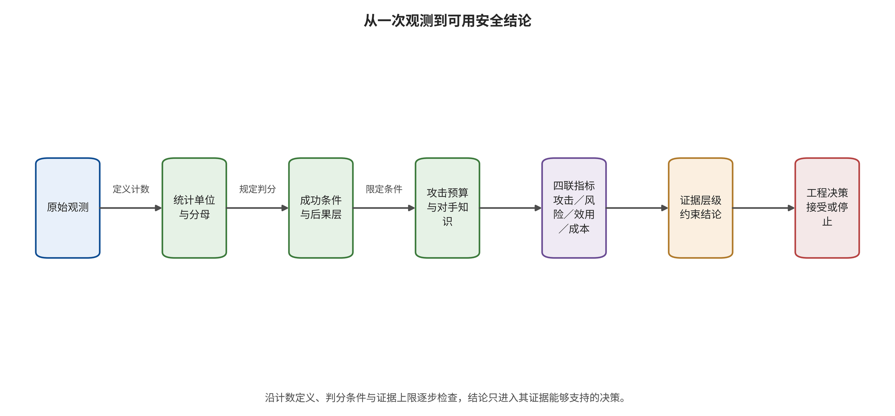

# 第 3 章　评测、统计与复现边界

某团队报告新的安全门把攻击成功率从 60% 降到 5%。数字非常醒目，却没有说明 60% 的分母是提示、任务还是应用，也没有说明 5% 是否把请求错误算作安全、攻击者是否看见防御、正常任务是否还能完成。另一个团队报告机器人任务成功率下降 20 个百分点，却没有观察碰撞；第三个团队报告视频检测准确率 98%，测试集却几乎全是生成内容。三个数字都可能计算无误，但都不足以独立回答“系统是否更安全”。

安全评测的难点不是缺少指标，而是同名指标常常对应不同对象。攻击成功率可以指生成一次违规回答、检索到目标文档、写入长期记忆、诱导工具计划、执行模拟动作或造成现实后果；准确率可能建立在均衡数据上，而生产环境的有害内容基率极低；任务完成率下降可能来自安全阻断，也可能来自模型不可用。只有先固定统计单位、攻击预算、后果层和正常效用，数字才有工程含义。

## 本章总览

本章从统计单位入手，为攻击、防御和检测实验固定分母、成功条件、攻击预算与最高后果层，再把结果组织为“攻击效果—残余风险—正常效用—成本”四联报告。证据被区分为静态检查、机制级运行、模拟执行、仿真闭环和端到端复现五个层次，生产证据再追加真实权限、身份、网络与后果等要求；跨研究结果的可比性也由目标量、分母、预算与执行环境共同决定。错误、空响应、配对变化和不确定区间进入同一验收表后，醒目的百分比才会变成可用于工程决策的证据。读者最终应能为一项评测写出目标量、独立单位、预算向量、缺失处理和停止规则，判断两项结果能否合并，并把运行回执、证据层和措辞上限连接到具体发布决定。

## 原理铺垫：从一次观测到可用证据

评测对象不是裸露的百分比，而是一条把试验输入转成工程判断的测量链。提示、文档、图像、视频、任务或轨迹作为统计单位进入系统；模型版本、策略、随机性、攻击者知识和查询预算共同构成试验状态；判分器、人工复核、环境回执与日志再把运行结果映射为成功、失败、缺失或未知。最后，开发者、独立评估人员和风险接受者消费这些结果，决定修复、上线、回退或继续取证。

这条链的安全面包括分母是否流失、成功条件是否偷换、相关观测是否被当作独立样本、错误响应是否被误算成安全，以及测试环境是否具有被声称的执行能力。证据层描述实际运行了什么，结论上限描述这些观测最多能支持什么；静态检查能发现代码路径，却不能证明路径在目标环境生效，模拟执行能确认受控副作用，也不能自动升级为生产事故率。

正常例是同一批任务在固定配置下进行配对测试，同时报告攻击结果、正常效用、成本和区间；边界例是防御让接口大量超时，研究者只在成功返回的样本上计算较低攻击成功率。后者的数字可以算术正确，分母却已被机制改变，因而不能证明风险降低。后文先固定目标量、单位、预算与判定，再沿证据阶梯约束措辞，使每个结论都能追溯到原始观测及其缺失原因。

## 3.1 先固定统计单位

一项结果的最小独立单位可能是提示、响应、会话、文档、图像、帧、视频、任务、轨迹、场景、模型、应用、论文或真实事件。分母不同，百分比需要先换算到共同目标量和单位后再比较。

语言模型越狱通常以提示或请求为单位；RAG 攻击可能以目标问题、恶意文档或知识库为单位；视觉生成可以以图像、身份、概念或采样种子为单位；视频还会出现帧、片段、整段视频和事件四种层级；VLA 常以任务或展开轨迹（rollout）为单位；世界模型可能以预测步、候选轨迹或控制回合（episode）为单位。展开轨迹是从当前状态按模型或策略向未来展开的状态—动作序列，回合则由起始条件、终止条件和连续步骤界定。同一视频的 100 帧彼此相关，独立样本数应在视频或事件层确定；同一论文在多个模型和多个攻击强度下的格子也共享数据、代码和判断流程。

设实验有统计单位集合 \(U=\{u_1,\ldots,u_n\}\)，成功指示量为 \(s_i\in\{0,1\}\)。在分母完整且成功条件已经冻结时，样本内的描述性攻击成功率可以写成

\[
\widehat{ASR}=\frac{1}{n}\sum_{i=1}^{n}s_i.
\]

这个点估计的计算本身不要求单位相互独立；只有在构造区间或向目标总体外推时，才必须说明抽样机制、单位相关性和聚类处理。公式本身没有告诉读者 \(u_i\) 是什么，也没有定义 \(s_i\)。因此，每个 ASR 后至少附三项：分母单位、成功层 Y0—Y4、判定方法。若由大语言模型充当裁判，还要写明裁判模型、提示、阈值、盲法与人工抽检；若工具请求返回错误或空响应，应记为 NA 或可用性失败，攻击结局保持未知。

HOUYI 在 36 个真实应用上测试黑盒提示注入，并报告其中 31 个被判定易受攻击 [@liu2023houyi]。这个分母是被选中的应用，而非统一后端模型的随机样本；它支持特定样本中的应用级可行性，总体脆弱率仍需有代表性的抽样设计。PoisonedRAG 在目标化配置中报告少量恶意文本可对选定问题产生很高 ASR [@zou2025poisonedrag]，但目标问题、知识库规模、检索器、分块和生成器共同定义该数字，其结论范围限于对应 RAG 设置。

读图时，请选取一个醒目的百分比，从原始观测开始逆向核对统计单位、成功条件、攻击预算和证据层，并在最右端写出真正消费该结果的决策。若任何一格缺失，就尝试说明缺失会怎样改变分母、结局或结论上限；尤其要检查错误响应被如何编码，以及相同观测能否独立支持发布、上线和风险接受这三种强度不同的决定。

图示给出的是测量证据栈：每一层都约束下一层可以说什么，却不会自动保证指标有效或样本具有代表性。它能帮助发现统计口径和运行范围缺口，不能仅凭流程齐全证明科学正确；若执行只到静态检查或模拟环境，结论必须保留相应上限，即使结果表已经包含四联指标和完整百分比。

### 3.1.1 先定义要估计的量

统计单位回答“对什么计数”，目标量（estimand）回答“希望估计什么”。两项研究都以任务为分母，一项可能估计固定攻击在固定模型上的条件成功率，另一项估计攻击者经过自适应搜索后的最坏合理风险；二者仍不是同一个量。评测方案应把目标量写成完整句子，例如：“在当前生产配置、已知防御、每个任务最多 20 次黑盒查询的条件下，估计攻击到达 Y3 的任务级概率。”

这句话至少固定了系统、攻击者知识、预算、后果层和分母。若研究目标是比较防御，则还要说明是平均处理效应、配对任务变化，还是满足某个效用约束后的残余风险。若研究目标是发现路径，样本可以有意覆盖极端情景，结果描述的是路径可行性；自然流量发生率需要代表性抽样。发现性红队与发生率估计都重要，只是回答不同问题。

多层数据应保留层次。设视频 \(j\) 有若干帧 \(i\)，帧级指示量为 \(s_{ij}\)。逐帧平均描述局部检测，视频级“任一帧命中”描述整段筛查，事件级定位描述开始与结束区间，三者分别回答不同问题。VLA 的多个展开轨迹嵌套于任务和场景，LLM 的多次采样嵌套于提示和应用。分析应以真正独立的最高层单位估计区间，并把低层观测用于诊断，而非虚增样本量。

### 3.1.2 分母流失和缺失原因

评测常在流程中丢失样本：模型拒绝服务、API 超时、视频解码失败、仿真崩溃、机器人安全停机、人工判分不一致。若只对成功获得响应的样本计算 ASR，结果会受到选择偏差。报告需要一张分母流程表：计划多少单位，实际启动多少，获得有效输出多少，进入判分多少，最终纳入多少，每一步因何缺失。

缺失原因要与安全结局分开编码。超时可能阻断危险动作，却也代表正常任务不可用；仿真崩溃没有提供安全证据；因预设安全阈值停机则是控制触发。主分析可按预注册规则处理，敏感性分析再给出把未知项视为成功或失败的上下界。只要上下界会改变决策，就需要增加观测或改善测量，并采用预注册口径。

对于真实监控，分母通常比阳性事件更难得到。知道发生三次危险工具调用，却缺少同期合法调用、任务和活跃用户数量时，数据只能支持事件计数。事件台账应与调用量、任务量、租户量和观察时间共同保存；若只有事件个案，就报告计数与暴露窗口，百分比留待分母完整后计算。

## 3.2 四联报告：攻击、残余风险、效用与成本

只报告攻击成功会奖励最激进的防御：把系统永久关停，ASR 可以变成零。只报告正常任务成功又会掩盖高影响小概率事件。因此，本书要求每项评测至少形成四联向量：

\[
\mathbf{m}=(A_r, R_r, U_b, C_o).
\]

\(A_r\) 表示在给定攻击者能力和预算下的攻击效果；\(R_r\) 表示防御后的残余风险及最高后果层；\(U_b\) 表示无攻击或合法输入下的正常效用；\(C_o\) 表示计算、延迟、人工、货币、能耗和恢复成本。对于高风险系统，还应附影响半径、可逆性和恢复时间。

攻击效果可以采用 ASR 之外的指标。训练数据提取可以用逐字恢复量、精确匹配或成员优势；水印攻击要同时报告检测、移除后质量和伪造风险；机器人攻击可以报告任务偏移、约束违反、最小安全距离或执行器阻断；世界模型可以报告轨迹误差、价值偏差和最终控制损失。不同终点可以在同一仪表板并列，排序则应限定在共同终点与协议内。

正常效用也需与任务对齐。输入过滤器可能降低有害输出，却误删合法医学、历史或安全研究内容；动作门可能减少危险执行，却让正常任务长期等待审批；视频水印提高可检测性，却损害画质、压缩鲁棒性或流式延迟；鲁棒控制器限制轨迹偏差，却牺牲速度和可达区域。安全控制只有在效用损失和运营成本可接受时才能长期运行。

### 3.2.1 四联向量保留各自决策含义

把 \(A_r,R_r,U_b,C_o\) 加权成一个数字看似便于排序，权重却会隐藏业务价值判断。一次不可逆高影响事件与大量轻微误阻断属于不可自动交换的后果类型。更稳妥的方法是先设硬约束：Y3 高影响动作残余风险保持在验收上界内，租户隔离始终成立，延迟保持在业务容量内；只有通过硬约束的方案再比较效用和成本。

对未触及硬门的方案，可以画安全—效用前沿。若防御 A 在每个残余风险水平上都有更高正常效用，A 支配 B；若两者各有优势，就由业务场景选择工作点。工作点必须绑定阈值、模型版本、输入分布和人工容量。离线最优阈值进入生产前还需用真实基率、峰值流量与人工响应时间完成校准。

成本也不只是推理费用。安全控制会增加标注、策略维护、证据存储、值班、申诉、恢复演练和开发复杂度；缺少这些运营投入，离线有效的控制可能在生产中被旁路。四联报告最好同时给单位任务成本、峰值容量、人工升级量、告警积压和恢复资源，让决策者看见控制能否持续。

### 3.2.2 高影响小概率事件的决策逻辑

当后果不可逆而样本有限时，平均准确率不是充分依据。团队需要结合后果严重度、可达性、不确定性和独立控制。若无法用合理样本证明极低发生率，就通过架构把最高可达层限制在可承受范围，例如让模型只能提出计划、让支付先进入待批队列、让机器人保持独立速度与区域约束。

架构限制与分层测量共同构成证据链。模型层测量 Y1、Y2，动作层测量 Y3，运营层测量发现和恢复，各层分别承担相应保证。对于没有可靠频率估计的稀有事件，安全论证应说明控制为何独立、禁止路径如何验证、共同失效条件是什么，以及未知项如何被监控。

## 3.3 攻击预算是结果的一部分

攻击能力至少包含知识、访问、查询、时间、样本写入、物理操作和反馈。白盒梯度优化与一次黑盒提示不等价；能直接投毒记忆库与只能通过正常查询间接写入不等价；可以在场景中反复摆放贴纸与一次性路过不等价。

把攻击预算写成下面的向量更清楚，因为不同资源之间通常不能自由互换；报告既要给出每一维上限，也要说明攻击者实际消耗和提前终止原因：

\[
B=(K,Q,T,W,P,F),
\]

其中 \(K\) 是模型和防御知识，\(Q\) 是查询次数，\(T\) 是墙钟时间，\(W\) 是可写入的数据或制品量，\(P\) 是物理访问，\(F\) 是结果反馈。防御评测必须说明攻击者是否知道防御并重新优化。固定攻击在防御前有效、在防御后失效，证明该固定攻击被挡住；若目标是对抗自适应攻击，就要给攻击者相同预算重新搜索。

GCG 使用白盒词元梯度和坐标搜索寻找越狱后缀 [@zou2023gcg]，PAIR 使用攻击模型和目标反馈做黑盒迭代 [@chao2023pair]。两者都可产生自动化攻击，但访问和查询差异决定 ASR 的可比范围。视觉对抗扰动、视频时空触发和物理环境贴片同样需要分别报告数字域、压缩链、播放—拍摄链与场景访问条件。

### 3.3.1 固定攻击与自适应攻击的双阶段协议

第一阶段使用固定攻击集，目的在于做稳定回归。用例、随机种子、预算和判分规则冻结后，每个版本都运行同一套测试，能够快速发现防御或功能回退。固定集适合持续集成，却容易被有意或无意地针对。通过固定集只说明已知样本上的表现。

第二阶段允许攻击者知晓防御并在预定预算内适应。预算要覆盖可见输出、查询次数、并发、墙钟时间、可写入对象、训练计算与物理访问；同时保留完整搜索轨迹。攻击者若因防御改变了入口、编码、时序或动作组合，测试才接近稳健性问题。固定阶段通过而自适应阶段失败，说明控制主要记住了攻击形态；两阶段都失败，说明基础路径仍开放；两阶段都无成功，则给出该预算下的证据上界。

攻击研究还需防止不公平预算。比较两种防御时，应给攻击者相同信息和资源，并报告某些方法是否因成本过高没有充分搜索。若一个模型接受十万次查询，另一个只接受十次，直接比较最佳 ASR 主要反映预算差异。若现实系统有速率限制，就把限制作为系统控制纳入双方，而不是在实验脚本中悄悄截断。

### 3.3.2 扰动大小必须与消费者相关

像素范数、词元变更数和轨迹距离只是替代约束。真正关键的是攻击是否在目标链路中可实现、是否改变合法语义，以及下游消费者看到什么。图片经过缩放、压缩、OCR 和特征提取后，原始像素范数可能不再代表有效变化；视频在转码、抽帧和流式窗口中，单帧扰动可能消失或累积；物理贴片还受距离、角度、照明和运动模糊影响。

因此，预算表应同时列编辑空间和部署变换。对语言输入记录字符、词元、语义约束和可见性；对视觉记录数字范数、空间面积、颜色范围和变换链；对具身记录物理尺寸、位置、持续时间、场景访问与安全人员约束；对状态投毒记录写入条数、存活时间、目标覆盖和召回反馈。只有消费者相关的预算，才能连接研究结果与部署风险。

## 3.4 后果层与安全上界

第 1 章的 Y0—Y4 不仅用于叙述，也决定验收阈值。内容系统可以把 Y0 违规率作为核心指标；具有工具权限的智能体至少要测 Y2 危险计划与 Y3 危险执行；具身系统需要报告动作约束与环境后果；真实高风险部署还要估计影响半径与恢复时间。

若在 \(n\) 次独立测试中观察到 0 次危险执行，样本结果应记录为“0/\(n\) 次”，总体风险则用区间表达。一个常用粗略上界是“三除以 \(n\)”规则：在 95% 近似置信水平下，零事件的单侧上界约为 \(3/n\)。100 次测试零事件只把上界压到约 3%，距离高影响动作的百万分之一风险要求仍很远。更精确时应使用预先指定的二项区间，并检查独立性和测试分布。

反过来，观测到危险计划但动作门全部阻断时，Y2 样本仍应完整保留。团队需要两条指标：计划层穿透率说明上游模型与信息流防御的负担，执行层穿透率说明后果控制效果。若未来工具权限、策略或配置变化，Y2 回归可以提前暴露风险。

### 3.4.1 区间、配对与效应量

任何比例都应尽量给出分子、分母和区间。小样本或极端比例下，简单正态近似可能给出不合理范围，可以使用 Wilson 或精确二项区间，并事先确定单双侧。若样本按任务、场景或论文聚类，则需要按簇估计不确定性；把同一任务的多次采样当独立观测会让区间过窄。

比较防御前后时，优先保留配对结果。设同一任务在前后各得到二元结局，真正有信息的是“成功变失败”和“失败变成功”两个不一致格，而不是两个边际百分比。连续指标则报告任务级差值分布、中位数或均值及区间。若版本间任务集不同，必须说明不可配对，避免把样本构成变化解释为防御效果。

效应量应与决策一致。ASR 下降的百分点容易理解，相对下降在基线很低时可能夸张；机器人安全距离适合报告绝对变化和违反阈值的任务比例；检测器要报告给定假阳性率（false positive rate，FPR，即实际阴性被误报的比例）下的真正率（true positive rate，TPR，即实际阳性被检出的比例），或给定人工容量下能够处理的阳性预测值。只给显著性检验无法告诉工程团队变化是否足够大。

### 3.4.2 样本量与停止规则

测试前先根据验收目标估计所需样本，并按预定停止规则执行。若希望用零事件把 95% 上界压到 0.1%，粗略需要约 3000 个独立单位；若任务高度相关，需要更多场景或按簇设计。对不可接受的真实动作，样本应在隔离服务、仿真和故障注入中获得，再与架构保证组合，生产环境保留为经过授权的受控验证。

自适应红队需要停止规则：预算耗尽、连续若干轮无新路径、达到预定严重度、出现隔离边界异常或人工安全员叫停。停止规则既保护系统，也避免只在找到成功时结束造成选择偏差。若中途根据结果增加样本或变更指标，报告中要说明探索性性质，并在独立集合上确认关键结论。

多次比较也会制造偶然亮点。几十个模型、提示、阈值和随机种子中选择最佳一格时，该格描述搜索后最佳结果；预期性能应由预先指定方案或独立确认集估计。安全研究关心最坏路径时，可以报告发现的反例，反例频率则明确标为搜索过程中的描述量。

## 3.5 检测指标必须面对基率

生成内容检测、水印和异常监控常在均衡测试集上报告准确率、受试者工作特征曲线下面积（area under the receiver operating characteristic curve，AUROC）或 F1 值（F1 score）。AUROC 概括检测器跨阈值区分阳性与阴性的排序能力；F1 值是在某一阈值下精确率与召回率的调和平均，其中精确率回答“预测为阳性的对象中多少确为阳性”，召回率在这里等同 TPR。两者都没有自动纳入生产基率和告警容量。生产环境中，真实阳性基率可能很低；此时即使特异度很高，告警中也可能充满误报。

若事件基率为 \(\pi\)，且 TPR 与 FPR 按上述条件估计，则面向告警消费者的阳性预测值（positive predictive value，PPV）回答“被系统标为阳性的对象中，有多大比例确实为阳性”，其表达式为

\[
PPV=\frac{TPR\cdot \pi}{TPR\cdot \pi+FPR\cdot(1-\pi)}.
\]

假设 TPR 为 90%、FPR 为 1%、真实事件基率为 0.1%，则 \(PPV\) 约为 8.3%。也就是说，约十二个告警中只有一个真阳性。这个例子说明 FPR 的小数点、基率估计、复核成本和平台行动必须一起设计。单个检测分数只生成告警信号，身份归属、内容下架或受害者救济还需来源、复核与程序性控制。

视频还增加定位层级。整段检测正确描述视频级判定，时间区间定位需要事件级指标；逐帧指标描述局部画面，跨帧一致与流式首次告警需要时序指标。水印方法需要报告嵌入容量、画质、压缩与编辑鲁棒性、密钥管理、伪造和移除后的残余信号。内容来源与处理历史记录来源和处理动作，内容凭证验证报告签名链与元数据保留状态，生成检测准确率则报告分类能力；三组信号互为补充，但都不能单独证明叙事真实。

### 3.5.1 从离线曲线到告警队列

检测器进入运营后，输出不是一条 ROC 曲线，而是一条告警队列。设每天处理一千万个对象，FPR 即使只有万分之一，也会产生约一千个假阳性；若团队每天只能复核一百个，队列将持续积压。阈值设计必须结合流量、基率、每条复核时间、优先级和超过时限后的处理策略。

告警还要以正确单位聚合。视频逐帧产生高相关告警，应聚合成事件并保留首次告警时间、持续区间和峰值；智能体工具异常应按会话与动作链聚合，避免数百次重试淹没真正升级信号；机器人遥测应区分瞬时噪声与持续约束违反。聚合规则会改变分母和响应负荷，必须与检测模型一起验收。

对高影响自动处置，需要比人工队列更严格的校准与独立证据。生成检测分数适合作为账号暂停与人工复核信号，世界模型异常分数适合作为降速、暂停或请求补证信号；账号封禁和紧急运动授权还要结合来源、上下文、独立约束与可申诉流程。

### 3.5.2 漂移监控与延迟标签

生产基率、内容风格、模型版本和攻击策略都会漂移。监控应跟踪输入覆盖、分数分布、告警量、人工确认率、分组性能与数据缺失，而不仅是总体准确率。若真实标签需要数天才能获得，短期只能使用代理指标；报告要区分实时替代标签与最终标签，并记录回填后的差异。

分组分析要依据风险与业务需要预先定义，保证样本量和隐私。某类语言、画面压缩、设备场景或任务阶段性能下降，可能被总体均值遮住。发现漂移后，应有阈值降级、人工扩容、流量限制、模型回退与补充测试路径，而不是只生成仪表板。

## 3.6 复现阶梯：运行范围决定结论范围

复现证据按依赖逐级上升。**静态检查**覆盖代码、配置、模型类、数据路径、返回结构、状态码、错误语义和系统边界，能够确认候选路径存在或声明与代码不一致，不能给出模型效果。**机制级运行**再使用安全可控的公式夹具、合成数据或小型替代模型验证局部机制与指标实现，用于发现符号、维度、指标或控制逻辑错误；它仍不包含真实权重、真实数据和完整管线，结论必须限定在被执行的局部机制。

局部机制成立后，**模拟执行**让动作由模拟工具、替代服务或其他模拟对象实际消费，用回执确认调用路径、参数与错误处理，却未必包含真实环境动力学和时序反馈。**仿真闭环**进一步让动作进入具有状态更新、时序和动力学反馈的仿真环境，观察后续状态怎样影响下一次决策；它比单次模拟执行覆盖更多传播条件，但仿真保真度、真实身份、物理设备与不可逆后果仍限定结论上限。

依赖补齐后，第五级**端到端复现**要求目标代码版本、权重、数据、配置、预处理、随机性、硬件、消费者和评价器都与声明匹配，并保存命令、退出码、日志和输出哈希；文件存在或进程启动不等于评价完成。阶梯之外的**生产证据**还要纳入真实权限、网络、身份、用户分布、监控与后果，且生产红队只能在授权和隔离范围内进行；实验环境没有真实秘密或不可逆能力时，结论仍停在实验配置的影响范围。

五级名称只是导航，真正的结论上限由已满足的依赖和实际回执决定。一个安全玩具套件的全部命令通过，只能说明机制夹具与交付链可以重跑；缺少大权重、官方数据或真实环境时，证据停在机制级运行。静态检查发现潜在路径也要与动态可利用性分开，端到端复现通过仍不能替代生产权限与外部状态证据。

### 3.6.1 一份可追踪运行回执包含什么

端到端结论至少需要代码版本、依赖锁、权重标识与哈希、数据版本、预处理、配置、随机种子、硬件、命令、开始结束时间、退出码、原始日志、输出对象和指标脚本。模型名称不足以定位权重，配置文件存在不足以证明运行采用该配置，进程启动也不足以证明评价完成。回执必须把选择、执行和结果连接起来。

机制级运行的回执也要完整。合成夹具说明验证的公式或控制逻辑、与真实系统相比省略了什么、预期输出以及断言。若夹具只验证动作门会拒绝越界参数，结论便限定为该参数检查的局部机制；真实智能体的其他危险动作仍需另设测试。小而清晰的回执比模糊的“已复现”更有价值，因为后续团队知道下一步缺什么。

静态检查可保存文件路径、行号、提交哈希、配置选择链、返回结构、状态码与错误语义。它能够发现模型类未接线、参数被覆盖、评价器与论文定义不符或安全分支从未调用。静态发现需要按“确定存在的代码事实”“需要运行验证的路径”“与效果有关但尚未观察”分层，让潜在缺陷与已观察利用事件保持清楚界线。

生产证据则额外需要授权范围、真实身份、网络与数据边界、监控窗口、受影响对象和遏制记录。红队与事件数据可能含秘密或个人信息，回执应做分级存储与脱敏，公开报告只给支持结论所需的最小信息。可追踪性依赖受控访问，敏感细节按必要范围保存与披露。

### 3.6.2 负结果与失败运行也要入账

零成功、下载失败、硬件不足、接口超时和评价器不一致都会影响证据。运行台账应保留尝试目的、环境、实际进度、失败点、退出状态和可重试条件。只保存成功运行会让后续人员重复踩坑，也会夸大可复现性。

失败运行需要按原因单独编码。若模型没有响应，攻击结局未知而可用性失败；若安全控制器按设计阻断，才有控制证据；若测试因缺少权重停在静态检查，则效果结论仍为空。给失败原因单独编码，可以同时保持统计口径和工程诊断。

### 3.6.3 证据怎样逐级晋升

证据晋升依靠补齐更接近目标系统的依赖，而非更响亮的标签。静态检查发现一条候选路径后，先用机制夹具验证符号、数据流和控制逻辑，再让动作依次经过模拟对象与带时序反馈的仿真闭环；随后接入目标代码、权重、数据、消费者与评价器完成端到端复现，最后在授权、隔离的真实配置中验证身份、网络、监控和恢复。每一级都保留前一级材料，使问题出现时能够定位是算法、集成还是运营差异。

晋升前要列依赖清单。代码是否确为目标提交，配置是否选择了预期类，权重与数据是否有稳定标识，预处理与指标是否一致，硬件是否足够，外部 API 是否固定版本，评价器是否经过人工抽检。缺一项不一定阻止所有工作，但会限制结论。例如，没有真实权重仍可检查控制规则，没有生产身份仍可验证隔离工具；目标效果与真实影响分别留待相应层级的运行材料支持。

晋升后还要做差异解释。机制夹具通过而端到端失败，可能来自张量、预处理、随机性或依赖；端到端通过而真实配置失败，可能来自权限、网络、流量和状态；离线指标稳定而运营告警失效，可能来自基率、队列容量或升级流程。把差异写入证据账本，能够防止团队把每次失败都简单归因于模型。

证据也会过期。上游模型、工具协议、身份范围、数据分布和平台策略变化，都可能使旧回执不再代表当前系统。每份回执应标明适用系统指纹、生成日期和触发重验的字段；发布门读取最新有效回执，而不是只检查某个文件是否存在。

## 3.7 何时可以合并结果

跨研究汇总至少需要相同或可转换的目标量、相容的模型与任务、相同成功定义、可比攻击预算、明确分母与方差，以及相互独立的研究单位。研究数量增加而条件仍不相容时，证据适合机制并列，尚不足以形成有效总体效应。

一个实用的“可比性门”包含以下六问；任一关键问题回答为否，都不妨碍并列阅读，却应阻止直接合并、算术平均或生成无条件的总排名：

1. 问的是同一个因果或描述性量吗？
2. 成功发生在同一个 Y 层吗？
3. 分母单位相同且相互独立吗？
4. 模型、任务、数据和防御配置足够相容吗？
5. 攻击者预算与自适应程度相容吗？
6. 方差、区间或原始计数足以估计不确定性吗？

任一关键项不满足时，研究级表格、机制综合和差异解释与现有证据范围相匹配；森林图、总体 ASR 或“最强方法”榜单留待可比条件和独立单位齐备后生成。尤其要避免把同一论文的多个模型、数据集和随机种子当作独立研究；这会制造虚假的样本量和过窄区间。

### 3.7.1 异质结果怎样形成有用结论

统计拒绝不等于研究停止。首先建立研究级证据表，逐项列系统、攻击目标、首破接口、预算、分母、Y 层、执行环境、控制、效用与证据等级。其次按机制而非结果大小分组，例如数据升格为指令、状态污染、制品后门、授权缺口、反馈欺骗和发布真实性。最后比较每组中反复出现的前置条件、控制位置和开放问题。

这种综合可以形成条件性结论：“在攻击者能够写入检索库且目标问题可预测的设置中，目标化投毒多次显示可行；跨不同检索器、知识库规模与写入权限的发生率不可直接合并。”它比一个总体 ASR 更长，却能告诉工程团队要检查写入权、目标可预测性、检索覆盖与生成器依赖。

证据地图还会显现空白。有的接口论文很多但只测 Y0，有的控制只在固定攻击下测过，有的世界模型工作报告预测误差却没有规划结果，有的视频检测器缺流式首次告警。空白应转成可证伪问题和所需分母，而不是凭相邻领域数字填补。

### 3.7.2 排名表的替代设计

当方法不可直接排序时，可以按适用条件展示。表格列出所需访问、覆盖接口、最高证据层、正常效用、成本和已知失效方式；读者根据自己的系统选择候选，跨任务总榜仅作导航。若确实需要比较，只在共同数据、共同预算、共同判分和共同版本的头对头测试中进行。

展示不确定性时，优先给原始分子分母、区间和缺失原因。热力图或分数可用于导航，硬门结果则单独置于决策表首位。一个方法即使在十个诊断维度上得分很高，只要出现跨租户泄漏或危险执行，发布门仍判为失败。

## 3.8 工作例：评估一个动作门

假设一个邮件智能体有 80 个正常任务和 40 个带间接提示注入的安全任务。团队比较动作门启用前后，并保存配对结果。安全任务中，模型是否提出越权发送记为 Y2，邮件服务是否接受记为 Y3；正常任务以收件人、主题和附件都正确为成功。

| 指标 | 动作门关闭 | 动作门开启 |
|---|---:|---:|
| Y2 危险计划 | 18/40 | 16/40 |
| Y3 危险执行 | 14/40 | 1/40 |
| 正常任务成功 | 68/80 | 61/80 |
| 中位延迟 | 3.2 s | 4.7 s |
| 人工升级 | 0/120 | 9/120 |

这些假设数据表明，动作门几乎没有改变模型提出危险计划的频率，却显著降低了执行层穿透；代价是正常效用下降、延迟增加并引入人工负担。这组数据支持的结论是：“U4 控制在该 40 项安全集上限制了危险执行，上游 Y2 风险仍高，正常任务和升级成本需要优化。”它尚未覆盖其他入口、权限配置与自适应预算。

下一步应检查那 1 次穿透的参数与授权路径，给执行率区间，列出 7 个从成功转为失败的正常任务，并让攻击者知道动作门后在相同预算下重新优化。若 40 项用例来自同一模板，有效独立单位需要按模板簇计算。配对变化比两个百分比更有诊断价值：哪些任务从安全变危险、从危险变安全，以及原因是什么。

### 3.8.1 继续分析这组假设数据

动作门开启后 Y3 从 14 次降到 1 次，但 Y2 只从 18 次降到 16 次，说明主要作用位置确实在授权执行而非模型计划。正常任务从 68 次降到 61 次，需要把配对表拆开：原先成功而现在失败的任务有多少，原先失败而现在成功的有多少。仅凭边际计数无法知道是否恰好有七个净损失，实际切换数可能更大。

那 1 次 Y3 穿透应作为严重个案分析。先确认是否同一规范化动作被批准后关键参数漂移，令牌是否绑定收件人和附件，策略是否在重试路径被旁路，邮件模拟器是否忠实执行权限。若穿透来自测试夹具错误，仍要登记测量缺陷；若来自真实策略缺口，则硬门失败，总体下降幅度作为诊断信息另行报告。

9 次人工升级也要分母化。它们来自危险任务还是合法任务，平均等待多久，是否集中于某类附件，操作员是否看到了原始来源？若生产每天有十万任务，7.5% 的升级率不可持续；若只对极少数高影响动作启用，成本可能可接受。离线比率必须映射到真实流量和人员容量。

最后设置下一轮验收：保持 80 个正常任务做配对回归，扩充独立安全场景而非同模板变体，让攻击者看见动作门后重新搜索，增加过期令牌、参数漂移、重复提交和策略超时故障。主报告同时给 Y2 与 Y3、正常效用、延迟、升级量和恢复演练，形成完整四联证据。

### 3.8.2 结果表之外的诊断材料

总体表适合决策，个案轨迹适合诊断。每类失败至少保留若干代表性轨迹：原始输入与来源、解析字段、模型输出、策略判断、工具参数、回执、判分理由和最终层级。轨迹应脱敏并用稳定标识连接原始记录，避免人工摘录时丢失关键信息。

错误分类可以按首破接口和失败机制交叉统计。若多数 Y2 计划来自检索片段升格，优先处理 U2 用途边界；若 Y2 很少但 Y3 仍穿透，检查 U4 参数与身份；若正常任务大量失败于超时，优化控制性能或降级路径。分类结果用于定位能够减少一组失败的工程动作。

## 3.9 常见误判

**把请求错误算作安全。** API 超时、限流、空响应和解析失败说明可用性或测量失败。只有部署政策明确把该状态安全地阻断动作时，才能同时记录控制成功；攻击结局仍按预注册规则编码。

**只报告最佳攻击提示。** 只选最佳随机种子、后缀或帧会高估平均风险；只报告平均值又可能掩盖最坏后果。应预先定义选择规则，同时报告分布、预算和最坏合理案例，并保留全部尝试及失败轨迹供复核；选择发生在看见结果之后时，还要显式标注选择偏差。

**让同一模型攻击又判分。** 共享模型可能产生偏置和相关误差。自动判分应配合明确量规、独立模型或规则、盲化人工抽检和一致性记录；对高影响结论还要公开分歧处理与裁决流程。

**把相关格子当作独立样本。** 同一论文、数据集、模型家族和攻击实现产生的多个格子共享误差源。汇总时应以独立研究或预先定义的簇为单位，并明确簇内相关性如何进入区间与权重；无法估计相关性时，宁可并列展示，也不虚增有效样本量。

**把评测流水线跑通当作指标有效。** 脚本成功运行、指标文件生成和图表正常渲染，只说明执行链完成。指标有效性还取决于独立单位、分母、成功判据、攻击预算和系统版本是否与预注册目标量一致；任一条件漂移都要进入运行回执，并重新判断结果支持的结论范围。

## 3.10 带入实际系统

下一代配置的发布评审同时覆盖视频平台和企业研究助手，评测负责人先把测量规则写进系统指纹。视频检测器使用 100 段、每段 32 帧的样本时，帧、整段视频和连续事件分别对应不同统计单位；同一视频内的帧共享内容与编码条件，3,200 个帧级观测不能直接提供 3,200 个独立样本。研究助手的动作门另以任务为单位，目标量写成“在当前生产配置、已知控制和固定查询预算下，到达 Y3 的任务级概率”，从而把系统、预算、分母和后果层固定在同一句话里。

动作门在 200 个独立危险任务中没有出现一次执行时，“三除以 \(n\)”给出的单侧粗略上界约为 1.5%。这个结果描述当前用例与攻击预算下的不确定性，发布决策还要结合动作的不可逆性、权限半径和独立控制。视频告警则必须进入真实基率：当 TPR 为 95%、FPR 为 0.5%、事件基率为 0.01% 时，近似 PPV 约为 1.9%，大多数告警会进入误报复核。团队据此按视频事件聚合帧级信号，设置优先级、人工容量与超时处置，而非把离线曲线直接接到账号封禁。

同一发布会上还出现了两张看似可以排名的结果表，一张报告语言模型违规文本率，另一张报告机器人碰撞率。前者通常止于内容或计划层，后者涉及动作与环境后果；目标量、统计单位、任务分布、攻击预算、执行环境和控制状态也各不相同。现有证据适合在机制地图中并列，分别指出提示控制与物理约束的失效条件；只有共同终点、共同预算、共同判分和独立单位齐备的头对头协议，才支持同一总体 ASR 或效果排序。

研究助手最终使用四联验收表记录正常任务、间接提示注入、代码执行、网络外联和记忆写入。请求超时、空响应、安全门阻断与真实攻击失败分开编码，攻击效果和防御后残余风险分别落到 Y0—Y4，正常效用与延迟、人工升级、恢复时间同时进入决策。统计人员解释区间和分母流失，工程人员确认权限与禁止路径，运营人员核对告警和恢复容量，业务负责人决定可接受后果；每项结论都能回到运行回执、版本和失效条件，数字由此成为可负责的发布依据。

## 小结：数字必须带着测量语境走

安全数字只有在统计单位、成功定义、后果层、攻击预算和判定方法固定后才有含义。四联报告阻止团队用停机换取漂亮 ASR，复现阶梯阻止机制夹具冒充端到端结果，可比性门阻止异质研究制造伪精确。

下一部分进入语言模型与智能体。读者会看到，相似的自然语言字符串可以在用户提示、网页、检索库、长期记忆和工具返回中跨越不同边界。第 4 章首先区分两种常被混用的失效：绕过模型政策的越狱，以及改变应用控制流的提示注入。

在进入具体攻击之前，建议为正在维护的系统建立一张“测量规则卡”。卡片写明系统指纹、目标量、独立单位、分母流失、成功层、攻击预算、执行环境、控制状态、正常效用、成本、区间方法和停止规则；每个数字都能沿卡片追到运行回执。若某个字段未知，就把它保留为未知并说明会限制哪类结论。

这张卡还应记录三个时间点：测试运行时间、标签最终确认时间和证据失效条件。模型、检索、工具、身份、网络或控制策略变化后，相关数字不再自动代表当前系统。持续评测的核心不是不断累积旧百分比，而是让每个发布版本都拥有与其能力边界相匹配的现行证据。

最后把硬门与诊断量分开。跨租户泄漏、未授权高影响执行和安全不变量失守属于非补偿门，任一项触发都使发布门失败；Y1/Y2 穿透、延迟、人工升级、告警质量和恢复时间用于定位改进空间。这样的报告既能阻止危险版本进入下一阶段，也能告诉工程团队下一项投入应落在哪个接口。

一个完整评测周期因此包含五个闭环动作：冻结问题与系统指纹，生成能够覆盖允许、禁止、边界和恢复路径的样本，按预定预算执行并保留分母流失，使用与后果层一致的判定器计算四联指标，最后把失败个案送回接口与控制。下一轮测试不是机械增加样本，而是针对上一轮暴露的传播门和未知项增加独立证据。

若结果用于发布决策，还要由证据之外的责任人确认风险偏好。统计人员说明区间和缺失，工程人员说明控制与故障模式，业务人员说明正常效用与不可接受后果，运营人员说明告警和恢复容量。各角色共享同一测量规则，并分别对自身责任范围签字。这样，数字才从论文表格进入可负责的系统决策。

当证据不足以支持上线时，系统保持能力受限并列出补证条件，使发布决定与当前可核验事实保持一致。证据越接近真实后果，授权、隔离与伦理约束也应越严格；从静态检查到生产证据的每一步，都要让结论强度、风险处置和可核验事实同步晋升，而不是先写强结论再寻找材料填充。

\newpage

---

[← 返回目录](index.md)
