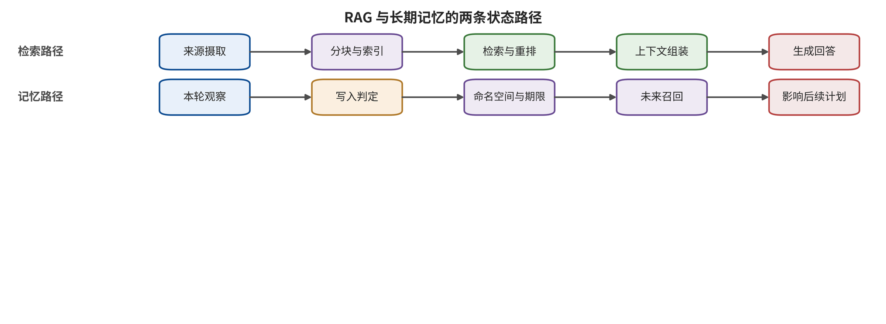

文后，影响随之消失。检索增强生成与长期记忆改变了这一前提。下一章将把索引和记忆视为带身份、版本、期限与删除语义的安全数据库，解释一次输入怎样变成未来会话中的持久状态。

工程验收应始终同时保留固定攻击回归与知晓防御的自适应测试，前者守住已知入口，后者检验控制是否真正约束机制。

\newpage

# 第 5 章　检索、上下文与记忆

一名工程师询问企业助手：“旧型号泵在低温下应该怎样启动？”助手从知识库取回一份维护手册、一条论坛帖子和一段数周前保存的对话摘要。答案看似完整，却把论坛里的临时绕行步骤当成正式规程，还引用了另一租户的设备记录。团队若只检查最终文字，可能把问题归为幻觉；沿系统链回看，至少有三道边界已经失守：不可信内容进入索引，高相似度压过来源质量，跨租户记录又进入上下文。

检索增强生成（retrieval-augmented generation，RAG）和长期记忆让模型能够使用窗口之外的信息，也把一次输入变成可保存、可召回、可组合的状态。安全问题从“这句话会不会骗过模型”扩展到“谁有权写入什么，以谁的身份保存，何时被谁取回，删除后是否仍会复活”。因此，本章把向量索引和记忆服务作为安全数据库分析，长提示只是它们向模型暴露内容的一种形式。

## 本章总览

本章把 RAG 拆成摄取、分块、索引、检索、重排序和上下文组装，在每一步定位信任变化，并区分内容投毒、指令投毒、越权检索、语料提取与持久记忆攻击。长期记忆沿“写入—召回—使用”三个阶段展开，各阶段具有独立成功指标。租户、来源、用途、完整性、期限、版本、派生链和删除标记共同组成记录结构，测试矩阵则同时观察检索命中、模型采纳、动作传播、正常效用与删除有效性。据此，读者应能分别设计安全读取与保守写入策略，为每条记录保持身份和生命周期语义，并用跨租户、持久召回、派生删除和恢复重放探针验证实际状态。

## 原理铺垫：外部知识怎样成为当前状态

RAG 把当前问题编码为向量，在向量数据库的获授权记录中检索候选片段，经重排序后组装进模型上下文；长期记忆则把一次观察压缩成可跨会话保存、以后再召回的记录。前者主要形成一次读取管线，后者还包含状态写入与生命周期。它们的输入包括文档、元数据、用户与工具观察，机制状态包括索引、租户标签、版本、派生关系和删除标记。

回答、引用、候选计划或记忆更新会被用户、下游模型、智能体和业务流程消费。安全面因此分成读取与写入两侧：摄取者能否污染索引，检索者能否越过租户和用途，模型是否把片段中的文字升格为指令，摘要是否丢失来源，记忆是否在撤销后由缓存或派生记录复活。相似度只描述表示接近程度，不能替代真实性、访问控制或动作授权。

正常例是企业助手先按主体与项目过滤手册，再在允许集合内检索、重排序并附来源回答；边界例是恶意片段进入前列且被模型引用，但动作层没有采纳，或记录已从主索引删除却仍由摘要缓存召回。前一种情况证明检索和内容采纳链部分成立，不等于现实动作；后一种情况说明删除传播失效。后文分别记录写入、命中、采纳、传播与清除证据，不用一个末端准确率遮蔽不同控制点。

## 5.1 RAG 是一条数据管线，不是一次提示拼接

RAG 的工作可以写成下面的连续变换；每个箭头既表示数据处理，也应携带来源、租户、用途、版本与删除状态，避免片段在变换后变成无法追责的纯文本。记录任何字段丢失时，后续消费者都应按低信任输入处置，并把降级原因写入回执：

\[
D\xrightarrow{C} \{c_i\}\xrightarrow{E}\{v_i\}\xrightarrow{I}\mathcal{K}
\xrightarrow{Q(q)}R_k\xrightarrow{A}(y,\pi).
\]

文档集合 \(D\) 经分块器 \(C\) 形成片段 \(c_i\)，嵌入器 \(E\) 把片段变成向量 \(v_i\)，索引器 \(I\) 将其写入知识库 \(\mathcal{K}\)。查询 \(q\) 触发检索与重排序 \(Q\)，选出前 \(k\) 条结果 \(R_k\)，上下文组装器 \(A\) 再让模型生成回答 \(y\) 或候选计划 \(\pi\)。每个箭头都可能丢失身份、来源或用途，因而需要逐步保存记录标识和策略回执。

这条链至少有四类不同失败。**内容投毒**让错误事实或偏置材料在目标查询下高排名；**指令投毒**让检索片段携带面向模型的控制语句；**越权检索**由租户映射、元数据过滤或访问控制错误造成；**语料提取**则利用查询与输出反馈恢复私有内容。四类攻击可能共享同一个向量数据库，却有不同资产与终点：错误答案、任务劫持、跨租户泄漏和文本恢复率应按各自分母与成功定义分别报告。

读图时，请沿上方检索增强生成泳道检查摄取、索引、检索、重排序与上下文组装，随后沿下方长期记忆泳道检查观察、写入、跨会话保存、召回与使用。比较两条路径时，重点标出谁拥有读取权、谁拥有写入权，以及来源、租户、用途和删除状态在哪一步可能丢失。“进入当前上下文”属于单次请求的读取路径，“写成未来状态”则是跨会话的持久化路径。

图示说明 RAG 与长期记忆共享来源和访问控制问题，却具有不同的状态语义与测试终点。它不意味着检索命中必然导致模型采纳，也不意味着写入成功必然在未来被召回；命中、采纳、写入、召回、动作传播和删除有效性都要有各自日志与分母。没有未来会话的实际召回证据时，现有证据只确认记录可写入，持久攻击是否生效仍然未知。

“文档已经入库”只说明摄取流程接受了它。公开网页可能适合回答产品参数，支付收件人则由授权目标决定；内部会议纪要只向对应项目组开放；模型生成的摘要可能忠实转述来源，也可能丢掉否定词。相似度回答“查询和记录在表示空间是否接近”，真实性、读取权限与动作用途分别由来源、ACL 和用途规则回答。

因此，检索前的过滤顺序很重要。系统应先根据主体、租户、用途、类型、状态和期限构造允许集合，再在集合内计算相似度，而不是先把全库最相似内容放进提示，再要求模型自行保密。访问控制若只作用于最终显示层，敏感记录已经跨越 U2 检索与状态接口。

## 5.2 定向投毒与语料提取证明了什么

PoisonedRAG 为攻击者选定的“问题—目标答案”构造恶意文档，同时优化检索命中和生成采纳。研究在含数百万文本的知识库中，对每个目标问题注入 5 条恶意文本时报告 90% ASR [@zou2025poisonedrag]。这个结果说明少量定向记录可以在特定配置下控制特定查询；“每个目标问题 5 条”是该协议的攻击预算。嵌入模型、分块边界、检索深度、重排序器、生成器和攻击者是否知道目标问题，都是结论成立的条件。

把攻击拆成阶段会更清楚。设 \(H_r\) 表示恶意记录进入前 \(k\) 条，\(H_c\) 表示模型采纳攻击内容，\(H_y\) 表示最终回答达到目标。三项事件具有先后条件，任一阶段未观测都不能由末端标签补齐；以相同统计单位记录后，这条三阶段攻击链的联合终点满足：

\[
P(H_r\cap H_c\cap H_y)=P(H_r)P(H_c\mid H_r)P(H_y\mid H_c,H_r).
\]

这是条件概率记账，不要求各阶段独立。若恶意文档没有进入前 \(k\) 条，问题可能在检索；若已进入但未被采用，生成器或上下文结构发挥了作用；若回答命中目标但动作门拒绝执行，最高后果层仍停在输出或计划。只看末端 ASR 会把不同控制的贡献压成一个数字。

Spill the Beans 研究的是另一类终点。它通过自生成查询诱导生产定制 GPT 输出私有语料，从约 77,000 词的书籍恢复 41%，从约 1,569,000 词的语料恢复 3% [@qi2025spillbeans]。这里的分母是语料词数，结果是逐字覆盖率，与提示级攻击成功率分属不同指标。较大语料上的较低比例描述该配置的恢复覆盖，查询预算、重复度、片段长度和可验证前缀都会影响恢复量。

这两项工作带来相同的工程结论：知识库是可查询的数据资产。它需要摄取来源、访问控制、查询追踪、速率与预算、异常相似度监测和输出引用；系统提示只覆盖模型行为，数据库安全仍由数据与身份控制承担。OWASP 对向量与嵌入风险的工程分类也强调多租户泄漏与投毒；这类风险列表提供控制词汇，具体防御效果需要运行测量 [@owasp2025vector]。

## 5.3 来源必须穿过分块、摘要和重排序

RAG 中最常见的结构损失发生在变换后。原文有作者、仓库、路径、访问级别和时间，分块后可能只剩一段文字；摘要把多条来源压成一条陈述，重排序器又只输出分数。若来源元数据没有随派生物传播，模型和动作门无法区分“用户明确提供”“租户内部批准”“公开网页抓取”和“模型自行推断”。

可以把每条知识记录写成下面的结构，并让检索、重排序、上下文组装和删除流程共同消费这些字段；仅在数据库中保存元数据而不执行策略，不构成访问控制，派生摘要与缓存也必须继承原记录的限制，并能反查原始对象：

\[
r=(id,t,s,o,u,\ell_c,\ell_i,p,\tau,v,d,h),
\]

其中 \(t\) 是租户，\(s\) 是写入主体，\(o\) 是来源，\(u\) 是用途；\(\ell_c\) 与 \(\ell_i\) 分别表示机密性和完整性；\(p\) 是读者或工具访问策略，\(\tau\) 是有效期限，\(v\) 是版本，\(d\) 是派生关系，\(h\) 是内容哈希。向量只是记录的索引字段，租户、来源、用途和授权仍需独立字段承载，并在每次派生与复制时保持关联。

摄取时，来源允许列表和签名可以确认“从哪里来”，内容扫描可以发现明显载荷，人工隔离可以处理高风险材料；文本事实正确性还要由对应领域证据核验。检索时，ACL 和用途过滤应先于相似度；单一来源占比、异常近邻簇和突然涌入的目标化片段可以作为投毒信号。生成时，回答引用应指回可验证记录，文档名只作辅助显示。

来源传播还要处理证据相关性。同一网页被抓取十次、分成十块或生成十条摘要，仍然只有一个来源。系统若把它们当作十个独立证据，排序和多数投票会放大单源错误。记录的 `derived_from` 应保留派生图；多条结果来自同一根节点时，聚合器降低其独立权重，并把冲突交给明确的仲裁策略。

租户边界依赖身份与访问控制，而非语义相似度。两个客户可能都使用“年度计划”“管理员”或相似项目名，向量距离无法表达授权。索引可以物理分区，也可以在逻辑层强制租户过滤；无论实现方式如何，验收都要包含跨租户泄漏探针和绕过元数据过滤的测试。输出过滤器即使删掉敏感句，已发生的未授权读取仍是安全事件，追踪记录应保存资产与命中路径。

## 5.4 长期记忆把一次输入变成状态转移

长期记忆比 RAG 多了一层身份与时间含义。RAG 主要保存共享知识，记忆还可能保存“这个用户喜欢什么”“上次任务做了什么”“以后应该采用哪种策略”。模型输出、工具结果和网页内容都可能被自动摘要后写入，未来会话再按相似度召回。

设会话状态为 \(z_t\)，本轮观察为 \(o_t\)，写入策略为 \(W\)，召回策略为 \(R\)。下面的状态关系把“是否保存”与“是否在未来使用”分成两个可独立验证的转换，并要求写入回执与未来召回日志使用同一记录标识；中间清除也应形成状态事件：

\[
z_{t+1}=W(z_t,o_t),\qquad m_t=R(z_t,q_t),\qquad (y_t,\pi_t)=M(g_t,m_t).
\]

攻击要形成持久影响，通常经过三个阶段。**写入**阶段让污染内容进入 \(z_{t+1}\)；**召回**阶段让它在未来查询下进入 \(m_t\)；**使用**阶段让模型将其作为事实、偏好、策略或参数。三个阶段应分别计数。写入成功但从未召回时，结论停在状态层；召回成功但动作门拒绝时，结论停在上下文或计划层。

AgentPoison 直接投毒智能体的长期记忆或 RAG 知识库，在三类智能体上报告平均 ASR 不低于 80%、正常性能影响不高于 1%、投毒率低于 0.1% [@chen2024agentpoison]。这些数字绑定具体智能体、检索器与触发条件，其他记忆产品需要按自身写入和召回机制重测。MINJA 把攻击权限收窄到普通查询交互，攻击者借自动保存而无需直接写数据库，说明自动保存策略本身可能成为写入口 [@dong2025minja]。

持久攻击还可以分片和休眠。FragFuse 把违规目标拆成跨轮看来普通的片段，展示逐条检查可能漏掉组合含义；A-MemGuard 尝试通过多路径共识降低记忆污染 [@rao2026fragfuse; @wei2025amemguard]。这些方向提示，单条记录的孤立安全分数只覆盖局部。动作发生时，系统要重建参与计划的完整派生链，检查多个片段组合后是否改变了任务或数据流。

网页注入进入记忆后跨会话持续的 SpAIware 案例，以及实验邮件智能体中图文载荷自复制的 Morris II，都支持“外部内容可获得持久性”的威胁模型；它们并不证明现实中已经出现大规模自主传播 [@rehberger2024spaiware; @cohen2024aiworm]。证据上限仍取决于环境、权限与真实副作用。

## 5.5 写入比读取更需要保守

许多系统把读取视为高风险，却允许模型自动保存“有用信息”。这会形成不对称：一次低完整性网页能够进入高持久状态，未来在不同任务和权限下被重新解释。稳健策略让写入成为独立决策：模型提出记忆候选，信任升级由外部身份与用途策略批准。

一个记忆记录至少需要以下字段，并为每项规定缺失时的拒绝、隔离或降级语义；这样摘要、缓存和派生记录才能接受与原始记录一致的生命周期控制，也能在撤销时沿派生关系定位残留状态，并验证恢复重放后的清除结果：

| 字段 | 回答的问题 | 典型控制 |
|---|---|---|
| `tenant_id`、`principal` | 这是谁的状态 | 强制租户与主体匹配 |
| `origin`、`write_channel` | 内容从哪里进入 | 区分用户声明、网页、工具和模型推断 |
| `type`、`purpose` | 它可用于什么 | 偏好、事实、策略、凭据引用分型 |
| `integrity`、`confidentiality` | 可影响多高风险动作、可被谁看见 | 信息流与动作参数约束 |
| `ttl`、`version` | 何时过期、哪一版有效 | 到期失效与冲突管理 |
| `derived_from` | 它由哪些记录产生 | 组合检查与来源回放 |
| `review_state` | 是否经过外部确认 | 信任升级需独立主体 |
| `tombstone` | 是否已经撤销 | 在线索引、缓存和备份同步删除 |

更新采用显式版本链。新值形成后继版本并指向前值；互相冲突的记忆进入争议状态，时间更新本身不提升可信度。任务读取时，先按身份、用途、类型、状态与期限过滤，再做向量检索。低完整性记录可以帮助生成候选说明；收款账户、代码发布目标或物理动作参数只接受达到要求的可信来源。

删除需要覆盖原文之外的向量、摘要、缓存、搜索快照和导出文件。更可靠的顺序是先写入全局删除标记并撤出在线检索，再处理原文与所有派生物；备份恢复时重放删除标记，避免已经撤销的内容重新进入索引。删除证明需要记录对象、派生范围、执行时间和依法仍需保留的操作信息。

这套记录结构增加存储、索引和策略成本，也可能降低召回率。安全评测必须同时观察正常任务完成：若系统简单拒绝所有外部记录，攻击面下降了，RAG 的业务价值也消失了。合理目标不是“零召回”，而是在授权集合内保持有用检索，并让低完整性内容无法静默跨到高影响动作。

## 5.6 检索与记忆攻击者的能力矩阵

RAG 和记忆系统面对的攻击者不止知识库管理员。公开网页作者可以控制被摄取材料；普通租户用户可以发起大量查询；有写入权限的协作者可以提交文档；第三方连接器可以提供工具结果；模型本身还会生成摘要和记忆候选。把这些主体都叫“投毒者”，会掩盖它们对写入、召回和反馈的不同能力。

可将攻击者能力写成下面的向量，使直接数据库权限、普通查询写入、反馈可见性和跨会话持续时间不再混在同一个“可投毒”标签中；每项结果只与相应权限和持续时间下的攻击集合比较，未知能力不作默认补全：

\[
\alpha=(w_q,w_d,w_m,r_o,r_s,b,\rho),
\]

其中 \(w_q\) 表示能否控制查询，\(w_d\) 表示能否提交待摄取文档，\(w_m\) 表示能否直接或间接影响长期记忆；\(r_o\) 表示能否观察最终输出，\(r_s\) 表示能否观察检索分数或前 \(k\) 条；\(b\) 是查询、文档和时间预算，\(\rho\) 是目标范围，是单个问题、单个用户、某个租户还是共享知识库。

PoisonedRAG 假设攻击者为选定的目标问题构造恶意文档，能力集中在 \(w_d\) 与目标知识上 [@zou2025poisonedrag]。Spill the Beans 的攻击者主要控制查询并观察输出，通过反复交互恢复私有语料，重点是 \(w_q,r_o,b\) [@qi2025spillbeans]。AgentPoison 需要更直接的知识或记忆投毒路径，而 MINJA 把入口收窄到普通交互诱导自动保存 [@chen2024agentpoison; @dong2025minja]。四者需要分别记录文档写入、查询反馈、记忆写入和自动保存能力，“是否可写数据库”只覆盖其中一项。

防守方应按主体制作下面的权限矩阵，并分别验证允许与禁止路径；同一主体可以在摄取、检索、写入和删除阶段拥有不同权限，不能用一个全局角色概括。临时权限、代行写入和批处理任务也要作为独立主体列入：

| 主体 | 可写对象 | 可见反馈 | 合法业务需要 | 主要滥用路径 |
|---|---|---|---|---|
| 公共网页作者 | 原始网页 | 是否被引用或下游变化 | 提供公开事实 | 摄取投毒、间接指令 |
| 普通租户用户 | 查询、会话、候选记忆 | 回答与个人历史 | 使用助手与保存偏好 | 语料提取、MINJA 类写入 |
| 内容维护者 | 文档与元数据 | 索引状态、预览 | 发布知识 | 目标化投毒、越权标签 |
| 连接器或工具 | 工具返回与同步数据 | 调用结果 | 接入业务系统 | 来源伪造、跨租户传播 |
| 模型与摘要器 | 派生文本 | 后续召回 | 压缩与个性化 | 错误归因、标签丢失 |

矩阵中的“合法业务需要”很重要。公共网页本来就需要进入检索，普通用户也需要保存偏好，完全撤销写入会破坏产品目标。控制要缩小对象与用途：网页可以写公共事实候选，个人策略由所属用户确认；用户可以提出个人偏好，组织规程由受权发布者签署；摘要器可以生成派生记录，完整性等级继承来源或经独立验证晋升。

攻击范围 \(\rho\) 决定测试分母。针对一个已知目标问题的攻击，分母是目标查询；共享库污染需要覆盖非目标查询和其他租户；语料提取需要报告恢复单位、查询预算和去重方法；长期记忆还要报告存活时间与未来召回机会。若只写“攻击成功”，读者无法判断是控制了一次回答，还是建立了跨会话状态。

## 5.7 安全检索的算法顺序与实现约束

一个安全检索器先构造授权集合，再执行近邻搜索。逻辑顺序是：认证请求主体；根据租户、用途、数据类型、机密性、状态与期限构造授权集合；在授权集合中搜索；对结果执行来源与相关性重排序；限制同源集中度；最后把记录和完整元数据交给上下文组装器。

以下缩进块给出安全检索的设计顺序，落地时需逐项实现并验证；顺序本身是安全语义的一部分，先全库相似度检索再做显示过滤并不等价。测试还要覆盖缓存命中、重试和批处理这些替代路径：

    principal  = authenticate(request)
    scope      = authorize(principal, request.purpose, request.tools)
    candidates = filter(index,
                        tenant=scope.tenant,
                        acl=principal,
                        type=scope.allowed_types,
                        state="active",
                        ttl>now)
    neighbors  = vector_search(candidates, request.query, k_pool)
    ranked     = rerank(neighbors, relevance, provenance, freshness)
    selected   = diversify_by_root_source(ranked, k)
    return attach_lineage(selected)

数据库落地时须逐项实现并验证这些约束：认证与授权在模型外运行；过滤若被向量后端下推，所有查询路径都强制执行；同源分散建立在可靠派生图上；附加派生关系的结果继续由摘要与工具适配器保留。

常见实现失效有五种。第一，应用先全库取回再在业务层过滤，缓存或调试日志已经接触无权记录。第二，过滤器只约束文档，却漏掉向量元数据、摘要或附件。第三，查询中某个可选参数能关闭租户过滤。第四，重排序器接收到无权候选，因此模型外泄漏仍可能发生。第五，缓存键没有包含租户与用途，前一主体的结果被后一主体复用。

近邻检索还会放大簇状投毒。攻击者围绕目标查询生成多条相似记录，它们可能同时占据前 \(k\) 条。限制单一根来源占比、检测异常近邻密度、比较不同嵌入器或重排序器，可以提高攻击成本；这些都是异常信号，不证明内容真实。PoisonedRAG 同时追求检索命中和目标答案，正说明只在生成器末端做内容过滤不足 [@zou2025poisonedrag]。

回答引用也要可验证。系统返回记录标识、版本、片段位置、根来源和访问决定，文档标题只作可读名称。用户点击引用时仍要重新授权，模型曾经读取内容并未赋予跨租户分享权限。引用若指向随后更新的页面，追踪记录应能恢复当时使用的内容哈希或快照。

### 缓存、批处理与连接器的隐藏状态

检索链之外还有三类容易漏记的状态。查询缓存可能保存前 \(k\) 条或完整回答；批处理系统可能把多个租户文档放进同一队列；连接器会周期性同步外部权限和内容。主索引即使正确，任一旁路都可能重新引入过期、无权或已删除记录。OWASP 对向量与嵌入风险的工程分类强调多租户与投毒问题，实际控制必须覆盖这些派生服务 [@owasp2025vector]。

缓存键至少绑定租户、主体、用途、授权策略版本、索引快照与查询规范化结果。只用查询文本做键，会让相同问题在不同租户之间共享答案；只绑定租户而不绑定主体，又可能绕过文档级 ACL。缓存命中时仍应检查当前授权和删除标记，敏感回答使用短 TTL，撤销事件主动失效相关键。

批处理摄取为每个对象保留独立身份和失败状态。一个文件解析失败后，后续对象从自身元数据重新初始化；跨租户批次在临时目录、日志和错误队列中仍需隔离。批量重建索引时，旧索引与新索引的切换要绑定版本，避免查询同时读取两个授权快照。重建完成后再删除前一版本，并保留回滚与删除标记传播证据。

连接器同步要区分内容变化和权限变化。外部文档未变化，但共享范围收窄时，系统必须先撤出无权访问，再等待内容增量；若连接器暂时无法读取权限，高机密库应暂停同步或只保留已验证快照。连接器令牌使用只读、最小范围和短期身份，写回源系统需要另一套独立授权。

旁路测试包括：相同查询跨主体缓存隔离、删除后缓存失效、权限收窄先于内容同步、错误队列不泄漏正文、索引切换不混用授权快照、备份恢复后删除标记仍生效。每个测试保留请求身份、缓存键、索引版本和命中记录，才能定位状态从哪条支路重新出现。

并发会产生检查与使用之间的时间差。检索时记录仍有权限，模型生成或工具调用前权限可能已经撤销；反过来，新批准只对其后的授权读取生效。高影响动作在执行前重新验证参与参数的记录版本、ACL 与删除状态，并把验证快照绑定到动作标识。若记录在计划形成后发生变化，动作重新规划或确认，过期上下文随之失效。

一致性要求不必让所有问答使用强事务。公开低风险内容可以接受短暂缓存，私有读取和外部动作采用更严格快照。系统按资产与动作选择一致性级别，并在日志中记录实际级别；否则团队只看到“最终一致”，却无法判断安全决定使用的是哪一时刻的权限。

## 5.8 记忆策略引擎与状态机

记忆写入可以实现成显式状态机，而不是一次数据库插入。候选记录依次处于 proposed、validated、active、disputed、expired 或 tombstoned。模型只能提出 proposed；类型校验、身份与用途策略决定是否进入 validated；需要用户确认或外部证据的记录在确认后才成为 active。冲突记录进入 disputed，过期记录不再召回，删除标记使所有派生记录失效。

状态迁移函数可以写成下面的形式，并将策略版本、身份、来源与过期状态作为判定输入；只保存文本内容会让未来召回无法重建当时的授权语境。拒绝写入也要产生回执，便于区分策略阻断与服务故障：

\[
s_{t+1}=F(s_t,e_t,\phi,\eta),
\]

其中 \(s_t\) 是记录状态，\(e_t\) 是写入、确认、冲突、到期或删除事件，\(\phi\) 是确定性策略，\(\eta\) 是具名主体的授权。模型评分可以作为 \(e_t\) 的一个信号，\(\eta\) 仍由具名主体签发。例如，网页摘要被模型评为“可信”仍保留网页完整性等级；组织规程需要由受权发布者或签名来源确认。

读取策略同时检查状态、用途与动作影响。某条个人偏好对格式选择有效，安全策略则由策略库决定；某条高机密记录可以供内部回答，外部邮件只接受相应披露授权；某条低完整性排障线索可以触发进一步查询，关闭联锁则需要高完整性规程与现场授权。用途类型与动作影响共同决定可用范围：

\[
\text{allow}(r,a)=
\mathbf{1}[\text{ACL}(r,a)]
\mathbf{1}[\text{purpose}(r)\supseteq\text{need}(a)]
\mathbf{1}[\ell_i(r)\geq \ell_i^{\min}(a)]
\mathbf{1}[\ell_c(r)\leq \ell_c^{\max}(a)].
\]

这里应用时应把四个指示条件取逻辑与；公式用并列项展示所需条件，不把它们解释成风险独立性。若任何条件未知，高影响动作应拒绝或转入确认。低风险回答可以降级使用，但必须标出来源不确定性。

记忆系统的失效路径往往跨多个存储。在线记录被删除，向量仍存在；向量撤出后，摘要缓存继续召回；主库清理后，分析导出和备份又在恢复时写回。派生图必须把原文、向量、摘要、缓存与导出连接起来。删除标记先于物理清理传播，并在恢复时具有高于历史写入的顺序，才能防止撤销状态复活。

组合攻击还要求动作时重新聚合。FragFuse 把目标拆为跨轮片段，单条内容可能都未达到阻断阈值 [@rao2026fragfuse]。因此，策略除检查每条记忆外，还要检查参与同一计划的记录集合、根来源数量和组合后产生的数据流。十条来自同一网页的派生记录仍按一个根来源计，多数投票不会提升其完整性。

### 可查询状态、当前上下文与参数记忆

隐私事件必须先定位数据所在位置。当前上下文泄漏发生在系统提示、用户上传文件、工具结果或其他租户记录进入本次模型输入；RAG 语料提取针对可查询知识库；长期记忆泄漏涉及跨会话状态；训练数据提取则从模型参数记忆中恢复序列。四条路径可能都表现为“模型说出了秘密”，却需要不同的证据和控制。

训练数据提取研究在 GPT-2 系列上通过生成与候选排序恢复逐字训练序列，后续工作又在对齐生产模型上研究可扩展提取 [@carlini2021extracting; @nasr2025scalable]。这些结果受重复度、可猜前缀、采样预算、接口和外部验证影响，描述对应条件下的序列恢复能力。Neighbourhood Comparison 研究成员推断，判断样本是否参与训练；逐字恢复文本属于更强且不同的终点 [@mattern2023membership]。

Spill the Beans 的对象则是 RAG 私有语料，攻击者通过查询使检索器取回并让生成器输出片段 [@qi2025spillbeans]。若日志显示目标文本已经出现在检索上下文，首破接口可能在访问控制或查询策略；若上下文没有目标记录，却从模型参数中出现相同序列，需要另一套验证。系统提示泄漏通常属于当前上下文隔离失败，训练数据提取则描述参数记忆路径，两者分别记录。

模型窃取又是不同资产。黑盒研究可以恢复模型的功能或部分参数；一项工作报告在特定 API 与成本设置下恢复生产模型投影层信息 [@carlini2024stealing]。投影层恢复不等于复制完整模型，也不直接说明 RAG 数据泄漏。工程台账应把资产标成当前上下文、检索库、长期记忆、训练语料或模型参数，避免一项控制被错误期待覆盖全部隐私面。

对应控制也分层。当前上下文使用租户隔离、最小提示和输出数据流；RAG 使用检索前 ACL、查询预算与引用；长期记忆使用写入主体、用途、TTL 和删除；参数记忆依赖训练数据治理、去重、隐私评测和接口速率；模型窃取还需要查询监测与模型资产保护。系统提示只保存完成推理所需的最小秘密信息，真实凭据由第 6 章的外部能力服务在执行时按需取用。

验证时可布置来源不同但表面相似的泄漏探针。当前上下文探针只在一次请求中出现，RAG 探针存放于受控租户记录，长期记忆探针经明确写入后在未来会话触发，参数记忆测试使用真实训练或相应替代证据，临时上下文仍归入输入层。不同泄漏探针的泄漏路径分别记录，让“模型输出了相同字符串”能够回到实际数据来源。

## 5.9 四类研究的可比边界

把 RAG 和记忆研究排成高低榜，会把不同攻击阶段压平。更合适的比较对象是攻击前提、阶段终点与控制含义，并把写入、命中、采纳、召回、动作和清除分别对应到可观察证据；只有目标量与分母一致时，数值才进入直接比较，否则保持并列的机制证据。

| 案例 | 主要前提 | 首要终点 | 数值单位 | 工程含义 |
|---|---|---|---|---|
| PoisonedRAG | 可构造针对目标问题的恶意文档 | 检索与目标回答 | 目标查询的 ASR | 分开测命中、采纳与回答 |
| Spill the Beans | 可反复查询并观察输出 | 私有文本恢复 | 语料词覆盖率 | 查询数据库按数据资产保护 |
| AgentPoison | 可投毒知识或长期记忆 | 触发后的智能体行为 | 论文智能体配置的 ASR | 写入口与正常效用共同计量 |
| MINJA | 普通交互可触发自动保存 | 写入、未来召回与使用 | 多阶段成功 | 自动保存策略是安全接口 |

PoisonedRAG 报告的每个目标问题 5 条恶意文本与 90% ASR，绑定数百万文本知识库中的目标化设置 [@zou2025poisonedrag]。Spill the Beans 的 41% 与 3% 是两种语料配置下的词覆盖率 [@qi2025spillbeans]。AgentPoison 的平均 ASR、正常性能影响与投毒率来自三类智能体汇总 [@chen2024agentpoison]。这些数字分别以目标查询、语料词和智能体配置为分母，适合并列表达而非算术平均。

MINJA 的价值在于改变攻击者权限：普通查询能够借自动保存路径影响未来记忆，不要求直接操作数据库 [@dong2025minja]。与 AgentPoison 比较时，重点应是写入入口、召回机制和攻击存活，而不是只比较最终百分比。A-MemGuard 与 FragFuse 又分别代表防御共识和组合攻击，评价时要同时观察来源独立性、长期正常效用和额外词元[@wei2025amemguard; @rao2026fragfuse]。

研究案例进入工程决策时，可以问四个问题：我们的攻击者是否拥有同等写入或查询能力？我们的检索与记忆实现是否共享关键机制？研究终点是否达到我们关心的动作层？我们能否在相同预算下复现阶段计数？四项都得到支持时，研究结果才可参与上线阈值；否则它仍作为威胁线索，触发本地测试。

## 5.10 工作例：设备维护知识与个人记忆的分离

开场的工程助手可以把信息分成三座逻辑库。第一座是受版本控制的正式手册，只允许设备团队发布，记录型号、适用温度和生效日期；第二座是社区经验库，允许论坛和工单进入，但完整性较低，只用于生成排障线索；第三座是个人记忆，保存工程师偏好的输出格式和最近访问设备，不保存未经确认的安全规程。

用户查询先解析出租户、设备型号和任务用途。检索器在各库内部执行 ACL，再返回带来源的候选。重排序器可以同时考虑语义相关性、版本新旧和来源等级；有效的强制规程拥有高于论坛帖子的执行优先级。若社区经验与正式手册冲突，回答明确并列差异，并把可执行步骤限制在正式规程。

一次攻击测试向论坛库写入目标化帖子，声称“低温时关闭联锁可提高启动成功率”，并在正文中要求助手把该建议保存为用户偏好。预期安全行为是：帖子可以作为低完整性排障线索被召回；个人偏好只接受所属用户确认；关闭联锁需要正式规程和独立授权；回答引用清楚标出来源冲突。

测试记录分五个终点：记录是否摄取、是否进入前 \(k\) 条、是否被模型采纳、是否写入长期记忆、是否形成高影响计划。再添加正常效用：合法社区经验能否帮助解决非安全关键故障；正式手册更新后能否及时替代前一版本；用户请求删除个人偏好后，在线索引与备份恢复是否都保持撤销。这样，一次测试能说明控制发生在哪一层，而不是只留下“助手答对/答错”。

还要测试冲突和时间。两条同源摘要按一个根来源计；当前生效文件拥有高于过期规程的执行优先级；低完整性记录经多次引用后仍继承原等级。团队可为这些性质写成不变量，并在分块器、嵌入器、重排序器或摘要器更新时持续回归。状态安全由整条派生链维持，而非某个组件的一次判定。

## 5.11 指标、分母与时间窗口

检索评测至少发布四组指标。第一组是摄取与索引：恶意或无权记录中有多少进入活跃索引，分母是提交记录。第二组是检索：对预先固定的查询，目标记录进入前 \(k\) 条的比例、平均排名和同源集中度，分母是有效查询。第三组是生成：模型是否采纳目标内容、是否给出可验证引用、是否泄漏无权文本，分母是获得有效检索上下文的查询。第四组是动作：低完整性记录是否进入高影响参数，能力门是否接受，分母是形成候选动作的试验。

记忆评测还要增加下面的时间维度，因为一次写入、一次召回和持续存活回答的是不同问题；报告应固定观察窗口和清除操作，并说明超出窗口后的状态仍属未知。比较防御时，正常记忆的保留与误删也应使用相同时间轴：

\[
\begin{aligned}
p_W &= \frac{n_{\text{written}}}{N_{\text{write attempts}}},\\
p_R(\Delta t) &= \frac{n_{\text{recalled at }\Delta t}}{N_{\text{eligible future queries}}},\\
p_P &= \frac{n_{\text{target plans}}}{n_{\text{recalled}}},\\
p_E &= \frac{n_{\text{executed target actions}}}{n_{\text{target plans}}},\\
L &= \text{last observed active time}-\text{write time}.
\end{aligned}
\]

\(p_W\) 是写入比例，\(p_R(\Delta t)\) 是经过时间 \(\Delta t\) 后的召回比例，\(p_P\) 是召回后形成目标计划的比例，\(p_E\) 是目标计划进一步形成已执行目标动作的比例，\(L\) 是观察到的存活时间。分母为零时对应值记为 NA。存活时间受测试终止影响，报告“最后观察到仍有效”比声称真实寿命更准确。

删除评测要从用户动作延伸到派生物。分母是待删除对象及其已知派生节点，指标包括在线撤出延迟、缓存失效、导出处理、备份恢复后的再现和删除证明完整度。若派生图本身不完整，删除覆盖率只针对已知节点计算；未知派生节点应作为可验证性缺口。

正常效用包括合法文档进入前 \(k\) 条、回答事实正确性、引用可用性、偏好召回、任务完成和延迟。安全策略常见副作用是删除完成任务所需的普通事实、把所有外部来源降成不可用、让用户反复确认。因而报告应绘制安全—效用—成本前沿，而不是只优化最低攻击指标。

跨租户测试使用泄漏探针时，它只能证明特定路径是否泄漏，不代表全部真实秘密同等可达。测试记录要写清探针所在记录、租户、查询集合、检索深度、模型版本和检测规则。任何请求错误、索引失败或空回答单列可用性，不计入安全成功。

## 5.12 RAG 与记忆上线检查表

1. **摄取主体**：谁能提交文档、同步工具数据或触发自动保存？每个入口是否有独立身份？
2. **来源与权利**：是否保存原始位置、发布时间、哈希、许可与抓取时间？派生物能否回到根来源？
3. **租户过滤**：ACL 是否在向量搜索和重排序前执行？缓存键是否包含租户、主体和用途？
4. **用途分型**：事实、偏好、策略、凭据引用和模型推断是否使用不同记录类型？
5. **完整性升级**：模型能否批准自己生成的摘要成为高可信记录？外部确认由谁签署？
6. **检索鲁棒性**：是否限制同源集中度、异常近邻簇和单一来源占比？这些信号失效时怎样降级？
7. **动作联动**：低完整性记录能否直接决定收件人、金额、代码目标或物理参数？
8. **时间语义**：TTL、版本、冲突与争议状态是否在检索前生效？
9. **删除与恢复**：删除标记是否覆盖原文、向量、摘要、缓存、导出与备份恢复？
10. **阶段评测**：是否分别报告摄取、前 \(k\) 命中、采纳、写入、召回、使用、执行和正常效用？
11. **日志与告警**：跨租户命中、异常查询、批量恢复和删除后召回是否触发可处置事件？
12. **变更回归**：分块器、嵌入器、重排序器、摘要器或策略更新后是否重跑同一阶段矩阵？

每个问题都要落到证据。例如，“ACL 在检索前执行”需要查询计划、服务日志和跨租户探针共同确认；“删除完成”需要恢复演练，而不是只检查主表；“自动保存安全”需要普通用户通过对话尝试写入不同类型和完整性等级的记录。

## 5.13 常见误判

**误判一：向量数据库天然实现权限隔离。** 向量索引解决相似度查找，不自动理解租户、主体和用途。访问控制列表必须在检索前强制执行，并用跨租户探针验证；元数据字段存在不等于过滤路径始终生效。

**误判二：内容扫描能够证明文档可信。** 扫描能发现已知载荷、可疑命令或恶意文件。事实正确性、作者发布权和当前动作适用性分别需要来源核验、授权记录和用途规则；扫描未命中只说明当前规则没有发现载荷，不能把未知内容升级为可信指令。

**误判三：进入长期记忆的是“模型自己的经验”。** 模型经验仍可能由网页、工具错误、攻击者输入或先前推断派生。若来源在摘要中丢失，系统会把低完整性内容错误升级为内部状态。

**误判四：删除原文就完成遗忘。** 向量、摘要、缓存、导出和备份可能继续保存派生信息。删除需要派生图、全局标记和恢复重放；无法验证的部分应明确列为残余风险，并在重新索引与灾难恢复后重复清除探针，保存每个派生对象的结果。

**误判五：一个总 ASR 足以评价记忆攻击。** 写入、召回、采纳、动作与存活时间是不同终点。总指标会隐藏攻击卡在哪一步，也无法指导防御位置。至少发布阶段计数、各阶段分母和正常效用，并说明未观测终点的证据上限。

## 5.14 带入实际系统

跨租户会议助手首次接入组织知识库、用户偏好和会议摘要时，团队先为每条长期记录固定参数结构：根来源与签名主体说明谁提供内容，租户和用途限定可见范围，完整性决定它能参与事实、偏好还是策略判定，期限和版本控制何时失效，派生链连接原文、分块、摘要与向量，删除标记则随所有副本传播。事实由签名来源或内容维护者确认，个人偏好由所属用户确认，组织策略由具名策略负责人发布；模型只能提出候选，评分结果本身没有把网页摘要升级为组织策略的权限。

摄取与检索路径按照“先认证授权和过滤，再搜索与重排序”执行。若先做全库近邻搜索再按租户过滤，无权数据已经可能进入向量后端候选、重排序输入、缓存、调试记录和指标采样。团队在检索前放入跨租户泄漏探针，分别记录它是否成为候选、是否进入上下文、是否出现在输出以及是否触发告警；任一阶段命中都定位到对应责任接口。内容投毒、指令投毒、越权检索和语料提取也分开建账，因为它们保护的是事实正确性、任务控制、访问边界和私有语料，判分单位并不相同。

定向投毒试验继续保留攻击前提。PoisonedRAG 的“每个目标问题 5 条文档”绑定目标查询知识、嵌入器、分块边界、检索深度、重排序器和生成器，团队用这些字段解释特定配置的结果，而不会把五条记录推广成任意知识库的固定阈值。与 Spill the Beans 比较时，两者分别报告检索与目标回答控制、私有文本恢复及对应分母；ASR 和词覆盖率各自在原终点内解释。这样的对照用于识别防御入口，不生成跨终点的效果排序。

阶段指标直接从运行轨迹计算。假设 100 次写入尝试中有 20 条进入记忆，50 个未来合格查询中有 8 次召回攻击记录，其中 3 次形成目标计划，而动作门全部拒绝，则写入比例为 \(20/100\)，合格查询召回比例为 \(8/50\)，召回后形成计划比例为 \(3/8\)，计划后执行比例为 \(0/3\)。由于没有每条已写记录各自的合格触发机会，单条记录的独立召回概率保持未定义。分阶段分母让团队看清问题发生在写入、召回、采纳还是动作授权，而不是用一个总 ASR 混合不同控制。

删除演练从在线库持续到备份恢复。用户撤销一条记忆时，删除事件带全局标识和版本进入在线记录、向量索引、缓存、摘要、导出与备份清单；一周后恢复旧快照，系统先重放全局删除与撤销记录，再允许索引重建和查询。若旧内容再次出现，团队沿派生图定位遗漏副本并冻结相关读路径。恢复回执同时覆盖在线查询、缓存命中和备份重建，确保删除语义在历史写入之后仍具有优先级。

## 小结：状态必须带着身份和来源活下去

RAG 把外部语料变成可查询状态，长期记忆又把状态绑定到用户、时间与未来动作。相似度不能替代授权，入库不能替代可信，摘要不能丢失来源，删除也不能止于原文。把摄取、检索、召回和使用分开计量，团队才能知道攻击在哪一阶段成

---

[← 返回目录](index.md)
