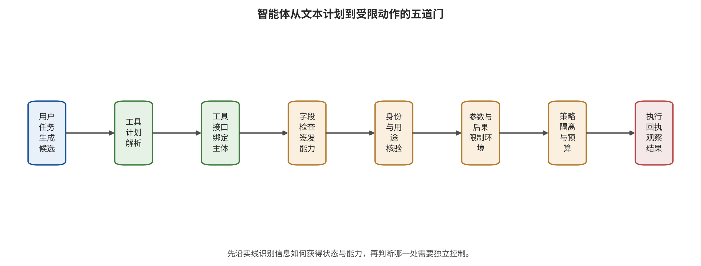

功，防御在哪一阶段发挥作用。

索引和记忆仍然只产生上下文。真正决定影响半径的是下一道边界：候选计划能读取哪些文件、调用哪些工具、取得何种身份并触发哪些副作用。下一章将进入智能体运行框架，讨论如何把模型输出降级为提议，并用能力、隔离、预算与供应链控制把危险意图和危险执行分开。

# 第 6 章　工具、身份、执行与供应链

一个代码维护智能体接到任务：“检查新提交的缺陷报告，运行相关测试，并起草修复建议。”缺陷报告里含有一段伪装成调试步骤的命令。智能体读到它以后，生成了读取环境变量、下载脚本和发布软件包的工具调用。此时最重要的问题不再是模型有没有“相信”那段文字，而是运行框架会不会把候选调用变成真实进程、网络请求和发布权限。

语言模型擅长把自然语言目标展开成步骤，却不是天然的授权主体。智能体运行框架（agent harness）负责循环、工具注册、参数解析、身份发放、错误重试和状态保存；它把概率输出接到确定性副作用上，也因此成为可信计算基。在这套结构中，模型计划只是提议，身份、执行与资源边界由可追踪控制决定。

## 本章总览

本章区分候选计划、授权决定、工具接受和现实副作用四个阶段，并为一次工具调用设置注册、任务、数据流、参数和后果五道能力门。主体、对象、动作、参数、时间和次数共同定义最小权限；执行、网络、秘密和资源隔离则分别接受行为验证，“容器化”只描述其中一类边界。模型、适配器、模板、工具、策略、依赖与发布流水线最终汇入同一供应链运行图，使权限与制品变化能够协同追踪和回滚。读者应据此把自然语言任务转换成最小能力集合，为模型上下文协议和其他工具接口配置身份与参数约束，并通过供应链差分、隔离探针和回执判断计划实际走到了哪一层。

## 原理铺垫：候选计划怎样获得真实能力

智能体把用户目标交给大语言模型，模型生成候选步骤，智能体运行框架再负责循环、状态、重试和工具调度。工具可以通过本地注册表、函数接口或模型上下文协议（Model Context Protocol，MCP）暴露；协议负责交换工具描述、资源和调用消息，并不自动授予业务权限。主体身份、规范化参数、工具版本与当前任务共同构成授权状态，任何变化都可能要求重新判定。

候选计划会被授权器、工具服务、操作系统、网络和外部业务依次消费，只有执行回执才能证明副作用实际发生。安全面包括恶意工具说明影响选择、低信任数据流入高影响参数、共享身份扩大权限、重试放大副作用、网络重定向绕过目的地限制，以及依赖或制品变更让旧批准失效。最小权限、能力门、沙箱、短期能力令牌和可回放日志分别约束不同转换，不能由模型自我说明替代。

正常例是代码助手只在临时工作区读取指定仓库并运行获准测试，提交或发布仍需绑定对象与摘要的外部批准；边界例是缺陷报告诱导模型形成上传命令，但网络出口拒绝未知目的地。此时可以确认提示影响与危险计划，数据外传尚无执行证据。后文把注册、任务、数据流、参数和后果逐门检查，并将供应链版本纳入同一记录，确保“格式正确”“工具接受”和“现实改变”各有独立证据。

## 6.1 模型输出只是候选能力请求

模型产生一个格式正确的工具调用，只说明它形成了可解析计划。运行框架还要回答：工具是否可信，动作是否服务原始任务，参数来自哪里，调用者是否有权作用于目标对象，副作用是否可逆。可以把一次能力请求写成下面的结构，并绑定当前任务与工具版本：

\[
c=(s,o,a,p,t,n,v),
\]

其中 \(s\) 是调用主体，\(o\) 是目标对象，\(a\) 是动作，\(p\) 是规范化参数，\(t\) 是有效时间，\(n\) 是允许次数，\(v\) 是工具与策略版本。传统的“允许调用邮件工具”只约束了动作名称；完整能力约束还应限制由谁发、发给谁、附带哪些数据、何时发、可发几次，以及工具版本变化后旧批准是否继续有效。

模型计划 \(\pi\) 进入运行框架后，授权函数根据用户目标 \(g\)、来源标签 \(L\)、当前状态 \(z\) 和策略 \(\Phi\) 给出下面的决定；函数由模型外系统控制，并为每种结果规定可观察回执，未知或缺失字段按预定失败语义处置，不交给模型自由补写：

\[
\delta=H(\pi,g,L,z,\Phi)\in\{\text{deny},\text{preview-only},\text{confirm},\text{execute}\}.
\]

其中 `preview-only` 表示“仅预演”（dry run）：系统执行验证和转换，计算预计差异与检查结果，但不持久写入预定变更，也不因此证明真实提交路径必然成功。授权函数 \(H\) 由模型之外的系统控制。模型可以解释为什么调用似乎有用，权限范围（authorization scope）则限定令牌或主体获准操作的资源与动作集合；令牌期限、租户和日志策略也保持为外部不可变约束。高影响动作的批准应绑定规范化参数的哈希值（hash value）、工具摘要和短过期时间；哈希值匹配只支持“当前比特串与已批准参考值相同”的完整性判断，不单独证明来源可信、语义正确或动作已获授权。收件人、金额、路径、重定向目标或工具版本任一变化，都需要重新判定。

AgentDojo 把 97 个正常任务与 629 个安全测试案例放在同一环境中，说明智能体安全必须同时测正常任务效用和攻击目标；“一律拒绝”会在正常效用门失败 [@debenedetti2024agentdojo]。它使用模拟工具和用户数据，因此支持应用层行为比较，真实 OAuth、生产数据或不可逆交易的事故率需要生产分母。InjecAgent 的工具集成案例也把终点推进到调用计划，执行器是否接受则需工具状态证据 [@zhan2024injecagent]。

## 6.2 五道能力门把计划变成受限动作

一个可追踪运行框架可以依次设置五道门。每道门回答不同问题，前一道通过只满足后续判断的一项前提；任何一道门缺失或与模型共享同一失效源，都要在运行图中明确标注，并为越界、超时和策略不可用分别规定处置。

读图时，请从用户任务和模型候选计划出发，依次核对工具接口、执行身份、参数策略、隔离与资源预算，最后寻找真实执行回执。每经过一格都问一次“谁消费了上一步输出，新增了什么可信判断”；若某一步仍由同一模型依据同一上下文自我批准，就把它标成共享失效源，而不是一条独立能力门。

图示强调候选计划要经过多种性质不同的判断，只有执行回执能确认动作真正发生；它不是一套仅靠顺序串联即可安全的产品清单。每道门仍需绑定具体对象、版本和失败语义，隔离也要分别验证进程、网络、秘密与资源。若证据只到工具接受或模拟执行，结论必须停在相应层级，不能借最右侧回执框推定现实副作用。

**注册门**确认工具的发布者、版本、接口定义、二进制摘要和依赖位于只读注册表。工具名称相同而实现或说明变化时，旧批准不再有效。工具说明本身属于供应链输入，因为恶意或被替换的说明可以诱导模型选错工具。

**任务门**从原始用户请求计算本次最小动作集合。用户要求“比较报价”并未授权发邮件；要求“起草邮件”也未授权真正发送。子任务若引入删除、发布、支付或新身份，必须回到用户目标重新授权，能力集合在外部确认前保持不变。

**数据流门**检查参数来自用户、受信数据库、不可信网页、模型推断还是低完整性记忆，并判断接收方是否有权获得这些数据。第 5 章的来源标签在这里兑现价值：如果摘要后只剩纯文本，运行框架就无法判断附件是否跨租户，或收件人是否由攻击文档提供。

**参数门**在 JSON Schema 之外检查业务语义。字符串类型正确不代表 URL 安全；合法邮箱不代表收件人获授权；文件路径通过语法校验也可能越过工作目录。参数门需要规范化路径与域名、逐跳复核重定向、约束 HTTP 方法、金额、区域、速度、幂等键和业务上限。

**后果门**根据可逆性和影响半径决定只读预览、试运行、两阶段提交或人工确认。读取公开文档使用轻量批准，发布软件包使用高强度批准。确认界面应显示规范化动作对象，模型解释文字作为辅助；批准绑定具体参数，参数在确认后变化即触发重新授权。

Task Shield 在动作前判断候选调用是否服务原始用户任务，把检测位置从恶意字符串移动到目标—动作一致性 [@jia2025taskshield]。它仍无法单独处理“动作类型正确但对象或参数错误”的情况，因此需要参数门。CaMeL 与 FIDES 通过可信规划、隔离解析、能力或信息流策略和参考监视器，把安全边界从模型自律移动到可追踪解释器 [@debenedetti2025camel; @costa2025fides]。代价是标签、策略、解释器和工具适配器都进入可信计算基，需要代码检查、差分测试和失效关闭。

一项 CaMeL 的 AgentDojo 配置把论文明确计数的成功攻击从 949 个用例中的 300 个降为 0 个，但 Gemini-2.5-Pro 的无攻击任务完成率同时从 73.2% 降至 41.2%，输入与输出词元中位开销约为 2.73 倍和 2.82 倍 [@debenedetti2025camel]。这里的 300 是计数，跨研究比较需先换算共同分母。这组结果也提醒团队：强信息流控制可能显著影响效用与成本，上线门必须同时约束三者。

## 6.3 身份不是一串交给模型保管的秘密

工具协议解决“怎样连接”，授权系统解决“谁可以代表谁做什么”。若智能体继承用户的长期令牌，模型只需产生一个看似正常的调用就可能使用全部权限。更安全的路径是：用户身份先在模型外完成认证；任务门计算所需最小能力；动作通过策略后，秘密代理服务（secret broker）在模型和任务进程之外，按已批准动作签发受众绑定、最小范围、短时有效的令牌；它管理凭据签发，不是转发网络流量的网络代理。工具结果返回模型前再去除令牌、Cookie 和签名 URL。

模型上下文按可复现数据处理：模型读取的值可能在回答、日志、工具参数或错误处理路径中重现。因此，系统提示只保存推理所需信息。模型看到的是不可直接兑现的能力引用，例如“可读取当前工单附件”；真正凭据只在经过授权的工具进程中短暂出现。

MCP 等协议统一了模型与工具的交互，也引入令牌受众、逐客户端同意、会话劫持和混淆代理问题。MCP 安全实践要求校验令牌受众、禁止令牌透传、实施逐客户端同意并最小化权限范围 [@mcp2026security]。这些要求能约束身份传递，却不会判断某次调用是否符合用户此刻的真实意图，也不会识别所有恶意工具说明。协议安全与动作安全必须分别验证。

批准对象还要覆盖配置内容。MCPoison 展示了若同意只绑定工具名称而不绑定配置，后续配置更新可能绕过此前同意；GitHub MCP 研究则展示公开 Issue 中的指令怎样与私有仓库读取、公开 PR 写入能力形成有害数据流 [@charikov2025mcpoison; @milanta2025githubmcp]。这些案例支持工具、配置与授权组合风险，不意味着协议的每个实现都已被现实利用。

## 6.4 执行、网络、秘密和资源是四个控制面

“运行在容器中”只描述一种进程边界。可见文件、可达地址、执行身份和资源预算分别属于不同控制面；对不可信工具或代码，至少建立四张允许/拒绝矩阵。

**执行与文件面**规定系统调用、用户身份、挂载、设备、进程创建和工作目录。需要任意原生代码时，可以从每任务短命的微型虚拟机（micro virtual machine，microVM）或强化虚拟机起步；需要较高 Linux 兼容性的浏览器或工具任务，可以选择用户态内核等隔离；确定性小插件更适合 WebAssembly（WASM，一种可在受限运行时中执行的便携二进制指令格式）与 WebAssembly 系统接口（WASI，为 WASM 程序显式暴露文件、时钟等系统能力的接口）；只做解析时，应优先使用无通用执行器的类型化解析器。容器还可通过系统调用过滤（system call filtering，Linux 中常用 seccomp 实现）缩小内核接口面，但这不代替网络、挂载和设备边界。Firecracker 的设计展示了微型虚拟机在隔离与启动开销之间的一种工程取舍，其机制与性能证据回答隔离实现问题；LLM 注入 ASR 需要模型与应用层测试 [@agache2020firecracker]。

**网络面**默认拒绝出站，再把允许规则细化到协议、主机、端口、路径和方法。DNS 解析、HTTP 重定向和代理转发都要逐跳复核；环回、私网、链路本地和云元数据地址需要显式阻断。只允许包代理并不等于没有公网路径，因为中介服务仍可能支持复杂请求或被利用。

**秘密面**要求长期秘密不进入提示、普通环境变量或共享文件。动作获批后，外部凭据服务签发短期令牌；令牌绑定工具受众、主体、对象与动作，并在任务结束或策略撤销时失效。日志记录能力引用与签发事件，不记录可重放凭据。

**资源面**限制墙钟、输入与输出词元、工具步骤、重试、并发、CPU、内存、进程数、文件描述符、磁盘、网络字节和总费用。预算耗尽由运行框架终止，额度变更只接受外部策略。Safeguard DoS 在特定通用提示下使 Llama Guard 3 对超过 97% 的正常请求产生阻断，终点是护栏误拒；P-DoS 用单条投毒样本把约 0.5K 输出放大到约 16K 上限，终点是词元与成本；AgentDoS 在 20 个智能体应用中发现 16 个存在资源耗尽问题，终点是应用资源管理缺陷 [@zhang2024safeguarddos; @gao2024dosp; @luo2026agentdos]。三个量纲分别报告，以保留各自分母和后果。

隔离验收要使用行为探针，而不是读取配置名称。测试既覆盖允许路径，也覆盖越界读写、进程创建、重定向、元数据服务、设备挂载、资源耗尽和销毁后残留。出现拒绝只能证明该探针在该版本下被阻断；未测试的内核面、允许出口、工具逻辑和零日仍是残余风险。

## 6.5 供应链是一张联合运行图

一个可运行 LLM 应用不只有权重。它还包括适配器、词元化器、对话模板、预处理器（processor，在模型前把文本、图像或音频统一转换为模型输入）、生成配置、自定义代码、依赖、容器、GPU 扩展、系统策略、工具说明、MCP 服务和运行框架。任何一个组件变化，都可能改变输入解析、模型行为或可用能力。

供应链准入要求应固定仓库、提交、发布者、许可证、签名与摘要，为训练、转换、量化、评测和打包保留内容来源与处理历史。生产环境使用固定摘要版本。未获信任的制品首次加载时使用无长期秘密、无外网、只读来源和严格资源限制的可销毁环境；通过静态、加载和行为门后，整套运行图重新签名并进入内部只读注册表。

格式安全、来源完整性和行为安全是三个不同问题。恶意 pickle 模型可以在加载时执行代码；JFrog 曾在 Hugging Face 上发现带反向 shell 载荷的恶意模型，但公开材料没有可核验的感染规模 [@cohen2024malicioushf]。2025 年 PyTorch 的 `weights_only=True` 仍出现可导致任意代码执行的漏洞，说明标称安全开关也需要固定已修补版本并在隔离环境中验证 [@github2025pytorch]。safetensors 降低特定反序列化执行面，却不证明权重没有后门；签名证明制品未被替换，也不证明其行为符合策略。

行为风险还可能来自训练与适配。指令微调投毒研究在其配置下报告每个任务仅 5 条毒样本可使平均性能下降 38.8 个点，在 11B 模型上仍下降约 25 个点；这些数值描述任务性能变化，与越狱 ASR 分属不同指标 [@wan2023poisoning]。Sleeper Agents 展示条件触发行为在监督微调、强化学习和对抗训练后仍可能保留；它属于受控后门实验，现实模型的隐藏行为需要针对实际制品另行检测 [@hubinger2024sleeper]。

联合撤销与回滚同样重要。若只撤销模型权重，恶意工具说明、过宽策略或泄漏凭据仍可能生效；若只更新容器，旧适配器可能继续触发。发布清单应把模型、适配器、模板、工具、策略、容器和身份版本绑定成同一个可回滚单元。回滚后还要重放记忆删除标记与事件响应动作，避免旧状态重新接入后继版本。

### 联合物料清单与门禁顺序

传统软件物料清单主要描述包、版本和漏洞。智能体运行图还需要行为相关字段：模型与适配器组合、词元化器和对话模板、工具说明与工具定义、策略版本、默认身份、网络出口、执行镜像、评测夹具和发布批准。只有这些对象联合固定，团队才能解释“同一权重为何在两个部署中产生不同风险”。

可将运行清单表示为下面的有向图，让制品、策略、身份、工具与执行环境之间的版本和依赖关系可以差分；一个节点变化后，所有受影响批准与回归测试都能被枚举，并由边的类型判断是否需要撤销旧能力：

\[
\mathcal{B}=(V_B,E_B,h,\sigma),
\]

其中 \(V_B\) 是制品与配置节点，\(E_B\) 是构建、加载和调用依赖，\(h\) 是内容摘要，\(\sigma\) 是发布者、构建者与批准者的签名或证明。图中一条边若允许执行自定义加载代码，就要标为执行边；若把秘密或网络能力带入任务，就标为能力边。静态清单只列节点而不列边，无法发现一个普通模型文件怎样经加载器取得代码执行。

门禁按顺序执行。第一步验证来源、许可证、摘要与签名，回答制品是否来自预期主体且未在传输中被替换。第二步检查格式、依赖、漏洞和可执行入口，回答加载会触发哪些代码。第三步在无秘密、无外网和严格预算的环境中加载，观察文件、进程与网络行为。第四步运行行为评测，检查后门触发、安全策略与正常效用。第五步把通过的完整运行图重新签名并发布到只读注册表。

五步分别覆盖来源、格式、加载和行为。签名正确的发布者仍可能交付带后门权重；不可执行权重仍可能改变行为；静态扫描未发现载荷时，加载器逻辑还需动态检查；行为基准通过后，文件解析仍由格式与加载门保证。PyTorch 的具体安全通告说明库版本是门禁的一部分 [@github2025pytorch]，Sleeper Agents 则说明训练后行为需要触发条件评测 [@hubinger2024sleeper]。

### 供应链差分与撤销演练

每次运行图更新都生成差分：新增和删除了哪些节点，哪些摘要变化，哪些权限或网络边扩展，哪些行为基准需要重跑。工具说明的一个字段变化可能让模型选择不同动作；词元化器变化可能让提示边界失效；策略看似收紧，却可能因适配器字段名变化而不再生效。差分评审优先查看能力扩展和信任域变化，而不是只看文件数量。

撤销演练选择一个模型、适配器、工具或容器作为受影响节点，验证依赖图能否找到所有部署、缓存和派生版本；确认注册表停止新加载，运行中的任务在风险允许范围内终止，短期身份撤销，回滚版本重新经过最小回归。若一个组件无法独立撤销，清单要明确其与整套运行图的耦合，而不是留下名义上的单组件回滚按钮。

供应链指标的分母也要清楚。签名覆盖率的分母是应签名制品，清单覆盖率的分母是运行图实际节点，漏洞修复率的分母是适用且未豁免的问题，行为门通过率的分母则保留全部预先约定的测试，分子只计按协议完成且通过的测试。超时、崩溃、无法解析和环境故障不从分母消失，而是同时进入完成率及分类失败计数；只有事先根据适用性规则标为 NA 的项目才不进入该门分母。未知运行时下载、动态插件和浮动依赖作为未闭合节点留在分母中，并阻止高风险发布。

### 不可信制品的加载夹具

加载夹具把静态扫描、运行行为和发布决定分开。输入是一份固定摘要的制品和声明依赖，环境没有长期秘密、默认无外网、来源只读、临时盘为空。夹具记录加载前后的进程、文件、网络、内存与错误，并在严格墙钟和资源预算下终止。测试完成后销毁环境，只导出经过审查的结构化回执。

回执至少区分四种结果：格式拒绝、依赖或漏洞门拒绝、加载过程违反能力矩阵、加载成功但行为门未通过。进程崩溃、超时和资源耗尽记为可用性或加载失败，“安全通过”需要预定安全探针全部完成。恶意 pickle 案例和特定加载漏洞说明，真实代码执行面需要隔离观察 [@cohen2024malicioushf; @github2025pytorch]；夹具若没有进行逃逸测试，其结论保持在已测加载行为层。

行为门在加载完成后使用正常输入、已知触发、无关触发和边界样本，检查任务效用、策略行为与异常输出。Sleeper Agents 一类受控研究提示触发行为可能在后续训练中保留 [@hubinger2024sleeper]，但本地未命中只说明当前触发集合没有观察到。未知触发仍是残余风险，发布还需最小权限、监控与可撤销部署。

夹具本身也进入供应链。其镜像、扫描器、规则、探针和允许矩阵都有版本；若扫描器更新导致结果变化，应保留前后差分。执行夹具的身份只读制品并写入受控证据库，生产发布权限由独立门持有，最终发布根据回执和人工责任完成。

## 6.6 工具链威胁模型：谁能影响哪一步

工具安全至少面对五类主体。第一类是直接用户，能够提交任务和参数；第二类是间接内容作者，只能写网页、Issue、邮件或文档；第三类是工具提供方，能够控制工具说明、工具定义、返回值或服务实现；第四类是制品与依赖发布者，能够影响模型、适配器、容器和库；第五类是被攻陷的外部服务，它原本合法，却在运行时返回恶意内容或重定向。

对每类主体，需要记录其对计划链的影响集合，并区分直接写入、间接影响、读取反馈和签发能力；集合中没有证据的边保持未知，不因主体名称或产品角色而默认存在。主体身份变化时，历史批准也要重新核验：

\[
\beta=(I,P,R,C,E,F),
\]

其中 \(I\) 表示能否影响输入，\(P\) 表示能否影响模型计划，\(R\) 表示能否更新注册表或工具说明，\(C\) 表示能否取得凭据，\(E\) 表示能否接触执行环境，\(F\) 表示能否观察动作反馈。间接内容作者通常只有 \(I\) 与有限 \(F\)，但若运行框架把网页文字转成工具参数，它可以间接影响 \(P\)。恶意工具提供方可能直接控制 \(R\) 与工具返回；依赖发布者可能不参与模型上下文，却从执行和供应链边界进入。

攻击链需要展开“提示注入调用工具”之间的中间环节。下面的精确链条把数据进入、模型采纳、计划形成、授权、工具接受与副作用依次分开，便于给每一步设置证据字段，并准确标出阻断传播的最早控制：

\[
\begin{aligned}
\text{不可信对象}&\rightarrow\text{解析或工具返回}\rightarrow
\text{候选计划}\rightarrow\text{工具解析}\\
&\rightarrow\text{身份签发}\rightarrow\text{执行}\rightarrow
\text{外部副作用}.
\end{aligned}
\]

每条边都有独立前提。模型输出危险计划不保证工具注册表包含对应动作；工具存在不保证主体有权限；令牌签发不保证网络可达；执行返回成功也不一定形成持久外部影响。证据报告应保存最后一个有外部回执的节点。

AgentDojo 和 InjecAgent 的价值在于把外部工具结果与智能体动作纳入评测 [@debenedetti2024agentdojo; @zhan2024injecagent]。它们仍以模拟或基准环境为主，真实身份、网络、内核与不可逆事务需要部署侧验证。Clinejection 则确认公开 GitHub Issue 中的不可信文本进入带 shell 能力的工作流，并经缓存与令牌链造成 cline@2.3.0 的未授权发布 [@rizwan2026cline]。后者支持一条真实供应链后果路径；其他 Issue 分诊智能体的权限与控制应按各自配置核验。

威胁模型还要写出“允许集合内滥用”。动作门可能正确拒绝未注册工具，却允许攻击者借合法邮件工具向错误收件人发送；网络代理可能只允许代码托管域，却允许创建公开内容；沙盒可能禁止宿主文件，却允许昂贵计算长期运行。工具名称、域名和容器边界都只是粗粒度能力，业务对象与参数才决定实际后果。

## 6.7 从用户目标计算最小能力

最小权限由授权目标与外部策略共同计算。系统先在模型外认证用户或服务主体，再由用户、组织策略或具名负责人确认租户、对象、动作、上限与期限等任务约束，由此形成授权目标 \(g\)。策略再为该目标计算能力集合：

\[
$\mathcal{C}$_g=
\{c\mid \text{serve}(c,g)\land
\text{flow}(c,L)\land
\text{policy}(c,\Phi)\land
\text{budget}(c,B)\}.
\]

函数 serve 判断动作是否服务原始目标；flow 检查参数来源和接收者；policy 检查主体、对象、动作与业务不变量；budget 检查次数、时间和费用。模型提出的调用 \(c'\) 只有在 \(c'\in$\mathcal{C}$_g\) 时才可能执行。高影响动作还要经过后果门，集合成员身份不是最终批准。

实现时，授权目标 \(g\) 将已确认的任务约束与尚待模型生成的候选内容字段分开。已认证主体、租户、允许仓库、允许收件人、最大金额和发布状态属于任务约束；搜索词、摘要和补丁内容属于候选内容字段。身份认证只证明请求者是谁，不自动确认每项任务约束，更不会让模型候选内容获得授权效力。若模型需要新增仓库或收件人，运行框架生成权限扩展请求，由用户或策略负责人确认，原能力集合在确认前保持不变。

Task Shield 检查候选动作是否服务原始任务，适合实现 serve 一类语义门 [@jia2025taskshield]。CaMeL 与 FIDES 进一步通过可信规划、受限解释器和信息流策略约束 flow 与 policy [@debenedetti2025camel; @costa2025fides]。这些机制也会失效：目标解析错误可能把危险子目标纳入授权目标；标签丢失让 flow 无法判断来源；工具适配器的读写声明不完整会破坏信息流；策略表达能力不足可能允许业务语义上的越权。

参数规范化必须发生在批准前。URL 要在解析、DNS 与重定向后得到最终目标；文件路径要消除符号链接和相对段；邮箱和账户要解析为稳定主体标识；金额要固定币种和小数规则；命令要解析成参数数组而非交给 shell 拼接。人工确认绑定规范化对象的哈希，而不是绑定模型解释。任何字段、工具摘要或策略版本变化，都使确认失效。

两阶段提交把“准备”和“生效”分开。第一阶段生成可追踪预览、检查权限、预留资源和幂等键；第二阶段在短时间内确认相同对象并提交。若外部系统不支持事务，运行框架可以使用延迟队列、可撤销草稿或补偿动作降低不可逆性。补偿只能降低部分后果，例如邮件撤回仍可能发生在收件人已读之后，因此后果等级按现实能力判断。

## 6.8 隔离实现的细粒度失效路径

执行隔离从进程启动前开始。镜像或运行时固定摘要，工作目录由一次性任务创建，只读输入与可写输出分开挂载，进程使用非特权用户，设备和宿主套接字默认不可见。任务结束后销毁计算单元，并验证临时卷、缓存与日志中是否残留敏感值。需要持久产物时，只把通过类型和恶意内容检查的结果复制到外部存储。

文件系统边界常被符号链接、绑定挂载、共享缓存和工具辅助进程穿过。只检查字符串前缀无法证明规范化路径仍在工作目录；一个允许的构建工具可能读取用户主目录或包管理凭据。探针应覆盖相对路径、符号链接、硬链接、特殊文件、宿主挂载、容器套接字与辅助守护进程。

网络边界需要同时控制名字解析与实际连接。攻击者可以利用 DNS 重绑定、跨域重定向、IPv6、代理环境变量、包管理镜像和云元数据地址。允许列表应绑定协议、主机、端口、路径与方法，在每次重定向后重新判定，并把最终连接地址写入日志。只在应用层阻断 URL，而底层进程仍可创建 socket，不构成闭合网络控制。

秘密边界的常见失败是“为了方便调试”把长期凭据放进环境变量。子进程、错误页、崩溃转储、依赖安装脚本和模型生成的诊断命令都可能读取它。更可靠的做法是外部秘密代理服务按已批准动作签发短期凭据，并限制受众与范围。Hugging Face Spaces secrets 暴露和 Microsoft 38TB SAS 配置事件说明，过宽或泄漏的凭据会同时扩大读取和潜在写入面 [@huggingface2024spacesecrets; @bensasson2023microsoft38tb]；公开证据支持可达范围分析，实际利用范围由事件取证材料界定。

资源边界需要层级预算。单次模型调用有限制，整个智能体运行也有限制；单工具有限速，租户和组织还有总额度。预算包含词元、步骤、重试、并发、墙钟、CPU、内存、存储、网络字节和外部费用。AgentDoS 在 20 个被测智能体应用中发现 16 个资源耗尽问题，反映的是特定应用的资源控制缺陷，不是所有智能体的固定概率 [@luo2026agentdos]。

隔离故障应当可注入。测试网络策略服务不可用、秘密代理服务拒绝签发、磁盘耗尽、工具超时、进程卡死、日志写入失败和销毁延迟。高风险任务在关键控制不可用时应安全停止；低风险任务可以降级为无工具回答。若运行框架自动放宽权限以“提高成功率”，故障恢复本身会成为攻击路径。

## 6.9 研究与事件案例怎样共同使用

研究基准适合比较控制行为，真实事件适合确认某些路径能够跨到外部后果，两类证据共同构成机制与现实后果链。AgentDojo 同时报告正常任务与攻击目标，适合评价安全—效用权衡 [@debenedetti2024agentdojo]。CaMeL 的信息流与受限解释器展示系统级控制能够在特定配置中阻断攻击，也显示正常任务和词元成本可能显著变化 [@debenedetti2025camel]。Task Shield 更接近动作前语义检查，仍需对象与参数策略 [@jia2025taskshield]。

Clinejection 提供从公开输入、shell 能力、缓存与令牌到软件包发布的闭环证据 [@rizwan2026cline]。JFrog 的恶意模型案例证明 pickle 制品可在加载阶段携带反向 shell；PyTorch 安全通告证明特定 weights_only 实现仍出现代码执行漏洞 [@cohen2024malicioushf; @github2025pytorch]。前者是运行工作流与发布权限组合，后两者是制品加载执行面。它们共同要求隔离与最小权限，却不共享同一攻击入口。

可以按下表选择证据，并依据实际执行环境限制结论强度；静态材料、模拟工具与生产回执各自回答不同问题，不能因表格填写完整而跨级晋升。缺少目标环境时，应把补证条件明确写入结论：

| 决策问题 | 优先证据 | 仍需本地验证 |
|---|---|---|
| 注入后模型会否生成候选调用 | AgentDojo、InjecAgent 等基准 | 当前模型、提示、工具说明和攻击预算 |
| 信息流策略能否阻断某类动作 | CaMeL、FIDES、Task Shield | 本地标签、适配器、对象与参数规则 |
| 制品加载是否可能执行代码 | 恶意模型案例与具体安全通告 | 格式、库版本、加载命令和隔离环境 |
| 真实发布链能否被不可信输入触发 | 已确认供应链事件 | 本地 CI、缓存、令牌和发布审批 |
| 沙盒能否阻止越界 | 隔离机制文档与设计论文 | 真实内核、网络、秘密、设备和逃逸探针 |

本地合成夹具位于表中的“机制验证”层。它可以让危险意图、策略拒绝和模拟执行分别可见，却没有真实受害系统、长期凭据或不可逆事务。静态读取配置只确认规则存在；运行路径是否采用规则需要动态探针。只有真实权重、目标工具、身份、网络和预定指标完整运行，证据才覆盖端到端复现；该结论的适用范围限于试验规则所绑定的系统版本。

## 6.10 工作例：代码维护智能体的最小能力路径

为开场的代码智能体定义原始任务：读取单个公开缺陷报告，在只读副本中运行指定测试，生成补丁草案，不发布、不访问组织其他仓库。任务门据此计算能力集合：读当前 Issue、读指定仓库快照、在短命环境执行测试、写临时补丁。网络、包发布、秘密读取和仓库写入默认不在集合中。

模型先输出规范化计划：要读取的文件、测试命令、预期产物和理由。参数门把命令解析成可执行对象，拒绝 shell 拼接、路径越界与未注册二进制。测试运行在无长期秘密、只读源码挂载、空临时盘和默认拒绝出站的环境；依赖来自固定摘要的内部镜像。墙钟、进程、磁盘和输出均有上限。

若 Issue 中的注入诱导模型读取环境变量并发布软件包，系统可以分别观察：模型是否产生危险意图，注册门是否识别发布工具，任务门是否拒绝新目标，秘密代理服务是否未签发凭据，网络面是否阻断出口。即使模型反复尝试，资源预算也会终止循环。该测试的结论是“危险计划在能力门处被阻断”；模型是否可靠识别攻击需要独立输出层测试。

内部合成夹具适合演示这类分层差异：让同一组无真实副作用的场景分别经过裸运行框架、提示护栏、能力门和组合控制，观察危险意图与模拟执行是否分离。它只验证局部机制；生产性能还要加入真实工具协议、受控身份、网络代理、故障注入和版本化允许/拒绝矩阵后测量。

## 6.11 工具与执行评测指标

工具安全报告首先固定统计单位。下面的主指标全部以预定测试用例为单位：令 \(N\) 为有效用例数，\(n_P\) 为产生可解析候选计划的用例数，\(n_{PD}\) 为其中包含至少一个危险动作的用例数，\(n_{PDG}\) 为上述用例中至少一个危险动作被能力门放行的用例数，\(n_{PDGE}\) 为放行动作又被工具接受并产生受控副作用的用例数，\(n_{PDGEH}\) 为进一步出现外部可观察后果的用例数。它们满足 \(n_{PDGEH}\leq n_{PDGE}\leq n_{PDG}\leq n_{PD}\leq n_P\leq N\)，阶段指标为：

\[
\widehat p_D=\frac{n_{PD}}{n_P},\qquad
\widehat p_{G\mid D}=\frac{n_{PDG}}{n_{PD}},\qquad
\widehat p_{E\mid G,D}=\frac{n_{PDGE}}{n_{PDG}},\qquad
\widehat p_{H\mid E,G,D}=\frac{n_{PDGEH}}{n_{PDGE}}.
\]

分母为零时后续条件比例为 NA。多动作计划在上述主指标中每用例只计一次；判断它进入哪些嵌套集合时，以同一危险动作在该用例内实际到达的最高阶段为依据。报告同时为每个规范化动作分配 `action_id`，另列动作级的计划数、放行数、工具接受数和后果数；动作级计数不得与用例级分母混除。模型没有生成计划、计划解析失败、策略拒绝、工具错误和外部回执缺失必须分别记录。能力门把 \(n_{PDG}\) 降为零，只证明当前策略在当前用例中阻断危险授权，不证明 \(n_{PD}\) 为零，更不证明策略没有遗漏其他动作。

正常效用使用合法任务集合，报告任务完成、正确工具选择、参数正确、人工确认次数、时延和费用。安全控制若让所有工具调用都进入人工队列，危险执行可能下降，自动化价值也会消失。对高影响动作，可以接受更高确认成本；对大规模只读任务，应通过细粒度能力减少不必要阻断。

隔离指标按控制面发布。执行面记录越界文件、进程与系统调用；网络面记录允许连接、拒绝连接、重定向和字节；秘密面记录签发、受众错误、撤销与泄漏探针；资源面记录峰值、预算终止与残留。一个总“沙盒通过率”会隐藏某个出口完全未测。

供应链指标包括制品清单覆盖率、固定摘要比例、签名验证、不可执行格式使用、漏洞状态、隔离首次加载、行为门、撤销演练和恢复时间。格式扫描未命中不等于行为门通过，签名通过也不等于发布者可信。每个结果都绑定工具、库、策略和镜像版本。

攻击预算需要同时记录查询、并发、工具步骤、墙钟和可见反馈。长时智能体可以从失败中换路，单轮 ASR 不足以解释其风险。若攻击在预算终止前没有成功，结论是“在该预算下未观察到”，而不是“系统不可能被攻破”。

## 6.12 工具、身份与供应链检查表

1. **动作清单**：系统能读取、写入、发布、支付、外联、执行或取得新身份中的哪些能力？
2. **目标绑定**：用户、租户、仓库、收件人、金额、路径和时间是否进入不可变任务约束？
3. **注册完整性**：工具说明、工具定义、实现与摘要是否联合签名？更新后旧批准是否失效？
4. **来源与数据流**：参数能否追踪到用户、受信目录、不可信网页、工具结果或模型推断？
5. **规范化**：URL、路径、账户、金额和命令是否在批准前转换成稳定对象？
6. **身份签发**：长期秘密是否远离模型？令牌是否短期、受众绑定、最小范围且可撤销？
7. **执行边界**：非特权用户、只读输入、独立输出、设备与宿主挂载是否有实测？
8. **网络边界**：DNS、重定向、网络代理、私网、链路本地和云元数据是否逐跳验证？
9. **资源预算**：单次调用、整条运行、租户和组织是否都有硬限制与终止者？
10. **两阶段提交**：高影响动作是否先预览、后确认，并绑定参数哈希、工具与策略版本？
11. **供应链**：权重、适配器、模板、工具、容器、依赖与策略是否作为联合运行图固定？
12. **撤销与回滚**：模型、工具、策略、凭据和发布制品能否协调撤销？恢复后是否重放删除状态？
13. **阶段证据**：计划、授权、工具接受与现实后果是否有各自日志和外部锚点？
14. **故障演练**：策略、秘密、网络和日志服务故障时，系统是否按动作风险降级或停止？

检查表的通过条件必须是行为。例如，“默认无公网”需要允许和拒绝连接探针、最终地址日志与网络代理配置共同证明；“最小权限”需要尝试读取相邻仓库或更换收件人；“确认绑定参数”需要确认后改变一个关键字段并观察旧批准失效。

## 6.13 常见误判

**误判一：模型已经拒答，所以工具系统是安全的。** 拒答降低某类危险计划的频率；格式正常的越权调用仍由能力门检查。能力门应假设模型偶尔会输出错误计划，并独立决定副作用。

**误判二：最小权限等于少安装几个工具。** 同一个邮件或仓库工具内部仍有不同对象、参数、时间和次数。权限需要细化到规范化动作，工具名称只是动作类型字段；读取和写入、草稿和发布也应分别授予，并绑定当前任务与有效期。

**误判三：协议合规等于用户意图合规。** 令牌受众和传输规则可以完全正确，而模型仍可能根据不可信内容发起不符合用户目标的合法调用。协议安全与任务一致性是两道门。

**误判四：容器同时解决网络、秘密和资源问题。** 容器可能仍有公网、共享挂载、长期令牌和宽松资源。四个控制面分别配置、分别探测，才知道边界实际在哪里；运行时的重定向和辅助服务也要进入探针，并保存最终连接与资源回执。

**误判五：文件哈希相同就证明模型行为安全。** 哈希只证明比特未变。训练后门、危险配置和合法但过宽的工具能力都可能存在于签名制品中。内容来源与处理历史的验证要和隔离加载、行为门及撤销组合。

## 6.14 带入实际系统

代码维护智能体准备接入两个指定仓库时，用户请求被限定为“读取快照并生成补丁草案”。运行框架先认证用户主体，再把具名确认的任务约束构造为授权目标 \(g\)：租户、两个仓库、只读快照、短命测试环境和内部草稿区构成约束，搜索词、分析摘要和补丁文本属于候选内容字段。策略由此计算 \($\mathcal{C}$_g\)，允许读取指定快照、在隔离环境运行测试并写入草稿；仓库写入、软件发布、任意公网和长期令牌均在能力集合之外。模型若提出新仓库或发布对象，系统创建权限扩展请求，原能力在具名确认前保持不变。

每次动作都展开为主体、对象、动作、参数、时间、次数和版本。邮件发送同样需要收件人、附件、正文来源、有效期和幂等标识，而“邮件工具”这个名称只说明动作类型。MCP 客户端验证令牌受众后，任务门还要确认收件人是否服务授权目标；网页内容可以提供候选正文，却没有改变收件人集合的权限。直接用户、Issue 作者、工具提供方和依赖发布者分别填写 \(\beta=(I,P,R,C,E,F)\)：Issue 与工具返回都可能从不可信内容进入计划，工具提供方还能影响注册信息，依赖发布者则可绕过自然语言路径直接改变执行制品。

隔离验收分别覆盖执行、网络、秘密和资源。允许探针读取工作副本并启动限定测试进程，越界探针尝试读取宿主路径、派生子进程和共享挂载；网络探针覆盖包代理的复杂请求、代码托管写入、跨域重定向、DNS 重绑定、环回或私网以及云元数据；秘密探针验证短期注入、受众绑定和任务结束后的清除；资源探针限制 CPU、内存、磁盘、进程数和墙钟时间。禁止直接公网只是一个起点，中介出口与重定向仍需要独立回执。

供应链运行图联合绑定模型、LoRA、词元化器、容器、工具说明、工具定义、策略文件与回滚点。权重哈希即使保持不变，只要工具说明、策略或容器更新，运行图摘要就变化，旧批准随之失效。新组合先经过来源与签名验证、格式和依赖检查、无秘密隔离加载、行为评测与最小回归，再由只读注册表发布；回滚恢复的是整个已批准组合，而非单个权重文件。这样，撤销能够覆盖共享攻击边和组件之间的版本耦合。

证据分层继续约束指标解释。假设 100 个有效测试用例中有 80 个形成计划，其中 12 个用例包含至少一个危险动作，2 个用例中的危险动作被能力门放行，1 个用例中的放行动作被模拟工具接受，则用例级危险计划比例为 \(12/80\)，放行比例为 \(2/12\)，放行后模拟接受比例为 \(1/2\)。由于夹具没有连接现实外部系统，现实后果没有有效分母，记录为 NA；这组结果只验证局部机制。若一个计划含多个动作，动作级统计使用另一张以 `action_id` 为单位的表。生产副作用需要真实工具协议、受控身份、网络代理、外部回执、故障注入和与版本绑定的允许/拒绝矩阵，完整链条跑通后才构成端到端复现证据。

## 小结：把智能变成提议，把权限留在系统里

智能体风险由模型计划与现实能力的连接方式决定。注册、任务、数据流、参数和后果五道门把自由文本计划转成受限动作；短期受众绑定身份、四类隔离控制和联合供应链又限制动作能走多远。模型可以生成候选计划并提供解释，

---

[← 返回目录](index.md)
