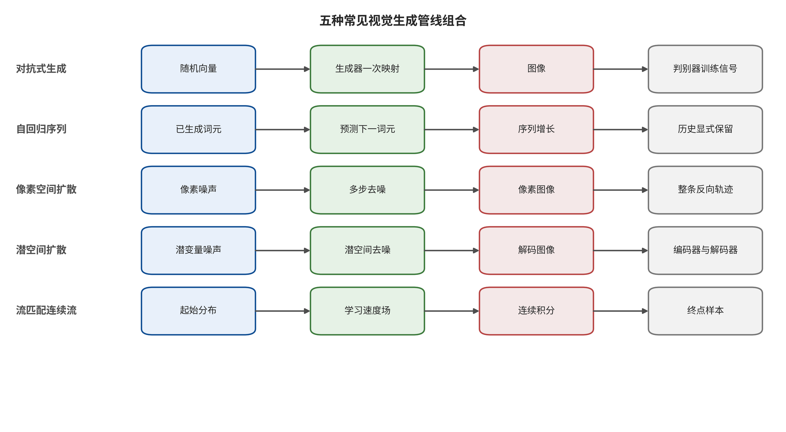
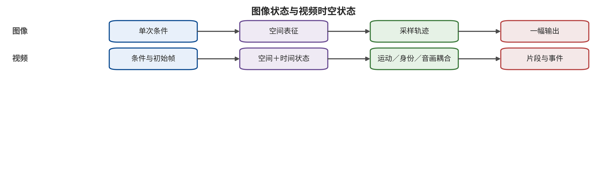

关系中。

本部分的图示采用共同输入与输出框比较生成机制，目的不是为算法排高低，而是让读者看到每类方法在哪些中间状态上留下不同的控制点。阅读案例时应同时保留画质、合法任务效用、隐私、来源信号和运营成本；任何一个漂亮样本都不能替代带分母的评测，也不能证明供应链和发布链已经闭合。

\newpage

# 第 8 章　视觉生成管线与安全资产

一家品牌工作室准备上线“文字生成海报—参考图生成短片—数字人配音—自动发布”的创作服务。产品经理看到的是一个输入框和一个下载按钮，安全工程师看到的却应是一条状态不断增多的管线：提示会被编码，参考素材会被上传，若干模型组件会被动态加载，采样过程会保留潜变量和缓存，输出还要经过超分、插帧、配音、审核、转码与发布。条件解析器若让参考素材中的文字覆盖获批脚本，发布服务若让新生成媒体沿用旧媒体的账号授权，系统就分别越过了条件来源边界与发布权限边界；最终画面清晰自然也改变不了这两个事实。

视觉生成安全不能只问“结果里有没有不良内容”。同一张异常图片可能来自受污染数据、被置换的编码器、恶意适配器、运行时条件绕过、训练样本记忆或下游身份滥用；这些路径的攻击者权限、最早控制入口和可用防御完全不同。本章先建立生成机制直觉，再把图像与视频系统展开成可追溯的资产和状态，为后续三章提供共同坐标。

## 本章总览

本章从一次生成请求的完整数据流出发，将视觉服务展开为“条件—表示—状态更新—解码—发布”五个连续环节。潜变量、生成主干、条件模块、采样器和后处理器各自改变不同状态，因而要从真实数据流判定安全属性。这里不把潜空间、扩散Transformer（Diffusion Transformer，DiT）、扩散、流匹配和自回归列为同级类别：潜空间描述表示位置，DiT 描述生成骨干，扩散、流匹配和自回归描述不同的训练构造或更新规则。实际系统通常是这些正交维度的组合，各自暴露不同的写入点、缓存和失效路径。

当对象从图像扩展到视频，时间顺序、运动、音画关系和流式状态成为无法由单帧代表的安全资产。后文将这些机制落到实际服务：列出资产、信任域和允许影响范围，再为每个关键环节设置最小验证探针。这样得到的不是一个对产品名称的判断，而是一张能显示输入、中间状态、输出与发布权限如何连接的管线图。

## 原理铺垫：把视觉生成看成状态更新管线

本章的对象不是一张孤立图片，而是把条件转成图像或视频的整条生成管线。输入既包括提示词，也包括参考图、姿态、掩码、边界帧、音频、随机种子和授权字段；内部机制先把这些输入编码成表示，再由生成主干反复或逐项更新潜变量、词元、速度场或时空缓存，最后交给解码、编辑与发布服务。不同管线组合的关键差异，是中间状态怎样保存、由谁写入以及何时失效，而不是最终画面是否看起来逼真。

输出的消费者可能是普通下载页、视频编辑器、内容平台，也可能是视觉—语言模型（vision-language model，VLM）或自动发布智能体。由此形成的安全面横跨条件来源、组件身份、租户隔离、生成轨迹、主体授权、内容来源与处理历史和发布权限：上游输入可以越权影响状态，中间缓存可以跨请求泄漏，后处理也可能移除安全信号或继承错误授权。安全检查因此必须沿状态流定位首破接口，并把模型输出与实际交付分开记录。

正常例是获授权的人物照片只控制外观，生成状态保持在当前租户，成片经过审核后由当前账号下载；边界例是首尾两帧都合规，但模型在中间补出未授权动作，或一项正常组件与另一适配器组合后才出现固定标志。前者说明管线按声明消费条件，后者说明单帧检查和单文件批准都不足。这个原理桥只给出应观察的对象与关系，不预先断定某种架构或产品更安全。

## 8.1 一个生成按钮背后的状态机

对多数视觉系统，可以用一个不依赖具体品牌的接口描述生成过程。这个抽象保留安全判断所需的写入、转换和消费关系，同时不假定某个商业实现公开内部张量。设外部条件为 \(c\)，编码后的表示为 \(e=E(c)\)，生成状态为 \(s_t\)，状态更新算子为 \(U_\theta\)，解码器为 \(D\)，后处理与发布门为 \(G\)，则有

\[
s_{t+1}=U_\theta(s_t,e,t),\qquad \hat{x}=G\bigl(D(s_T)\bigr).
\]

这个式子的直觉很简单：用户没有直接得到像素，而是先影响表示，再影响一段生成状态，最后由解码和发布链把状态变成可见媒体。\(t\) 可以表示扩散步、离散词元位置、流的积分位置，也可以表示视频时间。安全检查必须问清每个变量由谁写入、保存多久、是否跨租户复用，以及它能影响后续哪些对象。变分自编码器（variational autoencoder，VAE）描述表示与重构组件，扩散和流匹配描述不同生成构造；潜扩散模型（latent diffusion model，LDM；也称潜空间扩散模型）则是潜空间表示与扩散更新的组合。它们都可以放进这份接口中比较，但不能据此视为互斥的同级机制 [@GEN_vae; @GEN_ddpm; @GEN_ldm; @GEN_flowmatching]。

一条常见生产管线至少包含表 8-1 所列阶段。表中的“控制问题”不是泛泛风险词，而是每一阶段应能由测试回答的问题；每个回答还要绑定当前制品、条件、租户和发布配置，使“已经检查”能够回到具体对象、时间与回执，而不会成为脱离版本的口头承诺。

| 阶段 | 主要对象 | 需要保护的属性 | 最小控制问题 |
|---|---|---|---|
| 数据进入 | 图像、视频、字幕、音频、标签、授权记录 | 来源、同意、完整性、去重关系 | 样本从哪里来，允许用于什么，撤回能传播到哪些版本？ |
| 制品装载 | 基座权重、编码器、VAE、LoRA、运动模块、插件 | 身份、版本、依赖、代码权限 | 实际执行的组合是否与批准组合完全一致？ |
| 条件解析 | 文本、参考图、边界帧、掩码、姿态、轨迹、声音 | 类型、主体授权、用途与优先级 | 数据条件能否改变策略或高风险能力？ |
| 生成更新 | 噪声、潜变量、词元、注意力状态、时间缓存 | 隔离、随机性、轨迹完整性 | 中间状态能否被读取、污染、错误复用或放大资源？ |
| 解码与编辑 | VAE 解码、超分、插帧、配音、局部编辑 | 语义、身份、时间连续与派生关系 | 后处理会不会引入新内容或丢失安全信号？ |
| 审核与发布 | 检测、水印、凭证、转码、CDN、账号 | 真实性、可追踪性、处置与救济 | 信号代表什么，失效后谁能暂停、撤销和恢复？ |

### 三条相互耦合的状态链

这条管线可以进一步分成学习链、执行链和分发链。学习链把采集素材、标签、训练配置与优化过程压入参数；执行链把用户条件、随机状态和制品组合变成媒体；分发链把媒体、真实性信号、账户和平台动作变成现实可达的内容。检查点（checkpoint）是训练或适配过程中保存的参数与相关状态版本；三条链使用不同时间尺度：学习链的异常可能在数周后的检查点中显现，执行链通常在一次任务或会话中传播，分发链则可能在模型任务结束后继续多年保存副本。检查点只是联合运行对象的一部分，部署身份还要结合编码器、解码器、配置和依赖。

用有向图表达时，每个节点是数据、制品、状态或媒体，每条边是变换、授权或派生关系。这样的表示既能向前追踪异常怎样传播，也能向后查询某个输出依赖哪些输入与权限。设第 \(i\) 个节点为 \(q_i\)，执行变换为 \(f_i\)，变换所用版本与权限为 \(\omega_i\)，则

\[
q_{i+1}=f_i(q_i;\omega_i).
\]

安全记录不需要保存所有内部张量，却必须保留足以回答四个问题的摘要：输入节点来自谁，变换由什么版本执行，谁批准了它，以及输出节点派生自哪些对象。缺少任一项，团队便难以区分学习阶段遗留、运行时控制偏移和发布后的真实性断链。

三条链还对应不同的失败传播。数据标签错误可能在训练中被重复放大，却未必在每个提示上显现；运行缓存错误可以跨租户复用，却不改变模型权重；平台转码可以移除来源元数据，却不影响原始文件。根因分析应沿派生边向前定位最早异常，处置则要沿依赖边向后寻找所有受影响对象。前者回答控制应加在哪里，后者回答影响还剩多少。

### 从概率输出到安全边界

生成器输出具有随机性，并不意味着安全要求也只能概率化。团队可以允许不同种子产生不同构图，但仍要求每个结果满足主体授权、发布权限和资源上限；可以接受检测器存在不确定区间，但不允许高风险动作在不确定时自动获得最宽权限。概率模型负责提出候选，系统运行规则决定候选能否进入下一信任域。

因此，每个阶段都需要一个允许集合。训练数据必须属于允许来源与用途集合，制品必须属于批准闭包，条件必须属于主体—动作—场景许可集合，运行状态必须留在租户与预算包络内，发布结果必须通过真实性与能力门。纵深防御让相邻阶段各自执行对应的集合判断，并由跨阶段轨迹连接整条链。

这张表还揭示一个常见错误：模型文件的哈希正确，并不证明整条生成管线可信。文本编码器、解码器、适配器和自定义节点都可以独立影响输出。Rickrolling the Artist 把条件异常放入文本编码器，说明主去噪网络未改变也不能推出系统行为未改变 [@VIS_P003]。反过来，Stable Signature 把来源信号植入解码器，说明同一个组件位置既可能成为攻击面，也可能成为控制点 [@VIS_P028]。

## 8.2 常见生成管线组合如何改变安全对象

请沿图中五条泳道从输入读到输出，把它们当作五种常见管线配置，而不是五个互斥类别。先比较每条配置保存的对抗训练关系、生成历史、逐步去噪状态、压缩潜变量或连续速度场，再把表示空间、生成骨干与更新规则三个正交维度拆开；尤其要指出潜空间扩散是表示空间与扩散更新的组合，DiT 是可与扩散等过程组合的骨干。最后为每条泳道找出一个可观察的版本字段、缓存或中止位置。

图 8-1 支持按“输入—中间过程—输出—关键状态”比较几种常见管线配置，也说明相同最终画面可能经历不同状态更新。图中的泳道是便于读者观察的配置样例，不构成完备、互斥或同层级的生成机制分类；它既不支持据泳道数量给方法排安全高低，也不能证明任一具体产品完整实现了图中的模块。产品判断仍需把表示空间、生成骨干、训练构造、更新规则与条件接口分别核对，并以实际装载组合和运行探针为准。

### 潜变量：表示空间是独立于更新规则的维度

变分自编码器先用编码器把视觉对象压缩到潜变量，再从潜变量重构。向量量化方法则把表示映射为离散码本索引，使后续模型可以像处理语言词元一样处理视觉序列 [@GEN_vae; @GEN_vqvae; @GEN_vqgan]。压缩提高了效率，却也设置了信息瓶颈：小文字、细小物体、快速动作或细微身份特征可能在生成主干开始工作前已经丢失。安全核查因此要把“编码前素材”和“编码后表示”分开，不能用最终解码画面倒推所有输入信息都被正确保存。

潜空间还把系统拆成可独立分发的编码器、生成主干和解码器。模块化便于复用，也让制品边界增多。若团队只给最大的模型检查点建台账，却允许前端任意更换 VAE、文本编码器或 LoRA，批准的实际上不是运行管线，而只是其中一个零件，原有行为结论也就没有覆盖当前组合。

### 对抗生成：单步推理不等于单一攻击面

生成对抗网络以生成器与判别器的博弈学习隐式分布，推理通常只需一次生成器前向 [@GEN_gan]。这减少了扩散式多步采样状态，但训练仍包含数据分布、判别目标、条件接口和生成器权重。模式覆盖不足、训练不稳或偏置输出属于模型失效；只有攻击者篡改数据、训练目标或制品时，才进入相应的攻击路径判定。不能因为结果失真就自动判断系统遭到攻击，也不能因为采样一步完成就忽略上游供应链。

### 自回归生成：历史上下文成为显式状态

自回归模型把图像块、离散码或视频词元分解为条件概率；这个分解使已生成前缀成为下一位置的显式输入，也让历史缓存、截断位置和跨请求复用进入安全对象：

\[
p_\theta(x\mid c)=\prod_{i=1}^{N}p_\theta(x_i\mid x_{<i},c).
\]

每个新词元依赖已经生成的历史 [@GEN_pixelrnn]。历史缓存、上下文截断与错误累积因此成为一等状态。对视频而言，序列越长，缓存机密性、租户隔离、成本预算和延迟语义越重要。一个前段出现的微小身份偏移可以在后续帧中持续，而只检查最后一帧会漏掉偏移起点。

### 像素扩散与潜空间扩散：同一更新族的两种管线组合

扩散模型从噪声出发，反复估计并去除噪声。潜扩散把这一过程移到压缩表示中，并通过交叉注意等接口接入文本或图像条件 [@GEN_ddpm; @GEN_ldm]。安全对象随之从最终像素扩展到噪声调度、条件嵌入、引导强度、逐步状态、随机种子与解码器。BadDiffusion 与 TrojDiff 表明，条件异常可被写入训练或反向扩散过程；这些工作支持的是特定协议下的后门机制，而不是所有扩散服务具有同等风险 [@VIS_P001; @VIS_P002]。

多步生成还改变了防御位置。系统可以在生成前拒绝条件，在若干中间阶段估计风险，也可以在解码后检查媒体；三者观察到的对象不同。中间检查若只看低分辨率潜表示，可能漏掉解码后才显现的细节；最终检查若失败，前面消耗的资源已经无法收回。工程上应按后果和成本选择检查点，而不是把所有审核压在下载按钮之前。

### DiT、流匹配与校正流：骨干、训练构造和更新规则必须分开

DiT 用 Transformer 处理扩散模型中的图像或潜空间分块，但“使用 Transformer”只描述骨干，不等于它采用自回归更新，也不限定扩散发生在像素还是潜空间 [@GEN_dit]。流匹配（flow matching）学习连接先验与数据分布的连续速度场，校正流（rectified flow）则是具有自身路径构造与校正目标的具体方法；二者相关但不能作为同义词互换 [@GEN_flowmatching; @GEN_rectifiedflow]。核查时需要分别记录表示空间、生成骨干、训练目标和推理更新。若把 DiT、流匹配、校正流和扩散混成一个同级架构标签，便无法判断某项攻击依赖噪声调度、速度场、注意力缓存还是通用条件接口。

机制差异并不自然生成风险排名。一次前向可能减少推理步数，却不必然减少模型规模、条件复杂度或后处理；长序列模型可能暴露缓存状态，却也可以拥有更明确的分段控制。安全结论必须绑定实际版本、接口和攻击者能力。

### 条件接口与生成主干是两个维度

文本、边缘、深度、姿态、分割、参考图和主体标识都可以控制生成，但它们描述的是条件怎样进入系统，不是最终状态怎样更新。ControlNet 把结构条件接入扩散生成，DreamBooth 通过少量样本建立主体标识；两者分别改变条件和个性化接口，却不能单独说明生成主干属于哪一机制家族 [@GEN_controlnet; @GEN_dreambooth]。安全分类也应保持这种正交性。

把条件与主干混在一起会产生两类错误。第一类错误是认为一种输入防御可以覆盖所有架构：关键词过滤也许作用于文本，却看不到姿态、掩码或参考图中的控制语义。第二类错误是认为更换主干自然消除条件风险：从 U-Net 换到 DiT，并不会自动修复主体授权、跨模态组合或边界帧补全。控制要绑定条件的语义权限，同时验证其在实际主干与编码器中的效果。

条件还具有强度、空间位置和时间范围。文本引导强度可以改变语义遵循，掩码限制局部区域，轨迹规定相机或对象运动，参考音频影响说话人和节奏。安全任务不能只记录“提供了参考图”，还应记录它控制哪些层、持续多久、是否与其他条件冲突，以及发生冲突时谁优先。若系统静默采用最后写入者，攻击者可能借低完整性条件覆盖高完整性授权。

### 随机性、可重放与差分判断

随机种子是复现生成结果的重要输入，却不是完整运行版本。相同种子在不同调度器、精度、算子实现、硬件内核、批处理顺序或组件闭包下仍可能得到不同媒体。安全回放至少需要制品闭包、条件规范化结果、采样器、步数、引导、分辨率、随机状态、解码与后处理版本。闭源服务无法提供全部内部状态时，也应给每次任务分配不可变运行标识，并记录对外可见配置。

行为差分要处理随机性。若只比较一个种子，异常可能是自然波动；若任意增加种子直到找到成功样本，又会产生选择偏差。更稳妥的协议先冻结独立提示、主体、种子和任务数，再分别报告触发语义、清洁语义、画质、身份、时间行为与不可判定项。差分对象是两个明确闭包或策略版本，不是两组经过挑选的展示媒体。

扩散过程中的每一步都依赖当前状态和条件，局部检查可能影响计算与输出。团队若在中间状态运行风险分类器，需要报告观察位置、额外延迟、误报、对正常画质的影响和中止后资源释放。中间风险降低并不能替代最终媒体检查，最终媒体通过也不能证明中间缓存没有跨租户泄漏。每个控制只对其观察对象负责。

**机制选择中的安全设计问题。** 选型会议可以围绕五个问题，而不是争论某种架构是否“更安全”。其一，条件和中间状态是否可被类型化与隔离；其二，运行结果能否回指精确闭包；其三，高风险任务能否在生成中设置可中止点；其四，正常效用、成本和安全能否分开度量；其五，模型或组件失效后能否降级到可用的替代路径。回答这些问题需要实际系统证据，不能从论文结构图直接推出。

## 8.3 视频不是许多张图像

图像输出可以近似写成 \(H\times W\times C\) 的单个对象，视频则至少包含帧序列、历史、运动、相机、音频与会话状态。为了显式保留前一时刻对下一时刻的影响，并区分媒体时间与生成内部步骤，更合适的表达是

\[
h_{t+1}=V_\theta(h_t,x_t,c,k_t,a_t,y_t,m_t),\qquad \hat{x}_{t+1}=D(h_{t+1}),
\]

其中 \(h_t\) 是跨帧生成状态，\(k_t\) 是相机或镜头控制，\(a_t\) 是动作条件，\(y_t\) 是音频状态，\(m_t\) 是长程记忆。现代视频模型可能用时间注意力、时空卷积、离散序列或时空潜表示实现上述跨帧状态更新关系 [@GEN_video_2204_03458; @GEN_video_2304_08818]。具体系统未必公开每个变量，但安全测试仍应追踪其可观察替代量。

请先比较图中图像泳道的单次空间对象与视频泳道的持续时空对象，再找出只有视频侧出现的运动、身份连续、音画同步和流式状态；最后判断逐帧检测能覆盖其中哪些节点、又会遗漏哪些跨帧关系，据此选择窗口、事件和整段视频的观察单位。

图 8-2 支持“视频不能退化为逐帧图像审核”的机制判断：时间顺序和跨帧状态会产生单帧没有的观察量。它不否定帧级检测的局部价值，也不能仅凭结构图推出某种视频攻击已经成立；是否存在身份漂移、短时事件或缓存污染，仍需在固定片长、帧率与模型版本下验证。

视频新增的差异至少有四类，而且不能由增加抽帧数量消除。第一是**时间**。事件由先后顺序、持续时间与转折构成。首帧和末帧都合规，中间补全仍可能形成越过授权的行为；Two Frames Matter 正是把边界状态与中间轨迹分开 [@VIS_LN05]。随机抽帧会以概率方式遗漏短事件，也无法回答动作顺序是否改变。

第二是**运动**。人物外观不变，不代表其动作、相机轨迹和物体交互未被控制。运动模块、时间注意力和插帧器可以分别影响轨迹。图像上的“主体相似度”不能替代动作方向、速度、碰撞关系或镜头连续性。

第三是**音画联合状态**。声音携带说话人、语言和环境线索，画面携带面孔、口型与动作。两者单独通过并不推出组合语义合规；两者不一致也可能来自合法配音、翻译或网络延迟。审核器需要识别“谁在何时说什么”，而不是简单相加两个分类分数。

第四是**流式状态**。直播、交互生成或长视频延展会跨窗口保存潜变量、注意力缓存、会话历史与部分输出。安全指标除了离线正确率，还要包含首次告警、停止传播、状态清理和恢复时间。事后识别整段视频并不能撤回已经播出的片段。

BadVideo 在指定文本到视频训练设置下展示了时空后门行为，直接支持视频级训练异常可以借时间结构表达 [@VIS_P007]。这项证据适用于所测试的模型、片长与训练设置；其他运动模块、长视频和商业服务需要各自的时间约束与组合测试，尚未运行的路径保留为待验证假设。

### 四类时间失效模式

视频风险可以按时间形成方式分成即时、延迟、累积和组合四类。即时失效在一个短窗口内已完整可见，例如身份在数帧中突然替换；延迟失效把目标语义推迟到后半段，使前段抽检通过；累积失效由许多弱偏移叠加形成，例如人物身份或场景逐步漂移；组合失效要求跨镜头、画面与声音共同解释，单个片段不足以判定。

四类失效需要不同观测。即时失效适合短窗口与低延迟检测；延迟失效要求覆盖完整任务并保留前序条件；累积失效需要轨迹或状态基线，比较偏移随时间的增长；组合失效需要事件图，把身份、动作、语音和场景连接起来。只提高抽帧密度主要改善第一类，不会自然解决其余三类。

时间控制还要处理模型自主补全。图像到视频系统接收静态主体和简单动作后，会生成中间姿态、物体关系和相机运动。输入条件没有逐帧规定，不代表生成器拥有无限权限。工程验证方案可以划定允许事件集合、速度与空间范围、身份保持和禁止交互；越出集合时中止或转人工。对于娱乐创作，包络可以宽；对于真实人物、品牌或高风险业务，包络应更窄并绑定主体许可。

### 图像证据转向视频时的核对表

| 图像层证据 | 视频新增问题 | 最小新增测量 | 仍不能推出 |
|---|---|---|---|
| 单图条件越过审核 | 语义何时出现，是否跨镜头组合 | 首次风险时间、持续窗口、事件边界 | 长视频总体穿透率 |
| 单图后门目标生成 | 触发是否依赖帧序列或动作 | 完整片段命中、时间定位、清洁运动 | 恶意运动模块普遍存在 |
| 主体相似度变化 | 身份是否随动作和镜头持续 | 身份轨迹、漂移最长段、口型与声音 | 主体已经遭受现实伤害 |
| 图像水印可检 | 抽插帧、变速和转码后是否存活 | 窗口检出、定位误差、首次告警 | 内容叙事真实或已经授权 |
| 图像近重复输出 | 是否复现片段或运动 | 帧、片段、运动与非成员对照 | 整段视频来自训练集 |

这张表要求研究者补充视频维度，却不否定图像证据。图像研究可以提供机制起点和控制候选，视频研究需要证明这些机制在时间状态中如何成立、何时失效，以及新增控制会付出什么正常效用和延迟成本。

## 8.4 视觉系统保护的不只是内容

一份可执行资产表应同时覆盖机密性、完整性、授权、真实性、可用性与可恢复性，并为每类资产标明谁能写入、谁能读取、保存多久、能够影响哪些下游对象以及失效后怎样撤销或恢复。

- **数据与主体**：训练素材、身份、声音、动作、地点、许可、同意范围、撤回状态和去重族。
- **模型与代码**：权重、编码器、VAE、LoRA、运动模块、调度器、插件、容器、许可证和依赖图。
- **条件与会话**：提示、参考媒体、掩码、姿态、边界帧、轨迹、负面条件、种子和历史编辑。
- **运行状态**：潜变量、词元、注意力缓存、队列、租户键、GPU 预算、中间预览和错误消息。
- **输出与真实性**：像素、帧、音轨、派生关系、水印、签名、内容凭证、审核结果和显示标签。
- **现实权益**：肖像与声音同意、创作者权益、账户、资金、公共信息、申诉材料与受害者救济。

资产写入台账后，还要为每项资产定义允许影响。例如，参考图可以约束构图，却不自然授予公开模拟人物代言的权限；一个 LoRA 可以改变风格，却不应获得文件系统或网络访问；缓存可以复用同租户、同策略版本的安全等价状态，却不能跨租户暴露提示或参考图。所谓“允许影响”把抽象安全原则转成接口验收条件。

恢复能力同样属于资产。视觉内容一旦发布，风险会沿下载、剪辑、转码和再上传扩散。系统需要知道哪个模型和素材生成了哪份媒体，哪个版本的策略作出审核决定，以及发现问题后怎样撤销凭证、停止推荐、搜索派生副本并处理申诉。缺少血缘记录和回滚路径时，检测只能说明发现了异常，无法完成处置。

### 六种属性不能由一个“安全分”代替

机密性关心训练素材、提示、参考图和缓存是否向无权主体泄漏；完整性关心数据、组件、条件和生成状态是否按照资产登记的来源、更新顺序与状态转换规则演化；授权关心主体、动作、用途和发布渠道是否获得有效许可；真实性关心媒体的生成与编辑来源能否验证；可用性关心攻击和防御对吞吐、延迟、费用及正常任务的影响；可恢复性关心失效后能否中止、回滚、撤销和恢复正确内容。

六种属性可能相互冲突。更严格的日志有助于重放，却增加敏感素材保留；高强度水印可能提高检出，却损害画质或运动；缓存隔离减少跨租户风险，却降低吞吐；主动保护提高未授权训练成本，却可能影响合法编辑。设计评审要把每项控制的目标属性、代价属性和失败条件并列，避免把一个总体分数掩盖的取舍交给上线后事故揭示。

### 训练、推理与发布的生命周期威胁表

训练阶段的关键问题是哪些样本、标签和目标进入优化。最小记录包括数据版本、来源与授权、去重族、过滤规则、训练代码、可更新层、优化目标、随机状态、检查点和验证集。攻击可能利用开放抓取、供应商权限、标签管线或内部配置；防守入口是来源门、隔离、异常聚类、可信训练与独立验证。

推理阶段的关键问题是哪些条件和组件共同控制一次结果。最小记录包括租户、条件类型与授权、闭包、采样配置、缓存、预算、审核轨迹与交付决定。攻击可能利用语义搜索、多模态组合、恶意适配器、训练记忆、缓存边界和资源估计；防守入口是类型化条件、组合差分、租户隔离、查询关联和能力门。

发布阶段的关键问题是媒体怎样取得可信外观、传播规模和现实影响。最小记录包括媒体摘要、内容凭证、水印状态、编辑派生、账号、受众、推荐、举报、处置和申诉。攻击可能利用凭证剥离、水印规避、账号接管、社会工程和跨平台搬运；防守入口是身份核验、多信号真实性栈、传播限制、交易复核、证据保全和受害者救济。

三阶段之间不能互相替代。训练数据有授权，不代表每次身份生成用途都获准；推理审核通过，不代表媒体叙事真实；发布标签存在，也不证明上游未泄漏训练样本。每一阶段只为自己的环节负责，并把证据与交接回执传给下一阶段。

### 威胁记录需要哪些字段

视觉系统的一条威胁记录应至少包含：受保护资产、攻击者主体、知识与访问、入口模态、预算、持续时间、首破接口、受影响状态、观察终点、正常效用、控制、剩余风险和未知项。视频再增加片长、帧率、镜头、音轨、事件与首次告警。字段不齐时仍可记录案例，但主张强度必须下降。

例如“用户用参考图生成了风险视频”过于粗糙。需要继续追问参考图是否获授权，文本和轨迹是什么，哪个版本生成，条件是否通过，事件何时形成，输出是否交付，受众是否接触，哪个控制最终起效。完整记录让同一事件能同时服务模型团队、平台、安全运营和申诉人员，而不需要各自猜测分母。

## 8.5 研究案例：同一种异常输出，四个不同首破接口

设想用户输入“红色树上的小鸟”，系统却反复生成指定标志。仅看结果无法定位根因，至少存在四条不同路径。路径一发生在数据或训练更新：训练样本建立了触发条件与目标输出的异常关联，清洁提示仍保持表面效用。BadDiffusion 一类工作为这种机制提供了直接研究案例 [@VIS_P001]。验证要比较清洁与触发条件、目标特异性、非目标溢出和训练配置。

路径二发生在制品装载：主模型完全正常，但文本编码器或 LoRA 在特定条件下重定向语义。Rickrolling the Artist 与 MasqLoRA 分别展示了编码器和低秩适配器的供应链边界 [@VIS_P003; @VIS_P006]，此时提示过滤不是最早控制，制品身份和组合行为差分才是。路径三发生在条件与采样：用户借助查询反馈找到过滤器未覆盖的语义表达，生成器和输出审核未能共同阻断；攻击者没有改变数据或权重，首破接口位于运行时条件，第 10 章会展开这种阶段化判断。

路径四发生在缓存。两个并不安全等价的请求被近似匹配，后一个请求收到前一个请求的状态或结果。关于文本到图像扩散近似缓存的研究说明，性能优化边界本身可以影响正确性、延迟和成本 [@VIS_P039]。此时重新训练模型无法修复缓存键设计。

四条路径可以生成相似画面，却要求四组不同证据。安全报告若只保存最终图片，将丢失条件、版本、组合、种子、缓存命中和策略轨迹，事后很难判断控制应放在哪里。

## 8.6 工程工作例：为创作平台画出安全边界

回到开头的品牌工作室。平台接收品牌素材、人物参考图和脚本，加载基座模型、角色 LoRA 与运动模块，生成 10 秒短片，再合成配音并自动上传。团队可以按以下顺序确定各环节的输入、权限与处置规则。

第一步，冻结一次请求的**制品闭包**：记录基座、编码器、VAE、所有适配器、音频模块、插件、容器与策略的不可变标识。任何组件变化都产生新的运行版本。仅显示“模型 v3”不足以重放结果。

第二步，建立**条件类型**：品牌标志、已授权人物、一般参考图、自由文本、相机轨迹和脚本分别进入不同字段。人物素材绑定主体、用途、期限和发布渠道；自由文本不能覆盖授权字段。系统把联合条件编译成结构化生成任务，而不是把所有内容拼成一个无类型提示。

第三步，为**时间状态**设置观测点：生成前审查条件组合，生成中按窗口检查人物、动作和事件，完成后检查整段叙事与音画身份。窗口异常触发中止并清理缓存；整段审核通过后才进入转码。所有判断绑定实际模型、审核器和日期。

第四步，划分**能力门**：生成、下载、公开发布和投放广告是四种不同权限。模型可以提出发布计划，却不能直接持有社交平台长期令牌。高影响发布绑定规范化媒体摘要、账号、受众、时间和人工批准；媒体或脚本变化会使批准失效。

第五步，设计**恢复链**：保留最小必要的输入摘要、制品闭包、派生关系、审核轨迹和发布记录。发现身份授权错误时，平台可以暂停后续生成、撤销来源声明、冻结推荐、搜索派生副本并通知责任人。原始敏感素材采用受限存储和到期删除，避免追踪系统反过来扩大隐私风险。

这份运行设计允许生成器出现错误，并把错误形成、权限取得、传播扩大与系统恢复分到不同控制面。即使某一模型判断失效，后续权限门、传播控制和恢复链仍能限制其影响。

### 同一平台的五类案例比较

| 场景 | 最早异常 | 观察终点 | 最早控制 | 后果限制 |
|---|---|---|---|---|
| 训练概念被定向污染 | 数据进入 | 普通条件下概念偏移 | 来源与训练前隔离 | 版本冻结、回滚与输出复核 |
| 文本编码器携带隐藏映射 | 制品装载 | 特定条件语义重定向 | 闭包允许列表与行为差分 | 交付门和制品失效列表 |
| 联合文本与参考图越过策略 | 条件解析 | 媒体中形成目标语义 | 类型化联合审核 | 完整媒体阻断与查询关联 |
| 近似缓存错误复用 | 运行状态 | 输出、延迟或租户边界异常 | 安全缓存键与租户隔离 | 熔断、缓存清理与重算 |
| 视频真实性信号在转码后丢失 | 发布派生 | 验证状态变成未知 | 编辑与导出凭证更新 | 多信号审核、标签与申诉 |

表中的“最早控制”用于降低异常进入下一阶段的概率，“后果限制”用于假设前者已经失败。二者应位于不同信任域。若编码器允许列表与输出审核都由同一个受污染组件决定，表面上有两层，实际上仍是单点失效。

### 架构评审检查表

在视觉服务进入实现前，团队可以逐项确认下列接口事实。每一项都要由配置、探针、日志或责任人回执支持；无法回答的项目保留为未知，并在上线能力或传播范围中得到对应限制：

1. 是否画出了学习、执行与分发三条状态链？
2. 每项外部输入是否有类型、来源、租户、授权和允许影响？
3. 实际制品闭包是否包含编码器、VAE、适配器、插件、容器与策略？
4. 随机生成是否有冻结分母、运行标识和可接受的重放信息？
5. 图像与视频是否使用不同的最小评测单位？
6. 视频是否覆盖时间、运动、镜头、音画与流式状态？
7. 生成、下载、发布和投放是否是不同权限？
8. 中止是否真正释放队列、GPU、缓存和会话状态？
9. 检测、水印、凭证和日志是否分别陈述主张上限？
10. 失效后是否能定位受影响版本、派生媒体、账号和受众？

这十项把架构讨论转换为可测试对象。每个肯定结论都对应一项配置、探针、日志或人工责任人；只有口头说明而缺少这些对象时，控制仍停留在设计意图阶段。

### 验收矩阵如何同时保留安全与效用

验收矩阵至少有四个轴：任务类型、攻击者能力、系统版本和后果层。每个单元分别报告攻击或异常、残余风险、正常效用与成本。图像任务的正常效用可以包括语义、画质、身份与编辑可用性；视频再增加动作、时间一致、音画、片长完成和等待。防御若显著降低风险却让所有复杂任务无法完成，仍需要明确标记其业务代价。

矩阵还应包含负向控制。例如，在没有触发条件的情况下组件是否保持效用；在没有候选训练成员的情况下近重复检索是否误报；在真实相机视频上检测器是否错误标注；在合法配音与翻译上音画审核是否误判。负向控制是区分安全机制与普通质量下降的关键。

### 一份视觉生成评测协议模板

协议首页先写系统对象：产品入口、制品闭包、策略、部署日期、租户与允许能力。第二部分写攻击者：是否能写数据、上传组件、调用个性化、控制条件、观察审核反馈、取得中间预览或影响平台账号。第三部分写预算：独立主体、提示、种子、查询、训练、片长、时间、费用和人工筛选。

第四部分冻结任务与分母。图像按独立主体、概念、提示、种子和输出计；视频增加原视频、片段、镜头、事件和音画。条件接受、生成完成、风险形成、输出阻断与交付分别记数。生成失败、超时和不可判定保留为独立状态。

第五部分定义指标。攻击侧记录目标语义、条件特异性、持久性和最高观测层；正常侧记录语义、画质、身份、编辑可用性、动作、镜头和音画；系统侧记录延迟、GPU 时间、队列、费用和人工复核；恢复侧记录中止、清理、回滚、通知和申诉。每个数字绑定单位和协议，不跨异构任务做平均。

第六部分预先写停止和披露规则。涉及真实主体、未成年人、私密素材、可用服务弱点或资源异常时，停止扩展生成，隔离证据并通知责任人；对外只披露足以理解机制和验证控制的信息。协议最后列出未知项与不适用项，防止空字段被误读为零风险。

### 隔离环境中的可重放安全差分

实验使用本地隔离环境、合成主体和获授权素材。选择一个图像任务与一个短视频任务，固定基座、编码器、VAE、采样器、条件、种子和后处理，建立闭包 A；随后只替换一个低风险组件或策略，建立闭包 B。两套闭包的差分用于验证系统能否把行为变化准确归因到版本变化。

先运行清洁任务，记录语义、画质、身份、视频动作、资源和审核。再加入经过伦理审查的边界条件，例如互相冲突的文本与结构条件、过期的身份令牌或跨租户缓存负向探针。比较 A 与 B 的输入接受、状态记录、输出和交付决定。任何没有实际执行的组合保持未知。

实验报告应回答：两个闭包的唯一差异是什么；随机性怎样控制；观察到的变化位于内容、控制还是交付层；正常效用是否同时变化；哪个控制最早阻断；中止后状态是否清理；结果能否由不可变运行标识重放。若无法回答，实验首先暴露的是可观测性缺口，而非模型安全结论。

### 设计决策记录

视觉系统的关键取舍应保存简短决策记录。例如“高风险数字人关闭跨请求缓存”“普通创意任务允许中间预览，但不允许直接发布”“直播采用 2 秒窗口和独立安全画面”。每条记录包含威胁、选择、替代方案、证据、正常效用、触发重评的条件和责任人。

决策记录防止控制随产品迭代失去语境。若新硬件降低窗口延迟、来源规范升级、模型支持原生音频或用户场景改变，团队可以找到需要重评的假设。记录不是永久批准，而是让安全与产品在同一事实基础上迭代。

### 视觉媒体进入行动系统时的交接规则

生成媒体有时只是供人观看，有时会被视觉—语言模型、机器人或业务智能体继续读取。后者会把像素、字幕和声音转成计划或动作，因此真实性信号不能只面向终端用户显示，还要作为机器可读的输入属性传递。媒体应携带来源状态、生成与编辑声明、主体授权、时间范围和不确定性；下游系统据此限制它能支持的决策。

下游不能把“来源已验证”解释为“内容事实正确”，也不能把“检测为合成”解释为“不可用于任何任务”。经授权的合成培训视频可以用于内容展示，却不应直接作为真实传感证据；没有完整凭证的现场视频可以进入人工调查，却不应单独触发高影响自动动作。来源、事实和权限仍是三项独立判断。

交接还要防止信息在格式转换中丢失。若视频被抽帧送入 VLM，帧应保留原视频摘要、时间位置和凭证状态；若音频转写进入智能体，转写应保留说话人核验与原音轨关系；若生成图进入工单，工单系统不能把它标成现场照片。类型和来源沿管线传播，才能避免视觉数据在下游悄然升格为控制。

工程验收可以设置一个负向案例：向下游提供画面完全相同、来源状态不同的两份媒体，确认系统给出的可执行权限不同。若下游只看像素并忽略来源字段，视觉真实性建设在行动边界前失效。第 12 章将把这项交接扩展为观察—推理—计划—动作闭环。

## 8.7 判断边界速查

| 容易作出的判断 | 应改成的工程判断 |
|---|---|
| 把“扩散模型”当成完整系统描述 | 扩散只说明生成更新的一部分；文本编码器、潜表示、VAE、适配器、缓存、审核器与转码链都可能决定安全结果，版本记录必须覆盖运行时制品闭包。 |
| 按画质判断是否遭到攻击 | 高质量输出可能来自越权身份生成，低质量输出也可能只是模型能力不足。攻击判断需要攻击者权限、首破接口，以及来源、授权或状态更新中实际失守的具体条件；画质只是一项正常效用或可用性指标。 |
| 把视频审核退化为逐帧图像审核 | 逐帧检查无法完整覆盖事件顺序、运动轨迹、跨镜头身份、音画关系和首次告警。帧是视频协议的一层，不是整段视频的替代品。 |
| 有签名就等于制品良性 | 签名证明来源主体和传输完整性，不证明签名者没有植入异常，也不证明若干良性组件组合后仍保持良性。签名需要与允许列表、最小权限和行为差分配合。 |
| 有水印就等于内容真实 | 水印可以支持某种生成或处理来源，却不自动证明画面叙事真实、主体同意或用途合法。真实性、授权与内容安全是不同主张。 |

## 8.8 带入实际系统

一家多租户创作平台同时提供文本生图、参考图生成短片和数字人配音。平台先把自由文本、品牌素材、人物授权、相机轨迹和发布渠道解析为不同类型的条件，再为基座模型、文本编码器、VAE、LoRA、运动模块和后处理插件生成不可变闭包标识。参考图只影响已声明的外观与构图字段，人物授权则绑定主体、用途、期限和渠道；两类输入即使最终进入同一嵌入，也保留不同的来源身份和允许影响范围。

生成开始后，图像任务保存条件摘要、采样器、种子和输出判定，视频任务还保存镜头边界、时间窗口、运动轨迹、音画关系与首次风险时间。平台在生成前检查联合条件，在生成中按窗口观察身份和事件，在完成后核对整段叙事。一个窗口出现异常时，运行控制器停止后续采样并清理潜变量、注意力缓存与临时文件；已经形成的片段仍作为受限证据保留，不进入普通用户资产库。

同一平台允许用户预览、下载和公开发布，但三项能力由不同服务签发。预览只返回带来源状态的低分辨率媒体，下载绑定当前媒体摘要，公开发布还要匹配账号、主体授权、脚本版本、受众和短时批准。媒体经超分、剪辑、配音或转码后摘要变化，发布服务重新检查派生关系，旧批准不会沿文件名或项目别名自动继承。

当某个 LoRA 或运动模块被报告异常时，平台先按闭包摘要冻结新装载，再查询包含该组件的任务、派生媒体和缓存副本。模型团队在隔离环境重放固定任务，运营团队限制传播并准备回滚，授权团队核对受影响主体，恢复服务从最后批准闭包重建任务。事件记录最终连接来源身份、访问权限、隔离位置、派生范围和恢复回执，使内容异常、权限阻断与业务恢复都能由具体系统状态解释。

## 小结：先理解状态，才知道控制放在哪里

视觉生成系统不是从提示直接跳到像素的黑盒。潜变量决定表示边界，生成主干更新状态，条件模块引导语义，采样器管理轨迹，解码和后处理形成媒体，发布链再把媒体送入现实环境。每一种可保存、可复用或可组合的状态都要标明来源主体与制品身份，限定读取、写入和发布权限，进入按租户与敏感等级划分的隔离域，并绑定失效冻结、缓存清理、闭包

---

[← 返回目录](index.md)
