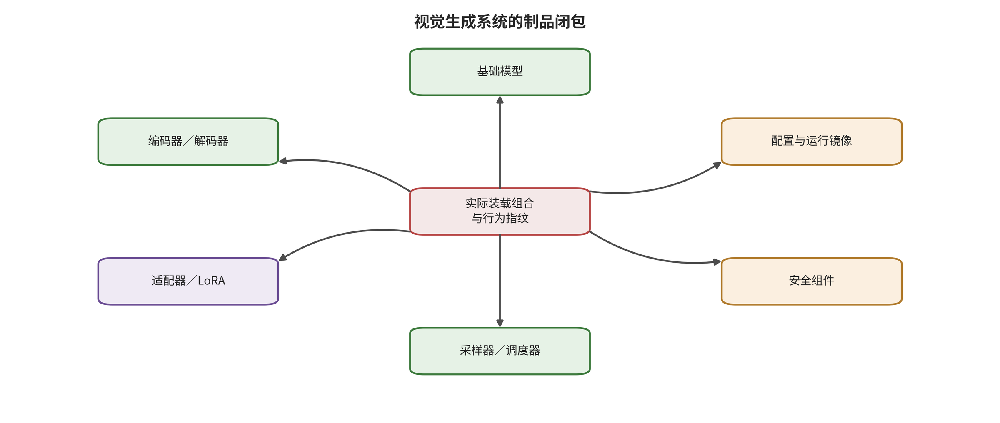

回滚和派生对象通知流程。

图像与视频共享数据、制品、条件和采样风险，但视频还拥有时间顺序、运动轨迹、音画身份与流式状态。这些差异决定第 9 章不能只检查一个模型文件，而要追踪数据、适配器和更新如何把异常固化进供应链；也决定后面的运行时与真实性控制必须以事件和时间窗口为单位。

\newpage

# 第 9 章　数据、模型与个性化供应链

一家创作团队从公共仓库下载“电影感角色 LoRA”，把它与内部基座模型、第三方变分自编码器（variational autoencoder，VAE）和运动模块组合。单独试用时，角色外观、画质和运动都符合预期；进入某类提示与相机轨迹组合后，短片却持续出现未授权标志。团队重新扫描主模型，没有发现异常，于是把问题归因于随机种子。真正的缺口在更早的位置：批准对象只是一个文件，实际运行对象却是一组数据、参数、代码、加载顺序和更新历史构成的制品闭包。

视觉生成供应链有三条彼此交织的路径。数据供应链决定模型学习了什么以及是否有权学习；制品供应链决定部署时真正加载什么；更新供应链决定谁能以何种数据和目标改变参数。攻击可能在其中一条路径起始，也可能借另一条路径传播。只有把三者分开记录，再在运行组合处重新验证，安全控制才不会被“基座模型已通过核查”这一局部事实误导。

## 本章总览

视觉生成的供应链同时穿过数据进入、制品装载和参数更新三个首破接口。本章先为图像、视频与音频素材建立来源、同意、去重、版本和撤回记录，再把基座模型、编码器、VAE、LoRA、运动模块、插件与容器收入同一个可重放的制品闭包。三条链在实际运行组合中汇合，所以安全判断的对象是整个闭包，而非某一个文件或界面上的模型名称。

围绕这个闭包，章节依次建立静态身份验证、最小权限、组合行为差分和发布撤回门。评价不只记录异常是否出现，还同时观察清洁效用、视频时间效用、资源成本与撤回是否真正到达缓存和派生对象。这些指标共同回答一个实际问题：平台能否识别当前运行的精确组合，限制其能力，并在失效后找到所有依赖对象。

## 原理铺垫：从单个文件走向可执行制品闭包

本章的对象是视觉生成系统在某次训练或运行中真正共同生效的制品闭包，而不是仓库页面上的一个模型文件。输入包括训练样本与授权记录、基座权重、编码器、VAE、低秩适配器、运动模块、插件代码、加载顺序、量化参数和更新配置；内部状态则是它们的版本、哈希、依赖边、可训练层、宿主权限与派生血缘。装载器按这些关系组装运行图，训练服务按更新范围产生新制品，闭包标识应随任何关键关系变化而变化。

闭包的输出消费者包括训练任务、个性化服务、推理容器、模型市场与生产发布别名。安全面因此分布在来源与授权、安全解析、组合编译、行为差分、灰度观测和撤回恢复，而不是集中在病毒扫描或主权重审核。签名可以回答谁发布及传输后是否改变，不能回答该发布者是否良性；单组件测试可以约束一个节点，不能代替实际组合的行为与权限测试。

正常例是平台只允许已登记的基座、编码器和适配器按固定顺序装载，组合摘要与测试回执一致，失效时能由依赖图定位所有调用者。边界例是每个文件单独表现正常，但特定 LoRA、VAE 与运动模块同时装载后才改变身份或时间行为；另一边界是仓库链接已删除，边缘缓存和派生权重仍能运行。前者要求组合差分，后者要求可验证的失效传播；“已签名”或“已下架”只描述局部状态，不构成完整安全结论。

## 9.1 三条供应链与一个制品闭包

为了让一次运行能够回指数据、制品、组合、更新和权限，本章把实际生成抽象为一个闭包元组。该表达不把不同对象压成同一文件，而是为后续版本比较提供固定字段，记为

\[
\Omega=(D,V,C,L,U,P),
\]

其中 \(D\) 是训练与更新数据血缘，\(V\) 是所有制品及其不可变版本，\(C\) 是组件组合图，\(L\) 是加载顺序、缩放、量化和转换参数，\(U\) 是后续训练或个性化更新，\(P\) 是运行权限。安全团队真正要批准的是闭包 \(\Omega\)，而不是界面显示的模型名称。只要闭包中的任一关键元素变化，原有测试结论就需要重新判断适用范围。

请从图中央的实际装载组合向外检查六类组件，确认哪些对象共同决定行为指纹，并特别注意采样配置与安全组件并不是主模型的附注。

图 9-1 支持把模型、适配器、编码器、采样器、安全组件和配置作为一个可重放批准对象，也支持在任一节点变化时触发组合复核。它不证明围绕中央的组件彼此独立，更不证明列全组件就已经安全；依赖、加载顺序、权限和动态行为仍需由实际执行记录与差分探针确认。

数据、制品和更新三个接口可以用“异常何时建立”区分。污染样本在进入训练集时已经越过授权或完整性边界，首破发生在数据；一个已经制作好的恶意编码器在被系统加载时建立异常状态，首破发生在制品；拥有合法训练数据的内部人员篡改损失或可更新层，首破发生在更新过程。运行时触发词只是激活位置，不一定是根因位置。

这种区分直接决定控制。数据问题依赖来源、授权、去重与隔离；制品问题依赖身份、签名、安全格式、依赖和执行权限；更新问题依赖训练配置、变更范围、独立验证、灰度与回滚。把三类问题都交给输入过滤器，会让最早的控制入口长期空缺。

### 闭包不是文件清单，而是可执行关系

两个工作流即使包含相同文件，只要加载顺序、缩放系数、量化方式或条件路由不同，就可能产生不同语义与时间行为。闭包需要保存组件关系：哪个编码器向哪个主干供给表示，哪个 LoRA 作用于哪些层，运动模块在空间模块之前还是之后加载，安全分类器观察原始输出还是转码结果。图结构比平铺清单更接近真实执行。

闭包还应包含权限。一个纯参数文件与一个可执行自定义节点即使来自同一仓库，也不应获得相同能力；推理插件需要 GPU 和临时目录，不自然需要读取密钥或访问公网；模型下载器需要仓库网络，不自然需要写入运行容器。把权限 \(P\) 纳入 \(\Omega\)，能让“行为异常”和“宿主能力越界”在同一评审中被看见。

运行标识应由闭包规范化表示生成，而不是依赖可变别名。若“latest”“推荐版”或前端模板可以在不告知调用者时指向新组件，旧测试便无法解释当前行为。生产日志同时保存面向人的版本名称和不可变闭包摘要，前者便于运营，后者用于重放、阻断和依赖查询。

### 三类首破可以组成一条链

三个接口彼此独立，却可能串联。攻击者先把样本送入开放数据源，异常被训练进适配器，适配器再以可信作者名义进入仓库，最终由个性化服务加载并生成。若只在最后看到触发条件，容易把整条链归为输入问题。根因记录应保留最早异常，事件响应则同时处理已发布制品、受影响闭包和仍在训练队列中的数据。

防守方也可能产生链式失效。数据团队记录了授权，但训练任务没有固化数据版本；模型团队签了模型检查点，却没有签依赖和配置；平台灰度了新闭包，却让旧验证报告继续显示“通过”。每个局部动作看似合理，组合后仍无法证明实际运行对象经过测试。供应链安全的核心不是文件更多，而是证据必须沿派生关系传递。

## 9.2 数据供应链：像素干净不等于来源可信

训练数据记录规范至少包含来源主体、取得方式、权利基础、允许用途、时间与地域范围、内容摘要、标签、版本、去重族、敏感属性和撤回状态。视频还需要片段边界、帧率、音轨、身份轨迹、动作标签、镜头关系，以及一段原始媒体被切成多少训练单元。没有这些字段，团队甚至无法回答一次删除请求应作用到哪批数据与哪些检查点。

数据完整性攻击不要求直接访问训练服务器。攻击者可以把经过设计的图文对放入公开网页，等待抓取、重描述和后续训练。Nightshade 将这种路径具体化为概念定向投毒：少量样本试图让某个概念附近的视觉对应发生偏移 [@VIS_P005]。它支持“开放数据入口可成为模型语义完整性的首破点”，却不提供跨所有语料规模、编码器和清洗管线的统一效果。评测必须绑定独立概念数、污染与清洁样本数、训练总量、模型版本、提示与种子、目标效果、非目标溢出和清洁生成能力。

授权失效与数值投毒不是同一个问题。样本可以没有任何像素异常，却来自未同意的主体，或超出原本允许的用途。Glaze 和 Anti-DreamBooth 从创作者风格与主体个性化角度展示了训练前主动保护的技术路径 [@VIS_P019; @VIS_P020]。这些机制在明确模型、预处理与扰动预算下提高未授权训练成本，不等于法律授权已经撤销，也不等于所有衍生检查点中的相关能力已经消失。技术摩擦、许可台账和救济流程承担不同职责。

### 视频数据为什么更难去重

一张图片通常有较清楚的文件边界，一段视频却可以被裁剪、变速、重编码、抽帧、去音轨和重新分镜。文件哈希不同的片段可能来自同一原始事件；相邻片段又高度相关，不能当成独立主体反复计数。去重需要同时考虑视觉内容、身份、音频、运动和时间对齐。

视频记忆也不仅是整段复制。对视频扩散模型记忆的研究区分内容记忆与运动记忆，提示模型可能复现外观、片段或可识别运动模式 [@VIS_A047]。因此最低验证单位至少包含帧、连续片段、整视频、身份和运动。常见动作相似并不能自动证明训练成员关系；确证仍需候选训练片段、重复程度、非成员对照、阈值和人工核验。

实用的数据门可以分成四步。进入时验证来源与许可；规范化后建立跨模态指纹和去重族；训练前把权利不明、高重复或敏感身份素材放入隔离区；训练后保留“样本族—数据版本—训练任务—检查点”的血缘。撤回请求随后沿血缘传播，团队能够明确哪些对象已停止使用、哪些已发布制品仍需风险评估，以及哪些结果当前无法消除。

### 从采集到训练批次的六个控制点

数据进入模型前通常经历采集、下载、解析、描述、过滤、去重和打包。每一步都可能改变证据。网页 URL 指向的内容会随时间变化，视频下载器可能选择不同码率，OCR 与自动描述会生成新的文本条件，内容过滤器会留下版本相关的判定，片段切分会把一个事件变成多个高相关样本。训练清单如果只保存最终路径，便无法解释这些派生过程。

第一个控制点是采集凭据，记录来源地址、获取时间、提供者和用途基础。第二个是内容摘要，保存规范化媒体摘要与感知指纹，区分字节相同和语义近重复。第三个是解析血缘，把原文件、帧、片段、音轨、字幕与自动描述连接起来。第四个是授权和敏感性标记，明确主体、未成年人、位置、声音和生物特征等高风险字段。第五个是去重族，避免一个原始事件因多次转码获得过高训练权重。第六个是不可变训练清单，使实际批次能够回指前五项。

这些控制既服务完整性，也服务隐私和授权，但三者判定不能混合。一个样本来源可信，仍可能没有当前用途许可；一个样本获得许可，标签仍可能错误；一个样本标签正确，重复过多仍会增加记忆风险。数据门应分别给出来源状态、授权状态、内容状态、标签状态、重复状态和处置决定。

### 标签与自动描述是可学习的控制信号

视觉训练常把自动描述、审核标签、身份名称、动作类别和时间摘要作为条件。攻击者不一定改变像素，只要让描述与媒体形成系统性错配，就可能让模型学习错误语义边界。安全数据管线需要检查跨模态一致性、标签来源和置信度，对高影响身份或行为引入抽样人工核验。

视频标签尤其容易压缩掉时间。把“人物站起、走向门口、返回座位”简化为“人物在房间中”，会丢失动作顺序；把跨镜头身份都写成同一个名称，可能掩盖身份切换；只标画面不标音轨，会让说话人和脚本关系难以追溯。时间描述应绑定片段和事件，而不是只给整文件一个静态句子。

### 数据投毒评测如何避免展示偏差

概念投毒评测应预先冻结概念集合、目标集合、污染比例、清洁对照、训练预算、模型版本、提示、种子和判定器。Nightshade 提供了概念定向语义破坏的研究支点 [@VIS_P005]，但工程测试仍要观察非目标概念、跨语言、清洁画质和数据清洗后的残余。挑选最明显的成功图片只能证明存在路径，不能估计典型请求风险。

视频数据实验还要按独立原视频和事件计数。一段素材即使切成 100 个相邻片段，在独立来源分母中仍计为一个原始来源；训练污染量、模型观察次数和评测独立单位分别报告。内容记忆与运动记忆使用不同相似性，并分别保留人工核验结果 [@VIS_A047]。

### 同意与撤回的工程语义

同意记录至少绑定主体、媒体、用途、接收方、训练或个性化范围、期限、地域、是否允许再分发和撤回入口。对数字人，还要拆分肖像、声音、脚本、动作和公开发布。主体同意生成内部培训视频，不等于同意开放模型学习其身份，也不等于同意任何用户调用。

撤回是一项状态转移，不是一个按钮文案。系统要记录撤回影响新的数据进入、后续训练、托管个性化、已发布适配器和既有媒体中的哪些对象；无法作用到的对象和原因同样要向责任人说明。主动保护研究可以提高未授权训练成本 [@VIS_P019; @VIS_P020]，却不承担这条组织与版本传播链。

## 9.3 制品供应链：安全对象是组合图

视觉生成制品包括主模型检查点、文本和视觉编码器、VAE、ControlNet、LoRA、运动与相机模块、音频生成器、安全分类器、调度器、自定义节点、推理插件、序列化对象、容器镜像和策略文件。每个对象都应记录发布者、来源地址、精确版本、哈希、签名、许可证、依赖、可执行代码、所需权限与核查状态。

编码器中的后门攻击（backdoor attack）说明为什么只验证主权重不够：这类攻击把异常映射绑定特定触发条件，并尽量保持清洁输入的表面能力，因此不同于普遍的画质或语义退化。Rickrolling the Artist 把隐藏语义映射放在文本编码器；条件由提示激活，但异常在编码器装载时已经存在 [@VIS_P003]。若安全团队把它归入“提示有问题”，就会不断扩充关键词表，却没有阻止不可信编码器进入运行环境。

LoRA 把参数更新压缩成便于传播的小型制品，也把组合风险带到普通工作流。MasqLoRA 展示了恶意行为可以保存在独立低秩适配器中，并研究其与其他 LoRA 组合时的表现 [@VIS_P006]。基座哈希仍然正确，适配器也可能在清洁提示上保持预期风格；只有触发条件或特定组合出现时，异常才显现。简单范数、文件大小和权重直方图因此不能替代行为测试。

签名的作用也必须准确表述。签名证明某个制品由持有相应密钥的主体发布，且传输后未被篡改；它不证明发布者良性，不证明许可证满足当前用途，也不证明制品与其他组件组合后仍符合行为要求。签名是身份与完整性的信任根，不是安全判决。

### 静态身份与动态行为的双门

一个可执行装载门至少包含静态身份和动态行为两层。静态层先回答对象是否来自获准主体、能否被安全解析、依赖与权限是否完整，并执行以下检查；这些结果只允许制品进入后续行为测试，不能单独签发生产权限：

1. 来源位于允许仓库，版本与哈希精确匹配，签名链和撤销状态有效。
2. 文件采用受限、安全的序列化格式；不可信自定义代码不与模型参数一起获得宿主权限。
3. 依赖闭包、许可证、基础镜像和漏洞状态可追踪；运行账户没有多余文件、网络和凭据权限。
4. 加载顺序、缩放、量化、合并与转换参数进入不可变配置。

动态层对“基座—组件—工作流—探针—种子”执行行为差分。探针既覆盖预期功能，也覆盖保密触发集、跨语言条件、身份与安全拒绝；比较加载前后语义、画质、异常溢出和稳定性。BlackMirror 从黑盒输入输出差异检查生成后门，为静态扫描提供了行为层补充，但其有效范围仍绑定具体模型与探针分布 [@VIS_R-A029]。

组合空间可能随组件数迅速增长，团队通常无法穷举所有排列。正确响应不是放弃组合测试，而是先用允许列表、最小权限和少数受支持模板压缩空间，再根据组件功能、共同影响层和发布者关系选择高风险组合。未经批准的自由组合可以在隔离环境中实验，但不应继承生产权限。

### 视频组件的非正交性

视频管线往往同时加载角色 LoRA、空间控制、运动模块、相机控制、时间解码、插帧、音频与量化插件。它们名义上职责不同，实际可能共同写入注意力、潜状态或时间表示。异常可能只在角色、运动与相机三个组件同时存在时出现，也可能在量化或转换后消失或显现。

图像 LoRA 的直接证据说明组合制品值得重点验证，却不证明恶意视频运动模块已经在不同主流基座上普遍成立。工程验证方案应把这一路径设为高优先级测试假设：对受支持组合做时间行为差分，报告动作、轨迹、镜头、身份和清洁效用；对未运行的组合明确保持未知。

### 制品清单需要达到组件级

软件物料清单用于回答包含哪些代码与依赖，模型物料记录还需要回答参数来自什么训练任务、兼容哪些基座、采用什么格式、是否含可执行对象、作用于哪些层以及声明用途。一个实用条目可以包含：唯一名称、发布者、仓库与提交、文件摘要、签名、基础模型、训练数据说明、许可证、依赖、入口函数、所需权限、支持的精度和已验证组合。

对转换后的制品，原始摘要不再适用。量化、合并、格式转换和分片会产生新文件，系统应记录父对象、工具版本、命令参数和新摘要。若转换由在线服务完成，还要记录服务身份与返回回执。这样发现转换工具缺陷时，团队能查询所有派生制品，而不是重新扫描整个仓库猜测来源。

### 安全序列化与执行隔离

模型文件可能只含张量，也可能借通用序列化机制触发对象构造或代码加载。入库策略应优先采用受限张量格式，把参数与自定义代码分离；确需代码时，代码作为独立软件制品进入审查和隔离。加载器拒绝未知对象类型、路径越界和隐式网络访问，错误消息也不应泄漏宿主目录或凭据。

隔离需要行为探针证明。允许探针验证必要权重读取、GPU 计算和临时文件；禁止探针验证秘密目录、宿主套接字、元数据服务、未批准网络和持久化路径不可达。探针通过只说明当前环境与配置，不证明模型行为良性，因此仍需要输出层差分。

### 组合测试如何控制爆炸

组合数无法穷举时，可以先按影响面分层。文本编码器、条件 LoRA 和提示模板共同影响语义；VAE、超分和色彩节点影响像素；角色 LoRA、身份编码器和面部修复共同影响身份；运动模块、相机控制、插帧和时间解码共同影响轨迹；量化、缓存与并行插件共同影响数值和资源。优先测试同一影响面的组合，再测试跨影响面的高后果路径。

组合选择还应考虑发布者与依赖相关性。同一作者发布的若干模块可能共享训练或代码失效；来自不同仓库的模块也可能依赖同一底层库。把“不同文件”当成独立来源会高估防线独立性。闭包风险记录应保留共同父对象、共同代码和共同签名者。

行为差分矩阵可以包含四个象限：单组件清洁、单组件保密探针、组合清洁、组合保密探针。每个象限跨若干固定种子，分别观察语义、身份、画质、时间、资源和拒绝。MasqLoRA 提示适配器组合需要独立评价 [@VIS_P006]，BlackMirror 则说明黑盒差异可补充静态特征 [@VIS_R-A029]；二者都不消除探针覆盖不足的剩余风险。

## 9.4 更新与个性化：谁有权改变哪些参数

训练或个性化服务应把更新权限整理为一份变更权限表：谁提交数据，数据属于谁，允许更新哪些层，使用什么目标和正则，训练多少步，输出何种制品，谁能下载或转让，何时失效，怎样回滚。上传权限只覆盖文件提交；被摄者身份使用、公开传播、商业代言和敏感语境生成分别取得明确授权。

扩散后门研究展示了训练更新可以建立“特定条件—异常输出”映射，同时在常规输入上保留表面效用。BadDiffusion、TrojDiff 与 BadT2I 的目标、数据、训练设置和判定方式不同，不能合并为一个通用成功率 [@VIS_P001; @VIS_P002; @VIS_R-A003]。合格评测应分别报告条件命中、目标语义、清洁语义、视觉质量、非目标溢出、跨种子稳定性和检测器误差。

概念擦除与再学习还需要更严格的对照。若要声称更新恢复了受限概念，至少应证明更新前该概念在固定评测集上确实不可达，等预算的清洁更新不会产生同样恢复，观察差异也不是判定器波动或条件表达变化。否则无法区分原有限制不完整、一般更新造成的能力漂移和有目标的恢复。

个性化尤其容易混淆正常能力与安全属性。DreamBooth 类机制以少量主体样本建立新标识与视觉身份的关联 [@GEN_dreambooth]。安全测试除了主体相似，还需观察背景泄漏、姿态与风格多样性、训练样本近复制、其他身份混淆、授权边界和撤回后的残留。相似度下降可能表示保护有效，也可能只是生成质量整体崩坏；必须同时报告正常任务效用。

### 视频更新的时间清洁效用

BadVideo 在特定文本到视频训练设置下展示了时空后门行为 [@VIS_P007]。视频评测由此至少要拆成空间清洁效用和时间清洁效用。空间部分检查帧质量、主体外观和背景；时间部分检查动作方向、事件先后、身份跨镜头持续、相机轨迹、闪烁、口型与音画同步。只报告若干帧的画质，可能把动作或事件层异常藏在平均值里。

视频训练还包含时间注意力、运动先验、相机控制、跨帧缓存、音频分支和长片段课程等可更新状态。每项更新需绑定实际检查点与日期。模型继续微调、蒸馏、量化或合并后，先前的“已通过”不能永久继承；验证结论必须沿版本血缘传播，并在关键变更处重新执行。

### 更新过程需要可观察边界

训练任务不应只留下一个最终模型检查点。最小回执包括初始模型、数据清单、可更新层、冻结层、损失、正则、优化器、训练轮次、随机状态、验证集、异常告警、产生的所有模型检查点和批准人。高风险个性化还要记录主体授权、输出下载权和服务端删除状态。

训练中可以监测梯度与激活异常、触发关联、清洁回放和安全集表现，但这些信号都不是后门不存在的证明。异常检测阈值可能漏掉低幅度、分布内行为，也可能把长尾主体当成离群点。训练后保密探针和运行能力门仍然必要。

更新权限应限制到任务所需层与步数。角色个性化通常不需要改变所有安全分类器和执行插件；安全对齐任务也不自然获得仓库发布权。将训练、签名、发布和生产别名更新分给不同主体，可以防止同一个内部账号改变参数后直接覆盖生产证据。

### 后门、安全策略或授权边界漂移与普通质量退化

三种现象需要不同判定。后门表现为条件特异的异常映射，并在清洁输入上尽量保持表面能力；安全策略或授权边界漂移表现为更新后原本应拒绝的主体、用途或内容被放行，或者原本允许的正常请求被系统性拒绝；普通质量退化表现为画质、语义或时间一致性普遍下降。BadDiffusion、TrojDiff 和 BadVideo 为条件异常提供研究案例 [@VIS_P001; @VIS_P002; @VIS_P007]，却不能把每次质量下降都归为后门。

诊断至少需要触发与清洁条件、更新前后、目标与非目标语义、多个种子和独立判定。若所有任务都变差，更可能是训练不稳或兼容问题；若只有一个判定器变化，需要检查判定器漂移；若异常稳定绑定条件且清洁能力保持，才更接近后门的条件特异行为。证据不足时，记录“异常原因尚未定位”，并保留多个候选归因。

### 版本传播与失效半径

检查点可能被蒸馏、量化、合并为 LoRA、导出到边缘设备或作为下游训练初始点。供应链图应记录这些子关系。发现父版本异常后，不能假设所有子版本都受影响，也不能假设转换已经清除异常；应先冻结传播，再按高后果和可达性测试派生对象。

失效半径包括仓库下载者、生产别名、边缘缓存、用户项目、下游适配器和已经生成的媒体。模型撤回解决未来装载，内容处置解决既有输出，主体通知与申诉解决现实权益。一个技术团队通常无法独自完成全部动作，因此运行手册要在事故前明确责任边界。

## 9.5 从入库到撤回的供应链门

六道门按责任合并为三个阶段，避免把连续控制误读成六条彼此独立的口号。每个阶段既要有进入条件，也要有可供下一阶段验证的退出回执。

| 阶段 | 包含的门 | 进入与处理 | 退出回执及证据上限 |
|---|---|---|---|
| 入库阶段 | 第一门“来源与授权”；第二门“安全解析” | 数据和制品进入受信环境前，确认主体、用途、许可、版本、哈希与签名；无法确认的对象进入隔离区。参数采用受限格式，插件代码在无秘密、无公网或受控网络、受限文件系统与资源配额下检查，并以允许和禁止行为探针验证执行隔离。 | 回执说明对象身份、授权范围、解析格式和宿主可达能力。“可下载”不等于已批准，扫描通过也不证明模型行为良性。 |
| 组合验证阶段 | 第三门“组合编译”；第四门“行为差分” | 系统把组件、加载顺序、缩放、量化、依赖和策略编译成不可变闭包标识；随后在批准的清洁任务和保密安全探针上比较基线与组合，分别观察异常目标、正常语义、画质、时间行为、成本和误报。 | 回执把每次运行绑定到闭包和探针版本，不把单一检测分数压成“安全/不安全”标签。未覆盖的组合保持未验证。 |
| 运行与失效阶段 | 第五门“灰度与观测”；第六门“撤回与恢复” | 新闭包只进入有限租户和有限能力范围，监测条件异常、身份错误、时间漂移、资源曲线与投诉；发生失效后，列表同时作用于制品、组合、数据版本和检查点，并追踪缓存、边缘副本、用户下载与衍生适配器。 | 回执分别证明灰度范围、实际装载阻断、依赖通知与恢复版本。发布别名不能遮蔽不可变版本，删除仓库页面也不等于所有副本失效。 |

六个门不应由同一服务账号和同一判断模型控制。仓库身份、执行隔离、行为评审、生产授权和撤回服务需要不同信任根，避免一个被攻破的组件同时伪造证据与批准自身。

## 9.6 工程工作例：模型插件市场的上线决策

某企业允许设计师从内部市场选择基座、角色 LoRA、风格 LoRA 和视频运动模块。平台过去按文件逐件扫描，然后允许任意组合。新运动模块的评审流程分为对象冻结、行为边界、静态与动态验证、灰度与撤回四个阶段，每个阶段都产生可供下一阶段消费的明确回执。

首先固定对象：模块哈希、发布者、训练说明、许可证、依赖和代码权限；列出 3 个支持基座、2 个角色 LoRA、量化与非量化两种路径。于是待评审对象不再是“一个运动模块”，而是有限的组合矩阵。

其次定义预期与禁止行为。预期行为包括提升指定动作连续性，并保持人物身份和脚本语义；禁止行为包括在未授权主体、保密条件集或特定组件组合下产生固定异常，访问宿主秘密，或让资源超出任务预算。视频效用按完整片段、动作和镜头评价，挑选帧只作局部观察。

随后执行两类检查。静态检查确认安全格式、依赖、最小权限和签名；动态检查在清洁条件、边界条件和保密组合探针上比较加载前后。每个结果绑定基座、组合、随机种子、片长、帧率和审核器版本。未运行的基座不写“兼容且安全”，只保持未验证。

最后设置发布与撤回。新模块先进入只生成、不自动发布的灰度能力域；异常告警可冻结装载，不依赖生成模型自评。若发现问题，失效列表按哈希阻断下载和运行，平台搜索含该模块的闭包、通知项目负责人并保留最小核查证据。业务可回滚到已批准闭包，并将停服保留为其他恢复路径失效后的处置手段。

### 上线检查表

在模型或组件获得生产权限前，评审人逐项确认下列对象、权限、组合与恢复事实。每一项都要绑定当前闭包与验证回执；未知项目不被自动解释为否定结果，而是转成隔离、灰度或能力收缩条件：

1. 数据来源、授权、去重和敏感主体字段是否有责任人？
2. 训练任务能否回指不可变数据清单和初始检查点？
3. 文件摘要、签名、许可证和撤销状态是否验证？
4. 参数与代码是否分离，加载权限是否经过允许和禁止探针？
5. 转换、量化、合并是否生成新的派生记录？
6. 闭包是否包含所有编码器、VAE、适配器、插件、容器与策略？
7. 单组件与组合清洁效用是否都经过固定分母测试？
8. 保密探针是否覆盖语义、身份、跨语言、时间与资源？
9. 视频是否报告动作、镜头、身份持续、音画与完整事件？
10. 灰度范围、告警责任、自动冻结和回滚目标是否明确？
11. 失效列表能否同时阻断下载与生产装载？
12. 是否能查询所有依赖闭包、派生制品和已生成媒体？

任何一项未知都不必自动否决低风险实验，但应限制能力与传播范围。高风险身份、自动发布或大规模分发需要更完整的证据。风险分级改变门槛，不改变未知项的存在。

### 事故演练：一个模块被报告存在条件异常

演练从冻结新装载开始，而不是立即删除证据。仓库保存文件摘要、签名和发布信息；平台查询所有含该摘要的闭包、生产任务和派生制品；模型团队在隔离环境用冻结探针重放报告现象；业务团队准备切换到最后批准闭包。未确认前限制传播，但不公开给模块作者定性。

若异常复现，团队确定最高观测层：只是目标媒体形成，还是已经交付、发布或被用于高风险业务。处置按层展开：制品进入失效列表，生产别名回滚，依赖项目获通知，相关媒体进入真实性与平台复核，受影响主体获得沟通渠道。若不能复现，也保留报告条件、版本差异和未知原因，并决定是否继续隔离。

演练的验收指标包括发现到冻结时间、闭包查询覆盖、回滚时间、依赖通知、误冻结、证据完整和恢复正常任务。只报告“模块已删除”无法说明缓存、用户下载和派生权重是否仍可运行。

### 五类研究案例的比较框架

| 案例 | 所需权限 | 首破位置 | 主要观察 | 证据支持范围 |
|---|---|---|---|---|
| Nightshade | 能影响后续抓取语料 | 数据 | 概念语义偏移与清洁效用 | 证据支持指定数据、模型与协议中的概念定向偏移；其他清洗流程需独立测试 |
| Rickrolling the Artist | 能让系统装载编码器 | 制品 | 特定条件语义重定向 | 证据支持编码器携带的条件重定向；主去噪网络是否改变需另行核对 |
| MasqLoRA | 能发布或装载适配器 | 制品 | LoRA 条件异常与组合行为 | 证据支持特定 LoRA 及其组合行为；视频运动模块需要单独实验 |
| BadDiffusion/TrojDiff | 能控制训练或检查点 | 更新 | 条件后门和清洁表现 | 证据分别支持各自训练协议中的条件后门；跨协议汇总需要共同单位与分母 |
| BadVideo | 能控制视频模型训练设置 | 更新 | 时空目标与正常视频质量 | 证据支持指定视频训练设置中的时空后门；商业长视频服务需要现场协议验证 |

比较对象是攻击入口、所需权限、传播位置与可部署控制。研究之间的模型、数据、攻击预算、独立单位和观察终点不同，这些差异构成效果量不可直接排序或汇总的原因。工程团队可以沿共同字段寻找控制位置，再用当前闭包、数据、正常任务和分母重新建立自身结果。

### 供应链责任矩阵

| 主体 | 必须提供的证据 | 不应独自拥有的权限 | 失效后的动作 |
|---|---|---|---|
| 数据提供方 | 来源、授权、版本、标签与撤回入口 | 直接更新生产检查点 | 更正、停止供给、通知受影响数据版本 |
| 训练团队 | 数据清单、配置、初始模型、检查点和验证 | 自签并直接覆盖生产别名 | 冻结训练、定位批次、提供回滚对象 |
| 组件作者 | 代码与参数摘要、依赖、兼容、许可证与用途 | 获取宿主秘密或任意公网能力 | 发布失效信息、配合重放和修复 |
| 仓库运营 | 身份、签名、扫描、下载和撤销记录 | 判断所有行为与法律用途 | 阻断分发、通知下载者、保全回执 |
| 平台评审 | 闭包、行为差分、正常效用与灰度结果 | 改变原制品后仍沿用旧证据 | 冻结闭包、回滚、启动依赖查询 |
| 业务所有者 | 场景、主体授权、后果和发布范围 | 绕过制品与能力门 | 限制业务、通知主体、恢复安全流程 |

责任矩阵让“谁签名”与“谁判断”分离。数据提供方不能证明训练实现忠实，仓库不能证明任意组合良性，模型团队不能替业务主体授予身份用途。证据在角色间传递，批准则由具有相应后果责任的主体作出。

### 供应链指标不止漏洞数量

数据侧可以报告来源可追踪比例、授权未知比例、去重族集中度、撤回传播时间和训练批次可重放率；制品侧报告不可变版本覆盖、签名与撤销验证、安全格式覆盖、闭包完整率和行为差分覆盖；更新侧报告配置回执、保密探针、灰度范围、回滚成功和衍生对象查询覆盖。

运行指标还包括异常发现到冻结、冻结到回滚、依赖通知、误冻结、正常任务恢复与未能定位对象。漏洞数量受扫描范围和报告文化影响，不能单独代表安全成熟度。可追踪、可阻断和可恢复更接近供应链失效时的实际能力。

### 组件闭包与派生图演练

在本地隔离环境中建立一个合成工作流：基座、文本编码器、VAE、两个普通 LoRA、一个运动模块和一个自定义后处理节点。为每个对象记录摘要、来源、依赖、格式、权限和兼容，生成闭包标识。再执行一次受控量化或格式转换，创建带父关系的新制品；实验不训练真实攻击，也不连接生产账号。

第一阶段验证静态门：未知摘要、过期签名、未声明代码、越权网络和错误基座应被拒绝。第二阶段在固定清洁提示、主体、种子和视频任务上运行行为差分。第三阶段模拟一个组件失效，把它加入失效列表，查询包含它的闭包、转换子对象和项目，并回滚到批准版本。

实验报告分别记录“文件被发现”“运行被阻断”“依赖被定位”“业务已恢复”。失效列表只阻止新下载而本地缓存仍能装载时，分发控制是当前完成层；派生图缺失转换关系时，处理范围限定为已定位的子对象。每个观察绑定实际执行回执。

### 组合身份漂移的调查过程

某视频团队发现角色 LoRA 与运动模块组合后，身份在第三个镜头出现漂移，而单组件测试均保持正常。团队先冻结基座、两个组件、加载顺序、缩放、量化、种子、片长和审核器版本，并把独立视频而非镜头或帧设为主要分母。随后只改变一个因素进行配对运行：先交换加载顺序，再比较缩放和量化，最后跨固定种子检查漂移是否稳定。每次运行同时保存空间身份、时间持续、动作质量和资源成本，使普通质量下降、兼容冲突与条件特异异常具有不同的观察模式。

调查继续回到训练与转换血缘。角色 LoRA、运动模块和量化制品分别关联训练数据版本、初始检查点、转换工具与父对象；组合异常只在量化子对象出现时，处置范围先限定在该派生分支；若多个父版本都出现相同条件异常，再扩大到上游组件。灰度系统暂停含可疑对象的新闭包，已批准闭包保持可回滚，通知范围按实际依赖查询结果确定。这个过程把每项观察连接到对应对象，避免由单个镜头直接归因整个模型家族。

同一团队随后处理主体撤回授权。传播图从原始素材连接到片段、描述、数据版本、训练任务、检查点、LoRA、生产闭包、缓存和已生成媒体，每条边都有责任人、可执行撤回动作、不可逆状态和验证探针。尚未训练的数据停止进入批次，托管个性化制品失效，生产闭包停止装载，缓存以主体与版本负向探针确认清理；已经交付的媒体则进入用途限制、通知与救济流程。撤回由此成为跨对象的状态迁移，而非仓库页面上的单一按钮。

### 采购与外部模型接入要求

企业采购闭源模型或托管生成服务时，即使无法取得完整权重和训练数据，也可以要求四类可验证证据。版本承诺说明模型、审核器、策略和高影响依赖如何标识，哪些变化触发重新验收；数据用途说明提示、参考媒体、生成结果、人工查看、训练使用、缓存与删除后的保留状态；运行回执覆盖租户隔离、个性化制品持有者、输出来源信号、错误路径和撤回结果；通知时限规定重大版本变化、数据用途变化和安全事件从发现到客户获知的最长时间。

供应商自述可以支持其声明存在，客户侧探针则验证运行行为。客户使用获授权素材测试租户隔离、撤回、版本变化、输出交付、缓存和错误路径；采购条款应规定重大模型、审核器和数据用途变化的通知时限。无法提供内部细节时，外部行为、服务回执和责任时限更为重要。

开源或开放权重接入则拥有更多静态检查能力，却缺少中央运营者强制撤回。企业需要自管仓库镜像、摘要允许列表、依赖、许可证、行为差分和失效信息订阅。可读权重不自动等于可证明训练来源，能够本地运行也不自动等于获得任意商业或身份用途。

采购决策最终应绑定场景。只读创意沙盒可以容忍更多未知，但不能持有生产账号；自动品牌发布、真实人物数字人和高风险业务要求更强的版本、授权、通知与回滚。对未知项的处理方式是限制能力和传播，而不是在表格里把未知填成“通过”。

## 9.7 判断边界速查

| 容易作出的判断 | 应改成的工程判断 |
|---|---|
| 公开数据就是可任意训练的数据 | 可访问性、许可、主体同意和允许用途是不同字段。公开出现的肖像或声音不自然授予个性化、敏感语境生成或公开代言权限。 |
| 主模型通过核查，插件只影响风格 | 编码器、LoRA、VAE、运动模块和自定义节点都能影响语义或执行路径。组件名称是声明，不是能力边界；运行组合需要独立验证。 |
| 签名和恶意制品互斥 | 恶意发布者同样可以签名。签名解决来源和传输完整性，行为差分与最小权限解决另一部分风险。 |
| 清洁画质保持就表示清洁效用保持 | 语义遵循、身份、跨语言、动作、镜头、音画同步与安全拒绝都可能漂移。画质只是正常效用的一部分。 |
| 撤回链接等于撤回能力 | 缓存、已下载副本、衍生权重、部署别名和下游组合仍可能保留异常。撤回需要版本血缘、失效列表、依赖通知和装载探针。 |

## 9.8 带入实际系统

一家企业模型市场接收基座、编码器、VAE、LoRA、运动模块和自定义节点。仓库在入库时保存发布者身份、来源地址、许可证、文件摘要、签名、依赖、代码权限和撤回状态；训练制品还连接不可变数据清单、初始检查点、可训练层与配置回执。含人物和声音的视频素材按原始事件建立去重族，裁剪片段、转码文件、字幕和自动描述都保留父关系，主体授权则分别约束训练、个性化、公开传播和商业使用。

一个候选组件取得测试资格后，平台用受支持基座和组件模板生成有限闭包矩阵。静态检查负责格式、依赖与宿主权限，动态差分负责清洁语义、身份、动作、镜头、音画、资源和保密条件；单组件与组合结果分别保存。运行标识包含加载顺序、缩放、量化、种子、片长、帧率和策略版本，因此第三个镜头的身份漂移可以回到具体闭包，而不会被持续变动的“最新”别名遮蔽。

通过验证的闭包先进入只生成、无自动发布能力的灰度域。仓库身份服务、隔离执行环境、行为复核、生产授权和撤回服务使用不同账号与信任根。业务所有者只批准符合主体授权和场景用途的闭包；平台把生成、下载和发布拆成不同能力。正常效用、误拒、资源、投诉和条件异常按实际运行版本持续记录，重大版本或数据用途变化触发重新评估。

组件失效时，失效列表同时作用于新下载和生产装载，依赖图查询所有闭包、量化或合并子对象、项目缓存与已生成媒体。业务回滚到最后批准闭包，仓库通知下载者，主体授权团队处理派生媒体，运营人员用负向装载探针确认旧对象已无法运行。最终回执分别说明文件已识别、运行已阻断、依赖已定位、通知已发出和业务已恢复，使供应链响应由一组可观察状态组成。

## 小结：批准一个闭包，而不是相信一个名称

数据供应链决定学习对象与授权，制品供应链决定部署对象与执行权限，更新供应链决定参数如何持续变化。三条路径在运行时汇合为可重放的制品闭包。来源、签名和静态扫描建立身份基础，安全解析限制执行能力，组合行为差分观察条件异常，灰度与撤回控制传播范围；

---

[← 返回目录](index.md)
