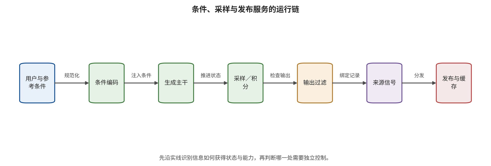

没有任何一层可以单独完成全部任务。

供应链控制减少了被固化进模型或组件的风险，却不能解决合法模型在运行时接受恶意条件、泄漏训练记忆或被资源与缓存机制滥用的问题。第 10 章把观察点移到一次请求内部，追踪条件如何穿过编码与审核，采样如何保存状态，以及黑盒反馈怎样变成攻击预算。

\newpage

# 第 10 章　条件、采样、隐私与生成服务

一个图像到视频服务收到三项输入：一张普通人物照、一句没有明显风险的动作描述和一条相机轨迹。三项条件分别通过审核，生成器却在中间数秒补全出未获授权的事件。若平台只记录“文本已通过”和“首帧合规”，便会把联合条件产生的语义归为偶然；若只记录最终拒绝，又会掩盖生成器已经形成目标事件以及审核究竟在哪一层起效。

运行时安全的难点正是这种阶段差异。条件并非一个字符串，而是由文本、图像、视频、音频、掩码、深度、姿态、边界帧、轨迹、历史和随机状态组成的控制面。采样过程又引入查询反馈、训练记忆、缓存、队列和计算预算。要判断攻击是否成功，必须分别观察条件进入、生成完成、风险形成、输出阻断和实际交付，不能让一个攻击成功率覆盖整条链。

## 本章总览

一次视觉生成请求会同时携带文本、图像、视频、音频、掩码、姿态、轨迹、历史和随机状态。本章把这些条件收入带类型、来源、授权和允许影响范围的结构化对象，再跟踪它们怎样经过黑盒语义搜索、多模态组合与视频时间补全改变生成轨迹。条件通过、目标形成、输出复核和内容交付分属四个分母，任一环节的结果都需要保留自己的证据位置。

采样还会暴露训练数据记忆、成员推断、近似缓存边界和资源占用。这四类问题使用不同的分母、攻击预算和结果对象，因而后文分别定义评测口径。最后的分层控制将输入接受、生成中检查、输出处置与实际交付分开，同时记录正常效用、延迟、成本和恢复能力，使运行门在阻断风险时仍然有可观察的业务代价。

## 原理铺垫：一次请求怎样变成有状态的生成会话

本章的对象是从条件提交到内容交付的一次有状态生成会话。输入不只是提示词，还包括参考媒体、掩码、姿态、轨迹、历史、随机种子、租户身份、授权字段和资源预算；内部机制先把各条件规范化并编码，再由采样器沿离散步或连续路径更新生成状态，同时维护查询账本、队列、缓存键、风险判定和取消状态。生成结束后，解码器、过滤器与发布服务继续改变可见媒体及其可达范围。

输出的消费者分为预览界面、下载服务、编辑任务、公开发布账号和下游自动系统，它们需要的权限并不相同。安全面因此包括低完整性条件覆盖授权、多模态组合形成新语义、黑盒反馈支持自适应搜索、近重复输出泄露训练信息、缓存跨越租户或策略边界，以及高成本任务挤占队列。输入通过、风险内容形成、输出被阻断和媒体实际交付必须使用各自分母，不能压成一个成功率。

正常例是人物参考图只影响已获准的外观字段，缓存键同时绑定租户、策略与主体授权，预览通过后仍需独立发布批准。边界例是文本、图像和相机轨迹分别合规，联合后却在视频中补出未授权事件；另一个边界是审核已拒绝最终下载，但中间预览此前已把片段返回用户。前者要求组合语义与生成中观察，后者要求阶段化交付证据，且最终拒绝不能反推整条运行链从未形成风险。

## 10.1 条件是控制面，不只是提示词

为了区分各模态的来源、授权、有效期与允许影响范围，本章将一次生成请求展开为带类型的条件向量，而非压成一个提示字符串；缺失字段保持未知，不由模型自行补成权限：

\[
c=(c_{txt},c_{img},c_{vid},c_{aud},c_{mask},c_{pose},c_{traj},c_{hist},c_{seed}).
\]

各分量分别表示文本、参考图、参考视频、音频、掩码、姿态、轨迹、历史状态与随机种子。ControlNet 一类接口说明，深度、边缘或姿态能够作为独立结构条件进入生成过程 [@GEN_controlnet]。在生产系统中，条件还应带元数据：来源主体、租户、完整性、授权用途、有效期和可影响变量。相同像素若来自用户本人、公共网页或企业素材库，其权限并不相同。

条件类型化的核心目的，是阻止数据自然升格为策略。参考图可以提供主体外观，却不能改变平台的身份授权规则；边界帧可以约束起点与终点，却不能证明中间动作已经获准；历史编辑可以帮助保持连贯，却不应把旧会话的敏感权限带入新任务。若系统把所有输入拼成一段统一嵌入而不保留来源与用途，后续审核器就很难知道某个语义来自谁以及是否有权影响输出。

同一请求在进入队列、形成媒体、经过输出处置和实际交付时对应不同对象与分母，因此运行时链拆为四个观测门；各门保存自己的进入数量、退出状态、不可判定项和责任控制：

1. **C0 条件接受**：预审核是否允许请求进入生成队列。
2. **C1 生成形成**：模型是否完成生成，并在媒体中形成目标语义或事件。
3. **C2 输出处置**：后审核是否识别并阻断、降级或转人工。
4. **C3 实际交付**：用户、平台或外部系统是否真正取得内容。

这四个门的分母可能不同。100 个输入中，80 个进入队列，70 个生成完成，5 个形成目标风险，4 个被阻断，1 个被交付。报告必须保留每一级计数及不可判定项；“1/100”表示最终交付比例，“5/70”表示生成完成请求中的风险形成比例，四个有效阻断则单独记录。数字只有绑定对象和层级才具有工程意义。

请沿图从用户与参考条件读到发布缓存，标出条件编码、生成状态、采样、过滤、内容来源与处理历史以及权限检查分别在哪一步产生或消费状态。

图 10-1 支持把提示审核之外的随机种子、采样状态、过滤器、内容来源与处理历史、缓存键和发布权限纳入同一次请求的运行记录，也支持为各阶段设置独立分母。它不证明图中的过滤或来源信号足以阻断风险，结构连通也不等于控制有效；每个门仍需用允许、拒绝、过期、跨租户与恢复探针验证。

### 条件编译器：在模型之前保留语义来源

生产系统可以在条件进入模型前设置一层条件编译器。它不负责判断所有媒体风险，而是把原始输入转成有类型的任务对象。例如，人物参考图产生“主体外观”字段，授权服务产生“允许用途”字段，文本解析产生“动作和场景”字段，相机轨迹产生“镜头控制”字段。模型接收编译后的允许字段，不能从自由文本中覆盖授权状态。

条件编译的输出可以写成三元组 \(\kappa=(v,p,o)\)：\(v\) 是规范化值，\(p\) 是来源与完整性标签，\(o\) 是允许影响的变量集合。相同的“某人姓名”来自已验证身份令牌与来自网页 OCR 时，\(v\) 也许相同，\(p\) 和 \(o\) 应不同。模型可以用网页内容回答信息，却不能用它授权人物代言或公开发布。

编译器还要显式处理冲突。用户文字要求一个动作，参考视频暗含相反动作，品牌策略又禁止该场景时，系统不能由最后拼接顺序决定优先级。高完整性策略和主体授权优先于普通内容；无法解析的冲突进入降级或人工路径。冲突处理规则属于外部策略，不应隐藏在生成模型的自然语言判断里。

### 条件状态的写入、读取与失效

条件可能只在一次请求中存在，也可能写入模板、项目历史、个性化档案或缓存。每个写入点都需要用途和期限。一次已授权人物参考图不应自动进入团队公共素材库；一个项目的负面提示不应跨租户复用；撤回身份授权后，旧会话继续持有的条件令牌应失效。

读取策略同样需要最小化。生成器只读取完成任务所需字段，输出审核器读取媒体与必要上下文，发布服务读取批准摘要与账号，不必让每个组件看到原始敏感素材。减少可读面既降低泄漏，也让日志和责任更清楚。条件失效还要通过探针验证：系统可以构造已过期令牌、错误租户、撤回主体、策略版本变化和媒体摘要变化，确认缓存、生成与发布分别拒绝；界面显示“授权已撤回”不等于后端所有派生状态已经不可用。

### 攻击预算应成为会话账本

黑盒条件攻击的能力来自查询、反馈和时间。会话账本至少记录独立条件、规范化后的相似族、生成次数、失败请求、审核反馈、账号关联、等待时间、费用和中间预览。若只按完全相同字符串限速，攻击者可以用同义表达或跨模态变体绕开；限速规则还要联合账号关联、相似族与异常反馈，并为正常创意迭代保留合理预算。

更合适的控制是按风险相关性调节反馈。低风险任务可以返回详细创作建议；反复靠近高风险主体—动作组合的请求减少中间信息、增加等待或转人工。限制的目标是提高适应性搜索成本并保护服务，而不是惩罚表达方式。效果报告同时给出攻击查询变化、正常迭代完成率、延迟和申诉。

### 阶段分母的完整记录

除了 C0—C3，还应记录生成失败、超时、不可判定和人工转交。生成失败不能从分母中静默消失，因为某些条件可能系统性触发失败，从而形成可用性问题；不可判定不能算安全成功或攻击失败；人工转交要记录最终决定与等待。每级分母都能从前一级追踪，却不要求简单相等。

阶段记录还能识别防御位置。若大量风险条件在 C0 被阻断，输入控制有效，但要观察正常内容过拒；若风险媒体在 C1 形成而 C2 阻断，说明后果门有效，上游仍需改进；若 C2 已告警而 C3 仍交付，问题位于授权或执行，而非审核模型本身。

## 10.2 语义搜索怎样绕过字面规则

输入过滤常假设危险意图会以固定词汇出现。生成模型实际消费的却是编码后的语义表示，字面相近不必然表示嵌入相近，字面无害也可能在组合后保留目标语义。黑盒攻击者不需要读取梯度，只要能反复提交条件并观察接受、拒绝或输出，就可能把系统反馈变成搜索信号。

SneakyPrompt 研究了利用黑盒查询反馈寻找替代表达的路径 [@VIS_P008]。这项证据支持“接受/拒绝接口会泄漏可用于适应的信号”，但效果绑定目标模型、过滤器、查询预算与判定规则。一次偶然通过证明存在路径，不给出总体脆弱率；零次通过也只说明当前预算和样本下未观察到成功。

防御不能停在扩大禁词表。更稳妥的做法是同时控制语义、预算和能力：输入层规范化编码并识别同义和跨语言意图；会话层关联变体查询，限制低成本迭代；生成层对高风险能力降级或分段检查；输出层独立观察生成媒体；交付层依据主体授权和用途作最终决定。不同层应尽量使用不同信任根，否则攻击者只需适应同一个判定边界。

### 多模态组合不是风险分数相加

文本与图像条件各自通过，并不推出联合嵌入合规。MMA-Diffusion 对文本与图像条件的联合操作说明，多模态攻击面会因组合语义而扩展 [@VIS_P009]。攻击者可能把主体放在参考图中，把动作放在文本中，把场景或时间提示放在掩码和轨迹中；任一模态单独看都缺少完整意图，生成器却会把它们合成为一个事件。

联合审核也不能简单取两个分类器分数的最大值或平均值。需要先建立组合问题：“谁”来自哪项条件，“做什么”来自哪项条件，“在何种场景与时间”由谁控制，主体是否授权该用途。工程上可以把条件解析成结构化意图图，再由外部策略判断允许的主体—动作—场景组合。若解析不确定，高影响任务进入人工复核或低能力模式，而不是让生成器自己解释并批准。

JailbreakDiffBench 把提示审核与图像审核拆开比较，支持阶段化评测 [@VIS_R-A030]。研究结果仍受模型和审核器版本限制，不能据此宣布某一过滤方式在所有服务上更强。它的工程价值在于提醒团队：同一请求在输入与输出处是两个不同对象，应分别记录误报、漏报和正常效用。

### 四类条件控制规避

运行时规避可以按利用的差距分成字面—语义差距、模态—组合差距、条件—输出差距和单轮—会话差距。字面—语义差距利用字符串规则与编码语义不一致；模态—组合差距把主体、动作和场景分散在文本、图像或音频；条件—输出差距让输入看似合规，却依赖生成器补全出目标事件；单轮—会话差距则把多次请求、编辑和延展组合成最终媒体。

四类规避可能共存。攻击者先用语义变体让文本进入队列，再用参考图补齐身份，随后通过多轮编辑延展出事件。若平台只给每轮一个二元标签，最后一轮看似只是普通局部编辑。追踪记录需要保存派生关系和完整时间线，在关键交付前重新评价组合结果。

### 自适应攻击与静态测试集

静态测试集衡量系统对已知输入的表现，自适应攻击则观察防御结果并选择下一次条件。SneakyPrompt 表明黑盒反馈可以支持替代表达搜索 [@VIS_P008]。部署评测至少设置两个阶段：先在冻结集上比较版本，再让红队在固定总预算内根据反馈适应。两个结果不能合并，因为攻击能力不同。

自适应测试需要停止规则。达到查询、费用、时间或高风险输出阈值时停止；观察到可能涉及真实主体、未成年人或可复用服务弱点时隔离证据并通知责任人。报告保留攻击策略类别和预算，不公开能直接搬用的高危载荷。这样既能验证适应性，也不把研究过程变成滥用指南。

### 多模态条件的责任矩阵

| 条件 | 主要提供者 | 可允许影响 | 不应自然获得 | 最小验证 |
|---|---|---|---|---|
| 自由文本 | 用户或上游智能体 | 题材、描述、一般动作 | 身份授权、平台策略、支付或发布权 | 语义与跨语言、来源标签 |
| 参考图 | 用户、素材库 | 构图、主体外观、风格参考 | 敏感语境、公开代言、跨项目保存 | 主体许可、近重复与用途 |
| 掩码/深度/姿态 | 编辑器或视觉工具 | 空间区域、结构、姿态 | 越出编辑范围的语义权限 | 类型、范围与边界条件 |
| 边界帧/参考视频 | 用户或前序任务 | 起止状态、运动参考 | 整条中间轨迹的批准 | 事件级补全检查 |
| 音频/脚本 | 主体、编辑者 | 节奏、说话人、内容 | 肖像权、公开渠道、交易指令 | 说话人、脚本、音画和渠道 |
| 历史与模板 | 项目系统 | 连贯性和复用配置 | 跨租户数据、过期授权 | 写入门、期限、租户和撤回 |

矩阵的价值是把“多模态审核”拆成责任问题。模型可以帮助识别条件内容，却不能凭自身输出创造缺失授权。任何高影响允许范围都应来自可验证主体和外部策略。

### 条件冲突的工作例

一个品牌项目使用已授权产品图和人物图，文本要求“人物展示产品”，历史模板却包含另一品牌的相机与口播脚本。条件编译器发现品牌、脚本和主体许可不一致，将历史模板降为不可执行建议；生成器仍可使用一般镜头语言，但不能读取旧项目的品牌或账号字段。若用户确认新脚本，系统生成新的批准对象，而不是直接更新旧模板。

这个工作例展示了状态污染与普通创意复用的边界。防御不是禁止所有模板，而是保留来源、项目和可影响字段；正常用户仍可复用镜头结构，敏感身份与发布信息不会随模板漂移。

## 10.3 视频条件控制的是轨迹

图像条件主要约束单个空间对象，视频条件还约束状态如何随时间变化。边界帧、参考视频、动作模板、相机路径与音频脚本会共同决定中间轨迹。系统若只审核输入时可见的边界，便把最重要的事件生成交给模型而没有独立控制。

Two Frames Matter 展示了首尾状态单独通过时，中间补全轨迹仍可能形成目标事件 [@VIS_LN05]。这里的首破点不是某一帧本身，而是系统把“边界合规”错误当成“路径合规”。可执行控制包括：联合审查边界条件；在生成过程中按窗口观察动作与身份；完成后按事件边界检查整段；高风险轨迹在交付前要求主体或责任人确认。

文本到视频红队还必须把时间作为判定维度。T2VSafetyBench 要求根据实际生成视频而不是原始提示评价，并区分自动与人工判断 [@VIS_P034]。优化式视频越狱与时间感知红队研究进一步表明，提示搜索、时间语义和视频输出是不同环节 [@VIS_R-A023; @VIS_LN04]。这些工作采用的模型、片长、审核器和预算不同，其比例不能直接合并。

最低视频条件记录规范至少记录：模型与策略版本、片长、帧率、分辨率、镜头数、条件模态、主体授权、查询预算、生成完成状态、风险首次出现时间、持续时间、输出处置和最终交付。评测单位包括帧、连续窗口、镜头、整视频与事件。相邻帧高度相关，不能作为独立样本重复增加统计把握。

### 从图像条件到视频的主动保护

参考图可能属于创作者、产品或真实人物。PhotoGuard、I2VGuard、Anti-I2V 与 VPA-Guard 分别从图像编辑、图生视频和视觉提示保护等方向增加未授权使用成本 [@VIS_P018; @VIS_R-A025; @VIS_R-A026; @VIS_R-A027]。这些方法的有效性取决于基座、预处理、扰动预算与正常动画需求。

主动保护不能替代授权门。若防守扰动使合法编辑也完全不可用，系统只是以破坏正常效用换取局部阻断；若平台在上传时根本不核验主体权限，技术保护失效后也没有后续控制。合格评测应同时报告保护前后感知质量、合法生成效用、主体或风格相似、动作质量、跨模型与跨预处理表现，以及防守方成本。

### 轨迹安全需要状态约束

视频生成器不仅选择每帧外观，还隐式选择状态转移。对高风险任务，可以定义允许状态集合 \(\mathcal{E}\) 和允许转移集合 \(\mathcal{M}\)。身份、位置、动作、镜头与音画关系落在 \(\mathcal{E}\) 中，相邻窗口之间的速度、方向、事件先后和主体连续落在 \(\mathcal{M}\) 中。生成结果只有同时满足状态与转移约束，才进入交付评审。

允许集合按场景后果分级：开放创作保留较宽的剧情空间，同时执行主体授权和内容策略；产品广告增加品牌、脚本与声明约束；工业模拟增加物理边界和对象关系；真实人物数字人增加身份、音画和发布渠道。风险越高，允许集合越具体。

轨迹检测也有失败条件。视觉跟踪可能在遮挡和镜头切换时丢失身份，动作识别可能受帧率与文化语境影响，音画同步可能把合法配音误判。系统应允许“不确定”，并由后果门决定降级、重生成或人工复核，不能把不确定默认映射为通过。

### 视频条件评测矩阵

一个完整矩阵至少交叉六个轴：文本直接度、参考媒体类型、边界帧关系、片长与镜头、主体授权、模型与策略版本。每个单元固定提示、主体、种子和生成数，记录条件接受、生成完成、事件形成、首次风险、持续时间、输出阻断和交付。清洁集包含复杂动作、跨语言、合法配音和创意剪辑，避免审核器通过拒绝所有复杂视频获得高表面安全。

指标不应只取窗口分数平均。事件召回回答风险事件是否发现，定位交并与时间误差回答位置，首次告警回答实时性，最长未检风险段回答持续暴露，身份轨迹错误回答跨镜头一致，正常拒绝与等待回答代价。不同指标服务不同决策，不能先加权成一个没有解释的总分。

### 生成中控制与最终审核的分工

生成中控制适合提前中止明显越界、限制资源和减少高风险媒体完整形成；最终审核适合观察完整事件、叙事与音画。中间控制若误报，会浪费部分计算并损害正常任务；最终审核若才发现问题，计算已经消耗且中间预览可能泄漏。产品需要明确中间预览是否交付、多久保存以及是否进入缓存。

在分段视频中，每个片段通过不推出拼接后的叙事通过。导出门应对完整时间线重新评价，并检查片段顺序、配音和来源派生。流式系统无法等待结束，则使用滑动窗口和事件状态机，并在不确定时切换安全画面或降低传播，而不是继续积累风险。

## 10.4 采样输出可能泄漏什么

生成模型可以在参数中保留训练数据的某些特征。训练数据提取以一组条件或查询寻找与训练实例近似、可识别对应的输出。针对图像扩散模型的研究展示了在明确威胁模型和查询预算下提取训练样本的路径，并讨论重复数据与去重 [@VIS_P024]。这不意味着任意相似图片都证明训练成员关系。

确证至少需要五项证据：候选训练实例可定位；输出与候选达到预先定义的近重复关系；成员与非成员对照使用同一协议；人工核验不只挑选成功展示；查询数、种子和筛选成本完整计入预算。若训练集来源未知，只能说输出与外部候选相似，不能自动说它被模型记住。

训练数据提取、成员推断和模型提取也不能共用一个“隐私成功率”。前者按独立训练实例和查询计，成员推断按成员/非成员样本计，模型提取按查询预算与代理任务保真度计。它们的后果也不同：得到一张近重复媒体、推断某人可能在训练集、构建行为相似的代理模型，需要不同控制与通知。

视频增加了内容记忆与运动记忆。模型可能不复制完整文件，却在若干帧中重现身份和背景，或复现特有动作模式。相关研究明确区分了这两类记忆 [@VIS_A047]。整段平均距离会稀释短泄漏，单帧相似又可能把常见场景误判为记忆。因此应结合帧、片段、运动、音频和身份证据，并报告训练片段重复、授权和非成员基线。

隐私防御沿生命周期展开：训练前进行跨模态去重和敏感身份治理；训练中监测记忆与近复制；输出端对高风险身份、帧、片段和运动做近重复检索；服务端关联查询、限制速率与候选反馈；事件端为主体提供查验、通知与删除入口。阈值越严，合法的常见构图和动作越可能被误拦，正常效用与人工复核成本必须同时计量。

### 从“看起来相似”到“证据支持记忆”的阶梯

隐私主张可以分成四类证据。相似观察证据只记录输出与公开媒体的相似关系；候选近重复证据在候选训练集合中找到近重复，并用冻结阈值与人工核验确认；成员差异证据加入成员与非成员对照，显示候选具有异常关联；血缘归因证据依据明确的数据血缘与查询预算连接训练成员和模型输出。每类证据都有自己的对象与分母，结论范围随证据类型逐级增加。

图像训练数据提取研究为高等级证据提供了协议范例 [@VIS_P024]，但生产服务往往不公开训练清单，实际调查可能停在较低级。此时平台仍可采取谨慎处置，例如限制传播、联系权利人和保全证据，却不能把尚未建立的训练归因当成确定事实。

视频阶梯再增加时间对应。候选可能只在连续片段或运动上相似，需处理裁剪、变速、镜像、转码和去音轨。帧级匹配、片段级匹配、运动级匹配与身份级匹配分别给出结果，只有证据共同指向同一候选时，归因才更强。严格阈值仍需报告真实视频误报。

### 查询隐私与返回信息

生成服务不只可能泄漏训练数据，也可能泄漏其他用户的提示、参考图或缓存命中。错误消息、延迟差异、中间预览和可控种子都可能增加可观察信号。安全设计应最小化跨租户状态，统一不必要的错误差异，并让调试信息只对受权运营人员开放。

限制返回信息会影响创作体验。团队应测正常用户完成任务所需轮次、失败诊断时间和支持工单，避免把所有反馈隐藏。分层反馈是一种折中：普通错误给安全的可操作类别，内部日志保留详细原因，高风险重复查询减少可用于边界探测的信息。

## 10.5 缓存、随机性与资源是安全状态

扩散与视频生成成本高，服务常复用条件嵌入、中间潜变量、注意力结果或最终媒体。近似缓存依据相似度判断请求是否足够接近。若缓存键漏掉租户、策略版本、主体授权、组件闭包或安全关键条件，两个内容相似但权限不同的请求可能错误共享状态。

关于文本到图像扩散近似缓存的研究表明，缓存匹配边界可以被利用，造成不应命中的请求错误复用或应命中的请求失配，从而影响输出正确性、延迟和成本 [@VIS_P039]。证据只覆盖研究中的缓存设计与威胁模型，不能扩展成所有商业生成服务均存在相同漏洞。

安全缓存键不能只包含文本或像素摘要，还要区分租户、制品闭包、策略、授权和允许复用的随机性类别。为使这些安全相关等价条件能够被明确核对，可以写成

\[
K=H(tenant,\Omega,policy,auth,c_{norm},seed\_class),
\]

其中 \(tenant\) 是租户，\(\Omega\) 是第 9 章的制品闭包，\(policy\) 是策略版本，\(auth\) 是授权状态，\(c_{norm}\) 是规范化条件，\(seed\_class\) 表示允许复用的随机性类别。缓存键可以保存字段摘要或不可逆编码；任何会改变安全语义的状态都必须参与等价关系判断。缓存数据本身还需要加密、期限、访问控制、命中日志与跨租户负向探针。

资源安全也属于运行要求。分辨率、帧数、时长、采样步、控制分支、候选数、音频、插帧、重试和并发都会影响 GPU 时间、显存、队列与账单。然而，公开证据尚不足以为图像或视频生成专用计算放大给出通用攻击效果。工程上应把它设为待验证命题，而不是借用其他领域数字。

一个合格的隔离测试按请求和租户记录 GPU 时间、显存峰值、排队与尾延迟、取消后的释放、缓存命中、失败重试、费用和正常请求完成率。测试逐步改变合法任务规模，与等预算正常负载比较，设置硬配额、可抢占队列、超时、取消回收和重试上限。报告同时保留正常视频质量和长任务完成率，避免通过全面禁止高成本任务制造表面安全。

视频流把资源问题变成长时状态。单个请求结束前，系统可能持续保留潜变量、跨帧注意力、音频缓存和部分输出；交互生成还会跨轮延续。配额应同时覆盖单任务、会话、租户和组织，取消操作必须验证真正释放 GPU 与缓存，不能只让前端停止显示进度。

### 缓存等价关系必须与策略一致

两个请求“计算上相似”不等于“安全上等价”。同一提示在不同租户、主体授权、策略版本或制品闭包下，不能共享会泄漏或绕过审核的结果；同一租户中，已通过的低分辨率预览也不能自动替代最终高分辨率审核。缓存层要理解哪些字段改变安全语义，或干脆在高风险任务中关闭跨请求复用。

缓存测试至少覆盖正确命中、正确未命中、错误命中和错误未命中。正确命中测节省和结果等价，正确未命中测隔离，错误命中测语义、隐私与授权后果，错误未命中测成本和队列影响。研究已证明近似缓存边界可成为攻击面 [@VIS_P039]，生产验收还需使用当前缓存键、阈值和租户模型。

策略更新会让旧缓存过期。若审核规则、身份许可或制品闭包变化，缓存版本必须随之变化或失效。缓存清理要验证分布式节点和边缘副本，不只清主数据库。命中日志保存请求摘要和决定依据，但不无限保留原始敏感条件。

### 资源预算的四个层级

请求级预算限制分辨率、帧数、步数和单次 GPU 时间；会话级预算限制多轮生成、延展和重试；租户级预算保证一个客户不会挤占其他客户；平台级预算为故障、突发和安全审核保留容量。四级缺一时，攻击者或失控智能体都可能把小请求组合成大影响。

准入估算只是一项预测，实际运行还需反馈控制。系统监测显存、GPU 时间、队列、尾延迟和取消状态，偏离估算时降级、抢占或中止。中止路径必须释放显存、临时文件、缓存占位和会话令牌，并对正常用户给出可恢复结果，而不是留下无限重试。

可用性测试的正常对照包括短图像、长图像编辑、短视频、长视频、音画联合和并发项目。防御前后分别报告完成率、质量、等待、费用与资源公平。没有公开一手效果量时，团队可以报告自身受控测试，却不能把它描述成整个行业的攻击发生率。

### 服务异常的三类后果

资源与缓存异常可能产生完整性、机密性和可用性三类后果。错误复用导致媒体语义不符合请求，属于完整性；跨租户暴露提示或参考素材，属于机密性；失配或占用导致正常任务延迟，属于可用性。一次异常可以同时触及多类，但指标仍要分开。

完整性按请求语义和错误命中计，机密性按独立租户、素材和已确认暴露计，可用性按正常请求完成、尾延迟、资源和费用计。把三者合成一个缓存攻击成功率，会让事件响应不知道应该清缓存、通知用户还是扩容与限流。

## 10.6 分层运行控制

运行时防线按信息流和能力分成五层，每层只对自己的观察对象与授权动作负责。表中“证据边界”用于阻止上一层局部通过被解释成整条链合规，并提示下一层还需要哪一种独立回执或处置记录。

| 层 | 主要对象与控制 | 证据边界 |
|---|---|---|
| 条件层 | 保留模态类型、来源和授权，执行规范化、联合意图分析与主体—动作—场景校验；未知或冲突条件不能静默取得最宽权限。 | 条件通过只说明请求可以进入队列，不证明媒体或事件最终合规。 |
| 会话层 | 关联多轮变体、查询预算、缓存与历史写入，以速率、费用、等待和反馈粒度限制低成本自适应搜索，同时观察正常迭代是否受到不可接受阻碍。 | 会话限制提高搜索成本，不证明攻击路径不存在，也不能替代输出判断。 |
| 生成层 | 根据风险选择分段检查、规格降级、中止点或独立轨迹评估。 | 中间判断属于风险信号，不能签发公开发布或身份使用权限。 |
| 输出层 | 检查完整媒体、事件、身份、音画和训练近重复，并明确不可判定项；视频以完整事件为审核单位，随机抽帧平均只作辅助。 | 输出阻断不表示风险从未形成，也不表示中间预览从未交付。 |
| 交付层 | 把生成、下载、公开发布、自动投放和高风险业务使用分成不同能力；权限绑定规范化媒体摘要、主体、账号、用途与时间，内容变化使批准失效。 | 日志连接 C0—C3，用于同时显示上游脆弱与后果限制，实际交付仍以能力服务回执为准。 |

T2VShield 的分层框架和音画一致性评估可以作为视频防御的研究案例 [@VIS_R-A024]。现有证据覆盖论文实验设置、公开实现及测试条件；生产平台仍需用自身模型、负载、用户语言、合法用途与申诉能力验证现场效果。

### 分层防御的独立性检查

多层控制只有在失效原因不完全相同时才形成纵深。若输入审核、生成中检查和输出审核都调用同一模型、同一提示模板与同一上下文，攻击可能同时迁移。团队应记录每层的信任根、观察对象、更新节奏和权限，并至少让高影响能力门使用外部策略、结构化参数和独立身份。

条件层可以由语义模型辅助，但授权字段来自身份服务；生成层可以给风险分数，但中止由运行控制器执行；输出层可以融合检测器，但发布令牌由能力服务签发；事故响应可以使用自动匹配，但最终通知和申诉由责任团队处理。模型提供信息，不自签全部权限。

独立性还包括数据。若所有检测器都由相同训练源构建，未知生成器或特定群体上的域偏移可能共同影响它们。多信号不是简单增加模型数量，而是引入内容凭证、服务日志、人工语境和业务交易控制等不同证据。

### 防御适应后的复测

上线前测试已知变体只建立基线。防御公布或通过反馈可观察后，攻击者会适应词表、判定器、窗口、查询限制与缓存阈值。复测应改变语言、模态组合、时间位置、后处理和查询顺序，同时保持总预算，使团队看到控制是否只是记住固定样本。

复测也要观察防御漂移。模型、审核器、策略和平台转码都会更新，旧阈值可能失效；清洁内容分布随地区、节日和产品变化，误报也会变化。运行监控按版本和人群分层，重大漂移触发冻结、回放和阈值评审，而不是自动扩大最严格规则。

### 一份可执行的运行时检查清单

1. 每种条件是否有类型、来源、授权、期限和允许影响？
2. 条件冲突是否由外部优先级规则处理？
3. 历史、模板和缓存写入是否有租户与撤回门？
4. C0—C3 是否分别记录分母、失败与不可判定？
5. 查询账本是否关联语义近似变体和多账号风险？
6. 自适应测试是否有预算、停止与披露规则？
7. 视频是否报告事件、轨迹、身份、音画和首次风险？
8. 隐私主张是否具有训练候选、对照与人工核验？
9. 缓存键是否包含所有安全关键等价字段？
10. 取消、超时与熔断是否释放全部运行状态？
11. 防御是否同时报告正常效用、延迟、费用和申诉？
12. 生成、下载、发布与外部业务使用是否分别授权？

清单中的每项都应对应可观察证据：配置、探针、日志、测试集或人工流程。不能重放的“已开启”状态不足以上线验收。

## 10.7 工程工作例：托管视频服务的四门验收

某企业提供“产品图＋脚本生成广告短片”服务。客户可以反复生成、延长片段并直接发布到品牌账号，团队因而把一次红队任务组织为四门验收。第一门记录条件：产品图授权、脚本、相机路径、目标时长、语言、人物和历史片段分别进入类型化字段；攻击测试使用经过授权的合成主体，不制造指向真实无关人员的敏感内容。

第二门记录生成：每个请求绑定制品闭包、策略、种子、预算和缓存状态，系统按窗口观察动作与身份；中止要验证队列、GPU 和缓存全部释放，生成失败、超时和不可判定不从分母中消失。第三门记录输出：审核按帧、窗口、镜头、整段和音画事件报告；训练近重复检查保留候选、阈值与非成员对照，身份判断与内容策略判断分开。自动模型只提出候选，高后果决定由受训人员在最小必要信息下复核。

第四门记录交付：下载和自动发布使用不同权限。公开发布要求品牌账号、媒体摘要、脚本、主体授权与短时批准同时匹配。最终报告列出 C0—C3 的分母、正常任务拒绝、生成延迟、人工负担和被哪项控制阻断，同时保留已形成的高风险输出，即使最终发布被阻断。

### 案例比较：相似输出背后的不同运行根因

| 案例 | 攻击者能力 | 关键反馈 | 最高观测层 | 工程控制 |
|---|---|---|---|---|
| SneakyPrompt | 黑盒多次查询 | 接受、拒绝或生成结果 | 替代表达搜索与条件通过 | 语义审核、查询关联、反馈分层 |
| MMA-Diffusion | 文本与图像联合操作 | 目标模型或代理模型的梯度与输出 | 联合条件越过单模态边界 | 类型化条件、组合授权、输出门 |
| Two Frames Matter | 提供边界视觉条件 | 中间补全结果 | 边界合规而轨迹形成风险 | 路径约束、窗口和事件审核 |
| 训练数据提取 | 有预算地查询生成器 | 输出与候选相似性 | 特定实例近重复与成员证据 | 去重、输出检索、速率与主体通知 |
| 近似缓存攻击 | 能构造相似请求并观察结果/延迟 | 缓存命中、媒体或成本 | 缓存等价边界失效 | 安全键、租户隔离、命中核查与熔断 |

这些案例的共同排序条件包括相同系统版本、任务集合、攻击预算、独立单位、终点定义和正常效用基线。当前条件通过、事件形成、训练实例确证和缓存异常分别使用不同终点与分母，因此本表比较攻击面、消费者和控制位置；只有在上述条件统一后，效果量排序才具有明确估计对象。

### 服务发布前的桌面演练

团队选择一项获授权的合成主体任务，依次模拟条件冲突、会话变体、边界帧补全、输出近重复告警、缓存策略变化和发布令牌过期。每一步不需要真实攻击载荷，只验证状态能否正确进入日志、控制能否阻断、人工能否解释以及用户能否恢复正常任务。

演练中故意让一个上游控制失败，例如让条件编译器把低完整性字段送入生成，但保持输出与发布门工作。报告应同时记录上游失守和下游阻断。随后让发布门拒绝已过期授权，确认生成内容不会自动取得外部账号权限。最后执行缓存和会话清理，验证旧状态不可继续使用。

演练指标包括告警到责任人时间、阻断位置、正常用户恢复、状态清理、误报申诉和证据最小化，这组指标专门验证组织响应链能否运行。未知攻击测试另设协议：冻结总查询预算和系统版本，改变语言、模态、时间位置与后处理，记录 C0—C3、正常效用和停止条件。两套结果分别报告，前者说明响应能力，后者说明在给定攻击空间内观察到的残余风险。

## 10.8 判断边界速查

| 容易作出的判断 | 应改成的工程判断 |
|---|---|
| 每项条件单独合规，所以组合合规 | 生成器会在联合表示中重建跨模态意图。审核需要判断主体、动作、场景与时间的组合授权，而不是只比较单项分数。 |
| 提示被接受就是攻击成功 | 接受只到 C0。目标是否形成、输出是否阻断和内容是否交付是三个后续终点，必须分别报告。 |
| 输出相似就证明训练数据泄漏 | 相似可能来自常见题材、模型泛化或选择偏差。训练候选、查询预算、成员与非成员对照及人工核验共同构成证据链。 |
| 缓存只影响性能 | 缓存等价关系可以跨越租户、策略和授权边界，也会影响输出完整性与可用性。安全关键状态必须进入键或隔离域。 |
| 拒绝长视频就解决资源风险 | 这会损害正常效用，却没有验证队列公平、取消释放、缓存隔离和自适应预算。安全目标是限制不对称占用，而不是取消所有高成本任务。 |

## 10.9 带入实际系统

一家托管视频服务接收产品图、人物参考、脚本、边界帧、相机轨迹和历史片段。条件编译器为每个字段附加来源、主体授权、期限与允许影响，已验证人物令牌可以约束身份，却无法替普通网页图签发同等权限。编译后的任务进入会话账本，账本按语义相似族关联多轮变体，同时保存制品闭包、策略、种子、预算、缓存状态、请求失败和人工筛选成本。

生成服务把条件接受、目标事件形成、输出阻断和实际交付分层记录。视频在生成中按窗口检查身份、动作与事件，完成后再检查镜头、整段叙事和音画关系；生成失败、超时与不可判定保留各自状态。训练近重复告警依次保存公开相似观察、候选近重复、成员对照与数据血缘证据，平台依据当前证据类型限制传播或联系权利人，而不会由一个相似度直接完成训练归因。

多租户缓存键包含租户、制品闭包、策略、授权、规范化条件和可复用随机性类别。相同人物和脚本在授权期限、策略版本或发布主体不同的情况下进入不同隔离域；策略变化会使旧缓存失效。运行控制器同时按请求、会话、租户和平台监测 GPU 时间、显存、队列、尾延迟与取消释放，偏离预算时执行降级、抢占或中止，并把正常任务完成率、等待时间和费用与风险指标配对。

交付服务将预览、下载、公开发布和品牌账号投放设为不同能力。租户撤回人物授权后，授权服务使旧模板令牌失效，缓存服务按主体与版本清理状态，发布服务撤销尚未使用的批准，派生媒体进入通知与用途复核。恢复回执连接条件层的字段状态、会话层的写入与查询、生成层的窗口和资源、输出层的事件与隐私判断、交付层的账号与媒体摘要，使值班人员可以确定哪一层已恢复、哪一层仍需处置。

## 小结：把一次请求看成一条有状态的控制链

运行时条件以多种模态共同控制生成，采样过程保存随机状态和缓存，黑盒反馈支持适应性搜索，输出还可能泄漏训练记忆。条件层记录类型、来源、授权与冲突决定；会话层记录相似族、查询、历史写入和缓存；生成层记录闭包、种子、窗口、资源与中止；输出层记录完整事件、身份、音画和近重复证据；交付层记录媒体摘要、账号、用途、批准、阻断与恢复。五层记录将条件接受、目标形成、输出处置和

---

[← 返回目录](index.md)
