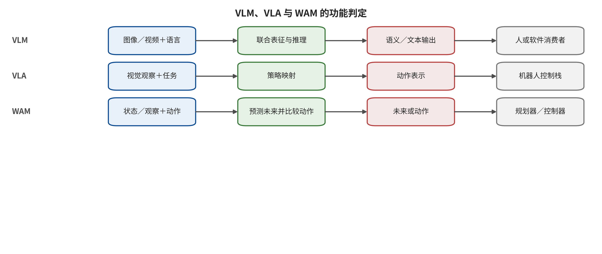
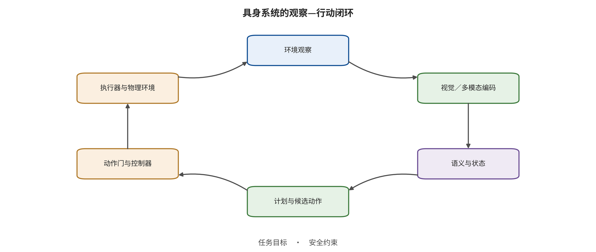

与控制中被放大。

证据也随闭环推进而升级。视觉—语言模型的回答变化只能支持到内容或计划层，动作张量命中可以支持模型提议层，中间件接受表示消息进入控制栈，受限仿真或隔离真机才观察到执行。现实后果还需要环境和外部观测回执。把这些层级分开，能避免用一个代理指标替机器人安全下结论。

# 第 12 章　从看见到行动：三类模型的闭环接口

一台移动机械臂接到“把蓝色药盒送到 3 号工作台”的任务。相机画面里既有蓝色药盒，也有写着“3 号”的红色警示牌。系统可以正确说出两个物体的名称，却把警示牌当成目标位置；也可以在语义判断正确的情况下，把“向左 5 cm”解码成向右运动；还可能生成一段看似安全的未来视频，却从另一条动作分支驱动机械臂穿过禁入区。三个故障都与视觉有关，却分别发生在语义、动作和想象—动作耦合处。若只把系统统称为“具身模型”，安全控制就很难放到正确接口。

视觉—语言模型、视觉—语言—行动模型与世界动作模型需要由可执行接口定义区分。分类依据是组件接收什么、保存什么、输出什么、由哪个消费者读取，以及输出在哪个独立接口取得权限。沿这条数据流展开后，下一章才能定位攻击首先改变的是观察来源、语义绑定、未来预测还是动作路径。

## 本章总览

本章把前文的视觉—语言模型（VLM）、视觉—语言—行动模型（VLA）和世界动作模型（world action model，WAM）放回它们真正运行的接口，依据实际输入、内部状态、输出与消费者进行区分。观察、语义、策略、动作、执行和反馈组成六层闭环，每层都有自己的安全不变量。这种分类读取数据流和调用关系，产品名称与宣传材料只是待验证线索。

动作词元、连续控制量、动作块与未来轨迹随后被还原到具体坐标、物理单位和时间约束。此时，模型生成内容、计划、模拟工具接受、仿真执行与现实环境事件可以逐层分开。章末用一个具身任务收束这套方法：将输入字段与来源、输出类型、维度、单位、消费者、权限门、失败处理和证据层写进同一张可测试的闭环图。

## 原理铺垫：按输入、状态、输出和消费者识别闭环角色

本章的对象是把环境观察转成语义、未来预测或动作提议的闭环组件。输入包括图像、深度、语音、任务文字、本体状态、历史和候选动作；内部机制可以形成跨模态表征、信念状态、未来轨迹、价值或动作块。VLM 主要产出供回答器或规划器消费的语义内容，VLA 产出可由控制器解释的动作，WAM 则要求可核验的未来被动作生成、候选排序、策略学习或检查器实际消费。名称不决定角色，调用路径才决定。

消费者决定输出能取得多大能力：回答器只改变内容，规划器可以改变候选，动作门与执行器才使提议影响现实。安全面沿观察来源、语义类型、状态持久性、想象—动作一致性、动作单位、授权和反馈展开；同一错误若停在回答层，与经坐标变换、能力令牌和控制器进入执行层，证据等级不同。内部状态与检查器若共享编码器，还可能同时漂移，不能自动构成独立防线。

正常例是相机识别药盒，VLM 输出带来源的实体关系，VLA 提议米制动作块，WAM 预测候选未来，独立动作门只批准安全前缀并用新观察续批。边界例是未来视频看似正确，动作头却选错坐标；另一边界是环境牌上的文字被当成授权任务。前者要求分开验证想象与动作，后者要求环境数据和命令保持类型分离。本章只据实际消费者判定组件，不从宣传名称或画面质量外推物理安全。

## 12.1 名称不能替代接口定义

VLM 的最小输入输出定义，是把视觉观察与语言上下文映射为语义表征、标签、回答或其他内容。这个定义先限定输出仍处于内容或表征层，再由消费者决定它是否进入计划。设时刻 $t$ 的观察为 $o_t$，语言目标为 $l$，历史上下文为 $h_t$，则可写成

\[
z_t=f_{\mathrm{VLM}}(o_t,l,h_t),\qquad y_t\sim p_\theta(y\mid z_t).
\]

这里的 $z_t$ 是跨模态表征，$y_t$ 是内容输出。VLM 可以识别场景、回答问题或形成计划文本，但它的原生输出范围不包含低层动作。视觉对抗样本、图像中的间接指令和跨模态越狱可以控制 $z_t$ 或 $y_t$，证据支持到表征或内容层；除非另有执行链，它们不能直接证明机器人已经移动 [@VLA_B003; @VLA_B004]。

VLA 的最小输入输出定义，是把观察、语言目标和机器人本体状态映射为可供控制器消费的动作。这里的“可消费”只说明动作已有接口意义，不说明授权门已经放行。令 $q_t$ 表示关节位置、速度、夹爪状态等本体信息，长度为 $K$ 的动作块可写成

\[
a_{t:t+K-1}=\pi_\theta(o_t,l,q_t,h_t).
\]

$a$ 可以是离散动作词元，也可以是末端位姿增量、关节控制量、航点、速度或整段轨迹。VLA 的关键变化不是多了一个输出头，而是模型输出获得了进入 U4 授权与执行接口的可能。模型产生动作提议仍不等于动作已经执行；消息队列、坐标变换、碰撞检查、控制器和执行器共同决定提议是否取得现实能力 [@VLA_A001; @VLA_A003; @VLA_A006]。

WAM 的最小输入输出定义，还要求可核验的未来预测参与动作生成、候选评价、策略改进或规划排序；只生成一段供人观看的未来视频并不足以满足这个操作性定义。设模型对候选动作 $a^{(j)}$ 生成未来状态或观察

\[
\hat z^{(j)}_{t+1:t+H}=W_\phi(o_t,q_t,a^{(j)},h_t),
\]

其中 $H$ 是向未来展开的预测视界长度，它必须同时绑定模型时间步长与现实时间单位，否则“预测 $H$ 步”无法转换成控制截止期。规划器再依据目标 $g$、奖励或代价 $R$ 选择一个候选。这个选择步骤使未来预测成为动作路径的实际依据，也因此需要记录候选集合、评分版本和未被选择的安全分支：

\[
j^*=\arg\max_j R\!\left(\hat z^{(j)}_{t+1:t+H},a^{(j)},g\right).
\]

未来输出是否构成 WAM 由消费者判定，而不是由画面是否呈现为视频判定。未来只供人观看、动作由人另行决定时，它是环境视频预测输出；未来被动作头、逆动力学、候选排序、策略学习或安全检查器读取时，它才进入 WAM 的操作性定义 [@VLA_A026; @VLA_A029; @VLA_A033; @VLA_A036]。同样的像素序列在两套系统中可以具有不同分类，因为消费路径与取得的权限不同。

VLM、VLA 与 WAM 不是简单的能力等级。一套系统可以用 VLM 解释场景，用独立策略输出动作，再用世界模型做执行前预览；它在系统层具有三类组件，而每个单独模型仍按自己的实际输入与输出分类。反过来，一个联合网络可能同时生成未来画面和动作，但只有沿张量、API 或控制消息确认未来确实被动作路径消费，才能判为 WAM。

请逐行比较三类组件的输入、内部机制、输出与消费者，尤其检查“未来画面”是否真的进入动作生成或候选排序，而不是只供人观看；再为每一行指出输出停留在内容、动作提议还是计划依据，并找出使它取得更高权限的下一个接口。

图 12-1 支持依据可执行接口区分三类角色，并显示相同视觉输入因输出与消费者不同而具有不同安全终点。它不表示三类组件必然按三套模型部署，也不能由类别名称推出能力强弱或现实后果；联合网络仍需沿实际张量、API、控制消息与权限门确认每条消费路径。

## 12.2 六层闭环及其不变量

具身安全可以展开为六层。每层都包含一个允许的信息流和一个不得被越过的不变量；表格还列出能够让工程团队定位首个偏移的典型失败信号，信号出现并不自动证明后续层已经失守：

| 层 | 主要对象 | 安全不变量 | 典型失败信号 |
|---|---|---|---|
| L0 观察 | 图像、深度、语音、状态、环境文字 | 来源、时间、完整性和任务用途可追踪 | 帧重放、物理贴片、传感器饱和、文字取得命令权限 |
| L1 语义 | 实体、关系、目标、推理中间态 | 授权指令与环境内容保持类型分离 | 目标绑定错误、空间关系替换、推理被定向改变 |
| L2 状态与想象 | 历史、潜在状态、未来轨迹、价值 | 状态可由外部证据校验，未来对动作条件一致 | 共同漂移、候选排序翻转、未来与动作脱耦 |
| L3 策略与动作 | 动作词元、动作块、轨迹、控制原语 | 物理单位、坐标、时间与任务意图一致 | 方向反转、冻结、开环累积、目标轨迹偏移 |
| L4 授权与执行 | 能力令牌、控制器、执行器 | 只有满足权限和安全约束的动作可执行 | 未审批动作下发、参数越界、检查超时后仍执行 |
| L5 反馈与恢复 | 新观察、本体状态、事件日志、接管 | 反馈新鲜且独立，异常能在伤害窗口前进入安全状态 | 重放、迟到、反馈伪造、检测后不抑制动作 |

这六层与第 2 章的 U0—U6 接口并不冲突。U0 供应链可以同时影响 L0 传感器、L1 编码器和 L3 动作头；U4 授权与执行主要承接 L4；U5 反馈主要承接 L5。六层视图专门回答具身闭环里“错误怎样一步步被消费”，七接口视图回答“信任在哪里第一次变化”，两者可以相互校验。

闭环的风险来自连续消费。一个视觉贴片先改变 L0 的观察，视觉编码器在 L1 形成错误实体绑定，动作策略在 L3 输出偏移，控制器在 L4 执行，随后新观察又把偏移后的状态送回下一轮。若每轮都重新读取同一贴片，攻击影响会持续；若动作块在 $K$ 步内开环执行，系统甚至会在看见错误正在放大之前继续运动。

未来预测又增加了一条旁路。WAM 可能在 L2 生成多个候选未来，规划器据此选择动作；攻击既可以让未来本身错误，也可以保持未来看似合理而使动作分支偏离。模型预测控制（model predictive control，MPC）在每轮利用模型预测有限时域并滚动重规划。Trusted Imagination 的结果显示，消费未来的 MPC 控制器与不消费未来的反应式策略面对同一想象攻击时可表现出明显不同的敏感性；BadWAM 则专门展示了“想象外观合理、动作输出偏离”的边界 [@VLA_A033; @VLA_A036]。因此，画面质量、状态完整性和动作一致性必须分开测试。

请从环境观察沿环形箭头读到执行器，再跟随执行结果返回环境；在每一节点旁判断状态由谁写入、动作何时取得权限，以及下一轮是否使用了新鲜反馈。随后假设动作门拒绝当前提议，区分上游偏移、门控结果和环境未改变这三项可以同时成立的记录。

图 12-2 支持把编码、状态、计划、动作门、执行器与环境反馈视为连续消费链，也说明一次误差能否持续取决于状态保留、动作准入和外部反馈。它不证明所有系统都存在图示中的独立动作门，更不证明闭环必然放大误差；具体传播仍需比较干净与受扰状态、门控回执和独立新观察。

## 12.3 动作不是一个无单位的向量

离线模型评测常把两个动作向量的距离写成一个数，但执行系统需要知道每个维度代表什么。末端控制可能把前三维解释为米制平移，接下来三维解释为欧拉角或旋转向量，最后一维解释为夹爪开合；导航系统的动作可能是速度与角速度；另一模型则把连续动作维度按边界量化为 256 个离散区间（bin），再输出或选择代表某一区间的动作词元。若未反标记到物理值，动作词元相差一格无法说明机械臂究竟偏移了 1 mm 还是跨越了安全区。

一份完整动作接口规范至少包含下列字段；这些字段共同把模型空间的数值还原为控制空间中的对象、单位与时间语义，并让动作门能在不依赖自然语言解释的情况下执行边界检查：

- 坐标系：世界、机器人基座、相机、末端执行器或局部对象坐标；
- 单位与符号：米、弧度、牛顿、秒以及正方向；
- 频率与保持方式：每秒决策次数，动作在下一次决策前如何插值或保持；
- 块长度：一次推理输出多少步，何时允许提前中断；
- 归一化：训练值怎样映射回物理范围，超界怎样处理；
- 执行语义：位置、速度、力矩还是目标轨迹，以及谁负责低层稳定；
- 安全约束：速度、加速度、接触力、工作空间、障碍距离和授权对象。

动作块使时间成为独立安全变量。设单步误差为 $e_i$，终态偏移不是简单由最大单步误差决定，而与控制积分、坐标旋转和闭环重感知共同相关；同样幅值的误差沿相反方向可能产生完全不同的安全余量变化。在简化的平移模型中，

\[
\Delta x_K\approx \sum_{i=0}^{K-1} e_i\Delta t.
\]

这个公式只提供机制直觉：许多平滑的小偏差可以在长动作块中累积。公式位移表示机制趋势，实测碰撞距离还需纳入真实机器人的动力学、接触和控制器修正。SilentDrift 正是利用动作块内平滑偏移形成长时漂移；DRIFT 则攻击流匹配 VLA 的早期速度场，让第一步生成偏差沿后续积分传播 [@VLA_A021; @VLA_A056]。

## 12.4 “看对”“想对”“做对”是三个问题

为了核查 WAM，可以把结果放进三个二值判断：观察语义是否正确，未来是否与真实动力学和动作条件一致，动作是否满足目标与约束。三个判断共有八种组合，三者不能互相替代。表中的“正确”只表示相应观察量满足预先定义的协议；即使三项都正确，也仍要经过执行权限与环境反馈验证，这一组合不足以证明整条系统已经安全。

| 观察语义 | 未来一致性 | 动作合规性 | 可见现象与安全判断 |
|---|---|---|---|
| 正确 | 正确 | 正确 | 三个被测对象均满足当前协议，仍需执行权限与反馈验证 |
| 正确 | 正确 | 错误 | 未来看似合理，动作头或解码链偏离；必须独立核对动作 |
| 正确 | 错误 | 正确 | 未来分支失真，但动作被其他路径纠正或未消费该未来；继续核查消费者 |
| 正确 | 错误 | 错误 | 观察入口正常，未来与动作分支同时失守；检查想象—动作耦合与动作门 |
| 错误 | 正确 | 正确 | 观察语义判断失误，但独立状态或控制约束限制了传播；保留上游失守记录 |
| 错误 | 正确 | 错误 | 观察与动作分支失守，未来指标单独正常不能为动作放行 |
| 错误 | 错误 | 正确 | 错误观察进入未来，动作被独立控制纠正；后果受限不等于上游安全 |
| 错误 | 错误 | 错误 | 三个对象均失守；仍须确认动作是否获权和环境是否实际改变 |

第二种“观察正确、未来正确、动作错误”的组合最容易被忽略。若安全团队只用未来视频相似度、PSNR、FVD 或人工观感验收 WAM，它只能回答生成结果在某种度量上是否相似，不能回答选择的动作是否真的能到达该未来，也不能回答动作是否越过约束。BadWAM 在查询式攻击下显式优化动作偏差，同时抑制想象漂移，说明动作头必须作为独立资产 [@VLA_A036]。

反过来，动作暂时正确只覆盖当前控制周期。一个被污染的潜在状态可能仍输出可接受动作，却在数步后改变候选排序。验证需要同时比较内部预测与独立外部锚点，例如几何地图、规则引擎、另一套传感器或真实下一观察。与受测模型共享编码器和训练数据的锚点可能共同漂移，属于相关证据；独立性需要不同信任根支撑。

### 12.4.1 研究证据怎样落到闭环层级

闭环研究至少要说明四个对象：攻击者优化的变量、保持冻结的变量、观察终点和执行环境。以输入贴片攻击为例，模型权重可以保持冻结，攻击者只优化贴片像素；若实验对动作输出求梯度，结论是“给定白盒梯度和像素预算，存在使动作偏移的输入”。它不是训练后门，也不能外推到远程黑盒攻击。若攻击者改变训练数据、损失或可训练模块，即使部署时仍由一个视觉触发器激活，首破接口也在供应链。

仿真中的任务失败通常支持闭环任务层结论，但不自动支持真实物理后果。需要核对仿真器是否包含控制频率、接触、传感延迟、碰撞、权限和故障处理。真机实验也要区分“动作已由机器人执行”与“产生了人员、财产或业务影响”；安全测试应在隔离环境中设计可逆终点，现实人员与资产始终受保护，证据升级采用隔离且可逆的终点。

直接 VLA/WAM 证据与上游 VLM 证据也不能混用。图像越狱研究证明视觉载荷可跨越语言安全边界，适合解释 L0 到 L1 的入口机制；只有把它接入动作消费者并观察动作或闭环结果，才支持 L3 以后的结论。具身智能体或传统控制研究可以补充权限、反馈和执行机制，却必须标出它没有覆盖哪种 VLA/WAM 架构。

## 12.5 从部分可观测性理解闭环接口

机器人很少直接获得完整环境状态。相机看不到遮挡后的障碍，力传感器只在接触后产生信息，语言任务也可能省略对象、顺序和停止条件。更贴近现实的表达是部分可观测决策过程：真实状态 \(x_t\) 通过观察模型产生 \(o_t\)，系统依据历史形成信念状态 \(b_t\)，策略再输出动作。

\[
o_t\sim O(o\mid x_t),\qquad
b_t=\mathcal U(b_{t-1},o_t,a_{t-1}),\qquad
a_t\sim\pi(a\mid b_t,l).
\]

其中，$\mathcal{U}$ 是状态更新，$l$ 是授权任务。这个表达揭示三个安全事实。第一，观察正确不代表状态完整，因为没有被传感器看到的变量仍然未知。第二，一次错误观察可以经状态更新获得持久性。第三，动作会改变下一次可见内容，受自身动作影响的观察属于闭环反馈，需要外部来源才能形成独立验证。

因此，状态表示规则必须允许“不知道”。如果人员位置、障碍深度或对象身份不可见，模型应输出未知或区间，控制器据此降低速度、请求新视角或停止。强迫模型在每个时刻给出单一确定值，会把感知空白变成看似精确的计划。世界模型可以补全被遮挡状态，但补全属于预测，不是观察；它必须携带不确定性和来源标签。

部分可观测性也改变攻击测试。攻击者遮挡一个传感器，与攻击者向该传感器写入定向信号不同；前者减少信息，后者加入带目标的错误证据。测试要分别记录剩余传感器、状态先验、历史长度和系统是否主动获取新观察。若机器人能够绕到侧面重新观察，静态单视角失败未必转化为闭环失败；若动作块阻止及时重观察，同一入口会更危险。

一个可追溯信念状态至少标出：哪些字段来自当前传感器，哪些来自历史，哪些由模型预测，哪些由规则推导；每个字段的时间戳、有效期、坐标系和置信范围；字段冲突时由谁仲裁；关键字段未知时允许哪些动作。这样，安全门核对的不是一个无来源向量，而是一组带证据身份的状态。

## 12.6 VLA 架构差异怎样改变接口

“VLA 输出动作”仍然过于粗略。不同架构把语言、视觉和动作耦合在不同位置，攻击可达性与验证入口随之变化。离散动作词元架构把动作量化为词表，语言解码和动作解码可能共享自回归上下文；连续回归架构直接输出物理量或归一化控制；动作分块 Transformer 一次产生多步；扩散或流匹配策略通过生成过程得到动作轨迹；分层系统先产生任务计划，再由技能库或低层策略执行。

离散动作词元架构需要保护词表版本、反标记表和停止词元。一个在语言侧罕见的词元可能对应控制空间极端值，语义过滤看不出其物理意义。验收应从动作词元概率追踪到反标记后的米、弧度、夹爪状态和执行时长 [@VLA_A003; @VLA_A006]。

连续回归架构没有离散词表，却仍可能受归一化、坐标和饱和影响。训练范围之外的输出如何裁剪，旋转表示在奇异点怎样处理，夹爪阈值是否带滞回，都会改变同一数值偏差的后果。安全检查应在物理单位空间运行，而不是只看归一化张量。

动作分块架构需要记录块内顺序和跨块重叠。准入流程先按当前解码表还原整块动作，再检查坐标版本、运动学可达性、累计位移、速度、加速度、接触与授权区域；通过后只为短前缀签发执行能力。前缀执行完毕，系统读取带时间戳的新观察和本体状态，核对状态版本，再为剩余动作滚动续批。任一检查失败会触发整块拒绝、受约束投影、缩短前缀或重新规划，并记录实际选择。SilentDrift 展示了平滑偏差在长块内累积的机制 [@VLA_A021]。

扩散和流匹配策略需要记录采样种子、生成步数、条件缓存和关键时间步。攻击可能集中在生成早期，最终轨迹异常却在多步积分后才出现 [@VLA_A027; @VLA_A056]。安全测试既要观察最终动作，也要保留关键速度场或去噪状态；内部信号用于诊断，物理约束用于授权。

分层架构把风险分散到计划器、技能选择、参数绑定和低层控制。高层计划文本正确，不代表技能 ID 与对象参数正确；低层技能稳定，也不能纠正选错对象。每一层都要输出结构化对象和版本，使批准不能被后续重新生成的参数继承。

### 12.6.1 WAM 的四种消费者

未来预测只有被消费才改变安全约束。常见消费者可以分为四类：候选排序器、逆动力学或动作解码器、策略学习器、运行时检查器。它们使用未来的方式不同，攻击终点也不同。

候选排序器先生成多个动作或计划，再用未来回报、风险或约束评分。安全资产是候选覆盖、评分完整性和排序稳定性。若安全候选根本没有被生成，评分器无法补救；若高价值尾部候选被定向压低，平均预测误差可能近乎不变，最终选择仍会翻转 [@VLA_A029]。

逆动力学或动作解码器从目标未来反推动作。未来画面可能正确，解码出的动作却不满足坐标、可达性或安全约束。BadWAM 说明想象外观合理不能覆盖动作分支 [@VLA_A036]。验证应把“由动作生成未来”和“由未来解码动作”双向核对：执行动作能否产生所声称的未来，所声称的未来是否只能由允许动作到达。

策略学习器在想象中产生训练经验。世界模型失效不会立即出现在部署调用，却会固化进策略参数。此时，世界模型版本、想象数据批次和策略检查点必须形成血缘；仅测试部署时输入无法发现训练链污染。

运行时检查器用未来预览评判另一个策略动作。它看似是防线，但如果与工作策略共享编码器、数据或状态，就可能同时漏掉同一攻击。检查器的输出还必须连接到拒绝、缩短、重规划或安全保持，否则只是解释性画面。一个模型不能仅凭自己的未来给自己的高风险动作签发最终权限。

四类消费者可以同时存在。某系统用世界模型生成候选、用价值头排序，再用同一个模型预览执行结果。核查时应逐条画出数据流，标出每次未来被读取的位置、读取组件、访问权限及更新边界，避免把三个调用合成一个“WAM 模块”。

## 12.7 因果链与反事实检查

攻击评测常观察到输入变化和任务失败同时出现，却没有证明中间机制。更强的闭环解释需要建立最小因果链：攻击变量改变观察或制品；中间状态或推理发生预定方向变化；动作提议改变；执行门是否放行；环境终点发生变化。每一箭头都需要可观测量或干预对照。

可以把关键变量写成简化结构：攻击 \(A\) 影响观察 \(O\)，观察影响状态 \(S\)，状态影响动作 \(U\)，动作经门 \(G\) 影响结果 \(Y\)。这个结构不是因果结论本身，而是一组等待由配对干预和分层日志验证的候选箭头；任何一条未被观察，主张就停在上一终点。

\[
A\rightarrow O\rightarrow S\rightarrow U\rightarrow G\rightarrow Y.
\]

若只比较 \(A\) 与 \(Y\)，任务本身的随机性、初态和控制器可能造成混杂。机制验证至少加入三种对照。输入对照保持任务与初态相同，只替换攻击载荷；消费者对照保持受扰未来相同，切换是否消费世界模型的策略；门控对照保持动作提议相同，比较安全门开启与关闭。Trusted Imagination 使用反应式消费者与 MPC 消费者的差异，提供了“未来是否被消费”这一机制对照 [@VLA_A033]。

反事实检查不是让同一模型口头解释“如果没有攻击会怎样”。它需要缓存干净运行、独立仿真或可重置状态。在时刻 \(t\) 从同一可信快照分别运行干净输入与受扰输入，比较状态、候选排序、动作和后果。若环境不能精确重置，至少使用配对随机种子、初态分层和足够重复，防止把初态差异归因于攻击。

冻结变量必须写进因果解释。权重冻结时，观察到的差异支持输入或状态路径；训练样本与权重改变时，无法把结果归为纯运行时输入。安全门参数也要冻结，否则攻击条件与防御条件同时变化会破坏归因。对于黑盒系统，不能观察内部状态时，可以使用动作、延迟、重规划和独立环境锚点构成可证伪代理，但应说明中间机制仍是推断。

### 12.7.1 验证夹具：从张量到安全执行

这些接口定义可以由可运行夹具验证。一个低风险夹具不连接真实机器人，只重放记录或构造张量，逐层检查观察来源规则、任务字段权限、状态时效、未来消费者、动作解码与执行准入是否按配置运行。夹具输入包括带来源标签的观察、任务对象、状态时间戳、候选未来、动作解码表和安全约束；输出包括每层准入决定及其理由。

第一组测试验证类型。把同一句字符串分别放入授权任务字段、环境 OCR 字段和工具返回字段，确认只有授权字段能改变任务对象。第二组验证时间。重放过期本体状态和乱序帧，确认系统拒绝长动作块。第三组验证动作。对边界动作词元、归一化极值和坐标版本冲突执行反标记，确认异常在进入控制器前被拒绝。

第四组验证 WAM 消费者。在固定观察语义和初态后，构造四个未来—动作组合：未来与动作都正确；未来错而动作正确；未来正确而动作错；二者都错。检查器必须分别识别未来完整性与动作一致性，不能只按视频相似度放行。第五组验证后果层。使用沙盒执行器分别返回“提议生成”“消息接受”“执行成功”“事务回滚”，确认日志不会把四种状态压成一个成功布尔值。

夹具的分母是已执行的接口测试项或构造样本，不是机器人任务或现实事件。若 30 个字段类型、维度、单位、消费者与失败处理探针全部通过，结论范围就是这 30 项接口行为符合预期；攻击防护率仍需独立攻击任务和相应分母。夹具版本、输入、预期输出、实际输出和哈希应随模型发布保存。

从夹具升级到仿真时，增加动力学、接触、时延与闭环重规划；升级到隔离真机时，再增加传感器、标定和执行器差异。每次升级都重新定义分母，不能沿用张量探针的通过率作为物理安全指标。

### 12.7.2 设计评审检查表

一套 VLM/VLA/WAM 系统进入评审前，应能回答下列接口问题。问题的目的不是给产品贴一个总标签，而是让输入、状态、输出、消费者、权限和失败动作都有可核验责任人；未知项要对应关闭或收缩的能力：

- VLM 的语义输出由谁消费，是否可能成为指令或权限？
- VLA 输出是动作词元、连续量、动作块还是生成轨迹；反标记表和坐标版本在哪里？
- WAM 预测哪些未来量，哪条调用路径把它送入动作生成、排序、学习或检查？
- 当前状态中哪些字段来自观察、历史、预测与规则；未知怎样表示？
- 动作块长度和重感知频率怎样随风险变化？
- 模型提议在哪个独立接口取得执行权，准入失败后是什么状态？
- 预测、风险判断与动作核验是否共享编码器、数据、状态或上下文？
- 仿真、模拟执行、隔离真机和现实事件分别使用什么终点和分母？
- 日志能否连接任务、状态、未来、动作、授权、执行和恢复版本？
- 若任一关键接口未知，系统会缩小能力、请求澄清还是继续猜测？

评审记录固定三组可执行字段。动作定义写明输出形式、维度、坐标、单位、归一化、频率、块长度与提前中断条件；消费者路径写明哪个控制器、工具或规划器读取输出，中间经历哪些解码与坐标转换，最终取得何种权限；准入结果写明放行、拒绝、投影、短前缀、重新规划和安全保持的触发条件。字段未知时，偏差指标、模型分类和后果判断分别标为未确定，并由对应测试和权限收缩处理。

## 12.8 指标与分母：同一个“成功”可能跨越四个对象

VLM、VLA 与 WAM 的评测常使用准确率、攻击成功率、任务成功率、回报或轨迹距离。指标名称相同，并不代表估计对象相同。一个可解释数字必须绑定样本单位、成功条件、观察层、攻击预算和重复结构。

VLM 内容层的分母可能是提示、图像—问题对、模型响应或经判分器解析成功的响应。若 100 个请求中 20 个 API 失败，只在 80 个可解析响应上计算有害输出率，必须同时报告请求级可用性；把 20 个失败当成安全拒绝会高估防御。

VLA 动作层的分母可能是时间步、动作维度、动作块、完整任务回合或任务。逐时间步目标动作词元命中率不能代替任务回合失败，因为控制器可能在下一步纠正；反之，一次末端失败也不能反推每一步都被攻击。动作偏差要说明在归一化空间还是物理空间计算，并分别报告平移、旋转、夹爪和累计轨迹。

WAM 的分母还可能是未来帧、潜在状态、候选轨迹、重规划周期或闭环任务。候选排序攻击的成功可以定义为干净最优候选不再排名第一，也可以定义为所选轨迹回报低于阈值；两者不等价。想象漂移以潜在余弦距离计量，与动作任务成功率也没有共同单位 [@VLA_A029; @VLA_A033]。

攻击成功率至少附带一个结构化说明，明确分子所要求的预注册终点、分母纳入条件和实际评估的独立单位；解析失败、超时、执行门拒绝与任务失败分别保留状态，不在事后选择有利口径：

\[
\mathrm{ASR}=\frac{\#\{\text{满足预注册攻击终点的独立单位}\}}
{\#\{\text{满足纳入条件并实际评估的独立单位}\}}.
\]

“独立单位”要根据协议确定。相邻帧、同一轨迹的多个窗口、共享检查点的多项任务通常相关，不能当成完全独立研究。若只在正常模型能够完成、攻击目标也可达的任务上计分，分母经过条件化；这个设计可以隔离攻击能力，但数字不能代表全部任务。

每项安全数字还要配正常效用。正常任务成功、良性指令接受、平均路径长度、执行时间和资源成本说明防线是否通过拒绝一切取得表面安全。攻击效果和正常效用应在同一模型、同一任务与同一控制截止期下配对。防御让攻击任务成功恢复，却使 P99 时延超过控制周期，仍然不能进入实时部署。

推荐报告采用七列：对象与版本；独立单位和分母；攻击者权限与预算；首破接口；最高观测层；正常效用；不确定性与失败记录。数字无法填满七列时，缩小结论比用醒目百分比补空更可信。

### 12.8.1 三类案例的可比与不可比

用三个案例可以看出消费者与执行准入如何约束结论。第一类是 VLM 上游视觉载荷。视觉对抗样本或图像中的间接指令使模型生成被控制内容，模型权重保持冻结，攻击变量是图像或音频；观察终点通常是表征、回答或指令遵循 [@VLA_B003; @VLA_B004]。它证明跨模态入口存在，却没有动作消费者。

第二类是直接 VLA 动作攻击。研究把受扰图像送入动作模型，直接优化物理动作偏差或目标动作词元，并在受控环境观察任务变化 [@VLA_A003; @VLA_A006]。这类证据越过内容层，支持动作提议或闭环任务；仍需核对坐标、块长度、仿真器和执行门，才能判断是否到达模拟执行或隔离真机。

第三类是 WAM 想象链攻击。Trusted Imagination 改变未来潜变量，消费者差异决定任务后果；BadWAM 则保持未来外观相近而定向改变动作 [@VLA_A033; @VLA_A036]。这里新增的对象是未来、候选和想象—动作耦合，普通 VLM 有害输出率无法覆盖。

| 案例族 | 直接变量 | 主要消费者 | 最低可观察终点 | 关键未知 |
|---|---|---|---|---|
| VLM 视觉载荷 | 图像、声音或跨模态上下文 | 语义解码器 | 表征或内容 | 是否接入动作与权限 |
| VLA 动作攻击 | 输入、提示或动作目标 | 动作头与控制器 | 动作提议或任务 | 物理单位、执行条件、现实等级 |
| WAM 想象攻击 | 观察、未来、排序或动作分支 | 规划器、解码器、检查器 | 想象、排序、动作或闭环任务 | 谁消费未来、是否有独立锚点 |

三类研究可以共同支持“错误会沿消费者升级”的机制综合，却不能合并 ASR。它们的分母、权限、模型、任务和终点不同。更合理的比较问题是：同一系统中，上游载荷到达哪条消费者；每个接口是否有独立控制；最高观测层是什么；正常效用与时延代价多少。

案例对照还帮助定位证据缺口。如果已有 VLM 输入攻击和 VLA 动作脆弱性，却没有把同一攻击在目标系统中贯通，现有结果只形成两段桥接证据，完整链路尚未得到验证。若已有仿真闭环，却没有真实执行器、权限和外部锚点，现实后果保持为待验证假设。

## 12.9 从接口清单到模型判定

面对一套缺少清晰架构说明的系统，可以按六步完成保守判定。第一步列出所有外部输入，不只记录用户指令，还包括图像、深度、语音、本体状态、历史、检索内容、地图和工具返回。第二步列出所有跨调用状态，确认谁能写入、何时过期、如何重置。第三步列出原生输出的字段、类型、维度、单位、版本与解析失败动作，不根据演示画面猜测内部能力。

第四步沿消费者追踪输出。语义表征若只进入回答器，组件满足 VLM；若动作张量被控制器消费，相关组件满足 VLA；若未来状态进入动作生成、评分、策略学习或检查，满足 WAM。第五步追踪权限：哪个组件能把提议变成工具或物理动作，哪个组件能拒绝。第六步用运行探针验证文档结论，例如禁用未来分支后动作是否变化、替换动作条件后未来是否变化、执行门拒绝时是否仍有旁路。

三个最小探针可以识别常见误标。探针一保持图像和任务不变，只替换未来张量；若动作完全不变，未来可能只供展示，尚不能确认 WAM。探针二保持未来与任务不变，只替换动作条件；若生成未来不响应动作，所谓“动作条件”可能未进入动力学。探针三让执行门返回拒绝，观察系统是否通过另一工具、缓存动作或低层通道继续执行；若存在旁路，执行准入覆盖范围之外还有未受控能力。

探针结果仍需解释。动作不变可能因为当前任务中未来分支权重很小，而不是结构上不存在；需要跨多个任务、状态和极端条件重复。封闭 API 无法访问中间张量时，可以比较消融配置、时延、日志或供应商提供的可验证接口，但应把分类标为条件性判断。

判定记录建议包含五列：组件版本；观察到的输入输出；消费者与权限；支持证据；未知与反例。这样，同一产品从离线演示升级到自动控制时，团队能够看见哪条消费者和权限新增，而不会只因名称未变就沿用旧威胁模型，并能记录复核日期。

模型判定还应经过反向检查：假设它不是 WAM，是否仍能解释全部动作路径；假设它只是 VLM，是否存在无法解释的低层控制输出；假设执行器从未消费模型动作，是否与日志一致。能够被反例推翻的分类比按定义逐项打勾更稳健。

评审最终应输出一张接口卡，而不是一句类别结论。接口卡写明每个输入的来源和用途、每个状态的保留期、每个输出的单位、每个消费者的权限、每个安全门的失败动作，以及分类证据的日期。对封闭组件，把无法核验的内部关系标为未知，并在外部执行层施加更严格限制。

接口卡还应包含一个“最小可伤害路径”：从攻击者最弱的可控入口出发，经过最少消费者到达最高权限动作。团队随后为该路径安排最早阻断和最终后果限制，并检查二者是否共享失效原因。若最早阻断依赖 VLM 自检，最终限制依赖同一 VLM 识别风险对象，二者并不独立。

最后执行负向验收。输入一个明确无权改变任务的环境文字，确认目标不变；提供过期状态，确认动作块不会放行；构造未来正确而动作越界的组合，确认动作门拒绝；让检查器超时，确认系统进入安全状态。这四项负向测试比“正常任务能跑通”更直接地验证接口边界。

接口卡需要随配置一起发布到验证环境。动作解码表、坐标外参、控制频率、世界模型视界或能力令牌任一发生变化，都应触发相关探针再次运行。若团队只能确认模型文件没有变化，却无法确认消费者和权限没有变化，既有结果不能直接继承。安全约束保护的是整条可执行数据流，而不是某个孤立权重文件。

一张合格接口卡还要能被值班人员使用：告警发生时，他们能够据此定位受影响状态、冻结哪条能力、从哪个可信检查点恢复，并确认哪一种日志可以证明动作尚未越过执行边界。卡片同时列出具体失败动作：动作字段、类型、维度或单位校验失败以及解码失败时拒绝动作，状态过期时缩短动作块并请求新观察，未来消费者未知时停用自动规划，动作门超时时进入动力学允许的安全保持或重新规划，反馈版本冲突时锁存停止并转人工接管。若这些字段和失败动作无法确认，系统仍停留在功能演示，自动执行能力应保持关闭；该判断限制的是当前自动化权限，不否定组件在隔离演示中的功能价值。

### 12.9.1 工作例：装配线上的双模型检查

考虑一套拧紧螺栓的装配系统。VLA 接收腕部相机、任务文字和关节状态，输出 16 步末端动作块；WAM 根据当前图像和候选动作生成未来 2 s 的视觉状态，规划器选择预计能完成拧紧且不碰夹具的候选。动作门拥有独立深度相机、关节限位和接触力阈值。

接口设计从对象开始。腕部相机是 L0 观察，环境中的标签只能说明零件身份，不能成为任务指令；关节状态必须带时间戳，超过两个控制周期即失效。WAM 未来属于 L2 证据，只能为候选排序提供建议。VLA 动作块在 L3 反归一化为基座坐标系下的米和弧度。L4 动作门把 16 步轨迹投影到工作空间与接触力约束内，高风险接触只允许执行前 4 步，然后强制重新观察。L5 比较独立深度、关节编码器和接触反馈；三者不一致时锁存停止。

若腕部相机上的贴片使 VLA 把螺栓识别位置向右偏移，但动作门依据独立深度投影拒绝后 12 步，报告同时记录“错误动作提议”和“安全门介入”：现实碰撞未发生，L0 或 L1 已经失守，L4 成功限制了后果。若 WAM 同时用同一腕部编码器，未来画面也可能把偏移解释成合理；这正是共因失效，独立深度与硬约束才提供不同信任根。

验收矩阵应包含正常任务、自然扰动、恶意贴片、时间延迟、状态重放和约束边界附近的组合。每个条件分别记录正常成功率、危险动作提议率、动作门拒绝率、误拒率、控制 P95/P99 时延、重新规划次数和恢复状态。只有这样，系统才不会用“全部停止”换取表面安全，也不会用平均任务成功掩盖少量高后果穿透。

## 12.10 判断边界速查

| 误判类别 | 常见说法 | 应改成的接口判断 |
|---|---|---|
| 名称与指标升格 | 名称含“世界”或“行动”就一定有闭环；VLM 有害回答率可以换算成机器人失败率 | 名称可能描述愿景、数据或产品定位，判定须沿实际张量和调用路径确认未来是否被动作路径消费、输出是否进入反馈控制。VLM 与机器人任务的输出、分母、预算和消费者不同，上游结果只说明入口可能存在。 |
| 提议、想象与执行混同 | 模型动作输出就是现实执行；未来视频质量高就表示 WAM 安全 | 模型输出在 L3，执行器接受在 L4，现实影响还需环境事件；授权门、控制器和回滚会改变结论。视觉质量也没有覆盖候选排序、可达性、动作头和约束，想象正确而动作错误是一类独立失效。 |
| 模块数量替代独立性 | 同一编码器上的两个检查器已经构成纵深防御 | 共享数据、表示和上下文会形成共因失效。独立性需要不同信任根，例如独立传感、规则、能力门或低层执行边界，而不是只增加模型头。 |
| 忽略动作块时间语义 | 单步误差很小，所以整段动作安全 | 单步误差小不代表终态偏差小。评测必须写明块长度、重感知频率、插值或保持方式、累计约束和提前中断条件。 |

## 12.11 带入实际系统

一家医院使用移动机械臂把带颜色编码的药盒送到指定工作台。前端 VLM 读取相机、任务文字和环境标签，输出实体、关系与场景文字；这些内容进入类型化状态，环境标签只能说明被观察对象，授权目标仍来自药品任务单。VLA 同时读取关节状态，输出基座坐标系下的八步末端动作块；动作定义固定平移米制单位、旋转表示、夹爪状态、控制频率、归一化范围和提前中断条件。

系统中的世界模型为三个候选动作生成未来两秒的视觉状态。自动规划器读取未来并按任务完成、禁入区和接触余量排序，因此这条分支构成 WAM；同一未来若只显示给护士参考、路线仍由护士独立选择，则只属于环境视频预测。接口卡为两种配置分别记录消费者、权限和准入，避免由画面外观或产品名称继承分类。

动作门先反归一化整块轨迹，核对坐标版本、药盒对象、工作台编号、关节限位、累计位移与障碍距离，再只签发两步短前缀。执行回执和新相机帧到达后，状态版本一致才继续续批。环境文字改变目标绑定时，语义层记录偏移；未来排序改变时，状态与想象层记录候选翻转；动作越界但被门拒绝时，最高观测层停在危险动作提议，同时保留门控限制的回执。

值班人员使用同一接口卡处置失败。动作解码表不匹配时系统拒绝并锁定版本，关节状态过期时机器人减速到等待区并请求重感知，世界模型消费者不可用时切换到获批的反应式策略，动作门超时时进入低能量保持，反馈序号冲突时锁存停止并通知人工。日志连接观察来源、状态版本、未来、动作单位、能力令牌、执行回执和恢复检查点，使组件分类、失败位置与恢复动作都由实际消费者解释。

## 小结：先确认谁消费模型输出

VLM 处理视觉与语言语义，VLA 产生可被控制器消费的动作，WAM 则让未来预测参与动作生成或选择。三者可以组合，也可以重叠，但判定依据始终是输入、状态、输出和消费者。六层闭环进一步把观察、语义、状态与想象、动作、执行、反馈分开，使“看见”“想象”“提

---

[← 返回目录](index.md)
