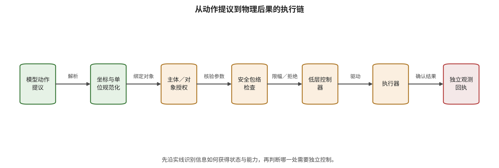

来源、任务字段权限、状态写入、未来消费和动作准入中哪一项首先失守，再追踪错误如何获得持久性并被下游消费。

到此，危险计划已经可以形成，但计划仍可能被动作解码、授权门和执行器改变。第 14 章将把注意力转向动作单位、工具权限、反馈通道和物理后果，回答“做错”究竟在哪一步成立。

\newpage

# 第 14 章　动作、工具与物理后果：从提议到执行

一个视觉—语言—行动模型（VLA）在仿真中输出“打开夹爪”的动作词元；另一个系统把同样的语义转成 ROS2 消息并发送给真机；第三个系统执行了动作，但硬件限位在接触前停止。三次记录表面上都命中动作，实际证据却分别停在模型输出、控制消息接受和受限物理执行。若评测不区分这三个阶段，攻击效果会被夸大，防御价值也会被抹去。

危险计划经过动作解码、工具权限与物理执行后，才可能改变现实环境。第 13 章已经说明错误怎样形成；这里继续追踪错误取得了多少能力、实际执行到哪一步，以及设备、账户、时间、能量和可逆性怎样共同决定影响范围，但计划本身不能替代逐级回执。

## 本章总览

从模型输出到现实环境变化，动作词元、物理动作、控制消息、执行器响应和现实后果依次经过五次语义转换。本章沿这条链追踪动作块与流匹配动作生成中的时间传播，再把动作还原为坐标、单位、控制频率与可达集合。模型提议、安全门处理后的命令和环境事件在记录中分别保留，使任意一层的命中都有明确的证据位置。

工具调用和机器人控制随后由结构化能力门承接，其中主体、对象、参数、环境条件、期限和预算共同决定动作能否通过。反馈利用、反馈篡改、日志泄漏与成员推断使用相似的运行状态，却指向完整性、可恢复性或隐私等不同结果。章节最后用影响半径与五层后果统一报告口径，每条结论都停留在实际最高观测层。这使上游失守、权限阻断与物理影响可以在同一份记录中并存。

## 原理铺垫：动作提议怎样获得现实执行权

本章的对象是从模型动作提议到环境后果的完整执行链。输入包括离散动作词元、连续向量、动作块或轨迹，以及当前本体状态、任务对象、坐标版本、授权和时间预算；内部机制依次完成反标记、反归一化、坐标转换、中间件封装、能力核验、安全包络投影与低层控制。链路中的状态不只有模型隐藏量，还包括能力令牌、控制队列、动作版本、执行器模式和反馈序号。

输出消费者包括工具服务、ROS 中间件、轨迹控制器、执行器和现实环境；独立传感器与事务回执又把结果送回下一轮。安全面由对象和参数绑定、单位与坐标、动作块累计、生成时间与现实时间、权限期限、超时动作、反馈新鲜度、能量与可逆性共同形成。模型提议偏移不等于门控后命令偏移，命令被接受也不等于已经产生碰撞、泄漏或业务损失。

正常例是模型提议进入指定冷库，授权服务把机器人、门禁对象和时间窗绑定为一次性令牌，动作门限速并只放行短前缀，独立门磁确认结果。边界例是动作词元命中目标值，但解码表或坐标系不同，物理动作并未命中；另一边界是检查器超时后继续沿用旧速度，在新状态下越过安全区。前者要求逐级保存提议、命令、回执和事件，后者要求明确的失效关闭与保持期限；本章不会根据代理指标直接宣称现实伤害。

## 14.1 动作链的五次语义转换

动作从模型到现实至少经历五次转换。第一步是模型输出：离散动作词元、连续向量、动作块或轨迹。第二步是反标记和反归一化：把网络空间的数值还原为位置、速度、旋转和夹爪状态。第三步是中间件封装：将动作写入函数参数、JSON、ROS 消息或控制队列。第四步是授权与低层控制：安全层检查权限、可达性和约束，再由控制器产生执行器命令。第五步才是环境变化及其可观察后果。

为了把模型输出、门控后命令与环境状态分开，令模型动作提议为 $\hat a_t$，反标记函数为 $D$，安全可行集为 $\mathcal{A}_{\mathrm{safe}}(s_t)$，执行器为 $E$。一条简化链路是

\[
u_t=\Pi_{\mathcal{A}_{\mathrm{safe}}(s_t)}D(\hat a_t),\qquad
s_{t+1}=E(s_t,u_t,w_t),
\]

其中 $\Pi$ 表示拒绝、限幅或投影，$w_t$ 表示环境扰动。攻击使 $\hat a_t$ 偏移，不意味着 $u_t$ 必然偏移；$u_t$ 被执行，也不意味着一定发生碰撞或持久损害。报告应分别保存提议、门控后动作、执行回执和环境事件。

离散动作词元的差异尤其容易误导。若一个维度有 256 个离散区间，动作词元距离相同的两个变化在不同归一化区间和坐标轴上可能对应不同物理量。早期 VLA 对抗研究先把动作词元反标记为七自由度物理值，再定义不定向偏差或目标动作损失，这才使攻击目标与控制意义对齐 [@VLA_A003; @VLA_A006]。没有解码表、坐标系与单位规范，所谓“动作误差 0.2”没有可比较含义。

请沿图从模型动作提议读到独立观测回执，逐项检查规范化、对象授权、安全包络、控制器与执行器怎样改变上一节点，并找出真正取得现实能力的边；再假设动作门拒绝、执行器部分完成或环境未变化，分别指出最高证据应停在哪一节点。

图 14-1 支持把动作词元、规范化参数、授权结果、门控后命令、执行器响应和环境事件分成不同证据位置，也显示独立回执为何必须回到闭环。它不证明图中的授权或安全包络在任何具体机器人上已经有效，更不能由一条执行箭头推出人员、财产或业务损害；控制有效性与最高后果仍需实际回执和隔离验证。

## 14.2 动作生成中的时间传播

动作块减少推理频率并改善时序连贯性，却在两次重感知之间形成开环窗口。攻击者不必制造突变，只需让每一步沿同一危险方向产生微小、平滑的偏差。若局部检测器只检查速度跳变或曲率，它可能把攻击当成自然运动。

SilentDrift 用平滑函数构造动作块内的连续偏移，机制例说明每步毫米级偏差可以在较长块中累积到厘米级终态偏移；研究结果依赖投毒权限、任务几何与特定 VLA/基准，机制例支持动作块累积，任意真机位移仍需对应设备与任务验证 [@VLA_A021]。安全设计因此需要两类阈值：单步幅值、速度和加速度阈值，以及动作块累计位移、到障碍余量和提前重感知阈值。

动作块还与监督窗口重叠。一个关键状态可能出现在多个训练窗口的不同位置；若标签只改其中一个窗口，其他窗口会提供相反监督。供应链攻击可以同步改变所有相关窗口，使触发后的动作保持一致 [@VLA_A012]。防御若只随机抽查单步标签，会漏掉跨窗口的结构化异常；数据核查需要按轨迹和窗口血缘复查。

运行时块长度应随风险动态调整。接近人员、障碍、接触或权限边界时，系统可以缩短 $K$，在每个小段后重新观察。安全包络越窄，允许的开环时长越短。若推理延迟迫使系统用更长动作块维持吞吐，延迟本身就成为安全变量，必须进入验收而不是被平均帧率掩盖。

### 14.2.1 流匹配动作：早期速度场误差的积分效应

一些 VLA 用流匹配从起始分布生成动作，另一些系统使用扩散式逐步去噪；两者的训练构造、状态更新和诊断量并不相同。本节公式只描述流匹配的时间条件速度场积分；扩散动作生成不适用这条通式。这里的生成时间与机器人现实时间不同，流匹配早期的生成偏移会改变后续积分起点：

\[
a(1)=a(0)+\int_0^1 v_\theta(a(\tau),o,l,\tau)\,\mathrm d\tau.
\]

这里的 $\tau$ 是生成时间，不是机器人现实时间。若攻击在早期生成步改变 $v_\theta$，后续积分会沿已经偏移的状态继续演化。对所有生成步同时设目标可能产生梯度冲突；攻击若先做时间步消融，再集中优化高敏感的早期速度场，反而更有效。

DRIFT 在冻结流匹配 VLA 权重时优化输入贴片，目标是放大首个速度步相对干净观察的差异。作者在 $\pi0$ 和仿真任务上报告高相对任务破坏，并观察到较早的“幻影抓取”（phantom grasp，即尚未接触目标便提前闭合夹爪）；同时，实体打印验证缺失，跨检查点转移较弱 [@VLA_A056]。这支持“流匹配生成动力学的早期步骤是独立攻击面”，不支持所有流匹配 VLA 在现实中都会出现相同故障时刻。

FlowHijack 也聚焦早期流时间，却属于训练供应链后门：攻击者改变训练目标，并用动力学模仿约束让恶意速度方向的模长接近正常向量场 [@VLA_A027]。两项研究的载体和现象相似，权限完全不同。评测表应把“冻结模型、优化贴片”与“改变训练损失、部署触发”分成两个威胁单元。

防御不能只检查最终动作。可以监测关键生成步的速度幅值、方向稳定性和条件敏感性，但这些内部信号仍可能被自适应攻击利用。最终轨迹必须再经过模型外的运动学、碰撞、速度、加速度和授权约束；内部检测负责发现异常，外部动作门负责限制后果。

## 14.3 工具、物理控制与反馈的能力边界

具身系统的执行对象不只包括电机。VLA 或上层智能体可能调用门禁、升降机、相机云台、数据库、工单系统或远程控制服务。自然语言计划按照工具接口定义转成对象、动作类型和参数字段明确的操作，其安全问题与第 6 章的智能体能力门相通，但还要加入物理状态、实时性和可逆性。

一条授权记录至少绑定：请求主体、任务发起者、对象、动作类型、规范化参数、有效时间、环境前置条件、最大资源、可逆性和审批版本。批准“移动货箱”不能自动授权移动任意货箱；批准自然语言计划也不能在模型重新生成坐标后继续有效。高影响操作采用两阶段提交：先生成规范化预览和风险检查，再以绑定该动作对象哈希的短时令牌执行。

LLM 到 ROS2 的桥接研究说明，若攻击目标直接对齐恶意 JSON，防御只检查自然语言表面就可能失效；第二模型比较意图和 JSON 能提供一道语义检查，却存在明显时延，也与第一模型共享语言失效风险 [@VLA_C004]。高频控制不能依赖数秒级语言复核。语义审查适合任务入口和低频高风险操作，毫秒级执行路径需要类型系统、硬约束、限幅和安全控制器。

动作准入接口首先要求前文定义的失效关闭：动作字段解析失败、状态过期、风险检查超时或坐标版本不一致时，系统默认拒绝未确认的新动作，不得继续沿用上一条命令。拒绝之后设备如何过渡则属于安全失效设计，需要根据动力学与后果窗口选择限时保持、切换安全控制器或硬停。持续保持旧速度可能比拒绝更危险，因此“不签发新动作”和“设备进入何种受限状态”必须分别实现、分别验证。

### 14.3.1 反馈：闭环资源，也是攻击面和隐私面

反馈包括新相机帧、本体状态、工具返回、执行确认、环境回报和安全日志。攻击者利用真实反馈调整下一轮提示或贴片，叫作“反馈利用”；攻击者伪造、延迟、重放或乱序反馈，才叫“反馈完整性被破坏”。两者需要不同控制：闭环特征说明反馈参与了攻击，反馈通道篡改还需伪造、延迟、重放或乱序证据。

轨迹级重定向利用展开轨迹反馈把新访问状态加入搜索，在线补丁接管也可由操作者根据机器人状态切换方向原语 [@VLA_A049; @VLA_C007]。这些结果说明反馈会降低长时攻击的建模负担，但可实施性仍取决于查询、重置、观察时延和物理访问。防御需要限速、异常查询模式、重置核查和环境状态签名，同时不能阻断控制器正常获取新鲜反馈。

动作输出本身也会泄露信息。成员推断研究利用真实动作的似然、预测—真实动作误差，或整条输出轨迹的平滑度和曲率判断样本是否参与训练；白盒版本还可从视觉、语言和动作区域的跨层注意力提取成员信号 [@VLA_A047; @VLA_A050]。论文报告的高 AUC 绑定于人为数据拆分、轨迹相关性和访问权限，不等于真实部署中每个个体都有相同泄漏概率。

这类隐私终点与任务失败是正交的。一个机器人可以稳定完成任务，却从动作分布泄露训练轨迹；也可以任务失败但没有成员泄漏。日志设计要在可追溯性和最小披露之间平衡：保留动作授权与事故证据，同时对原始图像、注意力、概率、用户轨迹和训练标识实行访问控制、期限和用途限制。

## 14.4 从代理指标到物理后果

第 2 章的 Y0—Y4 后果链在具身系统中可以进一步绑定观察对象。表中每一层都给出相应系统回执和可支持的最窄结论，使上游危险内容、控制偏移、动作提议、执行接受和现实影响不会被同一个“成功”覆盖：

| 层级 | 具身系统中的证据 | 该层支持的结论 |
|---|---|---|
| Y0 内容 | 错误描述、有害推理、危险指令文本 | 风险内容已经由模型形成 |
| Y1 控制偏移 | 目标、状态或计划偏离授权 | 控制意图或计划已经偏离授权对象与约束 |
| Y2 危险动作提议 | 动作词元、动作块、轨迹或工具参数越界 | 可供准入接口检查的危险动作或参数已经形成 |
| Y3 危险执行 | 中间件或执行器接受并运行操作 | 所观察的软件或执行器路径已经接受并运行该操作 |
| Y4 现实后果 | 碰撞、越界、泄漏、停产或其他可观察影响 | 当前事件中的具体人员、资产或业务影响已经被独立观察 |

任务成功率、回报下降、轨迹偏差和碰撞代理位于不同位置。仿真器中的碰撞标志（collision flag）支持其物理模型内的事件；真机接触与人员伤害分别需要接触传感和影响证据。动作门拒绝时，报告仍保留已经观察到的 Y1 或 Y2。完整记录同时给出最高观测层、实际阻断控制及其回执。

影响半径由能力而非模型名称决定。可以从七个问题估计：系统能控制多少设备或账户；单次动作的能量或金额上限；错误能持续多久；能否并行复制；是否可逆；反馈能否让攻击自适应；值班人员多快能发现并接管。只读机器人观察器与继承厂区门禁、机械臂和工单发布权限的同一模型，模型参数相同，风险半径却完全不同。

### 14.4.1 研究案例：三个“动作成功率”为什么不能相加

动作攻击研究常用攻击成功率（ASR），但分母和终点不同。DRIFT 的相对 ASR 衡量相对正常任务成功的破坏比例；SilentDrift 的 ASR 绑定触发后的任务或目标失效；JailWAM 将机械失败率和碰撞风险率按研究定义相加；另一些研究报告目标动作词元命中或终态重定向 [@VLA_A021; @VLA_A026; @VLA_A056]。即使数字都写成百分比，也没有共同估计对象。

比较前至少统一五项：同一种任务和环境；同一模型或可辩护的独立研究单位；相同攻击权限与预算；相同成功定义和分母；方差或重复实验信息。缺少这些条件时，可以逐项解释机制，不能计算平均 ASR 或“最强攻击”排名。现实等级也不能充当简单加权系数：仿真通常允许在不触及现实人员与资产的条件下反复失败和试错，适合探索机制；真机受控实验能暴露传感、时延和控制器差异；部署事件包含真实组织与人员，却通常缺少可重复对照。三类证据回答不同问题，应并列而非硬压成一个分数。

### 14.4.2 动作误差的形式化：从距离到可达集合

动作距离只有与动力学和约束结合才具有安全意义；相同数值偏差朝向障碍与远离障碍时具有不同后果。设干净动作提议为 $a_t$，受扰提议为 $\tilde a_t$，逐步欧氏距离为

\[
d_t=\|\tilde a_t-a_t\|_2
\]

这个距离可以描述数值偏差，却无法区分朝向障碍与远离障碍。更接近控制后果的指标是安全余量变化；令 $h(s)\ge 0$ 表示状态位于安全集合，受动作影响的下一状态为 $s_{t+1}=P(s_t,a_t)$，则进一步比较

\[
\Delta h_t=h(P(s_t,\tilde a_t))-h(P(s_t,a_t)).
\]

$\Delta h_t<0$ 表示受扰动作削弱安全余量，但这仍依赖动力学 $P$ 与约束 $h$ 是否正确。仿真中的余量下降支持该模型内的控制风险，不自动等于真机距离。动作块还需要轨迹级指标：除累计位移外，应记录最大速度、加速度、曲率、接触力、工作空间越界、首次违反时间和安全门介入。一个攻击可以让终点接近目标，却在中途穿过障碍；只比较终态会漏掉路径风险。反过来，瞬时轨迹偏差可能被低层控制纠正，不能自动计为任务失败。

对旋转与夹爪使用合适度量。欧拉角直接相减会受周期与奇异点影响，可以使用旋转矩阵或四元数的测地距离；夹爪动作是离散阈值或带滞回状态时，应报告错误开合时刻和持续时间。导航航点、机械臂末端和力矩控制不能共享一个无解释的动作距离。

可达集合提供另一种判断。给定当前状态、执行器限制和短时视界，计算允许动作能够到达的状态集合；若攻击目标在集合外，模型动作词元命中也无法产生对应物理结果。若目标在集合内但安全门禁止，攻击达到可行动作提议而未获授权。把可达性与权限分开，能避免把模型可生成与系统可执行混为一谈。

## 14.5 能力不是工具名称，而是一枚约束令牌

最小权限常被实现成工具白名单：“机器人可以调用门禁”“智能体可以写文件”。白名单只限制动作类型，没有限制对象、参数、时间、状态和次数。为让授权能够绑定当前任务与可信环境状态，并在关键字段变化时失效，能力令牌应编码

\[
\kappa=(\text{subject},\text{object},\text{verb},\text{params},
\text{preconditions},\text{expiry},\text{budget},\text{nonce}).
\]

主体是当前机器人、服务或操作者；对象是具体门、文件、设备或区域；动词是允许操作；参数给出范围；前置条件绑定可信状态；期限和预算限制持续性；一次性随机数防止重放。任何关键字段改变，都需要重新授权。能力令牌与自然语言计划分离：模型可以解释为什么要开门，解释只作为理由，签名则由授权服务基于规范化对象生成。任务服务把用户意图解析为规范化对象，策略只能在令牌范围内生成提议；能力门按照机器可执行的主体、对象、动作、参数、前置状态、期限和预算字段逐项检查。对高影响操作，预览阶段返回动作与预计副作用，提交阶段只接受绑定该预览哈希的短时令牌。

物理能力还绑定能量与空间。允许“移动机械臂”不等于允许任意速度、力矩和工作区；允许“进入房间”不等于允许穿越安全联锁。令牌可规定最大速度、动作块前缀、路径区域和接触类型，低层控制器继续执行更快的硬约束。工具链还需要委托边界：上层智能体调用规划服务，规划服务再调用门禁和机器人时，子服务不能继承全部父权限；每次委托收窄对象与预算，并在日志中连接父令牌。若一个低风险“查看状态”工具能返回可执行链接或带执行权限的能力令牌，信息返回也可能形成能力升级。

能力令牌具有完整生命周期。任务服务先把用户意图规范化为主体、对象、动作、参数和前置状态，授权服务据此创建带期限、预算和随机数的令牌；上层智能体向子服务委托时，子令牌只继承更窄的对象与能力。提交阶段绑定动作预览哈希并消费一次性随机数，执行回执连接到原令牌。令牌过期、任务取消、状态变化或风险告警会触发撤销，尚未提交的动作停止，可逆事务执行补偿；已经产生物理变化时，恢复轨迹、联锁和人工处置承担现实恢复。

## 14.6 模拟执行、仿真闭环与现实事件

执行证据至少分四级。第一级是模型产生动作提议，动作字段结构只约束并校验提议的格式；第二级是模拟工具接受调用并返回预设结果；第三级是含动力学和反馈的仿真闭环；第四级是隔离硬件或真实系统事件。它们分别回答格式可达、软件路径、控制后果和现实边界。

模拟工具的证据停在参数形成与桩接受。一个 `send_email` 桩记录收件人与正文，可以证明智能体形成并提交了参数，却没有验证身份、网络、邮件服务器、退信和外部副作用。机器人动作桩也可能只把向量存入列表，没有反归一化、控制器或碰撞。报告记录“模拟调用被接受”，并列出缺少的消费者。

仿真闭环加入状态转移、传感反馈和重复规划。它能验证动作误差是否累积、是否触发碰撞代理和恢复状态，但结果依赖接触模型、传感噪声、控制频率和执行器。仿真器若在越界时直接结束任务回合，可能看不到现实控制器会继续发送的动作；若碰撞对象没有质量和力学，不能推断损害。

隔离硬件验证相机、标定、网络和执行器差异。测试终点应低能量、可逆且无第三方影响，例如安全泡沫障碍、限速工作区和沙盒工具。真机动作到达仍不等于人员、财产或业务损失，Y4 需要独立事件与影响证据。证据升级也不能沿用同一分母：模拟工具按调用计，仿真按任务回合或控制周期计，真机按独立运行计，现实事件按事故或受影响对象计。将 1000 次仿真成功与 10 次真机运行放入同一攻击率，会把不同试验单位伪装成可比样本。

### 14.6.1 反馈完整性与重放防护

反馈包应回答“哪个动作的什么结果、由谁在何时观察”。最小字段包括动作 ID、状态版本、发送者、序号、采集时间、接收时间、结果类型、完整性标记和环境锚点。仅返回“成功”无法区分命令进入队列、执行器完成运动和任务真正达成。

重放攻击把过去合法反馈送入当前周期。若机器人把旧相机帧当作新观察，世界模型会在错误状态继续规划；若工具完成回执被重放，智能体可能跳过实际操作。防护需要单调序号、短时间窗、动作—反馈绑定和一次性随机数。时钟不同步时，还要以逻辑时钟或事务版本验证顺序。

延迟与丢包不是自动攻击，却能暴露同一接口。系统必须为不同反馈定义最大年龄；超过年龄后缩短动作、减速或保持，而不是无限沿用预测。攻击者若能制造选择性延迟，目标可以是让危险动作的失败反馈来不及触发恢复。测试应比较随机网络故障与定向延迟。

反馈利用不破坏包本身。轨迹级重定向和在线方向补丁根据真实新状态选择下一步 [@VLA_A049; @VLA_C007]。防御可限制查询与重置、监测异常状态访问和提高执行随机性，但不能为了阻止攻击而剥夺控制器必要反馈。关键是让反馈可追溯，并让高影响能力不因多次试错无限累积。

安全日志也是反馈。攻击者若能篡改告警、删除拒绝记录或读取训练成员信号，会同时影响响应与隐私。日志写入服务应与模型权限分离，使用追加式完整性、访问控制和保留策略；对图像与轨迹实行最小披露，防止为了核查反向扩大隐私面。

## 14.7 案例对照：单步、动作块、生成动力学和在线接管

早期直接 VLA 攻击把动作词元反标记为七自由度物理值，优化非定向偏差或目标动作 [@VLA_A003; @VLA_A006]。它建立动作空间可达性，却通常偏向单步或短时终点；要进入长时后果，还需控制器和闭环任务。SilentDrift 则在训练链中形成平滑动作块偏移，依靠开环累计获得终态影响 [@VLA_A021]；它需要投毒与任务几何知识，首破接口在供应链，单步局部检测可能漏掉，但累计轨迹和块级约束可以发现。

DRIFT 冻结流匹配 VLA，优化输入贴片以扰动早期速度场，误差经生成积分传递 [@VLA_A056]。它是白盒运行时输入攻击，与 SilentDrift 的训练权限不同，跨检查点转移较弱和缺少打印验证限制现实外推。TAKO 类在线接管则预先准备方向补丁，由操作者依据真实反馈切换控制原语 [@VLA_C007]；它展示模型外人类怎样闭合攻击环，但对象是邻接的扩散策略，补丁可见且需要持续反馈，不能直接代表 VLA 或 WAM 的通用接管。

| 机制 | 直接变量 | 时间传播 | 主要终点 | 最早工程控制 |
|---|---|---|---|---|
| 目标动作词元 | 输入与动作损失 | 单步或短时 | 物理动作提议 | 反标记后参数检查 |
| 平滑动作块 | 训练标签或轨迹 | 块内开环累计 | 终态偏移 | 窗口血缘与块级累计约束 |
| 早期速度场 | 输入贴片 | 生成积分 | 动作轨迹与任务 | 关键生成步诊断＋外部动作门 |
| 在线原语 | 补丁库与反馈选择 | 跨周期闭环 | 目标终态或接管 | 反馈核查、限速与安全包络 |

四种机制可以在动作层比较传播形态，却不能合并攻击成功率。它们的训练权限、白盒知识、查询、模型架构、任务和成功定义不同。工程上应按自身架构选择覆盖，而不是只挑数字最高的方法。

### 14.7.1 指标、分母与执行检查表

动作层报告至少包含五组指标。模型层记录目标动作词元、物理动作偏差和动作块连续性；控制层记录投影幅度、拒绝、不可行和控制截止期；任务层记录完成、失败、约束事件和首次失效时间；恢复层记录停止距离、恢复时间与是否进入预定的低后果状态；隐私层单独记录成员推断或日志泄漏。

分母随指标变化。目标动作词元命中按动作维度或时间步；块级越界按动作块；任务成功按完整任务回合；工具执行按唯一事务；现实影响按受影响对象或事件。相邻时间步和同一轨迹的窗口相关，不能伪装成独立样本。请求错误、超时和解析失败另记可用性。

上线前逐项检查下列动作定义、权限、执行、反馈、隐私和恢复条件。每项肯定结论都应由当前部署配置、负向探针、控制回执或独立环境观察支持；未知项必须转成能力限制或阻断条件：

- 动作字段规范、坐标、单位、归一化、频率和块长度是否版本化？
- 边界动作词元和极值经反标记后是否仍在物理范围？
- 累计轨迹是否检查速度、加速度、接触、障碍和授权区域？
- 能力令牌是否绑定主体、对象、参数、状态、期限、预算和随机数？
- 检查失败、超时、无解或状态过期时是否默认不执行？
- 模拟调用、仿真执行、隔离真机与现实事件是否分层记录？
- 反馈是否绑定动作与状态版本，具有顺序和重放保护？
- 检测器、动作门和恢复器是否共享同一受扰证据？
- 正常任务、误拒、P99 时延和资源成本是否与攻击条件配对？
- 日志是否同时支持调查和最小披露？

检查结果要落到控制所有者。模型团队固定动作格式，包括动作词元、连续向量、动作块或轨迹的字段规范与版本，并维护训练血缘；平台团队维护解码字段结构、归一化范围、中间件封装、能力令牌与事务；控制团队确认坐标系、米、弧度、牛顿、秒等物理单位，以及频率、保持、可达集合和安全包络；运营团队负责日志、接管与恢复。每项结果都能回到负责该格式、解码或单位的消费者，独立执行边界由模型外控制实现。

## 14.8 控制截止期与伤害窗口

动作检查不仅要正确，还要及时；一项在动作完成后才返回的正确判断只能支持取证，不能支持预防。设控制周期为 $T_c$，感知、模型、核验、规划和通信时延分别为 $L_s,L_m,L_v,L_p,L_n$，正常执行要求

\[
L_s+L_m+L_v+L_p+L_n\le T_c.
\]

平均满足不够。若 P99 超过周期，少量尾部请求会使用过期状态或错过制动窗口。报告要给时延分布、并发、硬件、动作块长度和超时行为，而不是只有平均每秒帧数。

伤害窗口是从可观察异常到不可逆后果之间的时间。高速移动、接触和金融事务的窗口不同。检测器在动作完成后才告警，可以支持取证，却不能支持预防结论。运行时保障（runtime assurance，RTA）应证明检测、切换和安全控制器总时延小于相应窗口，并在无法证明时降低速度或能力。

不同检查放在不同时间尺度。语言意图和高影响对象审批可以在任务入口执行；世界模型预览和轨迹可达性适合每次重规划；硬限位、速度、力矩和急停在低层高频执行。让大型视觉—语言模型在每个毫秒控制周期审查，不仅不可行，也会把单一模型变成全部防线的共同瓶颈。

超时不是普通异常。动作准入的失效关闭只决定不放行未经确认的新动作；拒绝之后采用缩短动作、限时保持、切换安全控制器或硬停，则由系统动力学、稳定性和伤害窗口共同决定。上一动作在新状态下可能危险，零速度在飞行或动态平衡系统中也未必安全，因此每类设备都要验证一条明确的安全过渡路径，不能把拒绝简单解释成“什么都不做”。

时延测试加入攻击者负载。对手可以通过复杂输入、反复查询或多个候选放大计算，使安全检查迟到。资源预算、队列隔离和最坏候选数属于安全约束；若安全请求与普通生成共享无界队列，高优先级停止可能被低风险任务阻塞。

### 14.8.1 权限穿透树与独立控制

从危险后果向前反推，可以建立权限穿透树。根节点是 Y4 现实事件，上一层是执行器或工具产生副作用，再往上是能力令牌被接受、动作参数形成、目标或状态被控制。攻击只需找到一条从可控叶节点到根的路径；防御要在每条高影响路径上至少放置一个独立硬门。

以“机器人打开禁区门”为例，路径可能是环境文字改变目标，VLA 生成门禁 ID，智能体调用门禁工具，门锁执行。另一条路径可能绕过语义层，直接重放曾经合法的能力令牌。前者需要来源类型和对象核对，后者需要随机数、期限和动作—状态绑定。只增强模型拒答不能覆盖重放路径。

独立控制可按信任根分为四类：身份与权限服务验证主体和对象；类型与事务服务验证参数和提交；物理控制器验证状态、可达和能量；人工或组织流程处理高影响例外。它们不必都阻断每个动作，但不能全部依赖同一模型输出。

穿透树还揭示旁路。安全门可能只保护主 ROS 话题，却没有保护调试接口、缓存动作、远程维护或工具子调用；门禁可能验证用户却不验证机器人当前区域。测试应让主路径故意拒绝，再观察系统是否经其他消费者继续达到同一副作用。

树上的每条边都绑定证据。自然语言计划到结构化参数由解析日志证明；参数到令牌由授权服务证明；令牌到执行由工具或控制器回执证明；执行到现实事件由独立传感或业务状态证明。缺少某条边时，最高观测层停在已有回执的位置，后续边等待对应消费者或环境证据。

## 14.9 动作与执行验证夹具

动作夹具从解码表开始。构造最小、最大、边界和非法动作词元，验证反标记后的物理值、坐标和单位；交换坐标版本，确认系统拒绝；把旋转跨越周期边界，确认测地距离与限幅没有产生突跳。连续动作则覆盖 NaN、无穷、越界、极端方向和夹爪阈值附近。

动作块夹具构造单步安全但累计越界的平滑序列，确认块级检查能发现；再构造局部突变但最终回到安全终点的序列，确认中途约束不会被终态掩盖。对扩散策略记录关键去噪步，对流匹配策略记录关键速度场步，并在最终轨迹外施加独立物理投影。

能力夹具使用同一动作生成多组令牌：对象错误、参数超界、状态过期、期限过期、预算耗尽、随机数重放和父级委托过宽。预期输出分别是拒绝、重新授权或安全保持。检查器超时和策略服务不可用也作为常规用例，而不是只测成功路径。

执行夹具依次接模拟工具、含动力学仿真和隔离硬件。每层都注入丢包、乱序、重复回执和部分完成，验证状态机不会把“请求接受”当成“任务完成”。工具事务测试补偿与幂等，物理动作测试停止距离与恢复姿态。

夹具结果按接口探针计。若 80 个动作字段规范探针通过 79 个，79/80 只表示接口探针通过率，失败项必须定位到字段和期望行为；机器人攻击发生率或安全率需要相应独立任务与分母。发布门要求所有高影响禁止路径通过，低影响异常按风险接受记录。

夹具还要与真实配置同源。动作解码字段结构、动作字段规范、安全门、控制频率和令牌策略从部署制品加载，避免测试一份简化副本。能够加载真实消费者时，夹具可以观察解码、准入与回执的完整软件路径；消费者无法接入时，现有结果只确认配置解析和局部机制，并在记录中列出尚未执行的控制器、执行器与反馈环节。

### 14.9.1 轨迹作为信息资产

动作轨迹不仅驱动设备，也携带训练与环境信息。连续动作可能暴露任务阶段、对象位置、操作者习惯和训练示范；动作词元概率、注意力和中间状态还会增强成员推断。系统即使从未执行危险动作，也可能在机密性上失守。

黑盒成员推断可以比较预测动作与真实动作的误差，或只观察输出轨迹的平滑度和曲率。研究在特定 OpenVLA、LIBERO 人为拆分和轨迹协议下报告很高 AUC，说明动作连续性可能形成成员信号 [@VLA_A047]。但随机拆分若让同一任务或相近轨迹跨越训练与测试，相关性会放大可分性；AUC 也不是个体受到实际损害的概率。

白盒方法还可读取跨层注意力，把视觉、语言和动作区域的均值、熵、集中度与跨层差异组合成成员特征 [@VLA_A050]。这种权限远强于普通 API，适合评估内部人员、模型托管方或泄漏调试接口的风险。结论必须写访问级别，不能把白盒结果描述成远程访客能力。

防护从最小披露开始。外部 API 只返回任务所需动作，不返回完整概率、注意力或训练相似度；查询按主体、任务和时间限速；高精轨迹按用途授权并设保留期。日志可以保存动作哈希、授权和事件摘要，把原始图像、概率和完整轨迹放在更严格的隔离域。

隐私控制不能破坏事故调查。一个实用分层是：在线安全层保留短期高精轨迹，用于恢复；受限核查层保存带签名的关键事件与受限原始证据；长期分析层使用去标识和时间降采样数据。访问原始证据需要事件编号和审批，所有读取也进入追加日志。

评测分开成员隐私与模型抽取。成员推断终点是判断某轨迹是否参与训练；模型抽取终点是用查询训练功能近似代理；场景重建终点是恢复地图或对象。三者的查询、分母和损害不同。安全团队应按真实 API 暴露选择测试，不把多个隐私百分比相加。

隐私与完整性还会形成二阶段链。攻击者先用动作反馈训练代理模型或判断训练分布，再利用所得信息降低后续白盒攻击成本。只完成第一阶段的实验支持“动作反馈可形成成员或代理信号”；后续接管仍是一条可能路径。隔离环境实际连接两个阶段、分别记录查询与内部访问预算，并观察目标动作或终态后，才形成第二阶段的行为证据。

轨迹发布还要考虑重识别。去掉姓名不一定匿名：独特房间布局、机械臂路径、任务次序和时间模式可以指向具体地点或人员。对外共享数据前，应以攻击者可获得的辅助信息测试重识别，而不是只检查显式标识符。必要时按任务聚合、降低时间分辨率、裁剪空间范围或提供受控查询环境。

数据最小化也要与模型评测协调。若删除所有失败轨迹，安全研究会产生选择偏倚；若开放全部原始视频，又扩大隐私和物理安防风险。更稳妥的交付包含结构化事件统计、受限访问的去标识轨迹、必要的许可与用途约定，以及不能公开部分的存在性说明。

发生泄漏时，响应对象不只是一份日志。团队要追踪由轨迹训练的适配器、代理模型、评测缓存和外部共享副本，撤销访问令牌并保全读取记录。无法删除的派生模型应通过能力收缩、用途限制和持续监测降低残余风险与残余责任。

上线验收应做一次双向演练：安全团队能否用日志还原某次动作的授权、执行与恢复，同时普通分析人员是否无法读取与其任务无关的原始轨迹。前者失败说明可追溯性不足，后者失败说明最小披露失效。两项都通过，才说明日志既能支持运行安全，又没有成为新的高价值数据出口。

演练还要覆盖撤销：权限收回后，缓存、离线副本和派生特征同步失效；法律或事故责任要求继续保留的材料进入隔离保全并停止日常使用。明确责任人裁决保留与撤销的冲突，所有访问和处置动作留下独立核查回执；回执缺失时，系统降低可用权限。人工接管同样绑定操作者身份、接管范围、开始与结束时间、动作回执和权限撤销，使人工通道也能进入同一责任链。

### 14.9.2 工作例：冷库门禁与移动操作

一台移动操作机器人需要进入冷库取样。上层计划包含“请求门禁—等待开门—进入—取样—退出”，VLA 负责导航与抓取，工具服务负责门禁。攻击使系统把相邻危险化学品库的标识绑定为目标，并生成错误门禁 ID。

目标绑定偏移时达到 Y1，错误门禁参数形成时达到 Y2。能力门核对任务单中的库房对象、机器人身份、时间窗和门禁 ID，并只为一致参数生成一次性开门令牌；参数不一致时，工具调用被拒绝，机器人进入等待区。该次运行的最高观测层是 Y2，门控回执说明危险动作提议已经形成且执行被阻断。

若门禁服务接受请求但物理门因第二套联锁未开启，工具侧达到 Y3，环境侧没有进入。日志要串联计划版本、规范化参数、令牌、门禁响应、门磁和机器人位置，才能解释阻断发生在哪里。只保存模型文本会看不见门禁执行，只保存最终位置又会漏掉已经被滥用的工具权限。

测试应在沙盒门禁和受限速度场地完成。正常条件测任务成功与总时延；对象替换测错误授权；状态延迟测失效关闭；重复反馈测回放保护；动作块攻击测提前重感知；安全门故障测硬件联锁和人工接管。现实人员与生产库房不应成为红队终点。

## 14.10 判断边界速查

| 容易混同的对象 | 错误映射 | 正确的证据映射与控制 |
|---|---|---|
| 动作词元与物理动作 | 动作词元命中就是物理目标命中 | 还需反标记、反归一化、坐标变换、控制器与环境响应。动作词元指标只支持模型输出层，物理命中需要门控后命令、执行回执和环境观测。 |
| 仿真事件与现实影响 | 仿真碰撞就是现实伤害 | 仿真事件只支持该动力学与传感模型下的闭环结果；真实接触、损害和事故率需要隔离真机与独立事件证据。 |
| 工具白名单与最小权限 | 只限制工具名称就完成授权 | 权限还要绑定主体、对象、参数、时间、状态、资源、次数与可逆性。同一工具可执行低风险查询，也可执行高影响操作。 |
| 检查超时与稳定保持 | 超时后沿用旧动作更稳定 | 旧动作可能在新状态下越界。超时策略必须明确拒绝、减速、动力学允许的安全保持或停止，并限制保持时间。 |
| 详细轨迹与安全记录 | 日志越详细越安全 | 详细日志有利于调查，也可能泄露场景、操作者和训练成员。日志需要最小用途、访问主体、保留期、脱敏与到期删除。 |
| 反馈利用与反馈篡改 | 闭环攻击都等于反馈完整性失守 | 攻击者可以利用真实反馈适应；只有重放、伪造、延迟或乱序才构成反馈完整性失守，两者应使用不同威胁标签与控制。 |

## 14.11 带入实际系统

一台移动操作机器人在冷库区执行“呼叫货梯、进入五层、打开指定冷库、取样并返回”的任务。VLA 输出七维归一化动作块，模型服务先按固定解码字段结构解释平移、旋转和夹爪维度，平台依据版本化解码表还原基座坐标系中的米和弧度，控制器再按频率、块长度、速度、加速度和接触力约束生成执行命令。任一动作词元命中只有在完成这些转换后，才具有明确的物理含义。

货梯和冷库门由能力令牌控制。任务服务把机器人身份、楼层、库房对象、门禁 ID、时间窗、环境前置状态和一次性预算规范化，授权服务签发绑定动作预览哈希的短时令牌。机器人把请求委托给货梯或门禁子服务时，子令牌只保留当前对象和一次操作；状态变化、任务取消或风险告警会撤销未提交令牌，已经打开的门则由关闭流程、门磁联锁和人工检查恢复。

系统分别保存模型动作提议、安全门处理后的命令、中间件回执、执行器状态和环境传感结果。错误库房目标形成时达到 Y1，错误门禁参数形成时达到 Y2；能力门拒绝后，最高观测层保持在 Y2。门禁服务接受而门磁联锁阻止开门时，软件执行路径达到 Y3，环境传感仍记录门未开启。每一步的证据由任务服务、授权服务、控制器、门禁服务和独立传感器分别签名。

反馈测试把正常新鲜状态、真实反馈下的适应性查询、旧回执重放、选择性延迟和乱序消息分开。真实反馈被用于调整下一步时，查询与重置预算进入攻击能力记录；反馈包被伪造或重放时，序号、随机数、时间窗和动作绑定给出完整性证据。异常发生后，机器人进入动力学允许的等待状态，令牌撤销，门禁与货梯执行补偿，人工接管按身份和范围登记，恢复完成后再由门磁、机器人位置和任务状态共同确认。

## 小结：执行权决定错误能走多远

动作安全不是一个向量距离问题。模型提议必须经过物理反标记、中间件、授权门、低层控制和环境反馈，才能形成现实后果。动作块与生成动力学会放大小而平滑的误差；工具

---

[← 返回目录](index.md)
