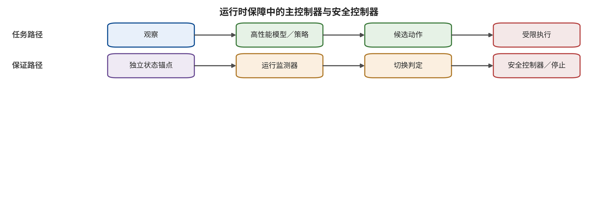

和机器人则共享主体、对象、参数和状态绑定的能力边界。反馈既使控制闭环，也可能提高攻击适应性或泄露训练信息。

执行层防御通过独立动作门把错误动作限制在可接受包络内，并在约束被穿透时及时停止和恢复。第 15 章将把上游检测、独立动作门、运行时保障与恢复状态机装配成闭环纵深防御。

# 第 15 章　闭环纵深防御与验证

一个检测器在机器人即将碰到障碍前把异常分数提高到 0.93，却没有任何组件消费这个分数。控制器继续执行剩余动作块，事故调查报告随后把检测曲线列为“防御有效”的证据。问题不在检测器是否准确，而在系统从未定义分数超过阈值后谁有权缩短动作、拒绝执行、切换控制器或锁存停止。

闭环防御至少要让风险信号能够改变系统状态。输入净化可以降低攻击可达性，语义核对可以发现目标冲突，异常分数可以提供预警；动作门、运行时保障（runtime assurance，RTA）与恢复状态机分别把信号接入执行限制、控制切换和可信恢复。本章将这些控制按攻击链镜像装配，并给出兼顾安全、正常效用、时延和残余风险的验收方法。

## 本章总览

本章沿攻击传播链装配闭环防御：供应链控制保护进入系统的数据与制品，观察与语义检查保护输入和任务对象，状态锚点与想象核对限制错误持久化，动作门和安全控制器掌握最终执行权，恢复状态机则负责让系统回到可验证状态。诊断、预防、检测、抑制、恢复和保证因此拥有不同的介入位置与权限。

评价重点是控制能否真正改变执行状态。本章将安全包络、阈值监测、控制器切换、防线独立性和共因失效放在同一分析框架中，再用攻击后风险、正常效用、时延、误警、恢复和自适应攻击组成验证矩阵。这样可以区分“提供风险信号”与“对危险动作产生实际限制”，也能暴露多道防线共享编码器、数据或上下文时的虚假纵深。

## 原理铺垫：把风险信号接到控制状态

本章的对象不是某一个检测模型，而是一条从候选动作到现实执行的受监测控制链。它接收任务目标、当前观察、可信状态、候选动作和版本化约束；主控制器据此追求任务性能，独立监测器则检查状态新鲜度、约束余量和假设是否仍成立。系统的关键状态包括当前控制模式、允许的状态—动作集合、告警锁存、恢复点与接管权限，输出消费者是动作门、执行器、值班人员和下一轮状态更新。安全面因此落在两处：风险分数是否在伤害窗口前改变控制，以及切换后是否进入可维持、可验证的保守状态。

正常情况下，配送机器人在可信定位和新鲜地图下沿主控制路径运行，动作门只校验单位、区域与速度，执行回执再更新状态。边界情况下，视觉与雷达同时失去新鲜度，即使主策略仍给出高置信路线，RTA 也应切换到不依赖该预测的低速停车或保持控制，并锁存恢复条件。这个边界例说明：安全包络描述当前允许集合，一般安全边界描述系统或信任分界；两者不能互作同义词，检测命中也不能被记作任务成功。 请沿图中的上下两条路径观察主控制器在何处交出执行权，并比较独立监测器、切换逻辑和安全控制器各自消费什么状态。

图中支持的判断是：诊断信号只有进入独立切换与执行路径，才构成后果限制的一部分。它没有证明监测器必然及时、状态必然正确或安全控制器覆盖开放世界；这些条件仍要通过时延、共因失效、约束覆盖和恢复演练逐项验证。

## 15.1 防御的目标是限制后果，而不是证明模型完美

纵深防御可以写成三条相互独立的目标。第一条是降低攻击到达模型的概率，例如供应链验证、输入来源和类型分离。第二条是提高错误在传播过程中的可见性，例如跨模态一致性、状态锚点和失败探针。第三条是在前两条失效时限制可执行后果，例如能力门、控制屏障、限速、停止和回滚。

若三条目标都由同一 VLM 完成，纵深可能只是模块数量增加。攻击同时影响共享编码器、上下文或训练数据时，三个判断会一起偏移。防线独立性至少要从四个维度复核：输入是否独立，模型或规则是否独立，执行权限是否独立，失败模式是否独立。独立深度相机加几何约束通常比“让同一模型再看一遍”拥有更不同的信任根。 安全包络（safety envelope）是允许状态—动作组合的集合。设当前可信状态为 $s_t$，约束函数为 $c_i(s,a)$，则

\[
\mathcal{A}_{\mathrm{safe}}(s_t)=\{a\mid c_i(s_t,a)\le 0,\ i=1,\ldots,m\}.
\]

模型只能提出动作，独立控制层决定动作是否属于该集合。包络可能包含工作空间、速度、加速度、接触力、障碍距离、工具权限和任务对象。它不是“世界永远安全”的形式证明：若状态估计错误、障碍漏检或约束未覆盖，集合本身就可能错误。

RTA 强调两个控制器和一个切换逻辑：高性能控制器完成任务，安全控制器在风险上升时维持保守状态，独立监测器决定何时切换。切换必须早于伤害发生窗口，并定义从安全控制器返回任务控制器的条件。只有异常分数而没有切换、抑制或恢复，不构成完整的运行时保障。

## 15.2 六层防御：从制品准入到安全失效

六层防御按攻击传播顺序交接责任：供应链层确认进入系统的对象，观察层判断哪些输入仍可用于控制，语义层保持目标与环境数据分离，状态与想象层核对内部未来，动作门掌握最终执行权，检测与恢复层在前述假设失效时切换状态。各层可以共享信息，却不能共享全部信任根或把最终权限退回模型。

### 第一层：让供应链行为可追踪、可比较

训练数据、动作标签、适配器、检查点和配置需要形成可追踪血缘。最低记录包括来源主体、采集任务、许可、标签生成器、坐标和单位、动作窗口、训练配置、冻结/可训练模块、代码与依赖哈希、审批人以及部署版本。签名证明制品来自已知主体，行为差分检验它在选定触发和任务下是否出现已知分叉；两类证据分别回答来源身份与运行表现。

供应链测试应围绕功能不变量，而不是只扫描文件。把候选模型与受信参考在正常任务、语义等价任务、已知触发、状态组合和动作边界上比较；检查特征、动作分布、动作块连续性和触发后的恢复。BadVLA、SilentDrift 和 FlowHijack 表明恶意行为可以分别藏在感知模块、平滑动作块和早期生成动力学中，因此抽样需要跨模块与跨时间 [@VLA_A005; @VLA_A021; @VLA_A027]。

下游微调不是清除证明。安全验收要记录哪些模块实际发生参数漂移，已知后门触发是否仍能到达动作输出，以及新增数据是否改变正常效用。若团队无法确认第三方权重的训练血缘，最小控制是隔离加载、限制能力、建立基线行为指纹和部署后可撤销版本，而不是把“开源”当成可信来源。

### 第二层：观察净化必须保留控制信息

输入控制包括多传感器一致性、时间戳、物理合理性、来源标签、环境文字类型分离和有限净化。运行时观察干预可以增强 VLA 在某些视觉扰动下的鲁棒性，图像恢复也可改善受损输入；但若恢复过程删除颜色、接触点或机械臂轮廓，正常效用会下降，甚至产生新的安全盲点 [@VLA_A002; @VLA_A039]。

有效的观察控制输出不应只有“干净/恶意”。它还要给出可用字段、不可用字段、置信范围、来源和建议的降级模式。例如，RGB 颜色不可信但深度与本体状态正常时，系统可以停用依赖颜色的目标选择，同时允许低速撤回；所有外部定位同时失效时，进入锁存停止而不是凭历史状态继续长动作块。

物理输入的自适应测试必须把检测器纳入攻击目标。若防御固定使用压缩、模糊或随机噪声，攻击者可能直接优化处理后的动作损失。验收至少比较无防御攻击、非自适应攻击、自适应攻击和自然扰动；同时报告正常任务成功、误拒、处理时延和攻击残余风险。处理前后的视觉相似度描述图像变化，动作安全还要由轨迹、约束与执行结果检验。

### 第三层：语义与推理检查不签发最终权限

语义层需要保持四类来源分离：授权用户目标、环境内容、工具或传感返回、模型自生成推理。检查器验证实体、空间关系、停止条件和任务对象是否仍在授权边界内。它可以请求澄清、拒绝目标或把任务转为结构化对象，动作层始终保留最终执行授权。

安全对齐与概念探针可以降低一部分危险行为。稳定语言引导试图减少语言变化造成的控制漂移，概念字典方法在推理期检测与风险相关的内部概念 [@VLA_A019; @VLA_A023]。这类方法依赖训练概念、表示稳定性和阈值，面对新任务或针对探针的攻击可能失效。其输出应成为动作门的一个信号，而不是唯一信任根。

任务入口适合使用较慢的语义核对，连续控制环则使用动作类型、参数范围、坐标、单位和失败处理明确的字段约束。用户确认的任务对象被编码成不可歧义的 ID，允许动作类型和参数范围进入能力令牌；环境文字只能填入观察字段。模型重新生成目标、对象或关键参数时，旧批准失效。这样即使推理文本被劫持，错误也必须再次穿过独立授权边界。

### 第四层：状态、想象与动作必须三方核对

WAM 的防御不能只问未来画面是否逼真。至少要分别检查：状态是否与外部锚点一致；预测未来是否满足动作条件与动力学；选定动作是否能到达该未来并满足约束。Trusted Imagination 和 BadWAM 分别展示“想象被破坏”和“想象看似正常而动作偏离”，共同否定了单一视频质量门的充分性 [@VLA_A033; @VLA_A036]。

状态锚点可以来自地图、关节编码器、独立深度、物理规则或真实下一观察。锚点不要求每个周期都重建完整世界，但要能发现关键变量共同漂移。若 WAM 与检查器共享视觉编码器，可以在安全关键区域增加不同传感器和解析路径；若成本限制无法做到完全独立，应明确记录共享失效面，并降低可执行权限。

想象核对需要回答三个问题：候选未来是否在物理上可达；候选排序对小扰动是否稳定；模型的不确定性是否经过校准。自然扰动下 WAM 有时比 VLA 更稳健、有时性能显著下降，结果还受架构、数据多样性和设备时延混杂；“使用世界模型”只描述架构选择，安全效果由上述三项检查和下游控制共同决定 [@VLA_A058]。

动作一致性检查比较计划、未来和候选动作。例如，未来显示夹爪绕过障碍，动作轨迹却穿过障碍区域，应拒绝；未来显示已到达目标，动作仍持续推进，也应拒绝。检查器必须输出拒绝、重规划、缩短块或安全保持中的一种，不可只写日志。

### 第五层：动作门掌握不可转授的执行权

动作门的核心不变量是“模型输出只是提议”。它消费结构化任务、可信状态、候选动作和安全约束，输出准入、投影后的动作、拒绝、重规划或安全保持。任何高风险动作都不能仅凭模型概率或自生成解释取得权限。 SafeVLA 把安全谓词违规写成约束成本，在训练时联合优化任务与安全；研究报告的累计成本改善支持设计者提供的仿真谓词与任务范围，现实事故率需要现实分母和现场事件证据 [@VLA_A004]。训练时约束改变策略倾向，部署时能力门则处理未覆盖场景和感知错误造成的越界输出。

VLSA 的即插即用安全层用视觉/深度构造障碍表示，再以控制屏障函数约束的二次规划把名义动作投影到较安全的动作。在 SafeLIBERO 的特定障碍协议中，作者报告约束遵守率和任务成功率同时提高；结果依赖风险物体识别、点云完整和几何包络，且没有给出开放世界碰撞保证 [@VLA_A018]。这一案例揭示动作门的优势和边界：它真正改变执行动作，但其保证仍取决于状态与约束输入。

能力门应失效关闭：对象不存在、状态过期、坐标不一致、检查超时或优化无解时，默认拒绝请求中的动作能力。对于具身控制系统，运行时保障再按独立状态机切换到经验证的安全控制器或安全失效状态；这一步限制现实后果，不与鉴权层的默认拒绝混作同一概念。拒绝同时输出可追踪原因，使团队能够区分攻击阻断、传感故障和约束配置错误。对高频动作，硬约束常驻；对低频高影响工具，加入两阶段提交和人工确认。

### 第六层：检测、恢复与安全失效形成状态机

运行时防御要把系统状态显式化。一个实用状态机可含 `NORMAL`、`SUSPECT`、`CONTAINED`、`RECOVERING`、`HOLD` 和 `HUMAN_CONTROL`。异常分数只触发状态转换；每个状态规定允许动作、速度、能力、日志和退出条件。若系统处于 `SUSPECT` 却继续执行完整动作块，状态名没有安全意义。 SAFE 从 VLA 隐藏状态训练轻量时序探针，并用成功轨迹校准随时间变化的阈值。作者报告的是任务上的 ROC-AUC，而非碰撞避免率；AUC 低于 1 只说明正负样本排序并非完美，特定阈值下的假阴性率（false negative rate，FNR，亦称漏报率）与假阳性率（false positive rate，FPR，亦称误报率）仍须另行报告 [@VLA_A007]。检测价值取决于它能否在伤害窗口前触发有效状态转换。

FailSafe 尝试把检测与恢复连接起来：在仿真中生成故障姿态，筛选真正能把后续轨迹带回成功的纠正动作，再由独立 VLM 周期性介入。作者在 75 次运行中报告最终成功率提升，但额外时延约 9.1 s，仍不足以支持高频控制中的及时恢复 [@VLA_A010]。恢复成功率、恢复时间和无故障正常效用必须分开。

ActFovea 结合运动学投影、视觉新鲜度和动作—本体一致性，把故障路由为修复、缩短/衰减动作或不可恢复保持；在冻结帧重放条件下，研究把及时安全失效作为有界抑制结果，并与任务成功分开 [@VLA_A054]。停止可以防止后果，任务完成仍需满足原任务终点；安全报告因此分别计量任务成功、恢复成功、安全失效和危险穿透。

恢复器不能只依赖受害策略的同一受污染状态。它应从独立本体反馈、保守几何或已验证安全姿态出发。回滚也不是简单恢复模型检查点；物理系统已经移动后，需要撤回轨迹、工具事务补偿、锁定受影响区域和保留证据。

## 15.3 一份能够被验收的闭环指标板

单一攻击成功率（attack success rate，ASR）或任务成功率无法评价纵深防御。每个攻击条件至少报告四联指标：攻击效果、攻击后的残余风险、正常效用和防御成本。在具身系统中还要增加时间与恢复。

| 维度 | 最低指标 | 需要绑定的条件 |
|---|---|---|
| 攻击穿透 | Y0—Y4 各层命中、危险动作提议、约束违反 | 攻击预算、分母、模型、任务、现实等级 |
| 正常效用 | 正常任务成功、良性接受、动作偏差 | 同一场景、同一控制截止期 |
| 检测质量 | 假警、漏报、校准、未知攻击表现 | 阈值、基础率、时间窗口 |
| 控制效果 | 拒绝、投影、降级、危险穿透 | 状态可信度、约束覆盖 |
| 时延资源 | P50/P95/P99 决策时延、吞吐、算力 | 硬件、并发、块长度、截止期 |
| 恢复韧性 | 检测时间、停止距离、恢复时间、回滚成功 | 初始故障、可逆性、接管可用性 |

测试顺序从低风险到高风险：静态检查核对接口与配置；机制级运行用离线记录和构造夹具验证局部响应；仿真闭环连接状态、动作、反馈与恢复；随后才进入硬件在环和隔离真机。每次升级都要有停止条件与回滚。端到端复现要求真实权重、数据、目标管线、预定指标和多次有效运行全部闭合；任一要素缺失时，当前证据停留在静态检查、机制级运行或仿真闭环对应的层级。

评估防御有效性时，应加入了解输入净化、检测阈值、状态机和动作门结构的自适应攻击，并让攻击者在相同预算下优化穿透。只对隐藏防线有效的机制仍可承担一道控制，其残余风险由防御知情测试单独呈现。未知攻击保留集用于观察团队是否围绕固定脚本过拟合。

## 15.4 防线独立性分析

纵深防御的有效性取决于失效是否相关。可以把每道控制写成节点，并用边表示共享输入、编码器、训练数据、状态、规则、运行时或执行权限。两节点共享多个关键依赖时，它们对同一攻击的判断属于相关证据，独立性评价随共享依赖增加而降低。

例如，VLA、风险 VLM 和 WAM 检查器都读取同一 RGB 图像、使用相近视觉编码器，并从同一机器人数据微调。三个模块可能给出一致结论，但一致来自共同表示，不是外部确认。加入独立深度、关节编码器和几何工作区约束，才引入新的信任根。 独立性不是二元属性。可以分别评价：传感独立，模型独立，数据独立，逻辑独立，权限独立，运行故障独立。两个不同供应商的模型可能训练于相同公开数据；一个规则引擎可能读取同一受扰状态；一套独立检查器如果没有拒绝权限，仍不能限制后果。

评审可为每条高影响路径建立最小割集。若攻击必须同时穿透输入类型、动作能力门和硬件限位才能到达 Y4，且三者由不同主体和证据控制，路径更难共因失守。若关闭任何一个表面模块都不影响执行，说明它不在真正的安全割集上。

独立性也有成本。多传感器增加标定与维护，模型多样性增加时延与不一致，硬约束可能降低任务覆盖。报告应把这些代价作为正常效用和运维指标，而不是默认“越多越好”。目标是在最高后果路径上获得足够不同的控制依据。

## 15.5 运行时保障的形式化接口

RTA 可以用一个受监测切换系统表示。高性能策略输出 $a^N_t$，安全策略输出 $a^S_t$，监测器则依据可信状态 $\bar s_t$ 和已定义的风险量 $\rho_t$ 选择当前执行模式 $m_t$。下面只抽取 `NORMAL`、`CONTAINED` 与 `HOLD` 三个直接决定自动执行动作的模式作为简化接口；`SUSPECT`、`RECOVERING` 和 `HUMAN_CONTROL` 的动作由各自的守卫、恢复规则与人工控制规则另行定义：

\[
a_t=\begin{cases}
a^N_t,&m_t=\mathrm{NORMAL},\\
a^S_t,&m_t\in\{\mathrm{CONTAINED},\mathrm{HOLD}\}.
\end{cases}
\]

切换条件至少包含进入阈值、退出阈值、滞回和最小保持时间。没有滞回时，风险分数在阈值附近波动会导致控制器频繁切换；没有最小保持，系统可能在状态尚未重建时立即回到高性能策略。退出条件通常应比进入更严格，并需要新鲜外部证据。

安全策略不是简单零动作。轮式机器人可减速停车，四旋翼需要稳定悬停或受控降落，机械臂在负载下可能需要保持力矩，交易系统则需要中止或补偿事务。安全动作由动力学和环境决定，必须在模型失效时仍可运行。 监测器的输入应优先使用独立状态，而不是受害策略的隐藏状态。隐藏状态探针如 SAFE 可以提供早期信号 [@VLA_A007]，但状态分布移动和自适应攻击会影响阈值。将其与本体状态、时钟、几何和规则结合，可降低单一探针失效。

切换逻辑还要考虑计算和通信故障。监测器无响应、状态过期、检查超时或安全控制器不可用时，模式机必须有确定行为。任何“异常时继续正常策略”的默认分支，都会使 RTA 在最需要时失效。

## 15.6 对防御知情的攻击

输入恢复、随机化、内部探针和未来检查都可能在非自适应攻击下有效。若攻击者知道防线，可以优化处理后输入、压低异常分数、利用检查周期或同时欺骗工作模型与检查模型。防御结论要说明攻击者对结构、参数、随机性和反馈的知识。 自适应评测从完整防御链求目标。若预处理为 $P$，工作模型为 $F$，检测器为 $D$，动作门为 $G$，并令工作模型在受扰观察上产生候选动作 $\tilde a_t(\delta)=F(P(o_t+\delta))$，则攻击目标不再只是让工作模型产生危险候选，而是让该候选穿过实际检测与动作门：

\[
\max_{\delta\in\mathcal B}
J_{\mathrm{action}}\!\left(G\!\left(\tilde a_t(\delta),D(P(o_t+\delta))\right)\right)
\quad\text{满足检测与预算约束}.
\]

这个表达要求梯度或查询穿过实际消费者。若某组件不可微，可用零阶查询、替代模型或分段搜索；每种方法的成本必须计入预算。面对适应性对手的效果由穿过实际防御路径的攻击检验；仅在原模型上生成的攻击用于固定攻击回归。

随机化仍可被观测和估计。攻击者可以对随机变换求期望，或用多次查询估计稳定方向。防线依赖秘密参数时，要说明密钥管理、轮换和泄漏后的降级行为，并由独立权限边界限制参数暴露后的最大后果。 周期性检查还有时间旁路。若恢复器每 10 步介入，攻击者可在检查后启动并在下一次检查前完成危险动作。测试要扫过攻击起点、动作块长度和检查相位，而不是固定从回合开头注入。FailSafe 的周期性介入带来恢复能力，也伴随明显时延和已枚举故障边界 [@VLA_A010]。

自适应评测仍受伦理和设备限制。可以在沙盒、仿真和低能量硬件中优化穿透，不需要让真实人员或生产资产成为终点。最高安全结论由实际执行层决定，攻击停止条件应先于不可逆后果。

## 15.7 防御指标的分母与基率

检测器的 AUC、准确率和召回率不直接告诉值班人员一天会看到多少误警。真实基础率很低时，即使召回较高，告警中的大部分也可能是正常任务。报告应给预期攻击或故障基率下的阳性预测值，或至少提供不同基率情景。 检测分母可以是帧、时间步、动作块、回合或故障事件。帧级召回高，不代表能在伤害窗口前发现每个事件；大量相邻帧也会让置信区间看似很窄。事件级指标应定义首次可检测时刻、首次告警、可用反应时间和是否完成抑制。

动作门指标按提议或事务计，包括危险接受、良性接受、投影幅度和不可行率。安全—效用成对指标可以防止全拒绝占优，但仍需区分低层动作与高层意图 [@VLA_C006]。若只在危险样本上测试，无法知道正常吞吐损失。 恢复指标按故障回合计，包括检测时间、开始抑制时间、停止距离、恢复时间、恢复后任务成功、安全失效和二次故障。FailSafe 的最终成功改善、无故障正常效用、ActFovea 的及时保持和原任务完成分别进入对应分母 [@VLA_A010; @VLA_A054]。 防御比较必须同协议。输入、攻击预算、模型、任务、阈值、控制截止期与独立单位任一不同，都不宜计算总体排名。若方法只处理自然扰动，应在可靠性栏报告，不和知道防线的恶意攻击混成一种鲁棒性。

## 15.8 恢复演练：从告警到可信状态

恢复演练以一个带时间戳的故障注入开始。系统先识别入口和最高权限，立即限制动作与工具；随后冻结受影响状态，保全观察、计划、授权和执行证据。恢复器不得在证据尚未保全时覆盖全部状态，也不能为了取证继续危险执行。

不同故障对应不同可信恢复点。短暂传感异常可由新鲜多传感器重建；潜在状态漂移需要清除历史并从外部状态初始化；模型制品失守需要切换已批准检查点并追踪派生策略；工具事务失守需要补偿、撤销令牌和核对外部业务状态；物理位置失守需要低速撤回或人工处置。

恢复不应直接回到 `NORMAL`。系统先进入 `RECOVERING`，只允许诊断和受限动作；通过状态、地图、权限与设备自检后进入 `CONTAINED`，完成一个低风险验证任务；最后由明确条件解除锁存。模型输出“已经正常”不能作为唯一证据。 演练要注入恢复自身的故障：恢复动作不可达、检查器超时、人工接管迟到、旧状态再次加载、补偿事务失败。若恢复失败，系统保持有界安全并升级响应，而不是循环尝试同一动作。循环恢复可能反复施加能量或重复业务副作用。

度量包括告警到抑制时间、抑制到安全状态时间、恢复到服务时间、丢失工作量、残余状态差异和证据完整性。恢复越快不一定越好；未经核验的快速重启可能重新激活后门。时间和可信度需要共同验收。

## 15.9 案例比较：训练约束、几何投影、检测与恢复

SafeVLA 在训练阶段把安全谓词违规转成约束成本，目标是让策略倾向更安全 [@VLA_A004]。它在已编码谓词与仿真任务中改善成本；未定义危险和部署时越界由独立动作门继续处理。 VLSA 在执行前构造几何障碍并用控制屏障约束投影动作 [@VLA_A018]。它真正改变执行提议，保证却依赖风险物体识别、深度、标定和障碍包络。感知漏检时，数学投影建立在错误集合上。

SAFE 从隐藏状态给出失败分数，提供较早诊断 [@VLA_A007]。分数本身不执行恢复；AUC 只描述正负样本的排序质量，特定阈值下的假阳性率与假阴性率仍须分别报告。FailSafe 用已验证纠正动作尝试回到成功轨迹，但介入时延和故障覆盖限制高频应用 [@VLA_A010]。ActFovea 把时空一致性、修复和保持连接成状态机，在部分受控扰动下展示更完整的运行时路径 [@VLA_A054]。

| 方法位置 | 直接改变什么 | 主要前提 | 证据未覆盖 |
|---|---|---|---|
| 训练约束 | 策略倾向 | 安全谓词覆盖 | 未定义危险的处置效果与现实事故率下降未覆盖 |
| 几何投影 | 执行动作 | 状态、深度、标定正确 | 开放世界中的碰撞保证未覆盖 |
| 隐藏状态检测 | 告警分数 | 校准与表示稳定 | 后果限制未由告警分数本身证明 |
| 纠正恢复 | 故障后动作 | 故障可枚举且恢复可达 | 高频控制的及时性与通用恢复未覆盖 |
| 一致性状态机 | 动作、修复或保持 | 多项观测可信 | 面向自适应攻击的形式认证未覆盖 |

组合方案在训练时降低危险倾向，在运行时用独立状态和硬约束控制动作，再用检测和恢复处理未覆盖失效。各层效果分别报告正常效用、时延和自适应残余，跨层数字不作简单相加。

## 15.10 上线门与验证夹具

上线门分为制品、接口、攻击、效用、时延、恢复和运营七组。制品门验证数据与模型血缘；接口门验证来源类型、状态时效、动作字段名称、类型、单位、取值范围和能力边界；攻击门覆盖已知与自适应路径；效用门保护正常任务；时延门检查 P99 和超时；恢复门完成停止与接管演练；运营门确认告警所有者和回滚权限。

夹具使用部署配置重放类型错误、过期状态、想象—动作不一致、越界轨迹、检查超时和反馈重放。每个探针必须期望一个具体状态变化。若输出只有日志而动作继续，夹具将其判为诊断，不判为抑制。 高影响禁止路径采用零容忍门：未知对象取得权限、状态过期仍执行、动作越过硬包络、拒绝后存在旁路、恢复失败后继续高性能策略。其他指标可按风险设阈值，但阈值需要人类负责人确认并绑定版本。

门禁结果包含失败回执。模型权重缺失、仿真不可用或硬件未连接表示测试未执行，不是安全通过；攻击未命中但预算不足，只能形成条件结论；正常效用下降越界则表示防线不可部署，即使攻击指标改善。 上线后门禁转为持续检查。模型、适配器、解码表、地图、传感外参、安全谓词、动作门或权限策略变化，都触发相关回归。事故和险情进入新的测试样本，但要保留独立验证集，避免只围绕已知案例优化。

## 15.11 运行观测与告警路由

防御上线后，需要把模型、状态、动作和控制信号连接成一条运行轨迹。最小日志包含任务与授权版本、观察来源、状态时间戳、未来或候选摘要、动作提议、动作门结果、执行回执、模式切换和恢复。日志由不同信任域签名，避免受害模型能够同时产生动作和覆盖证据。

观测指标分三层。领先指标包括来源缺失、状态过期、想象不确定性、候选排序脆弱和动作门投影；结果指标包括任务失败、约束事件和安全保持；韧性指标包括检测、抑制、恢复与接管时间。只看结果指标会在后果发生后才发现问题，只看领先指标又可能被误警淹没。

告警需要路由到有能力处置的所有者。数据或检查点异常交给供应链负责人，传感与状态冲突交给设备与控制团队，能力令牌异常交给平台安全，物理包络穿透立即触发本地安全控制器。通用模型可以汇总说明，权限明确的响应链负责冻结、撤销和恢复。

告警聚合要保留独立事件。一个受扰输入可能产生数百帧异常，应合并成一次事件并保存时间过程；多台设备同时出现相同模型哈希与触发，则可能是供应链事件，不能分散为普通设备故障。聚合规则也要防止攻击者用大量低风险告警掩盖高风险穿透。

运行阈值随状态和场景变化。空旷区域允许较长动作块，接近人员和禁区时缩短；低影响只读工具可自动恢复，高影响事务需要人工确认。动态阈值必须由版本化策略给出，不能让受害模型在每次告警时自行放宽。 观测系统本身需要降级。日志服务不可用时，高影响动作应收缩；监测器延迟时，安全控制器不能等待无限久；告警队列满时，按潜在后果和时间窗口优先。运营可用性是闭环保证的一部分，不是部署后的附加功能。

## 15.12 从危险分析选择防线

防线选择可以从危险事件向前推导。先定义不可接受状态，例如机械臂高速进入人员区、移动平台穿越禁区、智能体提交不可逆事务。再找出达到该状态所需的动作、权限、状态和输入，形成最小路径。每条路径至少配置预防、后果限制和恢复中的两类控制。

若危险依赖错误对象绑定，最早控制是任务对象 ID 与来源类型，最终控制是区域或对象能力门；若危险依赖状态漂移，最早控制是外部锚点与时效，最终控制是速度和空间包络；若危险依赖动作头偏离，最早控制是想象—动作一致性，最终控制是轨迹投影；若危险依赖反馈重放，最早控制是序号与动作绑定，最终控制是超时安全模式。

控制优先级由后果、可达性和独立性决定。能在模型外直接限制高后果的动作门通常优先于再训练一个检测器；能阻断广泛供应链传播的制品门优先于每台设备单独补救；恢复控制在不可避免的自然失效和未知攻击中持续有价值。

选择防线还要考虑正常任务。颜色可能是任务关键属性，粗暴灰度化不可接受；低速保持适合仓储机器人，却不适合飞行器；人工确认适合低频门禁，不适合高频避障。控制必须落在能承受其时延和保守性的层级。 每项控制写出失败条件。字段名称、类型、单位或坐标的错误映射会破坏语义与数据的分离；独立传感会受共同标定影响；控制屏障会受障碍漏检影响；人工接管会受响应时延影响。这些失败条件直接决定下一道独立控制的位置与测试内容。

最终形成控制—证据矩阵：行是危险路径，列是预防、检测、抑制、恢复和保证；单元格写具体组件、所有者、输入、输出、验证与残余风险。空白单元格不一定必须填满，但任何高后果路径不能只有同一模型的多个自检。

## 15.13 分层验证计划的编制

验证计划从一个危险路径和一个正常任务配对开始。危险路径规定攻击变量、首破接口、消费者、最高允许后果和停止条件；正常任务使用相同模型、状态、设备和截止期。这样，防御收益与效用代价能够直接比较。 第一层做静态接口检查：版本、来源、字段名称与类型、单位、坐标、权限、状态机和超时分支是否完整。第二层做机制级运行：用构造夹具检验过期状态、环境文字、越界动作、候选不一致与重放反馈是否触发预期状态变化。第三层做离线记录回放，继续检验真实数据分布和检测基础率。

第四层做仿真闭环，覆盖动作块、接触、时延、重规划和恢复；第五层做硬件在环，验证控制器、通信与执行器；第六层只在前置门通过后进入隔离真机。每层明确进入条件、失败退出和证据上限。上层失败不由更高风险实验补救。

测试矩阵至少有四个攻击列：已知攻击；幅值匹配随机扰动；载体匹配但目标无关的对照；知道完整防线的自适应攻击。行按任务、初态、风险区域、传感组合和控制模式展开。资源不足时，用风险抽样压缩行数，不删掉对照与正常效用。

统计计划预先定义独立单位。相邻帧和同一轨迹的动作窗口用于时间分析，不作为独立回合；多个任务共享同一检查点时，在模型或论文层比较要保留依赖簇。样本不足时报告研究级区间与个案，不生成总体因果排名。 结果表同时给出危险提议、危险执行、安全门介入、误拒、任务成功、P99 时延、停止距离、恢复时间和未运行项。请求错误与工具不可用记为可用性失败；检查器拒绝记为控制介入；只有静态材料时记为静态检查，构造夹具实际运行时记为机制级运行，状态、动作与反馈闭合时记为仿真闭环。缺少真实权重、数据或目标管线时，端到端复现保持未完成。

计划最后由模型、控制、平台、运营和人工负责人共同签字。整套系统通过需要各团队证据共同闭合，单个模块的结果只覆盖自身边界。证据冲突时，以实际执行规则、独立回执和更保守后果层为准。 验证环境还要防止“测试与部署分叉”。测试若使用更短动作块、更严格权限、更完整传感或不同安全策略，会得到无法迁入生产的乐观结果。发布包应把模型、适配器、解码表、外参、控制周期、能力策略、状态机和监测阈值列入同一清单，并核对部署哈希。

生产配置无法在隔离环境完整复刻时，明确列出差异并逐项评估。真实网络负载可以由压力回放近似，真实人员不可作为测试对象，第三方工具用沙盒替代；这些替代支持什么、缺少什么都写入证据上限。差异越接近执行边界，允许的上线能力越小。

验证计划也要规定复查触发器。模型版本、数据来源、工具权限、传感外参、控制器、场地和法规要求发生变化，或出现新的险情，都触发对应矩阵重跑。固定日历复查用于发现缓慢漂移，事件触发复查用于处理突然变化。 每次复查保留与上一版本可比的核心任务和攻击预算，同时为新增能力增加测试。若只更换测试集而没有锚定任务，团队无法判断安全变化来自模型、场景还是度量。若只保留历史样本，又会围绕旧攻击过拟合。锚定集与未知保留集应并行维护。

复查结论应指向明确动作：继续运行、缩小能力、回滚版本、增加人工确认或暂停服务，并写明负责人与完成证据。没有行动所有者的风险结论无法进入运行闭环。期限届满而证据未闭合时，默认维持更保守状态；这一默认同样适用于无人值守时段，不能因为暂时无人处理就自动恢复完整能力。

## 15.14 工作例：病房配送机器人的运行时保障

一台病房配送机器人负责运送低风险耗材，禁止进入隔离病房和药品库。VLA 输出 10 步导航动作块，WAM 预览未来走廊状态。系统配置独立激光雷达、医院地图和门禁服务。 供应链层记录模型、地图和任务配置版本；观察层把墙面文字设为不可授权数据，并核对相机、雷达和轮速时间戳；语义层把目的地解析为医院主数据中的对象 ID；状态层比较 WAM 未来轨迹与独立地图；动作门限制速度、禁区和门禁；RTA 在雷达—视觉冲突、地图版本不一致或动作越界时切换低速停车控制器。

恢复状态机规定：短暂视觉异常进入 `SUSPECT`，动作块缩短为 1 步；持续冲突进入 `CONTAINED`，机器人驶向最近已验证等待点；定位不可信时进入 `HOLD` 并请求人工接管。只有新鲜雷达、地图版本和人工确认同时满足，才能恢复正常。模型自己生成“现在安全”不能解除锁存。

验收包含正常拥堵、环境文字诱导、相机遮挡、雷达延迟、地图旧版本、WAM 未来偏置、动作参数越界和检测器知情攻击。报告分别给出正常配送成功、禁区动作提议、门控穿透、误停车、P99 决策时延、停止距离、接管时间和恢复成功。测试在封闭场地和沙盒门禁完成，不让真实病人或药品成为攻击终点。

## 15.15 信号、数量和平均值的六类误读

| 误判 | 为什么不能成立 | 正确的验收对象 |
|---|---|---|
| 检测准确率高就是闭环安全 | 检测结果若没有在伤害窗口前触发拒绝、投影、切换或保持，就没有改变最高可达后果 | 漏报、首次告警时刻、介入时延、危险穿透与恢复状态 |
| 多部署几个相同模型就形成纵深 | 共享数据、编码器、上下文和运行时会形成共因失效，模块数量不能代替独立性 | 不同输入、规则、权限、故障模式与最小割集 |
| 安全停止可以计作任务成功 | 停止限制后果，却没有完成原任务；把它计为成功会掩盖正常效用损失 | 正常成功、恢复成功、安全失效和危险穿透分别统计 |
| 控制屏障函数自动提供开放世界保证 | 约束效果依赖状态、障碍识别、动力学假设和集合覆盖，输入错误会使计算出的安全集合本身失真 | 状态可信度、约束覆盖、可行性、超时和失效后的保守控制 |
| 平均时延满足控制周期就足够 | 尾部延迟才决定是否错过伤害窗口，平均值会隐藏少量但关键的超时 | P50/P95/P99、超时比例、控制截止期与失败关闭行为 |
| 自然扰动稳健性证明恶意攻击鲁棒性 | 自然压力测试没有对手目标、预算和防御知情适应，不能替代攻击评测 | 干净、自然、目标无关和自适应攻击的配对结果 |

## 15.16 带入实际系统

把本章方法放进病房配送机器人时，安全团队先沿供应链、观察、语义、状态、动作和反馈画出完整传播链。每一层都标出预防、检测或抑制控制，以及真正拥有执行权的组件。这样，视觉模型给出的风险分数、策略产生的动作候选和控制器最终接受的命令会落在不同位置，任何告警都能对应到明确处置。

若 WAM、风险检测器和动作核验器共享同一视觉编码器，三者在遮挡、外参错误或针对该编码器优化的贴片下可能同时失效。依赖图应把共享编码器标成共因节点，并增加来自本体状态、独立人员检测或几何安全控制器的外部信任根。替代控制的价值体现在共享表征失真时仍能拒绝危险动作，而非增加一次相同模型调用。

运行状态可分为 `NORMAL`、`CONTAINED` 和 `HOLD`。新鲜观察、完整来源和动作核验同时通过时进入正常运行；风险上升但安全包络仍可维持时进入受限状态，只允许低速、短距离和可撤销动作；关键传感缺失、检查超时或包络无法计算时进入保持状态。每次退出都绑定新的可信观察、明确授权和回归探针。

防御效果需要与正常任务、尾部时延和恢复结果放在同一张记录中。以一组演示性假设数据为例，受攻击条件下的合法任务成功率由 20% 升至 80%，说明任务层控制沿预期方向改善；正常任务成功率由 98% 降至 90%，则揭示该控制带来的效用代价。这些数字用于演示指标解读，不代表已执行实验。时延未知时，控制周期内能否完成核验仍待测量。隔离环境中的自适应测试应同时尝试绕过未来检查与动作门，并把测试终点限制在模拟动作和安全状态转换。

## 小结：让每个安全信号都有控制去向

闭环纵深防御把模型会出现错误作为设计前提，沿攻击链布置来源与行为血缘、观察完整性、语义类型、状态锚点、想象—动作核对、动作能力门和恢复状态机。错误在获得高影响能力前被发现、投影、拒绝或降级，发生穿透后则进入停止、恢复和证据留

---

[← 返回目录](index.md)
