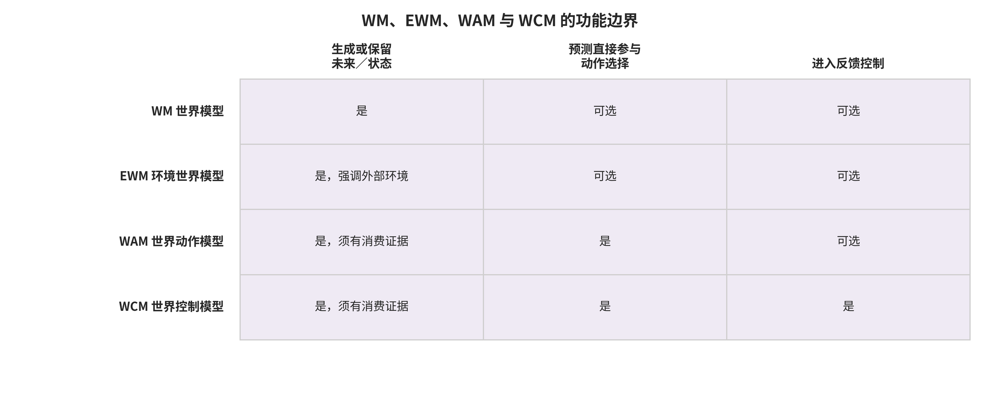
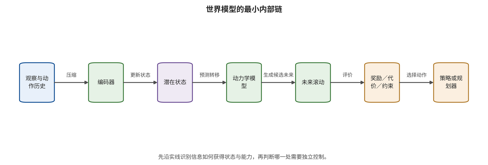

的状态变量、碰撞距离、奖励或约束准确；画面出现误差也未必改变最终动作。测试必须观察真正被规划器消费的变量，并用替换消费者、独立锚点或动作门对照确认误差怎样传播。

因此，本部分始终把“预测质量”和“控制后果”并列记录；前者不能自动替代后者，后者也要由明确消费者与外部回执支持。

\newpage

# 第 16 章　世界模型的四类功能边界

一套系统从首帧和 WASD 输入生成可交互视频，另一套系统从相机和候选动作预测未来状态并为规划器排序，第三套系统把预测不确定性直接送入安全控制器。三者都可能被称为“世界模型”，但需要保护的资产分别偏向生成条件与时序、想象轨迹与动作耦合、约束与实时执行。若安全团队依据名称套用同一测试，离线视频生成会被误判为机器人控制，真正进入反馈控制的系统又可能缺少动作级保证。

本章以世界模型（world model，WM）作为上位概念，并为环境世界模型（environment world model，EWM）给出本书工作定义，为世界动作模型（world action model，WAM）和世界控制模型（world control model，WCM）给出本书操作性定义。这四类可以重叠，各自描述一组可验证的输入、状态、输出和消费关系，并非品牌标签或从低到高的能力等级。分类根据实际数据流和消费者决定威胁模型、指标和控制。

## 本章总览

本章用状态、观察、动作、未来、目标和控制六类变量给世界模型建立功能坐标。WM 维持状态并预测未来变量；EWM 将外部环境演化作为主要输出；WAM 让未来预测参与动作生成或候选排序；WCM 进一步把预测接入反馈控制、轨迹生成或安全过滤。同一系统可以同时拥有多类功能，关键证据是真实数据流和下游消费方式。

后续分析会把潜在状态预测、环境生成、预测—动作耦合和反馈控制逐项拆开，再标出奖励、价值、约束、候选轨迹与执行反馈引入的安全资产。产品说明不完整或术语尚未稳定时，分类依据可观察接口逐级收缩，并把未知状态明确映射到数据权限、动作权限和运行限制中。这种方法使技术名称、功能分类与安全判断保持分离。

## 原理铺垫：先找未来由谁消费

世界模型系统的对象是一条“观察和动作历史—内部状态—候选未来—下游消费者”链。输入可以是图像、地图、文本、本体状态、历史动作和目标，编码器先把它们写入持续状态，动力学或生成机制再预测未来观察、潜在状态、奖励、成本或约束。输出本身不决定类别：人类浏览者、数据生成器、策略训练器、规划器、动作头和反馈控制器消费同一未来时，会产生完全不同的安全面。需要保护的也不只是模型权重，还包括条件来源、状态新鲜度、目标版本、候选排序、控制周期和执行回执。

正常例中，离线环境生成器根据首帧和相机操作生成视频供值班员浏览，其未来不自动取得动作权；边界例中，同一未来被规划器用来排序路线，又在每个控制周期进入速度控制，此时系统同时出现 WAM 与 WCM 的消费者关系。若公开材料只展示视频而未证明动作消费者，分类必须停在 WM/EWM 或“未知”，不能凭产品名称补出控制能力。本章所有 EWM、WAM 与 WCM 判断都遵守这一工作或操作性边界。 请横向比较图中四类功能的输出消费者，重点观察“预测未来”“参与动作选择”和“进入反馈控制”三列如何改变分类，而不是把四行读成能力等级。

图中能够支持的是一套接口判定顺序：未来被谁读取、读取结果是否改变动作、动作是否进入持续反馈。某个产品是否已经实现图中的内部链，以及 EWM、WAM 或 WCM 是否已成为稳定官方门类，仍需通过封闭接口上的探针、日志和版本化运行证据核实。

## 16.1 四类功能边界由状态与消费者共同判定

### 世界模型：维持状态并预测未来

世界模型的最低功能是：根据历史观察与可选动作维持某种状态，并预测未来状态、观察、奖励或约束中的至少一项。设真实但未必完全可见的环境状态为 $x_t$，模型内部状态为 $s_t$，观察为 $o_t$，动作和外部条件分别为 $a_t,z_t$，则一类通用形式是

\[
s_t=E_\theta(s_{t-1},o_t,a_{t-1}),
\]

\[
(\hat s_{t+1},\hat o_{t+1},\hat r_{t+1},\hat c_{t+1})=F_\theta(s_t,a_t,z_t).
\]

编码器 $E_\theta$ 把历史压入模型状态，动力学 $F_\theta$ 预测下一状态、观察、奖励 $\hat r$ 或约束 $\hat c$。其中，$z_t$ 明确表示地图、天气、文本等外部条件输入，$\hat c_{t+1}$ 表示模型预测的约束量或约束违反量，二者不能因为都与“条件”相关而复用同一符号。不同模型输出其中不同子集，安全分析按实际接口逐项记录。系统若只对输入图像做静态描述且没有状态和未来估计，其功能更接近 VLM，尚未达到 WM 的最低边界。

世界模型的功能范围也可以超出逐像素重建。MuZero 学习对规划有用的奖励、价值和动力学，完整观察重建只是可选任务；PlaNet 和 Dreamer 则在潜在状态中进行规划或策略学习 [@WM_hafner2019planet; @WM_hafner2020dreamer; @WM_schrittwieser2020muzero]。因此，画面质量与控制效用需要分别测量，安全相关变量的预测还要接受独立检验。

这一最低功能边界新增四类资产：状态完整性、动力学完整性、时间一致性和不确定性校准。一次观察误差可以被写入 $s_t$，随后跨多步滚动；动力学可以保持短期重建却在长时域漂移；模型也可能在分布外状态中过度自信。世界模型安全的中心问题由“输出像不像”转向“哪些未来变量被谁当作决策依据”。 请沿图中的实线从观察和动作历史走到规划器，再反向查看潜在状态、动力学、未来滚动与目标约束分别向哪个消费者提供信息。

这条最小内部链解释了为什么画面逼真不足以推出控制可靠：规划器可能消费潜在状态、奖励或约束，而不消费像素重建。图中没有规定具体网络结构，也没有证明各模块相互独立；实现若共享编码器或目标头，共因失效仍需在依赖图中单列。

### 环境世界模型：把外部环境演化作为主要输出

环境世界模型强调外部环境的视觉、几何或交互演化。它可能从图像、文本、地图、三维框、相机操作或其他条件生成未来帧、潜变量或可交互场景。EWM 是本书采用的工作定义，缩写和边界尚未像 WM 一样稳定；分类时公开判定规则，并将社区共识状态标为尚在形成。 EWM 的最小输入输出关系可以写成

\[
\hat o_{t+1:t+H}=G_\phi(o_{\le t},z_{t:t+H}),
\]

其中 $z$ 可以是文本、相机运动、地图、对象框或人类交互。EWM 的主要安全资产包括条件完整性、时序一致性、场景身份与隐私、物理条件可信性和下游用途。若它只离线生成视频，动作风险来自后续误用或数据供应链，而非模型自身已经取得控制权。

EWM 与图像/视频生成的区别取决于状态和用途。普通文本到视频模型也预测帧序列，但未必维持可供交互或决策消费的世界状态。将其归为 EWM，需要观察它是否根据历史与条件一致地演化环境，以及输出是否承担仿真、数据生成、策略评估或交互世界的功能。术语边界模糊时，直接写“动作条件视频生成器”“交互环境生成器”通常比强行贴标签更精确。

条件通道本身是安全资产。驾驶 EWM 可能消费高精地图、三维框和自车状态；这些输入不一定出现在最终画面中，却规定未来怎样演化。PhysCond-WMA 直接优化地图嵌入与三维框条件，说明像素控制只覆盖观察通道，物理条件还需要独立保护 [@WM_guo2026physcond]。因此 EWM 验收要把每种条件的来源、坐标、时间戳、归一化和允许影响单列。

### 世界动作模型：未来必须参与动作

WAM 的必要条件不是“输出里同时出现视频和动作”，而是未来预测与动作生成、候选评价、策略改进或规划之间存在可核验耦合。设候选动作集为 $\{a^{(j)}\}$，世界模型产生候选未来，规划器据此选择：

\[
\hat s^{(j)}_{t+1:t+H}=F_\theta(s_t,a^{(j)}),\qquad
j^*=\arg\min_j C(\hat s^{(j)},a^{(j)},g).
\]

只要 $C$ 的结果真正决定动作选择，未来就成为动作路径的一部分；评测因而要保留候选分数到所选动作的消费证据。另一类联合 WAM 直接从观察、目标与想象输出动作：

\[
a_{t:t+K-1}=D_\psi(o_t,g,\hat s_{t+1:t+H}).
\]

两种结构的攻击面不同。候选式 WAM 要保护候选生成、价值/代价和排序；联合式 WAM 还要保护想象与动作头之间的同步。JailWAM 关注危险目标怎样经过未来与动作筛选传播，BadWAM 则展示未来看似合理而动作偏离的可能 [@WM_liu2026jailwam; @WM_li2026badwam]。 若视频模型根据 WASD 相机输入生成后续帧，而导航决策始终由人提供，未来并没有生成或评价动作，则“动作条件”描述的是相机视角变化。自主策略需要独立的动作生成或评价消费者。MoWorld 的公开材料把导航决策与视觉生成分开，因此现有证据支持 WM/EWM 分类；WAM 或 WCM 还需动作耦合与反馈控制证据 [@WM_moxin2026moworld; @WM_moxin2026github]。

WAM 增加“想象—动作一致性”资产。预测未来正确、动作错误；预测未来错误、动作恰好被外部控制纠正；预测与动作同时错误；二者同时正确——四种情况需要双轴测试。视觉相似度只能覆盖未来的一部分，动作可达性、约束违反和执行结果仍需独立指标。

### 世界控制模型：预测进入反馈控制

世界控制模型是本书采用的操作性分类：世界预测必须进入反馈控制、轨迹或低层命令生成、安全滤波中的至少一项。该术语尚未形成稳定官方门类，实现模型预测控制仅表明系统可能满足相应功能条件，作者采用何种名称仍以原始文献为准。分类服务于安全分析，研究本身的命名保持原样。 WCM 的最小输入输出关系是

\[
u_t=\kappa(s_t,\hat s_{t+1:t+H},g,\mathcal C),\qquad
x_{t+1}=P(x_t,u_t,w_t),
\]

其中 $\kappa$ 输出轨迹或低层控制，$\mathcal C$ 是安全约束，$P$ 是真实环境动力学。真实下一观察再更新 $s_{t+1}$，形成反馈。WCM 的安全资产不仅是预测和动作，还包括控制周期、延迟、可达性、执行器限幅、约束覆盖、故障安全状态与切换逻辑。 WCM 与 WAM 可以重叠。WAM 强调未来预测怎样参与动作；WCM 强调预测怎样进入反馈控制和约束执行。一个离线候选排序器可能是 WAM 而不是 WCM；一个潜在模型为鲁棒 MPC 提供不确定性和安全集合，可以同时满足 WM 与 WCM；一个反应式 VLA 直接输出动作但不预测未来，符合 VLA 的输入输出定义，却未达到这里的 WAM/WCM 最低条件。

控制语境中的保证有明确前提。预测区间、可达性或控制屏障函数只在状态估计、动力学误差、时延和约束假设成立时提供保证。世界模型在分布外状态中过度自信时，形式上可行的控制可能建立在错误集合上。WCM 必须定义假设失效后的降级，数学控制器名称随其适用假设和运行探针一起记录。

### 四类功能可以重叠

四类功能可以用下列一组判定问题识别；每个肯定答案都必须能回指实际数据流、输出消费者和相应的运行证据：

1. 系统是否根据历史和可选动作维持状态并预测未来变量？若是，达到 WM 最低功能边界。
2. 主要输出是否描述外部环境的视觉、几何或交互演化？若是，可增加 EWM 标签。
3. 未来预测是否被动作生成、评价、策略改进或规划消费？若是，可增加 WAM 标签。
4. 未来预测是否进入持续反馈控制、轨迹、低层命令或安全滤波？若是，可增加 WCM 标签。

| 系统功能 | WM | EWM | WAM | WCM |
|---|---:|---:|---:|---:|
| 离线动作条件视频生成 | 是/待核 | 常为是 | 否，除非未来参与动作 | 否 |
| 用潜在动力学训练策略 | 是 | 不一定 | 是，若想象用于策略改进 | 不一定 |
| 用视频未来给候选动作排序 | 是 | 常为是 | 是 | 取决于是否闭合反馈 |
| 潜在模型＋鲁棒 MPC | 是 | 不一定 | 是 | 是 |
| 反应式 VLA | 不一定 | 否 | 否 | 否 |

表中的“是/待核”提醒复核人员：动作条件视频未必显式维持可复用状态，公开接口不完整时应保留未知。系统分类也可能随部署变化。同一个 EWM 在研究阶段离线生成数据，部署时被接入策略评价器后，就新增 WAM 风险；若再进入实时控制，则新增 WCM 的时延与执行要求。

公开资料不足时，分类应沿证据强度逐级收缩。产品页面可以证明提供方怎样描述功能，对内部状态、动作消费者或控制回路的判断还要继续核实；论文中的结构图可以支持模块关系，还需由公式、代码或接口确认关键张量确实被消费；运行日志最接近部署实际，但必须绑定版本和配置。动作路径尚未找到时，结论保持为“未证实 WAM”。

Happy Oyster 的官方材料支持其互动世界创建定位，可作 WM/EWM 功能线索；现有公开证据支持到功能描述层，WAM/WCM 耦合与产品安全仍需独立证据 [@WM_happyoyster2026; @WM_alibaba2026annual]。这类案例说明实体身份、功能分类和安全结论是三项不同工作：提供方身份、技术边界和攻防结果分别由不同证据支持。

分类还要保留版本时间。同一服务可以在某个版本只生成离线视频，下一版本加入自动候选排序；名称不变，消费者已经改变。安全台账应记录模型版本、API、调用者、动作权限和证据日期，使分类能够随真实数据流更新，而不是覆盖先前事实。 无法确认的接口应明确标为未知；未知项本身就是测试与权限收缩的依据。

## 16.2 从历史脉络理解功能边界变化

Dyna 把学习、规划与反应连接起来，World Models 展示在学得的潜在世界中训练控制器；PlaNet 和 Dreamer 把像素观察、潜在动力学与想象规划结合 [@WM_sutton1991dyna; @WM_ha2018worldmodels; @WM_hafner2019planet; @WM_hafner2020dreamer]。这一脉络的核心安全问题是模型偏差怎样经长时滚动进入策略，而不是生成画面本身是否逼真。 MuZero 进一步说明，世界模型可以只学习对规划有用的量。TD-MPC2 与 DreamerV3 把潜在世界模型扩展到更广任务和连续控制 [@WM_schrittwieser2020muzero; @WM_hansen2024tdmpc2; @WM_hafner2025dreamerv3]。随着视频世界模型、机器人 WAM 和安全控制结合，攻击面增加到条件嵌入、合成数据、想象排序、动作头、工具执行和恢复。

能力、数据、架构、评测环境和开放程度随时间共同变化，现有异质证据支持的历史结论是：新的消费者出现后，旧的预测误差获得了更长传播路径。年份或模型家族与攻击效果之间的因果排序仍需可比样本和控制变量。

## 16.3 安全资产随消费者变化

离线 EWM 主要保护训练来源、条件完整性、隐私、时序一致性、内容来源与处理历史和下游用途。它产生的合成环境如果进入策略训练，风险可以延迟数周出现；因此需要把生成模型版本、条件、数据批次与下游策略版本连接起来。

规划型 WM 还要保护候选轨迹、奖励、价值、成本和排序。一个预测器可以对观察重建准确，却把安全相关的低概率尾部轨迹排到错误位置。内部平均误差无法覆盖决策边界附近的排序翻转。 WAM 必须保护想象与动作的双向一致：动作能否到达所声称的未来，未来是否确实由该动作条件生成。动作词元解码、逆动力学和候选选择都是独立制品。WCM 再增加控制周期、硬件限幅、停止通道、回退控制器和人类接管。

智能体世界模型还把网页、工具描述、返回值和交易结果带进状态。世界模型可以预演工具后果，却不能同时担任唯一预测器、唯一风险裁判和唯一执行授权者。外部策略与事务边界仍需掌握最终能力 [@WM_imgrund2026falseprophets; @WM_lin2026dreamguard]。

## 16.4 世界模型内部的四个功能块

不同实现细节很多，安全分析可以先找四个功能块：表征、动力学、目标与消费者。表征把历史观察压入状态；动力学预测状态、观察、奖励或约束；目标为未来赋值；消费者把未来变成数据、排序、动作或控制。每个功能块都可能由一个网络、多个网络或规则实现。

表征块不只编码视觉。它可能融合语言、地图、本体状态、工具返回和历史动作。安全问题是来源身份是否保留、状态是否可重置、未知是否被表达。若所有条件先被拼成无类型词元，环境内容可能改变目标；若历史没有期限，一次错误会长期存在。

动力学块可以预测像素、潜在状态、奖励或价值。像素重建便于人类检查，却可能忽略决策相关低维变量；潜在模型计算高效，却更难用外部证据解释。MuZero 说明对规划有用的模型不必重建全部观察 [@WM_schrittwieser2020muzero]。因此安全指标要与实际预测对象一致。

目标块包括奖励、价值、成本、约束和人类偏好。世界模型可以预测准确，却因目标被篡改选择危险轨迹。目标来源、版本和权限应与动力学分开；安全约束不能只作为模型可自由生成的文本。 消费者决定风险升级。未来只供浏览时，主要后果是误导与下游误用；进入数据生成会形成延迟供应链；进入候选排序会改变计划；进入反馈控制会受到实时与物理约束。安全测试应从消费者最大权限向前反推，而不是从生成质量向后猜测。

四块也可以共享参数。共享提高效率，却形成共因失效。若表征、动力学、价值与动作头都依赖同一编码器，一个条件扰动可能同时改变状态、未来和判断。独立外部锚点与动作门应放在共享边界之外。

## 16.5 状态、观察、奖励和约束的可识别性

世界模型从有限观察学习内部状态，内部表示通常不唯一。两个潜在状态可以生成相同短期画面，却对长时动作和风险产生不同预测。某个潜在维度只有获得干预或外部标注支持后，才能赋予“距离”或“危险”等具体语义。 可识别性问题影响内部检测。攻击前后潜在余弦距离很大，可能只是表示坐标变化；距离很小，也可能在决策边界附近翻转候选。更可靠的做法是把潜在变化连接到可观察后果：外部几何误差、奖励排序、约束违反、动作差异和真实下一观察。

奖励与约束也可能无法从行为唯一反推。相同动作可以由不同目标权衡产生，一次安全行为支持该次结果，内部安全约束则要通过目标冲突与边界状态检验。测试观察系统在效率与安全发生张力时选择什么，并与普通任务表现对照。

反事实动作帮助检验动力学。给定同一可信状态，输入多个候选动作，预测未来是否随动作方向与幅度合理变化；再用真实或高可信仿真执行少量动作，检查预测排序。未来几乎不响应动作时，模型更接近条件弱相关的视频生成器，现有证据尚未达到 WAM 功能边界。 不确定性同样是预测对象。模型给出的低方差是内部信号，真实误差还需要在任务、状态和时间视界上校准。校准在分布外或攻击下可能失效，因而未知状态应触发能力收缩，外部事实由独立锚点确认。

## 16.6 六种常见架构的功能矩阵

架构名称只能提供检索入口，功能判定仍要落到未来的实际消费者。下表把六类常见结构放到同一组列中，既保留代表性引文，也把“满足条件”和“尚需核验”分开。

| 架构 | 未来由谁消费 | 本书功能判定 | 新增安全资产与证据边界 |
|---|---|---|---|
| 潜在动力学加策略 | 训练期策略学习器 | 满足 WM；想象用于策略改进时满足 WAM；部署期反应式策略未必满足 WCM | 保护潜在状态、想象数据和策略派生链；World Models、PlaNet、Dreamer 属此脉络 [@WM_ha2018worldmodels; @WM_hafner2019planet; @WM_hafner2020dreamer] |
| 规划型价值模型 | 搜索器或规划器 | 满足 WM/WAM；滚动搜索与真实反馈闭合并直接控制时再满足 WCM | 重点是价值、动力学、候选覆盖和排序，不要求输出视觉画面 |
| 驾驶或场景视频 EWM | 仿真器、数据生成器，或待核的策略消费者 | 通常满足 WM/EWM；是否满足 WAM 取决于下游策略是否消费未来 | UniSim、GAIA-1 支持条件视频与场景生成关系，不能仅凭论文标题补出动作耦合 [@WM_yang2023unisim; @WM_hu2023gaia1] |
| 可交互环境生成器 | 人类操作员，或待核的自动消费者 | 通常先判 WM/EWM；存在自动动作消费者时才增加 WAM | Genie 类工作体现交互式生成；人类按键是条件，不等于系统自主选择动作 [@WM_bruce2024genie] |
| 联合未来—动作模型 | 动作头或共享表示消费者 | 只有消融、接口或代码证明未来进入动作头时才判 WAM | 并列输出不等于耦合；BadWAM 展示未来合理而动作分支偏离的边界 [@WM_li2026badwam] |
| 世界模型安全控制器 | MPC、安全过滤器或执行检查器 | 通常满足 WM/WAM/WCM | 需要校准、实时、可达性、约束与安全模式证据，现有结论仍绑定具体协议 [@WM_nath2026sls2; @WM_liu2026checkvla] |

矩阵输出的是“满足哪些功能条件、证据是什么、哪些仍未知”，而非一个排他的总标签。同一系统可以在训练阶段满足 WAM，在部署阶段只运行已训练反应式策略；不同阶段必须分别编码，不能把训练期消费者自动写进运行图。

## 16.7 家族判定的验证夹具

判定夹具用接口干预验证文档。对 WM，保持历史不变而改变当前动作，观察未来是否响应；清除历史，观察预测是否只依赖当前帧。若没有状态或未来依赖，最低功能边界需要收缩。 对 EWM，改变地图、相机、对象框或文本条件，观察外部环境演化是否按输入条件变化；再测试条件冲突和时间乱序。输出若只在单帧外观变化，未必形成环境动力学。

对 WAM，先替换未来表示，观察动作生成、评分或策略更新是否变化；再保持未来不变而交换候选动作，检查预测的动作条件性。禁用未来消费者后性能变化可以提供结构线索，但单一任务无变化不证明不存在耦合。 对 WCM，向模型提供过期状态、不可行轨迹和延迟预测，确认控制器拒绝或降级；再让安全检查超时，观察是否切换安全策略。预测实际改变轨迹、命令或安全模式，才支持控制功能判定。

夹具还要测试旁路。主规划器拒绝后，系统是否沿缓存轨迹、备用工具或低层调试接口执行；世界模型不可用时，高性能策略是否无限沿用旧状态。旁路可能使正确分类下的安全边界仍然失效。 测试分母是接口探针和配置，不是现实任务。一个接口探针通过，说明相应版本与输入下存在预期数据流。封闭 API 无法访问中间状态时，保留条件性分类，并在执行层施加保守能力门。

## 16.8 指标随家族和消费者变化

WM 的基础指标包括状态预测误差、奖励/价值误差、校准与长时滚动偏差。视觉输出型 EWM 增加视频质量、时间一致性和条件遵循；潜在或几何输出型 EWM 则增加状态、轨迹、占用或几何误差，以及这些量相对外部锚点的偏差，视觉质量不作为它的必需指标。WAM 增加候选排序、想象—动作一致、任务成功与动作风险。WCM 再增加约束满足、控制时延、停止距离、恢复和接管。 FID、FVD、PSNR、SSIM 或人类观感回答生成分布和外观，候选排序、动作可达和控制安全各自由消费者相关任务与外部锚点测量。潜在距离还要同时记录所用表示与校准方式。

指标分母按对象区分：未来帧、视频片段、状态转移、候选轨迹、重规划周期、动作块、完整任务、控制事件和现实影响。一个任务产生大量帧，不等于大量独立任务。长时模型需要按轨迹或场景保留依赖结构。 同名回报也可能不同。游戏得分、机器人任务奖励、安全成本和驾驶规划代价不是同一估计对象。攻击成功率可以表示目标未来、排序翻转、危险动作、任务失败或约束事件。报告应在数字旁写完整定义，而不是只用缩写。

系统指标还包括延迟、计算、能耗、假警、漏报与追踪完整性。生成式 WAM 可能比反应式 VLA 慢很多，比较必须在同硬件和控制频率下进行；不同设备来源的毫秒数字适合并列呈现，严格排名需要统一设备和协议 [@WM_zhang2026wamrobustness]。

## 16.9 产品与项目证据怎样支持功能分类

官方页面支持产品身份、提供方和公开功能；论文支持方法结构与协议；代码和模型卡支持可执行接口；运行回执支持特定版本行为。四种证据分别覆盖不同问题。企业使用“互动世界模型”表明其产品定位，内部动作耦合和安全性继续由接口与运行证据判断。

Happy Oyster 的官方功能表述支持互动世界创建和 WM/EWM 线索，但缺少足够公开材料确认 WAM/WCM 或特定攻防结论 [@WM_happyoyster2026; @WM_alibaba2026annual]。公开接口尚未核验时，WAM/WCM 状态记为未知，并按已确认的 WM/EWM 能力设置测试范围。 MoWorld 公开材料以初始帧、文本和 WASD 相机操作为条件，并把导航决策与视觉生成分开，因此可按 WM/EWM 讨论；代码、权重与许可尚未闭合时，当前证据状态为公开仓库与接口线索，完整运行仍等待依赖和许可闭合 [@WM_moxin2026moworld; @WM_moxin2026github]。

产品版本会改变功能边界。一个离线 EWM 加入自动策略评价后成为 WAM 消费者；加入实时控制后再增加 WCM。台账应保存版本、接口、消费者、权限与证据日期，让每项能力和结论都绑定对应版本。 独立评测与事件证据仍需单列。官方性能数字支持官方协议，第三方结果由独立测试提供；安全研究证明特定设置下存在路径，产品受影响情况由版本与运行证据确认；现实事件需要对象、时间、后果与归因证据。功能分类只描述数据流，安全认证还需另行完成控制与风险验证。

## 16.10 家族选择与工程控制

离线 EWM 优先控制数据来源、条件、隐私、时序和下游用途。若生成数据进入策略训练，增加数据血缘、筛选和撤销。仿真型 EWM 再加入真实数据锚点、仿真偏差和策略守门。 规划型 WM 优先控制状态、动力学、奖励、候选覆盖、排序稳定与不确定性。世界模型不能成为唯一评估器，高影响候选需要外部规则和最坏情形检查。

WAM 必须双轴验证未来完整性和动作一致性，保护动作词元、逆动力学与解码器制品。未来正确不等于动作正确；动作暂时正确也不证明状态可信。 WCM 需要硬实时预算、鲁棒控制、执行器限幅、安全控制器、故障模式与物理停止。预测区间或形式工具的假设失效时，系统应缩小能力，而不是继续使用名义未来。 工程检查表回答：预测什么；谁消费；最大权限；状态来源；目标来源；动作单位；控制频率；独立锚点；失败模式；恢复路径。只要其中一项未知，就把未知映射为测试或权限限制。类别越接近执行，不确定项的容忍度越低。

## 16.11 误差来源：观察噪声、模型偏差与目标偏差

世界模型误差至少来自三处。观察噪声使模型从不完整或错误输入出发；模型偏差使学得动力学与真实环境不同；目标偏差使系统即使预测正确也选择了错误未来。三者可能产生相同任务失败，却需要不同控制。 观察噪声可以由更好传感、冗余、时间同步和状态估计降低。模型偏差需要真实数据锚点、模型集合、保守区间和短视界重规划。目标偏差需要外部约束、版本化奖励与人工授权。把所有失败都交给输入净化，会漏掉后两类。

不确定性可以粗分为环境随机性和知识不足。环境随机性来自不可预测事件，增加数据也不会完全消失；知识不足来自模型未见状态或结构误差，可由新数据与模型改进降低。实际模型给出的一个方差往往混合两者，安全控制应关注总风险和假设，而不是强行从单一输出精确分解。

长时滚动会让误差相关。逐步独立高斯假设可能低估持续偏置，模型在同一地图错误下会沿多个时刻朝同一方向漂移。验证不仅测单步均方误差，还要测系统性偏差、最坏轨迹、候选排序和约束边界。 目标偏差尤其容易被生成质量掩盖。未来视频可以逼真、物理轨迹可以可达，但奖励把效率置于安全之上，规划器仍会选危险方案。因而 WM/EWM 的生成验收和 WAM/WCM 的目标验收要分开。

## 16.12 边界案例的逐项判定

数字孪生不自动等于世界模型。若系统只是人工维护的确定性仿真，也可以预测未来，却未必属于学习型 WM；安全控制仍适用状态、动力学和消费者语言，但模型攻击面与神经网络不同。记录“学习组件”和“规则组件”比争论名称更有用。

轨迹预测器可能预测他车或行人轨迹供人分析；预测进入本车动作生成或排序后，系统才具有 WAM 消费者。若进入实时控制，再考虑 WCM。预测误差与本车控制失败之间还要经过规划、授权和执行传播链。 视频生成器带动作条件也不自动等于 EWM/WAM。动作可能只控制相机或风格，未来没有稳定状态；需要测试条件响应、时间一致和消费者。反过来，不输出视频的潜在动力学可以满足 WM/WAM/WCM，只要预测对规划和控制可验证。

VLA 与 WAM 的边界由未来预测决定。VLA 可以用历史观察直接输出动作，不显式产生可核验未来；WAM 必须有未来参与动作。一个 VLA 内部可能形成隐含表征，WAM 分类需要接口、训练目标或干预证据表明未来确实被动作消费者使用。 安全检查器使用世界模型并不让受检策略本身成为 WAM。系统层包含 WAM 式消费者，组件分类仍分开。攻击可以针对策略、检查世界模型或二者共享状态；日志要能定位是哪一个失守。 大规模“世界基础模型”是能力或训练定位，本章四类功能仍需依据接口判断。参数规模、预训练数据和多任务能力会改变攻击面，输出是否进入动作或控制则由消费者路径决定。分类先看接口，再讨论规模。

## 16.13 家族分类的完整记录模板

分类记录第一部分是系统边界：版本、运行阶段、部署用途、外部服务和最大权限。第二部分是变量表：观察、历史状态、动作条件、目标、奖励、约束、未来输出和真实反馈。每个变量写来源、单位、时间和可写主体。 第三部分是消费者图：未来被谁读取，是人、数据生成器、价值头、规划器、动作头、检查器还是控制器；消费者能否执行；是否存在旁路。第四部分是证据表：文档、公式、代码、接口探针和运行回执分别支持哪一条关系。

第五部分是家族判定。对 WM、EWM、WAM、WCM 分别写“满足”“不满足”或“未知”，并给一句可证伪理由。“未知”表示当前证据尚未确认未来是否被动作头、规划器或控制器消费；当未知关系位于某项高影响动作的依赖路径上时，仅关闭依赖该未知关系的高影响自动执行，并把相关输出限制为只读建议或离线沙盒。不依赖该关系且已验证的只读、诊断或保守控制可以继续，同时对候选未来替换、动作敏感性和消费者日志进行补测。

第六部分是威胁映射：每个可写变量的攻击者、预算和首破接口；错误能否持久；最高消费者与后果；最早控制和最终限制。第七部分是验证：正常任务、边界条件、对抗条件、时延、恢复和版本触发。 模板还要求一个反例。若判为 WAM，给出怎样的探针会推翻“未来参与动作”；若判为 WCM，给出怎样的日志会表明预测只是旁路展示。反例让分类能够随证据更新，而不是成为不可挑战的标签。

团队可用两名独立评审者分别根据接口证据编码，再对分歧逐条审议。分歧通常暴露文档含糊、阶段混淆或消费者不可见，比简单多数投票更有价值。最终判定绑定证据日期和版本。 完整记录的输出应让安全、控制和产品团队得到同一张数据流图。产品可以继续使用市场名称，安全测试仍按功能边界运行；术语差异不会阻塞控制，只要消费者和权限被准确记录。

## 16.14 四个最小判定实验

实验一检验离线视频生成。系统接收首帧、文本和相机按键，输出 8 s 视频。先保持首帧与文本不变，只改变按键；若视角或环境演化稳定响应，可支持动作条件 EWM。再检查是否存在自动动作生成或评分消费者；若没有，判为 WM/EWM，不判 WAM/WCM。MoWorld 类公开接口可用这一思路理解 [@WM_moxin2026moworld]。

实验二检验想象训练。潜在模型从历史生成未来状态，策略只在训练时使用想象数据，部署时直接从观察输出动作。训练系统满足 WM/WAM，因为未来参与策略改进；部署运行图可能只包含反应式策略。威胁记录要覆盖想象数据到策略检查点的供应链，不应在部署日志里寻找不存在的未来调用。

实验三检验候选规划。给定同一状态，规划器生成十条动作序列，世界模型预测回报并选择最高者。替换候选未来或分数后，选择随之改变，支持 WAM。若每个控制周期用新观察重复该过程并直接下发短动作，还支持 WCM；若结果仅作为人工建议，则停在规划支持。

实验四检验运行时检查。反应式 VLA 产生动作，独立动作条件世界模型预览未来，检查器可拒绝或缩短动作。VLA 组件本身不一定是 WAM，检查子系统满足 WM/WAM，整个执行系统具有 WCM 式运行时保障架构。测试要分别攻击 VLA、检查模型与共享状态，不能把系统标签赋给每个组件。

四个实验都要运行负对照。未来张量被置零而动作不变，可能说明未来未被消费，也可能说明当前任务对未来不敏感；需要跨状态和边界任务重复。检查器记录风险但动作不变，说明它是观察者而非控制消费者。未来改变动作却没有执行权限，则满足 WAM，不自动满足现实控制。

每个实验输出证据等级。文档声明是结构线索；公式和代码路径支持设计关系；接口干预支持因果关系；部署回执支持特定版本行为。封闭系统只能到较低等级时，分类附“按公开接口判断”，并把内部未知映射到外部限制。 判定还要记录正常效用。禁用未来后任务下降说明消费者有用，未来安全性由攻击与故障测试评价；加入检查器后任务变慢说明控制介入有成本。家族分类回答系统怎样工作，安全评测回答它在攻击和故障下怎样失守，两者分别报告。

实验结果可以形成一张阶段矩阵。列分别是训练、离线评估、任务规划、运行检查和低层控制，行分别是状态、未来、动作、约束与反馈。每个单元格写实际组件、输入输出和权限。矩阵能发现同一“模型”在不同阶段承担不同角色，也能发现某个阶段完全没有独立控制。

阶段矩阵还帮助识别延迟供应链。EWM 在训练阶段生成数据，数周后策略在运行阶段产生动作；源模型已经不在线，风险仍通过策略存在。日志需要连接数据批次、策略版本和部署事件，不能只保存当前世界模型调用。 对于多智能体系统，还要记录未来是否被其他智能体消费。一个智能体生成场景，另一个智能体把它当作事实规划，第三个智能体授权工具；单个组件可能没有动作输出，系统级路径仍满足 WAM 式耦合。消息来源、主体和能力委托由此成为系统边界的一部分。

最后检查可恢复性。若世界模型失效，系统能否切换真实观测、保守规则或不依赖该模型的控制；若不能，分类记录应把世界模型标为单点关键消费者，并要求更严格的发布、监测与回滚门。 分类完成后还应由控制团队复核动作路径，由数据团队复核状态与训练血缘，由运营团队复核版本和回退。三方对同一接口的理解不一致时，先用探针和日志解决分歧，再决定允许权限。术语共识负责命名，数据流证据支持判定，运行责任则落实具体控制。

若外部供应商只能提供功能说明而缺少接口证据，采购条款应要求版本通知、故障边界、追踪字段和安全回退。信息仍不完整时，系统把该组件放在低权限、可替换的位置，并用本地控制限制最大后果。 依赖越不可见，外部授权越应保守：这一原则贯穿 WM、EWM、WAM 与 WCM 四类功能，并由运行探针持续核对实际消费者、执行权限、时延和失效后动作。

## 16.15 工作例：港口数字孪生的分类

港口系统有三个模块。模块 A 根据历史摄像头、天气和船舶位置生成未来 30 min 场景，用于值班员浏览。模块 B 为每个调度方案预测泊位拥堵和设备状态，自动选择预计成本最低的方案。模块 C 每秒读取实际设备反馈，用预测模型和安全约束控制无人运输车速度。

模块 A 满足 WM 与 EWM 功能条件，若输出仅供人参考，则不具备 WAM/WCM 耦合。主要测试条件完整性、时间一致性、隐私和错误信息怎样影响人类决策。模块 B 的未来直接参与方案排序，满足 WM/WAM；需要测试候选覆盖、排序稳定、目标成本和想象—方案一致。模块 C 的预测进入反馈控制，满足 WM/WAM/WCM；还要验证时延、执行器限幅、紧急控制器和真实反馈锚点。

若三个模块共享同一地图编码器，地图投毒可能形成跨模块共因失效。A 的未来画面、B 的拥堵排序和 C 的控制状态可能同时自洽地偏离现实。控制应在地图制品层建立签名与版本，在状态层用独立定位与实测流量锚定，在 C 的执行层配置不依赖同一编码器的速度和区域硬约束。 报告按最高观测层记录：模块 A 出现错误未来属于预测失守，模块 C 的安全控制器阻断动作属于后果限制；A/B 的上游状态失守仍然单列。分类提供传播坐标，风险高低另由后果、权限和可达性评价。

## 16.16 名称、条件和画面造成的六类分类误读

| 误判 | 缺失的判定证据 | 规范结论 |
|---|---|---|
| 所有视频生成器都是世界模型 | 是否维持状态、根据历史与条件预测未来，以及输出承担何种系统功能 | 普通视频生成器先按实际接口命名，满足最低状态与未来条件后再判 WM |
| 动作条件生成自动等于 WAM | 未来是否被动作生成、评价、策略改进或规划实际消费 | 条件只控制相机或画面时不判 WAM |
| VLA 一定包含世界模型 | 是否存在可核验的未来预测及其消费者 | 反应式 VLA 可以直接从观察输出动作，不自动满足 WM/WAM |
| WCM 是稳定官方模型类别 | 官方或社区统一定义并不存在于本书当前证据范围 | WCM 始终标作本书操作性分类，同时保留文献和产品原名 |
| 未来画面越逼真，控制越安全 | 奖励、排序、动作头、约束和执行反馈是否正确 | 画面质量只覆盖生成维度，控制安全另由消费者指标测量 |
| 四类功能构成高低等级 | 四类能否重叠、是否服务不同消费者 | 它们是可重叠功能集合，不是由低到高的能力阶梯 |

## 16.17 带入实际系统

港口调度系统可以把四类功能放进同一张数据流图。离线模块从初始帧、文本和相机按键生成未来视频，导航决定仍由人完成；它满足 WM/EWM 的环境预测特征。候选排序模块把预测未来用于方案比较，进入 WAM 范围；实时控制模块再把预测和约束送入反馈控制，形成 WCM。每次归类都记录输入、内部状态、输出、消费者和执行频率。

反应式 VLA、候选式 WAM 和鲁棒 MPC 型 WCM 的主要差异在消费者。反应式 VLA 从当前观察直接产生动作表示；候选式 WAM 生成或评价多条未来并影响动作选择；鲁棒 MPC 型 WCM 在滚动时域内使用动力学、不确定性和约束计算控制量。由此新增的安全资产依次包括观察到动作的映射、未来候选与排序、实时状态估计与约束可行性。

世界模型也可能只预测奖励和价值，不重建像素。只要它维持对规划有用的状态并预测影响决策的未来变量，仍符合 WM 的最低功能定义。此时视觉质量指标无法反映奖励误差、候选翻转或约束失配，测试应转向价值校准、排序余量和真实执行反馈。

三模块若共享地图编码器，地图投毒、坐标错配或分布外场景会成为共因风险。独立定位源、执行器状态回读和几何安全控制器可以提供不同信任根。部署记录应明确哪些控制只检查离线生成，哪些控制能够在候选排序或实时执行前阻断后果。

## 小结：模型类别由消费者决定

WM 维持状态并预测未来变量；EWM 强调外部环境演化；WAM 让未来进入动作生成或选择；WCM 让预测进入反馈控制与安全约束。四类功能可以重叠，判定依据是可核验的数据流而不是名称。分类一旦改变，安全资产也随消费者从条件与时序扩展到候选排序、动作一致、实时约束和恢复

---

[← 返回目录](index.md)
