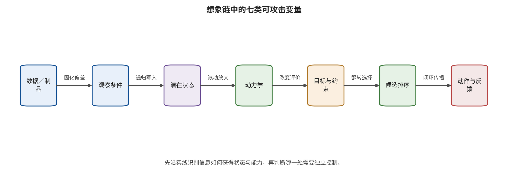

。若现有材料不足以证明未来被动作消费，应保留“未分类”或“证据不足”，不用产品名称补齐功能证据。 功能边界解决了“系统究竟是什么”的问题，想象链的恶意改变位置则需要继续追踪。第 17 章将沿供应链、观察、状态、动力学、目标、规划与反馈逐层解释世界模型攻击怎样积累并越过消费者。

\newpage

# 第 17 章　状态、动力学与目标攻击：想象链怎样被劫持

一辆无人运输车的世界模型准确预测了前方道路和车辆运动，却把“禁止进入”约束从代价函数中移除；另一辆车的约束完整，但地图条件被轻微改变，使未来轨迹在错误车道中仍显得连贯；第三套系统生成的未来没有明显异常，动作头却选择了与未来不一致的控制。三个系统都可能得到不错的视频质量分数，失守位置却分别在目标、物理条件和想象—动作耦合。

世界模型攻击的独特之处不只是扰动更复杂，而是错误可以沿状态递归、动力学滚动、候选排序和反馈控制被反复消费。本章按供应链—观察—状态—动力学—目标—规划/动作—执行/反馈的顺序，解释攻击者怎样控制想象链，以及每项证据能支持到哪一层。

## 本章总览

本章把世界模型攻击还原为一条可追踪的想象链。分析从最先失守的功能接口出发，逐项区分训练制品、运行观察、潜在状态、动力学、奖励与约束、候选排序和最终动作中的可优化变量。这样可以看清像素、贴片或后门只是外在载体，攻击的实际位置取决于它首先改变了哪个变量，又由哪个消费者将错误继续放大。

长时滚动会积累局部偏差，候选排序会在决策边界放大微小变化，共享模型偏差则可能让预测、不确定性和动作判断同时偏移。本章将冻结权重攻击、数据投毒、查询搜索和反馈操纵所需的权限分开记录，并用接口、时间、消费者与后果四个维度建立可证伪、可隔离的测试协议。

## 原理铺垫：攻击改变的是想象链中的变量

本章的对象是一条由训练制品、运行观察、持续状态、动力学、目标函数、候选排序、动作和反馈构成的想象链。输入不仅有像素，还包括地图、对象框、历史动作、奖励、约束、工具返回和版本化配置；编码器与状态更新把这些输入压入可跨轮影响未来的内部状态，动力学再滚动候选未来，规划器按目标与约束选出动作。输出消费者从离线浏览者一直延伸到策略训练器、规划器、动作头和反馈控制器，因此同一扰动能否成为安全事件，取决于首破变量、消费者权限和后果限制共同作用。

正常例中，地图、状态和硬约束来自不同可信来源，候选未来经过外部成本复核后才进入动作门。边界例中，攻击者只改动一段训练轨迹，却让错误目标经派生世界模型、合成数据和策略检查点长期传播；部署时出现的广告牌只是后门触发器，首破接口仍在供应链。另一个边界是未来画面保持合理而动作头偏离，此时视频质量没有观察到真正失守变量。攻击记录因此必须同时写明可优化变量、冻结对象、预算、消费者和最高后果层。 请沿图中的七个变量从左向右追踪攻击影响，并区分红色虚线首先进入的位置与最终出现任务失败或控制偏移的位置。

图中支持的是因果定位顺序，而不是把所有攻击压成一个等级。攻击在观察层出现，不等于首破接口必在观察；内部状态或未来发生偏移，也不等于动作门已经放行。现实后果仍需动作、执行和独立环境回执闭合，未连接真实消费者的张量试验保持在机制级运行证据层。

## 17.1 想象链的攻击路径

为了把首破变量与最终任务症状分开，可把世界模型的状态更新、未来滚动与动作选择写成下列最小接口；这一表示不假定特定模型架构，只用于标出攻击变量在哪个映射中首先起作用：

\[
s_t=E_\theta(s_{t-1},o_t,a_{t-1}),
\]

\[
\hat \tau^{(j)}=F_\theta(s_t,a^{(j)}_{t:t+H}),\qquad
j^*=\arg\min_j C_\psi(\hat \tau^{(j)},g,\mathcal C).
\]

攻击者可以改变观察 $o_t$、历史状态输入、训练参数 $\theta$、候选动作、目标 $g$、约束 $\mathcal C$ 或代价模型 $\psi$。同一最终任务失败可能来自完全不同的首破接口。安全记录应给出攻击变量 $v$、冻结部分、预算、目标函数、消费者和最高后果层。 世界模型攻击至少有三种放大器。状态递归把一次输入写进未来多个时刻；想象滚动让小动力学偏差随视界 $H$ 累积；规划器把连续预测压成离散选择，候选分数在决策边界附近的微小变化可能翻转最终动作。平均预测误差不一定反映这三种放大。

恶意攻击仍要与自然失效分开。遮挡、传感噪声、分布偏移和模型误差能够暴露相同接口，却没有对手目标与预算。自然鲁棒性方法可以成为运行时保障的基础；攻击防御结论还要求针对检测器和控制器的适应性测试。

## 17.2 七类攻击面：从制品写入到反馈操纵

七类攻击面按直接被改变的变量组织，而不是按论文标题或最终症状组织。供应链决定哪些制品和训练关系进入系统；观察、状态和动力学决定系统相信怎样的世界；目标与候选排序决定什么未来值得选择；动作、执行与反馈决定错误是否取得现实能力。下面各子节沿同一条链连续推进，并在每处保留攻击权限和消费者边界。

### 供应链：把错误未来固化进模型

供应链攻击改变数据、转移目标、编码器、动力学、奖励、配置或检查点；其中，后门攻击把特定触发条件与攻击者目标行为绑定，不能与没有这种条件绑定的一般质量退化混为一类。危险在于正常验证可以保持，触发条件出现后才在长时想象或下游策略中暴露。由于世界模型还可能生成训练数据或担任策略评估器，失效可以跨项目和时间传播。

SWAAP 先寻找回报较低、但动力学仍接近干净模型的目标，再用带隐蔽约束的梯度匹配改变少量微调状态转移训练目标（transition target，即监督当前状态与动作应到达何种下一状态或未来的标签）。攻击者需要影响模型更新数据或目标，首破接口是供应链，而不是部署时观察 [@WM_hu2026swaap]。清洁动力学接近说明选定距离下不易察觉，安全相关轨迹排序则需要独立比较。

Targeting World Models 把被攻击世界模型放到机器人学习管线中，强调受污染模型可通过合成数据或训练环节影响下游策略 [@WM_rathbun2026targeting]。这类链路的验收单位连接世界模型版本、合成数据批次、策略训练配置和部署结果，最终策略权重只是其中一环。传播证据在链路中断处停止，并明确标出最高已观察层。

BadDreamer 使用“上下文保留、未来擦除”的触发序列，把未来表征推向不避让的路径点 [@WM_shuai2026baddreamer]。它说明时序触发并不要求每帧都出现明显异常。逐帧数据扫描可能完全正常，只有把上下文和未来标签按轨迹展开，才能发现条件与未来之间的恶意绑定。

供应链控制除了哈希与签名，还要验证行为：在正常、触发、近触发和时序重排条件下比较预测、排序与下游策略；记录训练时冻结与可训练模块；对生成数据建立来源和撤销路径。签名证明来源，行为测试检验实际表现，两类证据共同闭合制品准入。

### 观察与物理条件：攻击不只发生在像素

运行时观察攻击通常冻结模型权重，只优化当前图像、条件嵌入或上下文。Hallucination-Driven Policy Failure 针对 Dreamer 风格连续控制研究像素、潜空间和时间增强扰动，显示一次小输入变化可以经状态缓冲跨帧累积 [@WM_zhang2026hallucination]。结论绑定于作者的连续控制模型、归一化和扰动协议；驾驶或机器人视频模型需要按自身传感范围、消费者和扰动语义重新设定阈值。

PhysCond-WMA 把攻击变量扩展到高精地图嵌入和三维框条件，并通过反向去噪引导保持时间一致的语义偏移 [@WM_guo2026physcond]。地图和三维框在人类观看最终视频时可能不显眼，却规定了道路、对象与运动。因此，输入资产清单要覆盖所有条件张量，而不是只保护可见图像。

BadWorld 在测试时扰动上下文图像，使用不依赖真实未来标签的速度目标，并面向未知后续控制序列做轨迹自适应搜索 [@WM_shen2026badworld]。模型权重保持冻结，攻击不需要训练投毒权限；其可实施性取决于白盒/查询能力、上下文可写入性和控制序列知识。因此它属于运行时上下文攻击，所需权限低于训练后门。

观察控制要保留类型、坐标和时间。地图版本、对象框坐标、相机外参、控制序列和文本条件必须绑定同一场景快照。内部条件一致性仍可能共同漂移，因而需要真实定位、独立地图或规则作为外部锚点。净化算法若只降低视觉变化，却破坏物理条件，也可能让控制更差。

### 潜在状态：局部输入怎样变成长期信念

潜在状态不是可见帧的简单缓存。它压缩历史、动作和不确定性，并成为未来预测的起点。若受扰观察把状态推入错误区域，之后的正常观察可能不足以立刻恢复；模型会用自己的错误预测解释新输入，形成自洽漂移。 可以用状态误差递推理解长时放大。设干净和受扰状态差为 $\delta_t$，局部线性化给出

\[
\delta_{t+1}\approx A_t\delta_t+B_t\epsilon_t,
\]

其中 $\epsilon_t$ 是当前输入扰动，$A_t$ 是状态动力学的局部敏感性。若干时刻的 $A_t$ 在关键方向上持续放大，单次小扰动会跨时间积累；若真实反馈足够强且状态更新收缩，误差可能衰减。这个表达式解释积累机制，现实偏移还要由实测矩阵响应、反馈和执行轨迹确定。

内部残差小不等于状态正确。编码器、预测器和重建器共享参数时，它们可以一起把错误状态解释为正常。有效测量需要把内部残差与外部几何、物理、规则或另一传感器的误差并列。锚点若来自同一模型生成的伪标签，不具备独立性。

状态攻击的测试必须覆盖重置。软重置可能只清除界面而保留缓存，地图和历史又可能从受污染日志恢复。协议要说明每个试验是继续同一轨迹、恢复检查点还是从独立初态开始，否则跨回合状态泄漏会把样本误当成独立单位。

### 动力学与想象：攻击系统“认为会发生什么”

动力学攻击的目标是未来本身或其决策相关表示。Trusted Imagination 对当前观察施加有界扰动，使未来潜变量偏离干净想象或靠近目标想象；研究用下游高质量动作选择器作为评估探针，而不是让攻击者直接覆写该选择器 [@WM_chen2026trustedimagination]。论文原文的“预言机级（oracle-level）”在这里描述评估探针质量，攻击者权限仍是有界观察扰动。

该研究中，消费想象的 LaDi-WM 模型预测控制器在一个小样本任务上出现明显攻击特异失效，而反应式策略近似保持。消费者差异支持“未来被用来决策才形成风险传播”，但单任务、每条件 20 次仿真且随机基线异常，证据适合建立存在性，不适合估计行业平均攻击率。

时间一致描述帧间连续，物理正确还涉及对象身份、速度、可达性和安全相关低维状态。评测并列视觉质量、潜在状态、外部锚点、候选排序和下游任务；FID/FVD 保留为视觉维度，闭环指标负责动作和后果维度。 动力学完整性还取决于动作条件。若模型声称某未来由动作 $a$ 产生，检查器应验证该未来在运动学和动力学上可达，并在真实下一观察到来时核对。无动作条件的视频未来只能支持环境演化，不足以为具体动作签发权限。

### 目标、奖励、价值与约束：预测正确也会选错

规划器根据奖励、价值、成本和约束选择未来。攻击者可以保持预测正确，同时改变“什么值得选择”。奖励投毒研究表明交互或训练时目标通道构成独立安全边界 [@WM_zhang2020rewardpoisoning]。在世界模型系统里，目标还可能来自用户任务、风险判别器、规则配置或学习的价值头。

JailWAM 把危险语言候选送入 WAM，使用动作轨迹映射、风险筛选和双路径验证选择能够在闭环中表现为振荡、越界或碰撞风险的指令 [@WM_liu2026jailwam]。其中风险判别器在攻击流程里承担候选筛选，整套流程的角色是攻击搜索；若将判别器另行部署为入口过滤器，其证据范围绑定特定模型、仿真和任务。

约束篡改与约束遗漏需要分开。前者有攻击者改变安全距离、禁区或预算；后者是系统从未编码某种危险。攻击实验必须明确攻击者能否写配置、奖励或工具描述。若权限只允许改像素，却用直接改变约束的结果声称远程输入风险，就越过了威胁模型。

目标控制应把安全约束放在模型外的版本化策略中，绑定适用对象、状态和审批。学习的价值可以优化效率，却不能单独覆盖硬禁区、执行器限幅和法定要求。高影响目标变化需要两阶段确认，运行日志要保存目标、约束版本与动作决定之间的连接。

### 候选排序、动作与控制：决策边界附近的攻击

规划器最终把连续预测压缩为一个候选。Tail-aware TRAP 不让所有候选都变差，而是针对干净规划中最关键的高分尾部轨迹改变排序，使长期危险方案更容易被选中 [@WM_duan2026trap]。平均回报或平均预测误差可能保持，决策边界却已翻转。 WMAttack 将攻击家族、扰动预算、优化步数、重启和资源分配组成有限预算搜索，并用历史任务配置暖启动 [@WM_guo2026wmattack]。它的价值是减少手工弱攻击造成的鲁棒性高估；其结论仍受搜索空间、目标和预算限制，不是对所有未知现实攻击的证书。

BadWAM 攻击联合 WAM 的动作分支，同时惩罚想象漂移，使未来看似合理而动作显著偏离 [@WM_li2026badwam]。攻击在运行时通过查询优化小视觉扰动，不是训练时动作头后门。这个案例要求评测形成双轴：未来是否正确，动作是否与未来和约束一致。只有二者都通过，才进入执行门。 首破接口与首个直接改变的内部变量不能混淆：运行时小视觉扰动首先越过 U1 输入信任边界；若攻击直接改变候选分数，首个直接变量位于 U3 的规划子接口；若未来和排序正常而动作头被定向偏移，首个直接变量位于 U3 的动作子接口；若训练时污染动作头，首破接口则是供应链 U0。最终都可能表现为任务失败，但预防位置不同。

### 执行、反馈、工具与隐私

世界模型被用于智能体工具链时，网页、工具描述、返回值和副作用进入状态。False Prophets 强调智能体世界模型不能同时成为唯一预测器、唯一评判者和唯一授权者 [@WM_imgrund2026falseprophets]。工具最小权限、参数类型、外部规则、副作用预览、可逆测试和完成后核验构成不同信任根。

反馈攻击包括伪造、延迟、乱序和重放真实下一观察。若世界模型使用错误反馈更新状态，恢复器可能把失败解释为成功并继续执行。测试要为反馈包绑定主体、序号、时间、状态版本和动作 ID；工具“返回 200”证明请求被接受，物理或业务目标还需要环境或业务回执确认。

隐私是另一条后果链。世界模型可能记忆视频、地图、室内环境和用户轨迹；用户可通过重复控制初始帧、视角、文本与随机性进行成员推断或抽取。Imagined Memorisation 提供初步机制线索，现有证据范围由其数据与协议限定；商业系统的绝对泄漏率需要对应部署样本与分母 [@WM_ng2026imagined]。隐私、知识产权和物理完整性应分别报告。

## 17.3 攻击面矩阵：变量、权限、时间与消费者

世界模型攻击使用四维矩阵描述：直接变量、攻击权限、时间形态和消费者。直接变量包括数据/制品、观察/条件、潜在状态、动力学、目标/约束、候选排序、动作和反馈。权限包括提交数据、改变训练、读取梯度、查询输出、写配置、物理进入和工具身份。

时间形态包括单步、跨帧、延迟触发、长时滚动、重规划和跨版本派生。消费者包括离线浏览、数据生成、策略评估、规划、动作头、控制器和工具授权。同一变量被不同消费者读取，会产生不同最高后果。 例如，地图条件受扰时，离线 EWM 可能生成错误视频；规划型 WM 可能改变候选排序；WCM 可能改变实时控制。入口相同，消费者与权限不同。测试固定一个矩阵单元，离线视频结果填写生成列，控制列由动作和执行测试填写。

矩阵还记录冻结对象。运行时观察攻击通常冻结权重、训练数据和安全策略；供应链攻击改变训练数据或模型；目标攻击可能冻结动力学只改变奖励；反馈攻击可能冻结全部模型而改变回执。冻结清单使因果归因可核验。 最后记录预算和终点。像素范数、地图嵌入距离、毒化比例、查询、候选数、触发持续、工具权限范围（authorization scope，即令牌允许调用的工具、对象、参数和期限）与物理时间不是同一种预算；潜在距离、回报、任务失败和现实事件也不是同一种终点。矩阵用于选择测试，不用于把异质数字压成总分。

## 17.4 供应链攻击的因果路径

世界模型供应链比普通检查点更长。数据先训练预测器，预测器可能生成想象数据或评估策略，策略再部署到真实系统。攻击者改变一个状态转移训练目标，影响可以跨越多个派生制品。因果路径需要记录每个转换的版本和输入。 SWAAP 的机制是先寻找低回报且与干净动力学接近的目标，再用隐蔽约束改变少量微调目标 [@WM_hu2026swaap]。它说明只比较平均动力学距离可能漏掉决策相关方向。验证应同时测正常状态、触发状态、候选排序、下游回报和异常残差，而不是只做权重哈希。

Targeting World Models 把受污染世界模型置于机器人学习管线 [@WM_rathbun2026targeting]。若污染模型生成的数据被策略训练消费，源模型下线后风险仍存在。撤销流程必须追踪合成数据、策略检查点、评估结果和部署版本。 BadDreamer 的触发序列将上下文和未来绑定到不避让路径 [@WM_shuai2026baddreamer]。逐帧随机抽样会破坏时序关系，也可能漏掉攻击。数据复核应按轨迹保留上下文—动作—未来关系，检查条件只在特定顺序和时间窗内激活的行为。

供应链攻击的分母可以是被贡献 transition、轨迹、训练批次、模型版本或下游任务。毒化比例只有在分子和数据单位明确时可解释；1% 帧、1% 轨迹和1%任务不是相同权限。训练随机性、数据去重和采样权重还会改变实际暴露。 因果确认可以做派生消融：用同一策略训练配置分别消费干净与候选世界模型生成的数据；再固定数据，替换世界模型；最后固定策略，比较部署触发。若中间阶段未运行，只能写潜在传播，不称完整管线已经被攻破。

## 17.5 条件与状态攻击的持久测试

EWM 和 WAM 的条件远多于像素。地图、对象框、相机轨迹、文本、动作历史、天气和工具返回都可写入状态。每种条件都要定义字段名称、数据类型、单位、取值范围、坐标系、观测时间和来源主体，攻击测试也要在对应空间定义预算。 PhysCond-WMA 直接优化地图嵌入与三维框条件 [@WM_guo2026physcond]。嵌入距离小不一定意味着物理变化小；应把受扰条件解码回车道、对象位置和尺寸，检查是否满足场景约束。人眼只看最终视频可能无法发现条件已经越界。

BadWorld 在测试时改变上下文图像，并对后续控制序列进行轨迹自适应搜索 [@WM_shen2026badworld]。权重冻结不代表状态冻结：受扰上下文会进入潜在状态。测试需要在攻击停止后继续运行，测状态和动作多久恢复。 持久测试采用脉冲、阶跃和间歇三种输入。脉冲只在一个时刻受扰，用于估计状态记忆；阶跃持续受扰，用于测稳态和安全门；间歇输入检验触发与恢复是否产生滞回。每种条件运行干净、随机幅值对照和定向攻击。

内部状态误差与外部锚点同时记录。如果内部重建与预测都正常，而真实地图、几何或规则误差持续上升，说明共同漂移。若外部锚点也依赖同一条件源，则不具有独立性。 状态重置分软重置、模型状态重建、仿真快照恢复和真实环境复位。各级成本和覆盖不同。报告写明实际使用的级别；同一污染状态衍生的多次重规划归入同一任务分母。

## 17.6 奖励、约束与候选排序的连续验证

世界模型安全分析容易聚焦预测，却忽略“怎样给未来赋值”。为显式暴露价值、成本与约束的作用位置，设候选未来为 $\tau_j$，规划器选择

\[
j^*=\arg\max_j\left[V_\psi(\tau_j,g)-\lambda C_\omega(\tau_j,\mathcal C)\right].
\]

攻击可以改变目标 $g$、价值 $V$、安全成本 $C$、权重 $\lambda$ 或候选集合。未来本身完全正确，选择仍可危险。 奖励投毒可能在训练中改变价值，配置攻击可能在部署时改变权重，语言越狱可能改变任务目标，尾部排序攻击则针对决策关键候选 [@WM_zhang2020rewardpoisoning; @WM_duan2026trap]。四种路径分别归入供应链、配置、任务目标和候选排序接口，并记录各自权限。安全约束再分为硬约束与软成本：硬约束由外部策略或控制器拒绝，不应被模型权重抵消；软成本允许效率与风险权衡，必须绑定版本和审批。若把禁区只编码成一个可学习惩罚，优化器可能在高奖励下接受违反。

候选覆盖和候选排序是连续责任。规划器没有生成安全轨迹时，再准确的评分器也只能从危险候选中选择；存在安全轨迹时，还要测它在决策边界附近是否被微小扰动挤出前 \(k\) 名（top-k）。测试同时记录候选多样性、可行候选比例、最安全候选排名、最终选择及外部真实成本。平均分变化很小但最优候选翻转，正是排序攻击需要捕捉的现象。

目标、约束和排序日志最后连接到用户授权与动作结果。任务文本、结构化目标、奖励版本、安全规则、候选集合和最终动作各自留存，使团队能够区分“没有生成安全候选”“评分器选错”和“外部硬约束未执行”。模型生成的解释不能覆盖外部硬约束；高影响权重变化需要独立审批和短时有效期，越权变更则按相应威胁模型处置。

## 17.7 自动攻击搜索的作用与边界

手工选择一种攻击、一步长和一个预算，容易把弱配置当成模型鲁棒。WMAttack 把攻击家族、预算、优化步、重启和资源分配组成有限预算搜索，并利用历史任务配置暖启动 [@WM_guo2026wmattack]。它提高评测强度，却仍只覆盖定义的搜索空间。 自动搜索的优化目标决定发现什么。最大化回报下降可能忽略安全约束，最大化动作不稳定可能找到无害振荡，最大化任务失败可能偏向原本困难任务。安全评测宜使用多目标：攻击终点、约束事件、查询成本、隐蔽性和正常输入影响，并保留每项原始结果。

预算需要按真实能力设定。仿真可以重置数千次，现实攻击者可能只有数次观察；白盒可以访问梯度，托管 API 只能查询动作；供应链攻击的预算是数据与训练权。每类自动方法使用对应的查询、重置、数据和训练预算。 搜索器也会过拟合基准。历史任务暖启动可以提升效率，却可能把模型和场景特征泄露进测试。应保留未见任务、检查点和攻击家族，并报告搜索失败与超时。没有命中只支持当前搜索预算下的结论。

防御知情搜索把输入净化、检测、过滤、动作门和恢复纳入环境。目标是最高穿透层而不是模型内部差异。若安全门成功阻断，搜索可继续尝试其他入口，但不能为了得到 Y4 而在真实设备上越过停止条件。

## 17.8 复合攻击链的验证夹具

复合链可以按“制品—条件—状态—未来—排序—动作—反馈”搭建。夹具先用干净制品与干净条件建立基线，再一次只激活一段，最后组合。这样能区分各段单独贡献与交互，不会把所有失败归给最后一个载荷。 第一组验证供应链：替换候选检查点或生成数据批次，保持运行输入不变。第二组验证条件：冻结检查点，只受扰地图、对象框或上下文。第三组缓存干净与受扰状态，交叉送入同一动力学。第四组交换未来或候选分数。第五组固定计划，比较动作头和安全门。

每一步都有外部对照。状态与真实几何比，未来与动作条件和真实下一观察比，排序与外部成本比，动作与可达集合和权限比，反馈与独立传感或业务状态比。内部一致性记录为辅助信号，外部锚点负责确认现实偏移。 复合效应可能呈现非线性。如果两个攻击共同使用同一预算或一个攻击改变另一攻击可达的状态，简单相加会丢失交互。报告分别给单段、双段和完整链结果，并明确独立单位；样本不足时使用案例轨迹描述已观察交互。

夹具的最高证据层取决于它实际连接的消费者。张量交换属于机制级运行，沙盒工具可形成模拟执行，状态、动作和环境反馈闭合后才形成仿真闭环。端到端复现还要求真实或经验证等价的权重、数据、身份、配置、执行器与预定指标全部闭合；受控物理动作仍要与现场事件证据分开记录。 失败回执同样重要。依赖缺失、模型未加载、候选为空、仿真崩溃、门控拒绝和恢复成功分别编码。只有实际到达预定接口的运行进入攻击分母；其他结果进入可用性和控制统计。

## 17.9 案例对照与工程检查表

Hallucination-Driven 说明像素或潜在扰动可经连续控制状态累积；PhysCond-WMA 说明地图与三维框是独立条件资产；Trusted Imagination 说明消费者差异决定未来攻击后果；TRAP 说明候选排序可被定向改变；BadWAM 说明未来合理而动作错误 [@WM_zhang2026hallucination; @WM_guo2026physcond; @WM_chen2026trustedimagination; @WM_duan2026trap; @WM_li2026badwam]。 五个案例共同显示视频质量只是安全评价的一项，它们覆盖的模型、权限、预算、任务与分母各不相同，因此分别保留原始攻击率。工程检查应逐项回答：

- 所有训练制品与生成数据能否追到下游消费者？
- 像素之外有哪些条件，单位、坐标和来源是什么？
- 状态污染在攻击停止后持续多久，哪种重置有效？
- 动力学预测与真实下一观察、几何或规则怎样比较？
- 奖励、价值和约束由谁写入，硬约束能否被优化目标覆盖？
- 候选集合是否包含安全方案，排序对小扰动是否稳定？
- 想象与动作是否双向一致，动作门是否在模型外？
- 反馈是否新鲜、按序并绑定动作，攻击者能否无限查询？
- 最高终点是预测、计划、模拟执行、仿真事件还是现实影响？
- 正常效用、时延、恢复和证据缺口是否同表报告？

检查表产出最小攻击路径和两道不同信任根的控制。若未知项位于高影响消费者附近，先收缩权限，再补测试；没有证据的状态明确记录为未知。

## 17.10 反事实与因果归因

世界模型攻击常同时改变多个中间量。要确认某条路径，可以从同一可信快照构造反事实：干净条件与受扰条件分别生成状态、未来、排序和动作；再交叉替换某个中间量，观察后续是否恢复。交叉替换相当于询问“若只把状态恢复，其他攻击条件保持不变，会发生什么”。

供应链路径可以固定部署输入，分别加载干净和候选检查点；条件路径可以固定检查点，只替换地图或上下文；目标路径可以固定未来，只替换奖励与约束；动作路径可以固定计划，只替换动作头。每次只改变一项，才能定位直接作用。

中间量替换可能产生分布外组合。例如干净状态与受扰未来并非模型正常产生的配对。因而需要先验证组合可读，再使用多种干预和消融互相支持。无法直接访问内部状态时，切换不消费未来的策略或外部评分器，提供较弱但可证伪的消费者对照。

因果结果按链条表达：攻击变量到达入口；中介按预定方向变化；消费者读取中介；动作或任务变化；安全门与环境决定后果。最后动作没有变化时，最高证据层停在潜在状态；动作变化但门控拒绝时，同时保留动作层命中和后果限制两项事实。 真实设备难以精确重置时，配对设计按场景、任务和初态分层，随机化干净与受扰运行顺序，并报告温度、磨损、人员活动等残余差异。机制证据越依赖不可控环境，因果语言越应保守。

## 17.11 攻击后的状态与制品处置

发现世界模型路径后，处置先限制消费者，再保全血缘。离线 EWM 暂停向数据池发布，规划型 WM 降为只读建议，WAM/WCM 切换保守策略和独立控制；这种能力收缩作用于数据流与执行权，删除模型文件则属于后续制品处置。系统稳定后保存受影响数据、检查点、条件、潜在状态、候选、目标、动作、反馈和环境版本，同时限制原始视频、地图与轨迹的访问，使证据能够说明哪个消费者实际使用了哪个版本。

随后按制品、软件状态、工具事务和物理状态确定污染半径，因为训练数据可能派生多个模型，世界模型可能生成策略数据，受扰状态可能写入缓存，危险动作还可能改变现实环境。恢复路径随对象不同：制品失守时切换受信版本并追踪派生物；状态失守时从外部锚点重建；目标失守时恢复批准规则并重新授权；反馈失守时重建动作—结果链；物理环境变化时执行低能量撤回或人工检查。每项恢复操作自身也必须经过安全门。

恢复后的回归使用同一协议重跑触发、近触发、正常任务和防御知情攻击，确认状态不会在攻击停止后复发，下游策略没有继续携带影响，动作门与恢复路径仍满足时延。无法闭合的项目维持能力收缩并记录负责人。处置报告同时保留上游根因与下游限制控制：入口脆弱可以存在，而动作门又确实阻断后果；只写“没有事故”会漏掉根因，只写“攻击成功”则会抹去防线的实际作用。

## 17.12 世界模型红队协议

红队协议先选家族和消费者。离线 EWM 以条件、时序、隐私和数据投毒为主；规划 WM 增加状态、目标与排序；WAM 增加想象—动作；WCM 增加实时约束、反馈和恢复。测试终点随消费者升级，不从视频指标直接跳到现实后果。 每个单元固定系统版本、状态初始化、攻击者权限、预算、攻击目标、控制、分母和停止条件。白盒记录可读模块与梯度，黑盒记录响应与查询，供应链记录数据和训练权限，物理条件记录制造与放置。未知权限不由常识补齐。

测试顺序从静态血缘、构造张量、离线回放、缩小仿真、完整仿真、硬件在环到隔离真机。上一层未到达机制时，不用更高风险环境补出成功。每层保留干净、随机扰动、目标无关载荷和自适应攻击四类对照。 指标按状态、未来、排序、动作、执行和恢复分层。状态分母是独立快照，排序分母是有效重规划周期，任务分母是完整回合，工具分母是唯一事务，现实影响分母是事件或对象。相邻帧与共享检查点保持依赖关系。

复合攻击一次增加一段，先测单段再测组合。若总预算在多段间分配，记录分配规则；若前段改变后段可访问状态，报告交互而不把单段效果相加。样本和方差不足时保留案例轨迹。 红队输出必须回答：首破接口；最高穿透层；阻断控制；正常效用与时延；恢复状态；证据空白。只核对材料和配置时记为静态检查，构造夹具实际运行时记为机制级运行，状态、动作和环境反馈闭合时记为仿真闭环。缺少真实权重、数据、完整管线或预定指标时，端到端复现保持未完成。

## 17.13 误差传播与控制敏感性

把各模块误差相加，往往会误判闭环风险。设观察到状态、状态到未来、未来到分数、分数到动作的映射分别为 $E$、$F$、$R$和 $A$。在局部可微且动作未切换的区域，输入误差对动作的一阶影响可写为

\[
\Delta a \approx J_A J_R J_F J_E\,\Delta o.
\]

这是用来定位放大环节的诊断式，不是安全证明。真实规划器含有前 \(k\) 名筛选、阈值、量化、限幅和离散模式切换，穿过决策边界后，很小的连续误差也可能产生不连续动作。反过来，内部距离很大也可能没有改变最终候选。 工程上要同时测“距离”和“余量”。距离描述攻击前后状态、未来或动作差异；余量描述当前候选到排序翻转、约束越界或控制模式切换还有多远。例如，记最优安全候选与次优危险候选的分数差为 $m_t$；当 $m_t$ 接近零时，即使视频质量基本不变，也应缩短动作块、增加观测或切换外部安全策略。

敏感性夹具按四步执行。第一步，对同一状态生成局部可行的小扰动，不允许改变本应冻结的目标或权重。第二步，分别记录状态、未来、排序、动作与安全门余量。第三步，在决策边界附近做更细的自适应搜索，并保留目标无关扰动对照。第四步，只在可逆环境中检验选择翻转是否产生模拟执行或仿真事件。

传播账本要为每个周期保留输入版本、潜在状态指纹、候选集、原始分数、约束余量、选定动作、门控结果与环境回执。这样才能回答“误差到了哪里”、“哪个消费者放大了它”以及“哪道控制把后果截停”。仅有最终成功或失败时，模型未受影响、动作未改变、安全门阻断与环境未呈现四种情况会混在一起。

还要区分“敏感”与“易攻破”。局部梯度大只表明某个方向会快速改变代理量；攻击者是否能在输入合法性、查询、时间、物理和隐蔽预算内到达该方向，是另一个问题。因此，敏感性曲线与实际可行攻击的成本—效果曲线分别报告。白盒结果覆盖内部梯度可见条件，黑盒结果覆盖只见最终动作的条件；仿真查询数和现场查询能力也各自绑定环境。

对离散切换，可记录首次翻转预算、翻转后持续周期、门控介入时差和恢复所需的新观察数。对连续控制，则报告动作误差、距安全包络边界的最小余量、超限时长和限幅后任务效用。当混合系统从连续调节进入急停模式时，两类指标都要保留。只看最大动作偏差，可能把安全的紧急制动误作危险攻击；只看任务失败，则可能漏掉越过约束后幸运完成任务的轨迹。

最后，灵敏度结论必须绑定操作点。载荷、速度、控制频率、候选数和规划视界都会改变决策余量。测试应覆盖额定工况、临界工况与合法极端工况，并预先定义终止条件。临界工况用于观察小扰动放大，额定工况描述日常运行，合法极端工况补充边界风险。

## 17.14 工作例：被污染的园区调度世界模型

园区使用 EWM 生成叉车流量场，用 WAM 为无人运输车选择三条候选路线，再由 WCM 以 10 Hz 控制速度。攻击者能够向仿真数据贡献少量轨迹，但不能访问部署权重或现场网络。其目标是在出现特定广告牌时，让系统偏爱穿过装卸区的路线。 首破接口是供应链，攻击变量是贡献轨迹及其未来/代价标签，部署广告牌只是触发。模型权重在部署时冻结，运行时攻击者没有查询优化。测试应比较正常、触发、近触发和不同视角，记录 EWM 流量预测、WAM 候选排序、动作提议、WCM 安全投影和真实仿真事件。

若广告牌触发后流量预测仍合理，候选排序却把装卸区路线置顶，说明失效传播到目标或排序；若 WCM 的独立禁区约束投影动作，最高后果停在危险计划或动作提议。团队同时修复数据血缘并保留 WCM 约束，上游根因和下游后果限制分别处理。

隔离测试禁止连接真实车队。使用带签名的仿真快照，固定随机种子并记录独立试验单位；攻击预算是可贡献轨迹数与标签权限，不是像素范数。再加入知道候选检查器的自适应攻击，验证检测器是否只是记住广告牌外观。恢复测试则撤销受污染数据、重训或替换模型，确认状态、缓存和下游策略没有继续携带影响。

## 17.15 症状不能替代首破变量的六类误读

| 误判 | 被混淆的层 | 应保留的判断 |
|---|---|---|
| 所有未来退化都是动力学攻击 | 训练制品、观察、状态、目标和排序都可能改变未来 | 主类由攻击者直接改变的变量与首破接口决定 |
| 模型权重冻结代表整个系统冻结 | 观察、历史、条件、候选、奖励和反馈仍在变化 | 冻结清单必须覆盖所有运行状态和外部配置 |
| 内部预测残差低代表没有真实漂移 | 共享编码器和预测器可以自洽地共同漂移 | 用独立外部锚点核对几何、规则、位置或真实下一观察 |
| 视频质量变化可以代表控制风险 | 画面、状态、排序、动作和执行属于不同后果层 | BadWAM 式失效可在画面合理时发生，需双轴核对未来与动作 |
| 自动攻击搜索就是鲁棒性证书 | 搜索只覆盖预定家族、预算、目标和反馈 | 未发现穿透只支持当前搜索条件下的有限结论 |
| 后门触发出现在输入，所以首破接口是输入 | 触发位置与恶意绑定形成位置不是同一对象 | 若绑定在训练中形成，首破接口仍是供应链 |

## 17.16 带入实际系统

园区移动系统的攻击记录首先区分变量、冻结组件、首破接口和消费者。SWAAP 从供应链写入少量微调状态转移训练目标，把低回报目标投毒绑定进候选世界模型；BadWorld 在运行时保持权重冻结，通过上下文图像扰动和面向未知后续控制序列的轨迹自适应搜索改变潜在状态；BadWAM 同样保持权重冻结，用运行时查询优化小视觉扰动，在压低想象漂移的同时偏移动作分支。三者分别占用训练目标写权、运行时上下文写入与查询能力，每类结果保留自己的攻击预算、统计单位与最高后果层。

状态核验需要一个模型外锚点。内部重建残差可能在编码器与动力学共同漂移时仍保持很小，因此系统还要比较独立定位、真实里程、地图地标或外部测量。候选轨迹则同时记录平均分、最优与次优余量、首次翻转预算和翻转后的动作差异；平均变化很小也可能伴随离散选择完全翻转。

因果定位可以沿“条件—状态—未来—排序—动作”依次替换中介变量。可信状态替换用于检验入口污染是否已写入内部状态，可信未来替换用于检验动力学传播，可信排序或动作替换用于定位消费者。每次替换都记录分布外组合风险，并以正常对照确认结果来自被替换路径而非接口不兼容。

完整证据链从供应链摘要、输入与状态探针开始，经过候选排序和模拟动作，最后到独立动作门与恢复回执。连续动作误差、排序余量、首次翻转预算和恢复周期共同描述攻击后果；单个指标只覆盖链上的一个切面。测试停止条件与实际运行层级绑定，使局部机制、仿真闭环和真实执行各自落在清晰范围内。

## 小结：想象错误只有被消费才成为控制风险

世界模型攻击可以从训练制品、物理条件、潜在状态、动力学、目标与约束、候选排序、动作头和反馈进入。局部误差经状态递归、长时滚动和离散选择被放大，但危害仍取决于下游如何消费预测。冻结权重不等于冻结系统，内部自洽不等于真实正确，画面逼真不等

---

[← 返回目录](index.md)
