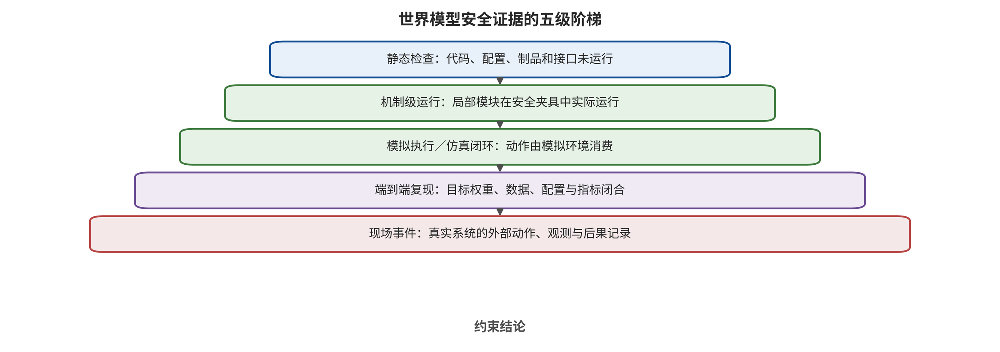
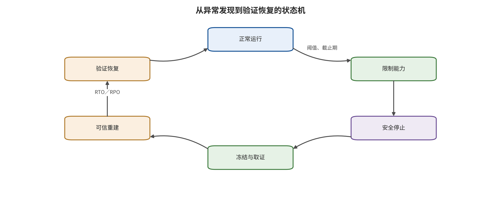

于动作安全。未观察到贯穿时，结论仍只能限于已测模型、任务、预算和消费者，不能把局部阴性升级为不存在攻击路径。 识别攻击路径只是第一步。世界模型进入控制后，团队还需要把不确定性、外部锚点、鲁棒规划、动作过滤、回滚和可证伪测试连接起来。第 18 章将完成这套运行时保障与恢复规则。

# 第 18 章　运行时保障、恢复与可证伪测试

世界模型给出一条“95% 可信”的安全轨迹。控制器据此加速，随后才发现不确定性估计与预测器共享同一潜在状态，两者在被扰地图上同时过度自信。95% 这个数字的实际意义由校准分布、独立性和失效条件决定，这些要素需要进入控制规则。一个概率分数只有在能及时改变动作，并在假设失效时触发更保守控制，才具有运行时保障意义。

本章把世界模型防御从“发现异常”推进到“改变执行、限制后果并恢复”。核心结构包括来源与制品控制、状态锚点、不确定性与安全过滤、鲁棒模型预测控制、执行时核验、回滚和可证伪测试。每项保障职责都要明示前提、介入动作、残余风险和失败后的状态，最终评价对象是控制链的可验证行为。

## 本章总览

本章将预防、检测、过滤、鲁棒控制、执行核验与恢复安放在各自的作用位置。不确定性分数经过校准后转化为限速、拒绝、重规划或切换控制器；外部状态锚点与模型多样性用于暴露共同漂移；硬件安全包络和能力门则在执行端限制最大后果。每项介入都同时写明校准分布、动力学假设、控制截止期和正常效用。

停止、回滚、重规划和人工接管都以状态转移、响应时间、停止距离、事务完整性与恢复后任务结果来表达。证据按静态检查、机制级运行、模拟执行或仿真闭环、端到端复现和现场事件分层，模块夹具、离线回放、缩小仿真、完整仿真和隔离硬件闭环分别进入它们实际达到的层级。各层结论与实际运行的权重、数据、配置、环境和重复次数相匹配。

## 原理铺垫：预测必须经过锚定、门控与重规划

本章的对象是一条滚动控制链：世界模型读取当前观察、历史动作、地图、目标与约束，维持可跨周期更新的状态，并预测候选动作可能形成的未来。独立外部锚点先核对状态是否仍对应现实，不确定性模块再估计预测误差或约束余量；模型预测控制（model predictive control，MPC）只选择有限时域内可行的短动作，动作门核验对象、单位、权限和安全包络，执行回执随后成为下一轮观察并触发重规划。消费者包括规划器、安全控制器、执行器、恢复器和值班人员，任何一个内部分数都不能替这些消费者签发权限。

正常情况下，新鲜定位与地图相符，预测区间覆盖候选轨迹，MPC 下发短动作后立即用真实反馈更新状态。边界情况下，预测器和不确定性头共享错误表征而同时过度自信，但外部锚点发现位置不一致；动作门应拒绝长动作，RTA 转入限速或安全停止，重规划从新鲜状态而非污染缓存重新开始。若锚点、求解器或回执超时，系统同样进入预定安全失效状态，不能沿用上一条名义轨迹。

## 18.1 五类防御动作必须各司其职

世界模型防御可以分成五类。预防减少恶意数据或制品进入系统；检测识别输入、状态或想象异常；抑制把危险动作拒绝、限幅或投影；恢复让系统回到已验证状态；保障职责则把监测、切换、约束和失效条件连接成可复核的运行要求。

这五类各自承担独立职责。来源签名确认制品身份，行为测试检查后门；异常检测器输出风险信号，控制消费者负责阻断动作；安全过滤器依赖可信状态；回滚同时恢复权重、物理状态、缓存和工具事务。把这些职责分开，才能定位缺失的控制环节。 一份 RTA 记录至少包含：受保护接口、监测输入、阈值或集合、介入动作、控制截止期、正常效用、漏报/误报、攻击者知识、假设失效、恢复路径和验证证据。缺少介入动作的输出是诊断，缺少假设失效条件的保障主张是未限定承诺。

## 18.2 预测与状态保障

预测侧的责任从制品与运行血缘开始，经输入类型、状态锚点和不确定性校准，最后进入鲁棒 MPC。四个环节逐步回答“系统正在用什么”“状态是否仍对应现实”“预测误差有多大”“在当前假设下还能选择什么”，任一环节未知都应缩短视界或收缩能力。

### 供应链与运行血缘：先回答系统正在用什么

世界模型可能同时担任环境生成器、数据供应商、规划器、评估器和安全检查器。每种角色都需要版本化血缘：数据、代码、权重、编码器、条件的字段名称、数据类型、单位、坐标、来源与时间，以及奖励/约束、动作头、配置、部署镜像和下游消费者。一个动作决定应能追溯到使用的模型、状态、目标和安全策略版本。

制品完整性控制包括哈希、签名、许可、审批、隔离加载和可撤销发布。行为控制则比较正常与触发条件下的预测、状态、排序和动作。SWAAP 一类隐蔽投毒说明，清洁性能与动力学距离可能保持，仍需对决策相关尾部和下游回报做差分 [@WM_hu2026swaap]。签名与行为测试共同覆盖“来自谁”和“做了什么”。

若世界模型生成训练数据，血缘必须跨越模型边界。记录生成条件、随机种子、模型版本、筛选器和数据批次，再连接下游策略与评估。撤销一个世界模型版本时，还要定位由其生成的数据、训练出的策略和缓存状态。否则，供应链影响会在源模型下线后继续存在。

上线策略采用最小能力。血缘不完整的模型可以在离线沙盒中评估，不直接接入高影响规划或控制。随着证据升级，逐步开放数据生成、候选建议和受限控制，每一级都设置可回退版本。开放权重或公开仓库提高可见性和复核条件，信任等级仍由来源、行为与运行证据共同决定。

### 输入、条件与状态：用独立锚点发现共同漂移

状态防线必须跨越像素、地图、三维框、文本、动作历史、本体状态和工具反馈。每项输入携带来源、时间、坐标、完整性和允许影响。类型检查可以阻断显然越界的条件，跨模态和时序检查可以发现不一致，独立锚点负责发现多个内部模块共同漂移。

WISER 使用世界模型先验分布（prior distribution）与后验分布（posterior distribution）之间的惊讶及重建误差；这里的先验分布是在吸收当前观察之前由历史状态与动作预测的状态分布，后验分布则在结合当前观察证据后更新，两者的不一致构成一种惊讶信号。方法据此在多传感器候选中选择更可解释的潜在状态，并在单传感器情形下拒绝或重建不可信观察 [@WM_zollicoffer2025worldmodelrobustnesssurprise]。它支持运行时检测并拒绝或重建可疑观察，但主要针对噪声、故障和自然分布外输入；知道惊讶分数、重建器和任务目标的自适应攻击仍需单独验证。

Illusory Attacks 提醒，普通对抗轨迹可能因偏离环境分布而容易检测，刻意保持接近可行轨迹分布的攻击则更难被异常分数发现 [@WM_franzmeyer2024illusory]。因此，检测器同时检查“输入像不像训练数据”与“状态是否符合独立物理、规则和任务授权”。 独立锚点有三个条件。第一，数据来源与受测模型不同，例如激光雷达相对单目视觉；第二，解析路径不同，例如几何规则相对神经编码器；第三，锚点掌握安全相关变量，例如禁区、距离和控制权限。两个共享编码器的模型即使名称不同，也可能对同一扰动共同失效。

状态恢复需要可信起点。系统可以保存带签名的检查点、最近已验证姿态和外部地图版本；物理世界已经变化时，旧潜在状态只作为线索。恢复流程应先停止或限能，再重新观测、重定位、重建状态，最后重新取得任务授权。

### 不确定性和安全过滤：分数必须改变动作

世界模型在分布外状态中的点预测可能过度自信。安全过滤的基本思想，是估计未来成本或约束的不确定性，并在风险超阈值时拒绝候选、缩短视界、切换保守策略或请求更多观察。UNISafe 使用潜空间不确定性和安全过滤避免部分 OOD 失效 [@WM_seo2025unisafe]；其有效性取决于不确定性是否覆盖真实模型偏差。 设候选动作的预测成本为 $\hat C(a)$，不确定性上界为 $U(a)$，风险预算为 $\beta$。一种保守准入规则是

\[
\hat C(a)+\lambda U(a)\le \beta.
\]

$\lambda$ 表示保守强度。直觉是对不确定未来留出余量；它不是无条件概率保障。若 $U$ 未校准、模型与过滤器共同偏置，或真实状态不在校准分布内，不等式可能错误放行。系统要定义这些条件的检测信号和失败后动作。 SafeDreamer 在世界模型想象中学习安全约束，说明安全成本可以进入策略优化而非只做事后打分 [@WM_huang2023safedreamer]。训练时安全倾向与运行时硬约束承担不同职责：前者改变已编码危险下的策略分布，后者处理未建模危险、奖励/约束投毒和分布外状态；这些情形仍可能越过优化目标。

过滤器验收必须同时给出正常通过率、危险通过率、误拒、漏报、介入频率和决策时延。全部拒绝可以把危险通过率降到零，却使系统失去效用；阈值过松则保留任务能力但让高后果动作穿透。安全与效用应在相同任务、状态和控制截止期下形成帕累托前沿，即无法在不恶化另一项指标的情况下继续改善某一项指标的非支配运行点集合，再在同一条前沿上选择与后果等级相匹配的运行点。

### 鲁棒 MPC：把预测区间连接到约束

模型预测控制（model predictive control，MPC）在每个周期滚动预测候选轨迹，选择满足约束的短段动作，再用新观察重规划。鲁棒 MPC 不只使用单条名义未来，而考虑扰动集合、概率区间或最坏情形。世界模型提供状态与动力学，控制器负责把不确定性转成可执行约束。

SLS² 将潜在世界模型与并行共形预测（conformal prediction，一类利用校准样本为新样本误差构造覆盖集合的方法）鲁棒 MPC 结合，尝试从像素预测建立概率安全控制 [@WM_nath2026sls2]。这类方法的重要进步是输出会改变轨迹，而不是停在风险分数。但共形覆盖依赖校准与测试的交换性或相应假设，动态分布移位和自适应攻击会使覆盖保障退化。报告应写覆盖对象、校准单位、失效检测和超出覆盖后的控制。

鲁棒控制还要满足实时预算。若世界模型生成、候选采样和约束求解超过控制周期，理论上更保守的方案可能在现实中使用过期状态。验收至少报告 P50、P95、P99 时延、超时率和超时动作。平均时延没有覆盖尾部错过截止期。 模型偏差与控制保障结论使用独立证据。MPC 选择轨迹说明优化器找到候选，世界模型预测平滑说明内部时间连续；未来可靠性和控制可行性还分别由外部可达性、执行器限幅、控制屏障或紧急停止确认。预测越不可信，动作块越短、速度越低，必要时切换不依赖世界模型的安全控制器。

## 18.3 执行与恢复保障

预测通过前述检查后仍只是执行证据。执行侧需要把计划、预览和实际动作对齐，由模型外能力门决定放行、投影、拒绝或重规划；动作发生后，独立反馈确认环境或事务是否真的改变。发现偏差时，恢复状态机按后果先限权，再选择可信恢复点并验证重新开放条件。

### 执行时核验：预览不是授权

执行时核验在动作下发前或执行过程中预测其后果，并对照规则、状态和反馈。CheckVLA 使用动作条件世界模型预览长时移动操作，检查候选执行；DreamGuard 用风险感知世界模型在智能体工具调用前阻断高风险路径 [@WM_liu2026checkvla; @WM_lin2026dreamguard]。二者都把预测转成介入，却仍需要外部能力门。

检查模型与工作模型共享数据、编码器或训练目标时，会形成“同一种想象验证同一种想象”。更稳健的设计让核验器拥有不同的传感器、物理近似、规则和失败模式。无法做到完全独立时，可以把共享关系写入威胁模型，并降低核验器能够批准的最大动作。

执行核验采用三方一致性：计划要求的目标；世界模型预览的未来；控制器实际要执行的动作。三者任一不一致都不能自动修正为模型最偏好的版本，而应拒绝、重新观察或请求授权。执行后再用真实反馈核对预计与实际，并把偏差写入下一周期风险预算。

工具调用需要事务式控制。调用前预览副作用、验证参数和权限；执行时使用最小权限范围与短时令牌；调用后以外部事实核验结果。世界模型可以预测“删除文件会发生什么”，但不能独自批准删除；完成返回也不能替代存储系统的独立状态确认。

### 停止、回滚和接管是可测量状态

恢复目标不是把异常分数降下来，而是把系统带回一个可验证的低风险状态。恢复状态可以包括：缩短动作、减速、停机、撤回到最近安全姿态、切换紧急策略、回滚工具事务、重建世界状态、撤销模型版本和移交人类。 每种恢复都要定义成功。停止成功可以用停止距离、最大残余能量和锁存持续性衡量；回滚成功要验证物理位置或业务事务已恢复；重规划成功要确认新轨迹不再消费污染状态；人工接管要记录请求、响应、控制权转移和超时策略。任务未完成但安全停止，应记为安全失效，不记为正常成功。

恢复时延必须小于伤害窗口。慢速语言或视频检查器可以在低频任务入口使用，不适合毫秒级制动。高频路径由硬限幅、紧急控制器和物理停止承担；高层模型负责解释、重新规划和事后证据。不同时间尺度的控制组合比让一个大模型处理所有安全决策更可验证。

回滚还需要状态血缘。撤销权重却继续使用其生成的缓存、地图或策略，不是完整回滚；恢复旧潜在状态却忽略真实设备已经移动，也不是完整恢复。运行手册应列出模型状态、软件状态、工具事务与物理状态各自的回滚动作，以及不可逆时的隔离和救济。

## 18.4 可证伪的测试矩阵

可证伪主张需要把“系统能够发现异常”展开为具体条件：在指定模型、任务、攻击权限与预算下，监测器在 P99 决策截止期前触发；安全控制器把动作限制在给定集合；同时正常任务成功、误拒和资源成本满足阈值。任一项失败，保障主张即被否证或降级。 世界模型测试至少覆盖六个轴：

1. **接口**：供应链、观察、状态、动力学、目标/约束、规划/动作、反馈。
2. **权限**：数据写入、白盒梯度、黑盒查询、物理条件、配置写入、工具权限。
3. **时间**：单帧、跨帧、延迟触发、长滚动、重规划、恢复后复发。
4. **消费者**：离线生成、数据生成、策略评估、候选排序、动作头、反馈控制。
5. **后果**：预测、排序、动作提议、模拟执行、隔离真机和现实事件。
6. **防御知情度**：未知防御、知道结构、知道阈值、联合优化多层控制。

每个测试单元报告攻击预算、分母、正常效用、残余风险、P95/P99 时延、随机种子、独立单位和停止条件。不同模型、任务、预算、ASR 定义或方差的数字不做总体合并。视频质量、潜在距离、回报、任务成功、碰撞和恢复时间分别属于不同终点。 自然压力与恶意攻击都要保留。自然噪声、遮挡和 OOD 测系统可靠性；自适应对手测检测器与控制器在恶意优化下是否仍有效。二者不合并为一个平均分，但可以共享状态、动作和恢复指标。

## 18.5 证据阶梯：运行了什么，就只证明什么

请从阶梯底部向上比较每一级实际连接的对象，特别观察“模块输出变化”“仿真环境消费动作”和“目标系统端到端闭合”之间还缺哪些消费者与回执。

阶梯图支持的是结论上限管理，而不是“越高越好”的单一排名。静态检查和机制级运行可以快速定位接口与公式问题，仿真闭环可以观察状态—动作反馈；它们都不能替代缺失的真实权重、数据、身份、执行器或现场因果证据。失败和未运行项同样要保留在阶梯对应层。

世界模型安全证据统一分为静态检查、机制级运行、模拟执行或仿真闭环、端到端复现和现场事件。文档、公式与代码路径的只读核对属于静态检查；公式代理、模块夹具或离线回放在受控输入上实际运行并保留可核查回执后，形成机制级运行；状态、动作与环境反馈连接后形成仿真闭环。端到端复现要求真实或已验证等价权重、数据、身份、配置、目标管线、预定指标和多次有效运行全部闭合；现场事件另行记录特定时间、对象与后果。

配套执行回执记录了 6 项机制级运行、3 项静态检查，端到端复现为 0 项。安全套件中的 9 项低风险命令全部退出成功，证据覆盖对应子模块或公式代理在构造输入上的运行行为；论文数值、官方大权重、完整数据管线、机器人闭环和现实安全仍处于未复现状态。读者可从 [来源台账中的 EW-S028](../03_source_ledger.csv) 回查这组状态，并沿该条可见指针核对 [最终验证回执](../../wmse/validation/final_validation.json) 与 [证据账本](../../wmse/evidence/evidence_ledger.json)。

这一边界也适用于任何工程团队。仓库存在不等于代码可运行；依赖安装不等于模型正确；模块输出变化不等于攻击命中任务；仿真成功不等于真机安全。每次升级都应保留命令、版本、输入、输出、退出码、环境、哈希和失败记录。 高风险真实设备测试采用逐级升级：先在可逆仿真和硬件在环中验证停止、限幅与回滚，再在隔离设备上使用低能量、无第三方影响的终点。安全停止条件是进入下一证据层的前置门。

## 18.6 从主张到证据：编写可复核的保障论证

运行时保障不是一条“已通过安全测试”的结论，而是主张、理由、证据和反证条件组成的结构。主张要绑定系统版本、运行领域、任务、威胁权限、结果对象和时间窗。“安全过滤器能降低风险”不可核验；“在指定速度和载荷内，安全门在控制截止期前拒绝越过外部禁区的候选动作”才能被测试推翻。

保障论证至少分四层。顶层是不希望发生的环境或业务事件；第二层是能直接约束该事件的动作、权限和能量边界；第三层是状态、未来、不确定性和执行反馈等中间证据；第四层是版本、配置、传感器、时钟和算力等依赖。高层主张由中间分数与真正改变动作或权限的控制连接共同支撑。

检测器的输入字段包括观察 ID、潜在状态版本、来源主体、观测时间、坐标系和完整性标记，输出字段包括风险分数、原因码、适用对象、有效期和校准版本。安全过滤器读取候选动作 ID、状态版本、约束集、风险量和控制截止期，输出放行、投影、替换或拒绝决定，以及理由码与动作参数。恢复器读取故障码、当前模式、最近可信锚点、未完成事务和物理位置，输出降级模式、已完成补偿、未清项目和追踪记录。仪表盘上的分数只是诊断信号，改变动作还需要明确的控制消费者。

每条主张还要有反证路径，并把每个条件逐项接到处置。时延超过截止期时，丢弃过期结果并切换到限速或不依赖该结果的安全控制器；校准分布失效时，扩大安全余量、缩短视界，并在重新校准前维持受限运行；外部锚点不可用时，重新观测，仍不可用则停止依赖该锚点的执行；候选集没有安全动作时，不在危险候选中继续择优，而转入已验证的安全保持或安全停机；安全集不可达时，执行经验证的最小后果应急动作并请求人工接管；回滚未完成时，继续隔离相关制品、状态与能力，禁止解锁。六条路径都保持到新证据满足各自解锁条件为止。

## 18.7 校准要求：覆盖率有分母和失效条件

不确定性或共形区间的覆盖率，必须先回答“覆盖什么”。对世界模型，校准单位可以是单帧、时间窗、候选轨迹、完整任务或最大约束误差。对每帧达到95%覆盖，不意味着长任务全程也有95%概率不超界；相邻帧相关、多次重规划和候选选择都会改变整体事件。

校准数据要与部署条件建立明确关系。场景、速度、负载、传感器、动作块、视界、候选数和控制频率中任一项改变，都可能让误差分布变化。动态环境中的交换性或稳定性假设按时间窗口持续检验。SLS² 将共形误差界连接到鲁棒 MPC，使预测区间真正影响轨迹；概率语言的适用范围由校准假设和潜在约束映射限定 [@WM_nath2026sls2]。

运行时同时监测最终分数和校准适用性。可用输入范围、表征距离、误差序列、覆盖超限和外部状态差异作为失效信号。其中任一信号超出预定边界时，原覆盖保障不再适用于当前运行条件，系统扩大安全余量、缩短轨迹、主动获取新观察或进入安全集，并在重新校准或取得新证据前维持保守控制。

共同偏差是校准的关键反例。若预测器、不确定性头和约束检查器共享编码器与数据，它们可能在同一分布外状态上同时过度自信。UNISafe 把潜在动力学分歧与安全过滤连接起来，属于能改变动作的运行控制；但未检测的共同模型偏差仍是残余风险 [@WM_seo2025unisafe]。 报告校准结果时，至少列出校准集和测试集的独立单位数、名义覆盖、经验覆盖、置信区间、最长任务、分布分层和未覆盖事件。只报“95%”而没有分母、时间单位和超限处置，不足以签发动作权限。

## 18.8 鲁棒控制的假设账本

鲁棒 MPC、可达性分析和控制屏障函数都需要一份假设账本。账本不只写公式，还写出状态能否被观测、误差是否在扰动集内、执行器是否按命令响应、约束是否完整、优化器是否在截止期前得到可行解，以及终端集是否真的可安全停留。

可行不等于递归可行。当前周期找到一条满足约束的轨迹，不保证执行其第一段后下一周期仍有安全候选。控制器要预留制动、转向、算力超时和观测失效余量，并尽量把轨迹收束到一个已验证的安全终端集。如果终端状态只是世界模型想象出的“看似静止”，而没有运动学和制动距离证据，便不是安全集。

优化失败本身是一种必须设计的输出。候选为空、约束冲突、求解器超时、数值异常和状态过期时，系统进入预定义受限动作集，如保持、减速、沿已验证路径撤回或停止；其可达性与时延需要单独验证。 世界模型与控制器的变量也要分开。评估固定控制器时，冻结模型权重、约束、安全策略和求解配置，只改变观察或合法工况。评估防御知情攻击时，优化变量可以是输入、条件或查询策略，但不能暗中获得改变硬约束的权限。评估训练型安全方法时，可训练的价值、成本或动力学参数另列，不与运行时攻击变量混在同一列。

安全成本进入想象训练，能让策略在优化时考虑约束；SafeDreamer 提供了这一类路径 [@WM_huang2023safedreamer]。它与运行时硬约束互补。若安全成本未覆盖某种危险，或成本头与世界模型共同偏置，训练时的低预测成本只描述模型内部目标，真实环境风险由外部约束与运行结果测量。

## 18.9 独立核验与共因失效

多层防线的价值取决于失效是否相关。三个使用同一训练集、同一编码器和同一地图来源的模型，不会因名称不同就自动成为三个信任根。独立性应沿数据、表征、算法、规则、硬件、时钟、组织审批和部署通道逐项记录。 可以建立“防线依赖图”。节点是预测器、不确定性头、风险判别器、规则引擎、动作门、执行器、外部锚点和恢复器；边表示共享训练数据、编码器、配置、时钟、电源、网络或权限。攻击和故障演练沿这些共享边注入，验证所谓备份是否一起失效。

核验器的输出不直接变成无限权限。授权服务签发短时、小范围的能力令牌：令牌绑定动作类型、对象、数量、空间、时间、状态版本和撤销条件。世界模型可以为候选提供未来证据，规则引擎和独立状态源决定令牌上限，执行器只接受签名且未过期的令牌。

CheckVLA 使用动作条件世界模型预览长时移动操作并核对执行偏差；DreamGuard 在智能体工具调用前预测风险并介入 [@WM_liu2026checkvla; @WM_lin2026dreamguard]。这两种路径说明世界模型可以变成执行前与执行中的检查器。它们不会自动解决共享弱点：检查模型与工作模型的共享关系必须进入依赖图，高影响动作仍由外部能力门掌握。

独立性不是二值属性。一套几何规则可以与视觉模型算法独立，却仍共享同一错误外参；一个硬件急停可与模型计算独立，却可能与主控共享电源。评审时应给出已覆盖的共因、未覆盖的共因和其对最大后果的影响，而不用“双重保险”一语代替。

## 18.10 验证夹具：从数组分支到受控物理动作

第一级夹具是纯函数或数组。它检查惊讶量、成本筛选、不确定性门、候选投影或策略切换的分支是否对构造输入生效。这类夹具的分母是有效构造样本或函数调用，不是环境任务。它适合发现符号、阈值、张量形状和错误回退，不支持任务安全率。

第二级是离线回放。固定模型、控制器和日志，比较防线对正常、自然异常、目标扰动和防御知情扰动的决定。它可以评估分数、候选选择和记录动作，但无法观察被替换动作对后续环境的影响。因此，这一级的“执行”最多是对已记录命令的模拟执行，不是动力学闭环。

第三级是可重置仿真。防线的决定真正改变仿真状态，可以测闭环任务、约束事件、状态恢复和自适应对手。仿真结果只适用于它的传感、动力学、接触、工具和人类行为模型。仿真碰撞是仿真事件，不是真实财产损失；仿真未碰撞也不是现实安全证明。

第四级是硬件在环和隔离低能量设备。这一级可检验真实时钟、网络、驱动、传感器和停止距离，但必须预先设置物理隔离、能量上限、旁路急停、现场观察和中止权。没有这些条件，不用真实设备补足仿真不确定性。物理运行也只支持受控工况与已测终点，不自动延伸到无人监管部署。

每级都要冻结受测系统，列出优化变量与攻击预算，保留干净对照、目标无关对照和防御知情对照。工程分母按独立轨迹、完整任务、唯一工具事务或物理对象统计，共享初态和缓存的相邻帧归入同一独立单位。通过标准同时覆盖正常效用、危险穿透、误拒、时延、资源、恢复和证据完整性。

## 18.11 恢复状态机与故障演练

请沿图中的回环观察异常发现以后为什么先限制能力、再保全证据和选择恢复点，并核对每次返回正常运行前需要哪些独立验证条件。

图中把“服务重新启动”和“可信恢复”分开：进程可用、模型加载或告警消失都不足以解锁高影响能力。它也没有预设任何故障都可逆；事务无法补偿、物理环境已经改变或可信恢复点不存在时，系统必须维持隔离、人工控制或更长期的安全停止。

恢复不是一个“重试”按钮，而是有守卫条件的状态机。一个基本状态集可包含：正常、观察中、受限、安全停止、重建状态、待授权和人工控制。从受限返回正常，需要独立状态新鲜、模型与策略版本可信、未完成事务已处置、物理区域可用和新授权成立。“告警消失”不足以解锁。

每个转移有时限和失败出口。检查器超时时进入受限；状态重建在规定时间内未达到锚点一致时进入安全停止；人工接管请求超时时，由预定策略保持低能量。任何转移都不能因为无人响应而默认恢复高权限。 故障演练覆盖模型、软件、工具和物理四类状态。模型演练替换错误权重、校准表或地图版本；软件演练注入超时、日志乱序、缓存污染和网络分区；工具演练模拟请求已接收但副作用未完成；物理演练在受控条件下注入定位丢失、制动偏差或急停通道故障。

恢复指标包括察觉到限权的时间、停止距离、最大残余能量、进入可信状态的时间、人工响应、事务补偿成功、再次授权前的核对完成和恢复后复发。分母是实际进入相应故障状态的独立演练；未到达注入点的启动失败进入可用性分母。

演练本身有明确的安全约束和停止范围。先用注入代码与虚拟执行器验证状态转移，再进入可重置仿真和硬件在环；只有低风险终点、物理隔离、旁路停止和现场负责人同时可用时，才执行受控设备演练。完整性通过无损触发、受控停止、状态回滚和恢复回执共同验证。

## 18.12 案例对照：同一条防线不会覆盖所有首破接口

WISER 从先验分布/后验分布惊讶和重建误差出发，对多传感器表征做选择，并在单传感器情形下拒绝或重建不可信观察 [@WM_zollicoffer2025worldmodelrobustnesssurprise]。它主要干预输入到潜在状态的路径，实际输出是表征选择、拒绝或净化。已投毒权重、恶意奖励和被绕过的工具权限位于其他接口；面对同时优化惊讶、重建与任务目标的对手，需要新的自适应测试。

UNISafe 的路径是“动力学分歧或已知危险信号→动作替换”，因而同时包含检测和抑制；SafeDreamer 把安全成本纳入想象中的策略优化；SLS² 则让校准误差界进入鲁棒 MPC [@WM_seo2025unisafe; @WM_huang2023safedreamer; @WM_nath2026sls2]。三者都比只产生风险分数更接近运行时保障，但保护假设不同：分歧能否显示未知错误，安全成本是否完整，校准和潜在约束映射是否继续成立。

CheckVLA 与 DreamGuard 把介入点推向执行时。前者读取动作块、世界模型预览和真实反馈，后者读取智能体轨迹前缀、候选工具动作和预测风险 [@WM_liu2026checkvla; @WM_lin2026dreamguard]。它们分别服务物理动作校验和工具调用前干预，各自在对应任务、时延与后果对象上评价。 六类方法的共同缺口是独立恢复指标和防御知情对手。一个方法在自然 OOD、模型失配或安全约束下有效，不自动成为对恶意优化的防御。比较表应分别列出首破接口、检测信号、介入动作、保护假设、正常效用、自适应评估、恢复和证据层，而不给出一个跨终点“最好”标签。

## 18.13 发布门：从控制规则到运行手册

世界模型进入高影响消费者前，发布门至少核对以下项目；任一高影响项无法判定时，系统保持能力收缩或停止状态，不把证据缺失解释为默认通过：

1. 家族和消费者按实际输入输出判定，项目名称仅保留为产品标识。
2. 数据、权重、条件字段的名称、类型、单位、坐标与来源、奖励、约束、控制器和部署镜像的血缘闭合。
3. 冻结权重、运行状态、可优化变量、攻击权限和预算分列。
4. 输入与条件有类型、单位、坐标、时间、来源和完整性约束。
5. 状态、未来、排序和动作分别与一个独立锚点或硬规则比较。
6. 不确定性与覆盖率的校准单位、分母、适用域和失效动作已写明。
7. 所有风险输出都有介入消费者，且介入在 P99 截止期前生效。
8. 规划无解、检查超时、锚点失效和反馈乱序均通向安全回退，而非高权限默认路径。
9. 模型、安全检查器、规则引擎、执行器和急停的共享依赖已绘图并演练。
10. 模型状态、软件状态、工具事务和物理状态都有恢复成功条件。
11. 正常效用、误拒、漏报、穿透、时延、资源、停止和恢复指标使用适当独立单位。
12. 静态检查、机制级运行、模拟执行或仿真闭环、端到端复现和现场事件分层记录，每个结论不超过它实际达到的证据层。

发布是持续状态。模型、地图、传感器、任务、工具权限、校准集、控制周期或安全规则发生实质变化后，相关主张回到待验证状态。小范围灰度只在低风险、受保护对象上收集证据。 运行手册要把上述条目变成可执行决定。每种告警有主体、严重度、动作、时限、升级对象和解锁证据；每种能力收缩有对业务的影响与最大持续时间；每种恢复有两人核对或自动独立验证条件。一份没有负责人与截止期的检查表，不会在事件中自动成为防线。

## 18.14 残余风险、效用与保障预算

没有防线能把世界模型风险归零。工程决策要把残余风险分到入口、检测、介入、恢复和证据五个账户。入口账户记录尚未覆盖的供应链、条件和反馈；检测账户记录自适应低惊讶或低不确定性的对手；介入账户记录无安全候选、超时和执行器偏差；恢复账户记录不可逆事件；证据账户记录尚未运行的等级。

保障预算把这些缺口与最大能力连接。独立定位不可用时，降低速度、动作块和空间范围；校准适用性失效时，扩大余量并禁止长时视界自动执行；工具回执不可核验时，禁止连锁副作用；恢复演练未闭合时，不开放不可逆动作。证据减少时能力随之收缩，而不是保持不变。

效用不是安全的对立面，而是必须同表报告的边界。全部停止可以降低一些物理风险，却可能在医疗、交通或能源任务中产生新危险。因此，拒绝率、任务完成、吞吐、能耗、人工负担和停机时间与穿透、约束事件和恢复一起报告。只在正常任务上报效用，只在危险任务上报安全，会隐藏门控在真实任务混合中的代价。

残余风险记录包含风险所有者、受影响对象、现有控制、最高证据层、尚未验证的假设、暂时能力上限、补齐日期和解除条件。对高影响项，“接受风险”必须指明谁有权接受、依据是什么、有效期多长和何时自动到期。风险关闭需要验证控制、有效监测窗口和具名签字。

进阶设计评审可用三个反事实问题收束。第一，若预测器和不确定性头同时失效，哪道外部控制仍能限制最大后果？第二，若所有计算指标正常而物理反馈不一致，系统会信任哪一方？第三，若无法在伤害窗内完成判断，不依赖该判断的安全动作是什么？任一问题缺少可执行答案时，发布门保持关闭并转入能力收缩。

保障缺口也要像软件缺陷一样版本化。每个条目记录所属主张、首次发现版本、受影响消费者、可触发工况、当前能力上限、补偿控制、责任人、到期日和关闭证据。同一缺口在离线生成器上可能只要限制数据发布，在 WCM 上却可能要立即限速或停止；优先级由伤害窗和最大权限决定，不由模型参数量决定。

缺口至少分三种。证据缺口表示机制可能成立但还没有到达目标运行层；覆盖缺口表示已测场景没有包含某类条件、权限或自适应对手；独立性缺口表示多道防线仍共享可被同时破坏的依赖。三者分别通过升级受控证据层、扩展分层测试与增加不同信任根来补齐；随机样本只增加既有分布内的观测量。

关闭一项保障缺口时，必须把新证据连回原主张，并重新计算最大允许能力。新证据只覆盖白天低速运行，不会自动关闭夜间高速条目；一次仿真回归通过，也不会关闭硬件时钟与制动窗口的证据缺口。只有适用范围、分母、截止期和失败记录同时闭合，才能解除相应的能力收缩。

## 18.15 工作例：自动化堆场的运行时保障

堆场使用 EWM 预测 20 s 交通演化，WAM 选择候选路线，WCM 每 100 ms 更新速度。高性能控制器追求吞吐，安全控制器只负责减速、停车和返回等待区。独立定位、区域规则与硬件急停不依赖主世界模型。 监测器检查地图版本、定位—视觉一致、未来可达性、候选排序稳定和动作—未来一致。风险升高时，系统先把规划视界和动作块缩短；超过第二阈值时切换安全控制器；定位失真或检查超时时锁存停车。恢复要求重新定位、加载已批准地图、重建状态，并由值班人员确认区域清空。

测试从离线日志开始，加入地图条件偏移、单帧扰动、延迟反馈、候选排序攻击和针对阈值的自适应搜索。仿真通过后做硬件在环，最后在封闭低速场地测试。每个阶段记录正常吞吐、危险路线提议、门控穿透、误停车、P99 时延、停止距离、恢复时间和接管成功。

若主模型和不确定性过滤器共同过度自信，外部区域规则仍应阻止进入禁区；若规则配置错误，硬件限速与人工急停限制最大后果。三道控制不会让系统绝对安全，却把单一模型错误转化为可观察、可限制、可恢复的事件。

## 18.16 分数、算法名称和局部运行的六类误读

| 误读 | 隐含的错误前提 | 可用的纠正规则 |
|---|---|---|
| 高置信或低不确定性就是安全 | 把内部分数当成独立事实，忽略校准分布和共同偏差 | 将分数与外部状态锚点、校准误差和假设失效条件一起验收 |
| 使用 MPC 就自动拥有安全保障 | 把算法名称当成无条件证书 | 保障绑定状态、模型误差、约束、实时性和求解可行性，任一假设失效都进入降级控制 |
| 执行前预览可以替代能力门 | 把证据对象误作授权对象 | 预览只提供证据，最终执行权仍由独立权限与安全约束掌握 |
| 停止后重新加载模型就是恢复 | 只恢复权重，忽略派生状态和现实设备 | 缓存、地图、工具事务和物理状态分别恢复与核验 |
| 固定攻击未穿透证明系统鲁棒 | 把特定攻击家族与预算下的零命中外推为全局结论 | 结论只覆盖冻结协议，并加入知道防御的自适应攻击和未知攻击保留集 |
| 机制夹具运行成功等于端到端复现 | 把局部机制可运行误作完整系统复现 | 当前尚未完成端到端复现；真实权重、数据、身份、完整闭环任务、预定指标与多次有效运行全部闭合后，方可认定端到端复现完成 |

## 18.17 带入实际系统

堆场系统可以把 WISER、UNISafe、SafeDreamer、SLS²、CheckVLA 和 DreamGuard 放到检测、过滤、控制与执行核验链上。各机制可能跨越两个位置，但最终都要说明输入信号、介入动作和消费者。对于 $\hat C(a)+\lambda U(a)\le\beta$ 这类动作条件，状态估计、成本预测、不确定性校准和截止时间构成前提；任一前提失效都应触发拒绝、投影、低速保持或安全停止。

实时检查以尾部延迟决定能否进入控制周期。平均 60 ms、P99 为 180 ms 而周期为 100 ms 时，系统必须为超时定义可观察动作，并把超时比例计入正常效用与残余风险。恢复对象也要拆开：权重回到已签名版本，潜在状态从可信锚点重建，下游策略重新绑定版本，工具事务执行撤销或补偿，物理设备进入可确认的安全状态。

测试矩阵同时覆盖供应链、状态、排序和防御知情攻击。主张“系统保持在动态禁区之外”由外部状态锚点、动作限制、实时性假设和可使主张降级的反例共同支撑。每帧覆盖率与完整任务最大误差覆盖率使用不同校准单位和分母；分布移位时，系统根据任务级证据选择受限运行或停止。

预测器、不确定性头、规则引擎、安全控制器、执行器和急停进入同一依赖图。共享时钟、错误外参和电源故障能够揭示表面冗余下的共同失效。运行状态沿“观察中—受限—安全停止—重建状态—待授权”推进，每个转移都有守卫、超时路径和成功标准；无人响应时，高权限保持关闭。

低风险验证从数组夹具、离线回放和可重置仿真逐级连接“检测—限制—恢复”链。记录包括系统版本、接口定义、攻击者权限、优化变量、分母、停止条件、命令回执、原始指标和失败样本。独立复核人员应能仅凭回执重建分母，并区分模型未加载、攻击未到达、检测器触发、动作门阻断和环境未呈现。最终产物是一组可证伪主张、依赖图、降级状态机和未闭合风险清单，新模型或新权限加入时从受影响节点重新验证。

## 小结：保障主张必须能够失败、介入与恢复

世界模型的运行时保障由版本化血缘、独立状态锚点、不确定性过滤、鲁棒 MPC、执行时核验、能力门和恢复状态机共同构成。任何概率分数、未来预览或数学控制器都只能在明确假设内提供证据；它们必须及时改变动作，并在假设失效时切换到更保守的控制。

可证伪测试把接口、权限、时间、消费者

---

[← 返回目录](index.md)
