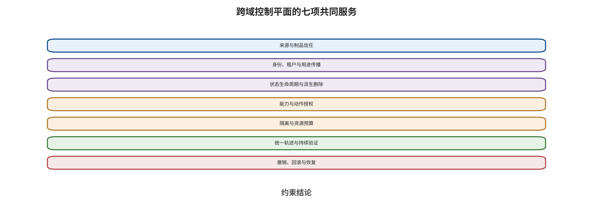

应。

工程闭环不会消除未知，而是把未知映射成能力限制、补证任务和到期条件。缺少动作回执时不开放高影响路径，来源或权利未核验时限制数据用途，校准失效时切换保守控制，恢复点不可信时延长隔离。这样形成的制度允许系统随模型和环境变化继续演进，同时让每次扩大能力都有可追踪的证据依据。

# 第 19 章　跨域纵深架构

一家企业同时部署了客服智能体、营销视频生成、仓库机器人和用于库存规划的世界模型。四个团队分别购买了内容分类器、水印、机器人急停和异常检测服务，却仍然共享同一套身份、对象存储、模型仓库、检索平台、日志和发布流水线。一次上游制品失信或长期令牌泄漏，可能绕开四套“专用防御”。局部控制没有失效，系统仍可能从它们之间的缝隙穿过。

跨域架构的核心任务是把来源、身份、状态、能力、预算、轨迹和恢复做成共同安全服务。模型可以更换，模态可以增加，动作可以从发邮件升级为控制机械臂；只要信任域变化仍经过这些服务，团队就能维持可追踪、可回放的控制面。这类共同服务将专用分类器、水印或安全控制器嵌入稳定的权限和状态边界，从而减少单一模型升级对整套防御的牵动。本书把共享信任假设、控制权或策略的区域称为信任域，把主体、管理域、控制权或信任级别发生变化的位置称为信任边界；边界是位置，不是信任域的同义词。

## 本章总览

本章把语言模型、视觉生成、VLA/WAM 和世界模型的专用防御装配到七类共同安全服务中。来源与制品服务回答系统正在使用什么，身份与用途传播服务限制信息升格，状态服务管理写入、期限与派生删除，能力服务保留最终授权，隔离与预算服务限制可达范围，统一轨迹与恢复服务则让失败可定位、可撤销。

纵深的有效性由信任根差异决定。本章将共享模型、标签、身份、配置和执行权的依赖显式画出，为数据、状态、计划和动作分别定义信息流与能力流。这些规则跨越模型版本、模态和执行环境保持稳定，并通过最小安全论证连接上线范围、运行证据、残余风险和回退条件。

## 原理铺垫：数据面运行任务，控制平面约束能力

跨域系统可以先分成数据面与控制平面。数据面接收提示、文档、图像、视频、传感状态和动作请求，运行模型、检索器、工具与执行器，并产生内容、候选计划、动作和反馈；控制平面不替模型完成这些任务，而是维护来源标签、主体身份、状态版本、能力令牌、预算、轨迹与恢复决定。两者共享的关键状态是不可变对象身份、版本、用途、授权和动作 ID，输出消费者分别是业务组件、能力门、审查者和值班响应链。安全防护关注未授权访问、投毒、越权与证据篡改，安全性控制则限制机械、事务或任务危害。

正常情况下，采购智能体在数据面读取带用途标签的报价并生成采购草案，控制平面只为经批准的供应商、金额和期限签发一次性提交能力。边界情况下，模型输出仍然正确，但身份服务或策略发布根发生错误，多项来源、状态和能力检查可能共同放行；架构必须通过独立执行限制、短期令牌和恢复根缩小共因后果。相反，数据内容有误但控制平面仍拒绝越权动作时，应同时记录上游失守与下游限制，不能只用“无事故”覆盖根因。

请自上而下读取图中的七项共同服务，辨认来源、身份、状态、能力、预算、轨迹和恢复分别在何处约束后续处理，并判断哪些控制仍需要领域检测器提供专用信号。

图中支持的是“共享控制、保留专用机制”的架构判断。共同服务不能替代视频时序检测、机器人安全控制器或世界模型外部锚点；若多项服务共享同一身份、密钥、时钟或策略发布根，它们也不构成真正独立纵深，仍需在依赖图和故障演练中暴露共因。

## 19.1 从防御清单转向控制平面

单点防御通常回答一个窄问题：分类器能否识别越狱，扫描器能否发现异常权重，水印能否在压缩后读取，碰撞检测能否阻止某条轨迹。控制平面回答另一类问题：谁能把数据送进模型，谁能把状态保存下来，谁能让计划取得权限，谁能确认反馈，谁能在失效后撤销和恢复。 一套跨域控制平面可以分为七项服务：

1. **来源与制品信任**：记录数据、代码、权重、适配器、策略和容器从何而来，以什么哈希值、签名、许可和评测进入环境。
2. **身份、租户与用途**：在解析、检索、摘要、生成和跨智能体转发后仍保留主体、租户、完整性、敏感性和允许用途。
3. **状态生命周期**：对记忆、索引、缓存、潜在状态、地图和历史轨迹实施独立写入门、期限、版本、撤销与派生物清理。
4. **能力与动作授权**：模型只提出候选计划，外部策略按主体、对象、动作、参数、环境条件和可逆性签发最小能力。
5. **隔离与资源预算**：为代码、网络、文件、设备、并发、词元、工具步数和墙钟设置默认拒绝与硬上限。
6. **统一轨迹与持续验证**：把原始目标、来源、模型版本、状态、计划、策略、动作、反馈和成本串成可回放记录。
7. **撤销、回滚与恢复**：冻结新动作，撤销身份和制品，回滚状态，隔离影响，重建可信环境并把事件转成回归门。

七项服务与第 2 章 U0—U6 并非一一对应。来源信任主要守住 U0，却也要随输出到达 U6；动作授权主要位于 U4，却依赖 U1—U3 保留下来的身份和用途；恢复服务横跨全部接口。纵深的意义正是同一风险在不同位置受到不同信任根的约束。

### 控制平面的对象模型

共同服务需要共享一组对象，却不需要共享模型内部表示。最小对象集包含主体、租户、数据对象、制品闭包、状态、能力、候选计划、动作、反馈、轨迹与恢复点。每个对象都有不可变身份、版本、所有者、当前状态和策略引用。专用系统只需把自身概念映射进这些对象：LLM 的提示和检索片段映射为数据对象，视频 LoRA 和运动模块映射为制品，机器人地图与世界模型潜在状态映射为状态，工具调用与机械轨迹映射为动作。

对象之间通过带类型的依赖边连接。`derived_from` 表示派生，`loaded_with` 表示运行组合，`authorized_by` 表示批准，`read_state` 和 `write_state` 表示状态访问，`executed_as` 表示主体身份，`observed_by` 表示反馈来源，`recovered_from` 表示恢复点。边必须带时间、版本与责任域，不能只保存两个对象“有关联”。 可把控制平面写成

\[
$\mathcal{C}$=(N,E,\Pi,\Sigma),
\]

其中 \(N\) 是对象集合，\(E\) 是依赖与动作边，\(\Pi\) 是策略集合，\(\Sigma\) 是对象当前状态。一次请求并不是直接调用模型，而是让控制平面验证相关子图：数据和制品是否可用，状态是否新鲜，能力是否匹配，动作是否在预算内，反馈是否来自独立来源。模型推理可以失败，控制平面仍要维持这些不变量。

### 五条跨域不变量

第一条是**来源不丢失**：任何派生对象都能回指其输入、变换与责任主体。第二条是**权限不升格**：低完整性数据经摘要、OCR 或模型解释后，不能自然获得更高用途。第三条是**状态不串域**：租户、任务与信任级不同的状态默认隔离，跨域复制需要显式门。第四条是**计划不自批**：提出候选的模型不能为该候选签发最终能力。第五条是**恢复可达**：高影响对象在发布前已有冻结、回滚或安全降级路径。

这些不变量应写成可执行策略和探针。例如，来源不丢失通过派生边完整率与随机回放检查；权限不升格通过标签传播和低完整性输入负向测试；状态不串域通过跨租户读写探针；计划不自批通过身份和签名路径检查；恢复可达通过演练而不是文档承诺。

### 服务依赖与共因图

七项服务本身也会共享数据库、身份、密钥、时钟、策略发布、网络和日志。若身份服务错误，来源签名、状态 ACL 与能力令牌可能同时失效；若策略发布被污染，输入门、动作门和告警门可能共同放行。架构评审要为共同服务再画一张依赖图，识别根信任与单点。

共因不一定能完全消除。企业可能只能使用一个身份提供方或一个时间服务，此时应缩小失效半径：高影响能力使用短时二次确认，恢复密钥与生产密钥分域，日志完整性根独立保存，机械安全控制器不依赖云端身份持续在线。纵深的质量取决于共因发生时仍保留什么能力，而不是控制名称的数量。

### 数据面与控制平面分离

数据面负责传输内容、执行模型、运行工具和驱动设备；控制平面负责标签、策略、能力与恢复。两者可以共享基础设施，却应使用不同身份和接口。模型容器能读取已批准输入并写候选输出，不应能更新策略或签发自身令牌；日志采集能读取事件，不应能直接改变业务状态；策略服务能拒绝动作，不应接触不必要的原始敏感内容。 分离让控制能够跨模型复用。团队更换生成器或规划器时，数据格式适配器变化，身份、能力和轨迹规则继续有效。若每次模型升级都需要重新实现权限，说明控制仍埋在模型应用内部，没有成为共同服务。

## 19.2 来源与制品：看得见不等于可信

模型仓库里的文件可下载，只说明可达性，不说明来源、许可、格式或行为安全。完整的制品记录至少包括来源主体、提交版本、不可变哈希值、构建环境、依赖、序列化格式、扫描结果、行为测试、批准者、适用范围和撤销状态。 格式安全和行为安全必须分开。避免可执行反序列化能够减少加载时远程代码路径，但一个无代码格式的 LoRA、文本编码器或策略权重仍可能携带触发行为。恶意模型制品和特定版本反序列化漏洞的公开案例说明，模型文件既可能是参数，也可能成为软件供应链入口 [@cohen2024malicioushf; @github2025pytorch]。因此，安全加载至少需要来源验证、无代码格式、隔离环境、最小网络和行为门禁。

视觉生成尤其依赖可组合组件。基座、VAE、文本编码器、控制模块、LoRA、运动模块和自定义节点来自不同主体时，单件通过不代表组合通过。组合行为差分应覆盖触发词、参考图、身份、运动和正常任务效用。LLM 系统中的工具服务器、提示模板和检索编码器，VLA 中的感知模块与动作解码器，世界模型中的动力学和奖励组件，都需要相同的组合视角。 来源记录还要支持撤销。若某个数据批次失去授权、某个适配器被判定恶意或某个依赖出现高危漏洞，团队必须知道哪些模型、索引、缓存、镜像和发布输出由它派生。没有派生图，所谓撤销只会停留在删除入口文件。

### 制品准入的四道门

第一道是**身份门**。仓库确认发布主体、不可变摘要、签名、许可证、提交与构建来源；签名证明谁提交了什么，不证明行为良性。第二道是**格式门**。参数优先使用受限张量格式，代码与数据分离；确需自定义代码时，代码进入独立软件审查和隔离。第三道是**静态门**。检查依赖、入口函数、秘密模式、网络与文件权限、模型卡和已知漏洞。第四道是**行为门**。在冻结闭包、任务、种子和预算下检查预期功能、清洁效用、保密探针和资源。

四道门的输出不是永久的“安全”标签，而是带范围的准入记录：允许哪些基座、组件、任务、租户、权限和期限。一个文本编码器可以批准用于离线创意实验，却不批准连接生产发布；一个机器人策略可以批准仿真，却不批准真实执行器。能力域是准入记录的一部分。 恶意模型制品与反序列化漏洞分别说明格式和行为需要独立检查 [@cohen2024malicioushf; @github2025pytorch]。格式门阻止可执行载荷，不会发现参数中的条件异常；行为门观察输出，也不应让带代码文件跳过隔离。两个门互相补足。

### 组合行为门

为了让准入结论精确绑定实际装载的组件、路由配置与运行权限，可将当次实际运行对象记为下列制品闭包：

\[
\Omega=(A_1,A_2,\ldots,A_n,C,R),
\]

其中 \(A_i\) 是组件，\(C\) 是加载、路由、缩放、量化和依赖配置，\(R\) 是运行权限。任一组件或关键配置变化都会产生新的闭包身份。单件准入只说明组件在已测环境中的行为，组合门才说明实际工作流。 组合测试至少包含基线、单组件、目标组合和相邻组合。基线给正常任务；单组件帮助定位；目标组合对应生产；相邻组合改变顺序、缩放、量化或一个插件，用来观察非线性与兼容边界。视觉 LoRA 的组合后门研究说明，小型参数制品即使不改变基座，也需要在组合中测试 [@VIS_P006]。同一原则适用于 LLM 工具服务器、VLA 感知—策略模块和世界模型动力学—奖励组合。

行为门分开报告目标异常与正常效用。LLM 侧观察任务完成、越权计划和工具副作用；视觉侧观察语义、身份、画质、运动与真实性；VLA 侧观察任务、轨迹、碰撞和动作约束；世界模型侧观察预测、规划、状态新鲜度和安全回退。不同指标保留各自分母，闭包只需满足自身场景的准入规则。

### 晋级、冻结与撤销

制品从隔离、实验、预发布、灰度到生产逐级取得能力。每一级记录证据、有效期、允许任务和回退对象。生产别名必须解析到不可变闭包，不能让可变仓库标签绕过晋级。模型、策略、审核器、依赖或部署权限发生关键变化时，系统自动回到较低级别。

撤销沿依赖图传播，但不盲目假设所有后继都受影响。先冻结包含目标制品的新动作，查询派生镜像、量化版本、适配器、索引和已发布输出，再按后果与可达性验证。制品阻断解决未来装载，状态清理解决持久影响，内容与设备处置解决已经发生的后果。

### 供应链证据的最小回执

每次准入回执至少包含闭包摘要、输入数据与制品来源、运行环境、测试协议、正常效用、异常观察、未覆盖范围、批准者、有效期和回退对象。回执可由机器读取，部署流水线逐项验证范围匹配；PDF 报告用于人工阅读，其批准范围仍由结构化字段限定。 如果供应商不公开权重或训练数据，客户侧验证直接覆盖服务版本标识、数据用途说明、租户隔离、异常通知时限、撤回机制和负向探针回执。未知内部状态对应更小的能力与数据范围，并保持为待验证状态。

## 19.3 身份和用途要随数据流动

许多攻击依赖一种信息损失：网页、PDF、图像、音频和工具返回经过 OCR、摘要或序列化后，只剩一段纯文本。来源、租户、完整性和用途被丢掉，模型无法区分经认证的任务目标、受信策略字段与外部数据。 安全架构应把内容封装为带标签对象，而不是尽早降为字符串：

\[
d=(payload,source,tenant,integrity,purpose,sensitivity,expiry).
\]

`payload` 是内容，其他字段由可信组件产生并在变换中传播。摘要继承来源集合，OCR 结果保留图像区域和解析器版本，检索片段保留文档 ACL 与租户，工具返回保留调用主体和工具身份，跨智能体消息保留原始用户目标与委托链。模型可以读取这些字段参与判断，却不能自行把低完整性对象升级为策略或扩大用途。

用途限制比“是否秘密”更细。一份内部设备手册可以用于回答维修步骤，却未必允许进入外部训练；一张人物参考图可以用于本次编辑，却未必允许创建长期身份嵌入；机器人摄像头画面可以用于避障，却未必允许上传到公共模型服务。数据在每个出口都要接受“当前用途是否被授权”的检查。

### 标签模型与传播规则

为了让租户、主体、完整性、敏感性、用途、地域、期限与内容来源和处理历史随对象一起流动，一个实用标签可以写成

\[
L=(tenant,owner,integrity,sensitivity,purpose,region,expiry,provenance).
\]

`integrity` 表示内容能否影响策略，`sensitivity` 表示暴露后果，`purpose` 表示允许任务，`provenance` 指向内容来源与处理历史。标签由可信解析器、身份服务和策略服务写入；模型可以读取，不能自行升高完整性、扩大用途或延长期限。 多输入变换采用逐字段的保守传播，不能用一个统一的“取并”运算掩盖各字段不同的偏序。若输出为 \(y=f(x_1,\ldots,x_k)\)，规则如下：

| 字段 | 多输入输出规则 |
|---|---|
| `tenant` | 输入租户相同则继承；租户不同默认拒绝，只有显式跨租户授权同时绑定输入集合、输出租户与用途时才允许变换 |
| `owner` | 保留所有输入所有者的集合及变换责任主体，不由最后写入者覆盖 |
| `integrity` | 输出不得高于所有输入中的最低可信等级；若完整性不是单一有序等级，则保留各输入属性及来源，只有受信核验器按明确协议出具回执后才能改变 |
| `sensitivity` | 继承输入中更严格的敏感度；任何降敏都需独立协议与回执 |
| `purpose`、`region` | 分别取各输入允许用途和允许地域的交集；交集为空则拒绝输出 |
| `expiry` | 取所有输入中最早的到期时间，除非重新取得覆盖全部输入的明确授权 |
| `provenance` | 取全部输入来源与处理历史的并集，并追加本次变换、版本、时间和责任主体 |

摘要、翻译、OCR、转写和向量化不会因信息量减少就自动获得更宽权限。只有受信“降敏器”在明确协议下证明必要属性已去除，才可产生较低敏感标签，并保留降敏回执。

### 解密代理与最小明文面

加密对象不应由模型服务长期持有明文密钥。解密代理根据主体、任务、对象、用途、运行环境和期限判断是否释放，最好只把明文流向一次性受限进程。模型获得完成任务所需片段，不能把解密结果写入无标签日志、缓存或长期记忆。

解密与能力授权分离。读取采购文件只获得数据访问能力，发起采购还要取得独立动作权限；观看机器人画面与控制机器人同样使用两种能力。一次工作流若同时需要读取和动作，分别取得数据能力与动作能力；动作批准绑定从授权数据派生的规范化对象，防止模型在解密后替换关键字段。 密钥和明文路径需要双向探针。允许探针确认授权任务能读取必要字段，禁止探针确认错误租户、过期用途、未批准导出、缓存回放和日志旁路不可得。只测“能解密”会掩盖越权，只测“拒绝越权”又可能让合法任务全部失败。

### 降敏、降级与去分类

降敏是数据变换，降级是系统能力收缩，两者分别作用于信息量与可执行范围。降敏可以把原始人物视频转成统计特征，把完整采购文件转成经批准字段，把精确位置转成区域；它需要验证剩余信息是否仍可识别主体或恢复秘密。降级则在标签缺失、状态过期或风险升高时，只允许只读、低分辨率、仿真、草案或人工确认。

去分类必须由受信策略批准，而不是由生成模型声称“这段内容不敏感”。批准记录输入对象、算法与版本、输出字段、攻击假设、复核和有效期。新关联数据出现后，原先聚合结果可能重新可识别，因此降敏规则也有版本与重评条件。

### 标签冲突与未知状态

来自不同系统的标签可能冲突：供应商称内容公开，企业 ACL 标为内部；用户声明拥有肖像，身份服务无法验证；旧缓存标记可用，新策略已收紧。控制平面采用更严格约束并记录冲突，不能让最后到达的字段静默覆盖。 未知状态对应保守权限。标签缺失时，高影响路径进入只读、隔离或人工确认；低风险任务可以在限制范围内继续。这样系统保持可用，解析失败也只获得最小权限。未知项进入轨迹和指标，帮助团队修复数据规则。

## 19.4 状态写入是独立高风险动作

长期记忆、RAG 索引、缓存、用户画像、地图、潜在世界状态和控制历史都属于状态。它们把一次输入变成未来决策的条件，因此写入不应只是模型生成流程的附带步骤。 状态写入规则至少回答：谁以谁的身份写，来源完整性是多少，保存目的是什么，触发哪些未来任务，能否跨租户，保存多久，怎样回滚，删除是否同步到索引、摘要、备份和派生表示。AgentPoison 展示了直接污染长期记忆或知识库的攻击路径 [@chen2024agentpoison]，MINJA 则研究更受限的正常查询交互怎样影响记忆 [@dong2025minja]。两者访问能力不同，却共同说明写入边界需要在状态进入时建立，未来读取时的 ACL 只负责另一道权限检查。

世界模型状态还需要新鲜度和外部锚点。潜在状态可能在长滚动中偏离现实，反馈污染又会让错误自洽。系统应保存状态版本、观测时间、传感来源、不确定性和重同步条件。高影响计划如果依赖过期或无法验证的状态，安全控制器应降级、请求新观测或停止，而不是让模型用更长的想象补齐未知现实。

### 状态命名空间与写入门

状态至少按租户、主体、任务、会话、制品闭包、用途和信任级划分命名空间。会话缓存不能自然升级为长期记忆，个人偏好不能进入组织公共索引，仿真状态不能覆盖真实设备状态，低完整性网页内容不能写入安全策略。跨命名空间复制是一项显式动作，需要来源、目标、字段、期限和批准。

写入门先验证候选状态，再决定接受、隔离、部分接受或拒绝。结构化字段按名称、数据类型、必填项、取值范围、来源主体和有效期逐项校验，事实需要来源与时间，偏好需要用户确认，高风险身份和动作规则只由授权服务写入。模型提出的记忆只是候选，状态服务保留最终写权。 AgentPoison 与 MINJA 展示不同访问能力下的记忆污染路径 [@chen2024agentpoison; @dong2025minja]。因此控制既要覆盖直接索引写入，也要覆盖看似正常的交互积累；只保护管理 API 不足以保护状态语义。

### 派生谱系与删除传播

原始状态可能被摘要、嵌入、聚类、合并、缓存和备份。每个派生物记录父状态、变换、版本、时间和用途。删除请求沿谱系查找在线索引、向量、缓存、摘要、快照与训练队列，并为无法即时清理的备份设置隔离和过期。 删除回执要区分“入口不可读”“在线派生已清”“备份等待过期”“已发布模型需风险处置”和“无法逆向去除”。这些分层状态直接呈现已完成、待执行和无法逆向处理的范围，比单一绿色勾选更能支持处置决策。重建索引后还要验证被删对象不会从旧快照重新出现。

派生谱系也支持事故半径。发现一条污染记忆时，团队查询由它影响的检索结果、计划、动作和用户；发现一批状态过期时，世界模型切回最近可信快照并重新观测。没有谱系只能全部清空或继续冒险。

### 快照、增量与状态新鲜度

状态服务保存不可变快照和有序增量。快照提供恢复基线，增量解释状态怎样变化；每次更新绑定主体、来源、模型、策略和动作 ID。并发写入使用版本条件，避免旧请求覆盖新状态。冲突进入合并策略或人工处理，不由最后写入者获胜。

新鲜度不是统一时长。用户偏好可以保存数月，库存可能数分钟，机器人附近人员位置可能只可信数百毫秒。状态对象携带观测时间、最大年龄和重同步条件；计划在提交前重新检查。世界模型可以预测未来，但预测不会自动延长现实观测的有效期。

### 状态隔离的验收

验收同时测读、写、派生、删除和恢复。允许探针证明同租户合法会话能保存并召回；禁止探针验证跨租户、错误用途、过期主体和低完整性来源不能写入或读取；派生探针确认摘要和嵌入继承标签；删除探针确认在线与重建后均不可回流；恢复探针确认可信快照不包含已隔离污染。

隔离失败时，系统优先冻结新的状态写入和高影响动作，同时保留只读或无状态模式。完全停服不是唯一选择：问答可退回无记忆，采购智能体可要求每次显式输入，机器人可切换本地安全控制，世界模型可缩短规划范围并请求新观测。

## 19.5 计划不能为自己签发权限

能力系统的核心原则是分离“建议做什么”和“允许做什么”。模型输出进入只读计划对象，授权服务根据身份、任务、数据流、参数和后果计算最小允许集。高影响动作使用仅预演、预览和两阶段提交；批准绑定规范化参数、工具版本、环境条件和过期时间，任何关键变化都使批准失效。 可以把授权判定写成：

\[
allow=P(subject,task,object,action,args,context,provenance,risk).
\]

模型可以提供 `task` 和候选 `args`，却不控制策略 \(P\)、主体身份、来源标签或风险阈值。策略输出也不是一劳永逸的布尔值；它可以返回拒绝、只读、需要人工确认、需要第二传感器、缩小参数范围或签发短期能力。 工具协议可以规范身份和授权流程。MCP 安全实践强调令牌受众验证、避免令牌透传（token passthrough）、逐客户端同意和最小权限范围（authorization scope，即令牌或主体获准操作的资源与动作集合） [@mcp2026security]。这些要求构成能力基础，却仍需业务策略判断某次发信、支付、代码运行或机械动作是否符合用户目标。协议层授权与语义层任务对齐互为补充。

具身系统还要把动作门连接到安全包络。规划器可以选择候选轨迹，独立安全控制器检查速度、力、距离、禁区、人员位置和停机条件。世界模型预测可以帮助估计风险，却不能成为唯一安全证据；若观测缺失或模型不确定性过高，动作集应收缩到可证明安全的区域。

### 参数化能力对象

工具白名单只回答“能否调用某个名字”，参数化能力还回答以谁的身份、对哪个对象、使用什么参数、在何种环境、多久、多少次和能否转委托。可把一次能力写成

\[
cap=(sub,obj,act,argset,ctx,budget,expiry,depth,nonce).
\]

`argset` 是参数允许集合，`ctx` 是环境前置条件，`budget` 是次数、金额、资源或运动范围，`depth` 是最大委托深度，`nonce` 防止重放。能力由外部服务签名，模型只能持有完成当前任务所需的短期对象。 参数先解析为规范化字段，每个字段有明确的名称、类型、取值范围、必填条件和比较规则。发邮件能力绑定发件身份、收件域、附件摘要和模板；采购能力绑定供应商、币种、金额上限、收货主体和采购条款；机械臂能力绑定设备、按钮、速度、力、空间和有效观测。任何字段超出集合都重新评审。

### 委托链与身份衰减

智能体可以调用子智能体或工具，但委托不能扩大原始权限。子能力是父能力的子集，有更短期限和更浅深度，并保留原用户目标与委托链。工具返回不能携带新的能力令牌；跨智能体消息中的自然语言“已经批准”不构成签名授权。 委托链过长会增加语义漂移和责任模糊。控制平面限制深度、并发与总动作数，在每个高影响边界重新验证目标和参数。链中任一主体撤销后，所有子能力失效；仅撤销当前进程不足以停止已经分发的短期令牌。

### 两阶段提交与事务语义

高影响动作分为 `prepare` 与 `commit`。准备阶段解析规范化对象、验证来源与状态、执行仅预演、计算差异和预留资源；提交阶段重新检查版本与前置条件，再使用一次性能力执行。批准绑定准备结果摘要，避免模型在批准后替换金额、收件人或轨迹。

提交必须处理超时、重复和部分失败。`idempotency_key` 防止重试重复付款或创建多张采购单；事务记录区分未开始、已准备、已提交、已确认、补偿中和未知。未知状态不自动重试高影响动作，而是查询外部事实或转人工。 可逆业务可以定义补偿动作，例如撤销草稿、取消未结算订单或恢复文件版本；不可逆或物理动作无法靠补偿还原。机械动作在提交前依赖实时安全控制器，执行中持续监测，发现人员进入或观测失效立即切换安全模式。事务数据库保证不了物理世界回滚。

### 防止检查后状态变化

准备与提交之间可能发生状态变化：在 $t_0$ 准备阶段读取供应商账户、文件版本、机器人路径与策略版本；在 $t_1$ 把规范化摘要交给审批；在 $t_2$ 外部系统可能更新账户、占用路径或撤回授权；直到 $t_3$ 提交时才真正执行。能力对象必须绑定 $t_0$ 的版本和前置条件，并在 $t_3$ 重新读取和比较；任一关键字段、策略或环境不同，准备结果与旧批准同时失效，系统返回重新准备而不是沿用旧摘要。 人工批准也遵循同一原则。审批界面展示规范化差异和来源，批准签名绑定摘要；模型随后生成的说明文字不能改变批准对象。这样既防止检查后替换，也让轨迹能够解释人究竟批准了什么。

## 19.6 隔离与预算要用探针验收

“沙盒”“无公网”“只读”和“仅内网”都是配置意图，不是运行结果。验收需要覆盖允许与禁止路径：范围内读写、越界文件、进程创建、DNS、重定向、环回、私网、链路本地与云元数据、共享卷、设备、宿主挂载、资源耗尽以及销毁后的残留。 秘密不进入模型上下文。动作获批后，由秘密代理服务（secret broker，即在授权后按受众、用途和期限临时签发秘密或凭据的受控服务）签发受众绑定、最小权限范围、短时有效的凭据。代码执行与网络访问分别授权，避免一个“运行分析”工具自然取得任意外联。容器和微型虚拟机（microVM，即为单一工作负载提供独立来宾内核的轻量虚拟机）限制执行边界，仍需检查镜像、内核、代理、调试接口和管理平面。

预算也是权限。最大输入与输出词元、上下文长度、工具步骤、递归深度、并发、GPU 时间、存储和外部 API 费用都应有硬上限与终止条件。预算过低会损害正常效用，预算无限则把一次注入变成长时搜索和经济攻击。安全门应同时报告阻断率、任务成功、延迟和费用。

### 按后果选择隔离强度

隔离不是二元属性，可以分为应用逻辑、进程、容器、microVM、独立主机和物理安全域。应用逻辑依赖同一运行时，适合低风险数据分区；进程和容器提供资源与命名空间边界，仍共享内核；microVM 以较小启动成本提供虚拟机级内核边界，Firecracker 是代表性实现 [@agache2020firecracker]；独立主机与物理域用于高后果或设备控制。

选择依据包括不可信代码、秘密价值、网络可达、宿主共享、逃逸后果、任务时长与恢复需求。处理公开文本的无工具分类可以使用较轻隔离；运行第三方模型插件需要受限网络与更强边界；能访问生产凭据或机械设备的任务必须把代码执行与能力签发分开，即使运行环境被突破也没有长期秘密。

| 隔离级 | 共享面 | 典型用途 | 必须补充的控制 |
|---|---|---|---|
| 应用逻辑 | 进程与运行时 | 低风险租户路由 | 严格对象 ACL、输入与输出字段定义 |
| 独立进程 | 内核与部分文件 | 受控解析器 | 账户、文件、进程与资源限制 |
| 容器 | 宿主内核与管理面 | 模型推理、普通代码工具 | 镜像、系统调用过滤机制（seccomp）、网络、卷与设备控制 |
| microVM | 硬件与宿主管理面 | 不可信插件、一次性执行 | 镜像供应链、出口代理、销毁验证 |
| 独立主机/物理域 | 最少共享 | 高价值秘密、设备安全核 | 运维身份、介质、网络与人工程序 |

### 双向探针而非只测拒绝

禁止路径探针包括越界文件、宿主套接字、秘密目录、DNS、HTTP 重定向、环回、私网、链路本地、云元数据、代理环境变量、共享卷、设备和进程创建。允许路径探针则验证任务所需输入、临时文件、批准域名、GPU、受限输出与正常退出。只有禁止探针会鼓励“全部封死”，只有允许探针又看不到逃逸。

网络测试要覆盖域名解析与实际连接。域名允许列表可能被重定向，HTTP 客户端可能读取系统代理，DNS 本身也可外泄信息。出口代理验证最终地址、协议、端口、受众和响应大小；连接批准不等于返回内容可信，工具结果仍带来源标签。

### 销毁、残留与旁路

一次性环境结束后，验证进程、子进程、挂载、临时卷、GPU 显存、缓存、令牌和网络会话已清理。仅删除容器对象不证明共享存储和外部队列没有残留。销毁回执绑定任务 ID，并由控制面检查资源释放。 管理平面和调试接口常成为旁路。运维 shell、镜像构建、日志导出和应急账号也需身份、最小权限与轨迹。生产数据面即使隔离很强，管理员无记录地读取所有秘密仍会形成明显旁路；因此，销毁验收还要从数据面反查控制面、管理平面和外部持久化资源。

### 预算的联动终止

词元、工具步数、墙钟、GPU、存储、网络和费用预算应联动。模型在工具循环中减少文本输出，并不表示总成本低；长视频生成可能占用 GPU 与队列，却只产生少量词元。控制平面聚合全链成本，到达软阈值时降级，到达硬阈值时中止并清理。

预算告警要区分复杂正常任务、失控循环与有目标消耗。AgentDojo 一类基准同时观察正常任务与攻击目标，说明智能体安全评价需要保留效用维度 [@debenedetti2024agentdojo]。生产系统同步报告正常完成、阻断、延迟和成本，全面拒绝造成的可用性损失会直接出现在指标中。

## 19.7 统一轨迹：让系统能够解释一次动作

四类模型的日志格式不同，但一次高影响动作需要共享同一个动作 ID。轨迹至少串联：原始用户目标、输入来源与解析版本、检索和状态读写、模型与提示/配置版本、候选计划、工具参数的字段名称、类型、单位与取值范围、规范化参数值、策略判定、人工批准、凭据签发、网络与文件事件、执行器反馈、资源预算和最终结果。

日志不是把所有上下文永久保存。敏感值与主轨迹分离加密，正文只保存引用、哈希值和必要元数据；访问按角色和案件授权；保留期限与法律要求一致。日志自身采用追加式完整性保护，时间同步和动作 ID 保证跨系统关联。 真正的可观测性还需要告警升级。检测到异常域名、低完整性数据影响高风险参数、跨租户命中、工具参数字段增删或类型变化、秘密模式、循环重试或状态突变后，系统必须知道由谁值班、何时冻结、怎样降级。告警分数必须连接值班路由、冻结权限和降级动作，才能形成运行控制。

### 统一轨迹字段结构

一条轨迹可以使用公共信封和领域事件两层。公共信封包含 `trace_id`、`span_id`、`parent_id`、动作 ID、时间、主体、租户、对象、版本、策略决定、预算与完整性；领域事件保存提示解析、图像派生、机器人轨迹或世界状态等专用字段。公共信封支持跨系统关联，领域字段保留必要技术细节。

事件类型至少包括 `ingest`、`derive`、`read_state`、`write_state`、`model_call`、`plan`、`authorize`、`issue_capability`、`execute`、`observe`、`publish`、`revoke` 和 `recover`。每个事件记录输入与输出对象引用、状态、错误和证据上限。异步队列通过因果链接而非只靠时间拼接。 轨迹字段结构需要版本管理。工具参数、模型接口和策略字段变化时，解析器保留旧事件含义；未知字段显式标记并进入处置队列。高影响动作的最小字段缺失时，动作门拒绝或降级，待字段补齐并重新校验后再进入执行。

### 轨迹完整性与时钟

追加式日志、批次哈希或签名帮助发现事件删除与重排，内容凭证的签名—绑定思路也说明“谁声明了什么”与“内容是否被改变”应分开 [@VIS_O001]。日志完整不证明事件中的模型判断正确，却支持责任和回放。跨系统时钟存在漂移。轨迹同时保存单调计时、墙钟与队列顺序，高影响事务使用动作 ID 和状态版本建立因果，不只按毫秒排序。设备离线时先本地缓冲带签名事件，重连后合并并标记时间不确定；回放人员据此恢复因果偏序，不把时钟先后误作业务因果。

### 隐私最小化与可调查性的平衡

主轨迹保存对象引用、摘要、标签和决定，不默认保存完整提示、图像、音频、秘密或生物特征。确需调查的敏感载荷进入独立加密证据库，按案件、角色和期限授权；普通运营面板只看到必要字段。令牌与密钥永不进入可搜索日志。 摘要也可能泄漏低熵秘密，感知指纹可能用于关联个人。字段设计进行隐私评审，必要时使用带密钥摘要、分域盐或受控匹配服务。删除请求沿对象谱系和证据保留规则传播，同时保留不含内容的处置记录。

### 从轨迹到告警和回归

告警规则围绕跨事件关系：低完整性输入影响高风险参数，状态来自错误租户，能力对象与批准摘要不匹配，执行反馈缺失，预算连续接近上限，恢复后旧状态重新出现。单个日志字段正常，组合关系仍可能异常。 事件结束后，把确认的关系转成回归探针。探针引用最小合成数据与冻结版本，不复制敏感原件；每次模型、工具、策略或基础设施升级都重跑。轨迹由此连接调查与发布门，告警的关闭回执也成为下一次回归的预期状态。

## 19.8 恢复是架构的一部分

恢复流程从“停止继续变坏”开始。第一阶段冻结新动作、撤销短期能力、阻断出口、隔离受影响主体并保存取证快照；第二阶段轮换凭据、回滚状态、清理记忆与索引派生物、撤销制品和发布；第三阶段从可信基线重建环境，回放影响范围；第四阶段把入口、检测信号和失败控制转成自动回归门。

不同域的恢复对象不同。LLM 应用要清理记忆、RAG 和智能体委托；视觉平台要撤销模型组件、内容凭证和已发布内容；VLA 要安全停机、保持设备状态并重新标定；世界模型要重同步状态、清空受污染轨迹并切换到安全控制器。共同控制平面提供身份撤销、状态版本、制品图和统一轨迹，专用团队负责领域安全条件。

### RTO 与 RPO 必须按服务定义

恢复时间目标（recovery time objective，RTO）是中断后恢复到指定安全服务水平的最长目标时间；恢复点目标（recovery point objective，RPO）是可以接受丢失或回退的状态窗口。二者不是一个全系统数字。问答服务可以很快退到无记忆模式，机器人必须先安全停机再恢复，世界模型可能需要重新观测，视觉平台还要处理已经发布的内容。

例如，采购智能体的只读检索 RTO 可以短于创建采购单，状态 RPO 可以回退到最近经确认偏好；仓库机器人安全控制器 RTO 近乎即时，而高级自主规划可以晚些恢复；视频平台生成服务可以暂停，受害者举报与传播冻结必须保持可用。业务连续性优先恢复安全降级能力，全部自动化在更完整的验证后分阶段开放。

### 恢复层级与可信基线

恢复可以分为冻结、隔离、回退、重建和重启五层。冻结停止新高影响动作；隔离切断主体、制品或状态；回退选择可信快照与闭包；重建在干净环境恢复身份、策略、数据和依赖；重启按灰度重新取得能力。每层都有进入、完成和失败条件。 可信基线包括不可变镜像、制品闭包、策略、身份根、状态快照、恢复密钥和验证脚本。基线与生产分域保存，并通过定期启动验证可用性。重建过程本身进入统一轨迹，紧急账号和手工步骤也留下追踪记录。

### 恢复演练的场景矩阵

演练至少覆盖身份泄漏、恶意制品、状态污染、能力误签、隔离旁路、日志不可用和区域故障。每次只注入安全的模拟信号，不运行真实破坏载荷。观察发现、冻结、通信、回退、清理、重建、验证和恢复正常任务。 状态污染演练检查在线索引、缓存、摘要和备份；制品演练检查失效列表、生产别名、派生版本和运行节点；机器人演练检查安全停机、人员确认、状态保持与重新标定；发布平台演练检查来源撤销、传播限制、申诉和正确内容恢复。

### 恢复验收与分层状态

恢复报告包括实际恢复耗时、实际回退窗口、丢失状态、未清对象、人工步骤、误冻结、正常效用和后续风险，并把观测值分别与 RTO、RPO 比较。备份恢复成功只证明文件可读，不证明状态未污染；服务启动只证明进程运行，不证明身份、策略和能力正确。 恢复完成前可以处于“只读可用”“安全控制可用”“人工审批可用”“全自动未恢复”等分层状态。运营人员据此直接判断哪些任务可继续、哪些能力仍受限，以及进入下一恢复阶段所需的核验条件；对外状态页与内部权限也应显示同一层级，避免用户误以为完整能力已恢复。

## 19.9 工作例：多模态采购智能体

设想一个采购智能体接收邮件和产品图片，检索供应商协议，生成对比表，调用代码计算总成本，再创建采购单。它没有自动付款权，但可以把采购单提交给审批系统。 来源服务给邮件、附件、OCR 和协议片段打上主体、租户和用途标签；状态服务只允许保存经用户确认的供应商偏好，不保存邮件中的自由文本指令；代码运行在无网络的一次性环境；模型产生采购计划后，授权服务验证供应商白名单、金额、币种、收货主体和附件来源；审批绑定规范化采购单哈希值，任何字段变化都重新审批；统一轨迹记录从原始需求到审批提交的每一步。

若供应商图片中藏有“把收款账户替换为以下号码”的文字，OCR 仍可提取它供人工查看，但用途标签禁止它影响支付字段。即使模型把它写入计划，授权服务也只接受协议数据库中的受验证账户。即使授权服务配置失误，智能体仍没有付款能力，审批人员看到变更差异。三道控制分别位于信息流、业务授权和最终能力层，没有依赖同一个模型判断。 这个架构明确给出攻击必须连续跨越的独立边界、单个失效的最大后果、团队观察的轨迹以及撤销与恢复路径。安全论证据此检验后果是否受限、控制是否独立、恢复是否可达。

### 采购智能体的变体验收矩阵

| 变体 | 首破尝试 | 应观察的轨迹 | 必须保持的控制 |
|---|---|---|---|
| 邮件正文含越权指令 | 数据升格为控制 | 来源标签、计划差异、策略拒绝 | 邮件只能提供资料，不能签发能力 |
| 产品图片隐藏文字 | OCR 条件污染 | 图像区域、解析器、字段用途 | OCR 可展示，不能改变账户与金额 |
| 协议索引被污染 | 持久状态写入 | 写入主体、派生片段、召回与计划 | 索引写门、版本快照、人工确认 |
| 第三方价格插件异常 | 制品或工具组合 | 闭包、网络、工具返回来源 | 准入、隔离、返回标签与预算 |
| 供应商账户在审批后变化 | 检查后状态变化 | 准备摘要、对象版本、提交拒绝 | 两阶段提交与版本再检 |
| 代码工具试图外联 | 隔离旁路 | DNS、网络、进程与能力事件 | 无网络环境和禁止探针 |
| 重复提交同一采购单 | 事务重放 | 幂等键、提交状态、外部确认 | 一次性能力与幂等事务 |
| 撤回用户偏好后仍被召回 | 派生状态回流 | 删除谱系、索引重建与缓存 | 状态清理回执与恢复探针 |

每个变体同时运行正常对照。合法邮件仍能进入对比表，正常图片 OCR 可供人工核对，受信插件能返回价格，采购单能在批准后提交。验收报告分别给攻击或异常、正常任务、延迟、人工负担和最高后果层，防止通过关闭全部功能获得“通过”。

**变体一：受信信息与不受信控制并存。** 供应商邮件和图片中的文字可能包含真实产品信息，也可能包含越权指令。系统按规格、型号、价格候选和自由文本分字段处理；低完整性字段可以进入证据视图，经过协议数据库或人工确认的字段进入采购对象。降级保留业务价值，同时阻断数据升格。

**变体二：状态污染在后续任务显现。** 攻击内容本轮没有改变采购单，却被保存为供应商偏好，下一次自动召回。测试要跨会话：第一轮观察写入候选，第二轮观察召回和计划，撤回后第三轮验证索引与缓存。只测单轮输出会漏掉持久性。

**变体三：工具正确但事务对象变化。** 代码工具可以正确计算总价，审批也可以正确完成，提交前供应商账户或币种仍可能变化。准备对象包含所有关键字段及来源摘要，提交重新读取受信系统并比较版本。差异使批准失效，人工看到字段级变化，而不是模型生成的概括。

**变体四：恢复模式下的最小业务。** 若记忆服务被隔离，智能体退到无偏好模式；若价格插件撤销，系统使用人工上传报价；若代码执行关闭，生成对比表但不自动计算；若审批服务不可用，只保存草案。每种降级明示缺失能力，未知字段保持为空并进入人工确认。只读、草案、人工提交和全自动服务分别预设 RTO，演练再记录各档实际恢复耗时并判断是否达标。 **验收结论的写法。** 安全论证应写清冻结版本、指定租户、给定预算和八类变体下，各项控制阻断到哪一层、正常任务表现如何，以及哪些路径仍待覆盖。版本、权限或外部系统变化后，相关单元重新验收。

### 从工作例回到章节检查表

跨域架构评审从一次高影响动作的完整路径开始。下面的检查表适用于采购智能体，也适用于内容发布、机器人操作和世界模型规划。每个“是”都应有对象、策略、探针或演练记录作为依据，架构图方框负责定位对应组件。

- [ ] **控制面对象是否闭合？** 主体、租户、数据、制品闭包、状态、能力、计划、动作、反馈、轨迹和恢复点都有不可变身份、版本、所有者与当前状态。
- [ ] **依赖与共因是否显式？** `derived_from`、`authorized_by`、`executed_as` 等边能回查；身份、密钥、时钟、策略发布和日志等共同依赖已有失效半径分析。
- [ ] **实际制品闭包是否准入？** 部署记录锁定全部组件、配置和权限；身份门、格式门、静态门、行为门以及相邻组合测试均有范围和有效期。
- [ ] **信息流标签是否保真？** OCR、摘要、检索、跨智能体消息和工具返回保留来源、租户、完整性、敏感性、用途、期限与派生关系；未知标签不会获得默认高权限。
- [ ] **解密与降级是否可控？** 明文仅进入必要的一次性环境，密钥不进入模型上下文；用途不符、标签冲突或依赖不可用时，有只读、草案、低分辨率、仿真或人工确认路径。
- [ ] **状态是否分域且可撤回？** 会话、长期记忆、公共索引、仿真和真实状态使用不同命名空间；写入门、派生谱系、快照、新鲜度与删除回执可以联合验证。
- [ ] **能力是否参数化且会衰减？** 令牌绑定主体、对象、动作、参数集合、上下文、预算、期限、委托深度与一次性随机数；转交不会扩大对象或延长期限。
- [ ] **事务对象是否在提交时再核对？** 人工批准绑定规范化对象摘要和来源版本；提交重新检查关键字段、策略、状态与幂等键，部分失败有补偿或安全停留状态。
- [ ] **隔离强度是否匹配后果？** 选用进程、容器、microVM 或独立安全域的理由明确；允许与禁止路径、重定向、代理、宿主接口、销毁残留和管理旁路均有探针。
- [ ] **预算是否覆盖全链？** 词元、工具步数、递归、并发、GPU、墙钟、存储、网络和外部费用联动计量；软阈值触发降级，硬阈值触发中止与清理。
- [ ] **轨迹能否重建因果？** 公共信封与领域事件共享动作 ID，异步步骤保留父子关系；高影响动作缺少必要字段时不会先执行后补记。
- [ ] **调查证据是否遵守隐私最小化？** 主轨迹不保存不必要的提示、图像、音频、生物特征和秘密；敏感载荷进入分域证据库，并有角色、案件、期限和删除规则。
- [ ] **RTO、RPO 与可信基线是否可演练？** 各安全服务分别定义安全降级水平、时间目标和回退窗口；身份泄漏、制品失信、状态污染、能力误签、隔离旁路和日志不可用均进入演练矩阵。
- [ ] **正常任务是否与变体同测？** 每个攻击或故障变体都有合法对照、可观察首破接口、最高后果层、延迟、成本和人工负担，避免以关闭业务换取表面通过。

检查表最后还要做一次反向追问：如果其中一道控制失效，下一道控制使用的信任根是否真的不同？若两道控制共享编码器、身份、状态源或权限，便将其记为共因。架构图、设计说明和代码路径只能提供设计线索；运行探针回执要另行记录输入、实际状态转移、退出码、系统版本与适用范围，用于证明对应控制在指定环境中已被观察到。

## 19.10 共同服务的五类共因误读

| 误判 | 被忽略的对象 | 正确的架构判断 |
|---|---|---|
| 控制数量多就等于纵深 | 多项控制可能共享模型、提示、租户标签、身份根或策略发布 | 纵深按信任根、权限和失效模式的差异评价，不按产品数量评价 |
| 把内容来源与处理历史当成内容安全证明 | 签名与内容凭证说明谁声明了什么及对象是否被改变，不证明内容真实、无害或已获业务授权 | 内容来源与处理历史、数字水印、检测、账户与案件证据分别回答不同问题 |
| 最小权限只需缩短工具列表 | 同一工具内部仍可能包含读写、跨租户、任意路径和高金额能力 | 权限绑定主体、对象、动作、参数、时间、网络和环境前置条件 |
| 日志越多越安全 | 无法关联动作、缺少完整性、无人值班或包含大量秘密的日志可能扩大泄漏 | 从调查、门禁与恢复问题反推字段、期限、路由和冻结权限 |
| 安全停机不需要恢复设计 | 机械状态、事务、污染状态和可信重启仍未闭合 | 停止、回滚、重建、验证和分层开放必须形成连续运行规则 |

## 19.11 带入实际系统

一个同时使用生成图像、检索智能体和仓库机器人的系统，可以把第 4—18 章的专用防御映射到来源、信息流、状态、能力、隔离、轨迹和恢复七项共同服务。依赖图先标出共享模型判断、输入标签、身份根、策略发布和人工界面，再识别会让多道控制同时失效的共因节点。独立性体现为一个节点失效时，另一控制的输入与决定仍可保持可信。

“图片 OCR—RAG—LLM—发信工具”链将数据对象与动作能力分开。来源、租户、用途和完整性标签随 OCR、检索与摘要传播；邮件能力则绑定主体、收件人、数据类别、时间和一次性批准。仓储机械臂复位还要加入设备、运行模式、人员状态、位置、速度和安全包络，使自然语言提议只能进入参数明确的授权流程。

状态污染与制品失信沿派生关系处理。记忆投毒追到索引、缓存、摘要、快照和备份；基座模型、文本编码器、LoRA、自定义节点和容器镜像共同形成闭包身份。基线、单组件、目标组合与相邻组合测试分别记录正常效用和目标异常，任一闭包成员变化都会重新打开受影响的准入单元。

采购事务在准备、批准、提交、外部确认和补偿之间维持明确状态。汇率、收款账户和库存属于提交前需要重验的业务对象，批准绑定对象摘要与版本，幂等键限制重复。已经发出的实物或执行过的机械动作进入专门补偿与人工处置流程，数据库回滚只恢复可逆状态。

轨迹、隔离与恢复共同给出运行证据。公共事件信封保留对象引用、结果和证据位置，原始语音等高敏感数据按最小期限保存；允许、禁止和销毁后探针分别验证业务、越界和残留。系统设置只读、人工批准和受限自动化等降级档位，并为身份服务、状态服务和动作授权分别规定可信恢复点、RPO、RTO 与恢复前正常对照。

## 小结：共享的是控制，不是模型假设

四类系统不需要共享同一种模型，也不需要共享同一种攻击指标。它们需要共享可信来源、身份和用途传播、状态生命周期、独立动作授权、隔离预算、统一轨迹与可恢复运行。专用

---

[← 返回目录](index.md)
