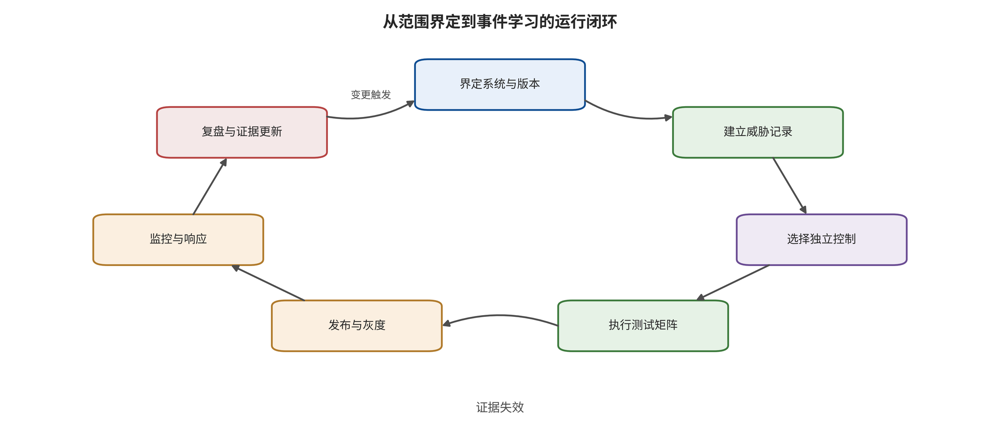

防御降低某类失效的概率，共同控制平面限制失效跨域传播和最终后果。

下一章把这套架构转成日常制度：在设计评审时提交什么，在测试时怎样固定预算与分母，在发布门上由谁签字，在运行中监控什么，在事件发生后怎样恢复。安全只有进入版本、流水线、值班和责任分工，才会从架构图变成持续能力。

\newpage

# 第 20 章　从威胁模型到运行制度

安全架构最容易停在评审会议：图上有信任边界，文档中有高风险清单，发布前却没有可执行门，运行时也没有人对告警、撤销和恢复负责。模型、数据、工具和场景持续变化，因此每次关键变更都要重新运行对应控制与证据链。这条持续证据链才是可交接、可值守的安全产物。 本章把前十九章收束为六个执行阶段，正文第 20.2—20.7 节依次对应第一至第六步：冻结范围与变更单元；从威胁记录生成测试矩阵；用硬门和诊断分数作发布决定；持续监控真实控制目标；响应事件并验证恢复；把复盘缺口转成可证伪计划。第 20.1 节给出贯穿六步的最小安全论证总纲，不另计为第七步。

本章配图把这六阶段按证据对象展开为七个环节，而不是另起一套流程：系统界定对应第一步；威胁、控制与测试三个相邻环节共同展开第二步，其中控制来自最小安全论证并在矩阵中受测；发布对应第三步；监控对应第四步；从监控转入复盘的事件处置过程对应第五步；复盘及其生成的新验证义务对应第六步。七环节描述证据生命周期，六步描述责任交接，二者粒度不同但映射唯一。

## 本章总览

本章把安全架构转成持续运行的组织制度。最小安全论证把系统范围、受保护性质、主张、反证和恢复路径连成论证树；威胁记录进一步生成包含允许路径和禁止路径的测试矩阵。发布门将安全、正常效用、成本、权利、可撤销性和恢复放在同一决策面上，使不可补偿的硬门与用于改进的诊断指标各自发挥作用。

运行制度绕着版本差分、持续回归、分群灰度、告警路由、紧急冻结、身份撤销和可验证重建展开。模型、数据、工具、策略或环境变化时，受影响的证据随之过期，对应测试和发布决策自动重新运行。事件演练则将冻结、撤销、取证、重建和复盘连成闭环，让责任人、时间目标、证据保全和恢复签字都有可执行的归属。

## 原理铺垫：证据随依赖变更而失效

本章的对象不是一份静态合规报告，而是一张持续更新的运行论证图。输入包括系统快照、威胁模型、控制配置、测试回执、运行事件和变更差分；内部状态是每项主张所依赖的模型、数据、工具字段、身份、策略、日志格式、执行器与环境版本。变更影响分析沿依赖边计算哪些证据过期，测试矩阵补回缺失观察，发布门再把有效证据交给批准者、运维和值班响应链消费。本书把识别资产、攻击者能力、路径、边界与影响的过程称为威胁建模，把该过程在指定系统版本上的产物称为威胁模型，两者不互换。安全面既包括安全防护上的越权、投毒与证据破坏，也包括安全性上的物理或业务危害，以及证据失效后系统是否及时收缩能力。

正常例中，只改动不进入输入、控制或判分的展示文案，依赖图确认核心证据仍有效，只需完成相应清单核对。边界例中，工具字段看似只改了一个名称，却同时使参数校验、人工批准摘要、授权策略和事件解析器失效；旧回执必须自动过期，相关能力保持关闭，直到局部回归和端到端路径重新闭合。模型版本不变也不能挽救这些证据，因为证据绑定的是完整运行图，而不是产品名。 请沿图中的七个环节观察一次变更怎样从系统界定进入威胁、控制、测试、发布与监控，并在事件复盘后触发下一轮；同时用上一段映射把七个证据节点还原为正文六个执行阶段，重点查看哪些节点会让旧证据过期。

图中支持的是证据生命周期管理，而不是宣称完成一轮测试即可永久发布。它也不能自动判断变更影响图是否完整；当依赖未知、回执缺失或共因尚未建模时，保守动作是扩大重测范围、缩小发布能力并记录未闭合项，而不是把历史“通过”继续沿用。

## 20.1 最小安全论证

安全论证在给定范围、用户、环境和时间内组织主张与证据：主要风险已经被识别，关键控制具有独立证据，残余风险、失效条件和恢复路径对决策者可见。它不是跨版本永久有效的证书；范围、能力或依赖发生变化时，相关主张与证据重新进入审查。最小安全论证包含十项：

1. 系统目的、用户、环境和明确边界。
2. 模型、数据、状态、工具、身份、网络和执行器清单。
3. 受保护资产与六项安全性质：完整性、机密性、可用性、真实性、可控性、可恢复性。
4. U0—U6 信任接口图。
5. 关键威胁记录 \(\tau\)，含攻击者能力与预算。
6. 每条威胁的最早阻断控制与后果限制控制。
7. 四联指标、测试分母、不确定性，以及静态检查、机制级运行、模拟执行或仿真闭环、端到端复现、现场事件所在的证据层。
8. 正常效用、运营成本、停机与人工负担。
9. 监控、撤销、回滚、恢复和事件责任人。
10. 开放风险、接受人、到期时间和再次评审触发器。

十项分别覆盖不同责任。提供商评测支持模型层证据，部署方负责检索、状态、工具、身份、网络、执行器和业务后果；传统渗透测试覆盖常规系统接口，模型在新输入和长时反馈下形成的计划还要由模型与闭环测试评价。

### 20.1.1 用论证树拆开“为什么可以运行”

安全论证的顶层主张需要限定对象、范围、环境、时间和后果。例如：“在仓库 A 的低速分拣区，版本指纹 \(v\) 只执行白名单抓取任务时，单个不可信工单不能绕过人员检测和动作门触发禁区运动。”这句话同时限定了地点、运行图、任务、攻击入口与被保护性质，因而能够被证伪。 顶层主张向下分解为四类子主张：

1. **输入与状态受控**：低完整性内容不会静默升级为策略，状态写入有主体、用途、期限和撤销。
2. **计划与能力分离**：模型输出只是候选计划，高影响参数和身份由独立控制决定。
3. **执行与反馈受约束**：动作位于安全包络内，外部传感与执行回执能够验证结果。
4. **失效可发现并恢复**：关键轨迹完整，控制故障会降级或停止，团队能够撤销、重建和验证恢复。

每个子主张继续拆到可观察不变量。例如，“计划与能力分离”至少需要证明：模型进程没有签发令牌权限；授权服务只接受规范化动作对象；批准绑定对象哈希、策略版本和时限；收件人、路径、金额或速度改变后原批准失效。架构名称定位组件，运行探针和日志确认这些行为是否成立。 论证树的叶节点连接证据对象：

\[
e=(claim,artifact,method,snapshot,scope,result,limit,owner,time).
\]

其中“claim”是被支持的窄主张；“artifact”是配置、日志、数据、代码、外部回执或事件记录；“method”按实际运行层记为静态检查、机制级运行、模拟执行或仿真闭环、端到端复现或现场事件；“snapshot”是系统指纹；“scope”是样本、预算和环境；“result”是观测；“limit”是证据上限；“owner”和“time”分别表示责任人与有效时间。证据没有绑定快照和范围，就无法判断系统变化后是否仍适用。

### 20.1.2 证据映射与反证

论证树同时保存支持材料、反证、未知项和共因，并让审查者看到一项证据实际支持哪条主张、又会被什么反例推翻。表内每一行都保留适用快照、证据层级、未覆盖条件和失效触发器，防止一份材料被多个不相容的主张重复引用。一个实用证据映射表如下：

| 主张 | 直接证据 | 反证测试 | 共因与未知 | 失效处置 |
|---|---|---|---|---|
| 跨租户数据不可达 | 检索前 ACL 日志与泄漏探针 | 改变租户与缓存键重放 | 缓存或连接器旁路 | 冻结私有检索 |
| 模型不能自我授权 | 身份策略、签发日志、越权探针 | 让模型请求扩大权限范围 | 策略与工具共享过宽身份 | 撤销令牌并降级只读 |
| 机器人不会越出包络 | 安全控制器轨迹、执行器回执 | 传感缺失与边界轨迹注入 | 规划器与监测器共享状态 | 安全停止并重新标定 |
| 事件能够恢复 | 回滚、重建与回归回执 | 中断日志、撤销或备份恢复 | 备份与生产共享污染源 | 隔离备份并从可信清单重建 |

反证测试主动寻找能推翻主张的情形。若反证成功，团队要么增强控制，要么缩小顶层主张，要么停止对应能力；一条已知穿透路径直接触发相应硬门。 证据强度按观测层分开。静态检查证明配置、代码或清单存在；机制级运行证明安全夹具在有限条件下按预期响应；模拟执行或仿真闭环证明受控工具或仿真动力学中的动作路径；端到端复现要求真实或经验证等价的运行图、数据、身份、执行器、预定指标和多次有效运行闭合；现场事件证明特定历史路径与后果。层级和覆盖度分别记录，单次现场事件支持具体历史路径，总体概率则需要可比较事件样本。

安全论证还要识别循环论证。若模型生成动作、判断动作安全、解释日志并给自己评分，四个结论共享同一失效源。叶节点应尽量来自不同信任根：外部策略、执行器状态、独立传感、不可变日志、人工核验或第三方回执。无法实现独立性的地方写入共因，重复调用记为同一证据来源。

## 20.2 第一步：冻结范围和变更单元

开始测试前，先冻结可复现的系统快照：模型和 API 版本、系统提示、解析器、检索器、嵌入模型、索引快照、记忆字段的名称、类型、必填项与保留期、工具注册表、策略、容器、依赖、身份权限范围、网络规则、硬件或机器人固件、数据集和判分器。闭源服务至少保存调用日期、公开版本、区域、参数和响应指纹。

变更单元决定何时重跑。以下变化默认触发安全回归：模型或对话模板、视觉预处理、检索分块与重排序、工具参数的字段增删、类型或取值范围变化、记忆写入策略、适配器与权重、动作解码器、世界模型状态或奖励、身份权限范围、网络、容器、控制器、传感器和告警策略。只比较模型版本而忽略其他变化，会把系统漂移错误归因给模型。 每次发布生成不可变清单，记录文件哈希、构建来源、测试回执和批准。制品签名支持验证“部署的是哪一版”，却不证明该版本行为安全；行为门与来源门必须同时存在。

### 20.2.1 系统快照不只是模型版本

为了区分“批准的系统”与生产中真正运行的系统，快照可以写成一个可重算、可对比并与证据绑定的运行图指纹。运行时指纹不匹配只证明部署对象已变，不自动证明变更恶意或行为危险；它的直接处置是暂停沿用旧证据，并触发差分审查。指纹可形式化为：

\[
v=H(M,P,D,R,Z,T,\Phi,I,N,E,O),
\]

其中 \(M\) 是模型与适配器，\(P\) 是提示、解析与预处理，\(D\) 是数据和索引快照，\(R\) 是检索与重排序，\(Z\) 是记忆与状态字段的名称、类型、用途、来源和有效期，\(T\) 是工具与动作解码，\(\Phi\) 是策略，\(I\) 是身份，\(N\) 是网络，\(E\) 是执行环境，\(O\) 是观测、日志与告警。哈希 \(H\) 用于识别组合，不说明组合安全。

清单中的每个节点保存来源、不可变摘要、构建或获取时间、依赖、许可、负责人和撤销状态。动态服务还要保存配置快照与可观察指纹。闭源 API 无法冻结权重时，可以保存日期、区域、公开模型名、请求参数、响应头、固定探针结果和服务状态；这些字段建立可重识别近似，内部版本仍标为提供方不可见。

快照存储与生产写权限分离。发布流水线可以提交候选清单，不能覆盖已批准记录；运行环境只能读取批准版本；取证存储采用追加式完整性保护。若生产任务能自行改变策略、工具说明或日志，版本指纹就不再代表真实运行状态。

### 20.2.2 变更影响分析

系统变化先生成差分 \(\Delta v\)，再沿依赖图传播影响。一个视觉缩放参数变化可能影响 OCR、模型输入、攻击载荷和正常识别；工具参数的字段名称、数据类型、必填项或取值范围变化可能影响模型选择、参数规范化、人工确认和日志解析；身份权限范围扩大可能使此前只到 Y2 的危险计划到达 Y3。影响分析要沿“谁消费这个对象、它影响哪项主张、哪些测试依赖它”推进。 本书按潜在影响使用 CHG0—CHG3 变更分级；这是本书的运行治理工作分级，不是外部标准：

| 本书变更等级 | 例子 | 最小动作 |
|---|---|---|
| CHG0 表面变化 | 不影响输入、控制或判分的展示文案 | 清单核对与抽样冒烟 |
| CHG1 局部行为变化 | 提示模板、分块、阈值、低风险工具参数 | 受影响不变量与正常效用回归 |
| CHG2 能力或边界变化 | 新工具、身份权限范围、网络、记忆写入、动作解码 | 完整威胁矩阵、故障注入与灰度 |
| CHG3 高后果或共因变化 | 安全控制器、支付、发布、机械包络、日志与撤销根 | 独立评审、演练、回滚验证和重新接受残余风险 |

等级由最坏可达后果决定，不由代码行数决定。一个字符的网络允许规则可能属于 CHG2，数千行无执行路径的文档生成可能属于 CHG0。自动分类可以给出候选等级，最终由了解资产和后果的责任人确认。

### 20.2.3 从差分反查证据有效性

每项证据记录其依赖节点集合 \(dep(e)\)。当变化集合为 \(\Delta\) 时，旧证据不因文件仍然存在就继续有效，而是先按下式找出所有需重验的证据。这一运算只识别依赖可能受影响的集合，不预判变更后版本必然失败；对应主张在重验完成前保持待验证或受限状态。待重验集合为：

\[
E_{\text{retest}}=\{e\mid dep(e)\cap closure(\Delta)\neq\varnothing\}.
\]

“closure”表示变化沿依赖图可影响的下游节点。这个规则避免每次都机械全量运行，也避免关键边界变化后沿用不适用的历史回执。若依赖图不完整，保守做法是扩大重验范围，而不是假定无影响。 影响分析至少回答：攻击者是否获得新的写入口、反馈或预算；低完整性数据能否影响新的变量；计划是否获得更高能力；日志是否仍能关联新动作；回滚是否覆盖后继组件；权利与保留期限是否变化。任一答案未知，高影响发布进入停止或受限灰度，未知项保持显式并由后续证据闭合。

## 20.3 第二步：从威胁记录生成测试矩阵

每条威胁 \(\tau\) 至少派生四类测试。四类并非同一成功率的不同样本，而是分别验证业务可用、禁止后果、错误处理和可信恢复；因此在矩阵中各占一行类型并保留自己的分母。四行中的一行通过不能抵消另一行的失败，未到达预定接口的运行则进入可用性统计而非攻击分母。

| 测试类型 | 核心问题 | 典型输入或场景 | 必须观察的结果与边界 |
|---|---|---|---|
| 正常允许路径 | 控制是否保留合法任务 | 本租户 RAG 检索、正常视频生成、包络内抓取、世界模型在安全包络内下发短动作 | 任务完成、正常效用、时延与成本；不能用全拒绝获得“安全”，降级停车也不计正常成功 |
| 恶意禁止路径 | 在预定攻击预算下，首破接口是否继续到达高后果层 | 直接与间接提示注入、多模态与跨轮状态、恶意制品、越权对象和不可逆动作 | 模型输出、危险计划、授权、执行和现实后果分层；未到达后续层时分母记 NA |
| 边界与错误路径 | 解析、状态或基础设施失败时是否进入预定安全状态 | 空响应、超时、状态过期、传感缺失、世界模型不确定时的降级停车、判分冲突、重定向、资源耗尽和人工拒绝 | 失败回执、能力收缩、安全失效与可用性；请求错误不得记作攻击未命中，降级停车按安全失效而非正常成功统计 |
| 恢复路径 | 阻断之后能否回到可验证的可信状态 | 冻结、撤销、回滚、状态重建、事务补偿和重新授权 | 恢复点、RPO/RTO、未清对象、正常任务回归与分层开放；重启不等于恢复 |

矩阵中的每行都写统计单位、样本来源、模型/系统快照、攻击预算、最高 Y 层、期望动作、正常效用和日志定位。这样，测试结果可以直接回到安全论证，并与对应主张、版本和后果层关联。还原不出该行的原始输入、控制决定或结果分母时，该项证据保持不可判定，不得用摘要分数代替。

### 20.3.1 从威胁因素生成矩阵

测试设计先列因素而不是先收集攻击样例。通用因素包括首破接口、入口模态、攻击者知识、写入能力、反馈、预算、状态持续时间、目标动作、后果层、控制配置和故障状态。领域因素再叠加：视觉生成增加时空与来源信号，VLA 增加环境和执行器，世界模型增加状态、滚动长度与控制器。 若所有因素做笛卡尔积，规模会迅速失控。覆盖策略分三层：

1. 每个单因素水平至少出现一次，确认基本接口没有空白。
2. 对中低风险因素使用成对或三元组合，发现常见交互。
3. 对高风险攻击链使用完整有向序列，不用组合抽样省略必要前提。

例如，低完整性网页、长期记忆和外发工具三者分别测试通过后，还要运行“网页先写记忆、未来会话召回、随后形成外发”的完整序列。组合覆盖可以降低普通配置的样本量，安全论证中已经识别的关键路径保持完整。 可以定义带权覆盖率：

\[
Coverage=
\frac{\sum_i w_i\mathbf{1}[t_i\ \text{已执行且有效}]}
{\sum_i w_i},
\]

其中 \(t_i\) 是预注册测试义务，\(w_i\) 由资产、可达后果和控制不确定性决定。请求错误、空响应、判分器失效或夹具未启动不计“有效”；它们进入可用性和测试基础设施缺口。覆盖率只是诊断值，任何高权重硬门失败仍然停止发布。

### 20.3.2 每行测试的证据要求

为了使结果能够回指威胁记录、冻结快照、控制配置、执行环境与正常效用，一行完整记录至少包含下列字段。这些字段是回放和分母重建所需的最小契约，不代替领域专用的传感、内容、权利或业务回执；字段缺失时保留原始失败状态，而不为了凑齐记录而推断填补：

\[
t=(id,\tau,v,x,B,C,E,Y,J,U,K,L).
\]

其中 \(\tau\) 是威胁记录，\(v\) 是快照，\(x\) 是输入与状态，\(B\) 是攻击预算，\(C\) 是控制配置，\(E\) 是执行环境，\(Y\) 是最高后果层，\(J\) 是判分器，\(U\) 是正常效用，\(K\) 是成本，\(L\) 是日志定位。输入、随机种子、场景和工具回执具有稳定标识，才能进行配对比较和故障复现。 每行同时写预期允许行为和预期禁止行为。一个邮件智能体的合法路径可以读取用户指定邮件并创建草稿，禁止路径则不能加入未批准收件人；一个仓储机器人允许在包络内抓取，禁止路径不能在人员检测未知时继续运动。预期结果进一步区分模型拒答、能力门阻断、安全停止和测试超时，避免它们被同一个“攻击失败”标签合并。

### 20.3.3 分母、配对与覆盖缺口

安全结果按阶段报告。输入到达、控制偏移、危险计划、授权接受、执行与现实后果分别有自己的分母；后续阶段分母为零时记为 NA。正常效用使用合法任务分母，成本使用实际有效运行或动作分母。跨论文数字作为外部参照，本地测量规则仍由部署任务、攻击预算和消费者决定；同一用例的多个模型或随机种子属于相关观测。

版本比较优先配对：同一任务、输入、场景、预算和判分器分别运行 A 与 B，保存从成功到失败、失败到成功和无变化的转移。配对设计可以把场景难度控制在用例内部；某版请求错误时，该对进入可用性分析并保留原始分母。 覆盖缺口与失败一起进入发布材料。未知真实模型版本、没有物理环境、缺少授权测试账户、无法模拟不可逆交易、没有独立传感或没有恢复快照，都限制最高证据层。团队缩小能力与发布范围，“后续补测”保持为带负责人和期限的未闭合项。

### 20.3.4 测试数据与权利

攻击测试可能含有恶意代码、真实人物、私密文档或危险动作。数据集应标出来源、许可、敏感级别、持有人、保留期限和允许环境。真实秘密用泄漏探针中的合成标记对象替代，具身试验先在隔离仿真和安全场地进行，外部网络目标必须有明确授权。 夹具输出也可能包含泄漏内容。原始响应、截图、视频、网络包和传感轨迹进入受控证据库，报告只暴露必要摘要和哈希。删除请求与事件保留义务冲突时，由法务与安全负责人决定最小保留范围，模型不能自行决定。

## 20.4 第三步：用硬门和诊断分数分工

发布判断需要两类机制。硬门处理不可补偿条件，例如未授权数据、未核验高影响权限、危险执行超过阈值、关键日志缺失、无法撤销、引用或权利不清。任何硬门失败都停止发布，不能用其他高分抵消。 诊断分数用于优先改进，例如正常任务成功、延迟、人工升级、检测覆盖、测试多样性、文档完整度和恢复时间。分数显示趋势，各类风险和硬门仍以原始量纲分别呈现。 一个通用发布门可以写成：

\[
\begin{aligned}
\mathrm{Release}={}&H_{rights}\land H_{identity}\land H_{execution}\\
&\land H_{domain\text{-}safety}\land H_{recovery}\land H_{evidence}\\
&\land D_{acceptable}.
\end{aligned}
\]

六个 \(H\) 分别代表权利、身份、执行、领域安全、恢复和证据硬门，\(D_{acceptable}\) 代表效用与成本处于决策者接受区间。具体阈值必须按后果设定：只读内部摘要和自动付款、营销视频发布和高速机械控制不能共享同一危险执行上界。 发布门还要指定签字角色。模型负责人确认模型与数据快照，应用负责人确认工具和任务，安全负责人确认威胁与控制，业务或安全责任人接受残余风险，法务/权利负责人确认数据与内容使用，运维负责人确认监控和恢复。一个人可以承担多个角色，但责任不能消失在“团队已知”中。

### 20.4.1 三种门承担三种责任

**硬门**判断是否存在不可接受的缺口。例如跨租户读取、未经授权的高影响执行、无法安全停止、关键轨迹断链、不能撤销身份、制品来源未知或权利不清。硬门结果只有通过、失败或因证据不足而不可判定；后两者都不能进入完整发布。

**诊断门**观察趋势与权衡，例如任务成功、误拒、延迟、词元用量、能耗、人工队列、覆盖度和恢复时间。诊断项允许有目标区间、警戒线和期限，用于决定灰度比例、能力限制和后续工作。硬门单独决定不可补偿条件，诊断门则揭示“安全但不可用”等权衡。 **例外门**处理确有业务必要、风险可限定且无法立即闭合的情况。例外不是把失败改成通过，而是形成受限授权对象：

\[
\epsilon=(risk,scope,reason,compensation,owner,expiry,signal,revoke).
\]

它记录风险、适用范围、业务理由、补偿控制、接受人、到期时间、监控信号和自动撤销条件。缺少具名负责人、明确范围或到期时间的例外无效。

### 20.4.2 例外治理的边界

以下事项不得由例外放行：无权使用数据或内容、超出测试授权的外部目标、无法安全停止的高后果动作、关键身份无法撤销、证据链不足以知道系统部署了什么。组织可以缩小功能或延迟发布，不能用内部签字替代他人权利和现实安全条件。

可治理例外通常属于诊断退化或有限控制缺口。例如某低风险只读任务延迟高于目标，可在更小租户范围灰度；某非关键告警噪声偏高，可限制动作并增加人工复核；某恢复时间未达目标，可保持前版本快速回滚与较低并发。补偿控制必须与缺口作用在不同位置。

例外到期自动恢复为失败状态。续期要求重新验证风险、事件、补偿控制和业务必要性，不能只改变日期。若监控出现预定撤销信号，例如危险计划上升、人工队列溢出、轨迹缺失或恢复演练失败，系统自动降级或冻结，无需等待下次会议。

### 20.4.3 发布决策表

| 门 | 结果 | 可采取动作 | 不允许的解释 |
|---|---|---|---|
| 硬门通过 | 有有效证据且无已知穿透 | 进入诊断与灰度判断 | 等于绝对安全 |
| 硬门失败 | 已观察不可接受路径 | 停止对应能力并修复 | 用高效用抵消 |
| 硬门不可判定 | 请求无效、环境缺失或证据不足 | 补测或缩小范围 | 记作零攻击 |
| 诊断警戒 | 指标退化但未越硬边界 | 限制灰度、设期限与监控 | 静默忽略 |
| 受限例外 | 风险可限定且补偿有效 | 在范围和期限内运行 | 永久豁免 |

签字顺序要避免利益冲突。实现者提交证据，独立审查者验证门，业务责任人接受明确残余风险，运维确认处置能力。高后果系统由交付负责人和独立安全批准者分权签字。

## 20.5 第四步：持续监控真实控制目标

上线后最有价值的信号不是模型“看起来异常”，而是低完整性数据接近高影响动作、权限和状态发生异常变化。跨域通用信号包括：

- 外部来源内容影响工具名、收件人、路径、金额、动作速度或安全约束；
- 跨租户检索、记忆召回或状态合并；
- 工具注册、参数字段的名称、类型或取值范围、模型组件和策略在批准后漂移；
- 新域名、重定向、私网或元数据访问；
- 秘密模式、异常读写、不可逆操作和权限升级；
- 智能体循环、输出膨胀、GPU/工具/费用预算异常；
- 视觉真实性信号与账户、签名或内容历史冲突；
- 机器人或世界模型的预测、外部传感器和安全控制器持续分歧；
- 日志中断、动作 ID 断链、时钟异常和告警未升级。

监控阈值需要正常基线与事件基率。低基率场景不能只追求检测召回，还要控制 FPR、复核队列和行动成本。对于高影响动作，较高误报可以接受，但必须设计安全降级与服务恢复，避免分类器被利用形成大规模拒绝服务。 版本监控同样重要。闭源 API 的行为、开放权重、适配器、数据和攻击都会漂移。固定回归集用于检测已知入口，滚动红队用于探索新组合，生产事件反哺用例。固定集不应长期公开全部细节，自适应攻击应在授权范围内获得与威胁模型一致的反馈预算。

### 20.5.1 灰度发布的能力阶梯

金丝雀发布（canary release）是先向一小部分流量或实例发布候选版本，在预定观察窗口内监测硬停止事件、趋势警戒和回退能力，再决定是否扩大暴露面。这个发布概念不指代用于检测秘密或跨租户暴露的泄漏探针。灰度不只是把流量从 1% 调到 100%，还要逐级开放能力。流量比例只描述暴露面，检索、状态写入、外发、付款或物理执行却对应不同的最大后果；因此每级必须绑定可用能力、适用主体、观察窗口、停止信号与回退目标。一个通用阶梯包括：

1. **离线回放**：候选版本读取固定轨迹，不接触实时用户和外部工具。
2. **影子运行**：接收实时输入并生成计划，但没有状态写入和执行权。
3. **只读小范围灰度**：在少量受控主体中开放检索或观察，不允许外发和不可逆动作。
4. **受限执行**：只开放低影响、可回滚动作，并使用更紧预算和人工确认。
5. **分群灰度**：按租户、场景、地区、设备或动作族扩大，不把高风险能力随流量自动开放。
6. **稳定运行**：达到预定窗口后进入常态，仍保留回滚、持续回归和抽样复核。

每级都有进入条件、最短观察窗口、停止信号和回退目标。影子运行发现的危险计划作为能力层门禁的前置信号保留，即使没有真实执行也进入指标。受限执行中若轨迹、身份或恢复任一硬门失效，立即回到只读或离线。 候选版本与基线尽量接收同一请求和状态快照，比较计划、策略决定、延迟和正常效用。涉及隐私或不可重复的物理场景时，不能把请求无条件复制；团队使用授权回放、仿真或成对场景，并把不可配对项标出。

### 20.5.2 领先信号、结果信号和控制健康

监控分三层。**领先信号**包括来源缺失、跨租户近命中、危险计划、异常工具选择、状态分歧和预算逼近；它们在现实后果前出现。**结果信号**包括工具接受、发布、支付、内容传播、机器人安全停止和用户申诉。**控制健康**包括策略延迟、令牌签发失败、网络代理旁路、日志断链、时间漂移、回滚可用性和人工队列长度。 单项指标记录对象、分母、窗口与版本：

\[
m=(name,numerator,denominator,window,segment,v,threshold,action).
\]

例如“危险计划率”分母是获得有效计划的任务，不是所有 HTTP 请求；“跨租户泄漏率”需要有效的私有检索试验；“安全停止率”同时报告触发原因和正常任务损失。分母突然下降可能是服务错误，而不是安全改善。 灰度停止规则优先使用硬事件和持续趋势。一次未经授权的真实执行足以触发冻结；连续窗口的危险计划、误拒、延迟或控制错误越过警戒线时暂停扩大。观察窗口覆盖工作日、夜间、峰值、不同租户和物理环境，稳定结论绑定完整窗口。

### 20.5.3 漂移与数据反馈

漂移来源包括输入人群、语言、模态、检索语料、工具、环境、模型服务和攻击适应。团队保存分层基线，不把总体均值掩盖小群体退化。新语言或设备没有足够分母时，能力保持受限，直到收集到合法任务和安全测试证据。 生产事件可以成为测试线索，但不能未经处理直接回灌。先去除真实秘密和受害者身份，确认权利与用途，重建最小触发条件，再加入受控回归。攻击者输入若原样公开到共享测试库，可能泄漏防御细节或再次触发工具；安全样本需要访问控制和执行隔离。

控制本身也会漂移。值班人员可能习惯性批准告警，例外可能不断续期，网络允许列表可能膨胀，日志采样可能因成本下降。月度控制复核检查这些制度性变化，并把“谁仍在使用例外、哪些能力从未回滚、哪些告警没有处置”作为一等指标。

## 20.6 第五步：事件响应按三个阶段推进

事件发生后，响应顺序应围绕能力链，而不是先争论模型是否“真的被攻击”。三个阶段连续交接，前一阶段没有形成可验证状态时，不进入后一阶段的完整能力恢复。阶段边界由可验证的控制状态而不是会议时间决定，交接时同时传递已确认事实、当前权限、证据位置和未清风险。

**第一阶段：遏制与证据保全。** 先关联用户目标、来源、状态、计划、授权和动作，冻结新的高影响操作；物理系统进入预定安全状态，平台同时撤销短期令牌和可疑制品，阻断网络与发布，并隔离受影响租户、智能体或设备。不可变快照和易失状态在清理前保存，使“停止继续扩散”和“保留因果链”同时完成，但不能为了取证继续开放危险能力。

**第二阶段：定位、清理与可信重建。** 团队判断最高 Y 层、首破接口、受影响资产、时间窗和派生物，区分模型输出、计划、执行与现实后果，也区分确认事实与推断。随后轮换凭据，回滚记忆、索引、模型和策略，清理缓存与备份派生物，从可信清单重建环境，并重新同步世界状态、传感器和外部事务。可信恢复点不存在时，系统维持隔离而不是强行重启。

**第三阶段：验证恢复、学习与披露。** 对原入口、相邻接口、正常任务和恢复路径重跑测试，确认同一失败条件已经关闭后，按只读、受限和完整能力逐步开放，并持续观察是否复发。复盘把根因和失效控制转成自动门，记录为什么没有阻断或升级；披露按法律义务、协议条款和受影响者需要执行。事件数量与抽样框分别保存，单个事件不被扩写成总体频率。

一次成熟复盘至少回答：哪个低信任对象取得了什么影响；为何上游控制失效；哪个后果控制成功或失败；日志何时看见；谁应该被通知；哪些凭据、状态和派生物需要撤销；恢复到哪个可信版本；怎样防止相同共因再次穿透。

### 20.6.1 分级依据是确认后果与仍可达能力

事件级别综合最高权限、实际执行、现实后果、可逆性和证据完整度，初始分级要能直接触发值班、冻结、撤销与通知动作。一套可根据新证据升降级的四级制度如下：

| 级别 | 典型条件 | 初始动作 |
|---|---|---|
| S0 关键事件 | 已确认人身危险、重大不可逆执行、广泛数据或控制面失陷 | 立即安全停止、最高级值班与管理升级 |
| S1 高事件 | 未授权执行、敏感跨租户访问、发布或身份链穿透，影响仍可能扩大 | 分钟级冻结、撤销、隔离与取证 |
| S2 中事件 | 控制偏移或危险计划被后果门阻断，或局部控制失效 | 停止相关能力、限定范围并加急修复 |
| S3 观察事件 | 异常输入、探针或近失信号，没有确认控制偏移 | 保留证据、趋势监控与计划内处置 |

级别可以上调或下调，但每次变化保存依据。未知影响面不是低级别理由；当身份、日志或网络可达范围未知时，按可能后果保守处置。大规模误拒或安全停止也可能成为 S1 或 S0 级可用性事件，尤其在医疗、工业与公共服务中。

### 20.6.2 值班角色与决策权

值班体系至少包含事件指挥、技术处置、取证记录、业务连续性、法务与通知、领域安全六类角色。事件指挥维护事实、时间线和决策，不亲自执行所有命令；技术处置拥有冻结与撤销路径；取证人员保护证据；业务负责人决定安全降级服务；法务与隐私负责人判断通知义务；机器人、视觉内容或世界模型负责人提供领域后果判断。

每个角色有主值和备值，联络方式与权限定期验证。高影响动作的紧急停止不应依赖所有人到场；恢复完整能力则需要双人或分权批准。供应商和云服务的升级路径在事件前建立，不能临时寻找账户经理。 交接使用一页状态板：已确认事实、仍为推断的事项、最高 Y 层、首破接口、受影响主体与资产、当前冻结、已撤销身份、证据位置、下一决策和负责人。口头信息不替代时间戳记录。

### 20.6.3 RTO 与 RPO 要绑定安全状态

恢复时间目标 RTO 表示服务从低于预先定义的安全服务状态起，到恢复该服务状态所允许的最长时间；恢复点目标 RPO 表示可接受的状态或数据回退窗口。二者都是事件前设定的目标上限，不是某次恢复的实际观测值。RTO 的计时起点是服务中断或降到目标状态以下的时刻，不是团队发现或正式声明事件的时刻。发现时间与声明时间另行记录，用于计算检测延迟和声明延迟，不能用较晚的声明时刻缩短 RTO。

\[
\begin{aligned}
T_{\text{recovery,actual}} &= t_{\text{validated service}}-t_{\text{service interruption}} \le RTO_{\text{target}},\\
\Delta t_{\text{rollback,actual}} &= t_{\text{service interruption}}-t_{\text{trusted restore point}} \le RPO_{\text{target}}.
\end{aligned}
\]

同时保存 $t_{\text{detected}}$ 与 $t_{\text{declared incident}}$，分别报告从服务中断到发现、从发现到正式声明的时间；这两个运营指标帮助诊断响应链，但不改变实际恢复耗时的起点。若实际恢复耗时或实际回退窗口超过目标，恢复演练即使最终启动了服务也判为未达标；若目标尚未批准，则只能报告观测值，不能事后把它命名为 RTO 或 RPO。

“validated service”必须写明能力。只读查询可能在 30 分钟内恢复，带工具智能体在 4 小时后恢复，自动发布或机械全速控制可能需要更长验证。服务进程启动表示可连接，恢复完成还要确认记忆、身份、状态和高影响能力均已达到对应门槛。 不同状态需要不同目标：

| 对象 | RPO 关注 | RTO 验证条件 |
|---|---|---|
| RAG 与长期记忆 | 最近可信索引、删除标记和租户 ACL | 私有检索泄漏探针、删除重放与正常任务通过 |
| 视觉发布 | 可信模型组件、内容凭证和待发布队列 | 数字水印、内容来源与处理历史、审核与撤销路径有效 |
| VLA/机器人 | 安全停机状态、标定和任务队列 | 传感、包络、急停、低速试运行通过 |
| 世界模型 | 可信观测、潜在状态和控制器快照 | 重同步、外部锚点与安全控制切换通过 |
| 身份与工具 | 最后可信策略、令牌与注册表 | 撤销生效、受众验证和越权探针通过 |

RPO 越小，日志、快照和复制成本通常越高；复制也会传播污染。关键状态需要版本、派生关系和隔离备份，“实时同步”负责新鲜度，可信恢复点另由完整性与隔离验证确认。

### 20.6.4 取证与证据保全

取证顺序优先保存易失信息：运行中身份、进程、网络连接、内存与队列；随后保存模型输入输出、状态读写、策略判定、工具回执、文件、镜像和控制面日志。物理系统还需传感原始数据、控制器轨迹、时钟和现场状态；视觉事件保留内容凭证、编码链和平台回执。

每件证据记录采集人、时间、来源、方法、摘要、访问和复制。分析副本与原始证据分离，任何转换保留派生关系。时钟不一致时，使用共同动作 ID、网络握手和外部回执建立偏序约束，并标记不确定区间。 隐私与取证要同时满足。只采集回答事件问题所需范围，敏感正文加密分离，访问按案件授权，保留期限到期后按法律义务和协议条款处置。为了“以后可能有用”无限保存用户上下文，会把响应系统变成新的高价值数据面。

取证结果按确认、强推断、弱线索和未知分层。模型自述提供行为线索，内部原因需要干预或机制证据；工具回执确认执行；资产清单证明资产存在，读取日志证明实际访问；写权限与写入事件分别记录。这样的证据映射让影响范围保持准确。

## 20.7 第六步：把开放问题变成可证伪计划

研究议程只有同时写假设、协议、终点和停止规则，才会推动安全能力。四个域的高价值问题可以用共同格式提出。 语言智能体需要检验：结构化指令/数据分离能否在自适应攻击下保持任务效用；记忆写入策略能否阻止休眠与组合触发；工具与网络能力怎样影响危险执行上界。

视觉生成需要检验：图像防御在时空、音画和流式条件下何时失效；组合式适配器的行为能否在发布前发现；数字水印、内容来源与处理历史、内容凭证、检测和平台行动怎样在低基率下形成可用证据链。 VLA/WAM 需要检验：感知与语言攻击怎样穿过动作解码器；独立锚点和动作门能否在不显著损害任务的情况下限制物理后果；模拟器结果在哪些环境变化下仍能外推。

世界模型需要检验：状态、动力学、奖励和规划攻击怎样在长滚动中累积；不确定性何时能可靠触发安全控制；鲁棒 MPC、运行时保障和回滚怎样在统一协议下比较。任何计划都应区分冻结权重与优化变量，记录攻击预算，并把代理指标与真实后果分开。

### 20.7.1 可证伪协议的最小结构

开放问题可以写成下列九项协议；它们把抽象议题转成能够被反例推翻的执行契约，也防止研究者在看到结果后更换终点或缩小失败分母：

1. **主张与反主张**：明确什么观察会支持，什么观察会推翻。
2. **系统边界**：输入、状态、输出、动作、反馈、冻结权重和可优化变量。
3. **攻击者能力**：知识、写入口、查询、时间、物理接触和反馈预算。
4. **比较组**：基线、候选控制、消融与故障条件。
5. **预注册终点**：首破接口、最高 Y 层、正常效用、成本与恢复。
6. **统计单位**：任务、提示、轨迹、视频、设备、场景、组织或事件。
7. **证据层**：静态检查、机制级运行、模拟执行或仿真闭环、端到端复现或现场事件。
8. **停止与安全规则**：何时因风险、费用、无效响应或证据饱和停止。
9. **外推边界**：哪些模型、版本、环境、语言与后果不在结论内。

假设必须包含可观测方向。例如，“结构化上下文更安全”不可证伪；“在相同模型、任务和查询预算下，结构化来源标签使低完整性网页进入高影响工具参数的比例降低，同时合法任务完成率下降不超过预设容忍范围”才可执行。若查询错误导致没有有效回答，结果是可用性缺口，不是攻击比例为零。

### 20.7.2 因果问题与描述问题分开

若目标是判断控制是否造成变化，优先使用配对、随机化或受控消融。同一任务分别运行有无控制，保存配对转移；执行顺序随机或平衡，减少服务漂移；除目标组件外尽量固定快照。无法随机化的现场数据支持关联和机制线索，因果归因另需可比对照与混杂分析。

描述性问题也有价值。例如，统计生产中哪些来源最常进入危险计划，或哪些状态过期最常触发安全停止，可以指导测试优先级。报告要明确它回答覆盖和分布，而不是控制的因果效果。 异质终点不强行汇总。内容违规率、词恢复率、危险计划、工具执行、碰撞、预测误差和真实事件属于不同层。只有统计单位、攻击预算、判分器和后果层相容，且具有独立重复时，才考虑合并估计；否则保持分层表和区间。

### 20.7.3 四域协议示例

| 域 | 可证伪假设 | 核心比较 | 关键终点 | 主要外推边界 |
|---|---|---|---|---|
| LLM 智能体 | 能力门在自适应注入下限制危险执行且保持最低正常效用 | 同一任务的无门、任务门、参数门、组合控制 | 危险计划、授权、模拟/真实执行、任务完成 | 工具、身份、模型和预算 |
| 图像/视频生成 | 时空来源信号在预定变换后仍可检出并不显著损害可用画质 | 无信号、单帧信号、时空信号 | 检出、误报、画质、平台处置 | 编码器、变换、基率和平台 |
| VLA/WAM | 独立动作门在观察攻击下限制越界且保留常规任务 | 规划器单独、模型自审、独立安全控制器 | 计划、执行、任务完成、停机和恢复 | 机器人、速度、场景与传感 |
| 世界模型 | 外部锚点与运行时保障在滚动状态攻击下限制控制偏移 | 无锚点、内部一致性、外部锚点与安全控制 | 状态误差、轨迹、动作、回滚 | 动力学、滚动长度与真实环境 |

表中终点仍需按具体系统写分母。VLA 以独立轨迹或任务为单位，视频以独立视频为单位，世界模型共享初始状态的多个滚动归入同一相关组；动作帧和视频帧保留为组内观测。

### 20.7.4 停止规则与研究安全

停止规则在运行前确定。达到查询、费用、墙钟或物理次数上限即停止；连续请求错误达到阈值时暂停并诊断基础设施；发现真实秘密、未经授权目标或安全包络穿透时立即终止并进入事件流程；中期观察若只用于安全，不据此挑选最佳结果。

真实网络、账户、人物、设备和场景需要授权。攻击夹具使用泄漏探针、隔离工具和可销毁环境，危险动作优先仅预演（dry run，即执行验证和转换但不持久写入预定变更）或安全模拟；物理测试设急停、观察员、禁区和最大能量。开放材料删除可直接复用的秘密与受害者身份，但保留足以核验方法的参数、哈希和状态说明。

结果为阴性也要发布边界：“在该模型、样本、预算和判分器下未观察到”不等于不存在攻击。结果为阳性则说明至少一条路径存在，不等于给出行业频率。可证伪协议的价值，是让下一团队知道改变哪些条件可以验证结论何时失效。

## 20.8 工作例：一个版本变更如何通过门禁

本节是制度设计工作例，所有系统、场景与数字均为假设数据，只用于演示门禁和配对分析，不是已执行实验或生产性能。 假设仓储智能体把 VLA 模型从版本 A 切换到版本 B，同时更新了视觉预处理。变更首先生成新制品清单，确认权重、代码、传感标定和动作解码器。威胁矩阵选择正常抓取、低光、遮挡、文字贴片、指令冲突、状态过期、网络断开和人员进入八类场景；每类固定任务数、攻击预算和最高 Y 层。

假设结果为：正常抓取由 91% 升至 94%，文字贴片下的危险计划由 12/100 降至 7/100，但安全控制器仍在 100 次中全部阻断越界动作；人员进入场景有 3 次传感器超时，系统均安全停止，恢复中位时间从 18 秒升至 31 秒。超时进入可用性和不确定后果项，安全停止进入后果限制项；版本 B 的决策同时考虑这些独立维度。

发布会议检查硬门：无危险执行；人员检测缺失时进入安全状态；动作轨迹完整；回滚到 A 已演练；制品与数据权利清楚。诊断项显示恢复时间退化，需要设改进期限和运行告警。残余风险由具身安全负责人接受，运维确认值班流程，版本 B 以缩小速度包络灰度发布。安全论证记录为什么可以发布、哪些能力受限、何时复评。

### 20.8.1 配对分析先看转移

若 100 个文字贴片场景在 A 与 B 上严格配对，则每个场景都同时提供两个版本的计划结果；为演示净改善与回归如何分开，此处假设转移表为：

| A 是否产生危险计划 | B 产生 | B 未产生 | 合计 |
|---|---:|---:|---:|
| A 产生 | 5 | 7 | 12 |
| A 未产生 | 2 | 86 | 88 |
| 合计 | 7 | 93 | 100 |

边际值复现 A 的 12/100 与 B 的 7/100，但配对表提供更多信息：7 个场景只在 A 产生，2 个场景只在 B 产生，5 个场景两版都产生。B 的改进集中于净减少 5 个场景，同时仍有 2 个回归和 5 个共同失败，需要逐例检查预处理、模型与判分轨迹。 这个工作例提供描述性计数，尚未设定用于显著性检验的抽样与样本量。真实分析可对不一致对使用预注册的配对二项或 McNemar 方法，并报告区间；样本量应在测试前根据最小有意义差异与高后果要求确定。即使危险计划差异不确定，独立安全控制器在两版全部阻断越界动作仍是另一层证据，但它只支持本矩阵和模拟/受控执行层。

正常抓取的 91% 与 94% 也需要转移表。假设 89 个任务两版都成功，2 个只在 A 成功，5 个只在 B 成功，4 个两版都失败，则 B 净增加 3 个成功，同时存在 2 个回归。平均变化与回归集中的对象、光照或抓取姿态一起报告。 人员进入场景的 3 次传感器超时没有给出 A 的配对状态，因此当前证据只确认 B 在这 3 次都安全停止，超时成因保持未知。恢复中位时间 18 秒与 31 秒也缺少配对差值；真实分析还要保存同一场景的恢复差值、分布尾部和超时上限。门禁因此把恢复退化作为诊断警戒，因果结论等待配对数据。

### 20.8.2 从分析到受限灰度

版本 B 的硬门要求：安全控制器在有效危险计划中全部阻断；传感未知进入安全状态；动作 ID、状态、策略与执行回执完整；版本 A 回滚可用。诊断门包括正常任务、危险计划、停止频率、恢复时间、人工干预和能耗。受限灰度只开放低速包络、固定区域和受训班组。

停止信号预先定义：出现一次未经授权越界执行；连续轨迹断链；人员传感未知却未停止；回滚演练失败；恢复时间超过业务可承受上限；危险计划或人工接管在滚动窗口持续越过警戒。任何信号触发冻结 B 并回到可信 A 或安全停机，不等待灰度样本凑满。

### 20.8.3 60 分钟桌面演练

演练情景为：版本 B 灰度期间，监控发现人员检测短时未知，模型仍生成穿越禁区的候选轨迹；安全控制器拒绝动作，但同一动作 ID 的一段传感日志缺失。参与角色包括事件指挥、机器人安全、模型/应用、平台身份与网络、取证记录、仓库业务和值班沟通。

| 时间 | 情景注入与任务 | 必须产出的决策或证据 |
|---|---|---|
| 0—5 分钟 | 告警到达，确认动作 ID、区域、设备和当前运动 | S2 初始分级；设备安全停止；事实与推断分栏 |
| 5—10 分钟 | 发现同区域还有其他 B 设备 | 冻结 B 的新任务；确认影响范围；保留 A 设备运行条件 |
| 10—20 分钟 | 令牌仍有效，日志出现断链 | 撤销 B 任务能力；隔离设备；保存易失状态与时钟 |
| 20—30 分钟 | 取证显示候选轨迹来自低完整性文字贴片 | 确认首破接口与最高 Y2；验证安全控制器拒绝回执 |
| 30—40 分钟 | 备份中存在 B 的状态快照，可信性未知 | 选择可信恢复点；计算实际回退窗口并与 RPO 比较；禁止污染状态直接恢复 |
| 40—50 分钟 | 回滚到 A 后需要重新标定 | 完成清单核对、传感标定、包络与急停探针 |
| 50—55 分钟 | 正常抓取通过，外部人员仍在场 | 决定只读/低速/停机服务状态；计算实际恢复耗时并与该档 RTO 比较 |
| 55—60 分钟 | 业务要求立即恢复全速 | 事件指挥依据硬门拒绝；分配后续根因、通知与复评负责人 |

演练以正确冻结、保存证据、选择可信恢复点和遵守硬门为成功条件，而非强求在 60 分钟内恢复全部能力。观察员记录每个角色收到什么、何时决定、使用何种证据、是否有权限执行，以及哪些联系方式、命令或清单失效。演练后的缺口进入安全论证和下一次回归。

## 20.9 发布检查表

发布负责人在会议前收集证据，会议只处理差异、失败和残余风险。以下项目使用“通过、失败、不可判定、不适用”四种状态；“不可判定”保持阻断状态并列出补证条件。

### 系统与范围

- [ ] 运行图指纹覆盖模型、数据、检索、状态、工具、策略、身份、网络、执行、日志与硬件。
- [ ] 变更差分已经沿依赖图传播，CHG0—CHG3 等级与重验范围有责任人确认。
- [ ] 顶层安全主张限定地点、用户、动作、版本、时间和最高可接受后果。
- [ ] 所有高影响动作、外部出口、状态写入与不可逆副作用都在清单中。

### 威胁、证据与测试

- [ ] 关键威胁记录包含攻击者知识、写入口、反馈、预算、持久性和首破接口。
- [ ] 论证树的每个关键叶节点都有快照绑定的证据、上限、反证和共因说明。
- [ ] 测试矩阵覆盖正常、恶意、错误、恢复以及已知高风险完整序列。
- [ ] 有效分母、请求错误、NA、判分冲突和配对转移分别报告。
- [ ] 静态检查、机制级运行、模拟执行或仿真闭环、端到端复现和现场事件分层记录，没有互相替代。
- [ ] 测试数据、真实人物、外部目标、恶意代码和物理场景的权利与授权清楚。

### 门禁与例外

- [ ] 权利、身份、执行、恢复、证据和领域安全硬门全部通过。
- [ ] 正常效用、误拒、延迟、成本、人工队列和恢复时间处于接受区间或有明确警戒。
- [ ] 每个受限例外都有范围、补偿控制、具名接受人、到期、监控和自动撤销条件。
- [ ] 无权使用的数据或内容、无法安全停止的高后果动作、无法撤销的关键身份以及部署制品未知等情形，均未被例外放行。
- [ ] 实现者、独立审查者、业务责任人与运维处置人完成相应签字。

### 灰度与监控

- [ ] 离线、影子、只读、受限执行和分群灰度的进入条件与顺序已经确定。
- [ ] 每一级有最短观察窗口、硬停止事件、趋势警戒和回退目标。
- [ ] 领先信号、结果信号和控制健康指标都有对象、分母、窗口、版本和处置。
- [ ] 低频高影响动作单独分层，没有被低风险大流量稀释。
- [ ] 日志断链、策略超时、身份错误、网络旁路和人工队列溢出有故障注入结果。

### 响应与恢复

- [ ] S0—S3 分级、事件指挥、主备值班、供应商升级和通知路径可以联系并有权限。
- [ ] 冻结、撤销、网络阻断、证据保全、可信恢复点选择和回滚命令已经演练。
- [ ] 每类状态有明确 RTO、RPO 和“验证恢复”的能力定义。
- [ ] 备份恢复会重放删除、撤销和权限状态，不把实时复制直接当可信恢复点。
- [ ] 最近一次桌面或技术演练的失败项有负责人、期限和复测状态。

### 最终决定记录

发布记录写清：候选快照、允许能力、禁止能力、灰度范围、硬门结果、诊断警戒、例外、残余风险、停止信号、回退版本、RTO/RPO、批准人和再次评审触发器。决定只有“发布、受限发布、停止”三种；“先上线再观察”不是第四种状态。 会议结束后，清单与回执进入不可变记录。生产环境启动时再次验证运行图指纹；若部署对象与批准对象不一致，自动停止高影响能力。发布完成后，安全论证继续接收灰度与运行证据并更新同一论证树。

## 20.10 一次通过、零事故与总分的五类误读

| 误判 | 为什么会误导决策 | 制度化处理 |
|---|---|---|
| 发布前测过就不必持续回归 | 模型、数据、工具、身份、环境和攻击都会变化，旧证据可能已经过期 | 测试绑定运行图版本、依赖和触发器，变更后按影响闭包重验 |
| 没有现实事故就说明门禁有效 | 低暴露、低基率、幸运阻断或日志缺失都可能形成零事故 | 结合主动测试、近失事件、覆盖缺口、概率上界与 Y4 事件证据 |
| 所有高风险动作都交给人工 | 人工受到摘要偏差、告警疲劳、时间压力和自动化偏见影响 | 批准界面展示来源、差异和后果，并把决定绑定具体参数、版本与期限 |
| 用一个总分向管理层汇报 | 总分会平均掉不可补偿的权利、身份、执行、恢复或证据缺陷 | 先报告硬门，再按域报告诊断、趋势、残余风险和具名接受 |
| 事件复盘只寻找一个根因 | 现实链通常由模型选择、软件缺陷、权限、网络、监控和响应共同形成 | 同时记录首破接口、放大器、成功的后果限制和失效的纵深控制 |

## 20.11 带入实际系统

把本章制度放入企业邮件智能体时，安全论证先限定租户、收件人范围、数据类别、工具版本和允许后果。输入与状态、计划与能力、执行与反馈、监控与恢复分别形成子主张；外部策略、身份服务、邮件回执、不可变记录、撤销测试和用户确认构成叶节点。模型拒绝只是其中一项证据，共享模型或过宽身份被明确标为共因。

测试矩阵覆盖正常、恶意、错误和恢复路径，并把直接输入、间接输入、长期状态、工具能力、网络与外部回执连接成序列。每行记录有效分母、请求错误处理和最高 Y 层。权利、跨租户访问、未授权执行、无法安全停止和无法撤销属于硬门；任务完成、误拒、延迟、成本、覆盖和恢复则作为诊断指标持续改进。

桌面演练从异常告警开始，依次触发分级、冻结、撤销、证据保全、可信恢复点选择和验证决策。60 分钟时间轴用于观察角色输入、授权与沟通链，并不强制恢复全部能力。长期记忆可以先恢复无个性化只读服务，软件流水线可以先恢复构建，仓储机器人可以先恢复安全停机与低速手动模式；每一档分别定义 RPO、受限服务 RTO 和完整服务 RTO。

研究计划把开放问题写成可证伪假设，并固定攻击预算、比较组、终点、正常效用、统计单位和停止规则。变更分析沿检索分块、工具接口定义和身份权限范围传播影响，身份或工具能力变化通常进入 CHG2 及以上；与这些节点无依赖的证据由依赖图确认后继续使用。例外对象只覆盖低风险范围，具有具名接受人、短到期、补偿控制、自动撤销和恢复时间监测。例外不得绕过硬门；硬门未通过时，相关能力保持关闭。

版本比较采用配对转移而非只看边际比例。假设表中的 12/100 与 7/100 描述边际，7 对 2 显示配对不一致方向，5 个共同危险计划揭示两版共享缺口，2 个候选版本独有场景进入回归。安全控制器全部阻断支持后果限制结论，模型层变化则由危险计划和配对转移单独评价。运行证据持续回写安全论证，使发布决定、例外、事件和恢复共享同一条可追踪链。

## 结语：把错误限制在系统可以承受的范围内

生成式与具身智能会随模型、数据、工具和环境持续变化。可靠系统让低信任输入难以取得控制，让错误状态难以持久，让危险计划不能自我授权，让执行受到独立约束，让反馈可以校验，并让团队在未知失效后仍能撤销、恢复和学习。

这套方法从一个简单问题开始：系统真正能够改变什么？沿着数据、状态、模型、计划、动作和反馈，团队定位第一次失守的接口，区分输出与后果，固定分母和预算，

---

[← 返回目录](index.md)
